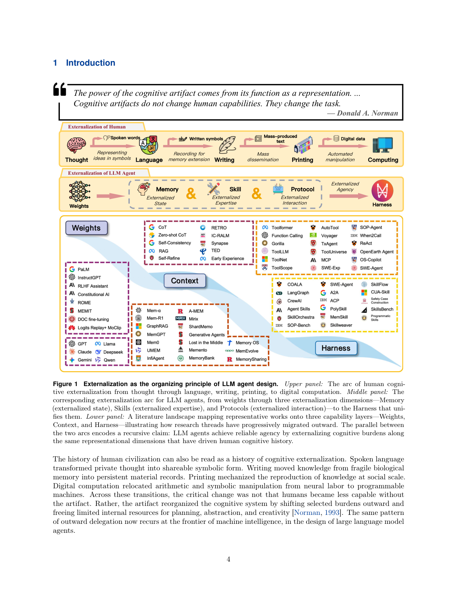
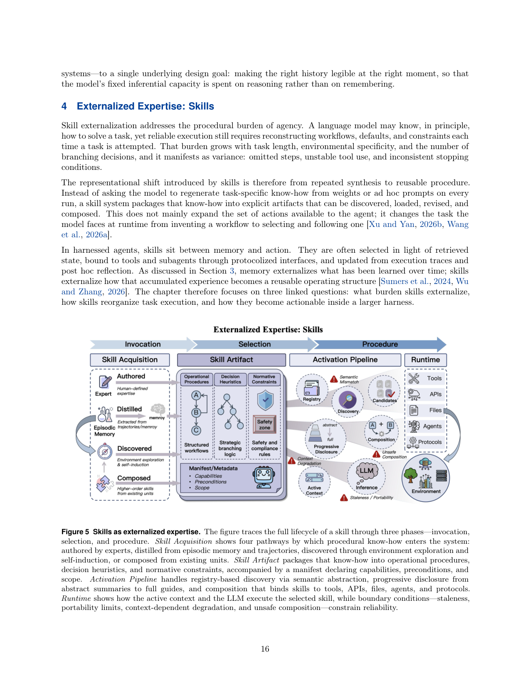

`externalization_survey | Externalization in LLM Agents: A Unified Review of Memory, Skills, Protocols and Harness Engineering | SJTU + 上海创新研究院 + 中山大学 + CMU + OPPO（Chenyu Zhou 等，通讯 Weiwen Liu / Jianghao Lin / Weinan Zhang）| arXiv:2604.08224v1 [cs.SE], 2026-04-09，54 页综述 | 主题线：本调研「综述锚」（A 栏分类法来源），覆盖 L1–L7 全线 · 相关性 极高（taxonomy 基座）`

> 本篇是**综述锚**。按任务指令，重点抽它对 **memory / skill / protocol / harness** 的分类法供全景 A 栏使用。下文除标准三层外，专设「A 栏分类法速查」小节。

══ 第一层：一眼看懂 [light] ══

- 🟦 **TL;DR**：【原文】这篇综述提出一个统一视角——**「外化（externalization）」**——来解释近年 LLM Agent 的进步。核心论点(§1)：现在 Agent 变强，往往不是改模型权重，而是**把原本要模型"在脑子里硬扛"的认知负担，搬到模型外部的持久、可检查、可复用的结构里**。它把外部结构分成三类 + 一个统一层：**Memory（外化"状态/时间连续性"）、Skill（外化"流程性专长"）、Protocol（外化"交互结构"）**，三者都跑在 **Harness（统一运行时/编排层）** 里。理论锚是 Norman 的「认知人造物（cognitive artifact）」：外部工具不是放大内部能力，而是**改变任务本身**——把"回忆"变成"识别"，把"即兴生成"变成"组合",把"临时协调"变成"结构化契约"(§1, 图1)。
- **最巧的一步**：【推断，依据 §1+§2.4】把"从权重→上下文→Harness"的工程演化史，统一收敛到**一条 Norman 式"表征变换(representational transformation)"主线**。抽掉这条主线,全文就退化成又一篇"罗列 memory/skill/protocol 各做了啥"的拼盘综述(它自己在 §1 明确说不想只做 component-level survey)。正是"外化=把难任务重新表征成模型现有能力能可靠处理的形式"这个统一判据,让它能解释**为什么**每次架构外移会发生、以及各模块如何耦合竞争(§7)。

══ 第二层：为什么做（写透） ══

- **研究背景**(§1–§2)：领域叙事长期是"更大模型 / 更好训练 / 更长推理链"。但实践中很多可靠性增益**根本没动 base model**,而来自改造模型周围环境:加持久记忆、组织可复用技能、标准化工具接口、约束执行、埋点观测、用显式控制逻辑路由工作(§1)。于是问题从"模型多强?"变成"哪些负担已被外化,使模型不必每次内部重解?"
- **解决的具体痛点**(§1)：未加持的 LLM 有三个反复出现的错配,正好对应三条外化维度——① 上下文窗口有限、会话记忆弱/无 → **连续性问题**(memory 解);② 长多步流程常被"重新推导"而非"一致执行" → **方差问题**(skill 解);③ 与工具/服务/协作者的交互靠自由 prompt 很脆 → **协调问题**(protocol 解)。
- **相关工作 & 各自不足**(§1)：已有综述只照亮局部切片——RAG 综述、deep search、tool learning、宽泛 Agent 架构综述、protocol 互操作综述。最近的概念桥是 **CoALA**[Sumers 2024]。**缺口**:没有一个统一账本说明"为什么这些发展都在朝外化收敛,以及这种收敛如何重塑 Agent 的定义"。
- **动机链**(§2)：权重层(知识/流程/策略耦死在静态参数,难选择性更新/组合/治理)→ 上下文层(prompt/RAG 灵活但窗口有限、"lost in the middle"、会话即焚)→ Harness 层(持久基础设施)。每一步外移都是对"模型内部不可靠"的**错配响应**:LLM 擅长灵活综合与对给定信息推理,弱于稳定长期记忆、流程可重复、受治理的外部交互。所以外化是"在模型周围搭一个更大的认知系统",而非替换模型(§2.4,呼应 CoALA)。
- **与最近邻(CoALA)的 Δ**：【推断,依据 §1 结尾+§2.4】CoALA 是认知架构视角(把 Agent 拆成 memory/action/decision 模块);本篇的关键差异是引入 **Norman「认知人造物」+ Kirsh「互补策略」** 作为**统一解释机制**,并补上 CoALA 未强调的两件事:(a) **Harness 作为统一层**(不是第四种外化,而是承载三者的运行时);(b) 三模块间的**系统级耦合与资源竞争**(§7 的 6 条流 + 上下文预算争夺)。差异有用之处:它能预测**失效如何级联**(中毒记忆→坏技能→污染记忆的正反馈环)和**何时该外化/何时该收回**(§8.1 frontier 双向移动)。

══ 第三层：怎么做 + 靠不靠谱 ══

> 综述无"方法流水线/实验",此层改述其**分析框架的逻辑骨架**与**论证可靠性**。

- **框架骨架(§3–§6)**：四章分别把三种外化 + Harness 讲成"外化了什么负担 / 设计空间如何演化 / 如何耦合进 Harness / 作为认知人造物意味着什么"四问。每章都收在"X as Cognitive Artifact"小节,把工程现象回扣到 Norman 表征变换(memory: recall→recognition; skill: 重复合成→可复用流程; protocol: ad-hoc→结构化契约)。
- **逐组件必要性(综述视角)**：
  - **Memory(§3)**：外化"时间负担"。内容四维 + 架构四范式(见下速查)。关键论断【原文 §3.4】:**检索质量比存储容量更重要**——大存储+弱检索仍给模型"错误的问题表征";成功判据不是"存了多少"而是"是否让当前决策可读(legible)"。失效模式被解释为**表征设计失败**(陈旧/过度抽象/欠抽象/中毒记忆),而非实现 bug。
  - **Skill(§4)**：外化"流程负担"。三成分(操作流程/决策启发式/规范约束)、三阶段(原子原语→大规模原语选择→打包专长)、五步外化(规范→发现→渐进式披露→执行绑定→组合)、四获取路径(authored/distilled/discovered/composed)。关键边界条件【原文 §4.5】:语义对齐、可移植性与陈旧、**不安全组合**(公共 skill 生态有大量 prompt 注入/数据外泄/供应链风险——SkillProbe/SkillsBench 实证)、上下文相关退化。明确区分:**tool 暴露操作、protocol 治理"如何描述/调用"、skill 编码"一类任务该如何执行"**。
  - **Protocol(§5)**：外化"交互负担"。分 Agent-Tool(MCP)、Agent-Agent(A2A)、Agent-User 三类契约。把模型输出从"待解释的语言"变成"显式接口内的机器可读动作提案"。
  - **Harness(§6)**：统一层,**不是第四种外化**,而是承载三者的运行时。六个分析维度:Agent loop/控制流、沙箱与执行隔离、人类监督与审批闸、可观测性与结构化反馈、配置/权限/策略编码、上下文预算管理。
- **关键机制——§7 跨模块分析(对本调研最有用)**：
  - **6 条两两耦合流**:memory→skill(经验蒸馏出技能)、skill→memory(执行 trace 回写)、skill↔protocol(技能经协议接口绑定执行)、memory→protocol(历史成功率决定路由:本地/工具/委派)、protocol→memory(结果同化)、protocol→skill(接口标准化后催生新技能,如 HashiCorp Agent Skills)。
  - **三个系统级动态**:① **自强化正反馈环**(更好记忆→更好技能蒸馏→更丰富 trace→更好记忆…,但也会**放大错误级联**,单模块质控拦不住,需 Harness 级干预);② **模块争夺同一稀缺资源=上下文窗口**(memory 检索/skill 加载/protocol schema 都占 token,扩一个必压其它,需预算分配);③ **不同时间尺度**(protocol 同步快 / skill 在任务边界加载 / memory 蒸馏与 skill 进化跨会话慢)。
  - **§7.2 I/O 视角**:memory=上下文输入、skill=指令输入、protocol=动作 schema(输出边界);对应**三类可分离的失效**(检索错=输入选择错 / 技能错=流程指导错 / 协议错=动作 schema 错)——这个可分离性让多模块系统可调试归因。
- **§7.3 参数化 vs 外化 的权衡空间(硬货)**:不是"智能该在模型还是基础设施"的零和,而是**系统分区问题**——按四维决定某负担该放哪:① **更新频率/时间衰减**(快变的 API/组织/环境状态外化;连续微调追新会灾难遗忘且频率上不实际——直接点名 catastrophic forgetting);② **复用性/多 Agent 可移植**;③ **可审计/治理/对齐**(外化约束=接口级**确定性**执行 vs RLHF=**概率性**行为塑形);④ **延迟/简洁/上下文负担**。最优分区**不固定**,随模型与基础设施成熟动态移动(§8.1)。
- **假设与失效边界**：【原文 §1】明确声明立场是**务实的工程视角**,只借用 distributed/extended cognition[Clark&Chalmers 1998] 的工程洞见(Agent 与环境的边界是有性能后果的设计选择),**不承诺其更强的本体论主张**。【推断】"X as Cognitive Artifact"四小节作者自己标注为**理论解释而非实证**(§4.7 开头明说"primarily theoretical rather than directly empirical"),即外化"为何有效"的认知科学论证是**类比性**的,缺直接对照实验——这是综述自觉的失效边界,诚实。
- **祛魅总结**：
  - **真贡献(硬货)**：(a) 一个**能解释"为什么"和"如何耦合"的统一框架**,不止罗列;(b) §7 的 6 流 + 3 系统动态 + I/O 失效分类,是把"Agent 工程"重述为"Harness 工程"的可操作语言;(c) §7.3 系统分区四维 + §8.3 自进化三层级/四路径,给出清晰的设计判据与研究地图。
  - **包装/营销成分**【推断】:(1) "human cognitive externalization arc"(口语→文字→印刷→计算)与 Agent 外化的平行类比(图1)修辞优雅但**论证力有限**,更多是叙事框架而非可检验命题;(2) 把 memory/skill/protocol 强行对齐 recall→recognition / 生成→组合 / ad-hoc→契约 三种"表征变换",个别归类(尤其 protocol 那条)略牵强。(3) 作为 cs.SE 综述,**无任何新实验/新数据**,所有论断靠引文与逻辑——这本就是综述本分,但读者别误以为有实证新增。

══ 结构化抽取 ══

### 🅰 A 栏分类法速查（供全景汇总直接引用——本篇为分类法来源）

**总框架(§1, 图1/图3)**：\(Weights → Context → Harness\) 三层能力演化；Harness 内含三种外化 + Harness 自身为统一层。

| 外化维度 | 外化的负担 | 表征变换 | 子分类 |
|---|---|---|---|
| **Memory** 外化状态 | 时间连续性 | recall→recognition | **内容四维**：working context（工作上下文/实时态）· episodic experience（情景经验）· semantic knowledge（语义知识）· personalized memory（个性化记忆） **架构四范式**(§3.2，从"存在"到"策略")：① Monolithic Context ② Context + Retrieval Storage ③ Hierarchical Memory & Orchestration（含 OS 式 hot/cold 分层 MemGPT/MemoryOS + 功能语义解耦 MemOS/MIRIX）④ Adaptive Memory Systems（动态模块 MemEvolve/MemVerse + 反馈策略优化 MemRL/MoE 门控） |
| **Skill** 外化专长 | 流程方差 | generation→composition | **三成分**(§4.1)：operational procedure（操作流程/骨架）· decision heuristics（决策启发式/分支策略）· normative constraints（规范约束/合规边界） **三阶段**(§4.2)：原子执行原语→大规模原语选择→**skill 即打包专长** **五步外化**(§4.3)：specification（SKILL.md/manifest）→ discovery（注册+检索）→ progressive disclosure（渐进式披露,名→manifest→全文）→ execution binding（绑定 tool/file/subagent/protocol）→ composition（串/并/条件/递归） **四获取路径**(§4.4)：authored（人写）· distilled（从 trace/记忆蒸馏）· discovered（环境探索自诱导,如 Voyager）· composed（组合既有技能升格） |
| **Protocol** 外化交互 | 协调脆性 | ad-hoc→structured contract | (§5.2) Agent-Tool（MCP）· Agent-Agent（A2A）· Agent-User · Others |
| **Harness** 统一层（非第四种外化） | 运行时可靠性 | — | (§6.2) 六维：agent loop/控制流 · 沙箱/执行隔离 · 人类监督/审批闸 · 可观测性/结构化反馈 · 配置-权限-策略编码 · 上下文预算管理 |

**跨模块(§7)**：6 条耦合流（mem→skill→mem 蒸馏环 + skill↔protocol 绑定 + mem→protocol 路由 + protocol→mem 同化 + protocol→skill 催生）；3 系统动态（自强化正反馈/错误级联 · 上下文预算争夺 · 多时间尺度）。
**自进化(§8.3)**：三层级 = module（调内部策略：检索粒度/技能排序/路由规则）· system（重构 pipeline：调度/执行序/资源分配）· boundary（Harness 范围伸缩）；四技术路径 = RL（优化离散运行时策略）· program synthesis（失败后改代码补丁+沙箱测试）· evolutionary（搜 Harness 拓扑）· imitation（从专家/强模型 log 蒸馏更好编排先验）。

- 🎯 **机制速览 6 轴** [light]（综述本身不"学",此处刻画它**所综述的设计空间**）：

| 维度 | 本综述刻画的设计空间 |
|---|---|
| **学什么信号** | 全谱：环境 reward（RL 调运行时策略）/ 自反思（self-refine、失败 trace）/ 人类（authored skill、审批闸、纠正）/ 经验库（episodic→semantic 蒸馏）/ 其它 Agent（shared memory/skill, stigmergy） |
| **改什么** | 全谱：prompt / memory / skill / protocol / harness 编排逻辑；明确把"改权重"列为**可被外化替代**的旧范式（§7.3 指出连续微调追快变知识会灾难遗忘） |
| **何时改** | 多时间尺度并存：protocol=在线 per-step（同步快）/ skill=任务-子任务边界加载 / memory 蒸馏与 skill 进化=跨会话离线慢（§7.1） |
| **免梯度?** | **以免梯度为主旋律**：外化的核心主张就是"不动权重也能涨可靠性"；但 §8.3 把 RL（带梯度）列为自进化路径之一 → **混合**（外化为主、梯度可选） |
| **记忆-技能生命周期** | 完整：写入→（提升 promote 至 skill）→检索/渐进披露→遗忘/淘汰/弃用（deprecation）→共享（私有脚手架→共享基础设施 §8.5）。记忆与技能边界明确：trace 被 promote 成显式可复用指导后即归 skill 层（§3.1 结尾） |
| **防遗忘机制** | 综述层面把"外化"本身定位为**绕开参数遗忘**的手段（把快变知识放外部存储而非权重，避免 catastrophic forgetting，§7.3）；对**外化结构自身的遗忘**则靠：provenance 追踪、确定性 rollback、回归测试、审查闸（§8.4 治理）。**未把几何共识/merging/KL 投影等参数级防遗忘列为重点**（不在其外化主轴内） |

- ⑦ **开源代码 + 框架/harness**：**未开源/不适用**——纯综述(cs.SE),无代码仓库或模型发布。【原文未提供 code 链接】
- 💰 **资源/成本与可扩展性**：综述无训练成本。但 §8.4 把"成本"作为一级议题:**外化非免费**——每加一层 memory/API schema/安全规则都带延迟与推理开销,过头后模型花在"发现/解析/协调模块"的力气超过解题本身(over-retrieval 灌噪、verbose skill 抢预算、tool sprawl 制造消歧问题)。设计目标应是**"高效且效用为正"而非"最大外化"**(minimal sufficiency / lazy loading / budget-aware routing)。
- 🎯 **对「探索-巩固」idea 对标** [light]：**最强分类法支撑 + 视角竞品的混合**。
  - **支撑/可借组件**：(a) §3.1 把"trace 被 promote 成显式可复用指导即归 skill 层"——这与本项目 TSRD"把成功路径选择/恢复巩固为可复用结构"同构,可借其"memory=证据库、skill=被提升的可复用流程"的边界定义;(b) §7 的 6 流 + 上下文预算争夺,可直接做本项目"探索(写入经验)↔巩固(蒸馏成技能/参数)"两阶段的系统级框架语言;(c) §8.3 自进化"四路径"中 imitation(从强模型 log 蒸馏编排先验)= OPD/蒸馏精神,RL 路径 = 探索信号来源。
  - **竞品视角**：本综述的**主张是"巩固应尽量外化到 memory/skill 而非权重"**(§7.3 明示连续微调追快变知识会灾难遗忘),这与本项目"巩固进参数(MTP+OPD)"是**对立路线**。【推断】对标价值正在于此:它给出了"何时该外化、何时该收回权重"(§8.1 frontier 双向)的判据——本项目需论证 reasoning 类巩固为何属于"该留/该收回参数"的那侧(稳定、慢变、深度集成的能力),而非快变知识。这是一个必须正面回应的反方论点。
  - **缺口**：综述对"参数级巩固"几乎只当作要被替代的旧范式,**未讨论 reasoning skill 巩固进权重的正面案例**,也未涉及 MTP/前瞻探针类机制——这是本项目可填的差异化空间。
- 🔭 **开放问题/未来方向**：
  - 【原文 §8】六问:① 参数化↔外化边界走向 + 多模态拓宽前沿(MemVerse/MuSEAgent/TED 等多模态记忆与蒸馏);② 从数字 Agent 扩到具身(VLA 作"小脑"技能模块,LLM 作"大脑"——cerebrum-cerebellum 分工,与外化维度一一对应);③ **如何让外化过程更自主(自进化 Harness,三层级四路径)**;④ 外移越多积累的成本与风险(认知开销 + 安全:memory poisoning / skill injection / protocol spoofing);⑤ 生态尺度:私有脚手架→共享基础设施(transactive memory、shared skills、stigmergy 集体学习);⑥ 如何度量外化质量(系统质量不仅看"能做什么",还看"多透明、多可逆")。
  - 【推断】最值得本调研深挖的:**§8.3 自进化 Harness + §7.3 分区判据**是把"自进化 Agent"从零散技巧组织成"在哪个层级(module/system/boundary)、用哪条路径(policy/program/structure/prior)进化"的二维地图——可作为全景 SURVEY 的顶层骨架。
- 🖼 **关键图 top-2** [light]：

· 这是**原文 Figure 1**(整页 p.4 渲染)。三联面板:上=人类认知外化史(思想→语言→文字→印刷→计算),中=Agent 外化弧(Weights→Memory/Skill/Protocol→Harness),下=文献地图把代表性工作钉到 Weights/Context/Harness 三层。**选它因为它一图道尽全篇中心论点**(外化主线 + 三维 + Harness 统一层 + 历史平行类比),是 A 栏分类法的总览图。

· 这是**原文 Figure 5**(整页 p.16 渲染)。横向三相:**Skill Acquisition**(authored/distilled/discovered/composed 四路径)→**Skill Artifact**(操作流程/决策启发式/规范约束 + manifest)→**Activation Pipeline**(注册发现/渐进披露/组合绑定)→**Runtime**,底部标注 staleness/可移植/不安全组合/上下文退化四类边界条件。**选它因为 skill 生命周期是"自进化 Agent"最核心的一条线**(获取→检索→淘汰→共享),且与本项目"巩固成可复用技能"的对标点最密集,信息密度最高。

---
〔元数据核验〕arXiv:2604.08224v1，cs.SE，标题/作者/机构/日期(2026-04-10)/54 页均来自下载 PDF 正文页眉与首页，非 WebFetch 摘要。图号(Figure 1 / Figure 5)、章节号(§3.2/§4.3/§7/§8.3)、分类法术语(working context/episodic/semantic/personalized；monolithic/retrieval/hierarchical/adaptive；authored/distilled/discovered/composed)均直引正文。
