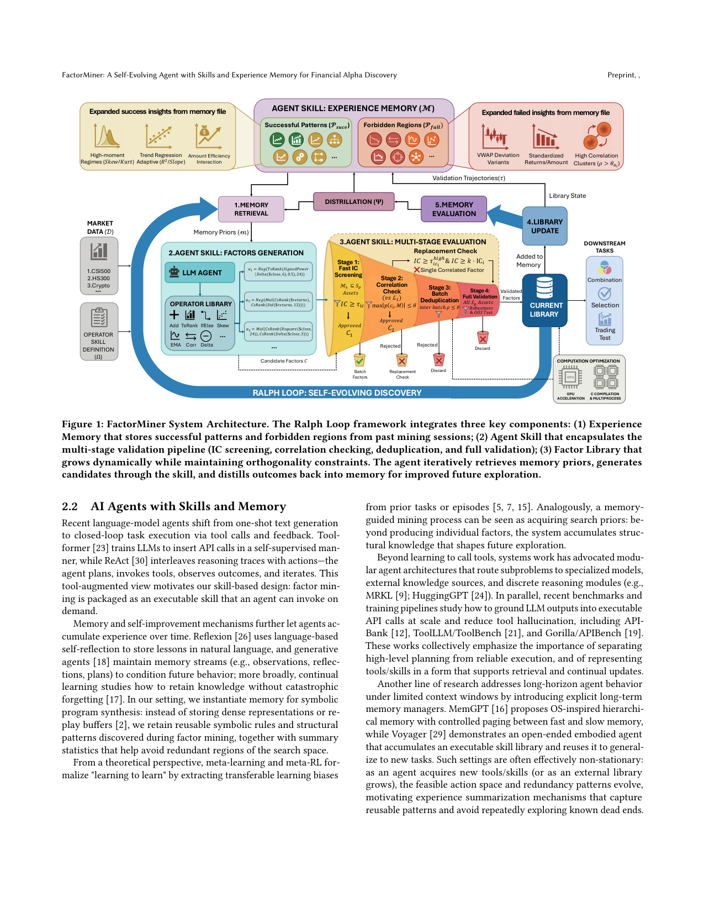
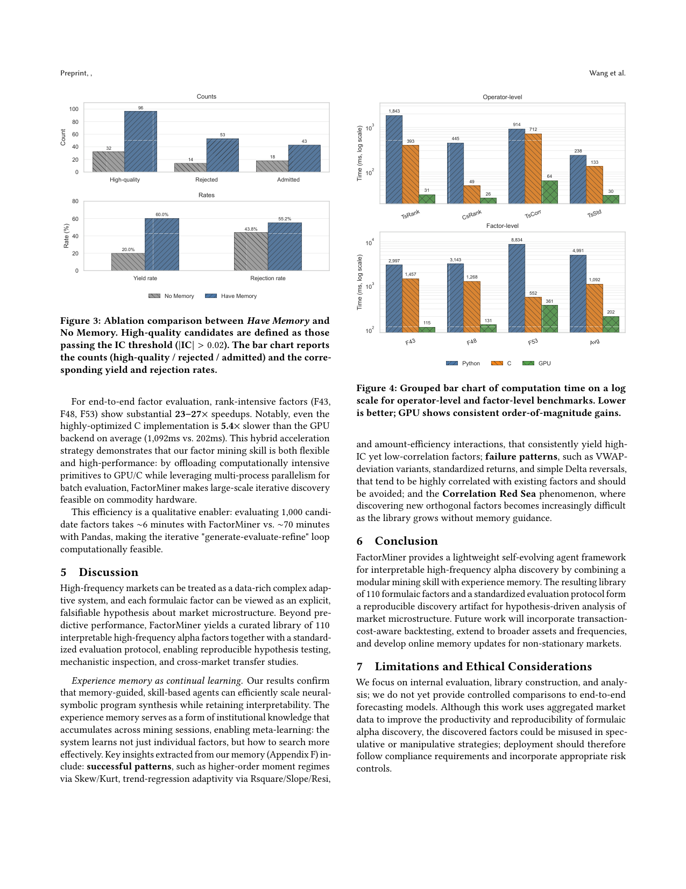

`factorminer | FactorMiner: A Self-Evolving Agent with Skills and Experience Memory for Financial Alpha Discovery | 清华大学(Xiao-Ping Zhang / Shao-Lun Huang 组) · 鹏城实验室 | 2026-02·arXiv v1(2602.14670, q-fin.TR)·Preprint(投 ACM) | 主题线 L?（自进化 agent：技能库 + 经验记忆 + Ralph Loop 闭环，金融因子挖掘域）· 相关性 Med-High`

> 三标注约定：【原文】= 论文明说；【推断】= 我的有据判断(附依据)；【待核】= 拿不准的关键事实。

══ 第一层：一眼看懂 [light] ══

- 🟦 **TL;DR**：量化投资里"公式化 alpha 因子挖掘"——搜索空间巨大、还要可解释/可审计的因子;最头疼的是**因子库越大越难找到新信号**(冗余高,"相关性红海")。传统遗传编程/RL 搜索**不会跨会话积累经验**,每次都从头重复试错。FactorMiner 把因子挖掘做成一个**自进化 LLM agent**:① **模块化技能(Skill)架构**——把领域知识(60+ 金融算子库 + IC 阈值/相关性检查的多阶段验证流水线)封装成 agent 可按需调用的可执行工具,无需重训模型;② **结构化经验记忆(Experience Memory)**——把历史挖掘的结果蒸馏成"**成功模式(总能过质量门的因子模板)**"和"**禁区(与现有库高相关的因子族)**",且始终维护**全局因子库视角**(决定挖什么时看"候选能否补充现有库"而非孤立优化单因子);③ 用 **Ralph Loop 范式**(retrieve→generate→evaluate→distill,检索-生成-评估-蒸馏)闭环自进化:每轮挖掘都用记忆先验引导探索、再把结果蒸馏回记忆,形成正反馈。在 A 股(CSI500/1000、HS300 分钟级)+ Binance 加密(10 分钟级)上构造出多样、低冗余、高质量的因子库,并开源 110 个 A 股因子。【原文 Abstract/§1/§2】
- **最巧的一步**:**经验记忆里存的不是"成功因子"本身,而是"成功模式 + 禁区(forbidden regions)"这种结构化先验,并把它注入下一轮 prompt 来引导/裁剪搜索方向**(§"Experience Memory",对应 Fig 1)。配套消融最有说服力(Fig 3):**Have Memory 高质量候选产出率 60% vs No Memory 仅 20%(检索算子把搜索空间"映射"好、把探索导向高产区)**;同时 Have Memory **反而更激进地拒绝冗余(55.2% vs 43.8%)**——演化算子充当"战略过滤器",优先发现独特信号而非堆数量。抽掉"经验记忆(成功模式 + 禁区)"这一步,系统就退回成"普通 LLM 因子搜索"、产出率腰斩且冗余上升;正是"记忆 = 可复用的搜索先验"让自进化成立。【原文§4.3, Fig 3】

══ 第二层：为什么做（写透，重点） ══

- **研究背景**：发现可预测的 alpha 因子是量化交易/组合构建的核心。本文把"公式化因子挖掘"明确定位成"**自进化 AI agent**"的任务(§1)：每个因子是市场字段(close/volume/VWAP…)上、由 60+ 算子组成的**显式表达式**；相比端到端神经预测器，公式化因子可**人工审计 + 跨市场组合泛化**(监管/风控刚需)。【原文§1】
- **解决的具体痛点**(§1 列三条 + 一条贯穿痛点)：**①搜索空间巨大**——公式表达式空间随算子组合/参数**组合爆炸**；**②知识积累差(核心)**——传统搜索(遗传编程 GP、强化学习 RL)**不能跨会话保留/复用洞察**，每次从头重复试错("knowledge forgetting")；**③可解释性约束**——金融从业者要透明可审计的显式公式(不能黑盒);**④贯穿痛点"相关性红海(Correlation Red Sea)"**——现有方法**孤立地优化单个因子**，不看"全局因子库视角"，导致**库越大越冗余**、新正交因子的可行域 \(P_{orth}=\{\alpha:\max_{g\in L}|\rho(\alpha,g)|<\theta\}\) 急剧收缩，GP/RL **因无机制追踪已探索区/失败模式而困在红海**。核心研究问题(§1 原文)："agent 如何在高效探索巨大程序空间的同时，**保持因子库的全局视角**并**跨会话自主积累结构化知识**？"
- **相关工作 & 各自不足**(§2)：**自动因子发现侧**——①**手工因子(Alpha101/Alpha191)**：可解释、低相关(15.9%)但**仅限日频、复杂嵌套仍不透明、高频市场缺现成因子库**；②**遗传编程(GPLearn)**：把公式当程序交叉/变异，但**只作用于语法而非行为→收敛慢、语义引导弱**；③**ML 资产定价**：预测强但**不透明难审计**；④**RL 搜索(IC/ICIR 当 reward)**：要额外训练 + 重复评估开销，且**仍难持久复用结构模式**，库增长后探索趋于重复；⑤**LLM 驱动框架(AlphaAgent)**：生成-精炼公式，是最近邻但**未显式持久复用跨会话结构模式**。**Agent 侧**——Toolformer/ReAct(工具增强→启发本文 skill 设计)、Reflexion/Generative Agents(语言反思/记忆流→启发经验记忆)、Voyager(可执行技能库复用)、MemGPT(OS 式分层记忆)；本文把这些**实例化到"符号程序合成"**：不存稠密表示/replay buffer，而是**存可复用的符号规则 + 结构模式 + 避冗余的统计**。【原文§2.1/§2.2】
- **动机链**：现状(GP/RL/LLM 都能搜因子)→ 缺陷(都孤立优化单因子、不积累跨会话知识、库一大就陷相关性红海)→ 为什么不用更简单的现成做法？**纯 GP/RL**=无记忆、重复试错、困红海；**纯 LLM 一次性生成**=不复用历史成功/失败模式；**把领域逻辑硬编进 agent 推理环**=生成与验证纠缠、LLM 算指标会幻觉(算错 IC/Sharpe)→ 所以需要**(a) 把因子挖掘封装成可独立升级的模块化 skill(确定性代码做验证、杜绝指标幻觉)、(b) 用结构化经验记忆存"成功模式 Psucc + 禁区 Pfail"并维护全局库视角、(c) 用 Ralph Loop(检索-生成-评估-蒸馏)把记忆先验注入下一轮、把验证结果蒸馏回记忆，形成"学会搜索"的正反馈**。【原文§1 contributions/§3.2/§3.4】
- **与最近邻工作的 Δ**：**最近邻是 AlphaAgent(LLM 驱动的提案-精炼因子框架)**。Δ 在一个关键点：AlphaAgent 等**不显式持久地跨会话复用结构模式**(每次探索缺"记得上次什么有效/什么是红海")；FactorMiner 引入**结构化经验记忆 \(M=(\)成功模式 \(P_{succ}\) + 禁区 \(P_{fail}\) + 库状态 \(S\) + 战略洞察 \(I)\)**，并用**蒸馏算子 \(\Psi\) 把验证轨迹回写**(Eq.6)，让"记忆诱导程序空间的概率测度收缩(probability measure contraction)、把采样质量推向正交流形 \(P_{orth}\)"(§3.1)。这差异有用：Fig 3 消融直接证明——**有记忆时高产率 60% vs 无记忆 20%(3× 高质量候选)**，且**更激进拒冗余(55.2% vs 43.8%)**，即记忆同时提升探索效率与多样性，这是"无持久记忆"做不到的。【原文§3.1 Eq.5-6 / §4.3 Fig 3】

══ 第三层：怎么做 + 靠不靠谱 ══

- **方法流水线**(§3/Algorithm 1 Ralph Loop，输入算子库 \(\Omega\)+记忆 \(M\)+目标库大小 \(K\)→输出因子库 \(L\))：①**Step1 记忆检索**：从 \(M\) 和当前库 \(L\) 取上下文相关的记忆信号 \(m=R(M,L)\)(以紧凑自然语言模板存"recommended/forbidden directions"，按当前库诊断 + 近期拒绝原因匹配检索)；②**Step2 引导生成**：LLM agent 用记忆条件策略 \(\pi(\alpha|m)\) 调算子库采样一批候选 \(C\)；③**Step3 多阶段评估**(skill 内确定性代码)：Stage1 小资产子集快速 IC 筛(\(|IC|\geq\tau_{ic}\))→ Stage2 与库 \(L\) 做相关性检查(\(\max|\rho|<\theta\))→ **Stage2.5 替换检查**(高相关但更优的候选可替换库内劣者，条件 \(\Phi(\alpha)\geq\Phi(g^*)+\Delta\))→ Stage3 批内去重 → Stage4 仅对幸存者全资产全验证 + 收集轨迹 \(\tau\)；④**Step4 库更新**：录入通过的因子 \(L\leftarrow L\cup C_{admitted}\)；⑤**Step5 记忆进化**：\(M\leftarrow E(M,F(\tau))\)——形成算子 \(F\) 把轨迹蒸馏成 \(P_{succ}/P_{fail}\)(Eq.7)，进化算子 \(E\) 整合去冗余/降级低效条目(Eq.8，如某 VWAP 变体虽过门但与库内 0.82 相关→重分类进 \(P_{fail}\))；循环至 \(|L|\geq K\) 或预算耗尽。系统底层用 **GPU 算子 + C 编译(Bottleneck) + 多进程**加速评估。【原文§3.2-3.4 / Algorithm 1】
- **逐组件必要性**：**①经验记忆(F/E/R 三算子)**——**有受控消融**(§4.3 Fig 3)：No Memory 变体禁用 F/E/R(退化为标准 LLM 进化)，结果高产率 20% vs Have Memory 60%、拒冗余 43.8% vs 55.2%——证明检索算子 R"映射搜索空间导向高产区"、进化算子 E 当"战略过滤器优先独特信号"，是核心且必要(消融用放松阈值 \(|IC|>0.02\)、\(\theta=0.85\) 以保证样本量)；**②模块化 skill(确定性验证)**——**无消融但有定性论证**：把评估卸载到确定性代码**杜绝 LLM 指标幻觉**(IC/Sharpe 数学严格)、支持跨市场配置切换、可独立优化后端不重训 LLM；**③多阶段评估流水线**——**无单独消融**：Stage1 快筛 + Stage4 仅验幸存者是效率设计(评 1000 因子 ~6min vs Pandas ~70min)；**④Stage2.5 替换机制 + 全局库视角准入**——**无单独消融**：维持库正交性(\(Avg|\rho|\) 0.30-0.31)、允许优质替换劣质，是"全局视角"的落地，但其独立贡献未被隔离;**⑤GPU/C 加速**——**有 benchmark**(Fig 4)：GPU 比 Pandas 8-59×、比 C 平均 5.4×(TsRank 1843ms→393ms→31ms)，是"可行性使能器"。**关键缺失**：除"有无记忆"这一项主消融外，**skill/多阶段/替换机制均无逐项消融**，"全局库视角"vs"孤立优化"也无直接对照实验(虽 Table 1 的低 \(Avg|\rho|\) 间接支持)。【原文§4.3-4.4 / Fig 3-4】
- **关键机制/公式**：**①正交库合成目标(Eq.4)** \(L*=argmax Σ_{α∈L}Φ(α) s.t. ∀i≠j:|ρ(αi,αj)|<θ\)——直觉：不是"找最强单因子"，而是"在两两相关\(<\theta\) 的约束下、最大化整库总预测质量"，把"多样性"写进目标本身。**②记忆诱导测度收缩(Eq.5-6)** \(α∼π(α|m_t)，m_t=R(M_t,L_t)，M_{t+1}=Ψ(M_t,τ_t)\)——直觉：记忆 m 当 prompt 级约束去**重塑 LLM 的采样分布**，把概率质量从"红海"挪向"正交流形 \(P_{orth}\)"；蒸馏算子 \(\Psi\) 每轮更新 agent 的"信念分布"，使未来探索偏向高效用低冗余区——本质是"用语言化先验做软性搜索空间剪裁"。**③Correlation Red Sea / \(P_{orth}\)**——直觉：库越满，"还能正交"的可行域越小，普通搜索没"地图"就反复撞红海；记忆里的 \(P_{fail}\) 就是"红海地图"，让 agent 主动绕开。【原文§3.1 Eq.4-6】
- **实验与证据**(§4，A 股 + 加密)：**数据集**=A 股 CSI500/CSI1000/HS300 的**10 分钟 K 线(>2500 万数据点)** + Binance 64 主流币 10 分钟线；训练 2024-Q1~Q4、测试 2025(held-out)；预测目标=下一个 10 分钟 open-to-close 涨跌比。**baseline**=Alpha101(Classic/Adapted)、Random Formula(RF)、GPLearn、AlphaForge、AlphaAgent；**统一准入规则 + 等量因子集 + 统一评估引擎**(公平)；LLM 提案用 **Gemini 3.0 Flash**。**支撑核心主张的关键实验**：①**因子质量与多样性(Table 1，严格协议：Top-40 在 CSI500-2024 选定后冻结、跨 4 市场评)**——FactorMiner 在**全部 4 市场最优**(CSI500 IC/ICIR **8.25%/0.77** vs AlphaAgent 5.90%/0.46、GPLearn 6.04%/0.43)，且 \(Avg|\rho|\) **0.30-0.31(A 股)/0.25(crypto)**、相关性尾部受控(\(|\rho|\approx0.44\text{-}0.45\))——说明**增益非靠近重复信号堆出来**；②**跨市场鲁棒(§4.2.2)**——crypto(24/7、无涨跌停的异质微结构)上仍有竞争力(单因子 IC 3.82%/ICIR 0.28，IC 加权组合 9.48%/0.62)，暗示捕到跨资产不变的价量动态；③**记忆消融(Fig 3)**=核心因果证据(见上 60% vs 20%)；④**效率(Fig 4)**。**Baseline 公平性**：统一算子库/字段/准入/评估引擎，等量因子集(不足则补 IC 最优者)，较公平。**"看着强但没回答核心问题"的点**：① **作者自承(§7 Limitations)"不提供与端到端预测模型的受控对比"**——所以"比 ML 资产定价更好"无直接证据，只与公式化/agent baseline 比；② Table 1 报的是**绝对值 IC 摘要 |E[IC]|**(非带符号)，对"方向稳定性"的刻画偏宽松；③ "自进化/持续学习"主要靠**单次 Fig 3 消融 + 定性洞察(Appendix F)**支撑，**无"随会话数增长，库质量/效率单调提升"的纵向曲线**(即"越搜越会搜"的时间维证据缺失)；④ 110 因子库是真实交付物但**回测未计交易成本**(§7 自承 future work)。【原文§4.1-4.4 / Table 1 / Fig 3-4 / §7】
- **假设与失效边界**：**①【原文§7 Limitations】无端到端对比 + 未计交易成本 + online memory 更新是 future work**——当前记忆更新是按批离线进行，**面向非平稳市场的"在线记忆更新"尚未实现**(暗示市场 regime 漂移时记忆可能过时)；**②【推断】记忆质量依赖蒸馏算子 \(F/\Psi\) 的归纳质量**——\(P_{succ}/P_{fail}\) 是 LLM 从轨迹蒸馏的自然语言模板，若蒸馏出错误规律(过拟合某段行情)会把探索导偏，原文未讨论"坏先验"的鲁棒性；**③【推断】高度域专用**——整套依赖金融符号公式 + \(IC/\rho\) 评估，**迁移到非符号、无清晰可微评估指标的域(如开放式推理)不直接适用**；**④【推断】"相关性"作多样性代理的局限**——用 Spearman 相关定义冗余(Eq.3)，对**非线性依赖/共同尾部风险**可能漏判(原文称框架可换其他依赖度量，但当前实现就是线性秩相关)；**⑤【推断】\(\Phi(fitness)\) 的选择影响目标**——Eq.4 的 \(\Phi\) 未在正文固定具体形式(IC/ICIR/Sharpe?)，目标对 \(\Phi\) 敏感。
- **祛魅总结**：**真贡献(硬货)**——【推断】① **把"自进化记忆=可复用搜索先验"这一抽象，在金融因子挖掘域用 Ralph Loop 落地成可工作的闭环**，且 Fig 3 用**唯一一处受控消融**干净证明了"记忆把高产率从 20% 抬到 60% 且更激进去冗余"——对"巩固出的经验能反过来塑造探索"是难得的量化证据；② **"成功模式 + 禁区(forbidden regions)"的双类结构化先验** + **全局库视角准入(Eq.4)** 是简洁有效、可迁移的设计；③ **模块化 skill 把验证卸载到确定性代码杜绝 LLM 指标幻觉** + GPU/C 加速(8-59×)是扎实工程；④ 开源 110 个带显式公式的 A 股高频因子(实打实交付物)。**包装/营销成分**——【推断】① **"self-evolving/continual learning/meta-learning"措辞偏重**：实际只有"按批离线蒸馏记忆"一种机制 + 单次消融，**缺"越搜越会搜"的纵向证据**，且 online 更新还是 future work，"自进化"更像"带记忆的迭代搜索"；② **理论包装(probability measure contraction / decision-theoretic formulation Eq.5-6)** 给"把先验塞进 prompt 引导采样"穿了概率论外衣，**实现层就是自然语言模板检索 + prompt 约束**，数学形式高于实际机制;③ **无端到端对比**(自承)使"competitive performance"的强度有保留；④ 110 因子开源是亮点但**代码仓库链接未在论文给出**(只给 ACM DOI 占位符)。作者对"记忆贡献 + 工程效率"估计准确，对"自进化/持续学习"的理论高度有轻微夸张。整体是一篇**域内落地扎实、单消融有力、但理论包装偏厚、纵向自进化证据不足**的 agent 因子挖掘工作。【推断，依据§4.3 单消融 + §3.1 理论措辞 vs 实现 + §7 自承 limitations】

══ 结构化抽取 ══

- 🎯 **机制速览 6 轴** [light]：

| 学什么信号 | 改什么 | 何时改 | 免梯度? | 记忆-技能生命周期 | 防遗忘机制 |
|---|---|---|---|---|---|
| **环境/任务级量化指标**(因子评估的 IC/ICIR、相关性 ρ、OOS 稳健性等作为"打分";无人类标注、无梯度——把评估结果蒸馏成自然语言/结构化先验) | **外部记忆 + 技能调度**(经验记忆 \(M=\)成功模式 \(P_{succ}\) + 禁区 \(P_{fail}\) + 因子库状态;LLM agent 参数**完全冻结**,只换 prompt 里的记忆先验;技能模块可独立升级) | **在线 per-session 迭代**(Ralph Loop 每轮:检索→生成→并行评估→蒸馏回写;test-time 自进化,无训练阶段) | **是**(纯免梯度;明说"无需重训 LLM backbone";靠 retrieve-generate-evaluate-distill 闭环而非反传) | 写入=每轮挖掘的验证轨迹蒸馏成成功模式/禁区→检索=按当前库状态取相关先验(Memory Priors)注入生成→淘汰/防冗余=因子库准入机制(IC 阈值 + 相关性 \(\rho\leq\theta\) + 批去重 + 替换检查),与禁区共同维护正交性;共享=无(单 agent) | **记忆层面**=禁区(forbidden regions)+ 全局库视角准入,直接对抗"因子库增长导致的冗余/相关性红海"(其声称解决的正是传统 GP/RL 的"knowledge forgetting");**无参数学习→无灾难性遗忘**;无几何共识/merging/KL 投影(不适用) |

- ⑦ **开源代码 + 框架/harness**：**代码仓库未找到**——【原文】全文正则扫描:**ACM DOI 为占位符 `XXXXXXX.XXXXXXX`**,正文唯一相关 GitHub 链接是 **baseline 引用 `github.com/trevorstephens/gplearn`(遗传编程库,非本文代码)**,**未见 FactorMiner 自身代码仓库/项目主页链接**。开源的是**数据产物**——【原文 contributions 明写】"提供 110 个带显式公式的 A 股因子",但**未给获取链接/仓库**。框架/harness:**无训练框架**(纯免梯度 agent);系统栈=**Gemini 3.0 Flash**(提案生成 LLM,除非另说)+ 自研高性能因子评估引擎(**GPU 加速算子 + C 编译 Bottleneck + 多进程**,相对 Pandas 提速 8–59×)。〔本子代理仅深读抽取;因无可达代码链接,无可 clone 项;若后续需引用代码,报告须显式标注"代码链接未在论文中给出"〕【原文§1 contributions / §4.4 / Fig 1 caption】

- 🎯 **对"探索-巩固"idea 对标** [light]：**强支撑 + 可借组件**。FactorMiner 是"**探索(generate 候选)↔巩固(distill 成成功模式/禁区回写记忆)**"闭环(Ralph Loop)的一个域内成熟实例,且 Fig 3 用消融**直接证明"巩固出的记忆先验能显著提升探索效率(产出率 20%→60%)并主动剪掉冗余"**——为"巩固应反过来塑造探索方向"提供干净证据。可借积木:① **把成功经验蒸馏成两类先验(成功模式 + 禁区/forbidden regions)**——"禁区"思想可迁移到本项目"探测过的失败路径/低价值方向应被记下并主动规避";② **全局库视角的准入机制(只接纳能补充现有库的新发现,IC + 相关性 + 去重)**——对应"巩固时要看新经验是否与已有策略正交、避免冗余巩固";③ **retrieve-generate-evaluate-distill 的轻量闭环模板**。缺口:它**不改模型参数、不做蒸馏进权重、域高度专用(金融符号公式)**,且**无 test-time 神经网络层面的探索-巩固**(全在符号/prompt 层)——本项目要补的正是"把这套闭环搬到神经策略权重的探索-巩固"。

- 🖼 **关键图 top-2** [light]：

· 这是**原文 Figure 1**(系统架构主图/pipeline)。完整画出 Ralph Loop 自进化闭环:**①Memory Retrieval(从经验记忆取成功模式 Psucc/禁区 Pfall 先验)→ ②Agent Skill: Factors Generation(LLM agent 调算子库生成候选因子)→ ③Agent Skill: 多阶段评估(Stage1 快速 IC 筛 → Stage2 相关性检查 → Stage3 批去重 → Stage4 全验证,含替换检查)→ ④Library Update(动态扩库并维持正交)→ Distillation Ψ 把验证轨迹蒸馏回经验记忆**。选它因为它一图说清"技能(领域知识封装)+ 经验记忆(成功/禁区)+ 因子库(全局视角)"三件套如何咬合成自进化循环,是全文方法精华。

· 这是**原文 Figure 3**(核心机制消融)。对比有/无经验记忆:**Have Memory 生成 96 个高质量候选(60% 产出率),No Memory 仅 32 个(20%)**;且 Have Memory 虽多产 3×,却**更激进地按冗余拒绝(55.2% vs 43.8%)**——证明检索算子把搜索导向高产区、演化算子充当战略过滤器。选它因为它是全文唯一直接隔离"记忆贡献"的受控实验,把"自进化记忆=可复用搜索先验"的核心主张量化坐实,对"探索-巩固"idea 最有参考价值。
