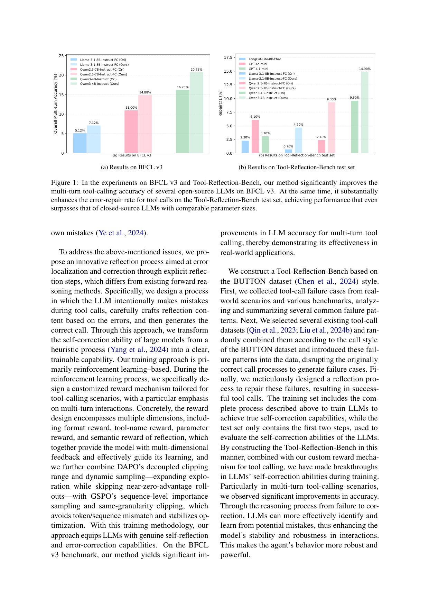
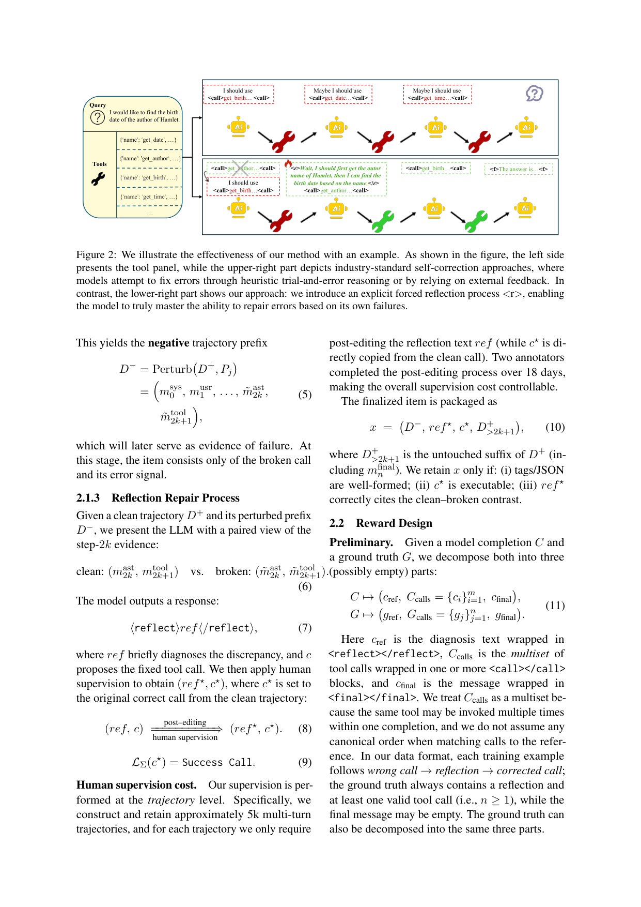

`failure_makes_stronger | Failure makes the agent stronger: Enhancing Accuracy through Structured Reflection for Reliable Tool Interactions | 美团 Meituan(Vision Agent Team + MeiGen AI) | 2026-04(arXiv:2509.18847v3) | L? 推理/自我纠错·工具调用 agent（参数化、RL 训练 DAPO+GSPO）· 相关性 High`

> 档位：**deep**（全字段三层 + 结构化抽取）。所有内容基于已下载 PDF 正文（_txt_failure_makes_stronger.txt，全文 + 附录 A）。

══ 第一层：一眼看懂 [light] ══

- 🟦 **TL;DR**：工具调用 agent 通常只用 SFT 或粗粒度 RL 优化**单次工具调用**，自反思也只是启发式地"让它多想想"。后果是**多轮交互里一旦某次工具调用失败，模型往往重复同样的错而不会恢复**。本文提出 **structured reflection(结构化反思)**：把"从出错到修复"变成一个**一等的、可控的、可训练的动作**——模型先**基于上一步的证据诊断错因**，再**提出一个正确可执行的后续调用**，把策略固化成 **Reflect → Call → Final** 三步。训练用 RL：**结合 DAPO(解耦 clip 范围 + 动态采样，扩探索、跳过近零优势 rollout) + GSPO(序列级重要性采样 + 同粒度 clip，避免 token/序列错配、稳优化)**，并设**多维奖励**(格式可执行 / 工具名 / 参数正确 / 反思语义一致)对抗工具调用的稀疏奖励、把信号沿多轮传播。还造了 **Tool-Reflection-Bench**：从真实失败模式出发，对正确调用注入扰动(P1换序/P2冗余/P3缺调用/P4参数错)生成失败样本+反思修复轨迹(train 含完整"错→反思→修正"≈5k；test 只给前两步≈1k 测自纠错)。BFCL v3 与该 bench 上多轮成功率/纠错率显著提升、冗余调用减少，部分指标超同尺寸闭源模型。

- **最巧的一步**：**"用扰动算子 P1–P4 程序化地从正确轨迹合成'错误调用→反思→修正'训练数据 + 把 reflection 当可奖励动作"**。抽掉这套扰动数据合成，就没有大规模可验证的"错→修"监督信号，RL 无从优化"恢复能力"。次关键是**针对工具调用专设的多维结构化奖励**(格式/工具名/参数/反思语义)——工具调用"小参数错→整个调用失效"导致奖励极稀疏，没有这套分解奖励 + similarity backoff，学习信号会塌成 0、梯度稀疏不稳。

══ 第二层：为什么做（写透，重点） ══

- **研究背景**：工具调用(tool calling)把 LLM 从纯文本生成器变成能与外部资源交互的实用 agent——访问实时信息、做精细计算、对接硬件,解决复杂现实任务。当前工具调用能力主要靠 **SFT + RL** 训练,通过精心设计的奖励优化**单轮工具调用**。【原文 §1 + 附录A.2.1】

- **解决的具体痛点**：现有方法在工具调用上有两大硬伤(§1)：
  1. **奖励极稀疏**：工具调用里"参数选择或格式的小错→整个 function call 失效",有效学习信号被压扁(Lattimer 2024)。
  2. **单向推理、不会定位错因**：现有方法靠 unidirectional reasoning,简单场景够用,但**出错时往往找不到错误根因**(Li 2025);更要命的是**多轮交互里一旦某次调用失败,模型倾向重复同样的错而不恢复**。
  而现有自反思要么是**启发式 prompting**("think more"),要么是**单向 reasoning trace**——**没把"错误诊断与纠正"当成一个可学习的能力**,因此在多轮设定下脆弱。【原文 摘要 + §1 + 附录A.2.2】

- **相关工作 & 各自不足**(附录A.2.2)：
  1. **Self-Refine 类(prompt-only self-revision)**：同一 LLM 当 responder+evaluator,生成→自反思→迭代改。但后续研究发现**只靠模型自己常检测不出细微错误**,且**高度敏感于 prompt 措辞**(不同措辞结果差异大)。
  2. **加辅助 verifier 类(PAG/SPOC 等)**：引入额外模型/机制帮查初答正确性,避免无谓重复修订。但**仍对 prompt 措辞敏感**。
  3. **工具增强 agent 的交互/执行反馈环类(ToolGen/迭代检索反馈/From-Exploration-to-Mastery)**：用工具返回/成败信号驱动行为改进。但**主要利用在线交互信号驱动行为,而非把自纠错本身当作显式可训练能力**。
  本文的差异化:**把 self-correction 本身做成显式、可训练、可控的能力**——把"反思式错误定位+诊断+修复"formulate 成学习目标,用监督信号+奖励塑形优化,使模型能可靠地触发并执行纠正。【原文 附录A.2.2 末】

- **动机链**：现状(工具调用靠 SFT/粗 RL 优化单轮) → 缺陷(奖励稀疏、单向推理找不到错因、多轮里失败后重复犯错) → **所以要把"从错到修"做成一等可训练动作(Reflect→Call→Final),而非启发式 prompt** → 但要训这个能力需要大规模"错→反思→修"的可验证数据,真实失败稀少且难标 → **所以用扰动算子 P1-P4 从正确轨迹程序化合成失败+修复轨迹** → 工具调用奖励太稀疏(小错全废) → **所以设多维结构化奖励(格式/工具名/参数/反思语义)+ similarity backoff 把稀疏奖励变稠密** → 多轮 RL 不稳 → **所以组合 DAPO(解耦clip+动态采样)+GSPO(序列级IS+同粒度clip)**。为什么不用 prompt-only 自纠错?因为它对措辞敏感、检测不出细微错(附录A.2.2 反驳点)。【原文 §1+§2】

- **与最近邻工作的 Δ**：
  - **vs Self-Refine/SPOC**：它们靠 prompt 触发自纠错或靠 verifier 检查,本文的关键 Δ 是**把反思当可奖励的显式动作训进权重**(`<reflect>` 标签),且**专门针对工具调用设计奖励与数据**,不依赖 prompt 措辞。
  - **vs From-Exploration-to-Mastery(Qu 2025, ICLR)等工具反馈环**：它们用在线交互信号改进行为/文档理解;本文 Δ 是**把"错误定位-诊断-修复"formulate 成离线可训练的学习目标**(扰动合成数据 + reward shaping)。
  - **vs ToolRL/ToRL 等工具 RL**：它们优化工具使用但多为单轮;本文 Δ 是**显式聚焦多轮"恢复能力(recovery)"** + 程序化失败数据 + 多维奖励。

══ 第三层：怎么做 + 靠不靠谱 ══

- **方法流水线**：
  ① **Tool-Reflection-Bench 数据合成(§2.1)**：取干净正确轨迹 \(D^+\)(系统提示/用户/assistant调用/工具返回/最终答交替) →
     - **扰动(§2.1.1, P1-P4)**：对某步 assistant 调用 \(m_{ast,2k}\) 施加算子——P1 换序(用下一轮调用替换并强制出错)、P2 冗余(重复同工具、无关参数)、P3 缺调用(换成别的工具)、P4 参数错(随机损坏参数:缺失/类型/别名/边界);
     - **正样本变换(§2.1.2)**：得到错误调用 \(\tilde{m}_{ast,2k}\) + 用 LLM 模拟工具错误反馈 \(\tilde{m}_{tool,2k+1}\),构成负轨迹前缀 \(D^-\)(只到错误调用+错误信号,不修);
     - **反思修复(§2.1.3)**：给模型 clean vs broken 的配对证据 → 模型输出 `<reflect>ref</reflect>` 诊断差异 + 修复调用 c → **人工监督 post-edit** 得 (ref*, c*),其中 **c* 直接设为 clean 轨迹的原正确调用**;保留条件:标签/JSON 良构、c* 可执行、ref* 正确引用 clean-broken 对比。
  ② **奖励设计(§2.2)**：把 completion 拆成 (cref 反思, Ccalls 调用多重集, cfinal 最终);算三分量 sref=语义相似、scall=调用多重集严格相等(工具名+参数都一致)、sfinal=语义相似;**presence mask 归一化**(只对 ground truth 实际出现的部分归一,缺失部分不人为压分);**格式惩罚因子 F**(Pmiss 缺调用/Pextra 多调用/Pcount 数量不匹配);核心奖励 \(R_{core}=S·F\);**similarity backoff**(式25):当 \(R_{core}<ε\) 时退回到 \(w_b·S_b\)(整体语义相似),提供稠密塑形信号防梯度塌零。
  ③ **RL 训练(§2.3)**：GRPO-style 目标,每实例采 4 个 completion 成组;**DAPO**:解耦 clip(\(ε_{low}=0.2\)/\(ε_{high}=0.28\),clip-higher)+ 动态采样(跳过全对/全错的零信息组,要求组内方差\(>τ_{var}\));**GSPO**:序列级重要性比(几何平均、长度归一,式29)+ 同粒度 clip(避免 token/序列错配)。1 epoch=1000 步,5k 样本,Swift 框架。
  输出:能在多轮工具调用里触发反思并修复的策略。

- **逐组件必要性**(消融表3/表4)：
  - **RL(整体后训练) vs Prompt-only vs SFT**：**有消融**(表4,Llama-3.1-8B,Repair@1/3/5)。Prompt Only 0.70→1.50/9.30/12.60(有限);SFT 3.20/12.40/16.90(更大);**RL 4.70/20.50/26.40(最强)**,尤其多次尝试(Repair@3/5)远超,证明 reward-driven 优化比纯模仿更对齐鲁棒纠错。
  - **DAPO + GSPO 组合 vs 单用**：**有消融**(表3,Qwen2.5-7B BFCL v3)。base 11.00 → DAPO 13.75 / GSPO 13.25 / **Ours(组合)14.88**——组合在全部 4 子集最优,尤其 Miss_Param/Long_Context。证明两者互补。
  - **多维奖励 + similarity backoff**：是方法定义性设计(对抗稀疏奖励),通过"RL 显著超 SFT/Prompt-only"间接论证;backoff 的作用在 §2.2 明确陈述(防 Rcore→0 的稀疏不稳梯度),**无单独"去掉 backoff"消融**。
  - **扰动数据(P1-P4)**：是整套方法的数据地基,无"换数据"消融,但 test 集只含扰动样本→测的是 recovery 而非记忆(§3.2.2)。

- **关键机制/公式直觉**：
  - **EqualCalls 多重集严格相等(式12)**：直觉是"工具调用对不对是离散的二值事实"——工具名+参数都对才算 scall=1,且忽略顺序、按多重集匹配(同工具可多次调)。这保证了硬正确性信号。
  - **presence mask 归一化(式14-16)**：直觉是"有的样本只要 `<call>` 没有 `<final>`,不能因为缺了某部分就人为压低分数"——只在 ground truth 实际出现的部分上归一,保证满分恒为 1,跨完整/部分监督样本一致。
  - **similarity backoff(式25)**：直觉是"训练早期模型还达不到精确匹配,硬惩罚会让奖励近 0、梯度稀疏方差大"——当核心奖励太低时退回到"整体语义相似度"给稠密塑形信号,先把模型拉到大致正确再谈精确。这是对抗工具调用稀疏奖励的关键工程。
  - **GSPO 序列级几何平均 IS(式29)**：直觉是"奖励是序列级的(整条 completion 一个分),那重要性比也该在序列级算并 clip,否则 token 级 IS 与序列级奖励错配会不稳"。
  - **DAPO clip-higher + 动态采样**：clip-higher(\(ε_{high}>ε_{low}\))给正优势更松的上界鼓励探索;跳过全对/全错组(零信息)省算力、聚焦有学习信号的样本。

- **实验与证据**：
  - **数据集/设置**：训练用自建 **Tool-Reflection-Bench**(~5k train 含完整错→反思→修 + 少量 BUTTON/XLAM 原始数据;~1k test 纯扰动失败样本)。评测 **BFCL v3**(多轮,每子集 200 对话,conversation-level pass@1)+ Tool-Reflection-Bench(Repair@n)。base 模型 LLaMA3.1-8B-Instruct-FC / Qwen2.5-7B-Instruct-FC / Qwen3-4B-Instruct。**三个随机种子平均**。temp=0.85、4 completion/组。【原文 §3.1】
  - **核心主张证据**：(1) **BFCL v3 多轮全面提升**(表1,三种子代均值):Llama Multi-turn Overall 5.12→7.12(+39%)、Qwen2.5 11.00→14.88(+35%)、Qwen3-4B 16.25→20.75(+28%),其中 Long_Context/Miss_Param 增益最大(对应反思驱动的参数修复+长历史信息恢复);(2) **Tool-Reflection-Bench 修复率大涨**(表2):Llama Repair@1/3/5 从 0.7/5.1/6.8 → 4.7/20.5/26.4,且 **finetuned 模型超闭源**(GPT-4o-mini Repair@1 6.1、GPT-4.1-mini 3.1);(3) test 集纯扰动样本→测的是 recovery 非记忆。
  - **成本证据**(附录A.3 表5)：DAPO/GSPO/Ours wall-clock 几乎相同(均≈8h on 4×A100/1000步),Ours 不引入额外训练开销却 Repair@5 最高(26.4 vs 20.8/20.5)。
  - **baseline 公平性**：BFCL 用官方多轮评测;与同尺寸闭源(GPT-4o-mini/4.1-mini/LongCat)对比;RL 变体在相同数据/采样/优化设置下比较。**相对公平**。诚实暴露 Miss_Func 增益小(选对工具仍比修参数难)。
  - **"看着强但需警惕"的点**：(1) **绝对数值很低**(BFCL Multi-turn Overall 才 7-21%,Repair@1 才 4.7-14.9%)——这是个困难基准,提升是相对的;(2) **Repair@1 提升有限,主要靠 Repair@3/5**(多次尝试),说明"一次就修对"仍弱,更像"多试几次能修对";(3) **Miss_Func(选对工具)几乎没提升**(Qwen3-4B 19.0→19.5),论文自己承认选对工具比修参数难——它的反思主要修参数而非纠工具选择;(4) **数据是合成扰动**,真实失败分布(模糊意图/API 漂移/工具宕机/多工具因果依赖)未覆盖(Limitations 自认)。

- **假设与失效边界**：
  - 【原文 Limitations 1】**强依赖 P1-P4 扰动近似真实失败分布**——真实部署的额外错误类型(模糊用户意图、非平稳 API、部分工具宕机、噪声输出、强时序/因果依赖的多工具计划)未覆盖。
  - 【原文 Limitations 2 + §2.2】**强依赖工具调用结果可被程序化验证**(可执行性/参数/结果一致性);且只在 **4B-8B 模型**验证,70B+ 上更强 base 会减少 headroom、SFT/RL 配比可能变。
  - 【推断,依据 §3.2.2 Repair@1 仍低】**"一次修对"能力仍弱**,真实单次交互场景收益受限。
  - 【推断,依据 §3.2.1 Miss_Func 几乎不提升】**反思主要修参数,不擅长纠"工具选择"错误**——若失败源于选错工具而非参数,该方法救不回。

- **祛魅总结**：
  - **真贡献(硬货)**：(1) **把 self-correction 做成显式可训练一等动作(Reflect→Call→Final)** + **用扰动算子 P1-P4 程序化合成"错→反思→修"可验证数据**,这套数据引擎是真正可复现、可规模化的硬货;(2) **针对工具调用专设的多维结构化奖励 + similarity backoff** 是对抗"小错全废"稀疏奖励的扎实工程;(3) **DAPO+GSPO 组合**有干净消融(表3)证明互补;(4) 开源代码+数据集。【推断】
  - **包装/营销成分**：(1) 标题"Failure makes the agent stronger"很燃,但**绝对性能很低**(BFCL 多轮 7-21%、Repair@1 4.7-14.9%),"超闭源"是在自建 bench 的特定指标上、且主要是 Repair@3/5 多次尝试;(2) **"无人标"并不准确**——实际**有人工监督**(2 名标注员 18 天 post-edit reflection 文本,虽 c* 直接复制 clean 调用、监督成本可控);(3) **Repair@1 提升有限 + Miss_Func 几乎不动**说明它修的主要是"参数级"错误,对"选错工具"这类更难的失败无能为力;(4) 数据是合成扰动,真实失败分布的覆盖度是上限瓶颈(自认)。【推断】
  - 作者**诚实**：Limitations 明确"扰动只是有界失败模式集""4B-8B 验证、70B+ 可能不同",正文也坦承 Miss_Func 难、Repair@1 弱。【推断】

══ 结构化抽取（供全景汇总，必填） ══

- 🎯 **机制速览 6 轴** [light]：

| 维度 | 内容 |
|---|---|
| **学什么信号** | **环境/规则 reward(多维)**：程序化校验结构合法性/可执行性/参数正确性(EqualCalls 多重集严格相等)/结果一致性 + 反思语义相似;信号来自"工具调用是否成功修复"。数据构造期**有人工监督**(post-edit reflection 文本,c* 复制 clean 调用),非纯无标 |
| **改什么** | **参数**(RL 更新策略；优化 Reflect→Call→Final 三步联合策略) |
| **何时改** | **离线批量训练**(1 epoch=1000 步 RL,4 completion/组)；训练后**推理时多轮 per-turn**自反思纠错 |
| **免梯度?** | **否**(RL 全程梯度更新；GRPO-style + DAPO + GSPO) |
| **记忆-技能生命周期** | 不适用——"诊断错因+提修正"能力内化进**权重**；无外部记忆/检索/遗忘 |
| **防遗忘机制** | **不适用/隐含**(单阶段 RL，无显式防遗忘；原文称保持了单轮工具调用竞争力 = 不严重退化旧能力) |

- ⑦ **开源代码 + 框架/harness**：开源(代码+数据集)，https://github.com/MeiGen-AI/Tool-Reflection-Bench 。**框架明确：RL 训练用 Swift(ms-swift, Zhao et al. 2025b)**；算法为 **DAPO + GSPO 目标函数组合的 GRPO-style** RL(序列级 IS、解耦 clip、动态采样)。模型 LLaMA3.1-8B-Instruct-FC / Qwen2.5-7B-Instruct-FC / Qwen3-4B-Instruct。【原文 摘要 + §3.1 + 附录A.3】
- 💰 **资源/成本与可扩展性**：训练 1 epoch(1000 步)、5k 样本、4 completion/组;**≈8 小时 on 4×A100**(DAPO/GSPO/Ours 几乎同成本,附录A.3 表5)；数据 Tool-Reflection-Bench(train≈5k 含少量 BUTTON/XLAM,test≈1k 纯扰动);人工监督成本=2 标注员×18 天 post-edit reflection;基模 4B–8B 量级,成本中等。【原文 §2.1.3 + §3.1 + 附录A.3】

- 🎯 **对"探索-巩固"idea 对标** [light]：**强支撑 + 可借组件**。这是把 **path-recovery(从失败中恢复)做成"显式、可训练的一等动作"** 的直接范例——与你 TSRD"教 path-recovery、单点接管"几乎是同一主张的工具调用落地版;其 **`<reflect>` 标签把"诊断错因→提修正"显式化**正对应"单点接管"的接管点;**"用扰动算子 P1–P4 从正确轨迹反向合成 错→反思→修 数据"** 可直接迁移为构造 path-recovery 训练集的数据引擎(比真实采集失败更可控);**DAPO 解耦 clip + 动态采样 与 GSPO 序列级 IS 同粒度 clip 的组合 + similarity backoff** 是稳定多轮 RL + 对抗稀疏奖励的现成配方,可借。属"参数化、无 MTP"路线:它靠事后诊断证据触发反思,若引入 MTP 前瞻探针可把"该不该在这步触发反思/回退"前置化(它 Repair@1 弱、Miss_Func 难的两个软肋,正是前瞻信号可补的)。

- 🔭 **开放问题/未来方向**：
  - 【原文 Limitations】扩展扰动+监督以逼近真实失败分布(纳入自然发生的失败日志);对更大模型(70B+)评估并适配训练配方(是否更轻量的后训练即足够)。
  - 【推断】把"何时触发反思"从事后(看到错误反馈)前置为前瞻(MTP);从"修参数"扩到"纠工具选择"(Miss_Func);减少对人工 post-edit 的依赖。

- 🖼 **关键图 top-2** [light]：
  
  这是**原文图1**：核心结果图，柱状对比 Ori vs Ours 在多轮准确率与纠错率(Repair@1)上的提升，并越过若干闭源模型。选它因为它直接证明"从失败学"带来的可量化收益。
  
  这是**原文图2**：方法/范式示例图，画出"错误调用→结构化反思(基于前步证据诊断 `<r>`)→修正调用"的三步可训练流程，并对比上方"启发式试错"的工业标准做法。选它因为它最直观地呈现"structured reflection 当可训练动作"这一核心机制。
