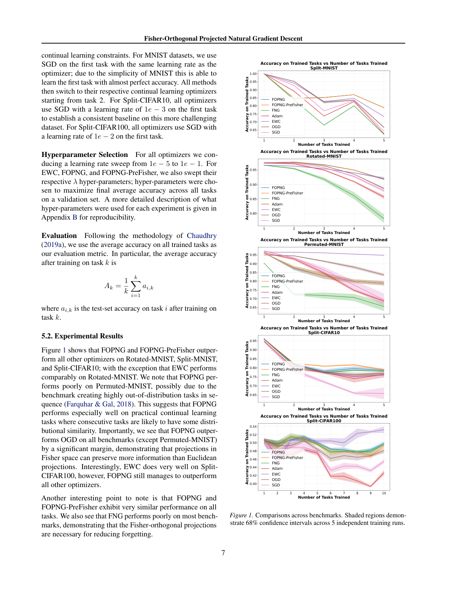
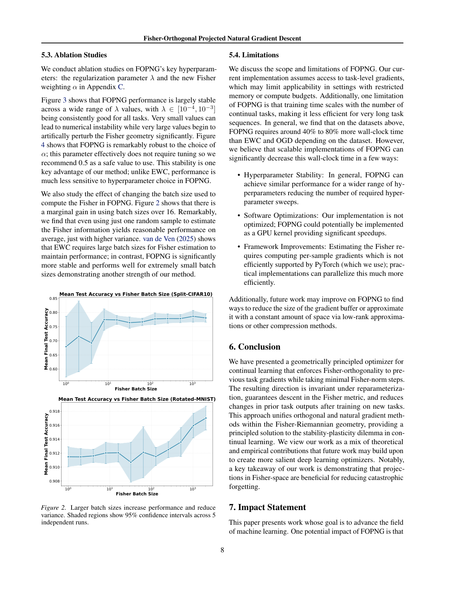

`fopng_fisher | Fisher-Orthogonal Projected Natural Gradient Descent for Continual Learning (FOPNG) | UC Berkeley（Ishir Garg / Neel Kolhe / Andy Peng / Rohan Gopalam；本科生/学生组,berkeley.edu） | 2026-01（arXiv:2601.12816 v2，26 Jan 2026，Preprint） | L5 巩固·信息几何梯度投影优化器 | 相关性 High（A5 几何投影族核心）`

> 【档位】deep 全档。基于下载的真实 PDF 正文（12 页,主体 §1–§7 + 附录 A 证明/B 超参/C 消融）。三标注：【原文】直接来自论文 /【推断】我的有据判断（附依据）/【待核】拿不准的关键事实。
> ⚠️ 本篇是**经典(视觉)持续学习的优化器**,非 LLM/agent。它与本调研其余 LLM 巩固法(rls_razor/eaft/sdft)的连接点在"防遗忘的几何原理":RL's Razor 说"遗忘∝输出分布 KL 漂移",FOPNG 正是用 Fisher 度量(KL 的局部二次近似)直接在几何上约束这一漂移。对标栏写透此对应。

---

## ══ 第一层：一眼看懂 ══

- 🟦 **TL;DR**：【原文】神经网络顺序学多个任务时,为当前任务下降梯度往往会破坏旧任务表现(灾难性遗忘)。已有的"正交梯度法"(OGD/GEM 一族)思路是:把新任务梯度**投影到旧任务梯度的正交补**上(去掉会干扰旧任务的分量),但它们都在**欧氏参数空间**里做投影——而欧氏距离根本不反映"参数变化对模型输出分布的影响"。FOPNG 的核心主张:**投影必须在 Fisher 几何(信息几何)里做**。Fisher 信息矩阵给的是"参数流形上的黎曼度量",且 \(KL(p_θ‖p_{θ+v}) ≈ ½vᵀFv\)——所以"Fisher 范数小的步"=对输出分布改动小的步(不管欧氏大小)。FOPNG 把新任务的自然梯度 `F⁻¹g` 投影到"对旧任务梯度 Fisher-正交"的子空间,得到一个闭式更新(Thm 3.2),既对重参数化不变、又保证在 Fisher 度量下下降、又把对旧任务输出的改动压到最小。用对角 Fisher 高效实现,在 Split-MNIST/Rotated-MNIST/Split-CIFAR10/CIFAR100 上超过 OGD/EWC/Adam/SGD;关键消融(去掉投影的 FNG 变体)证明**投影是少遗忘的必要件**。

- **最巧的一步**：【原文】**把"正交"这件事从欧氏空间搬到 Fisher 空间**——即约束 \(F_old⁻¹ u ∈ Col(G)\)(要去掉的干扰分量,其 Fisher-预条件形式落在旧梯度张成的列空间里),并在 Fisher 度量下最小化与原始梯度的偏差(Eq.16-17),解出投影矩阵 \(P = I − F_old G(GᵀF_old F_new⁻¹ F_old G)⁻¹ Gᵀ F_old\)(Eq.19)。**抽掉"在 Fisher 空间投影"**(改回欧氏投影=OGD,或像 Yadav et al. 2025 那样"先欧氏投影再用 Fisher 预条件")方法就退化:【原文 §2.6】Yadav 等人正是"欧氏投影 + 事后 Fisher 预条件",他们发现**性能反而下降**;FOPNG 实测在除 Permuted-MNIST 外所有 benchmark 上显著超 OGD(Fig 1),证明"投影发生在 Fisher 空间"本身就是增益来源。为什么是它——【原文 Thm 2.1/2.2】Fisher 范数有两条独特性质:① **重参数化不变**(优化尊重概率模型的内在结构,不随坐标系变化),② **局部=KL**(Fisher-小步=输出分布改动小)。只有在 Fisher 空间正交,"不干扰旧任务"才真正等价于"不改旧任务的输出分布";欧氏正交只是"参数向量垂直",与输出分布无关。这一步是把"防遗忘"从参数几何对齐到"输出分布几何"的关键。

---

## ══ 第二层：为什么做（写透） ══

- **研究背景**：【原文】持续学习要让模型从非平稳数据流顺序学习而不忘旧(§1);生物学习有出色的"稳定性-可塑性"权衡,人工网络尚难企及。现有三大类法——**正则化**(惩罚重要参数变化,如 EWC/SI/MAS)、**回放**(存旧样本重演,如 ER/GEM/A-GEM)、**架构**(给每任务分配专用参数)——【原文】共享一个**根本局限:都在欧氏参数空间里操作,没考虑概率模型的自然几何**。
- **解决的具体痛点**：【原文】① 欧氏几何下的防遗忘(无论正则还是正交投影)无法准确刻画"参数改动对输出分布的真实影响"——同样的欧氏步长,在 Fisher 病态方向上可能剧烈改输出,在平坦方向上几乎不改;② EWC 虽首用 Fisher,但只是**对角 Fisher 加权 L2 锚定**(惩罚偏离旧参数),且**对超参极度敏感、需大 batch 估 Fisher**(§2.4、§5.3);③ OGD 在欧氏空间投影,丢掉了输出分布几何信息(§2.6);④ FOPNG 还刻意针对**无法存旧数据**的场景(数据安全敏感,如医疗/边缘),所以只与"不需存原始数据"的法对比(§2.5)。
- **相关工作 & 各自不足**（§2）：
  - **自然梯度(Amari 1998)**——【原文】用 Fisher 预条件 \(θ←θ−ηF⁻¹∇L\),在 KL 约束下最速下降,收敛快、对重参数化稳;但**不防遗忘**(FOPNG 的 FNG 变体即纯自然梯度,实测遗忘严重)。
  - **EWC(Kirkpatrick 2017)**——对角 Fisher 加权 L2 锚定;忽略相关性、超参敏感。
  - **GEM/A-GEM(Lopez-Paz 2017 / Chaudhry 2019)**——投影梯度防旧样本 loss 上升,但**需存旧样本**且在欧氏空间;FOPNG"也约束梯度,但在 Fisher 几何且不存数据"。
  - **OGD(Farajtabar 2020)**——欧氏正交投影(Eq.6);继承欧氏局限。
  - **最近邻 Yadav et al. 2025**——【原文 §2.6】把自然梯度与 OGD 结合,但做法是"**先欧氏投影、再用 Fisher 预条件**",**性能下降**;FOPNG 证明投影必须**在 Fisher 空间内**做。这是关键 Δ。
  - **Lu & Armour 2025**——也用 Fisher 正交思想,但为大 batch 训练推导、**不讨论持续学习**。
- **动机链**：现状(防遗忘法都在欧氏空间)→ 欧氏几何不反映输出分布改动 → 而 Fisher 度量=KL 局部近似、重参数化不变 → **所以应在 Fisher 几何里做"不干扰旧任务"的投影** → 形式化为带约束优化(在 Fisher 范数下逼近自然梯度 + 干扰分量落在旧梯度 Fisher 子空间 + Fisher 信赖域)→ 解出闭式投影更新(Thm 3.2)→ 对角 Fisher 高效实现 → 实测超 OGD/EWC(§5)。【原文】"为什么不用更简单的现成做法":Yadav 等的"欧氏投影+Fisher 预条件"是更简单的拼接,但性能反降——证明几何必须自洽,投影与度量要在同一空间。
- **与最近邻工作的 Δ**：
  - **vs OGD(欧氏正交)**：FOPNG 在 Fisher 空间正交。Δ:Fisher 投影"保留更多信息"(Fig 1 全面超 OGD,除 Permuted-MNIST),因为它去掉的是"会改旧任务输出分布"的分量,而非"参数向量垂直"的分量。
  - **vs Yadav et al. 2025(欧氏投影+事后 Fisher 预条件)**：FOPNG 把投影与度量统一在 Fisher 几何里,而非两步拼接。Δ:统一几何→性能升,拼接→Yadav 报告性能降。
  - **vs EWC(Fisher 加权 L2 锚定)**：EWC 软惩罚偏离旧参数;FOPNG **硬投影**到 Fisher-正交补 + 自然梯度信赖域。Δ:① FOPNG 对超参远更稳健(§5.3,α 几乎不用调、推荐 0.5;\(\lambda\in[\text{1e-4},\text{1e-3}]\) 普适),EWC 超参敏感;② FOPNG 对 Fisher 估计 batch size 极鲁棒(**1 个样本估 Fisher 都能 work**,Fig 2),EWC 需大 batch。

---

## ══ 第三层：怎么做 + 靠不靠谱 ══

- **方法流水线**（§3-§4,核心 = 一个带约束优化的闭式解 + 梯度缓冲区维护）：
  1. **存旧任务信息**:每个任务训完,在最终参数 \(\theta^*_t\) 处算并存 **k 个梯度**(默认 **80 个/任务**,只取 ground-truth logit 的梯度,沿用 OGD 方法),收成矩阵 G;同时维护旧任务 Fisher `F_old`(对角近似,EMA 更新 \(F_old←(1−α)F_old+αF_new\))。
  2. **每个新任务、每个 batch**:重算新任务 Fisher `F_new`(对角,随机 batch);算原始梯度 g;按 **Thm 3.2** 算投影更新 \(v* = η · F_new⁻¹Pg / √(gᵀPᵀF_new⁻¹Pg)\),其中 P 是 Fisher-正交投影矩阵(Eq.19);更新 \(θ←θ−ηv*\)。
  3. **三原则(§3.3)合成 v***:① **自然梯度逼近**——在 Fisher 范数下让 \(F_new⁻¹u\) 尽量贴 g(Eq.13);② **旧任务兼容**——干扰分量 \(F_old⁻¹u∈Col(G)\)(去掉新梯度里落在旧任务 Fisher 子空间的部分,Eq.14);③ **自然梯度信赖域**——\(‖v‖_{F_new}=η\)(界住每步诱导的 KL,稳定学习,Eq.15,实测必需)。
  4. **两个变体**:**FNG**(去掉投影约束=纯自然梯度,作为消融基线,Thm 3.3);**FOPNG-PreFisher**(存任务专属 Fisher 加权梯度 \(g̃_i=F_i g_i\) 而非聚合 F_old,减少每步 Fisher-向量乘,适合长任务序列,Eq.24)。
- **逐组件必要性**：
  - **Fisher-正交投影 P(核心)**:**有消融且是必要件**——FNG(无投影)在多数 benchmark 上遗忘严重(Fig 1),证明投影不可省。
  - **在 Fisher 空间投影(而非欧氏)**:**有对比**——全面超 OGD(欧氏投影),且作者引 Yadav 2025"欧氏投影+Fisher 预条件性能降"佐证。
  - **自然梯度信赖域 \(\|v\|_F=\eta\)**:【原文】"实测对学习稳定性是需要的"(§3.3),但**论文未给"去掉信赖域"的单独消融数字**(标出:必要性靠文字断言+稳定性观察,非独立消融)。
  - **对角 Fisher**:【原文】为效率(O(p²)→O(p));作者承认未探索 KFAC/empirical Fisher 等更好近似对 FOPNG 的影响(留待 future work);PreFisher 上试过 empirical Fisher 但**无增益**。
  - **λ 正则(稳定矩阵求逆)、α(\(F_{old}\) EMA 权重)**:**有消融**(附录 C,Fig 3/4)——\(\lambda\in[\text{1e-4},\text{1e-3}]\) 普适、α 几乎不用调(推荐 0.5),稳健性是卖点。
- **关键机制/公式（直觉）**：
  - **Fisher = KL 的局部二次型(Thm 2.2)**:\(KL≈½vᵀFv\)——这是全文几何合法性的根。它让"Fisher 范数小"严格等价于"输出分布改动小",于是"在 Fisher 范数下控制步长/做正交"就直接对应"少改旧任务的预测"。
  - **重参数化不变(Thm 2.1)**:Fisher 范数不随坐标系变,所以 FOPNG 的更新方向是模型的内在性质,不被网络参数化的任意缩放干扰(欧氏梯度做不到)。
  - **投影矩阵 P(Eq.19)直觉**:它把新任务的(自然)梯度里"会扰动旧任务输出分布"的成分剥掉,只留"对旧任务输出几乎无影响"的方向用来学新任务——即"在不改旧任务说话方式的子空间里学新任务"。最后的归一化 \(/√(gᵀPᵀF_new⁻¹Pg)\) 把更新拉回 Fisher 信赖域半径 η(界住 KL)。
- **实验与证据**（§5）：
  - **数据/设置**:5 个经典持续学习 benchmark——**Permuted-MNIST**(5 任务,随机置换)/**Split-MNIST**(5 任务,每任务 2 类,单 10-输出头)/**Rotated-MNIST**(5 任务,旋转 0/10/20/30/40°)/**Split-CIFAR10**(5 任务,多头)/**Split-CIFAR100**(10 任务,多头)。模型:MNIST 用 2 隐层 MLP(100 单元),CIFAR 用 4 卷积层 CNN+2 FC(多头)。指标:训完任务 k 后所有已训任务的**平均准确率 \(A_k\)**(Chaudhry 2019 方法)。baseline:SGD/Adam(无防遗忘)、EWC、OGD、FNG(自身消融)。5 次独立运行,68% CI。
  - **支撑核心主张的关键实验**:(a) **Fig 1**(5 benchmark 主结果)——FOPNG/PreFisher 在 Rotated-MNIST、Split-MNIST、Split-CIFAR10 上超所有优化器(Rotated 上 EWC 相当);Split-CIFAR100 上 EWC 很强但 FOPNG 仍超所有。**全面超 OGD**(除 Permuted-MNIST),是"Fisher 投影优于欧氏投影"的核心证据。(b) **FNG 表现差**(Fig 1)——证明 Fisher-正交投影是少遗忘的必要件(不是自然梯度本身的功劳)。(c) **Fig 2 + 附录 C(Fig 3/4)**——超参/Fisher-batch 鲁棒性:**1 个样本估 Fisher 都能合理 work**(只是方差大)、α 几乎不用调、λ 宽区间普适——这是相对 EWC 的实用优势。
  - **baseline 公平吗**:【推断】公平度较高。所有法做 1e-5~1e-1 学习率扫 + EWC/FOPNG 各扫自己的 λ,按验证集平均准确率选超参;首任务统一用标准优化器建一致基线;只与"不存旧数据"的法比(符合其 setting 声明)。但**未与 GEM/A-GEM(存数据的强 baseline)正面比**(作者明说因 setting 不同),所以"超过 SOTA"仅限"无回放"赛道。
  - **"看着强但没答核心问题"的隐患**:【推断】(a) **全是小规模视觉 benchmark**(MNIST/CIFAR + 小 MLP/CNN),**完全没有 LLM/语言/agent 实验**——其"几何原理"对大模型/序列生成是否成立、对角 Fisher 在百万亿参数上是否够用,均未验证(对本调研的 LLM 主线只能算"几何原理的理论参照");(b) **Permuted-MNIST 上表现差**,作者归因"该 benchmark 制造高度 OOD 的任务序列",反过来说明 FOPNG 的优势依赖"相邻任务有分布相似性"——这是一个不小的适用前提;(c) 训练时间随任务数增长(比 EWC/OGD 多 40-80% wall-clock),长序列下扩展性存疑。
- **假设与失效边界**（作者 §5.4 明列）：
  - 【原文】① **需任务级梯度**(存梯度缓冲区,80/任务),受限内存/算力场景适用性差;② **训练时间随任务数线性增长**,长序列低效(比 EWC/OGD 多 40-80% wall-clock);③ Assumption 3.1:\(F_{new}\) 正定(可用 λ 正则放松)、G 列满秩(实践成立,存的梯度数远小于参数维)。
  - 【原文】④ **Permuted-MNIST(高度 OOD 任务序列)上失效**;暗示 FOPNG 适合"相邻任务有分布相似性"的实际持续学习(§5.2)。
  - 【推断】⑤ 对角 Fisher 忽略参数相关性——理论上限受此近似制约(作者承认未试 KFAC 等);⑥ 全部为视觉小模型,**未知在 LLM/Transformer/生成式任务上的有效性与可扩展性**(隐式假设"几何原理跨架构成立"未验)。
- **祛魅总结**：
  - **真贡献(硬货)**:① **理论统一**——把正交梯度法(OGD/GEM)与自然梯度法统一进信息几何,给出带约束优化的**闭式投影更新**(Thm 3.2)且证明重参数化不变 + Fisher 度量下下降,数学干净;② **关键洞见可验证**——"投影必须在 Fisher 空间(而非欧氏)做",用超 OGD + 引 Yadav 反例佐证,是清晰的概念贡献;③ **超参/Fisher-batch 鲁棒性**——相对 EWC 的实打实实用优势(1 样本估 Fisher 可用、α 免调);④ FNG 消融干净地隔离出"投影"的贡献;⑤ 开源代码。
  - **包装/可能高估**【推断】:(a) **规模与领域局限严重**——只在 MNIST/CIFAR 小模型上验,标题"for Continual Learning"的普适性被"小视觉 benchmark + 相邻任务需相似 + Permuted 失效"三重限制,对 LLM/agent 主线只是几何参照而非可直接用的方法;(b) "principled/unifies"措辞偏理论营销,实际增益相对 EWC 在部分 benchmark(如 Split-CIFAR100)并不大;(c) 计算成本(随任务数增长、PyTorch per-sample 梯度低效)被"未优化实现可加速"的辩解软化,但当前确是劣势;(d) **是经典 CL 优化器范式**,与本调研"自进化 LLM agent"主线距离较远,价值主要在"为 LLM 巩固提供 Fisher 几何的理论根"。

---

## ══ 结构化抽取 ══

### 🎯 机制速览 6 轴
| 维度 | 内容 |
|---|---|
| **学什么信号** | 监督标签(softmax 交叉熵 loss);无环境 reward、无反思。额外用**旧任务梯度 G + Fisher 矩阵**作为几何约束信号 |
| **改什么** | **模型参数**(优化器层面改梯度方向):把新任务梯度投影到"对旧任务 Fisher-正交"的子空间再更新 |
| **何时改** | **离线批量 + 顺序任务**(per-batch 算投影更新,per-task 更新梯度缓冲区与 Fisher);非 test-time |
| **免梯度?** | **否**(是一个**梯度优化器**;创新在用 Fisher 几何重塑梯度方向,而非免梯度) |
| **记忆-技能生命周期** | **存梯度缓冲区**(80/任务)+ Fisher(EMA);写入=任务末存 ground-truth-logit 梯度;检索=每步用全部旧梯度做投影;**无遗忘/淘汰**(缓冲区随任务线性增长,作者列为待优化);无跨 agent 共享(单模型) |
| **防遗忘机制** | **几何投影(Fisher-正交) + 自然梯度信赖域**——在 Fisher 黎曼流形上把"会改旧任务输出分布"的梯度分量投掉,并界住每步 KL(Thm 2.2:Fisher 步=KL)。属"梯度投影/正交"族(OGD/GEM/GPM 的 Fisher 几何升级版),非 merging、非参数隔离、非回放(刻意不存数据) |

### ⑦ 开源代码 + 框架/harness
- 【原文】**代码已开源**:https://github.com/ishirgarg/FOPNG （摘要 + §1 明示;此前候选元数据标"代码待核",**本次经 PDF 正文确认链接存在**,但 P4 仅核 PDF、**未实地 clone/访问该仓库**核实可达性与内容〔待核：仓库实际可达性、是否含完整复现脚本未验证;如需请手动 clone〕)。
- 框架/harness：【原文 §5.1 + §5.4】**PyTorch 实现**(自研优化器,非 veRL/TRL 等 LLM 训练框架——本文是视觉 CL 优化器)。作者指出 PyTorch 对 per-sample 梯度支持不高效是其速度瓶颈之一。→ 框架明确记为 **PyTorch(自研优化器)**。

### 💰 资源/成本与可扩展性
- 【原文 §5.4】计算成本:比 EWC/OGD **多 40%-80% wall-clock**(随数据集);**训练时间随任务数线性增长**。存储:梯度缓冲区 80/任务 + 对角 Fisher(O(p))。
- 【原文 §5.3 Fig 2】Fisher 估计极省:**1 个随机样本**估 Fisher 即可合理工作(方差略大),batch>16 边际增益;对比 EWC 需大 batch。
- 【推断】可扩展性:小视觉模型上可行,但**未验证大模型**;对角 Fisher + per-sample 梯度在 LLM 尺度的开销未知。作者提出 GPU kernel / 低秩压缩梯度缓冲区等加速方向。算力规模(GPU 型号/卡时)正文未给〔待核〕。

### 🎯 对"探索-巩固"idea 对标
- **几何原理层的支撑(理论根) + 可借的"巩固期梯度投影"积木**,但非 LLM 直接可用方案:
  - **可借组件(原理/积木)**:① **Fisher-正交投影 P(Eq.19)+ 自然梯度信赖域**——idea 巩固期若做参数更新,这是"在不改旧能力输出分布的子空间里学新技能"的**几何化实现模板**;尤其与 RL's Razor 的"巩固走 KL-min 路径"天然咬合(Fisher 步=KL,见下)。② **Fisher 度量作为"输出分布改动"的可微代理**——idea 的"遗忘探针"除了 EAFT 的 token 熵、RL's Razor 的 KL,还可用 Fisher 范数 \(‖v‖_F\) 在参数更新方向上度量"这步会改多少旧输出",用于巩固期的步长/方向控制。③ **超参鲁棒 + 1-样本 Fisher 估计**——若把 Fisher 几何引入 LLM 巩固,这条说明"哪怕粗估 Fisher 也能 work",降低工程门槛。
  - **与三篇 LLM 巩固法的几何统一**【推断】:`rls_razor` 说"遗忘∝输出分布前向 KL",`eaft` 在 token 级压"会大改输出的冲突梯度",`fopng` 直接用 Fisher(=KL 局部二次型)在**参数更新方向**上做正交投影——三者其实是**同一几何对象(输出分布的 KL/Fisher 度量)在不同层面的操作**:RL's Razor 是分布级诊断,EAFT 是 token 级门控,FOPNG 是参数级投影。idea 若要一个统一的"巩固几何",FOPNG 提供了"在 Fisher 流形上正交投影"这一最接近第一性原理的算子。〔依据:Thm 2.2 把 Fisher 与 KL 直接联系,三篇共享 KL/Fisher 这一底层度量;此为我的综合推断〕
  - **与 idea "MTP/path-recovery"的潜在结合**【推断】:FOPNG 用旧任务梯度子空间定义"不可动方向";idea 的 MTP 前瞻可提供"哪些方向会改前瞻预测"的信息,用以**动态构造投影子空间**(而非只用历史梯度),让巩固期投影更前瞻。〔我的推断,FOPNG 用的是历史梯度、不涉及前瞻/MTP〕
  - **缺口(idea 需补、FOPNG 未做/不适配)**:① **只有巩固、无探索**——纯优化器,不产生数据/不试错;② **未上 LLM**——所有结论在小视觉模型,几何原理能否迁移到 Transformer/生成式持续学习完全未验,idea 若借用需自行验证可扩展性;③ **梯度缓冲区随任务线性增长、无遗忘机制**——长寿命 agent 场景需低秩/压缩;④ **依赖相邻任务分布相似(Permuted-MNIST 失效)**——对 agent 跨域大跳变的持续学习可能不稳;⑤ 训练时间随任务数增长,与 idea 的"长期持续"诉求有张力。
  - **定位**:对 idea 是**巩固期的几何理论根 + 投影算子积木**(与三篇 LLM 巩固法在 KL/Fisher 度量上同源),但**不是 LLM 上即用的方法**——需把其 Fisher-正交投影思想迁移并验证到大模型尺度。非竞品(领域不重叠),属"可借几何原理"。

### 🔭 开放问题 / 未来方向
- 【原文 §2.7/§4.4/§5.4/§6】① 试 **KFAC/EKFAC/empirical/低秩 Fisher** 等更优近似对 FOPNG 的影响(当前只用对角);② **压缩/低秩化梯度缓冲区**(常数空间)以支持长任务序列;③ GPU kernel + 高效 per-sample 梯度的工程加速;④ 把"Fisher 空间投影有益于减遗忘"推广到更 salient 的深度学习优化器。
- 【推断】⑤ **迁移到 LLM/Transformer/生成式持续学习**并验证可扩展性(本文最大空白,也是与本调研主线接轨的关键);⑥ 处理"相邻任务大跳变/OOD"的鲁棒投影(解决 Permuted-MNIST 失效);⑦ 与回放/正则法混合的几何统一框架。

### 🖼 关键图 top-2

- 这是**原文 Figure 1**(主结果图,我渲染了含正文的整页)。5 个子图分别为 Split-MNIST / Rotated-MNIST / Permuted-MNIST / Split-CIFAR10 / Split-CIFAR100,横轴=已训任务数,纵轴=所有已训任务的平均准确率,7 条曲线(FOPNG / FOPNG-PreFisher / FNG / Adam / EWC / OGD / SGD)。**关键读点**:① FOPNG/PreFisher(防遗忘最好,曲线随任务增加下降最慢)全面超 OGD → 证明 Fisher 投影优于欧氏投影;② **FNG(无投影的纯自然梯度)曲线明显更低** → 证明 Fisher-正交投影是少遗忘的必要件;③ Permuted-MNIST 上 FOPNG 反而不佳 → 暴露"相邻任务需分布相似"的适用边界。**选它**:一张图同时给出核心论点(Fisher 投影>欧氏)、必要性消融(FNG)、失效边界(Permuted),信息密度最高。

- 这是**原文 Figure 2**(关键鲁棒性证据)。两子图(Split-CIFAR10 / Rotated-MNIST),横轴=估 Fisher 用的 batch size(对数轴,从 1 到 1000+),纵轴=最终平均准确率,阴影=95% CI。**读点**:准确率随 batch size 增大略升并很快饱和,**即便 batch=1(单样本估 Fisher)也能取得合理性能**(只是方差大);对比 EWC 需大 batch 才能维持性能。**选它**:这是 FOPNG 相对 EWC 的核心实用优势(几何方法的鲁棒性),对"把 Fisher 几何引入 LLM 巩固"最有迁移价值的一条经验——说明粗估 Fisher 即可,降低了在大模型上落地的工程门槛。(注:本文为偏理论的优化器论文,**无方法 pipeline 主图**,核心方法以公式 Eq.16-19/Thm 3.2 呈现;故 top-2 选最具代表性的主结果图与鲁棒性图。)
