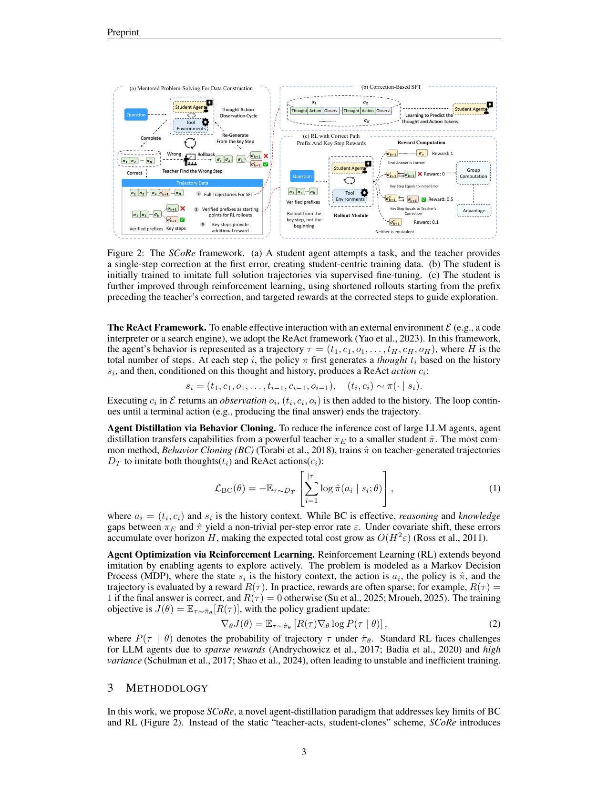
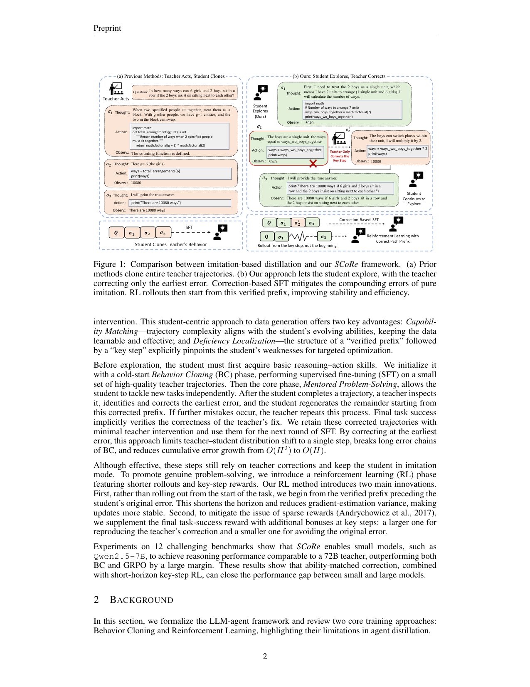

`from_correction_to_mastery | From Correction to Mastery: Reinforced Distillation of LLM Agents (SCoRe) | USTC + 独立研究者(Chengyu Wang，ModelScope/EasyDistill 系) | 2025-09 arXiv v2(2025-10-09)(2509.14257) · 预印本 | 主题线 L?·高相关(与 TSRD 几乎同构)`

> 一句话定位:**"学生自己探索、老师只改第一处错"** 的 agent 蒸馏框架——先用纠错后的轨迹做 SFT，再从"出错点前的已验证前缀"开始做短程 RL，并在关键步给定向 reward。**这是与用户 TSRD(path-selection/path-recovery + 单点接管 + prefix 续写)最贴近的一篇**，且有开源代码(ModelScope/EasyDistill/SCoRe)。

══ 第一层：一眼看懂 [light] ══
- 🟦 **TL;DR**：想让 7B 小模型当 agent 达到 72B 老师的水平。传统蒸馏是"老师演全程、学生抄全程(behavior cloning)"，但师生能力差距大→学生一步走错就进入没见过的状态，误差像滚雪球(理论上随 horizon H 长成 O(H²))。SCoRe 反过来:**让学生自己从头做这道题，老师只在学生第一次出错的那一步给出正确改写 \(σ′_k\)，然后学生从 \((σ_1..σ_{k-1}, σ′_k)\) 继续往下做**;若又错，老师再改下一处。这样产生的轨迹"难度刚好匹配学生当前能力(capability matching)"、且"精确标出学生的弱点在哪一步(deficiency localization)"。拿这些纠错轨迹做 SFT 后，再做一个 **RL 阶段**:不从题目开头 rollout，而是**从出错前的已验证前缀开始**(缩短 horizon、降方差)，并在关键步加奖励(复现老师改法=大奖 Rkey，避开原错=小奖 Ravoid)。
- **最巧的一步**:**"只改第一处错 + 学生续写"** 这一动作(Mentored Problem-Solving, MPS)。抽掉它(退回老师演全程的 BC)，整套就垮:数据不再 on-policy 于学生分布、误差界回到 O(H²)、也无法定位学生弱点。它同时喂养了后面两个阶段(纠错轨迹→SFT;前缀+关键步→RL 的起点与 reward)。理论上 Theorem 3.2 证明"首错纠正"把误差增长从 **O(H²) 砍到 O(H)**——这是全文的逻辑支点。

══ 第二层：为什么做（写透，重点） ══
- **研究背景**:高性能 LLM agent(ReAct 范式:Thought-Action-Observation 循环 + 工具)依赖 GPT-4/72B 级巨型 backbone，延迟与成本高(复杂任务要几十次模型调用)。Agent Distillation 想把大模型的 [Thought,Action,Observation] 轨迹蒸到小模型(§1)。
- **解决的具体痛点**(两条 gap + 一条误差):
  1. **Reasoning Ability Gap**:小模型复现不了老师的逻辑分解(§1)。
  2. **Knowledge Capability Gap**:即便跟着老师的计划，小模型也可能因知识不足执行不了复杂 action(§1)。
  3. **复合误差(compounding error)**:BC 下任一步失败就把学生推向 OOD 状态，误差随 \(H\) 长成 **\(O(H^2ε)\)**(Ross 2011 的 covariate shift,§2)。
- **相关工作 & 不足**:
  - *轨迹蒸馏/Toolformer 式模仿*(Kang 2025、Schick 2023):纯 BC 复现老师 trace，受两 gap + 复合误差所限(§5)。
  - *DAgger / HG-DAgger*:缓解 exposure bias，但**仍是 teacher-led**，轨迹复杂度常与学生能力错位(§5)——这是 SCoRe 要纠的核心。
  - *Agentic RL*(GRPO/ARPO、Tool-Star、Search-R1):能探索，但长程 rollout 不稳、稀疏/延迟 reward 导致 credit assignment 难(§5)。
- **动机链**:老师演全程→学生分布外、复合误差 O(H²)、且不知学生弱在哪 → 所以让**学生主导生成、老师只做"首错最小干预"**(数据落在学生分布 dˆπ、误差截断成 O(H))→ 但纯 SFT 仍是模仿、达不到自主解题 → 再加**从已验证前缀出发的短程 RL + 关键步 reward**(降方差、定向纠错、最终从"模仿"走向"mastery")。为什么不用更简单的 DPO/纯 GRPO?附录 C 对比了 DPO;正文论证纯 GRPO 长程方差大、reward 稀疏(表1/表3 里 SCoRe-RL 全面超 GRPO)。
- **与最近邻的 Δ**:
  - vs **DAgger 系**:DAgger 也"专家在学生状态上标注"，但 DAgger 标**整条**学生轨迹;SCoRe 只在**第一处错**做最小改写并让学生续写——干预更稀疏、更精准定位弱点。
  - vs **普通 Agentic RL(GRPO/ARPO)**:它们从题目开头 rollout、只用稀疏终局 reward;SCoRe **从出错前缀开始 rollout**(Theorem 3.3 证明方差随起点 k 增大单调下降)+ **关键步 reward**。这两个差异让小模型 RL 更稳更省。

══ 第三层：怎么做 + 靠不靠谱 ══
- **方法流水线(三阶段，Figure 2)**:
  1. **初始蒸馏/冷启动 BC(§3.1)**:用老师(Qwen2.5-72B-Instruct)以"先出 high-level plan，再走 Thought-Code-Observation 循环"的双 prompt 生成轨迹,**CodeAct**(action=可执行代码,Turing-complete、师生都熟、可复现);拒绝采样只留终答正确的。仅用 **20% 数据**做 BC 得到 \(\hat{π}_{init}\)(给学生基础推理-行动能力，使其后续不会一上来就失败、从而能做"单步纠错")。
  2. **导师式解题 MPS(§3.2，核心数据构造)**:\(\hat{π}_{init}\) 独立做新题→老师检查;错则定位**首个偏离步 \(σ_k\)**、最小改写为 \(σ′_k\)、学生从 \((σ_1..σ_{k-1},σ′_k)\) 续写;再错再改(本文最多 5 次)。最终完成则隐式验证了老师改法正确，收下这条**师生混合(学生为主、老师稀疏编辑)轨迹**。产出**两种监督**:(a) 整条纠错轨迹→继续 SFT;(b) 每次关键步纠正→一个偏好对(同前缀下 \(σ′_k\) 优于 \(σ_k\))，供 RL。5 次仍解不出的 = **Hard-to-Teach** 任务,留一部分作 RL 的难例。
  3. **纠错式 SFT(§3.2, Fig2b)**:在 MPS 数据上 SFT 得 SCoRe-SFT(学预测 Thought+Action token)。
  4. **关键步 RL(§3.3, Fig2c)**:采 **GRPO**;两创新——① **短程 rollout**:从已验证前缀 \((σ_1..σ_{k-1})\) 起跑，horizon 从 \(H\) 降到 \(H-k+1\);② **关键步 reward**:终答对→大奖 \(R_{final}=1\);否则 \(a_k=\)老师改法→\(R_{key}=0.5\),\(a_k≠\)原错且≠老师→\(R_{avoid}=0.1\),其余 0。action 等价性用代码执行结果可靠判定;终答语义等价用 Qwen2.5-7B 当 verifier。
- **逐组件必要性(消融 表3, Qwen2.5-7B)**:
  - **Initial Distillation(仅 20% BC)**:平均 41.7,作为 explorer 起点(单独很弱)。
  - **+MPS 数据 SFT(SCoRe-SFT)**:45.8(+4.1)——证明在学生自生成+纠错数据上 SFT 有效强化推理链弱环。
  - **去掉 short-horizon 的 RL**:48.4(掉 2.4) → 短程截断确实降方差、提稳定。
  - **去掉 key-step reward 的 RL**:49.7(掉 1.1) → 关键步定向 reward 对多步任务有用。
  - **完整 SCoRe-RL**:**50.8**(最优)。✅ 两个 RL 创新各自有消融支撑。
  - 另有 **Figure 3** 两个支撑:(a) 老师干预频次——**大多数任务只需 1 次纠正**(Math 71.0% 学生独立解出/15.3% 一次纠正/\(≥2\) 次仅 2.7%),说明"单步纠正通常够用";(b) 在**已排除出训练集的"hard data"(200 题)**上,准确率从 0%→SFT 17.3%→RL 24.3%(Math),证明模型获得了**老师都教不会的题的自主解题能力**(从 imitation 到 mastery 的直接证据)。
- **关键机制/公式直觉**:
  - *Theorem 3.1 vs 3.2*(全文支点):BC 在**老师分布 \(d_{π_E}\)** 上算误差→单步 \(ε\) 经 covariate shift 放大为 \(O(H^2ε)\)(Eq.5);SCoRe 数据来自**学生自己的 rollout \(d_{\hat{π}}\)**、且首错即被老师接管→"在回到专家路径前最多一处未纠错误"，误差只线性累积 \(O(Hε)\)(Eq.7)。直觉:把"雪球从山顶滚"改成"每次刚要滚就被扶正"。
  - *Theorem 3.3*(短程降方差):策略梯度方差上界随 rollout 起点 k 增大而单调下降(Eq.9)——从已验证前缀起跑天然砍掉前段方差贡献。
  - *关键步 reward*:在"学生最薄弱的那一步"给 informative credit，同时保持"终答成功"为最高优先级——缓解稀疏 reward 的 credit assignment。
- **实验与证据**:
  - 数据集:**12 benchmark**三类——数学(AIME24/25、MATH500、OlympiadMath)、事实多跳(HotpotQA、2Wiki、MuSiQue、Bamboogle)、Deep Search(GAIA、HLE、xBench、WebWalker)。工具=Python 代码解释器 + 在线搜索(为省成本未用浏览器)。
  - 种子数据:主要来自 Tool-Star(含 NuminaMath、Omni-Math、HotpotQA/2Wiki/WebWalker),共 **35k** 对;20% 老师全标做 BC 冷启,80% 走 MPS;MPS 数据再对半分给 SFT 与 RL。RL 最大 rollout 步=8,推理同配置。
  - **支撑核心主张的关键数字**:Qwen2.5-7B 学生 SCoRe-RL 在 math+factual 平均 **50.8**——仅比 72B 老师(51.7)低 **0.9**,比 BC **+8.3**、比 GRPO **+6.3**(表1);Qwen2.5-3B +8.4 over BC、Llama-3.1-8B +10.2 over BC。Deep Search(表2)Qwen3-8B SCoRe-RL **30.5**,比 BC +7.7、比 GRPO +8.3、甚至**超过 TIR-Qwen-72B(+3.2)**;GAIA-Avg 27.2(BC)→40.8。
  - baseline 公平性:**相对扎实**——BC baseline 用**全量**老师数据，而 SCoRe 的 BC 冷启只用 20%(脚注1 明确),即 SCoRe 在更少全标数据下仍胜出;GRPO/ARPO 数字多取自 ARPO 原论文(表1 注)。同 backbone、同工具、同 rollout 步(8)。
  - "看着强但没回答核心问题"?基本没有;但⚠️ SCoRe-SFT 单看有时**不如**全量 BC(表1 Llama:SCoRe-SFT 40.2 vs BC 37.3 是更高;但 Qwen2.5-7B SCoRe-SFT 45.8 > BC 42.5 也更高——其实都更高)。真正弱项在 SFT 阶段对 AIME 这类极难题提升有限,主要靠 RL 阶段拉起(表3 AIME24:SFT 26.7→RL 36.7)。
- **假设与失效边界**:
  - 【原文】老师改法的正确性靠"学生最终能否解出"**隐式验证**——若一道题学生即便被纠正多次仍解不出(Hard-to-Teach),该纠正质量无法确认(§3.2);action 等价性依赖**代码可执行/可比对**(CodeAct 设定)。
  - 【推断】强依赖"学生 BC 冷启后不会一上来就失败"——否则首错定位频繁、退化为接近全程纠正;依据=§3.1 明说冷启目的是"使 \(\hat{π}_{init}\) 能 attempt 而不立即失败,从而允许细粒度单步干预"。
  - 【推断】"首个偏离步"由老师**通过 prompt 判定**(附录 D),老师自身的误判会引入错误监督;在老师也不擅长的域,定位不可靠。依据=§3.2 "error localization and correction is carried out by the teacher via prompts"。
  - 【推断】关键步 reward 的 0.5/0.1 是人工设定,跨任务最优值未必稳定(作者把"改进 reward 设计"列为 future work)。
- **祛魅总结**:
  - 真贡献(硬货):**(1) MPS"学生探索+老师首错最小干预"的数据构造范式**,把蒸馏数据从老师分布搬到学生分布、并把误差界 O(H²)→O(H)(有定理);**(2) 从已验证前缀出发的短程 RL + 关键步 reward**(有方差定理与消融)。两者合起来让 7B≈72B,是**机制 + 理论 + 实验三齐**的扎实工作。
  - 包装/营销成分【推断】:① "Reinforced Distillation"名头大,本质=on-policy 数据构造 + 标准 GRPO 的两点工程改造,RL 部分创新度中等;② "matches 72B"是 math+factual 平均的口径(50.8 vs 51.7),在最难的 AIME25 上 7B 仍 26.7 < 72B 40.0——**单项难题差距仍在**,平均数掩盖了分布;③ 关键步 reward 的消融增益其实较小(-1.1),主要价值在 short-horizon(-2.4)与 MPS 数据本身。整体**高估较少**,是诚实的工作。

══ 结构化抽取 ══
- 🎯 **机制速览 6 轴** [light]：

| 轴 | 取值 |
|---|---|
| 学什么信号 | **其他 agent(72B 老师)的首错纠正 \(σ′_k\)**(蒸馏/偏好信号) + **环境 reward(终答可验证 + 关键步定向 reward)** + 代码执行反馈 |
| 改什么 | **参数(学生主干权重，全参 SFT + GRPO 更新)**;无 prompt/记忆/技能库改动 |
| 何时改 | **离线批量**:MPS 先离线构造数据→SFT→再 RL,三阶段流水线;非在线 per-step/per-episode 即时更新 |
| 免梯度? | **否**(全程基于梯度:SFT 的 CE + GRPO 的策略梯度) |
| 记忆-技能生命周期 | 不适用(无外置记忆/技能库;"经验"以纠错轨迹+偏好对形式一次性进训练数据,不检索不淘汰) |
| 防遗忘机制 | **不适用/未涉及**(单模型顺序 SFT→RL,论文未讨论灾难遗忘;无 merging/KL 投影/几何共识)。理论上 SFT→RL 顺序训练存在遗忘风险但未测【推断】 |

- ⑦ **开源代码 + 框架/harness**:**已开源** → `https://github.com/modelscope/easydistill/tree/main/projects/SCoRe`(首页脚注给出)。代码隶属阿里 **ModelScope EasyDistill** 蒸馏工具集下的 SCoRe 子项目。**底层 RL/训练框架正文未点名**(GRPO 自实现还是套用 veRL/TRL/ms-swift 均未在正文说明)【待核:需查仓库确认底层框架;参考文献里同时出现 HybridFlow/veRL(Sheng 2024)、LLaMA-Factory(Zheng 2024)、DeepSpeed(Rasley 2020),但正文未声明用哪个】。本子代理任务仅做 PDF 深读,**未 clone 仓库**——框架归属请在 P3/clone 阶段以实际仓库文件核定。
- 💰 **资源/成本与可扩展性**:训练数据 35k 对(20% 老师全标 + 80% MPS);老师=Qwen2.5-72B-Instruct(数据构造期需大量 72B 调用)。**部署期收益是核心卖点**:7B 学生达 72B 性能,推理成本/延迟大幅降低(复杂 agent 任务原需几十次大模型调用)。RL 最大 rollout 步=8。正文未给具体 GPU 数/训练时长(在 Appendix B,本次未展开读)。
- 🎯 **对"探索-巩固"idea 对标** [light]：**强支撑 + 直接可借组件(与 TSRD 几乎同构)**。
  - *支撑/同构*:本调研记忆里 TSRD = "教 path-selection + path-recovery、单点接管、prefix 续写正确率定切点"。SCoRe 的 **MPS = 老师在首错处单点接管(path-recovery)、学生从已验证前缀续写**,与"sparse_critical 单点接管"+"~50% 续写正确率切关键步"的设计**高度一致**;其"从已验证前缀做短程 RL"≈ 用户"prefix 长度 / path-recovery 起点"思路的 RL 化实现。
  - *可借组件*:(1) **首错定位 + 最小改写 + 学生续写**的数据构造闭环(可直接做 path-recovery 监督);(2) **从 verified-prefix 起跑的短程 RL**(Theorem 3.3 的方差论证,可支撑"切关键步而非从头 rollout");(3) **关键步双 reward(复现修正 / 避开原错)**——对应 path-recovery 的奖励设计;(4) O(H²)→O(H) 的误差界论证,可做 TSRD 的理论卖点参照。
  - *竞品维度*:与 **agentdebug(2509.25370)** / **error_localized_irrecoverable(ELPO,2602.09598)** 是同一"定位关键错误步→定向优化"家族的近邻——SCoRe 偏"老师纠错+蒸馏",ELPO 偏"二分搜索定位首个不可恢复步+RL clipping",可在 survey 同节并置对比。
  - *缺口*:无 MTP/foresight 视角(切点靠老师事后判定,非前瞻探针);无记忆/持续学习(一次性数据→训练);未处理 SFT→RL 的遗忘。
- 🔭 **开放问题/未来方向**:
  - 【原文 §6】改进 reward 设计;扩展到更广的多模态任务。
  - 【推断】把"首错定位"从老师 prompt 判定换成更可靠/自动的探针(如熵/置信度,呼应 ELPO 的二分搜索或用户 MTP 前瞻);处理 SFT→RL 的灾难遗忘;Hard-to-Teach 题的更好利用(目前只丢部分给 RL 当难例)。
- 🖼 **关键图 top-2** [light]：

· 这是**原文 Figure 2(方法主图)**:(a) MPS 数据构造——学生跑、老师找错步、回滚、改正、学生重生成,产出"已验证前缀 + 关键步";(b) 纠错式 SFT;(c) 从前缀起跑的短程 RL + 关键步 reward 的 group 计算。选它因为一图覆盖全部三阶段与"verified prefix / key step"两大复用件,是理解 SCoRe 机制咬合的核心。

· 这是**原文 Figure 1(动机/对比图)**:用"6 女 2 男排座"实例对比 (a) 旧法"Teacher Acts, Student Clones"(SFT 抄全程) vs (b) 本文"Student Explores, Teacher Corrects"(学生探索、老师只改关键步 \(σ_3\)、再从前缀做 RL)。选它因为它最直观地呈现"最巧的一步"——单点纠错 + 续写,正是与 TSRD 同构的那个动作。

──────────
【三标注小结】方法/定理/数字/数据集均【原文】可锚定(§3.1-3.3、Th3.1-3.3、表1-3、图1-3);"主干全参更新""遗忘风险未测""SFT 阶段对极难题提升有限""营销成分"等判断标【推断】并附依据;**底层 RL 框架归属标【待核】**(正文未声明,需查 EasyDistill/SCoRe 仓库,本次未 clone)。开源链接经首页脚注核实为真(modelscope/easydistill/projects/SCoRe)。
