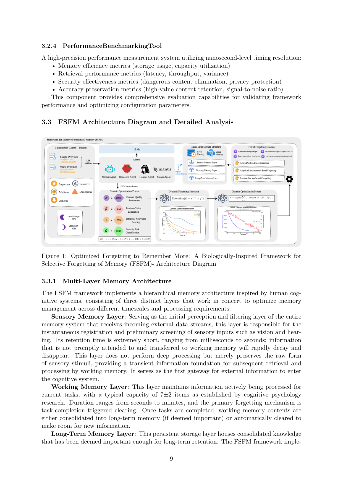
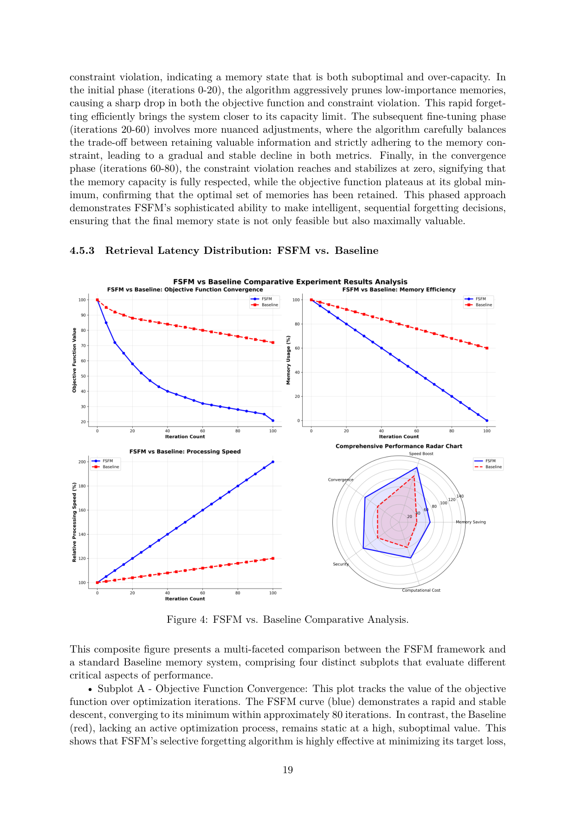

`fsfm | FSFM: A Biologically-Inspired Framework for Selective Forgetting of Agent Memory (Forgetting to Remember More) | 中国移动 数智业务部 / 九天公司 / 九天研究院 | 2026-04·arXiv v2(2604.20300, cs.AI) | 主题线 L?（agent 记忆"主动遗忘/淘汰" = "防遗忘的反面：把忘什么/何时忘当一等公民"线）· 相关性 Med`

> 三标注约定：【原文】= 论文明说；【推断】= 我的有据判断(附依据)；【待核】= 拿不准的关键事实。

══ 第一层：一眼看懂 [light] ══

- 🟦 **TL;DR**：现有 LLM agent 记忆几乎只研究"怎么记住/检索",把记忆当成"永远只进不出的仓库"——长期运行会**存储爆炸 + 噪声(寒暄/重复/无用语)堆积拉低检索质量 + 过时信息误导 + 安全/隐私风险(恶意注入、PII、GDPR"被遗忘权")**。FSFM 反过来主张"**遗忘不是 bug、是 feature**",从神经科学(海马索引/巩固理论 + 艾宾浩斯遗忘曲线 + 突触修剪 + 记忆再巩固)取灵感,给 agent 记忆设计一套**选择性遗忘**框架:① 建立一个**遗忘机制分类法**(被动衰减 / 主动删除 / 安全触发 / 自适应强化四类);② 给出可落地架构三件套——**标准化记忆表示格式 + 可配置遗忘策略引擎(规则/触发/优先级)+ 与现有检索/推理无缝集成协议**;③ 核心是一个**多维重要性打分**\(Importance = α·内容质量 + β·业务价值 + γ·时间相关性(艾宾浩斯衰减 e^(-λt)·使用频率) + δ·安全合规(危险内容-10分,强制优先遗忘)\),容量超限时按分数从低到高修剪。在中国移动"灵犀"营销服务助手 336 万条真实数据上验证:存储省 30%、检索快 1.31×、危险内容 100% 拦截清除、同时保留 >70% 高价值内容。【原文 Abstract/§1.2/§4.2】
- **最巧的一步**:**把"安全合规"做成重要性打分里的强负权重项(SRC=-10 for dangerous / -2 for sensitive),让危险内容天然排到优先队列最前面被第一个删掉**(§4.2.4)。这一步使"安全遗忘"不再需要单独的安全模块,而是和"效率/质量"在同一个标量打分里联合裁决——抽掉它,危险内容就和普通低价值内容混在一起、无法保证 100% 清除;正是这个负权重把"主动遗忘恶意/敏感内容"变成打分排序的自然结果。次巧:用**艾宾浩斯衰减 × 使用频率**做时间相关性,并按内容类型用不同 \(\lambda\)(长期业务知识 \(\lambda=0.05\)、瞬时上下文 \(\lambda=0.2\))。【原文§4.2.4】

══ 第二层：为什么做（写透，重点） ══

- **研究背景**:LLM agent 大量研究聚焦"**记住/检索**"(retention & retrieval),把记忆当成"应无限期保存一切"的只增仓库;但 agent 一旦长期运行并嵌入关键基础设施,这种范式的局限暴露。本文站在**神经科学启发的记忆管理**这条线,主张"遗忘"研究被严重低估(§1.1 "research on biological selective forgetting...remains largely underexplored")。【原文 Abstract/§1.1】
- **解决的具体痛点**(§1.1 列五条,非常具体):**①资源约束**——长期运行存储无限膨胀、检索/运算开销指数上升,经济与技术上不可持续;**②记忆质量下降**——系统不断存"Hello""在吗""任务进展如何"这类**寒暄/重复/无价值语句**,挤占有效空间、干扰检索精度;**③信息过时**——用户偏好/事实/上下文随时间变,旧信息变得过时甚至误导(基于过时信息决策→低效/误判);**④安全漏洞**——无差别保留制造攻击面,凭证/危险言论/隐私/配置可被利用,且**记忆投毒(memory poisoning)**可长期潜伏改写响应;**⑤隐私合规**——与 GDPR"被遗忘权"、数据最小化原则冲突。核心论点(§1.2):"**资源受限环境下,精心设计的选择性遗忘机制和记忆保留同等重要**"。
- **相关工作 & 各自不足**(§2 综述性,非实测对比):**①遗忘的神经科学基础**——海马索引/巩固理论(稀疏表征、最小化相似记忆干扰)、艾宾浩斯遗忘曲线(指数衰减)、突触修剪(微胶质吞噬弱连接)、记忆再巩固(检索时进入可塑态可被修改/擦除);**②遗忘的计算模型**——概率遗忘模型(保留概率=f(时间,频率,情绪效价,上下文相关,安全合规,社会共识))、**RL-for-forgetting(把遗忘策略当 RL 问题:状态=记忆组成/资源/满意度,动作=保留/遗忘/修改决策,奖励=效率+准确+安全+满意度复合)**、信息论(Shannon 源编码/率失真给压缩理论上界);**③LLM agent 记忆架构**(向量库 + ANN 检索、RAG、压缩/摘要);**④AI 安全隐私**(对抗攻击/投毒、差分隐私/联邦学习、GDPR 被遗忘权)。**关键说明**:RL-for-forgetting 只在 §2.2.2 作为 taxonomy 概念列出,**本文实现层并未用 RL**(实现是启发式打分 + 阈值修剪)——这是"概念分类 vs 实际机制"的落差,深读必须区分。
- **动机链**:现状(记忆研究只管"记",记忆当只增仓库)→ 缺陷(长期运行下五大问题:爆存储/堆噪声/过时/不安全/违规)→ 关键洞察"**forgetting is not a bug, but a feature**"(人脑遗忘机制服务认知效率/情绪调节/适应学习)→ 为什么不用更简单的现成做法?**纯定期清空**=粗暴丢高价值、**纯 LRU/时间淘汰**=不分内容价值与安全(危险内容若刚被访问反而被保住)、**单独安全过滤模块**=与效率/质量裁决割裂、需多套机制→ 所以**用一个多维重要性打分(质量+价值+时间衰减+安全)统一裁决保留/淘汰**,容量超限时按分数从低到高修剪,安全做强负权重保证危险内容最先被删。【原文§1.1-1.2/§3.3】
- **与最近邻工作的 Δ**:**最近邻是"艾宾浩斯式被动衰减"单一遗忘模型**(对所有记忆按固定 λ 指数衰减)。Δ 在两点:**①从单维(仅时间)扩到四维打分**(CQA 内容质量 + BVE 业务价值 + TRS 时间相关 + SRC 安全),让遗忘不只看"多久没用"还看"值不值/危不危险";**②按内容类型分配不同 λ + 阶梯式再巩固**(高价值记忆被访问即把保留概率重置到高台阶 ~0.95→0.90→0.85,形成"楼梯"曲线 Fig 2)。这差异有用是因为:纯艾宾浩斯会把"久未访问但高价值"的业务知识误删、也无法对"刚注入的危险内容"立即处置;四维打分 + 安全负权重让"该忘的(危险/低价值/过时)优先忘、该留的(高价值)经再巩固长期留"。【原文§2.1.2/§4.5.1 Fig 2】

══ 第三层：怎么做 + 靠不靠谱 ══

- **方法流水线**(§3 架构,输入交互记录→输出受容量约束的高价值记忆库):①**三层类人记忆栈**——感觉记忆层(毫秒级,瞬时登记+初筛,未及时转入即衰减)→工作记忆层(\(7\pm2\) 项,任务完成触发清空,重要的巩固进长期层)→长期记忆层(持久存储,在此做选择性遗忘);②**标准化记忆表示**(结构化记忆数据便于精准识别/定向删除);③**重要性打分引擎**——对每条记忆算 \(Importance = α·CQA + β·BVE + γ·TRS + δ·SRC\)(权重 \(\alpha=0.4,\beta=0.3,\gamma=0.2,\delta=0.1\),由 pilot grid search 定),分数存为向量库 metadata;④**选择性遗忘策略引擎**——维护按分数排序的优先队列,三类策略可组合:被动衰减(艾宾浩斯 \(Retention(t)=e^{-\lambda t}\))/主动删除(被遗忘权/安全/合规/去重,确定性立即删)/自适应再巩固(按反馈/频率/上下文/社会共识重算分);⑤**容量约束修剪**——存储超 70% 阈值即触发,按"最小化保留集分数和 s.t. 剩余 ≤ C"从最低分批量删 10%。整套用四个工程组件实现:UltraSafeMemoryManager(GC/监控/checkpoint/容量执行)+ ImportanceScoringEngine + SelectiveForgettingMechanism(批处理/增量/审计日志)+ PerformanceBenchmarkingTool(纳秒计时)。【原文§3.1-3.3/§4.2.4】
- **逐组件必要性**:**①SRC 安全负权重(\(-10/-2\))**——保证危险内容排队首被先删,**有实验证据**(Table 2/3 危险内容保留 0% vs baseline 100%,作者称验证了 -10 罚分有效);**②TRS 时间衰减(\(e^{-\lambda t}\cdot\)频率)+ 分类型 \(\lambda\)**——靠超参搜索定(长期知识 \(\lambda=0.05\)、瞬时 \(\lambda=0.2\)),**有调参支撑但无"去掉 TRS"的消融**;**③CQA/BVE 质量与价值维**——决定高价值内容保留率(Table 2 重要数据保留 70.4%),**无单独消融隔离 CQA vs BVE 各自贡献**(只给了最终四维联合的整体结果);**④阶梯再巩固**——Fig 2 仅为示意曲线(非真实数据),**无端到端实验验证"再巩固比纯衰减保住更多高价值"**;**⑤三层记忆栈**——更多是概念框架(对应人脑),实验实际只在长期层做修剪,感觉/工作记忆层**未见实测**。**关键缺失**:全文**无逐组件消融表**(没有"去掉某一维/某一策略后指标变化"),只有"FSFM(四维全开)vs Baseline(全保留)"的二元对比——这是方法可信度的主要短板。
- **关键机制/公式**:核心两式。**①重要性打分** \(Importance = α·CQA + β·BVE + γ·TRS + δ·SRC\)——直觉:把"该不该留"压成一个标量,质量高/价值高/新鲜加分,危险/敏感**大幅扣分**(\(SRC=-10\) 让危险内容分数被强行压到队尾),于是"按分数从低到高删"自动等价于"先删危险、再删低价值过时"。**②容量约束优化** \(F = argmin Σ_{i∈F} s_i  s.t. |M-F| ≤ C\)——直觉:在"删够到容量内"的约束下,选**分数和最小的子集**去删,等价于"留下分数和最大的子集",是个朴素的"丢最不值钱的"贪心/排序,作者套了"率失真优化"的说法包装(§2.2.3)。两式合起来:打分把多目标(效率/质量/安全)折成一维 → 排序修剪自然实现 Pareto 取舍。【原文§3.3/§4.2.4】
- **实验与证据**(§4,真实大规模数据):**数据集**=中国移动"灵犀"营销服务助手 336 万条真实交互(2025.08-2026.03),"垂直+水平"双采样:垂直=广东全量 443,902 条、水平=31 省 433,686 条;危险内容用 **NVIDIA Aegis-1.0**(1000 条,13 类安全风险)。**设置**:70% 数据初始化记忆、30% 做验证触发遗忘;FSFM 受 70% 容量约束 vs Baseline 无限容量("全记住"范式);10 个随机种子重复、两尾 t 检验 p<0.001、所有标准差 <2%。**支撑核心主张的关键实验**(Table 2 广东):内存效率 70% cap vs 100%(**省 30%**)、检索延迟 8.56s vs 11.12s(**快 30%**)、吞吐 58.5 vs 45 q/min(+30%)、**危险内容保留 0% vs 100%(100% 清除)**、敏感内容保留 54.1% vs 100%(降 45.9%)、重要数据保留 70.4%(为换容量的 trade-off)、通用数据保留 99.99%(几乎不误删,p=0.35 不显著);Table 3(31 省)结论几乎一致(尺度无关)。**Baseline 公平性**:baseline 是"同系统去掉遗忘、无限容量",属干净内部对照,公平;但**无与其他遗忘/记忆系统对比**(Mem0/A-Mem 等未实测)。**"看着强但没回答核心问题"的点**:① "省 30% 存储"几乎是**由 70% 容量约束直接定义的**(强制只留 70%→必然省 30%),不是"学出来的"涌现收益,循环论证味重;② "检索快 30%"也直接来自"库小了 30%"——这些是**容量约束的算术后果**,而非"重要性打分比随机删更优"的证据(缺"重要性删 vs 随机删"的对照);③ 真正能体现打分价值的是"危险 0% 清除 + 高价值 70% 保留"(说明删得准而非删得多),但这块缺逐维消融。**内部数字矛盾(标出)**:Abstract 写"效率 +8.49%、SNR +29.2%",但 Table 2/3 全是"效率 +30%",两组数字对不上,文中未解释来源差异。【原文 Abstract vs §4.4 Table 2/3】
- **假设与失效边界**:**①【推断】打分维度可被准确测量的假设**——CQA(0-3 用 NLP 评质量)、SRC(模式匹配+NLP 检危险/敏感)的准确率决定一切,若危险内容检测漏报,SRC 给不出 -10 就删不掉(原文称 100% 清除,但 Aegis-1.0 是已标注的标准危险样本,**真实未标注的隐蔽危险内容能否被 100% 识别未验证**);**②【推断】权重 \(\alpha/\beta/\gamma/\delta\) 的领域依赖**——\((0.4,0.3,0.2,0.1)\)是在电信营销数据上 grid search 出的,换域(医疗/法律)需重调,无自适应机制;**③【推断】"该忘"判定的不可逆风险**——主动删除是确定性的,一旦把"当时低价值、日后变关键"的记忆删了无法恢复(与"信息过时"痛点反向的风险,原文未讨论误删的下游代价);**④【原文 Fig 2/3 是示意非实测】**——再巩固阶梯曲线、优化收敛曲线均为概念示意(Y 轴为"objective function"抽象值),不能当作真实系统行为的证据;**⑤适用边界**——全在**外部向量库层**做遗忘,不涉及模型参数,对"模型已内化的知识"无能为力(GDPR 被遗忘权若信息已进训练数据,本框架处理不了,原文§2.4.3 自承"presents significant technical challenges")。
- **祛魅总结**:**真贡献(硬货)**——【推断】① 把"主动遗忘"系统性地提为 agent 记忆的一等公民,给出**清晰的四类遗忘 taxonomy(被动衰减/主动删除/安全触发/自适应再巩固)** + 四维重要性打分的工程蓝图,作为"该忘什么/何时忘"的设计参考有价值;② **安全做成强负权重**这一招简洁有效(危险内容天然排队首),是可直接迁移的小积木;③ 在 336 万条**真实工业数据**上跑(而非玩具数据集),生态效度高于多数同类。**包装/营销成分**——【推断】① **核心收益"省 30%/快 30%"是 70% 容量约束的算术必然**,被包装成"智能遗忘的成果",缺"重要性删 vs 随机删/LRU"的关键对照来证明"打分本身有用";② 大量篇幅(§2 神经科学四理论、§2.2 RL/信息论)是**借生物学/理论术语包装**,但**实现层并未用 RL、未用率失真优化的真算法**,只是启发式加权求和 + 排序修剪——"neuro-inspired""rate-distortion optimization"措辞高于实质;③ **无任何逐组件消融**,四维打分各维的真实贡献无法判断;④ Fig 2/3 用示意图冒充结果图、Abstract 与正文数字矛盾(8.49% vs 30%),严谨性存疑。作者**显著高估了方法的"智能性"**(本质是带安全负权重的加权打分+排序删除),但**低估披露了**真实数据规模这一实打实的优点。整体是一篇"工程经验 + 概念框架"型论文,机制简单、包装偏厚。【推断,依据§2 vs §3 实现落差 + §4 缺消融 + Abstract/Table 数字矛盾】

══ 结构化抽取 ══

- 🎯 **机制速览 6 轴** [light]：

| 学什么信号 | 改什么 | 何时改 | 免梯度? | 记忆-技能生命周期 | 防遗忘机制 |
|---|---|---|---|---|---|
| **启发式多维信号 + 人类/安全规则**(内容质量 CQA、业务价值 BVE、时间相关性 \(TRS=e^{-\lambda t}\cdot\)频率、安全合规 SRC;实现层**无 reward 学习、无梯度**——RL-for-forgetting 仅在 §2.2.2 作为分类法概念提及,**非本文实现**) | **外部记忆**(向量库 + 重要性分数作 metadata;LLM agent 参数完全冻结) | **在线 per-batch**(每 100 条一批;容量超 70% 阈值即触发一次修剪;test-time 持续管理,无训练阶段) | **是**(纯免梯度;核心是重要性打分 + 阈值修剪 + 衰减函数,无 RL/无 SFT;RL 只出现在综述性 taxonomy 里) | 写入=标准化记忆表示→检索=向量近邻(分数作过滤 metadata)→**遗忘/淘汰=核心**(超容量时按重要性优先队列从低分修剪 10%;危险内容 \(SRC=-10\) 强制最先删;过时项靠艾宾浩斯衰减自然降分);再巩固=被访问时重算重要性分(自适应强化);共享=无 | **本文研究的恰是"防遗忘的反面"——主动遗忘**;机制=被动衰减(艾宾浩斯)/主动删除/安全触发/自适应强化四类;无几何共识/merging/KL 投影(不适用,且本文目标就是要"忘",非"保") |

- ⑦ **开源代码 + 框架/harness**：**未开源 / 未找到任何代码或数据链接**——【原文】全文(28 页)经 PyMuPDF 全量正则扫描,**URL 集合为空**(无 GitHub、无 HuggingFace、无 anonymous.4open、无任何 http 链接);正文给出伪类名(`SelectiveForgettingMechanism`、`PerformanceBenchmarkingTool`)但无仓库地址。框架/harness:**无训练框架**(纯免梯度工程系统);技术栈=高性能**向量库**(原文措辞"analogous to Pinecone or Milvus")存向量 + 重要性分数 metadata;危险内容测试用 **NVIDIA Aegis-1.0** 开源数据集(1000 条,13 类安全风险)。〔本子代理仅深读抽取;因无可达代码/数据链接,无可 clone 项,报告须显式标注"代码与数据集均未在论文中给出链接"〕【原文§4.2.4 / 全文扫描】

- 🎯 **对"探索-巩固"idea 对标** [light]：**缺口/正交 + 可借组件(遗忘侧)**。FSFM **不学参数、不做探索、是纯记忆治理(主动遗忘)**,与"探索-巩固"的"探索"线基本正交;但它正面回答了"巩固"的孪生问题——**该忘什么、何时忘**,可作"巩固时如何淘汰低价值/过时/冲突经验"的现成机制库。可借积木:① **多维重要性打分(质量+价值+时间衰减+安全)统一裁决保留/淘汰**——可迁移到本项目"前瞻探测(MTP)产生的候选经验该不该长期保留、按什么优先级淘汰";② **安全/合规做成强负权重项保证优先遗忘**;③ **按内容类型设不同衰减率 \(\lambda\)**(对应"关键步经验慢忘、瞬时探测痕迹快忘")。缺口:它**无模型权重层面的遗忘/巩固**(全在外部向量库),与本项目"巩固进策略权重 + 防灾难性遗忘"的核心诉求方向相反(它要忘、本项目要在忘旧能力时防过度遗忘)——可作"主动遗忘 vs 防遗忘"张力的一个反例参照。

- 🖼 **关键图 top-2** [light]：

· 这是**原文 Figure 1**(架构主图)。画出 FSFM 的分层记忆栈:**感觉记忆层 → 工作记忆层 → 长期记忆层**,以及横跨各层的**选择性遗忘机制/重要性打分引擎**(右侧含衰减曲线/优化过程示意)。选它因为它一图给出"标准化记忆表示 + 遗忘策略引擎 + 集成协议"三件套如何嵌进类海马记忆层级,是理解本文"把遗忘当一等公民"工程化方案的全貌。

· 这是**原文 Figure 4**(核心结果图)。在中国移动"灵犀"真实数据上对比 FSFM(70% 容量约束 + 选择性遗忘)与 Baseline("全记住"无限容量)在效率/检索/安全/质量四维的差异:存储省 30%、检索快 ~30%(延迟 8.56s vs 11.12s)、危险内容保留 0% vs 100%(100% 清除)、敏感内容保留降 45.9%。选它因为它把本文"遗忘=更好地记住"主张的落地收益量化坐实(且经 10 次随机种子重复、标准差 <2%、p<0.001),是全文最有说服力的实证。
