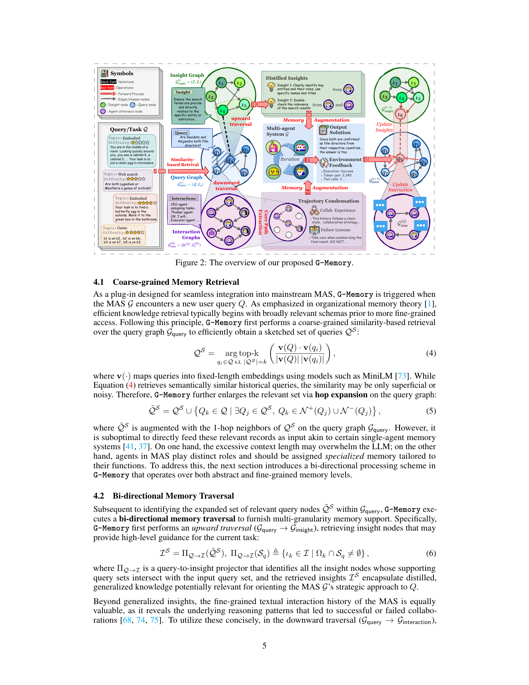
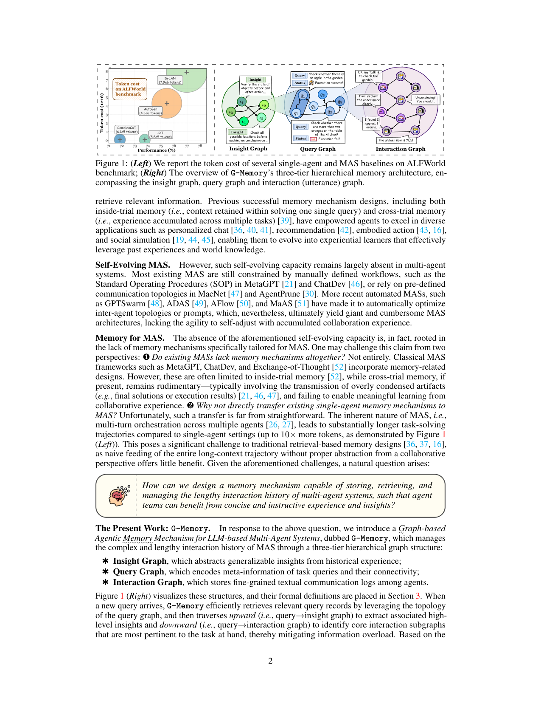

`g_memory | G-Memory: Tracing Hierarchical Memory for Multi-Agent Systems | NUS + 同济 + UCLA + A*STAR + NTU(Guibin Zhang, Muxin Fu;通讯 Kun Wang, Shuicheng Yan) | 2025-06 arXiv:2506.07398v2(16 Jun 2025)· 预印本 | L?·"多智能体系统(MAS)分层图记忆/自进化"主线·高相关`

> 三标注:【原文】=论文直述;【推断】=有据判断(附依据);【待核】=拿不准的关键事实。

══ 第一层:一眼看懂 ══

- 🟦 **TL;DR**:多智能体系统(MAS,多个 LLM agent 协作)比单 agent 强,但**不会自我进化**——根因是它们的记忆机制太简陋(要么没记忆,要么只把"最终结果"压缩存一下,完全忽略 agent 之间的协作细节)。G-Memory 受"组织记忆理论"启发,给 MAS 造一个**三层图记忆**:① Interaction Graph(底层,存 agent 间逐句对话的细粒度交互轨迹)② Query Graph(中层,存历史 query 及其元信息/连接性)③ Insight Graph(顶层,从历史经验蒸馏出可泛化的高层洞见)。新 query 来时,先在 Query Graph 上粗检索,再**双向遍历**:向上(query→insight)取高层指导、向下(query→interaction)取压缩过的核心协作轨迹;任务做完后三层一起更新(institutionalization)。**即插即用,不改原 MAS 框架**,在 embodied/QA 上分别提升最多 20.89% / 10.12%。【原文 摘要+§1+§4】

- **最巧的一步**:**把 MAS 超长协作轨迹组织成"三层抽象 + 双向遍历"**——尤其是"按 agent 角色定制记忆(role-specific)"+"用 LLM graph sparsifier 把交互图压缩成核心子图"。抽掉分层抽象/双向遍历,直接把整条长轨迹喂进去(单 agent 记忆那套),就会因 MAS 轨迹长达 10× token 而"信息过载、收益甚微"。消融 Figure 4c 证明:只给 insight 或只给 interaction 都掉点(AutoGen 平均掉 4.47%/对应另一变体)。这是它区别于单 agent 记忆直接迁移的根。【原文 §1, §4.2, Figure 4c】

══ 第二层:为什么做 ══

- **研究背景**:LLM 单 agent 的核心特质是 self-evolving(靠记忆从交互中持续改进,文献中带来 2–3 倍提升)。MAS 通过协作/竞争超越单 agent,但**self-evolving 能力在 MAS 里基本缺失**——多数 MAS 还被手工 workflow(MetaGPT/ChatDev 的 SOP)、预定义通信拓扑(MacNet/AgentPrune)束缚;即便 GPTSwarm/ADAS/AFlow/MaAS 能自动优化拓扑/prompt,产出的也是"巨大笨重、一次性"的架构,**不会随协作经验自我调整**。【原文 §1】

- **解决的具体痛点(两问自答)**:
  - ❶ 现有 MAS 完全没记忆?**不全是**——MetaGPT/ChatDev/Exchange-of-Thought 有记忆设计,但多限于 inside-trial(单 query 内);cross-trial 即便有也很初级(只传"最终解/执行结果"这类过度压缩的 artifact),**无法从协作经验里真正学习**。
  - ❷ 为啥不直接把单 agent 记忆搬到 MAS?**不直接可行**——MAS 是多 agent 多轮编排,轨迹比单 agent 长得多(**up to 10× token**,Figure 1 左);朴素地把整条长上下文喂进去、不做"协作视角的抽象",对传统检索式记忆几乎无益。
  - 由此核心问题:**怎样设计一个能存储/检索/管理 MAS 超长交互历史的记忆,让 agent 团队从简洁、有指导性的经验和洞见中受益?**【原文 §1】

- **相关工作 & 各自不足**:
  - *单 agent 记忆线*:MemoryBank/ChatDB/MemoChat/MemGPT(inside-trial,RAG 式 chunk 检索)→ ExpeL/Synapse(cross-trial)→ A-Mem/Mem0/MemInsight(更精细抽象)——都为单 agent 设计,不处理多 agent 协作结构。
  - *MAS 记忆线*:LLM-Debate/Mixture-of-Agent 干脆没记忆;MacNet/Exchange-of-Thought 只 inside-trial;ChatDev 的 cross-trial 只压成"最终 artifact",**忽略 agent 交互细节**。
  - *自动 MAS 线*:AutoGen/CAMEL/AgentVerse 全靠预定义 workflow;AFlow 用 MCTS 为特定域造 MAS,但**演化是 one-shot,不随任务量增长、不跨域迁移**。
  - **与最近邻 ExpeL/AFlow 的 Δ**:ExpeL 是单 agent cross-trial 经验记忆,无 MAS 协作建模;AFlow 是一次性结构搜索,无持续记忆。G-Memory 的关键差:**专为 MAS 的协作轨迹设计三层图 + 持续 episode 级更新 + role-specific 记忆分发**——既建模协作细节,又持续自进化,且即插即用。【原文 §2】

- **动机链**:MAS 强但不自进化 → 根因是缺 MAS 专属记忆 → 单 agent 记忆搬不过来(轨迹 10× 长、忽略协作)→ 需要"分层抽象"压缩长轨迹 + "双向遍历"按粒度取记忆 + "role-specific"给不同 agent 喂不同记忆 + "三层联合更新"实现持续进化。为什么不用更简单的:朴素长上下文喂入会过载;只存最终 artifact(ChatDev)学不到协作模式;纯相似度检索抓不住 query 间拓扑关系。【原文 §1, §4】

══ 第三层:怎么做 + 靠不靠谱 ══

- **三层图的形式化**:
  - **Interaction (Utterance) Graph** G_inter=(U,E_u):节点 u_i=(发言 agent A_i, 文本 m_i) 是原子 utterance,边按时序"u_j 传给并启发 u_k"。
  - **Query Graph** G_query=(Q,E_q):节点 q_i=(原始 query Q_i, 状态 Ψ_i∈{Failed,Resolved}, 关联的 G_inter),边编码 query 间语义关系——使检索能超越粗粒度 embedding 相似度、利用拓扑。
  - **Insight Graph** G_insight=(I,E_i):节点 ι_k=(洞见内容 κ_k, 支撑 query 集 Ω_k),**超边** (ι_m,ι_n,q_j) 表示"洞见 ι_m 通过 query q_j 为 ι_n 提供上下文"。【原文 §3】
- **方法流水线(对应 Figure 2,三步)**:
  1. **§4.1 粗粒度检索**:新 query Q 到来,在 Query Graph 上做相似度 top-k 检索得 QS(embedding 用 MiniLM),再**1-hop 邻居扩展**成 Q̃S(因为纯相似度可能浅层/有噪)。组织记忆理论:先取宽泛 schema 再精细访问。
  2. **§4.2 双向分层遍历**:
     - *向上(query→insight)*:投影器 Π_{Q→I} 取"支撑 query 集与 Q̃S 相交"的 insight 节点 IS,提供高层战略指导。
     - *向下(query→interaction)*:用 LLM 相关性打分 R_LLM 选 top-M 历史 query,再用 **LLM graph sparsifier S_LLM** 把它们的交互图压缩成核心子图(保留关键对话元素)。
     - *role-specific 分发*:算子 Φ 评估每条 insight / 压缩交互图对"该 agent 角色 Role_i + 任务 Q"的效用,**给每个 agent 初始化定制的 Mem_i**(过滤后的 insights + 交互片段 + 摘要)。可灵活配置调用时机(每轮/特定 agent)。
  3. **§4.3 分层记忆更新**:MAS 执行完拿到解 a(T) 与环境反馈(状态 Ψ、token、指标)。**三层联合更新**:interaction 层追踪每 agent utterance 建 G_inter 存档;query 层新建 q_new=(Q,Ψ,G_inter) 并与"top-M 相关历史 query + 支撑 IS 的 query 集"连边;insight 层用摘要函数 J 生成新 insight ι_new、与"本次用到的 insight"超边相连,并把 q_new 加进被用 insight 的支撑集 Ω_k(反映成功/失败应用)。形成跨 episode 的持续学习闭环。【原文 §4.1-4.3】

- **逐组件必要性**:
  - *insight 模块 vs interaction 模块*:Figure 4c 消融——只 interaction:AutoGen 平均掉 4.47%、DyLAN 掉 3.82%;只 insight 也掉(PDDL 50.00 vs 全 55.24)。两者**互补,都必要**,有消融。
  - *1-hop 扩展*:Figure 4a 敏感性——1-hop 最佳,2/3-hop 反而掉点(PDDL 2-hop 跌到 49.79%)→ 过度扩展引入无关 insight。✔有分析。
  - *检索 query 数 k*:Figure 4b——最优 k∈{1,2},k=5 显著掉点(ALFWorld+AutoGen −7.71%)→ 取太多引入噪声。✔有分析。
  - *role-specific 分发 Φ / LLM sparsifier*:**无单独消融**(没有"不分角色、统一喂记忆"或"不压缩交互图"的对照数字),其必要性靠 Takeaway② 的定性论证(基线缺 role-specific 故在 PDDL 掉点)。属"机制合理、未单独定量证明"项。【推断:依据=§5.4 消融只拆 insight/interaction 两块】

- **关键机制直觉**:核心是"**把 MAS 协作历史按抽象层级拆开,按需双向取用**"。Query Graph 当索引中枢(拓扑检索比纯相似度准);向上取 insight 解决"战略层该怎么分工/避坑",向下取压缩交互解决"具体协作怎么走";role-specific 分发避免"一份记忆喂所有 agent"的错配(MAS 里 CEO/Thinker/Executor 各需不同记忆)。整套**无 RL、无梯度**,全靠 LLM 提示完成抽取/压缩/打分/更新。【原文 §4】

- **实验与证据**:
  - 数据集:5 个 benchmark / 3 域——知识推理(**HotpotQA, FEVER**)、具身动作(**ALFWorld, SciWorld**)、博弈(**PDDL**)。
  - MAS 框架:**AutoGen / DyLAN / MacNet** 三种;LLM backbone:**Qwen-2.5-7b / Qwen-2.5-14b(本地 Ollama)+ gpt-4o-mini(OpenAI API)**。embedding MiniLM。超参 M∈{2,3,4,5}、k∈{1,2}。
  - Baseline:单 agent 记忆(No-memory、Voyager、MemoryBank、Generative Agents)+ MAS 记忆(MetaGPT-M、ChatDev-M、MacNet-M)。
  - **关键发现①(RQ1,Table 1-3)**:G-Memory 在**所有域 × 所有 MAS 框架**一致涨点。最亮:Qwen-2.5-14b 下把 MacNet 在 ALFWorld 从 58.21% 提到 **79.10%(+20.89%)**;gpt-4o-mini 下各 MAS 平均都拿第一(如 AutoGen Avg 48.27→57.18)。
  - **关键发现②(RQ1 反例)**:**很多记忆基线在 MAS 上反而掉点**——Voyager/MemoryBank 把 AutoGen+PDDL 拉低 4.17%/1.34%;ChatDev-M 在 MacNet+SciWorld −2.32%。原因:缺 role-specific 支持、或记忆范围太窄(只存执行结果)。**这正反衬 G-Memory 三特性(role-specific cues / 高层 insight / 轨迹压缩)的必要性**——是全文很有说服力的论据。
  - **关键发现③(RQ2 成本,Figure 3)**:G-Memory 高性能且 token 节制——PDDL+AutoGen 比 no-memory 提升 10.32%、仅多 1.4×10⁶ token;而 MetaGPT-M 多花 2.2×10⁶ token 才涨 4.07%。token 效率优于主流记忆设计。
  - **baseline 公平性**:同 backbone、同 MAS 框架,记忆机制为唯一变量,G-Memory 即插即用不改框架。较公平。【推断:依据=§5.1 设置 + 摘要"without any modifications"】
  - **看着强但需注意**:① 部分格子 G-Memory 非第一(如 Table 1 AutoGen+HotpotQA 35.67 仅略高);② PDDL 等绝对分仍低(20–28%),提升幅度大但天花板低;③ 全程**无 ground-truth-free 的鲁棒性分析**——状态 Ψ(Failed/Resolved)怎么判定、判错的影响未深究。【推断:依据=Table 1-3 数值 + 正文未述 Ψ 判定鲁棒性】

- **假设与失效边界**:
  - 【原文·Limitation】只在 3 域 5 benchmark 验证,**更多样任务(如医疗 QA)未验证**,留作 future work。
  - 【推断】整套依赖 LLM 完成 insight 蒸馏 / 交互图压缩(S_LLM)/ 相关性打分(R_LLM)/ role 效用评估(Φ)——**强依赖 backbone LLM 能力且带额外 LLM 调用成本**;弱 LLM 下抽取质量存疑(虽 Qwen-7b 上仍涨,但未做 LLM 能力梯度消融)。依据=§4 全部算子均 LLM 实现。
  - 【推断】三层图**只增不删(无遗忘/淘汰机制)**——Insight/Query/Interaction 图随 episode 持续膨胀,长期检索成本与噪声未给规模分析。依据=§4.3 更新只做"加节点/加边/扩支撑集",无删除;related work 提到 MemoryBank 有 Ebbinghaus 遗忘曲线、但 G-Memory 自身未采用。
  - 【推断】Query Graph 边的语义关系怎么建未在正文展开(放附录),其质量直接影响拓扑检索。依据=§3 Eq.2 仅定义、未述构边算法。

- **祛魅总结**:
  - **真贡献(硬货)**:(a)**首次系统指出 MAS 自进化瓶颈在记忆**并给出三层图方案,问题定位清晰;(b)**role-specific + 双向分层 + 轨迹压缩**确实针对 MAS 长轨迹痛点,且"基线在 MAS 上常掉点"的对照实验有力地证明了"MAS 需专属记忆";(c)**即插即用、跨 3 MAS × 3 LLM × 5 benchmark 一致涨点 + token 高效**,泛化与实用性强;代码开源。
  - **包装/可能高估**:"self-evolving""collective intelligence""institutionalization of group knowledge"措辞偏宏大;**全程无参数学习、无 RL**,所谓"进化"是"记忆库内容随 episode 增长 + 检索更准",本质是 test-time 经验记忆的 MAS 版,不是模型能力进化。Figure 6/案例的 emergent 协作展示偏定性。【推断:依据=§4 纯 LLM 提示 + 无任何梯度更新】
  - **可能低估/空白**:记忆膨胀/遗忘、Ψ 判定鲁棒性、LLM 能力依赖、Query Graph 建边算法——这些关键工程问题未充分讨论。【推断】

══ 结构化抽取 ══

- 🎯 **机制速览 6 轴**:

| 学什么信号 | 改什么 | 何时改 | 免梯度? | 记忆-技能生命周期 | 防遗忘机制 |
|---|---|---|---|---|---|
| 经验库 + 其他 agent(MAS 协作轨迹/utterance)+ 环境反馈(执行状态 Failed/Resolved、token、指标);**无显式 reward 优化,状态作标签驱动 insight 蒸馏** | **记忆**(三层图:insight/query/interaction;并 role-specific 注入各 agent 的 Mem_i / system prompt);**不改参数/不改 logits/不改 MAS 框架** | **在线 per-episode**(每完成一个 query 即三层联合更新;test-time 流式) | **是**(纯 LLM 提示驱动,零梯度) | 写入(LLM 蒸馏 insight + 建 query/interaction 节点)→检索(query graph 粗检索+1-hop→双向遍历 up/down)→**无遗忘/无淘汰**(三层只增节点/边/支撑集)→**跨 agent 共享=核心**(role-specific 把记忆分发给团队不同 agent) | **无**(三层图只增不减;靠 1-hop 限制 + top-k/top-M + LLM sparsifier 间接控噪,但库本身不淘汰) |

- ⑦ **开源代码 + 框架/harness**:**已开源** https://github.com/bingreeky/GMemory(已 `git ls-remote` 核验**真实可达**,main HEAD=7b581c5…)。harness:作为 **plug-and-play 模块**嵌入主流 MAS 框架 **AutoGen / DyLAN / MacNet**;embedding **all-MiniLM-L6-v2**;backbone Qwen-2.5-7b/14b(本地 Ollama)+ gpt-4o-mini(OpenAI API)。**无 RL 训练框架**(veRL/TRL/OpenRLHF 等均不涉及,纯推理时 LLM 提示驱动)。〔代码仓未 clone 核对文件级细节——待核 README/实现〕【原文 摘要, §5.1】

- 💰 **资源/成本与可扩展性**:推理时方法、无训练成本。token:比主流记忆设计更省(Figure 3:PDDL+AutoGen 仅 +1.4×10⁶ token 换 +10.32%,优于 MetaGPT-M 的 +2.2×10⁶ 换 +4.07%)。隐性成本:每 episode 多次 LLM 调用(insight 蒸馏 / sparsifier / 相关性打分 / role 评估)。可扩展性隐患:三层图无遗忘机制,长期膨胀的检索/存储成本未量化。【原文 §5.3】

- 🎯 **对"探索-巩固"idea 对标**:**支撑 + 可借组件,但偏 MAS 场景**。
  - *可借组件 1*:**三层抽象(细粒度轨迹→query 索引→高层 insight)+ 双向遍历**——为"巩固"提供了一个分层组织模板;TSRD 可借鉴"把 path-recovery 经验分层存:底层具体纠偏轨迹 / 顶层可泛化的'路径选择'原则",检索时按需取粒度。
  - *可借组件 2*:**Query Graph 拓扑检索(超越纯 embedding 相似度)**——用任务间关系图做检索,可迁移到"按任务相似/关联结构检索相关 recovery 策略"。
  - *可借组件 3*:**轨迹压缩(LLM graph sparsifier)**——把长轨迹压成核心子图,与"切关键步(高熵/低置信)"思路互补,可作"巩固前的轨迹瘦身"。
  - *竞品/区别*:与 reasoningbank 同属"成败经验蒸馏成 insight 的 test-time 记忆",但 G-Memory 专攻 **MAS 协作 + role-specific 分发 + 显式三层图结构**(reasoningbank 是单 agent + 扁平记忆库 + 刻意从简结构)。两者结构 vs 内容互补。
  - *缺口*:纯 test-time、零梯度、记忆只增不减、不动参数——对 mtp_opd"把策略蒸馏回参数(OPD)+ MTP foresight"主线,它只在"记忆怎么组织/检索/在 MAS 内共享"这一层相关,**核心的参数级巩固、防遗忘、MTP 探针它都没碰**。若 idea 要落到单模型参数,G-Memory 主要贡献"分层组织 + 跨 agent 共享"的工程范式。【推断:依据=方法纯记忆 + 项目 project_core_idea】

- 🔭 **开放问题/未来方向**:
  - 【原文】扩到更多样任务(如医疗 QA)以增强 soundness。
  - 【推断】引入记忆遗忘/淘汰控规模;降低对 backbone LLM 的多次调用依赖;Ψ(成败)判定的鲁棒性;Query Graph 建边算法的系统研究;把"记忆内容进化"升级为"agent 策略/参数进化";结合 RL 学"何时调用/给哪个 agent 多少记忆"。依据=方法与实验局限。

- 🖼 **关键图 top-2**:

  
  这是**原文 Figure 2**(方法主图):中间是多个不同 topic/difficulty 的 query(Embodied/Web search/Game),右侧展示"相似度检索→核心路径抽取→轨迹压缩(Collab. Experience / Failure Lessons)→蒸馏 Insights"如何 Memory Augmentation 进 MAS;底部标出 upward/downward traversal 与三层图(Insight/Query/Interaction)的 Update 闭环。选它因为一图贯通"粗检索→双向遍历→role-specific 增强→三层更新"全机制。

  
  这是**原文 Figure 1**:左图是动机——ALFWorld 上 MAS(AutoGen 4.3e6、DyLAN 7.9e6 token)比单 agent CoT(5.8e5)贵约 10×,点出"MAS 长轨迹不能朴素喂入"的核心痛点;右图清晰画出 Insight/Query/Interaction 三层图及其连接(含成功/失败 query 例子)。选它因为它一图同时给出"为什么需要分层抽象(成本动机)"和"三层架构长什么样",是理解全文出发点的最佳图。

──────────
**幂等状态**:本文 analysis 首次产出。机制类型 = MAS 分层图经验记忆(三层 insight/query/interaction,双向遍历 + role-specific 分发;test-time、免梯度、在线 per-episode、跨 agent 共享为核心)。抽到 2 图:是(Figure 2 工作流 + Figure 1 动机/架构)。代码仓 `git ls-remote` 已核实真实可达。
