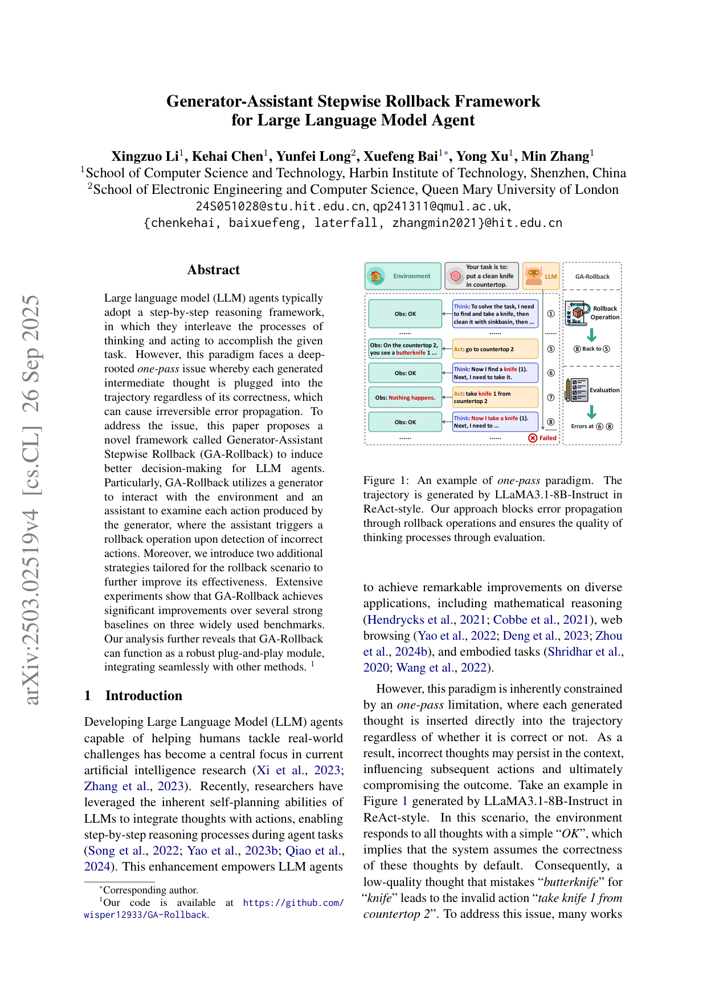
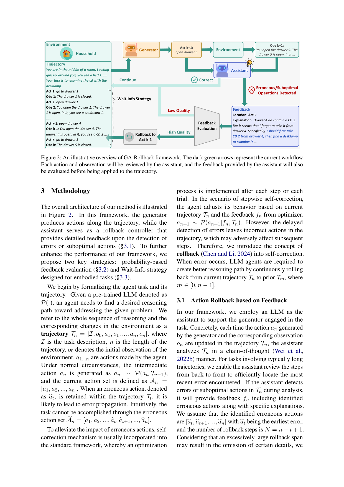

`ga_rollback | Generator-Assistant Stepwise Rollback Framework for LLM Agent | 哈工大(深圳) HIT-SZ + Queen Mary | 2025-09(arXiv:2503.02519v4, EMNLP'25 系) | L? 推理/自我纠错（推理时、免训练 agent harness）· 相关性 Med`

> 档位：**deep**（全字段三层 + 结构化抽取）。所有内容基于已下载 PDF 正文（_txt_ga_rollback.txt，10 页正文 + 附录）。

══ 第一层：一眼看懂 [light] ══

- 🟦 **TL;DR**：LLM agent 走 ReAct 这种"一步接一步"的范式有个老毛病——**每一步想法不管对错都被塞进轨迹里，错了也回不去（one-pass / 不可逆的错误传播）**。GA-Rollback 让**一个 generator 负责跟环境交互产生动作**，**另一个 assistant（同模型）当"质检员"逐步审查动作+观测**；一旦发现某步错了，就**触发"回滚"——重置环境、重放到出错前那一步、带着反馈重新生成**。再加两个小策略：①**概率打分过滤反馈**(对 assistant 输出 token 做 mean-pool 概率，低于阈值 0.93 的反馈直接丢弃，防止误报乱回滚)；②**Wait-Info**(具身任务里前 k=6 步不让 assistant 插手，让 generator 先充分探索，再给质检员看)。**纯推理时、零训练**，可即插即用挂到 ReAct/Reflexion 上。

- **最巧的一步**：**"回滚=重置环境 + 重放 A_{t-1} 动作序列恢复状态"** 这一步。抽掉它，框架就退化成普通的 stepwise self-refine（只在 prompt 里加反馈、轨迹里的错步仍残留）——消融 §4.6 "w/o Assistant" 直接掉回 Act-only 水平（Game24 17.2→5.4）。它把"自我纠错"从"在脏轨迹后面续写"升级成"真的退回到干净状态点重走"，这是阻断错误传播的关键。次关键是**概率反馈过滤**(w/o evaluation：Game24 17.2→15.4、ALFWorld 88.1→82.8)，没它会因低质反馈触发大量无用回滚。

══ 第二层：为什么做（写透，重点） ══

- **研究背景**：LLM agent 主流是 **ReAct 式 step-by-step 范式**——思考(thought)与动作(action)交替推进任务，已在数学推理(Game24)、网页浏览(Webshop/WebArena)、具身任务(ALFWorld)上拿到不错成绩。但这类范式有个被忽视的结构缺陷。【原文 §1】

- **解决的具体痛点**：**one-pass 限制 + 不可逆错误传播**。每生成一个 thought 就直接插进轨迹 Tn，**不管它对不对**；环境对所有 thought 都回一句"OK"(默认其正确)，于是一个把"butterknife(黄油刀)误当 knife(刀)"的低质想法会直接导致后续无效动作"take knife 1"，错步残留污染整条轨迹直到失败(图1，LLaMA3.1-8B 真实轨迹)。形式化讲：一旦错误动作 b a_t 被留在 T_t 里，后续动作集 b A_n=[a1,...,b a_t,b a_{t+1},...] 几乎注定完不成任务。【原文 §1 + §3 形式化】

- **相关工作 & 各自不足**(原文 §2 两条线)：
  1. **结构化推理框架**(ToT/GoT/Soft-SC)：用打分机制优化逐步决策，但**仍受错误传播之苦**——ToT 即便逐步打分，错误分支选中后无法真正撤回环境状态；且具身环境动作空间指数爆炸，穷举搜索复杂度过高(§4.5)。
  2. **自我纠错(self-correction)**：Self-Refine/Reflexion/CRITIC 等用上一次执行的反馈在**多次 trial 之间**精炼计划。但**每个 trial 内部仍是 one-pass**——错误检测被延迟到 trial 结束，trial 内的错步照样传播。而且 Kamoi et al. (2024) 指出**反馈生成本身是自我纠错的瓶颈**：不可靠的反馈反而有害。【原文 §2.2】

- **动机链**：现状(ReAct 高效但 one-pass) → 缺陷(错步不可逆残留、trial 内无法纠) → **所以必须把"纠错"下沉到 step 级，且要能真的撤销环境状态而非只在 prompt 里道歉** → 但 step 级纠错又依赖反馈质量(否则乱回滚) → **所以要(a)引入独立 assistant 逐步审查 + 环境级回滚、(b)给反馈加置信门控、(c)给具身任务加探索缓冲**。为什么不用更简单的"trial 间 Reflexion"？因为它修不了 trial 内的错误传播(论文核心反驳点)。为什么不用 ToT？因为 ToT 仍会沿错误分支传播、且具身任务搜索爆炸(§4.5 实验对比)。【原文 §1 + §3 + §4.5】

- **与最近邻工作的 Δ**：
  - **vs Thought Rollback (Chen & Li 2024)**：GA-Rollback **借了 rollback 概念**(并把"过去错误当经验知识写进 prompt"也借自它)，但 Thought Rollback 是在**思维图里回退节点**(纯文本层)，GA-Rollback 的关键 Δ 是**回退要重置真实环境并重放动作恢复状态**——交互式 agent 里光退思维不退环境状态会导致 thought 与真实观测脱节。【原文 §3.1，"inspiration from Chen and Li (2024)"】
  - **vs Reflexion**：Reflexion 在 trial 之间反思，GA-Rollback 在 **trial 之内、per-step** 由独立 assistant 审查并回滚；两者正交可叠加(实验里 GA-Rollback+Reflexion 最强)。
  - **vs CRITIC/Self-Debug**：它们靠**外部工具**(代码执行器/检索)产反馈，GA-Rollback 用**LLM 自身当 assistant**且加**概率置信过滤**来保证反馈可信，不依赖外部工具。【原文 §2.2 结尾】

══ 第三层：怎么做 + 靠不靠谱 ══

- **方法流水线**(图2)：输入任务描述 I 与初始观测 o0 →
  ① **Generator 与环境交互**：a_n ∼ P(a_n|T_{n-1})，动作 a_n、观测 o_n 更新进轨迹 T_n；
  ② **Assistant 逐步审查(§3.1)**：每步都用 CoT **从后往前**分析 T_n，定位最近的错误，输出反馈 f_n=(错误位置 + 解释)；长轨迹设回滚跨度上界 N̄(N=n−t+1 超过就截到 N̄，防一次退太多丢细节)；
  ③ **概率门控(§3.2)**：对 assistant 输出 Y 算 mean-pool token 概率 Score_Y(式1)，< θ=0.93 直接丢弃该反馈(不传给 generator、不触发回滚)；
  ④ **回滚操作(§3.1)**：收到"回滚到 T_{t-1}"指令 → **重置环境** → 从 T_{t-1} 取动作集 A_{t-1}=[a1,...,a_{t-1}] **依次重放恢复状态** → generator 据 T_{t-1}+f_n 重生成 a_t，迭代搜索直到找到可行路径；
  ⑤ **Wait-Info(§3.3，仅具身)**：前 k 步锁住 assistant 不让它插手，等 generator 跑满 k 个连续动作再审查(若回滚把长度压到 k 以下则继续锁)。
  输出：完成任务的纠错后轨迹。

- **逐组件必要性**(消融 §4.6 表3，generator 固定 Qwen2.5-14B)：
  - **Assistant(回滚核心)**：去掉 → 退化为 Act-only，Game24 17.2→**5.4**、ALFWorld 88.1→78.3、Webshop 41.2→34.0。**最关键，有消融。**
  - **概率反馈评估**：w/o evaluation → Game24 17.2→15.4、ALFWorld 88.1→82.8、Webshop 41.2→37.2。**有消融，证明低质反馈过滤确实重要。**
  - **Wait-Info**：w/o → ALFWorld 88.1→80.6(仅具身任务有此项)。**有消融。** 另图4给出 ∩ 形曲线，k≈6 最优(比无 wait 高 4-8 个点)，太小饿死信号、太大噪声淹没。
  - **Assistant 规模**：0.5B→72B 单调提升(Game24 6.8→19.4)，说明 assistant 的推理能力直接决定纠错质量。【原文表3 下半】

- **关键机制/公式直觉**：
  - **概率门控(式1)** `Score_Y = (1/m)Σ P(y_i|y_<i, X)`：直觉是"模型自己对这段反馈有多笃定"。错误反馈往往伴随低 token 概率(模型自己也含糊)，用它当置信代理可滤掉噪声反馈、避免无谓回滚。阈值 0.93 是经验选的(图3 KDE 近正态，0.93 滤噪同时保留大部分反馈，0.98 太严丢太多反馈、效率低)。【原文 §3.2/§4.3】
  - **环境级回滚**：直觉是"自我纠错不能只在脏轨迹后面续写道歉，要真的退回干净状态点重走"——通过重放 A_{t-1} 把环境恢复到出错前，generator 才能在正确状态上下文里重新决策。这是它与"prompt 层 self-refine"的本质分野。
  - **Wait-Info = 探索/诊断相位分离**：原文(§4.4)把它解读为"horizon-gated scheduler"，**把 generator 的高熵探索阶段与 assistant 的低熵诊断阶段分开**——具身任务前期必须先大量探索(开抽屉、找物体)，过早让 assistant 介入会把正常探索误判为错误而乱回滚。

- **实验与证据**：
  - **数据集/设置**：Game24(数学推理,采500)、ALFWorld(具身,用 OOD unseen 集)、Webshop(网页购物,采500,稠密 reward 0-1)。模型 LLaMA3.1-8B / GLM4-9B / Qwen2.5-14B，generator=assistant 同模型，H20 GPU。【原文 §4.1】
  - **核心主张证据**(表1)：GA-Rollback 单用即超 ReAct——Game24 上 Qwen14B 17.2%(ReAct 7.6%，**2.3×**)、GLM4 5.4%(ReAct 0.2%，**27×**)、LLaMA 4.2%(ReAct 0.4%，**10.5×**)。**与 Reflexion 叠加最强**：GA-Rollback+Reflexion 在 Qwen14B 三任务平均 SR 53.8%(全表最高)。
  - **vs 树搜索**(表2)：Game24 上 GA-Rollback 18.4% > ToT-BFS 6.4%(Qwen14B)，代价 2× token、1.5× 时间(相对 ToT)。证明回滚式纠错比穷举搜索更高效准确。
  - **baseline 公平性**：baselines(Act-only/CoT/ReAct/Reflexion/ReAct+Reflexion)都是同模型同设置，且额外报告了 token/时间成本(表4)与 GPT-4o 验证(表5)，**对比相对公平且诚实地暴露了成本**。
  - **"看着强但没答核心问题"的点**：ALFWorld 上即使叠 Reflexion 仍 suboptimal(原文 §4.2(iii)/Limitations(1) 自己承认)——说明长轨迹任务"该回滚到哪一步"仍未解决；且 ReAct 在 Webshop 上反而掉点(§4.2(iv))，说明 thought 质量本身是双刃剑，GA-Rollback 并未根治"想得对不对"只是补救"想错了能退"。

- **假设与失效边界**：
  - 【原文 Limitations(3)】**强依赖环境可完全回滚/重置并重放恢复状态**——对含不可逆动作的真实环境失效(作者建议在不可逆动作前加额外验证步)。
  - 【原文 Limitations(1)+§4.2(iii)】**长轨迹具身任务上"回滚到哪一步"难判定**，效果次优，需设回滚跨度上界 N̄。
  - 【原文 Limitations(2)】**阈值 θ 与 Wait-Info 步数 k 需人工经验调**(未做单 trial 内动态调整)。
  - 【推断，依据 §4.6 assistant 规模消融】**assistant 太弱(如 0.5B)纠错质量塌**——反馈可信度直接受 assistant 推理力上限约束。
  - 【推断，依据 §4.2(iv)】与 ReAct 直接组合可能因 thought 冲突而不稳(附录C 有冲突例)。

- **祛魅总结**：
  - **真贡献(硬货)**：把"自我纠错"从 prompt 层落到 **环境状态层**(重置+重放恢复)，这是相对 Reflexion/Self-Refine 的实质升级；**概率门控反馈** + **Wait-Info 探索/诊断相位分离**两个小设计都有干净消融支撑；作为 plug-and-play 与 Reflexion 叠加的增益是真实可叠加的。【推断】
  - **包装/营销成分**：标题与摘要强调"better decision-making for LLM agents"，但本质是**一个推理时 harness**(generator+assistant 双角色+环境回放),没碰参数、没学到东西、跨任务不持久化；ALFWorld 上仍 suboptimal 说明它**没解决"如何判断哪步错、退到哪"这个真正难的问题**——它把这个判断外包给了"另一个同模型 assistant 的启发式 CoT + 概率阈值"，本质是用算力(5-6× token)换纠错。【推断】
  - 作者**诚实**：Limitations 三条都点到了要害(不可逆环境、长轨迹定位、超参靠调)，没有过度吹嘘。【推断】

══ 结构化抽取（供全景汇总，必填） ══

- 🎯 **机制速览 6 轴** [light]：

| 维度 | 内容 |
|---|---|
| **学什么信号** | 环境观测 + **另一个 agent(assistant)的自反思反馈**(CoT 从后往前定位最近错误)；反馈可信度用**模型自身 token 概率**(mean-pool)做置信信号 |
| **改什么** | **harness/轨迹**(回滚=改写轨迹状态，丢弃错误动作段并重生成)；**不改参数、不改 prompt 模板、不写持久记忆** |
| **何时改** | **在线 per-step**(每步动作+观测都被 assistant 审查；触发即回滚到 T_{t-1});纯 **test-time**，无训练阶段 |
| **免梯度?** | **是**(全程推理时；generator 与 assistant 同一冻结模型，主实验均用现成 Instruct 模型) |
| **记忆-技能生命周期** | 弱：把"过去错误"作为经验知识写进 prompt 避免重犯(借鉴 Thought Rollback)，但**单 trial 内、不跨任务持久化**；无检索/遗忘/共享机制 |
| **防遗忘机制** | **不适用**(无参数更新，无灾难性遗忘问题) |

- ⑦ **开源代码 + 框架/harness**：开源，https://github.com/wisper12933/GA-Rollback 。**无训练框架**——属推理时 agent harness（generator+assistant 双角色 + 环境重置回放逻辑 + 概率过滤）；用 Qwen2.5/LLaMA3.1/GLM4 现成模型，NVIDIA H20 推理。【原文 §脚注1 + §4.1】
- 💰 **资源/成本与可扩展性**：回滚带来明显开销——Webshop 上 token≈Act-only 的 5–6×、运行时≈5–6×（表4：GA-Rollback 34.1K token vs Act-only 5.4K）；vs ToT-BFS 仅 2× token、1.5× 时间但效果更好（表2）。设上限"最多 6 次回滚/任务"做性能-成本权衡（图7，6 次是最优拐点）。无训练成本(纯推理)。【原文 §B.1 + 图7】

- 🎯 **对"探索-巩固"idea 对标** [light]：**可借组件**。它把"path-recovery（路径恢复）"做成了**推理时的环境级回滚 + 单点接管**——与你"在关键步单点接管、教 path-recovery"高度同构；其**概率置信度门控反馈**(mean-pool token prob)和 **Wait-Info 的"高熵探索 vs 低熵诊断"相分离**可直接迁移为 MTP-foresight 触发回退的判据。属**免训练竞品/积木**：它没用 MTP/梯度，回滚靠外部 assistant 启发式判断；若用 MTP 前瞻信号替代"概率阈值/CoT 定位错误"，可把"何时回滚、回滚到哪"从经验阈值升级为可学信号(直接补它 Limitations(1)(2) 的两个软肋)。

- 🔭 **开放问题/未来方向**：
  - 【原文 Limitations】长轨迹具身任务的错误定位；阈值 θ 与 Wait-Info k 的**单 trial 内动态自适应**；不可逆环境下的回滚替代方案(动作前验证)。
  - 【推断】把"何时回滚"从概率阈值升级为可学/前瞻信号(MTP);把"过去错误经验"从单 trial prompt 升级为跨任务持久记忆库。

- 🖼 **关键图 top-2** [light]：
  
  这是**原文图1**：直观展示"一步错、步步错"的动机——环境对所有想法只回"OK"默认其正确，低质想法污染后续动作。选它因为它一眼讲清要解决的痛点（不可逆错误传播）。
  
  这是**原文图2**：方法主图，画清 generator/assistant 分工、回滚触发点、两个增强策略如何咬合。选它因为它是整套机制的 pipeline 全貌。
