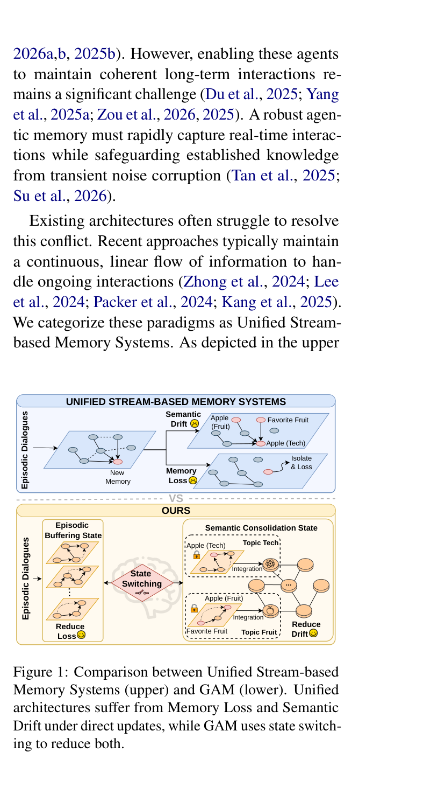
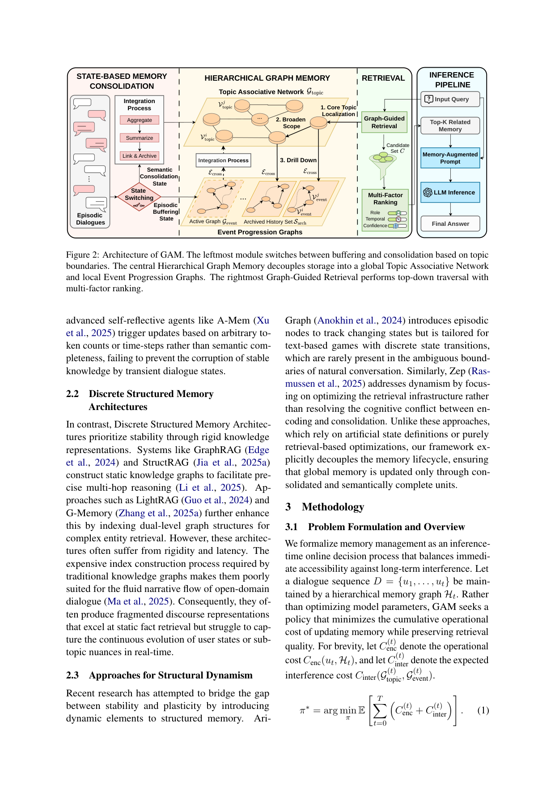

`gam | GAM: Hierarchical Graph-based Agentic Memory for LLM Agents | Zhejiang Univ + UIC + Rutgers + MBZUAI + McGill(Zhaofen Wu, Hanrong Zhang, Philip S. Yu, Hongwei Wang 等) | 2026-04 v1 · arXiv 2604.12285 | 主题线 L?(记忆·图结构 agentic memory) · 相关性 High`

══ 第一层:一眼看懂 [light] ══
- 🟦 TL;DR:长对话 agent 的记忆系统面临"边吸收新信息、边别冲掉旧知识"的两难。统一流式记忆(stream-based)更新方便但易被瞬时噪声污染(导致 Memory Loss、Semantic Drift),离散结构化记忆稳但跟不上叙事变化。GAM 的做法:**把"编码"和"巩固"显式解耦**——正在进行的对话先关在一个局部 **Event Progression Graph(事件演进图,快速 append 缓冲)**;只有当检测到**语义漂移(话题切换)**时,才把缓冲内容原子性地整合进全局 **Topic Associative Network(话题关联网络,长期稳定)**。灵感来自睡眠依赖的记忆巩固。再配一个图引导的多因子检索(时间+置信+角色)做精准召回。
- 最巧的一步:**用"语义散度指示器 \(b_t\in\{0,1\}\)"取代任意触发器**——只在叙事单元语义完整(话题边界)时才巩固。抽掉这个"语义触发"门,GAM 就退回成普通图记忆:要么每轮硬更新(回到污染老路),要么固定窗口/固定轮数切(实验证明这会切断 Logical Flow 边、F1 从 40.00 掉到 34.23)。这一步是"编码-巩固解耦"能成立的闸门。

══ 第二层:为什么做(写透,重点) ══
- **研究背景**:LLM agent 要维持连贯的长期交互,核心矛盾是"获取新信息 vs 保留旧知识"(stability-plasticity)。一个鲁棒的 agentic memory 必须既能实时快速捕获交互,又能保护已有知识不被瞬时噪声污染(§1)。
- **解决的具体痛点**(§1-§2,越具体越好):①**统一流式记忆系统**(Generative Agents 线性流、MemGPT/MemoryOS/Mem0 的 OS 式分层)——编码快但**缺写隔离**(open-gate policy):新来的、带噪声的信息被直接 append/merge 进长期库,导致两个具名病症——**Memory Loss**(已有节点因连接弱而被结构性孤立、遗忘)和 **Semantic Drift**(不同话题被错误混为一谈,扭曲主题一致性,如图1 里 Apple(Fruit) 被 Apple(Tech) 冲掉)。②**离散结构化记忆**(GraphRAG/StructRAG/LightRAG/G-Memory 构静态知识图)——稳但**僵化、索引构建昂贵延迟高**,跟不上开放域对话的流动叙事,产生碎片化话语表示。③**结构动态化尝试**(AriGraph 加 episodic 节点、Zep 优化检索)——AriGraph 为文本游戏的离散状态转移设计,自然对话边界模糊处用不上;Zep 只优化检索基础设施,**都没真正解决编码-巩固的认知冲突**。
- **动机链**:长期交互要兼顾快速感知 + 稳定保留 → 流式系统更新方便但无写隔离 → 噪声直接污染长期库(Memory Loss + Semantic Drift)→ 离散结构化系统稳但僵化跟不上叙事 → 既有"结构动态化"工作要么靠人为离散状态、要么只优化检索,没碰到根问题 → 所以必须**显式解耦"编码(encoding)"与"巩固(consolidation)"**:把进行中的对话隔离在局部缓冲,只在语义完整时才原子性并入全局,才能同时拿到 plasticity(局部快 append)与 stability(全局只收语义完整单元)。为什么不用更简单的现成做法(如固定窗口/固定轮数切)?§4.4 实证:固定 256-token 窗口平均 F1 只有 34.23,因为硬切会切断 Logical Flow 边。
- **形式化(§3.1)**:把记忆管理建成**推理时在线决策过程**,目标是最小化累积的(编码代价 \(C_{enc}\) + 干扰代价 \(C_{inter}\)),而**不优化模型参数**(原文明示 "Rather than optimizing model parameters")。由于在线精确评估未来干扰不可行,用语义散度指示器 \(b_t=I(\Delta(G_{event},G_{topic})>\varepsilon)\) 作为低成本策略触发器近似最优策略 \(\pi^*\)。
- **与最近邻工作的 Δ**:① 与 **A-Mem**(自反思 agent)——A-Mem 也更新记忆,但**按任意 token 数/时间步触发**,无法防瞬时对话态污染稳定知识;GAM 改用语义完整边界触发。② 与 **MemGPT/Mem0**——它们是 OS 式分层但**直接 append/merge 进 LTM**(无写隔离);GAM 把全局 Topic 网络与局部 Event 图**物理分开**。③ 与 **Zep/AriGraph**——它们靠检索优化或人为离散状态;GAM 显式解耦"编码-巩固"生命周期。④ 灵感来源是**睡眠依赖的记忆巩固**(Chang et al. 2025),把生命周期分 Episodic Buffering / Semantic Consolidation 两相。这差异有用,因为"只在语义完整边界做原子更新"直接对症 Memory Loss / Semantic Drift 这两个具名病。

══ 第三层:怎么做 + 靠不靠谱 ══
- **方法流水线(三阶段协同,§3.2-3.4)**:输入对话流 → ①**Episodic Buffering Phase**:每条 utterance 构成原子 event 节点 et,快速 append 进局部 **Event Progression Graph** G_event(节点=话语/响应,边=时序/因果),严格 **write isolation**——高频更新只在局部域,保护全局 G_topic 不被噪声污染。②**语义边界检测**:维护固定容量 episodic buffer Bt(2048 token);**判别器不每轮查**,只在 sparse 维护事件(session-end / 自然停顿 / buffer overflow)触发,用 LLM \(M_\theta\) 作"神经代理"判断是否语义漂移(指令严格度\(=\varepsilon\) 的启发式代理,不设刚性数值阈)。③**Semantic Consolidation Phase**:当 \(b_t=1\),原子性地把 buffered 子图 merge 成一个**双粒度语义节点** \(v_{new}=\{c_{sum}\)(LLM 摘要,供高层主题推理), \(c_{raw}\)(拼接原文,防摘要丢细节)\(\}\);用 **coarse-to-fine** 策略并入全局——\(c_{sum}\) 先向量召回 top-5 最近 topic 节点,只对这紧凑候选集跑 LLM 语义打分器(避免 \(O(N)\) 全图扫),置信\(>\tau\) 才建边;完成后把 event 图归档进 \(S_{arch}\) 并经 \(E_{cross}\) 跨层链接为 grounded evidence,重置局部 buffer。④**Graph-Guided Multi-Factor Retrieval**(推理时桥接两层):a. 语义锚定+扩展(在 G_topic 找 top-k 锚 + 一阶邻居,纳入相关主题);b. 结构下钻(沿 E_cross 到归档 event 图取原始证据);c. 多因子重排——cross-encoder 算基础语义概率 \(P_{sem}(v|q)\),再乘 time/conf/role 三个 boosting 因子(乘法调制,关键词命中但语义不相关者不会被误抬,因其 \(P_{sem}\) 低)→ 输出 top-K → 拼成记忆增强 prompt → LLM 出答案。
- **逐组件必要性(§4.3 消融,LoCoMo + Qwen2.5-7B,full F1=40.00)**【原文 Table 3】:**w/o EPG=25.06**(降幅最大 −14.94 → Event 图的叙事结构对时序鲁棒性最根本)、**w/o SSM=32.58**(去状态切换 −7.42 → 解耦编码-巩固以防污染的必要性)、**w/o TAN=35.07**、**w/o MFR=35.94**(高层主题组织 + 多信号融合对跨会话推理与精确检索必要)。**四个组件都有消融、都掉**,且 EPG/SSM 两个"解耦核心"贡献最大,直接支撑"解耦"是方法灵魂的论断。
- **关键机制/直觉**:\(b_t\) 指示器的妙处在于"用一个 LLM 判别 + sparse 触发"把昂贵的高维图距离计算 \(\Delta\) 省掉——判别器只在 session-end/停顿/溢出这种"廉价信号"时被叫,且把"指令严格度"当 \(\varepsilon\) 的代理,所以巩固只发生在叙事自然边界。多因子重排用**乘法**而非加法,是为了让"光匹配关键词但语义无关"的候选无法靠单一因子刷分(base \(P_{sem}\) 低则整体低)。
- **实验与证据(关键数字)**【原文】:① **主结果 LoCoMo**(Table 1,4 个 backbone)——GAM 多数设置拿最高平均 F1;Qwen2.5-7B 上 Temporal F1 超 Mem0 18%+(48.97 vs ~41.22),GPT-4o-mini 上 Avg F1=43.14(最高);② **LongDialQA**(Table 2,多方对话)——Qwen2.5-7B 上 Avg F1=12.55,超 MemoryOS 86%,说明结构化记忆能补小模型上下文容量不足;③ **分割策略消融**(§4.4 Fig3,**支撑核心主张的关键实验**)——语义触发 F1=40.00 > 固定窗口256=34.23 > session 基线=36.59,Temporal 从最强基线 44.12→48.97,且在 40% 分割噪声下仍稳超固定窗口(Appendix C.3);④ **效率**(Table 4)——最低 token 消耗 1370/query,比 Mem0 省 11%。
- **baseline 公平吗 / 有没有"看着强但没回答核心"**:baseline 覆盖三类范式(启发式 MemoryBank/ReadAgent、流式 MemGPT/MemoryOS/Mem0、自演化 A-Mem),跨 4 个 backbone(3B/7B/14B/GPT-4o-mini),β 因子取稳定区间而非 per-dataset 激进调参,基本公平。**作者诚实标注两个反例**:① GPT-4o-mini 上 Mem0 的 Temporal F1 仍更高(56.42 vs 51.96)——当 backbone 本身时序推理强、上下文利用充分时,直接检索原始 trace 能保留 GAM 巩固时可能压缩掉的精确时序;② Open-Domain 是 GAM 最难类(问题弱定位、缺时序/角色线索,需广覆盖而非结构化剪枝)。这两点诚实,没有掩盖。
- **假设与失效边界**【推断,除标注外】:核心假设"话题级语义漂移可被 LLM 判别器+阈值指示器 \(b_t\) 可靠检测,且话题边界=安全巩固点"。失效边界——① 若对话话题**连续渐变无明显边界**(\(b_t\) 长期\(=0\)),buffer 会膨胀、巩固延迟(2048 token 溢出会强制 check 兜底);② \(\varepsilon\) 不是数值阈而是"prompt 严格度",鲁棒性靠 §4.4 的 40% 分割噪声实验旁证,**未给阈值/\(\varepsilon\) 敏感性曲线**(原文只给 β 因子 1.0-2.0 敏感性 Appendix D.1);③ 语义打分依赖 LLM 调用(虽只在巩固期),小 backbone 上判别质量可能下降。
- **祛魅总结**:**真贡献(硬货)**——(a) 把"编码-巩固解耦"具象成"局部 event 图缓冲 + 全局 topic 网络 + 语义触发原子合并"的可实现架构,write isolation 思想清晰;(b) 消融干净地证明解耦(EPG/SSM)是性能主因;(c) 分割策略对比是有说服力的"为什么必须语义触发"实证;(d) 效率不降反升(省 token)。**包装/营销成分**——"sleep-dependent consolidation 启发"是合理类比但**并非生物学机制的实现**(只是两相隔离的叙事,属【推断】);"semantic divergence indicator"听起来精确,实际是 LLM prompt 判别 + sparse 触发的启发式(作者自己也承认 ε 非刚性数值阈,这点反而诚实)。整体偏务实,主张与证据匹配度高,**未明显高估**。

🎯 **机制速览 6 轴** [light]
| 维度 | 内容 |
|---|---|
| 学什么信号 | 对话流本身的**语义漂移信号**(局部 event 图与全局 topic 图的散度);无环境 reward、无人类标注 |
| 改什么 | **记忆**(两层图结构):局部 Event Progression Graph + 全局 Topic Associative Network + 归档 Sarch + 跨层关联 Ecross;**不动模型参数**(原文明示 "Rather than optimizing model parameters") |
| 何时改 | **在线 per-turn 快速 append(缓冲)+ 语义触发的离散巩固**(state switching:Episodic Buffering State ↔ Semantic Consolidation State) |
| 免梯度? | **是**(纯推理时记忆管理 + LLM 做语义打分/摘要,无训练) |
| 记忆-技能生命周期 | 写入(event 图 append)→ 触发巩固(摘要+merge 进 topic 图)→ 归档(Sarch)→ 多因子检索读取;显式 write isolation 防污染 |
| 防遗忘机制 | **物理隔离 + 状态切换**:把全局 topic 网络与局部 event 图物理分开("write isolation for narrative buffering"),只在语义完整边界做原子更新,降低 Memory Loss / Semantic Drift——一种"隔离式"防遗忘(非 KL/merging/几何) |

- 🎯 **对"探索-巩固"idea 对标** [light]:**强支撑 + 高度同构的可借组件**。GAM 几乎是"探索-巩固"在记忆层的直接实例:Episodic Buffering = 探索期快速吸收(不污染主存),Semantic Consolidation = 巩固期把可靠经验固化进稳定结构。其"语义漂移触发巩固""物理隔离缓冲区""巩固只在语义完整边界发生"都可迁移到我们 MTP/OPD 的"何时把探索所得写回参数/技能库"的触发设计。**最近邻对照**:与 sleepgate / nemori(也走 buffer→consolidate)同族,Δ 在于 GAM 用双层图 + 语义散度触发,且强调写隔离。

- 假设与失效边界(一句)【推断】:核心假设"话题级语义漂移可被一个阈值指示器 bt 可靠检测,且话题边界=安全巩固点";失效边界——若对话话题连续渐变无明显边界(bt 长期=0),缓冲会膨胀、巩固延迟;语义打分依赖 LLM 调用(虽只在巩固期),阈值 δ 与散度度量的鲁棒性原文靠 40% 分割噪声实验旁证但未给阈值敏感性曲线【推断,基于 §4.4 仅测分割策略对比】。

🖼 **关键图 top-2** [light]

· 这是**原文 Figure 1**:上半 Unified Stream-based 直接更新导致 Apple(Fruit)被 Apple(Tech)冲掉(Memory Loss)与话题混淆(Semantic Drift);下半 GAM 用 Episodic Buffering ↔ Semantic Consolidation 的状态切换分离两者。选它因为它一图点破本文要解决的核心矛盾与解法直觉。

· 这是**原文 Figure 2**:最左 State-Based Consolidation(Buffering/Consolidation 状态切换),中间 Hierarchical Graph Memory(上 Topic Associative Network、下 Event Progression Graph),右侧 Graph-Guided Multi-Factor Retrieval 接入推理管线。选它因为它完整呈现"编码-巩固解耦 + 多因子检索"的全流程,是方法主图。
· 关键数字【原文 §4.3-4.5,Table 1/3/4】:消融中 full GAM 平均 F1=40.00,去掉 EPG 降至 25.06、去掉 SSM(state switching)降至 32.58——证明"解耦"贡献最大;Temporal 任务从最强基线 44.12→48.97;效率 1370 tokens/query,较 Mem0 省 11%。

⑦ 开源代码 + 框架/harness:**原文未给代码链接/GitHub**(正文与首页均未见 Source Code 链接);属推理时记忆框架(无训练,故无 veRL/TRL 类训练框架),实现细节(语义打分 prompt 等)在附录 E。〔代码是否开源:原文未说明〕
