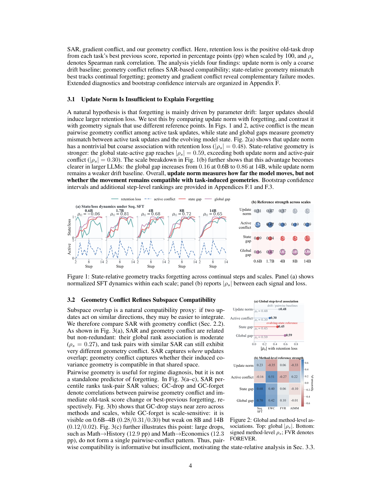
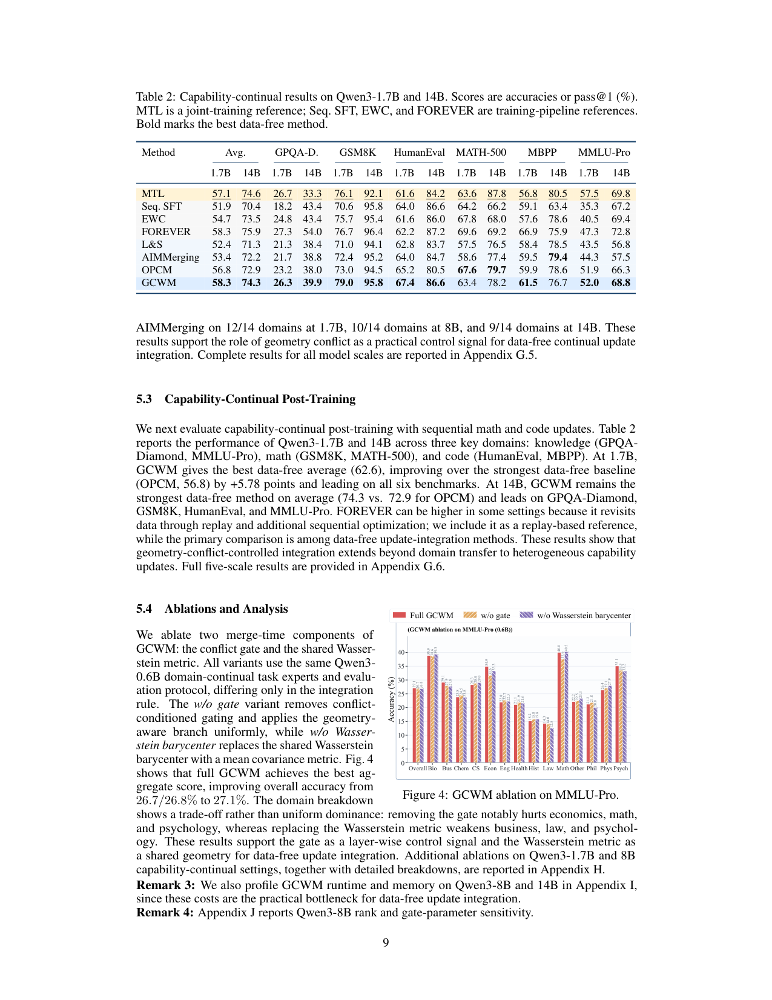

`geometry_conflict | Geometry Conflict: Explaining and Controlling Forgetting in LLM Continual Post-Training | 香港理工大学 PolyU (Yuanyi Wang, Yifan Yang 等共一;通讯 Hongxia Yang) + InfiX.ai + 港科大 HKUST | 2026 arXiv:2605.09608v1(标注 10 May 2026)· 预印本 | L?·"参数 merging/几何冲突解释+控制遗忘"主线·高相关(与 agent_dice 同族,理论更深)`

> 三标注:【原文】=论文直述;【推断】=有据判断(附依据);【待核】=拿不准的关键事实。
> 注:本文 51 页(正文 10 页 + 大量附录 A-J)。以下基于已下载真实 PDF 正文;关键附录事实(WUDI 基算子、active set 策略、runtime/memory、TIES/DARE 对比)已逐条定位附录原文。arXiv id=2605.09608(2026-05),时间窗内。

══ 第一层:一眼看懂 ══

- 🟦 **TL;DR**:LLM 连续做多阶段 post-training(先训领域 A,再 B、C……)时,什么时候"新更新能迁移、不伤旧能力",什么时候"灾难性遗忘"?本文给出一个**几何解释**:把每个任务的参数更新 \(\Delta_t = \theta_t - \theta_{pre}\) 看成一个矩阵,算它的**协方差几何** \(C = \Delta^\top\Delta\)(刻画这个更新主要在哪些子空间、用多大谱能量改模型);两个任务的"几何冲突"用**归一化 Bures-Wasserstein 距离**(协方差矩阵之间的最优传输距离)度量。**核心发现**:遗忘不是"更新走得远(范数大)"就发生,而是"**新任务的更新几何与'已经被前面更新塑造过的当前模型状态'的几何不兼容(state-relative geometry conflict 高)**"时才发生——这个 state-relative 几何冲突(\(|\rho_s|\approx 0.59\),且在大模型上越强,14B 达 0.86)比 update norm(0.48)、子空间对齐 SAR、梯度冲突都更能预测遗忘。基于此提出 **GCWM(Geometry-Conflict Wasserstein Merging)**:一个**完全 data-free(合并时不需任何训练数据)**的连续 merging 方法——用各任务的协方差几何构造一个共享的 Wasserstein 度量(高斯 Wasserstein 重心 barycenter),把更新先"白化-在重心度量下对齐-再着色",并用**逐层几何冲突当门控 α**(冲突高的层施加更强的几何感知修正、冲突低的层弱修正),最后与普通 merge 线性混合。在 Qwen3 0.6B-14B 的领域持续 / 能力持续两种设置上,GCWM 在所有 data-free 基线里最强。【原文 摘要+§3+§4+§5】

- **最巧的一步**:**把"参考系"从"任务对之间"换成"任务 vs 演化中的模型状态(state-relative)"**——抽掉这个视角(只看任务两两的 pairwise 冲突,Fig 3),几何冲突几乎预测不了遗忘(GC-forget 在 8B/14B 仅 0.12/0.02);一旦换成"当前更新 vs 当前累积状态"的 state/global gap,相关性立刻跳到 0.68/0.70(Seq.SFT)且随规模增强。这是全文的灵魂:**遗忘是"状态相对的更新整合失败",不是绝对漂移**。GCWM 的门控信号正是基于这个 state-relative 冲突。【原文 §3.3, Fig 1/2】

══ 第二层:为什么做 ══

- **研究背景**:continual post-training 已是扩展 LLM 的主流范式(逐阶段加领域/技能/行为)。但顺序更新何时迁移、何时遗忘缺乏**原则性的"任务兼容性"判据**——尤其 LLM 任务高度异质、目标差异大、相同更新幅度可能导致完全不同的保持结果。【原文 §1, §2.3】

- **解决的具体痛点**:现有四类方法(顺序微调 / 回放 / 正则 / merging)都"强调保住旧性能",但**没回答那个核心实操问题:新更新何时该强整合、何时该抑制**?也就是缺一个能**判断并控制**"该不该把这步更新吃进去"的兼容性信号。已有兼容性诊断(参数差异、梯度对齐、子空间/谱重叠如 SAR)**大多只是"诊断"用,不能直接当"控制"信号**。【原文 §1, §2.3】

- **相关工作 & 各自不足**:
  - *四类 CL*:顺序微调(异质序列下极易遗忘)、回放(需历史数据)、正则(约束漂移、被动)、merging(组合任务更新,但难解跨任务干扰)。
  - *continual model merging*:OPCM(投影式顺序合并)、null-space 过滤 / test-time gating 的稳定性方法、资源受限的在线 adapter 合并、AIMMerging(用训练轨迹自适应迭代合并)。
  - *兼容性度量*:Demystifying Mergeability 指出"子空间重叠 + 梯度对齐"是稳定的 method-agnostic 指标,**但仍是诊断性的**;SAR(子空间对齐比)、Task Singular Vectors、gradient surgery/vaccine(梯度冲突)。
  - **与最近邻的 Δ**:① 对"诊断性兼容度量",差在**把几何冲突做成 method-native 的"控制信号"(门控)而非只诊断**;② 对 OPCM/AIMMerging 等 data-free 连续 merging,差在**用 Bures-Wasserstein 协方差几何 + Wasserstein 重心共享度量 + 逐层冲突门控**,且理论上证明"相对损失被几何冲突 × 门控位移上界控制"(Theorem 1)。为什么有用——它解释了 update norm / pairwise 兼容为何不够,并给出唯一能随规模增强的 state-relative 信号。【原文 §2.3, §3, §4】
  - *与几何/梯度冲突的互补(§3.4,重要)*:**几何冲突 vs 梯度冲突不是一回事**——top 几何冲突层集中在 up/gate/v/down_proj(占≈0.89),而 top 负梯度层集中在 q/k_proj(占≈0.86)。梯度冲突暴露"优化层面的对抗",几何冲突捕捉"更新整合的失配",二者互补。【原文 §3.4, Fig 3(d-f)】

- **动机链**:LLM 连续 post-training → 顺序更新会遗忘 → 问"什么驱动遗忘" → 假设是范数(漂移)→ 实测范数只是粗基线(0.48)→ 试 pairwise 几何/SAR → 也不够(8B/14B 几乎不相关)→ **换 state-relative 参考系**(更新 vs 演化状态)→ 这个信号最强且随规模增强 → 所以遗忘=state-relative 整合失败 → 把这个信号变成**门控**去控制 merging 的整合强度(冲突高强修正、冲突低弱修正)→ 用 Wasserstein 重心做共享度量对齐更新 → data-free 即可。为什么不用更简单:范数/pairwise 都被实测证明不足;回放需数据;纯正则被动不"按层按冲突"调节。【原文 §3.1-3.4, §4】

══ 第三层:怎么做 + 靠不靠谱 ══

- **方法流水线(GCWM,data-free 连续 merging,对应 §4 Eq.1-11)**:
  1. **任务几何 + 投影到共享基**:对每个活跃更新 \(\Delta_i\) 的每个线性层 ℓ,算 \(C^{(\ell)}_i = \Delta^\top\Delta + \lambda I\)(谱能量+主子空间,\(\lambda I\) 保数值稳定);对所有活跃更新做截断 SVD 取右奇异方向,正交化拼成共享基 \(Q^{(\ell)}\);投影几何 \(B^{(\ell)}_i = Q^\top C_i Q\)。【原文 §4.1 Eq.1-3】
  2. **逐层几何冲突 → 门控**:两两投影几何用归一化 Bures-Wasserstein 距离算 \(\gamma_{ij}\)(Eq.4),加权聚合成层级冲突 \(g^{(\ell)}=\sum w_{ij} \gamma_{ij}\)(Eq.5);过 sigmoid 门 \(\alpha^{(\ell)}=\alpha_{min}+(\alpha_{max}-\alpha_{min})\cdot\sigma(\kappa(g-\tau))\)(Eq.6,τ 是冲突阈值、κ 控门陡度)。**冲突高 → α 大 → 几何修正强**。【原文 §4.1 Eq.4-6】
  3. **共享 Wasserstein 度量 + 门控合并**:用高斯 Wasserstein 重心 \(\bar{B}^{(\ell)}=\arg\min \sum \omega_i d^2_B(B, B_i)\)(Eq.7)作为局部对齐度量;把投影更新**白化**(乘 \(\bar{B}^{-1/2}\))→ 用基算子 M 合并 → **着色**(乘 \(\bar{B}^{1/2}\))回去得 \(\Delta_{geo}\)(Eq.8-9);**基算子 M 实例化为 weighted WUDI**(一种已有的 merge 算子);最后与未门控的普通 merge 线性混合 \(\Delta_{merge} = \alpha\cdot\Delta_{geo} + (1-\alpha)\cdot\Delta_{plain}\)(Eq.10)。【原文 §4.2 Eq.7-10, "We instantiate M with weighted WUDI [55]"】
  4. **增量连续更新**:步 t 按 memory policy 选 active set \(A_t\)(**history-aware 策略**保留历史任务更新,或 **anchor-based 策略**把当前任务对着"上一次合并状态"合并);只施加相对上一次合并状态的**增量** \(\Delta_{inc,t} = \Delta_{merge,t} - \Delta_{merge,t-1}\)(Eq.11),\(\theta_t = \theta_{t-1} + \eta_t\cdot\Delta_{inc,t}\)。【原文 §4.3 Eq.11 + 附录】
  5. **理论(§4.4)**:Theorem 1——GCWM 相对 plain merge 在旧任务 u 上的额外损失 \(\leq \eta_t\cdot\sum c\cdot g^{(\ell)}\)(几何冲突项)\(+ (\eta^2/2)\cdot\sum d\cdot\|位移\|^2\)(度量位移项),即**相对损失被"几何冲突 × 门控位移"上界控制**;Proposition 1——门把高冲突层的修正放大、低冲突层缩小(\(g\leq\tau\Rightarrow\alpha\leq\) 中点,\(g\geq\tau\Rightarrow\alpha\geq\) 中点)。【原文 §4.4 Theorem1/Prop1,证明在附录 C/D】

- **逐组件必要性(消融 Fig 4,Qwen3-0.6B 域持续)**:
  - **Full GCWM** overall 27.1% > **w/o gate** 26.7% > **w/o Wasserstein barycenter**(换成均值协方差度量)26.8%。
  - 去 gate:economics/math/psychology 明显掉 → 证明**逐层冲突门控有用**;换掉 Wasserstein 度量:business/law/psychology 弱化 → 证明**共享 Wasserstein 度量有用**。
  - **诚实之处**:作者明说这是"trade-off 而非全面碾压"(domain breakdown 各有升降),overall 仅 +0.3~0.4pp。✔两组件都有消融。
  - *门参数(α_min/α_max/κ/τ)、rank、memory policy 的敏感性*:**正文未给,挪到附录 J(rank/gate 敏感性)**——主文层面属"未充分展示"。【推断:依据=Remark 4 指向附录 J】

- **关键机制直觉**:把"两个任务能不能合"从"方向是否重叠(SAR)"升级到"**它们改变模型的协方差几何在共享空间里是否兼容(Bures-Wasserstein)**"。白化-着色 = 先把不同任务的更新搬到同一个"几何坐标系(Wasserstein 重心)"再合并,避免几何不匹配造成的破坏;门控 = 只在"几何确实冲突"的层施加这种昂贵的几何对齐(冲突小的层用便宜的 plain merge)。state-relative = 关键参考系是"当前累积状态"而非孤立任务对。【原文 §3.3, §4.2】

- **实验与证据**:
  - 数据集 & 设置:**Qwen3 0.6B/1.7B/4B/8B/14B**。域持续=14 个子领域序列(每域 1k 样本),评 14 个 **MMLU-Pro** 子类;能力持续=30k 数学 + 30k 代码,评 GSM8K/MATH-500/MBPP/HumanEval/GPQA-Diamond/MMLU-Pro。每个分数 5 次评估取平均,评测代码严格遵循 Qwen3 技术报告。【原文 §5.1】
  - Baseline:**data-free 主对比**——Localize-and-Stitch(L&S)、AIMMerging、**OPCM**;**参考线**(用了额外正则/回放,非纯 data-free)——Seq.SFT、EWC、FOREVER(回放);非连续 merging TA/TIES/DARE 在附录 G.4。
  - **关键发现①(域持续 Table 1)**:GCWM 在 1.7B/8B/14B **non-MTL overall 全部第一**,比最强 data-free 基线 +1.61/+0.74/+1.23 分;增益面广(1.7B 上 12/14 域超 AIMMerging)。
  - **关键发现②(能力持续 Table 2)**:1.7B 上 GCWM data-free 平均 62.6(注:正文表头列 1.7B=58.3 14B=74.3 为 Avg 列对齐;文中称 1.7B avg 62.6,超 OPCM 56.8 +5.78、六个 benchmark 全领先)〔1.7B 数值表头与正文叙述有 58.3/62.6 两处,以正文 §5.3 "62.6,+5.78" 为准,**表格排版疑似错位,待核**〕;14B data-free 平均最强 74.3 vs OPCM 72.9。**FOREVER(回放)有时更高**,但作者明确它是回放参考线、主对比在 data-free 内。
  - **关键发现③(vs 非连续 merging,附录 G.4)**:GCWM 各规模 ≥ 最强非连续 merge(多为 TIES);1.7B +3.24(5/6 wins)、4B +5.71(6/6)、8B +2.6;**DARE 在此设置极不稳**(0.6B 崩到 15.1%、8B 32.2%)。
  - **baseline 公平性**:同骨干、同评测协议、5 次平均、区分 data-free 与回放/正则参考线,较严谨。
  - **看着强但需警惕**:① **绝对增益温和**(域持续 overall +0.7~1.6pp,0.6B 消融仅 +0.3),"最强 data-free"成立但提升幅度不大;② 与**回放法 FOREVER 常打不过**(承认了,但削弱"实用性"卖点——若允许少量回放,GCWM 未必最优);③ Sec 3 的相关性分析**在小模型(0.6B)上 state-relative 信号很弱甚至反号**(\(\rho_G=-0.06\)),"随规模增强"意味着小模型上该解释/方法都打折。【原文 Table 1/2, Fig 1, 附录 G.4】

- **假设与失效边界**:
  - 【推断·关键】**state-relative 几何冲突的解释力强依赖模型规模**——0.6B 上 \(|\rho_s|\) 仅 0.16、\(\rho_G=-0.06\),1.7B 起才显著(0.81/0.68/...)。小模型上"几何冲突→遗忘"的因果链弱。依据=§3.1 Fig 1(b) 的 scale breakdown。
  - 【推断】**所有任务更新须相对同一 \(\theta_{pre}\)、同架构**(\(\Delta_i=\theta_i-\theta_{pre}\),SVD 共享基);异构骨干不适用。依据=§4 定义。
  - 【原文/推断】理论 Theorem 1 在**局部光滑 + 投影几何充分 + 层级度量曲率**假设下成立(附录 C);这些是局部近似,大步长/强非线性下界可能松。依据=§4.4 + 附录 C 假设。
  - 【推断·成本】**merge-time 是实际瓶颈**(作者自陈 Remark 3):Qwen3-8B 平均**每合并步 40.5±19.7 分钟、峰值 7.8±3.4 GB GPU**(附录 I/Fig21/Table32),开销主要在 SVD/Wasserstein 重心/矩阵平方根/逆平方根。**这与 agent_dice "1 分钟级" 形成鲜明对比**——GCWM 几何对齐贵得多。依据=附录 I 原文。
  - 【推断】memory policy 选 history-aware 还是 anchor-based、active set 大小如何影响结果,主文未系统比较。依据=§4.3 只列两种策略未消融。

- **祛魅总结**:
  - **真贡献(硬货)**:(a)**一个新颖且经验扎实的"遗忘解释":state-relative geometry conflict** —— 系统对比 update norm/SAR/梯度冲突,用 Spearman + bootstrap CI 论证它最能追踪遗忘且随规模增强,这个"诊断科学"部分很硬;(b)**几何冲突 vs 梯度冲突的模块级分离**(几何在 up/gate/v/down、梯度在 q/k)是有信息量的新观察;(c)把诊断信号**转成可控门控**并给出 conflict-controlled 损失上界(Theorem 1),理论-方法闭环;(d)**Bures-Wasserstein 协方差几何 + Wasserstein 重心白化-着色**作为 merging 的几何对齐机制,是比 TIES/任务向量更细的几何处理。
  - **包装/可能高估**:① **方法增益温和且常输给回放**——"最强 data-free"是真,但"实用 control signal"在允许回放时优势不明显;② **merge-time 极贵**(8B 每步 40 分钟),"data-free 省数据"换来"算力/时间贵",成本叙事不能只说省数据;③ 基算子 M 直接用现成 **WUDI**,GCWM 的增量更多在"几何对齐外壳 + 门控",核心 merge 仍借既有算子。【推断:依据=Table 2 FOREVER + 附录 I runtime + §4.2 WUDI】
  - **可能低估/空白**:小模型失效、门参数/memory policy 敏感性都被挪进附录,主文读者易高估普适性。【推断】

══ 结构化抽取 ══

- 🎯 **机制速览 6 轴**:

| 学什么信号 | 改什么 | 何时改 | 免梯度? | 记忆-技能生命周期 | 防遗忘机制 |
|---|---|---|---|---|---|
| **无新训练信号**——用各任务**已训好的参数更新 \(\Delta_i\) 的协方差几何 \(C=\Delta^\top\Delta\)**;核心信号="**state-relative 几何冲突**"= 新更新几何 vs 演化中模型状态几何的 Bures-Wasserstein 距离(自动算,不需数据) | **backbone 参数 θ(逐层线性层,full-space 正则变换)**——通过几何对齐(白化-着色)+ 门控混合重写权重;**不改 prompt/记忆/logits、不加模块** | **离线/增量连续**(每个 continual 步合并一次,只施加相对上次合并的增量 \(\Delta_{inc}\);**非在线 per-step 梯度更新**) | **是(合并阶段 data-free、免梯度)**——只做 SVD / Wasserstein 重心 / 矩阵平方根 / 门控混合,无反向传播;各任务先各自 SFT(那步有梯度,合并本身零梯度、零数据) | 无外部记忆/技能库;"知识"=各任务更新 \(\Delta_i\);**memory policy** 决定 active set(history-aware 保留历史更新 / anchor-based 对着上次合并状态)→ 合并写回 θ;无检索/无显式遗忘淘汰/无跨 agent 共享 | **merging + 几何冲突门控(几何对齐式巩固)**:① **Wasserstein 重心共享度量 + 白化-着色** 把不同任务更新对齐到同一几何坐标系再合并(防几何失配破坏);② **逐层几何冲突门控 α**(冲突高的层强几何修正、低的层用 plain merge);理论上**相对损失被几何冲突上界控制**。**无回放(data-free)/无 KL/无参数隔离**,靠 Bures-Wasserstein 几何 |

- ⑦ **开源代码 + 框架/harness**:**已开源** https://github.com/wyy-code/GCWM(首页 + 摘要明确给出)〔本次未 `git ls-remote`/clone 核验,完整度待核〕。**基 merge 算子 = weighted WUDI(已有方法)**;几何模块自研(Bures-Wasserstein 距离 / 高斯 Wasserstein 重心 / 截断 SVD / 白化-着色)。**不使用 RLHF 框架**(本方法无 RL、无训练数据,纯参数空间 merging)。各任务 SFT 阶段框架原文未明示(只说遵循 Qwen3 评测协议)。【原文 §4.2, §5.1】

- 💰 **资源/成本与可扩展性**:**训练**——Qwen3 0.6B-14B 各任务 SFT(域持续 14×1k、能力持续 30k+30k)。**合并(瓶颈)**——Qwen3-8B 每合并步 **40.5±19.7 分钟、峰值 7.8±3.4 GB GPU**(附录 I,主成本=SVD/Wasserstein 重心/矩阵平方根/逆平方根),作者自陈这是 data-free 整合的实际瓶颈。可扩展性:几何对齐随层数/秩/参数量增长,逐层 SVD+矩阵平方根代价随模型规模上升;比纯任务向量合并(如 agent_dice 的 1 分钟级)昂贵得多,但仍是离线一次性、不需训练数据。【原文 Remark 3, 附录 I, Fig21/Table32】

- 🎯 **对"探索-巩固"idea 对标**:**强支撑(理论层) + 可借组件(诊断信号) + 警示(成本与小模型)**。
  - *支撑面(高价值,对标项目"巩固")*:它**用严谨的相关性分析证明"遗忘=state-relative 整合失败、几何冲突是可控信号"**——这为"探索-巩固"中"巩固阶段如何不破坏已学能力"提供了**比 agent_dice 更深的机理依据**:不是看更新大小,而是看"新经验的更新几何是否与当前已巩固状态兼容"。TSRD 巩固 path-selection/recovery 经验时,可借这个判据决定"该不该把某条新轨迹吃进参数"。
  - *可借组件 1*:**state-relative 几何冲突作为"巩固门控信号"**——在 OPD 巩固时,用"待蒸馏更新 vs 当前模型状态"的几何兼容度,逐层调节蒸馏强度(冲突高的层少改、保住已学路径选择能力)。与项目 reusable_techniques 的"有界更新"动机一致,但提供了"按层、按几何冲突"的细粒度控制。
  - *可借组件 2*:**几何冲突 vs 梯度冲突的模块分离观察**(几何在 MLP up/gate/down + v_proj、梯度在 q/k)——提示 MTP foresight / OPD 巩固时,**不同投影族承担不同冲突类型**,可差异化处理(如 q/k 用梯度对齐、MLP 用几何对齐)。这对"MTP 探针该放在哪层"有启发。
  - *竞品/区别*:与 mtp_opd 主线**正交**——GCWM 是 data-free 离线 merging 多个已训模型,**不做 on-policy 蒸馏、不做在线探索、不动 MTP 前瞻**;且 merge-time 极贵(8B 每步 40 分钟),不适合在线持续。可作"巩固判据/后处理插件",替代不了在线探索-蒸馏环。
  - *警示/缺口*:**小模型(0.6B)上几何冲突解释力崩**(ρ≈−0.06)——若 TSRD 用小骨干验证,这套"几何巩固"判据可能失灵;且符号/几何类巩固对"罕见但关键的 recovery 方向"(少数任务才对)可能误判(与 agent_dice 同类风险,本文未讨论)。【推断:依据=§3.1 scale breakdown + 项目 survey-grpo-step 的 sparse_critical 关切】

- 🔭 **开放问题/未来方向**:
  - 【原文】把 state-relative 几何冲突同时作为"遗忘解释信号"和"整合控制信号"——已在 Qwen3 验证,作者定位为可推广的判据。
  - 【推断】① 降低 merge-time 成本(40 分钟/步 → 近似/低秩几何);② 在小模型上修复几何信号失效;③ memory policy(history-aware vs anchor)的系统比较与自适应;④ 门参数(α/κ/τ)、rank 的自动调节;⑤ 与回放/正则混合(几何门控 + 少量回放)是否能超过纯回放 FOREVER;⑥ 从"离线连续 merging"扩到"在线流式整合"。依据=Remark 3/4 + Table 2 FOREVER 对比。

- 🖼 **关键图 top-2**:

  
  这是**原文 Figure 1(+同页 Figure 2)**(全文灵魂的实证图):Panel (a) 展示 Seq.SFT 下各规模(0.6B-14B)的 state/loss 动态——1.7B 起 state gap 与 retention loss 同步增长(\(\rho_G\) 0.81/0.68/0.72/0.65),0.6B 几乎不相关(−0.06);Panel (b) 用 \(|\rho_s|\) 条形图直接对比四种信号(update norm / active conflict / state gap / global gap)对遗忘的预测力,global gap 从 0.6B 的 0.16 涨到 14B 的 0.86,全面压过 update norm。选它因为这一图**就是论文核心主张"遗忘=state-relative 几何冲突、且随规模增强"的直接证据**,也是 GCWM 门控信号的合法性来源。

  
  这是**原文第 9 页**:**Figure 4** GCWM 在 MMLU-Pro(0.6B)的消融——Full GCWM 27.1% vs w/o gate 26.7% vs w/o Wasserstein barycenter 26.8%,并按域拆出"去 gate 伤 econ/math/psych、换度量伤 bus/law/psych"的 trade-off;同页 **Table 2** 能力持续结果显示 GCWM 是最强 data-free 方法(但 FOREVER 回放有时更高)。选它因为同时支撑"门控与 Wasserstein 度量两组件都有用(但增益温和、是 trade-off)"和"data-free SOTA 但非碾压回放"两个对祛魅至关重要的事实。

──────────
**幂等状态**:本文 analysis 首次产出。机制类型 = **参数 merging / 几何冲突解释+控制遗忘**(用 Bures-Wasserstein 协方差几何度量"state-relative 几何冲突"作为遗忘解释信号与逐层门控;data-free、合并阶段免梯度;Wasserstein 重心白化-着色对齐 + 冲突门控混合,基算子用 WUDI)→ 防遗忘靠"几何对齐 + 按冲突门控整合强度",有 conflict-controlled 损失上界;无回放/无 KL/无隔离。**关键警示**:merge-time 极贵(8B 40分钟/步)、小模型几何信号失效。抽到 2 图:是(Figure 1 核心发现 + 第 9 页 Fig4 消融/Table2 证据页)。代码 https://github.com/wyy-code/GCWM(未 clone 核验,完整度待核)。Table 2 1.7B 数值表头(58.3 vs 正文 62.6)疑排版错位,已标〔待核〕。
