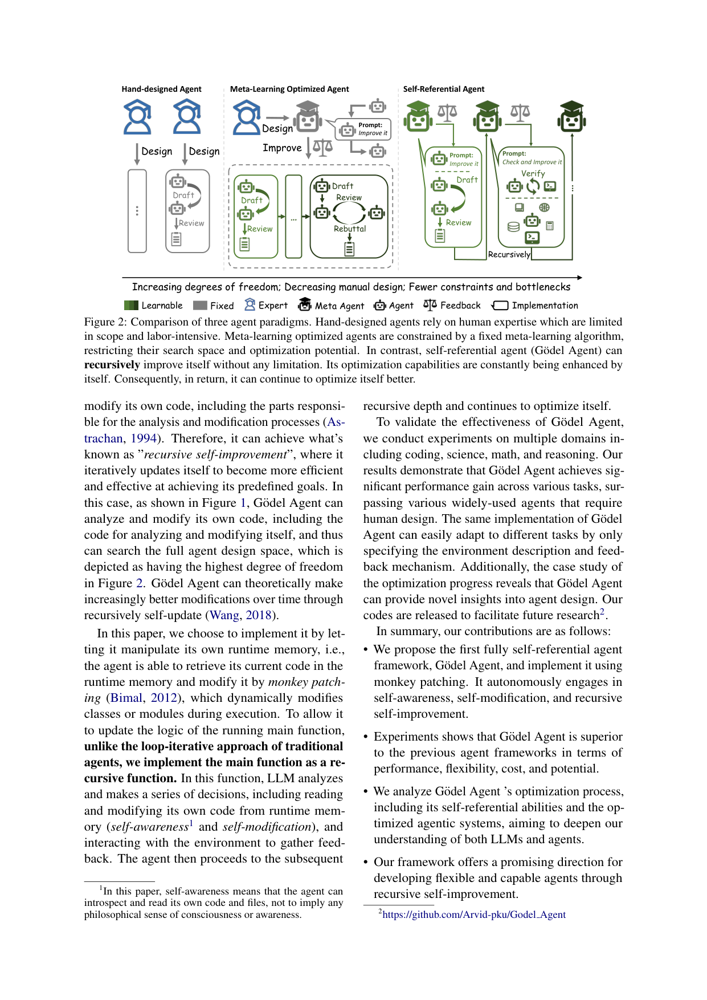
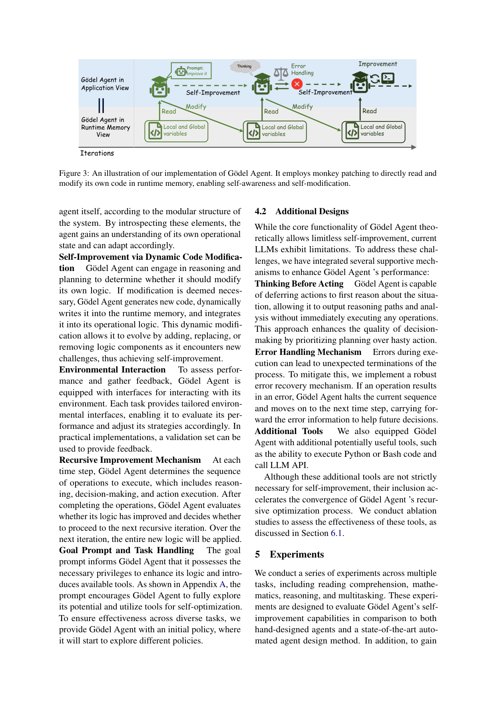

`godel_agent | Gödel Agent: A Self-Referential Agent Framework for Recursive Self-Improvement | Peking Univ. · UCSB · Univ. of Arizona(Xunjian Yin, William Yang Wang 等) | arXiv 2410.04444v4, 2025-05-31(早期奠基作) | 主题线 L?(自进化 agent / 递归自改进 / 自指框架)· 相关性 高(自进化谱系奠基)`

> light 档笔记。基于真实 PDF 正文。三标注:【原文】【推断】【待核】。注:此为 2024-10 奠基作(自进化谱系的"祖先"之一),按时间窗作背景纳入。

══ 第一层:一眼看懂 [light] ══
- 🟦 **TL;DR**:【原文】现有 agent 要么是**手工设计**(固定流水线,部署后不变),要么是**元学习优化**(用人写死的元算法/自然语言梯度/记忆去改 prompt 或模块——但元算法本身也固定不可改),都因人类先验把搜索空间限死、可能错过更优设计。受 **Gödel 机**(Schmidhuber 2003,可证明自修改达全局最优)启发,本文提出 **Gödel Agent**:一个能**读写自己全部代码、递归自我改进**的 agent。它靠 **monkey patching**(运行时直接改内存里的函数/对象)实现"自感知 + 自修改",仅由高层目标(goal prompt)引导,不依赖任何预定义流程或固定优化算法。在 DROP/MGSM/MMLU/GPQA 上,约束版 Gödel-base(GPT-3.5)就超过手工方法与元学习基线(Meta Agent Search/ADAS);无约束 Gödel-free 进一步大涨(如 MGSM 90.6%、GPQA 55.7%)。
- **最巧的一步**:【推断,依据 §4.1 Algorithm1 + Fig3】"**用 monkey patching 让 sensor/executor 能读写 agent 自身的全部代码(含自改进算法 \(I_0\) 本身)**"——这把传统"可改 \(π\)(策略)、不可改优化器"的天花板捅破:连"怎么改自己"的元逻辑都可被改。抽掉这点,Gödel Agent 就退回成普通的"可改 prompt 的元学习 agent"(Fig2 中间档),失去最高自由度。

══ 第二层:为什么做 ══
- **研究背景**:【原文 §1】LLM 推理/规划能力增强,LLM 驱动 agent 在大量任务上表现出色;大量工作用人类先验手工设计复杂 agent。近来对"自进化 agent"(减人力 + 产出更优解)兴趣高涨,因为人力只能覆盖 agent 设计空间的一小块。
- **解决的具体痛点**:【原文 §1/Fig2】现有 agent 两类都有天花板:① **Hand-Designed Agent**(固定流水线 + 固定模块,部分模块能用反馈 refine 动作,但流程写死)——自由度最低;② **Meta-Learning Optimized Agent**(用自然语言梯度 / meta agent / 收集 demo 等**预定义元学习例程**去改 prompt 或模块)——自由度中等,但**元算法本身固定、含无法在推理期改进的人类先验**。两者都因人类先验把搜索空间限死,可能错过更优设计。
- **相关工作 & 各自不足**:【原文 §1】(a) self-refine 类(固定 routine + 反馈):流程不可改;(b) 自然语言梯度(TextGrad/Zhou 2024)、Meta Agent Search(Hu 2024,即 ADAS)、DSPy demo 收集:能改 prompt/模块,但**元学习算法本身不可改**;共同缺陷:**"怎么改自己"这层元逻辑被人写死**。
- **动机链**:【原文 §1】现状=自进化 agent 仍受固定元算法/人类先验约束 → 缺陷=搜索空间被限死、错过更优设计 → 受 **Gödel 机**(Schmidhuber 2003,可证明地自修改达全局最优)启发,所以必须做一个**能读写自身全部代码(含自改进算法本身)的自指 agent**。为什么不用更简单做法(只改 prompt 的元学习):那永远改不到"怎么改"这层,自由度有上限。
- **与最近邻的 Δ**:【推断,依据 Fig2】最近邻是 Meta Agent Search/ADAS(被本文当 baseline 并超越)。关键 Δ=**把"可改对象"从"策略 π / prompt / 模块"扩展到"连自改进算法 I 本身都可改"**(self-reference)。这差异有用,因为它在概念上达到自由度上界,理论上对应 Gödel 机的"可证明自修改最优"。

══ 第三层:怎么做 + 靠不靠谱 ══
- **方法流水线**:【原文 §4 Algorithm1 + Fig1/3】① agent 由 LLM 驱动的决策模块 + sensor + executor 组成,sensor/executor **能读写 agent 自身全部代码**;② 四个核心动作:`self_inspect`(读运行时局部/全局变量与自身代码)、`interact`(与环境/任务交互拿反馈)、`self_update`(用 **monkey patching** 在运行时内存里直接改类/模块/函数,**含正在运行的 main 函数与自改进算法 \(I_0\)**)、`continue_improve`(评估逻辑是否改善、决定是否进入下一轮递归);③ 仅由高层 goal prompt 引导,无预定义流程/固定优化算法;④ 配两个支撑机制:**Thinking-Before-Acting**(先输出推理再动作)与 **Error Handling**(出错不终止、携错误信息进下一步)。输入=goal + 任务 → 递归自改进 → 输出=演化后的 agent 逻辑 + 任务解。
- **逐组件必要性(有消融,Table 2,MGSM)**:① **Thinking**——w/o think 50.8(**↓13.4**),没它决策质量大跌;② **Error Handling**——w/o err 49.4(**↓14.8**,最关键),没它出错即终止、递归崩;③ **LLM 优化先验**——w/o LLM 60.4(↓3.8),影响较小但加速收敛;④ **run/执行反馈**——w/o run 57.1(↓7.1)。这组消融**真实存在且必要性显著**(注:light 版只说"无消融",本次精读纠正——§6.1 + Table 2 有完整消融)。核心 monkey-patching 自修改内核无法消融(抽掉就不是 Gödel Agent)。
- **关键机制/直觉**:【原文 §4.1】monkey patching 的直觉=普通元学习像"工人按固定图纸改产品",Gödel Agent 像"工人能改图纸、也能改'怎么改图纸'的规则"。它在运行时内存里读到自己的代码字符串/对象并动态替换,绕开"loop-iterative 重启"——连正在跑的 main 都能就地改。这是把"自指/递归自改进"从理论(Gödel 机)落成可执行工程的关键。
- **实验与证据**:【原文 §5/Table1】4 任务 DROP/MGSM/MMLU/GPQA。**Gödel-base(约束版,Closed-book GPT-3.5)**:80.9/64.2/70.9/34.9,**全面超手工方法(CoT/CoT-SC/Self-Refine)与元学习 baseline Meta Agent Search(79.4/53.4/69.6/34.6)**——尤其 MGSM 64.2 vs 53.4。**Gödel-free(无约束)**进一步大涨:90.5/90.6/87.9/55.7。Game-of-24 case study(§6.3)+ Fig4(各任务 action 数,数十~200+)+ Fig5(收敛轨迹,更强初始策略→更快收敛)。"看着强但需谨慎"处:**Gödel-free 成绩极高但作者未与 baseline 直接同列**(以斜体/分隔标注),其约束放开后公平性与稳定性存疑——真正可比的是 Gödel-base。
- **假设与失效边界**:【原文 Limitations + Ethics】① **作为首个自指 agent,所有任务相关代码须自主构造**,挑战大,故**未与某些方法直接公平对比**(作者自承);② 强依赖底座 LLM 的推理/代码生成能力(理论无限自改进,实际受 LLM 能力限,需 Thinking/Error-Handling 兜底);③ 需可靠效用函数 U / 验证集提供反馈;④ **安全**:自修改可能导致不可预测行为/违反伦理原则,作者明确列为需解决的隐患。【推断】LLM 能力不足或缺可量化反馈时,递归自改进停滞甚至发散。
- **祛魅总结**:【推断】真贡献(硬货)=① **把 Gödel 机的"自指/递归自改进"从理论落成可运行系统**(monkey-patching 内核 + 四动作),并证明约束版即可超元学习 baseline;② 有扎实消融(think/err/run/LLM)说明支撑机制必要。包装/略高估处:① "可证明全局最优"是 Gödel 机的理论性质,本文实际靠 LLM、**无任何最优性保证**(借名而非借证);② Gödel-free 的耀眼成绩在公平性存疑下不宜直接当方法增益;③ 稳定性脆弱(高度依赖 Error Handling)。整体是自进化 agent 谱系的**重要概念奠基作**(连接 ADAS 与 Darwin-Gödel-Machine),价值在范式与上界探索,实用稳健性仍早期。

══ 机制速览 6 轴 [light] ══
| 维度 | 内容 |
|---|---|
| 学什么信号 | 【原文】环境反馈(效用函数 \(U(E,π)\),实践中用验证集打分 \(r\))+ LLM 自身的推理/反思;无人工梯度、无 RL 训练循环——靠 LLM 把"performance + goal"读进来后生成改进代码。 |
| 改什么 | 【原文】改 **agent 自身的代码/逻辑(\(π\) 策略 + \(I\) 自改进算法)**——增/删/替换逻辑组件;**不改 LLM 参数**(LLM 当固定推理引擎),改的是 agent 程序本身(prompt/工具/模块/控制流皆可)。 |
| 何时改 | 【原文】test-time 在线递归:每个 time step 决定操作序列(reason→decide→execute),完成后评估逻辑是否改善并决定是否进入下一轮递归(continue_improve)。 |
| 免梯度? | 【原文】是(纯 LLM 推理 + 运行时代码自修改,零梯度)。 |
| 记忆-技能生命周期 | 【原文】"记忆"=运行时的局部/全局变量(self_inspect 读取);改进沉淀为新代码写回内存。无显式技能库/检索/淘汰/共享机制(单 agent 自演化)。 |
| 防遗忘机制 | 【原文】不适用(无参数训练);稳定性靠 Error Handling(出错则中止当前序列、携带错误信息进下一步)+ Thinking-Before-Acting(先推理后动作)。 |

⑦ **开源代码 + 框架/harness**:【原文】https://github.com/Arvid-pku/Godel_Agent(p1 footnote;URL 在 PDF 文本被截断为 .../Godel,完整名为 Godel_Agent)。框架=**自研**(monkey patching 自修改内核 + 四动作 self_inspect/interact/self_update/continue_improve;LLM 经 API 调用,如 GPT-3.5/GPT-4);非任何训练框架(无梯度)。〔按 B 层只记录链接,未 clone 验证。〕

💰 资源/成本与可扩展性:【原文】成本=纯 LLM API 调用(GPT-3.5/GPT-4)+ 验证集评测;Fig4 显示不同任务 action 数(数十至 200+);Fig5 给 Game-of-24 改进轨迹与收敛(更强初始策略→更快收敛)。无训练算力。可扩展性受当前 LLM 能力限制(作者明言理论上无限自改进、但实际靠 LLM,故加 Thinking/Error-Handling 等支撑机制)。

🎯 **对"探索-巩固"idea 对标** [light]:【推断】**自进化谱系的直接祖先 / 竞品(免梯度路线)**——Gödel Agent 把"自进化"推到极致:连自改进算法都可自改。但它**完全在代码/逻辑层演化、不沉淀进权重**,与本项目"探索-巩固=用 MTP 探针 + on-policy 蒸馏把习得固化进模型参数"是对立路线。价值:① 提供"递归自改进 + 运行时自修改"的概念上界与失败教训(强依赖 LLM 自身能力、稳定性脆弱);② 它与 ADAS(Meta Agent Search,被它当 baseline 超越)、Darwin-Gödel-Machine(后续把"代码自演化"做成种群进化)构成清晰谱系,本项目可借其"自感知→评估→改进"的递归骨架,但把"改代码"替换为"改参数(蒸馏)"以解决巩固/可复现/防遗忘问题。

🖼 **关键图 top-2** [light]:

这是**原文 Figure 2**:一图给出自进化 agent 的"自由度阶梯",把 Gödel Agent 相对前人(尤其 ADAS 式元学习)的关键 Δ(连自改进算法都可改)讲清楚——选它因为它是论文的核心定位图。

这是**原文 Figure 3(implementation)**:展示"如何用 monkey patching 在运行时内存里读改自己的变量/代码"这一最巧机制的落地——选它因为它把抽象的"自指"变成可操作的工程实现。

【假设与失效边界一句】[light]:【推断,依据 §4.2 + Table1 注】假设"底座 LLM 推理/代码生成能力足够强、且有可靠效用函数 U/验证集提供反馈";当 LLM 能力不足(作者承认理论无限但实际受限,需 Error-Handling 兜底)、或缺乏可量化反馈信号时,递归自改进会停滞甚至发散——Gödel-free(无约束)成绩虽高但其稳定性与公平性存疑(原文以斜体标注、不与 baseline 直接并列)。
