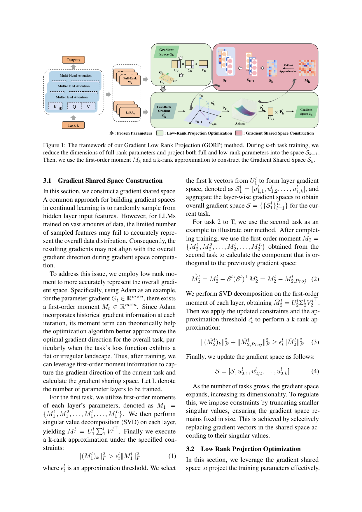
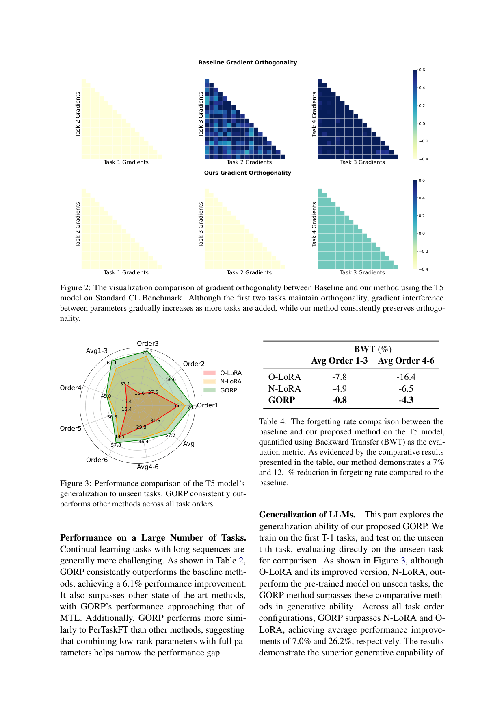

`gorp_lowrank_proj | Continual Gradient Low-Rank Projection Fine-Tuning for LLMs (GORP) | 北京交通大学（Chenxu Wang, Yilin Lyu, Zicheng Sun, Liping Jing*；交通数据挖掘与具身智能北京市重点实验室） | 2025-07 arXiv:2507.02503v1(3 Jul 2025) · 预印本 | 防遗忘方法/梯度投影持续学习 主线 · 中-高相关（可借"梯度子空间投影"巩固组件）`

> 三标注约定：【原文】=论文直述；【推断】=有据判断(附依据)；【待核】=拿不准的关键事实。

══ 第一层：一眼看懂 ══

- 🟦 **TL;DR**:LLM 一个接一个学新任务时,LoRA(只训低秩增量)虽省,但**表达力受限、且不同任务的更新会在参数空间里"撞车"导致遗忘旧任务**。GORP 提出一个训练策略:① **同时用"全秩参数 + LoRA 低秩参数"**(全秩补足表达力/塑性);② 把这两类参数的**梯度都投影进一个"低秩梯度共享子空间"**里更新,既省内存又把更新限制在关键方向;③ 关键是用 **Adam 的一阶动量 M(历史梯度的滑动平均)经 SVD + k-rank 近似** 来**隐式构造**这个梯度子空间——而不是像 O-LoRA 那样对 LoRA 权重**显式**加正交约束。新任务来时,先把当前梯度投影到"与旧任务子空间正交的方向"再更新,从而**不覆盖旧任务的梯度方向→少遗忘**。在 T5-Large 和 LLaMA2-7B 上比 O-LoRA/N-LoRA/MIGU 都强,且遗忘率(BWT)仅 0.8% vs 基线 7.8%,FLOPs 还低两个数量级。【原文 摘要+§1+§3】

- **最巧的一步**:**用 Adam 一阶动量 M 而非"原始梯度/隐层特征采样"来构造梯度子空间**。抽掉这一步,GORP 就退回 GPM/O-LoRA 那类"采隐层特征或直接用 LoRA 权重当子空间"的老路。为什么是它:① 动量 M 累积了历史梯度,**比单步原始梯度更稳、更能逼近"整体任务的梯度方向"**(尤其损失景观平/不规则时);② 对大模型,随机采少量隐层特征**代表不了整体分布**,而动量是天然的全局聚合 → 子空间更鲁棒、计算更省。这是"隐式 + 动态"区别于 O-LoRA"显式 + 静态"的根。【原文 §3.1, 表1】

══ 第二层:为什么做 ══

- **研究背景**:LLM 持续微调面临"效率 vs 表达力"的权衡。LoRA 是主流 PEFT,省、且某种程度抗遗忘(Biderman 2024),但低秩本质**限制了参数空间/优化表达力**,在持续学习里这个 gap 还会放大(Xia 2024、Mahla 2025);而且 LoRA 更新与共享参数纠缠,**不同任务参数空间会冲突**。梯度投影(GPM 系)是有希望的缓解手段:把梯度投到旧任务的正交补里。【原文 §1, §2.3】

- **解决的具体痛点**:① LoRA **低秩→塑性不足**(学不好新任务、知识迁移弱);② 现有梯度投影/约束法多是**显式约束(参数正则、对 LoRA 权重强加正交)**,只能近似理想参数空间,**无法动态适应新任务不断变化的梯度空间**,还难捕捉跨任务共享特征(阻碍迁移);③ 直接操纵隐层特征空间**计算贵、且采样代表性差**。【原文 §1, §2.3】

- **相关工作 & 各自不足(见表1 的精炼对比)**:
  - *O-LoRA*(Wang 2023a):只低秩 + **显式正交约束** + 静态梯度空间——表达力受限、不能动态适应。
  - *MIGU*(Du 2024):只低秩 + **隐式约束**(按隐层输出梯度归一化分布筛参数更新)+ 静态——同样无全秩、子空间静态。
  - *N-LoRA*(Yang 2025):只低秩 + 显式(参数稀疏化防碰撞)+ 静态。
  - *GaLore*(Zhao 2024):提出"全参训练时把梯度投影到低秩"省内存——GORP **借了它"梯度低秩"的思想**,但 GaLore 不是为持续学习/防遗忘设计。
  - **GORP(本文)= 全秩+低秩 / 隐式约束 / 低秩梯度空间 / 动态适应** —— 表1 里唯一四项全占的。【原文 表1, §2】

- **动机链**:LLM 持续学习要平衡 stability(不忘)-plasticity(能学)→ 纯 LoRA 塑性不足、显式约束又静态死板 → 加全秩参数补塑性,但全秩贵 → 既然梯度训练中天然呈低秩(Zhao 2024 理论+经验),就把全秩参数的梯度也投到低秩空间(省) → 子空间怎么建?隐层采样代表性差 → 改用 Adam 一阶动量 M 隐式、动态地构造 → 新任务梯度投到旧子空间正交补 → 既扩了优化搜索空间(塑性↑)又保旧方向(稳定↑)。【原文 §1, §3 逻辑链】

- **与最近邻(O-LoRA)的 Δ**:最像 O-LoRA(都用子空间正交化防遗忘)。**关键差异三点**:① O-LoRA 只训 LoRA,GORP **加全秩参数**(塑性更强);② O-LoRA 对 **LoRA 权重显式**加正交约束,GORP 对**梯度隐式**约束(用动量构造子空间);③ O-LoRA 子空间**静态**,GORP **动态**适应新任务梯度。**为什么有用**:§4.4 直接对比——O-LoRA 维持参数正交但**梯度正交性随任务增多而崩**(图2 上排),GORP 维持**梯度正交性稳定**(图2 下排),允许参数在更大空间里更新(自由度↑),既不忘又学得好。【原文 §4.4, 图2/图5, 表1】

══ 第三层:怎么做 + 靠不靠谱 ══

- **方法流水线(两大模块 + Algorithm 1)**:
  1. **梯度共享空间构造 (Gradient Shared Space Construction, §3.1)**:训完任务 t 后,取每层 Adam 一阶动量 \(M_t^l\);**任务1**直接对 \(M_1^l\) 做 SVD 取前 k 个左奇异向量组成层梯度空间 \(S_1^l\),聚合成 S。**任务≥2**:先算 \(M_t^l\) 中**与已有子空间正交的分量** \(\hat{M}(=M - S S^\top M)\),对 \(\hat{M}\) 做 SVD,在近似阈值 ϵ 约束(Eq.3,保证保留的能量 \(\geq \epsilon\|\hat{M}\|^2\))下做 k-rank 近似,把新方向并入 S(Eq.4)。**子空间膨胀控制**:任务变多→子空间维度涨→**截断小奇异值**,按奇异值大小**替换**共享空间里的向量,保持子空间尺寸固定。
  2. **低秩投影优化 (Low-Rank Projection Optimization, §3.2)**:
     - *LoRA 参数*:只对 A 矩阵投影——把 A 的梯度 \(G_{A,l}\) 投到旧梯度空间的正交补(Eq.5:\(G' = G - S S^\top G\)),再 Adam 更新。
     - *全秩参数*:仿 GaLore,Adam 时用低秩更新而非全秩。把全秩梯度 \(G_{t,l}\) SVD 成 \(U\Sigma V^\top\),取前 k 列 \(U_{l,k}/V_{l,k}\),投影 \(G'_{t,l}=U_{l,k}^\top G_{t,l} V_{l,k}\)(Eq.6,压缩到低秩) → 再投到旧子空间正交补 \(P_{t,l}\)(Eq.7) → Adam(Eq.8-10) → 缩放回原维度 \(\hat{G}=\alpha U_{l,k}P'V_{l,k}^\top\)(Eq.11) → 更新 W(Eq.12)。
     - *降本技巧*:全秩参数的"投影/SVD"开销大,所以**每隔固定步 T 才更新一次全秩子空间**(Algorithm 1 line 7 \(t mod T==0\)),其余步复用上次投影;LoRA 梯度无需维度扩展、直接更新。
  3. **整体**:全秩补塑性、低秩保效率,二者梯度都被约束在"与旧任务正交"的低秩共享空间里 → 平衡 stability-plasticity。

- **逐组件必要性(消融 Figure 4,B=baseline / L=全秩低秩投影 / S=LoRA投影 / G=完整 GORP)**:
  - *给 LoRA 加低秩投影 (S)*:相对 baseline +0.7%。✔有消融。
  - *LoRA + 全秩参数 + 低秩投影 (L 组合)*:+2.0%(说明全秩与低秩**互补**——全秩给细粒度调整的灵活性)。✔有消融。
  - *完整 GORP (G)*:总 +3.9%。✔逐组件叠加证明各部件有效。
  - *用动量 M 而非原始梯度构造子空间*:**正文论证其优越性(更稳/更省)但未见"动量 vs 原始梯度"的直接消融**——属"有论证、缺对照实验"项。【推断:依据=§3.1 只给理由,实验未单独剥离该选择】

- **关键机制直觉**:核心是"**梯度正交投影**"——把新任务的更新方向**减去它在旧任务子空间上的投影分量**(\(G' = G - SS^\top G\)),剩下的就是"不踩旧任务梯度"的方向,于是学新不覆旧。GORP 的两点巧思让它比 GPM/O-LoRA 强:① **子空间用动量 M 建**(全局、稳),② **全秩参数也走低秩梯度投影**(扩搜索空间但不爆内存)。直觉上:O-LoRA 把"正交"钉死在 LoRA 权重上(参数正交但梯度会漂),GORP 把"正交"作用在**梯度方向**上且动态更新子空间,所以梯度正交性能长期维持(图2)。【原文 §3.2, §4.4】

- **实验与证据**:
  - 数据集/设置:**T5-Large(770M,enc-dec)+ LLaMA2-7B(dec-only)**;**Standard CL Benchmark**(4 任务/5 类分类)+ **Large Number of Tasks**(15 任务长序列:GLUE+SuperGLUE+IMDB);打乱成 3 个任务顺序(Order1-3 标准 / Order4-6 长序列)。指标:Average Accuracy、BWT(遗忘率)、参数正交性、梯度正交性。Baseline:非持续学习上界(MTL/PerTaskFT)+ SeqFT/SeqLoRA/IncLoRA/Replay/EWC/LwF/L2P/LFPT5/O-LoRA/MIGU/N-LoRA。【原文 §4.1】
  - **支撑核心主张的关键数字**:T5 标准 CL——GORP **avg 79.8**(O-LoRA 75.8 / MIGU 76.6 / N-LoRA 78.8;MTL 上界 80.0),**+4% over baseline、逼近 MTL**;长序列——GORP avg **76.0**(O-LoRA 69.6 / N-LoRA 72.4),**+6.1%**,接近 PerTaskFT/MTL。LLaMA2-7B 标准 CL——GORP 78.6(O-LoRA 76.1 / N-LoRA 77.6),**+2.5%**。
  - **遗忘(表4 BWT)**:GORP BWT 仅 **−0.8%**(Avg Order1-3)/ −4.3%(Order4-6),baseline O-LoRA −7.8% / −16.4%,N-LoRA −4.9% / −6.5% → 遗忘率降 7.0% 和 12.1%。
  - **效率(表5)**:FLOPs(×10¹²)——GORP **0.125** vs O-LoRA 68.4 / N-LoRA 84.3(**低约 2 个数量级,1.8e-3×**);单任务时间 GORP ≈ O-LoRA(0.99×),N-LoRA 略快(0.76×)但 FLOPs 高。→ GORP 在"时间 + 算力都吃紧"时最划算。
  - **泛化(图3)**:训前 T-1 任务、直接测未见第 t 任务,GORP 比 N-LoRA/O-LoRA 平均高 7.0%/26.2%(生成能力更强)。
  - **最有说服力的一张**:图2 梯度正交性可视化——baseline 随任务增多梯度干扰加剧(热图偏离对角),GORP 始终保持正交(更干净的对角结构),直接对应"为什么少遗忘"。
  - *baseline 公平性*:同模型/同 benchmark/同任务顺序,baseline 覆盖面广(含 O-LoRA/N-LoRA/MIGU 等强 SOTA),较充分。【推断:依据=§4.1 baseline 列表】
  - *"看着强但没回答核心"的隐患*:① **改进幅度多在 2-6%**,长序列上 GORP 76.0 仍低于 PerTaskFT 78.1(独立模型),即"防遗忘"没完全追平"任务隔离"上界;② 实验全是**分类/NLU 任务**(GLUE 系),**未测生成式推理/agent 持续学习**;③ 全秩参数引入的实际显存开销、超参(T、k、ϵ、α)敏感性正文未充分给。【推断:依据=表2/3 数值 + §4.1 任务域 + Limitations】

- **假设与失效边界**:
  - 【原文 Limitations】① 任务序列拉长时,需**持续在固定维度子空间内更新任务向量**——"在受限维度里容纳不断增长的任务多样性"是关键挑战(子空间会饱和);② 只在**已知 CL 数据环境**验证强,**更复杂真实场景**待验。
  - 【原文 §3 隐含】依赖"梯度训练中呈低秩结构"(Zhao 2024)——若某任务梯度本质高秩,低秩投影会丢信息。
  - 【推断】子空间用"截断小奇异值 + 替换"控尺寸,长跑下**旧任务方向可能被新方向挤掉→远期遗忘**;论文只测到 15 任务,几十上百任务未知。依据=§3.1 截断机制 + Limitations。
  - 【推断】结论基于 ≤7B + 分类任务;迁到更大模型/生成式任务时,"动量构造子空间"的稳定性与正交投影对生成质量的影响未知。依据=§4.1 任务/规模范围。

- **祛魅总结**:
  - **真贡献(硬货)**:(a)**全秩+低秩协同 + 梯度低秩投影**这一组合,在持续学习里同时拿到"塑性(逼近 MTL/PerTaskFT)"和"稳定(BWT −0.8%)",且 **FLOPs 低两个数量级**——效率数字是真亮点;(b)**用 Adam 动量隐式构造动态梯度子空间** 是相对 O-LoRA 显式静态约束的实质改进,图2 的梯度正交性长期维持是有力佐证;(c)消融(图4)逐部件叠加,结论扎实。
  - **包装/可能高估**:"superior performance"幅度其实温和(2-6%),且长序列未追平任务隔离上界;"动态适应梯度空间"听起来强,但本质是"每 T 步用动量重算子空间 + 截断",**动态性有限**。【推断:依据=表2/5 数值 + Algorithm 1 line 7 固定步更新】
  - **可能低估 / 注意**:全秩参数虽走低秩梯度,但**仍需存全秩权重的更新**,真实显存相对纯 LoRA 的增量正文交代不充分;超参(子空间秩 k、阈值 ϵ、更新频率 T)对结果的敏感性未系统给。【推断:依据=§3.2 全秩参数处理 + 缺超参敏感性分析】

══ 结构化抽取 ══

- 🎯 **机制速览 6 轴**:

| 学什么信号 | 改什么 | 何时改 | 免梯度? | 记忆-技能生命周期 | 防遗忘机制 |
|---|---|---|---|---|---|
| 监督标签(分类/NLU 持续学习多任务序列;交叉熵) | **参数**(LoRA 低秩 A/B + **全秩参数**;二者梯度都投到低秩共享子空间更新) | **离线批量**(任务序列;全秩子空间每隔 T 步重算一次,任务结束更新共享空间 S) | **否**(标准基于梯度,Adam;核心是梯度投影,非免梯度) | 不适用(无记忆库/技能库;研究参数级持续微调) | **梯度子空间正交投影(隐式·动态)**:用 Adam 一阶动量 M 经 SVD+k-rank 近似构造旧任务梯度共享空间 S,新任务梯度投到 S 的正交补(\(G'=G-SS^\top G\))再更新;截断小奇异值控子空间尺寸。属 6 轴的"KL投影/隔离"族中的**几何投影隔离**。【原文 §3】 |

- ⑦ **开源代码 + 框架/harness**:**已开源** https://github.com/Wcxwcxw/GORP 【原文 摘要+§1】。算法=自研训练策略 GORP(Algorithm 1),**借用 GaLore(Zhao 2024)的"梯度低秩投影"思想** + 标准 **Adam** 优化器;骨干 T5-Large / LLaMA2-7B。**具体训练框架(HuggingFace/PEFT/DeepSpeed 等)正文未点名**——〔待核:需查仓库确认依赖框架与 LoRA 实现〕(本子代理按指令未 clone)。**无 RL 框架**(纯监督持续学习)。【原文 §3-§4】

- 💰 **资源/成本与可扩展性**:**效率是核心卖点**——表5:GORP FLOPs 0.125×10¹² vs O-LoRA 68.4 / N-LoRA 84.3(**约 1.8e-3×,低两个数量级**),单任务时间 ≈ O-LoRA(0.99×)。降本关键:① 全秩参数走**低秩梯度投影**(不爆内存);② 全秩子空间**每 T 步才重算**(减少 SVD 开销)。可扩展性瓶颈:子空间维度固定→**任务数极多时方向被挤占**(作者自承)。绝对 GPU 显存/时长原文未给。【原文 §4.5 表5, Limitations】

- 🎯 **对"探索-巩固(探索→巩固)"idea 对标**:**可借组件(防遗忘巩固模块)+ 机理同盟**。
  - *可借组件*:**梯度正交投影 + 用 Adam 动量构造动态子空间** 是一个**现成、低成本的"巩固期防遗忘"模块**——TSRD 巩固阶段(把 path-selection/path-recovery 沉淀进参数)若担心冲掉旧技能,可借 GORP 把"新技能梯度投到旧技能梯度子空间的正交补"以隔离干扰;**"全秩+低秩协同"**也提示:纯 LoRA 蒸馏塑性可能不够,混入受控全秩更新能逼近上界。
  - *机理同盟*:与本批 retaining_by_doing(on-policy→mode-seeking)、mech_origins(RL=分布式电路)、subspace_geometry_lora(夹角→遗忘律)同属"梯度/子空间几何防遗忘"线;GORP 是其中**少数给出完整可跑方法 + 代码**的,且 subspace_geometry_lora 的"主夹角诊断"可与 GORP 的"梯度子空间构造"互补(一个诊断、一个干预)。
  - *缺口/区别(为何不是直接竞品)*:① GORP 面向**分类/NLU 持续学习**,非生成式推理/on-policy 蒸馏/agent;② 它是**纯监督、基于梯度的参数级**方法,不涉 RL/reward/MTP/记忆库;③ 子空间会饱和,长跑远期遗忘未解。TSRD 更可能把它当一个**可插拔的梯度隔离层**,而非整体范式。【推断:依据=§4.1 任务域 + Limitations + 项目 TSRD/OPD 主线】

- 🔭 **开放问题/未来方向**:
  - 【原文 Limitations】在**固定维度子空间内容纳不断增长的任务多样性**(防子空间饱和)是关键挑战;在更复杂真实场景验证有效性。
  - 【推断】扩到生成式/推理任务与更大模型;系统给出超参(k/ϵ/T/α)敏感性;研究"动量构造子空间"在长跑下旧方向被挤占的远期遗忘;与"主夹角诊断"(subspace_geometry_lora)结合做自适应秩/触发投影。依据=§3.1 子空间控制机制 + §4.1 任务范围。

- 🖼 **关键图 top-2**:

  
  这是**原文 Figure 1**(方法主图):左侧 Multi-Head Attention 的全秩参数 W 与 LoRA 参数;中段把全秩梯度 \(G_k\) 与 LoRA 梯度都投影进旧任务梯度空间 \(S_{k-1}\),再用一阶动量 \(M_k\) + k-rank 近似构造新的梯度共享空间 \(S_k\)(右侧)。选它因为一图说清 GORP 的两大模块(梯度共享空间构造 + 低秩投影优化)如何咬合——这是方法的全貌。

  
  这是**原文 Figure 2**(核心机制证据图,同页含 Figure 3 泛化雷达图 + Table 4 BWT):上排 baseline——随任务增多(Task1→4)梯度干扰加剧(热图对角结构变脏);下排 GORP——**始终保持梯度正交**(对角清晰)。选它因为它把"为什么 GORP 少遗忘(BWT −0.8% vs 7.8%)"的因果——梯度正交性长期维持——直接可视化,比单看准确率表更有解释力。

──────────
**幂等状态**:本文 analysis 首次产出。机制类型 = **防遗忘方法(参数级·基于梯度·梯度子空间正交投影/隔离;全秩+低秩协同;用 Adam 动量隐式动态构造子空间;非记忆/非技能库;纯监督)**。抽到 2 图:是(Figure 1 方法框架 + Figure 2 梯度正交性对比)。
