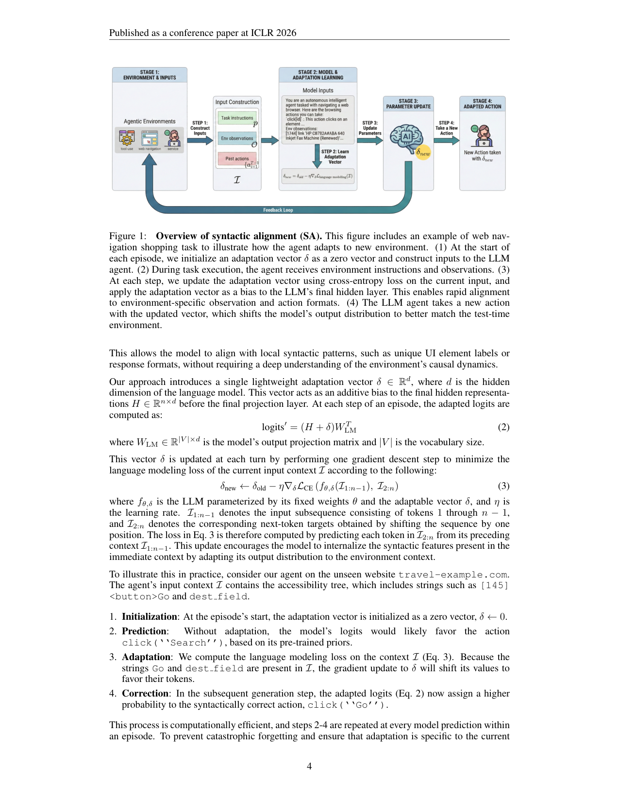
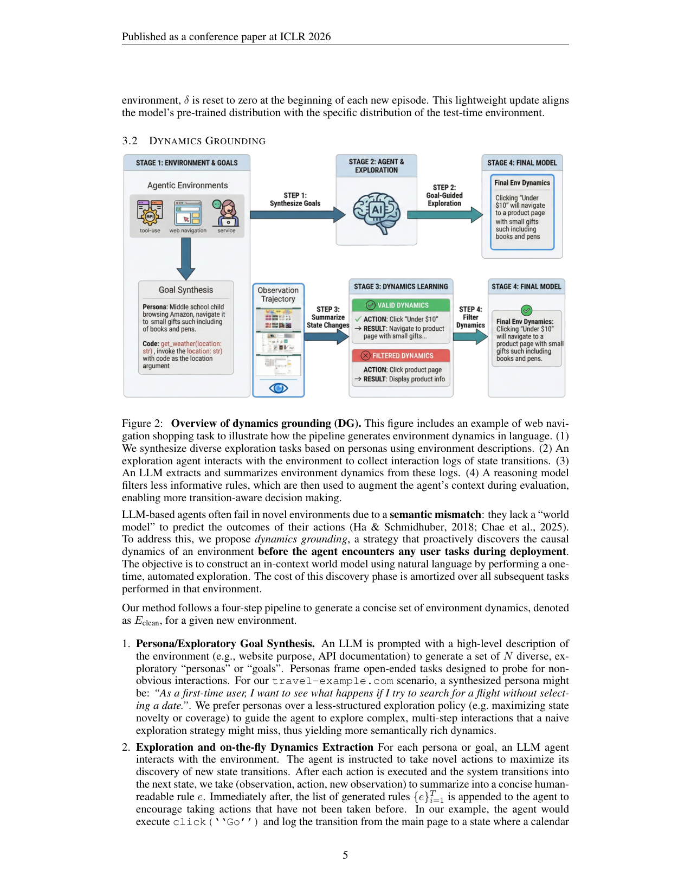

`grounded_tta | Test-Time Adaptation for LLM Agents via Environment Interaction (GTTA) | University of Waterloo + Salesforce AI Research（Arthur/Haonan Chen 等；通讯 haonan.chen@uwaterloo.ca；Victor Zhong & Caiming Xiong 共同指导） | ICLR 2026（arXiv:2511.04847v4, 2026-02-22） | 主题线 L?（test-time 适应 / agent 环境交互）·相关性 High`

> 三标注：【原文】直述；【推断】有据判断（附依据）；【待核】拿不准的关键事实。

══ 第一层：一眼看懂 [light] ══

- 🟦 **TL;DR**：LLM agent 一到没见过的新网站/新函数集就掉链子，原因有两类——① **语法不匹配**（不懂这个环境特有的观测格式/元素名，例如该点 `Go` 它却去点 `Search`）；② **语义不匹配**（没有这个环境的"世界模型"，预测不了一个动作会导致什么状态转移）。本文不靠标注轨迹、不重训大模型，提出两套**部署时（test-time）**对策：**SA（Syntactic Alignment）**——每步用当前 context 做一次梯度下降，更新一个加在最后隐层上的轻量"适配向量 δ"，把输出分布快速对齐到环境语法，且**每个 episode 重置 δ**；**DG（Dynamics Grounding）**——任务到来前先用"人设(persona)驱动的探索"去主动试探环境、把状态转移总结成自然语言规则，过滤后当 in-context 世界模型喂给 agent。【原文 Abstract/§1/§3】
- **最巧的一步**：把两类失败**操作性地拆开**并各配一套机制——语法用"参数化的临时向量 + per-episode 重置"（避免跨任务污染），语义用"一次性探索建 in-context 世界模型 + 成本摊销"。抽掉这个拆分（比如只做 SA 或只做 DG，或把两者天真合并），效果就掉：论文明确报告 naive hybrid 在 BFCLv3 上 **21.0% < DG 单用 22.0%**，说明两信号会互相干扰、拆分+各司其职才是关键。【原文 §4.2/§4.3】
- 代码：**https://github.com/r2llab/GTTA**（正文脚注 1 给出）。【原文 §1 脚注】

══ 第二层：为什么做（写透） ══

- **研究背景**：LLM agent 在 web 导航、function calling 上能力强，但部署到**新环境**就泛化失败，根因是预训练知识与部署环境的语法/动态之间存在系统性 mismatch。【原文 §1/§2】
- **解决的具体痛点**：现有补救要么 ① 需要人工/LLM 标注的演示轨迹（资源贵或依赖 LLM 先验）；要么 ② 显式世界建模（如 WMA）走"大规模采数据 + 单独 fine-tune 一个专用模型"的重管线，算力贵且不重训就难泛化。缺一个"只用部署时可得信息"就能 ground 的高效法子。【原文 §1】
- **相关工作 & 各自不足**：
  - **TTA（源自 CV：TENT/熵最小、TTT/自监督）**：SA 直接建立在"test-time 更新参数/steering 向量去最小化无监督目标"之上；但 TTA 用于 LLM 多见于数学推理/few-shot，**没人系统地把它用到 agent 的交互式、有状态环境**。【原文 §2 "our work is the first..."】
  - **Steering vector 研究**：常用来移高层特质（诚实度等）；Δ：本文把向量当**临时参数**、用**环境响应做自监督**在线更新、且**per-episode 重置**，做精确的环境对齐。【原文 §2】
  - **环境建模/世界模型（WMA、Chae 2025 等）**：要采大量观测训参数化世界模型，贵；DG 改用**少量探索 → in-context 自然语言世界模型**。【原文 §2】
  - **AWM/RAG-for-planning**：靠现成标注或 workflow 记忆；Δ：DG 的贡献是**persona 驱动的自动化探索流程**来生成这些知识，免标注、免另训模型。【原文 §2】
- **动机链**：新环境失败=语法+语义两类 → 二者机制需求不同（分布对齐 vs 因果建模） → 现成法子要么要标注要么要重训（贵/不泛化） → 所以分别用"在线轻量向量"治语法、"探索建 in-context 世界模型"治语义，全部只用 test-time 交互。为什么不用 prompt 工程？语法对齐需要在**连续表示空间**精确移分布；为什么不直接喂长 context？DG 实验显示简单环境上长 context 反而略伤性能（§4.2）。【原文 §1/§3/§4.2】
- **与最近邻工作的 Δ**：最像 WMA（Chae 2025，学一个 Llama-3.1-8B 世界模型）。Δ：WMA 要合成 870 个任务采轨迹 + 训一个模型，且推理时每步动作模拟约 140s；DG 只用 ~50 次探索 rollout、**不训任何模型**，且实验显示 GPT-4o-mini+DG 反而**大幅超过** GPT-4o-mini+WMA。【原文 §4.2/Table 2/3】

══ 第三层：怎么做 + 靠不靠谱 ══

- **问题设定三约束（§3）**：① 无标注轨迹/离线数据；② 在线流式适应（任务逐个到，不能先看全 batch）；③ 允许 test-time 交互（任务到来前可"盲探"环境，但无监督）。输入 \(I = [p; o; {a}_{i=1}^{T-1}]\)（指令 p、当前观测 o、历史动作）。【原文 §3】
- **SA 流水线（§3.1）**：
  1. episode 开始 \(δ←0\)（零向量）；
  2. 适配 logits：\(logits' = (H + δ) W_LM^T\)（\(δ∈R^d\) 作为加到**最后隐层 H**、过输出投影前的偏置）；
  3. 每步用**当前 context 的语言建模(CE)损失**做**一步**梯度下降更新 δ：\(δ_new ← δ_old − η ∇_δ L_CE(f_{θ,δ}(I_{1:n-1}), I_{2:n})\)（next-token 预测；θ 冻结，只更新 δ）；
  4. δ 把分布推向环境里实际出现的 token（如把 `Search`→`Go`），下一步生成更对；
  5. **每新 episode 重置 \(δ=0\)** 防灾难性遗忘/跨任务干扰。
  - 直觉：当前页面里既然出现了 `Go`、`dest field`，对这段 context 做语言建模就会把 δ 拉向偏好这些 token，从而"现学现用"环境语法。【原文 §3.1】
- **DG 四步管线（§3.2）**：
  1. **Persona/探索目标合成**：用环境高层描述（网站用途/API 文档）提示 LLM 生成 N 个多样"人设/目标"（如"作为新用户，不选日期就搜航班会怎样"），比单纯最大化状态新颖度更能触发复杂多步交互；
  2. **探索 + 即时动态抽取**：每个 persona 跑一个 LLM agent 交互，对每个 (obs, action, new obs) 总结成一条人读规则 e，并把已生成规则回灌 agent 以鼓励探索新动作；
  3. **过滤合并**：把全部规则交给 reasoning 模型（用 o3）剔除 trivial/重复，得到干净集 `E_clean`；
  4. 评测时把 `E_clean` 拼进 context：\(I' = [I; E_clean]\)，靠 ICL 让 agent 预判动作后果、做 transition-aware 决策。成本一次性、摊销到该环境后续所有任务。【原文 §3.2/§4.1】
- **逐组件必要性**：
  - SA 的 **per-episode 重置**：明说为防灾难性遗忘、保证适配只针对当前环境。【原文 §3.1】
  - DG 的 **persona 探索**：相对 naive 探索更能挖出非显然交互（必要性靠论述+整体增益支撑）。【原文 §3.2】
  - DG 的 **过滤**：消融——BFCLv3 上 10 episodes 时过滤把 SR 从 61.0→64.0（+3.0），证明过滤有用。【原文 §4.3】
  - DG 的 **探索/抽取 backbone**：消融（Table 5）显示**用自身模型 (self) 与用更强模型一样好**（GPT-4o-mini self 19.0% ≈ 用 GPT-4.1 的 18.0%），即可"自我改进"、对 backbone 选择鲁棒。【原文 §4.3】
- **关键机制直觉**：SA = "在输出前的隐层加一个会即时学习的偏置方向"，等价于把模型输出分布往"环境 context 里高频出现的合法 token"轻推；DG = "把昂贵的参数化世界模型换成便宜的、可读的自然语言规则集，让 LLM 用 ICL 当世界模型"。【原文 §3】
- **实验与证据（§4）**：
  - 基准：**BFCLv3**（多轮 function calling，multi-turn-base split，8 API 域）、**WebArena**（5 自托管站 + multi-site，共 812 任务，string-matching 评测）、**Tau-Bench**（airline 50 + retail 115，LLM 模拟用户；用 Prabhakar 2025 的稳定 codebase + BoN(N=5)+自评 + 5 seed 平均）。【原文 §4.1】
  - 模型：开源 Qwen2.5-14B-Instruct + 闭源 GPT-4.1 / GPT-4o-mini；DG 探索策略用 GPT-4.1、过滤用 o3。【原文 §4.1】
  - **最强证据（核心主张）**：WebArena multi-site split 上 **GPT-4.1+DG 把 SR 从 2%→23%**（Table 3）——这是"不可预测动态环境里 DG 价值最大"的关键数字。整体（Table 2）：GPT-4.1+DG 在 WebArena 30→35、BFCLv3 55.5→64.0；GPT-4o-mini+DG WebArena 12→18，**超过 +WMA 的 13.5**。【原文 §4.2/Table 2/3】
  - SA 增益较温和但稳定：Qwen2.5-14B 上 WebArena 17→18、BFCLv3 18.5→20、Tau-Airline 21.6→25.2、Retail 43.3→44.9。【原文 Table 2】
  - **效率**：SA 单步更新仅 +3% 延迟（Table 4）；DG 一次性成本约**单站 7M tokens**、50 次 rollout、**不训模型**，对照 WMA 要 870 任务采数据 + 训 8B + 每步动作模拟 ~140s。【原文 §4.2/Table 4】
  - **公平性**：与 WMA 对比用同款 GPT-4o-mini；Tau-Bench 控温度+多 seed 降方差。较扎实。【原文 §4.1】
  - "看着强但留疑"的点：SA 增益普遍只有 +1~+3.6，**远小于 DG**；且 SA 仅在 Qwen2.5 族验证，闭源模型上 SA 没报（因需白盒梯度，闭源做不了）。【原文 Table 2/§5】【推断】
- **假设与失效边界**：
  - 【原文】SA 需**白盒**（要对 δ 求梯度、要拿最后隐层），闭源 API 模型用不了；DG 仅适用于**有显式状态转移**的环境，**对话式 Tau-Bench 不适用**（无可抽取的固定转移规则）。【原文 §4.1/§5 Limitations】
  - 【原文】简单环境（如 Shopping）上 DG 增益小，甚至因 context 变长而略伤性能。【原文 §4.2】
  - 【原文】naive hybrid 次于单用 DG（互相干扰），如何"有原则地融合"两策略是 open。【原文 §4.2/§5】
  - 【推断】DG 的世界模型质量受探索覆盖与 persona 多样性上限约束；探索没踩到的关键转移就学不到。依据：方法本质是经验式探索，无覆盖保证。
- **祛魅总结**：
  - 真贡献（硬货）：① 把 agent 部署失败**清晰二分**为语法/语义并各给一套**免标注、免重训**的 test-time 方法；② DG 用"少量探索→自然语言 in-context 世界模型"在复杂环境上拿到**2%→23%**的硬增益，且显著省过 WMA 这类重世界模型；③ SA 把 steering-vector TTA 首次系统迁到交互式 agent。
  - 包装/可能高估：【推断】SA 的实际增益相当有限（多在 +1~+3），论文标题与摘要把 SA 与 DG 并列、容易让人以为两者同等有效；真正的"硬货"几乎全在 DG。依据：Table 2 数字。
  - 【推断】DG 的成本"7M tokens/站"并不算极轻，只是相对 WMA 便宜；在 token 计费场景仍是可观前置投入。依据：§4.2 数据。

══ 结构化抽取 ══

- 🎯 **机制速览 6 轴** [light]：
  | 学什么信号 | 改什么 | 何时改 | 免梯度? | 记忆-技能生命周期 | 防遗忘机制 |
  |---|---|---|---|---|---|
  | **SA**：环境响应/当前 context（自监督的 next-token / CE 损失）；**DG**：探索得到的状态转移经验（环境 reward 无；纯交互观测）【原文 §3.1/§3.2】 | **SA**：参数（最后隐层上的临时偏置向量 δ，θ 冻结）；**DG**：上下文/记忆（注入 in-context 自然语言世界模型规则）【原文 §3】 | **SA**：在线 **per-step**（每步一次梯度更新）；**DG**：**离线/部署前批量**（任务到来前一次性探索建库，再 test-time 复用）【原文 §3.1/§3.2】 | **SA：否**（需梯度+白盒）；**DG：是**（纯 prompt/ICL，无任何梯度）→ **整体混合**【原文 §3/§4.1】 | 写入：DG 探索→抽规则→过滤入 E_clean；检索：评测时整段拼接（DG 非按 query 检索而是全量注入，超长则截断）；遗忘/淘汰：**SA δ 每 episode 重置**；共享：DG 规则在同环境所有任务间共享【原文 §3.1/§3.2/§4.1】 | **SA：per-episode 重置 δ**（隔离式，防跨任务污染/灾难性遗忘，明确动机）；DG：无（纯加 context）【原文 §3.1】 |
- ⑦ **开源代码 + 框架/harness**：**已开源 https://github.com/r2llab/GTTA**【原文 §1 脚注 1】。harness：评测用 **BrowserGym + AgentLab**（ServiceNow）跑 WebArena（max 30 步）；BFCLv3、Tau-Bench（用 Prabhakar 2025 改进 codebase）。SA 自研（在最后隐层加 δ 做 CE 梯度更新，无标准 RL 框架）；DG 用 GPT-4.1 探索 + o3 过滤，自研管线。【原文 §4.1】
- 💰 **资源/成本与可扩展性**：【原文】SA +3% 延迟/步、LR=0.1、1 步更新；DG 单站约 7M tokens、~50 rollout、探索预算 30 步/episode、不训模型；对比 WMA 训 8B + 每步动作模拟 ~140s。可扩展性：DG 一次性成本可摊销到该环境所有任务。【原文 §4.2/Table 4】
- 🎯 **对"探索-巩固"idea 对标** [light]：**强支撑 + 可借组件**。DG = 教科书级的"先探索（persona 驱动主动试探环境）→再巩固（把转移经验蒸成规则库复用）"两阶段，正是"探索-巩固"的 in-context 实例；其"persona 引导探索比 naive novelty 更挖深"可借鉴为 MTP/foresight 探针的探索策略。SA 则提供一个"参数级、per-step、可重置"的轻量巩固原语（临时向量），与你"path-recovery 单点接管 / forward-hard-backward-soft"取向不同但互补——可作"最便宜的参数级 test-time 巩固"对照。【推断：依据是 DG 的四步管线与"探索→蒸馏→复用"逐一对应，SA 与临时性参数巩固同构】
- 🔭 **开放问题/未来方向**：
  - 【原文】SA 在更多开源架构上验证；DG 扩到无显式状态转移的对话式任务；**有原则地融合 SA+DG**（提出 meta-controller：按环境复杂度动态选用便宜在线适应 vs 昂贵 DG）；SA 更新按隐维归一以增鲁棒。【原文 §5】
  - 【推断】给 DG 探索加覆盖度/新颖度保证、或让世界模型可在线增量更新（当前是一次性建库）。依据：DG 无覆盖保证、且为部署前一次性流程。
- 🖼 **关键图 top-2** [light]：
  · 
    这是**原文 Figure 1**（渲染自 p4）。以 web shopping 任务示例展示 SA 四步：episode 初始化 \(δ=0\) → 收到观测 → 用当前 context 的 CE 损失更新 δ 并加到最后隐层 → 用更新后的 δ 取动作，把分布对齐到环境真实元素名（Search→Go）。选它因为它把"语法对齐"这条线的全部机制（向量在哪加、用什么 loss、何时更新/重置）一图讲清。
  · 
    这是**原文 Figure 2**（渲染自 p5）。展示 DG 四步管线：基于环境描述合成 persona 探索任务 → 探索 agent 采交互日志 → LLM 抽取并总结环境动态 → reasoning 模型过滤无信息规则，最后注入评测 context。选它因为 DG 是全文"硬货"（2%→23% 那条），此图是其因果世界模型构建流程的完整说明。
