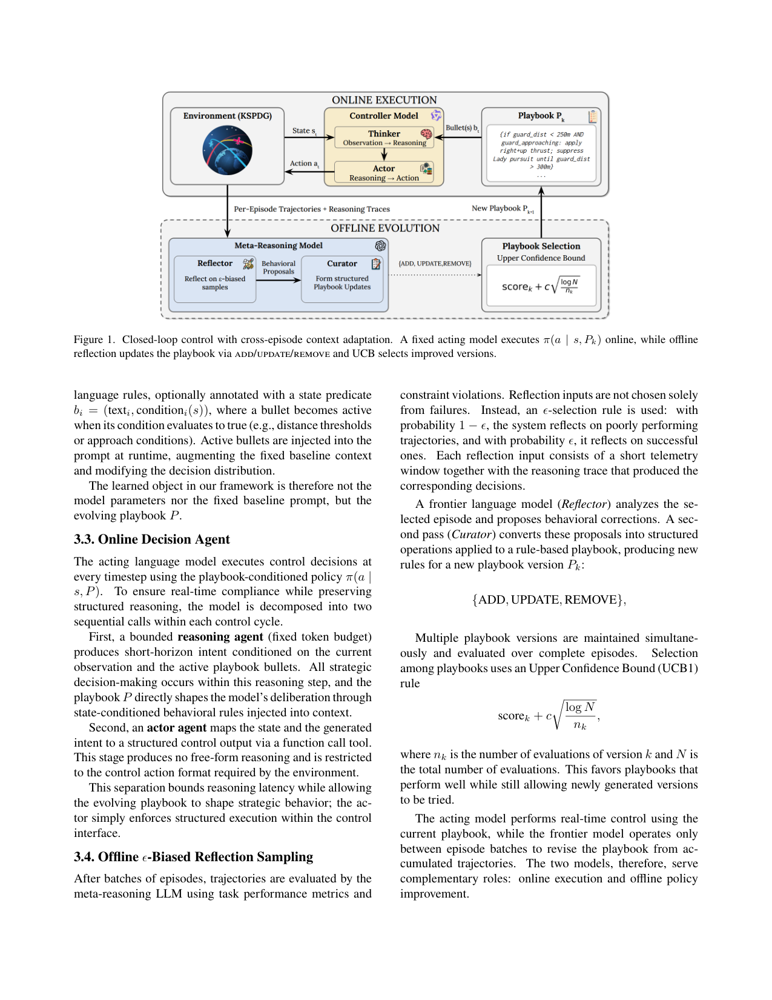
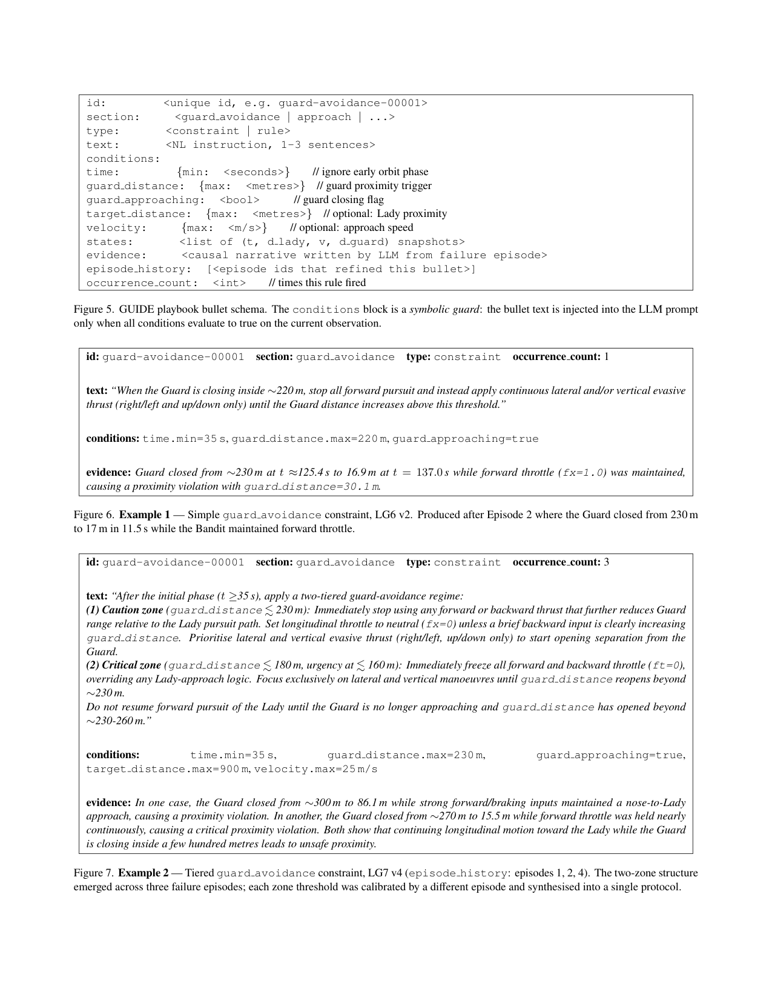

`guide | GUIDE: Guided Updates for In-context Decision Evolution in LLM-Driven Spacecraft Operations | MIT + UPM(西班牙理工)；Carrasco/Storey-Matsutani/Rodriguez-Fernandez/Linares | 2026-04（arXiv:2603.27306v3，CVPR 2026 AI4Space Workshop） | L1 免梯度·context演化（强触 L3 经验→规则、teacher-student） | 相关性 High`

> 【档位】deep（由 light 升级，补全第二层/第三层）。基于真实 PDF 正文（9 页：正文 §1–§6 + 附录 §7–§8 含 playbook schema/示例）。三标注：【原文】/【推断】（附依据）/【待核】。

---

## ══ 第一层：一眼看懂 ══

- 🟦 **TL;DR**：【原文】给"用 LLM 当航天器操作员"这类**实时闭环控制**任务做跨回合自进化，但权重不能更新、控制动作还得在严格延迟内出。GUIDE 的做法：一个**轻量 acting 模型**实时控制（先 bounded-reasoning 出短期意图、再 actor 走 function-call 出三轴推力），而一个**前沿大模型**在每批回合**离线**回看轨迹、把"教训"写成**状态条件化的自然语言规则手册（playbook）**——每条 bullet 带符号化触发条件（如 guard 距离 <220m 且在逼近时才注入）。规则手册经 ADD/UPDATE/REMOVE 演化、并行维护多个版本用 **UCB1** 选优。在 KSPDG 卫星对抗拦截（LBG 场景）上，演化后比静态 LLM 基线综合分降 **82%–99%**（LG6/LG7 p<0.001）。
- **最巧的一步**：【原文+推断】**teacher-student 时间尺度分离 + 符号条件化的规则注入**——前沿模型只在回合间离线改 playbook（不进控制环、不受延迟约束），acting 模型只在线执行（被规则手册重塑决策分布 \(π(a|s,P)\)）。【推断】抽掉"符号触发条件"（让规则无条件全注入），规则手册会在不相关状态下污染决策、且无法表达"guard 逼近时才规避"这类条件策略——正是 LG6/LG7（需条件机动）增益最大、而 LG4/LG5（直接追击即可）增益小的原因（§4）。【推断依据：作者明确归因"首次更新都识别同一失败模式=边追边被 guard 拦截，引入 guard-avoidance 条件规则后骤降"】。

---

## ══ 第二层：为什么做 ══

- **研究背景**：【原文】领域大方向是"把 LLM 当航天器操作的**监督决策层**(supervisory layer)"——不是替代低层 GNC(制导/导航/控制)那种成熟的稳定化、轨迹跟踪,而是替代"在不确定下选战略目标"这种 operator-level 推理(§1-§2,引 [2,3,12] 同组前作)。航天场景天然苛刻:任务昂贵/高危/迭代慢,**部署后几乎无法重收数据、重置环境、重训策略**(§1 首段),所以"权重不动也能跨回合变强"的免梯度自适应特别有价值。
- **解决的具体痛点**：【原文】把 LLM 塞进实时闭环动力学控制,会撞上**两个耦合约束**(§1):① **延迟约束**——控制动作必须在严格 latency bound 内出,但能做深思的模型延迟过高、不能进控制环;能满足实时的轻量模型又做不了战略推理。② **跨遭遇适应**——和反应式/未知对手交互需要"跨回合学",但这种学习**不能发生在在线环上**。两个约束合起来逼出一个结论:**学习必须与动作执行在时间上分离**。
- **相关工作 & 各自不足**：【原文】§2 摆了几条线——(a) **经典 GNC**:可靠但只做稳定化/跟踪,不碰"选哪个战略目标"(strategic objective selection),所以需要它上面再加监督层;(b) **LLM-as-operator 前作**[2,3,12]:把 LLM 当操作员,但用**静态 prompting、跨回合不改进**(摘要原话 "rely on static prompting and do not improve across repeated executions");(c) **ICL / 反思类**(Reflexion[13]/Self-Refine[9]/Generative Agents[11]):证明能在推理时靠 demonstration+memory 改决策、被解读为"inference-time meta-learning"[4],但没落到实时闭环控制;(d) **Agentic Context Engineering(ACE)**[16]:把"结构化 context"当跨回合持续改进的对象——**这是最近邻**。
- **动机链(为什么非这样不可)**：【原文+推断】现状=LLM 能当监督层但静态、不进化;缺陷=既不能让强模型进实时环(延迟),又不能在线学(回合不可逆);所以必须 **teacher-student 时间尺度分离**(强模型离线反思、轻模型在线执行);而"反思产物"放哪?——不放权重(航天不能频繁重训)、不放固定 baseline prompt(那是稳定锚),于是新设一个**可学的非参数策略对象 = 状态条件化 playbook**(§3.2 明说"学习对象既非模型参数也非固定 baseline prompt,而是演化的 playbook P")。【推断】为什么不用更简单的"把所有经验直接 append 进 prompt"?——因为实时控制下 prompt 无条件膨胀会污染不相关状态的决策、且无法表达"guard 逼近时才规避"这类**条件**策略,所以才要**符号触发条件 \(b_i=(text_i, condition_i(s))\)** + ADD/UPDATE/REMOVE 治理 + UCB1 多版本选优。
- **与最近邻(ACE)的 Δ**：【原文】§2 自陈与 ACE "closest in spirit but differs in objective and role":ACE 把演化 context **仅用作行为指引**(guide behavior);GUIDE 让 **context 本身成为被学习的决策表示**(the learned decision representation that shapes actions)。更关键的一句:ACE 等自进化系统**通常在 episodic 软件环境评测**,而 GUIDE 把 context 演化放进**连续闭环动力学控制系统**(continuous closed-loop dynamical control)。【推断】这个差异有用,是因为实时动力学引入了"延迟+不可逆+对手反应"——迫使把"学"彻底移出在线环、并用符号条件让规则只在对的状态触发,这是软件 episodic 设定里不必处理的(那里可以慢慢反思、可以重置)。

---

## ══ 第三层：怎么做 + 靠不靠谱 ══

- **方法流水线(输入→输出,5 步)**：【原文,Fig.1】
  1. **在线执行(Online Execution)**:固定 acting 模型按 \(π(a|s,P_k)\) 控制——先 **bounded-reasoning agent**(固定 token 预算)出短期意图(所有战略决策在这步发生,active playbook bullets 注入它的 deliberation),再 **actor agent** 经 function-call tool 把"状态+意图"映成结构化三轴推力(无自由文本、只产环境要的动作格式)。两段式把推理延迟夹住、又让 playbook 塑造战略(§3.3)。
  2. **攒轨迹**:跑完一批回合,收集 per-episode 轨迹 + reasoning traces。
  3. **离线 \(ε\)-biased 反思采样**:meta-reasoning LLM 用任务性能指标+约束违反评估轨迹;**\(ε\)-selection**:\(1−ε\) 概率反思差轨迹、\(ε\) 概率反思好轨迹(不只学失败);每条反思输入=短遥测窗口+产生这些决策的 reasoning trace(§3.4)。
  4. **Reflector→Curator 两遍**:前沿模型(**Reflector**)分析选中回合、提行为修正;第二遍(**Curator**)把修正转成对规则库的结构化操作 {ADD, UPDATE, REMOVE},产出新版本 P_k。
  5. **UCB1 选版本**:并行维护多个 playbook 版本、各跑完整回合评估;按 score_k + c·√(logN/n_k) 选——既偏好高分版本、又给新版本试错机会;选出的 P 回灌在线执行,闭环(§3.4)。
- **逐组件必要性(及有无消融)**：【原文/推断】
  - **teacher-student 分离**:没它就违反延迟约束(强模型进不了控制环),是硬约束逼出的、非可选。**无消融**(作者把 ablation 列为 future work,§5)。
  - **符号触发条件**:【推断】没它则规则无条件全注入、污染不相关状态、无法表达条件策略。**间接证据**:增益在需条件机动的 LG6/LG7 最大(综合分 \(2.28×10⁷\)→\(5.07×10⁴\) / \(1.95×10⁷\)→\(3.49×10⁴\)),在"直接追击即可"的 LG4/LG5 增益小、甚至 prograde 启发式更强(Table 1)——正因为条件规则的价值在"何时该收手规避"。
  - **\(ε\)-biased 采样 / UCB1 多版本**:【推断】\(ε\) 让系统也学成功经验、UCB1 防止被一个坏版本带偏(差版本评估少 \(n_k\) 小→被淘汰快;LG7 表中 v1/v3/v5 只评 5–10 次、最优 v4 评满 20 次,见附录 Table 6)。**均无单独消融**(无法判定各自贡献多少)。
  - **ADD/UPDATE/REMOVE + occurrence_count/episode_history 元数据**:支撑"跨多个失败回合**合成**两层规则"(附录 Fig.7:LG7 v4 的 guard-avoidance 规则 episode_history=[1,2,4],三个失败回合各校准一个阈值、合成 caution/critical 两区协议)——这是比纯文本经验更结构化的"巩固产物"。
- **关键机制/公式直觉**：
  - **综合拦截分 \(S = d_{LB}^2{}_{min} + 10⁶/(d_{BG\,min} + 0.1)\)**(Eq.1,越低越好):【原文】第一项罚"离 lady 太远"(要逼近),第二项罚"离 guard 太近"(分母小→项爆炸,即被 guard 抓住代价极大)。【推断】这个 1e6 系数把"避开 guard"做成**强约束**,正是反思总能先识别"边追边被 guard 拦"失败模式的原因——它在分数上最痛。
  - **\(π(a|s,P)\) = "in-context distillation that reshapes the decision distribution"**(§4 原话):【原文】作者明确把"规则注入重塑决策分布"称为 in-context 蒸馏、称整体为 "non-parametric policy improvement"——直觉上 playbook 就是一个用自然语言写、按状态条件激活的"软策略补丁"。
- **实验与证据(关键实验+具体数字)**：【原文】环境=**KSPDG**(Kerbal Space Program Differential Games)的 **LBG(Lady-Bandit-Guard)拦截**;agent 控 bandit,要逼近 lady、躲 guard;4 个 guard 行为(LG4 激进追击 / LG5 随机切换 / LG6 防御阻挡 / LG7 双重防御),**对 LLM 不可见、非先验已知**。每场景 N=20 评估。核心结果(Table 1,综合分越低越好):LG6 静态 \(2.28×10⁷\) → GUIDE \(5.07×10⁴\)(\(p<0.001\))、LG7 \(1.95×10⁷\) → \(3.49×10⁴\)(\(p<0.001\)),即**降 82%–99%**;LG4 也显著(p=0.043),LG5 趋势但不显著(p=0.143,因 v0 高方差有离群)。距离分解(Table 2):LG7 lady-bandit 258m→52m、guard-bandit 8.1m→29.4m,即**既逼得更近又躲得更开**。**最关键的支撑实验**=Table 2 的双指标拆解 + §4 "首次更新都识别同一失败模式(边追边被 guard 拦),引入 guard-avoidance 条件规则后骤降"——把"分数降"归因到"学会了条件规避",而非偶然。**baseline 是否公平**:【推断】比了 LQR(经典控制)和 prograde-alignment(开环启发式)两个非 LLM 基线,较公平;但**所有对比都没消融 GUIDE 内部组件**,无法回答"增益来自 teacher-student / 符号条件 / UCB / ε 各占多少"。**看着强但没回答核心问题的结果**:【推断】per-version 表(附录)显示**最优版本不是最后一版**(LG6 最优 v3、LG7 最优 v4,后续 v4/v5 反而回升)——说明 playbook 演化**非单调收敛**,UCB 是在波动的版本中挑当前最好,而非稳定逼近最优;论文未报"演化是否收敛",作者自列为 future work("larger-scale playbook evolution 评估 convergence")。
- **假设与失效边界**：【原文+推断】① 假设存在**可靠的性能信号**(综合分 + 约束违反)——【原文】§5 自陈"most impactful when baseline policies are far from optimal";② 假设有一个**足够强的前沿模型**做离线因果诊断(Reflector 质量决定规则质量);③ 失效边界:**在 LG4/LG5 这种直接追击就够的场景,简单 prograde 启发式已是强开环解,留给自适应的空间很小、增益不显著**(§4);④ 【推断】符号条件依赖**可从观测算出的谓词**(guard_distance/approaching 等),若状态不可观或对手策略快速漂移,条件触发会失准;⑤ 演化**非单调、是否收敛未知**。
- **祛魅总结**：【推断】**真贡献(硬货)**=把"免梯度 context 演化"从软件 episodic 环境**首次落到实时闭环动力学控制**,并给出一个工程上自洽的三件套(teacher-student 时间尺度分离 + 符号条件化规则注入 + UCB1 多版本选优),且 playbook schema(附录 Fig.5–8)是可复用的"结构化巩固产物"范本;82%–99% 的降分在 LG6/LG7 是实打实的。**包装/需打折的**:① 这是 **CVPR workshop 短文**,**无消融**(各组件贡献未拆)、**无成本报告**(未报 token/算力/$)、**正文未给代码链接**——可复现性主要靠附录 schema;② "policy search over structured decision rules"的措辞略大,实际只在 4 个 LBG 场景、N=20、单环境验证,**泛化性与 convergence 都未证**;③ 作者较诚实地把 ablation/convergence/更紧的低层控制集成都列进 future work,未过度宣称。

---

## ══ 结构化抽取 ══

### 🎯 机制速览 6 轴
| 维度 | 内容 |
|---|---|
| **学什么信号** | 任务**性能指标 + 约束违反**（综合拦截分 \(S=d_{LB}^2+10⁶/(d_{BG}+0.1)\)，越低越好）；前沿 LLM（Reflector）回看轨迹做**因果诊断**提出修正 → Curator 转成规则操作。**\(ε\)-biased 采样**：\(1−ε\) 概率反思差轨迹、\(ε\) 概率反思好轨迹（不只学失败） |
| **改什么** | **外部 playbook（状态条件化自然语言规则集）**注入 prompt；**acting 模型权重冻结、baseline prompt 固定**；学习对象只有 playbook P（"既非模型参数也非固定 baseline prompt"——§3.2 原话） |
| **何时改** | **离线·按批量回合**（"after batches of episodes"，前沿模型只在回合间运行）；在线控制每步用当前 P，不在线改 P |
| **免梯度?** | **是**（纯 context 演化；零参数更新；作者称"non-parametric policy improvement"，并明说这是"in-context distillation that reshapes \(π(a|s,P)\)"） |
| **记忆-技能生命周期** | 写入:**ADD** 新规则;**淘汰/精炼:有 UPDATE + REMOVE**(带 occurrence_count/episode_history 元数据,跨回合合成两层规则——见附录示例);检索:符号条件命中才注入(非语义检索);**版本选择:并行维护多 playbook 版本 + UCB1 探索-利用选优** |
| **防遗忘机制** | **隔离式(冻结权重→无灾难性遗忘)** + 固定 baseline prompt 当稳定锚 + **UCB1 防止被一个坏版本带偏**(差版本评估少、好版本被保留);**无几何/merging/KL** |

### ⑦ 开源代码 + 框架/harness
- 【原文/待核】扉页/正文**未给出代码链接**；论文只说"Results indicate…"，附录给了 playbook schema 与示例但**未声明开源仓库**〔待核：搜 arXiv 主页/作者主页确认是否有 release——本次仅核 PDF，正文无 link〕。
- 环境/harness:【原文】**KSPDG**(Kerbal Space Program Differential Games,SpaceGym[1])闭环仿真;acting 走 **bounded-reasoning + function-call(tool)** 两段式;前沿"Reflector/Curator"=两次 LLM pass。**非训练框架**(零梯度)。

### 💰 资源/成本与可扩展性
- 【原文】每场景 N=20 评估;附录给 per-version 统计(v0–v5)。**未报 token/算力/$成本**。【推断】成本主要在"前沿模型离线反思 + 多版本回合评估",在线 acting 用轻量模型保实时——刻意把贵的推理移出控制环。可扩展性瓶颈【推断】:playbook 版本数 × 回合评估数随场景线性增长;作者自列 future work 含"larger-scale playbook evolution 评估收敛行为"。

### 🎯 对"探索-巩固"idea 对标
- **强支撑 + 可借组件(免梯度"巩固"的 teacher-student 实时控制版)**:与 Training-Free GRPO / JitRL 同源(冻结权重 + 外部 NL 知识载体 + 免梯度),但**首次落到实时闭环动力学控制**(而非软件 episodic 环境)。【推断】① **teacher-student 时间尺度分离**正是"探索(在线 acting 攒轨迹)—巩固(离线 Reflector 提炼规则)"的清晰工程实例,可直接迁移为"在线探索 + 离线巩固"的两段式;② **符号条件化规则(\(b_i=(text_i, condition_i(s))\))**=比纯文本经验更结构化的"巩固产物",对标"path-selection/path-recovery 按状态触发接管"——条件命中才注入,天然支持"关键步单点接管";③ **UCB1 多版本选优**是"巩固期如何在多个候选知识版本间安全选择"的现成机制(对标几何共识/merging 的轻量替代)。
- **缺口/竞品维度**【推断】:仍停在 context/规则层、不固化进权重(与 Training-Free GRPO 同;对"固化进参数"路线是免梯度竞品基线);**无消融**(作者自列 future work 含 ablation studies),"哪个组件(\(ε\)-sampling / UCB / 符号条件 / teacher-student)贡献多少"未拆开,迁移时需自行验证。

### 🖼 关键图 top-2

- 这是**原文 Figure 1**(方法主图)。上半 Online Execution:固定 acting 模型执行 \(π(a|s,P_k)\)(Controller→Actor→环境 KSPDG);下半 Offline:Reflector 回看轨迹→Curator 出 {ADD,UPDATE,REMOVE} 更新 playbook→UCB1 选版本。**选它**:一图说清"teacher-student 时间尺度分离 + playbook 作为被演化的非参数策略",是 6 轴(改什么/何时改/版本选择)的唯一依据图。

- 这是**原文 Figure 5–7**(playbook 结构与示例页)。展示一条规则的字段:id/section/type/**text(NL指令)**/**conditions(time/guard_distance/guard_approaching 等符号谓词)**/evidence(LLM写的因果叙述)/episode_history/occurrence_count;并给出从 1 个失败回合→简单规则、再跨 3 个失败回合合成"两层(caution/critical zone)"规则的演化实例。**选它**:把抽象的"状态条件化自然语言规则"落到可读 schema,直观展示"巩固产物长什么样、如何按状态触发"——对标"探索-巩固"的关键结构。

---

### 假设与失效边界(一句)
- 【原文+推断】假设**存在可靠的性能信号 + 一个足够强的前沿模型做离线因果诊断**;失效边界:增益**仅在需条件机动的场景(LG6/LG7)显著、直接追击场景(LG4/LG5)增益小甚至 prograde 启发式更强**(§4),且当前**无消融/无成本报告/代码链接未在正文给出**,泛化性与各组件必要性【推断】尚待验证。

### 对"探索-巩固"对标(一句)
- **强支撑**:GUIDE = 免梯度"探索(在线 acting)—巩固(离线 Reflector→规则手册)"在**实时闭环控制**上的工程范本,其 **teacher-student 时间尺度分离 + 符号条件化规则注入 + UCB1 多版本选优**三件套均为可借组件;但停在 context 层、不进权重,对"固化进参数"路线属竞品基线。
