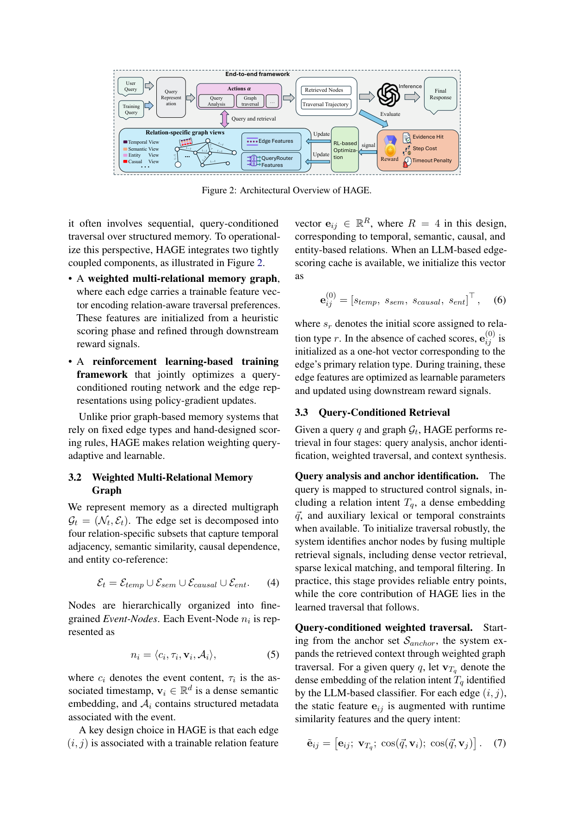
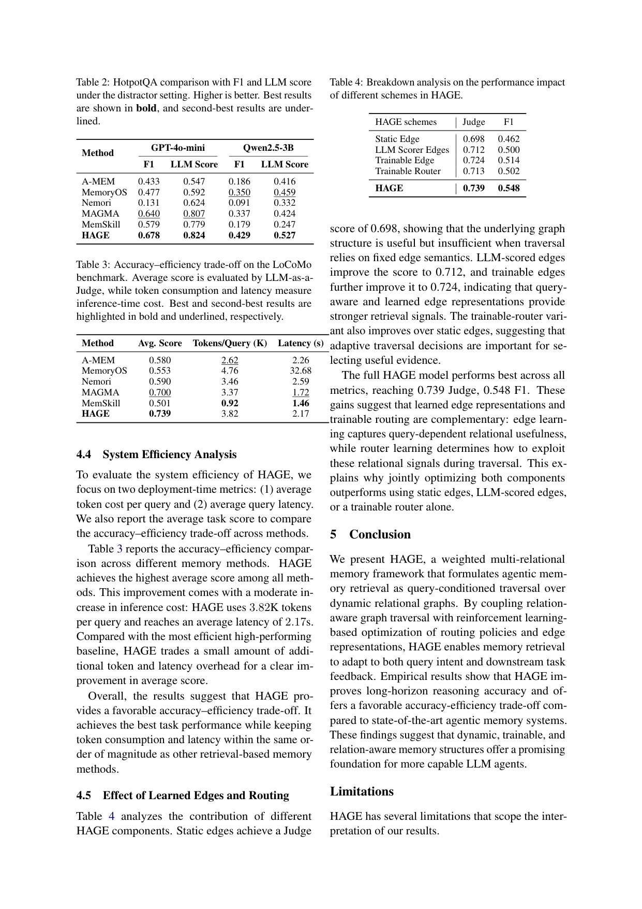

`hage | HAGE: Harnessing Agentic Memory via RL-Driven Weighted Graph Evolution | UT Dallas + Univ. Florida + UC Davis(Dongming Jiang 等;通讯 Bingzhe Li) | 2026-05 arXiv:2605.09942v1(标注 11 May 2026)· 预印本 | L?·"RL 学图记忆检索/遍历"主线·高相关`

> 三标注:【原文】=论文直述;【推断】=有据判断(附依据);【待核】=拿不准的关键事实。
> 注:arXiv id 2605.09942 标注日期为 2026-05,属本调研时间窗内的最新预印本;以下全部基于已下载真实 PDF 正文(14 页)。

══ 第一层:一眼看懂 ══

- 🟦 **TL;DR**:agent 的外部记忆通常是"图,但边只表示有没有连边、权重固定"。HAGE 把记忆做成**带可训练边特征向量的多关系图**(每条边有 4 维:时间/语义/因果/实体),并把"检索"重新定义为**按 query 条件在图上一步步走(query-conditioned traversal)**:给一个 query,先用 LLM 分类器判断它的"关系意图"(比如这是时序题还是实体题),再用一个小路由网络(QueryRouter MLP)动态调制对应维度的边权,把"语义相似度 + 学到的结构权重"加在一起算转移分数走图。最关键:**用 RL(REINFORCE)把"边特征"和"路由网络"一起训**,奖励 = 命中目标证据节点 − 步数/超时惩罚。结果在长程记忆检索上更准、且 accuracy-efficiency 权衡更好。【原文 摘要+§3】

- **最巧的一步**:**把"记忆该怎么检索"本身建成一个 MDP,用下游 reward 联合训练边表示+路由策略**;且只需"节点级证据目标"(命中哪些证据节点)而非"整条路径轨迹监督"。抽掉 RL 训练这一步,HAGE 就退化成 MAGMA 那类"静态边权 + 启发式遍历"——消融 Table 4 正好证明:Static Edge 0.698 → Trainable Edge 0.724 → 全 HAGE 0.739。这是它区别于所有"图结构表达力强但访问机制仍静态"方法的根。【原文 §3.4, Table 4】

══ 第二层:为什么做 ══

- **研究背景**:长程 agent 必须跨 session 积累/复用经验,纯长上下文会"稀释、错位、遗忘"导致召回不稳。RAG/记忆增强生成(MAG)把知识挪到外部可查记忆里;近年记忆系统已从纯文档检索进化到 episodic/semantic/entity/graph 等结构化形态——"记忆的结构很重要"已成共识。【原文 §1, §2.1】

- **解决的具体痛点**:**结构变强了,但"访问机制"还是静态的**。两个具体瓶颈——
  - ① 大多数 agent 记忆用**无权或弱权关系**,边只表示"存在连接"而非"在当前 query 下的效用"。但现实里**连接的重要性是 query 依赖的**:时序边对"顺序题"关键、对"实体题"无关。把所有出边一视同仁/用固定扩展规则,就分不清"高相关路径"和"干扰噪声",记忆一大召回就崩。
  - ② 即便引入了连续分数/边权,检索仍由**固定相似度搜索、手工设计的打分函数、静态启发式遍历规则**主导。adaptive RAG 已提示"检索决策可以用学到的策略/RL 优化",但那些工作主要针对**外部知识密集 QA / 文本-图混合检索**,**不是"会随交互演化的持久 agent 记忆"**。这个 gap 催生:agent 应当根据"当前 query + 下游反馈"学会"走哪条关系路径",而非靠手工访问机制。【原文 §1, §2.2】

- **相关工作 & 各自不足**:
  - *结构化记忆线*:A-MEM(自演化记忆笔记)、Nemori(predict-calibrate episodic 分段图)、MemoryOS(分层语义记忆 OS)、GraphRAG/HippoRAG/Zep/AriGraph——表达力强,但**访问靠固定边类型/手工权重/启发式遍历**。
  - *静态多关系记忆*:**MAGMA(Jiang et al., 2026,静态边权 + 启发式遍历)**——最近邻、同组前作,HAGE 直接把它的"静态边 + 启发式"换成"可训练边 + RL 路由"。
  - *RL 技能记忆*:**MemSkill(RL-based skill-evolving memory)**——同样用 RL 但学"技能演化",HAGE 学的是"遍历/检索路由"。
  - *adaptive RAG / 图检索 RL*:RouterAG 等——目标是外部 KB QA,不是演化的 agent 记忆。
  - **与最近邻 MAGMA 的 Δ**:MAGMA 边权静态、遍历启发式;HAGE 给每条边一个**可训练 4 维关系特征**,并用 **QueryRouter + REINFORCE** 让"边权 query 自适应且可学"。为什么有用——query 依赖性被显式建模(LLM 判关系意图→调制对应维度),消融显示这正是涨点来源。【原文 §1, §2, §4.1】

- **动机链**:长程 agent 要稳召回 → 外部图记忆 → 但访问机制静态、边权不分 query → 现实中边的重要性 query 依赖 → 所以要"按 query 条件的加权遍历" → 手工打分/启发式不够 → 把遍历建成 MDP 用下游 reward 学边特征+路由 → 为防warm-start 特征训飘加 anchor 正则。为什么不用更简单的:纯向量搜索丢结构;固定二元图分不清效用;手工打分不泛化;纯 LLM 重排太贵(HAGE 训练阶段 Phase2 零 LLM 调用是刻意省成本)。【原文 §1, §3.4, §3.5】

══ 第三层:怎么做 + 靠不靠谱 ══

- **方法流水线(两大组件,对应 Figure 2)**:
  1. **加权多关系图记忆**:有向多重图 G_t=(N_t,E_t),边按 4 种关系拆成 E_temp∪E_sem∪E_causal∪E_ent。节点是细粒度 Event-Node n_i=⟨content c_i, timestamp τ_i, 语义 embedding v_i∈R^d, 元数据 A_i⟩。**核心设计:每条边 (i,j) 带一个可训练关系特征向量 e_ij∈R^R(R=4)**;有 LLM 边打分缓存时初始化为 [s_temp,s_sem,s_causal,s_ent],否则用主关系类型的 one-hot。【原文 §3.2】
  2. **Query-conditioned 检索(4 步)**:
     - *query 分析 + anchor 识别*:LLM 分类器抽"关系意图 T_q" + dense embedding;融合 dense 检索 / sparse 词法 / 时间过滤选 anchor 入口节点。
     - *加权遍历*:对每条边把静态特征拼上运行时相似度与 query 意图 ẽ_ij=[e_ij; v_{Tq}; cos(q,v_i); cos(q,v_j)],过轻量 MLP(QueryRouter)得正标量结构权重 w_ij(q)=softplus(MLP([q; ẽ_ij]));**转移分数加性组合** S(n_j|n_i,q)=λ·cos(v_j,q)+(1−λ)·w_ij(q)——加性是为了让"结构关键但语义远的 bridge 节点"也能被走到(即便目标节点语义余弦为负);softmax 成遍历策略 π。训练时按 π 采样探索、推理时贪心/beam 扩展;hop 预算耗尽或命中证据则停。
     - *context 合成*:按 query 类型(时序/因果/分数)重排检索节点,塞满 context 预算。【原文 §3.3】
  3. **RL 联合优化(MDP)**:状态=当前节点+query embedding+已访问 mask(防环);动作=选邻居;终止=到证据节点/死胡同/耗尽 hop 预算。**奖励 r_t = r_hit − λ_step·r_step − λ_timeout·r_timeout**(多跳题累加每个唯一证据命中);用 **REINFORCE + EMA baseline** 降方差,θ 同时含 QueryRouter 权重和边特征,梯度裁剪。【原文 §3.4】
  4. **Anchor 正则(防漂移)**:边特征 warm-start 自 Phase1 分数,无约束优化会让它飘离初值 → 推理时新图用 Phase1 静态特征、但 router 在"飘过的特征"上训过 → 分布失配。加 **L2 anchor 正则** L_anchor=λ_anchor·Σ‖e_ij − e_ij^(0)‖²,总目标 L=−J(θ)+L_anchor,等价于"把特征空间探索约束向语义初值"的 constrained policy learning。【原文 §3.4 Eq.14-15】
  5. **Co-evolution 稳定化**:边特征与 router 协同演化,用**非对称学习率 η_edge < η_router**——router 快速适应 query 偏好,边特征保守演化保住 Phase1 语义结构、避免不稳漂移。【原文 §3.4.1】

- **逐组件必要性(消融 Table 4,LoCoMo,gpt-4o-mini)**:
  - Static Edge 0.698(Judge)/0.462(F1)→ 图结构有用但固定边语义不够;
  - LLM Scorer Edges 0.712 → query-aware 打分有帮助;
  - **Trainable Edge 0.724** → 可学边表示更强;
  - Trainable Router 0.713 → 自适应遍历也重要;
  - **全 HAGE 0.739/0.548** → 边学习与路由学习互补(边学"哪条关系对该 query 有用"、router 学"怎么用这些信号遍历")。✔核心组件都有消融,且证明"联合 > 单独"。
  - *anchor 正则/非对称学习率的单独消融*:**原文未给独立数字**(只论证其动机),属"有动机、未单独证明"项。【推断:依据=§4.5 仅列 edge/router 维度,未列正则消融】

- **关键机制直觉**:本质是把"图检索的遍历决策"变成可学策略。边的 4 维特征 = "这条关系在不同 query 类型下的可走性",reward 命中证据正向强化成功路径上的边特征、抑制失败路径(co-evolution 原文明述);加性转移分数让结构权重能"救回"语义不相似但桥接关键的节点——这是纯向量检索做不到的。Phase2 训练**不调 LLM、只在缓存图结构+预算 embedding 上跑**,所以 RL 很便宜。【原文 §3.3-3.4, §3.5】

- **实验与证据**:
  - 数据集:**LoCoMo**(超长对话,均长 9K token,测长程时序/因果检索)+ **HotpotQA**(distractor 设置,多跳跨段证据)。Backbone:**gpt-4o-mini** 与 **Qwen2.5-3B**。节点 embedding 用 **all-MiniLM-L6-v2**。主指标 **LLM-as-a-Judge 分数**,辅以 token-level F1。**5-fold 会话级交叉验证**(防 query 泄漏),每样本只被未见它的模型评一次。【原文 §4.1, §3.5】
  - Baseline:Full Context、A-MEM、Nemori、MemoryOS、**MAGMA(静态多关系)**、**MemSkill(RL 技能记忆)**——同 backbone。
  - **关键发现①(LoCoMo,Table 1)**:HAGE overall 最佳——gpt-4o-mini 0.700(最强基线 MAGMA)→ **0.739**;Qwen2.5-3B 0.499 → **0.548**。**Adversarial 子类增益最大**(gpt-4o-mini 上 0.839 vs MAGMA 0.742),Temporal/Single-Hop 也最佳。
  - **关键发现②(泛化 HotpotQA,Table 2)**:gpt-4o-mini F1 0.678 / LLM 0.824(均第一,超 MAGMA 0.640/0.807);Qwen2.5-3B 也全面领先 → 学到的遍历能迁移到非对话多跳 QA。
  - **关键发现③(效率,Table 3)**:HAGE Avg 0.739(最高),3.82K tokens/query、2.17s 延迟——比最高效高分基线只多一点开销,token/延迟与其他检索式记忆同数量级。MemoryOS 延迟 32.68s(远高),HAGE 远优。
  - **baseline 公平性**:同 backbone、同 benchmark、统一锁定训练配置、按 validation reward 选 checkpoint;交叉验证防泄漏。较严谨。【推断:依据=§4.1 评测协议】
  - **看着强但需警惕**:① 绝对分数仍中等(LoCoMo overall 0.5–0.74),Qwen2.5-3B 上 Multi-Hop/Open-Domain HAGE 并非最佳(被 Nemori/MemoryOS 等局部反超),overall 第一更多靠 Temporal/Single-Hop/Adversarial 拉动;② **Nemori 在 HotpotQA F1 仅 0.131 却 LLM 0.624**,显示 LLM-judge 与 F1 经常背离,judge 单指标可信度存疑。【原文 Table 1/2】

- **假设与失效边界**:
  - 【原文·Limitations】只覆盖 LoCoMo + HotpotQA 两类检索,**未必泛化到 procedural / document-grounded 等其他记忆密集任务**。
  - 【原文·Limitations】重度依赖 LLM 组件:query 分析(关系意图抽取)和评估(LLM-as-a-Judge)都靠 instruction-tuned LLM,带来成本与模型特异性;**关系意图分类器的准确率直接影响 query-conditioned 边特征质量**。
  - 【推断】关系类型**写死为 4 维(时间/语义/因果/实体)**,新领域若有其他关系类型需重设计。依据=§3.2 R=4 固定。
  - 【推断】reward 的 r_hit 需"训练时把节点内容与 ground-truth 答案匹配"来标证据节点 → **依赖有标注证据的训练数据**,无标注的开放任务难直接训。依据=§3.4 reward 设计。
  - 【推断】anchor 正则把特征拉回 Phase1 初值,本质限制了记忆"演化"的幅度——强约束下"自适应"和"稳定泛化"是 trade-off,正则太强会退回静态。依据=§3.4 Eq.14 动机。

- **祛魅总结**:
  - **真贡献(硬货)**:(a)把 agent 记忆检索**形式化为可学的 query-conditioned 图遍历 MDP**,且**只需节点级证据监督**(比整条路径监督弱、更实际);(b)边表示 + 路由**联合优化优于单独**(Table 4 干净消融);(c)**Phase2 训练零 LLM 调用**——工程上很实在的省成本设计;(d)加性转移分数让"结构关键 bridge 节点"可达,机制动机清晰。
  - **包装/可能高估**:标题"Weighted Graph Evolution"中的"evolution",实际是"训练期一次性学边权/路由",**不是部署中记忆图随交互在线演化**——这点与"self-evolving"语义有距离(本文是离线训练好检索器,推理时图仍按 Update 规则增长但检索器参数不再学)。【推断:依据=§3.5 训练用交叉验证选 checkpoint、Phase2 在缓存图上跑,无在线参数更新】
  - **可能低估/空白**:judge 单指标与 F1 频繁背离未深究;anchor 正则/非对称学习率无独立消融;关系类型固定 4 维的局限只字未提。代码标注为"MVP implementation"(最小可行版),完整度待核。【推断】

══ 结构化抽取 ══

- 🎯 **机制速览 6 轴**:

| 学什么信号 | 改什么 | 何时改 | 免梯度? | 记忆-技能生命周期 | 防遗忘机制 |
|---|---|---|---|---|---|
| 环境 reward(下游证据命中 r_hit − 步数/超时惩罚;**只需节点级证据目标**,非路径监督) | **边关系特征向量 e_ij(4维,可训练)** + **QueryRouter(MLP)权重**;**不改 backbone LLM、不改 logits**——只学"检索/遍历器" | **离线批量训练**(REINFORCE,5-fold CV;Phase2 零 LLM 调用);推理时检索器参数冻结、图按 read-generate-write 增长 | **混合**:检索器训练有梯度(REINFORCE 策略梯度);记忆内容写入/边初始打分由 LLM 免梯度产生 | 写入(Event-Node + 4 类边,LLM 初始打分)→检索(query 意图分类 + anchor + 加权遍历 top-path)→**未显式遗忘/淘汰**(图随交互增长,无删除机制)→未涉及跨 agent 共享 | **KL/L2 投影式 anchor 正则**:L2 把边特征约束向 Phase1 语义初值(防训练漂移→保泛化);**非对称学习率**(η_edge<η_router)保住语义结构。**无 merging/无几何共识/无几遗忘淘汰** |

- ⑦ **开源代码 + 框架/harness**:**已开源(MVP 版)** https://github.com/FredJiang0324/HAGE_MVPReview(已 `git ls-remote` 核验**真实可达**,main 分支 HEAD=ddc159d…)。框架:**纯 PyTorch 自研**(模块化图训练框架:node embedding + COO 边索引 + typed 边标签 + 关系边特征,GPU 加速遍历);优化器 **Adam**,策略 **REINFORCE + EMA baseline**;embedding **all-MiniLM-L6-v2**。**不使用 veRL/TRL/OpenRLHF 等 RLHF 框架**(自实现轻量 RL)。〔代码仅为 "MVP implementation",完整复现度待核——README/脚本未 clone 核对〕【原文 §3.5, 脚注1】

- 💰 **资源/成本与可扩展性**:轻量。模型规模小(gpt-4o-mini / Qwen2.5-3B);**Phase2 RL 训练完全不调 LLM**,只在缓存图+预算 embedding 上跑,训练便宜。推理:3.82K tokens/query、2.17s 延迟(Table 3),与其他检索式记忆同量级,显著低于 MemoryOS 的 32.68s。可扩展性隐患:图随交互无限增长、无遗忘机制,大规模下遍历/检索成本未给定量分析。【原文 §3.5, §4.4】

- 🎯 **对"探索-巩固"idea 对标**:**可借组件为主,部分支撑**。
  - *可借组件 1(高价值)*:**anchor L2 正则 = "把演化约束向语义初值"的防漂移机制**——与项目 reusable_techniques 里"forward-hard/backward-soft 解耦"动机相邻(都是"让更新有界、保住已学结构");可迁移到 TSRD 巩固阶段防止把已学路径选择能力训飘,作为一种 KL/L2 投影式防遗忘。
  - *可借组件 2*:**非对称学习率稳定 co-evolution**(慢学结构、快学策略)——可借鉴到"记忆/技能 vs 路由/策略"两组参数的协同训练,缓解 MTP+OPD 联合优化的不稳。
  - *可借组件 3*:**只需节点级证据监督、把检索建成 MDP**——若 TSRD 要学"何时检索哪条 recovery 策略",这种弱监督 RL 形式比整条轨迹监督更省标注。
  - *支撑面*:它佐证了"用 RL 学'访问/选择'机制比手工启发式更优"这一更大论点(与 trainable_graph_mem 同方向)。
  - *缺口/区别*:HAGE 学的是**检索器**,完全不碰 backbone 参数、不蒸馏技能进模型;"evolution"是训练期一次性的,非在线持续学习。对 mtp_opd"把策略巩固进参数(OPD)+ MTP foresight"这条主线,它只在"检索/选择哪条记忆"这一外围环节相关,**核心的参数级巩固它没做**。【推断:依据=方法只训检索器 + 项目 project_core_idea】

- 🔭 **开放问题/未来方向**:
  - 【原文·Limitations】扩到 procedural / document-grounded 等更多记忆密集任务;降低对 LLM 组件(意图分类/judge)的依赖与模型特异性。
  - 【原文·Ethics】持久记忆的隐私/数据保留与用户控制;RL 检索策略可能放大训练数据偏见。
  - 【推断】关系类型从固定 4 维扩成可学/可发现;引入记忆遗忘/淘汰以控规模;judge 与 F1 背离问题的更可靠评测;把"训练期学检索器"升级为"在线持续演化检索器"。依据=方法与实验局限。

- 🖼 **关键图 top-2**:

  
  这是**原文 Figure 2**(方法主图,同页含 Eq.4-7 公式):上半"end-to-end framework"展示 User Query→Query Analysis→Graph Traversal→Final Response;左下"relation-specific graph views"展示同一组共享节点上的 Temporal/Semantic/Causal/Entity 四种关系视图;右下"RL-based Optimization"展示 reward(Evidence Hit / Step Cost / Timeout Penalty)如何回灌更新 QueryRouter 与 Edge Features。选它因为一图说清"多关系加权图 + query 条件遍历 + RL 联合训练"三件核心事。

  
  这是**原文 Table 4 + Table 2/3 所在页**(核心证据):Table 4 拆出 Static Edge 0.698 → LLM Scorer 0.712 → Trainable Edge 0.724 / Trainable Router 0.713 → 全 HAGE 0.739,直接证明"可训练边 + 路由"的边际贡献与互补性;Table 3 显示 HAGE 在最高分的同时把 token(3.82K)/延迟(2.17s)控制在同量级。选它因为这是支撑"RL 训练是涨点主因"和"accuracy-efficiency 权衡好"两个核心主张的最直接定量依据。

──────────
**幂等状态**:本文 analysis 首次产出。机制类型 = RL 学图记忆检索/遍历器(可训练边特征 + QueryRouter,REINFORCE+EMA,只学检索器不动 backbone;anchor L2 防漂移)。抽到 2 图:是(Figure 2 架构 + Table 4 消融页)。代码仓 `git ls-remote` 已核实真实可达。
