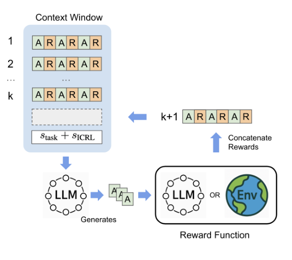
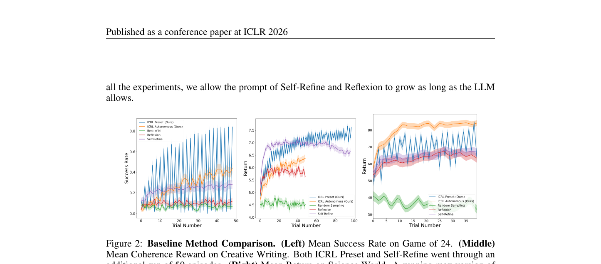

`icrl_prompting | Reward Is Enough: LLMs Are In-Context Reinforcement Learners | University of Virginia（Kefan Song / Amir Moeini 等;指导 Shangtong Zhang & Yanjun Qi） | ICLR 2026（arXiv:2506.06303 v6,2026-04-24;v1 2025-06） | L1 免梯度·test-time 学习(in-context RL) | 相关性 High` 

> 【档位】deep 全档。基于真实 PDF 正文(24 页:正文 §1–§7 + 附录 A–C)。三标注:【原文】/【推断】(附依据)/【待核】。

---

## ══ 第一层：一眼看懂 ══

- 🟦 **TL;DR**：【原文】本文给出一个"惊人"主张并验证它——**强化学习(RL)会在 LLM 推理时自发涌现**,作者叫它 **in-context RL (ICRL)**。为揭示这个能力,提出一个**极简多轮 prompting 框架 ICRL prompting**:① 第一轮只给任务描述,LLM 生成回答;② 给这个回答打一个**数值标量 reward**;③ 下一轮把"之前所有回答 + 各自 reward"拼进 context 再问一遍。**只给标量 reward、不给任何文字反馈/指令修正**。观察到:**随 context 增长,回答质量稳步提升**——即 LLM 在推理时最大化标量 reward,行为像一个 RL 算法。在 Game of 24、创意写作、ScienceWorld、AIME/HMMT 奥数上显著超过 Self-Refine、Reflexion;**即便 reward 由同一个 LLM 自评产生(无外部反馈),仍能提升**。
- **最巧的一步**：【原文】**把反馈刻意压到"只有标量 reward + 一个'Reward:'标签"这个极小集**(故意排除 textual gradient、优先经验回放、采样启发式、任何工程模块)。**抽掉 reward 就垮**——消融"Zero Rewards"(全置 0)性能显著下降(Figure 3)。【推断】这个"极简性(minimality)"设计才是论文的论证命门:正因为**唯一监督是标量 reward**,才能排除"是别的辅助机制在起作用",把提升干净地归因于"LLM 前向过程内部实现了某种 RL"。这是一个"鸭子测试"——看着像 RL、行为像 RL,那它就是在做 RL。

---

## ══ 第二层：为什么做（写透） ══

- **研究背景**：【原文】LLM 要当好 agent,必须能在**推理时**变强(test-time scaling)。提升算力有两条路:**搜索**(Best-of-N→ToT→MCTS,已被充分用于 LLM 自改进)和**学习**(在推理时却一直被忽视)。监督式 ICL 需要专家示范当标签,**推理时拿不到可扩展的示范数据**,限制了它做 test-time scaling;所以 LLM 必须**从自己生成的经验里学**。
- **解决的具体痛点**：【原文 §1】RL 是最成功的"不依赖人类知识的自我提升"算法,但其成功主要在**仿真环境 / LLM 的训练期**;现有 RL 在 "big world setting"(真实世界远比 agent 复杂)下不够用——agent 会遇到大量超出训练数据的情形,**必须在推理时即时适应,而非为每个新情形昂贵重训**。已有的 ICRL 工作又大多**局限于 bandit / 仿真环境**,且常需人工干预、打不过算法基线,**没解决"自然语言是动作空间"的开放任务**。
- **相关工作 & 各自不足**（§4）：
  - **ICRL(meta-RL 子领域)**:Laskin 等首创,但多用从零训练的小模型在游戏/机器人;用 LLM 的多限于 bandit/模拟器,需人工干预、不竞争。
  - **推理时自改进(Self-Refine / Reflexion / TextGrad)**:靠**自然语言自我修订**——【原文】质量受限于模型对任务的参数化知识,**易累积幻觉反馈导致性能崩塌**(Stechly 2025);本质是"语言引导的搜索",反馈当成下一轮的新指令。
  - **搜索类(ToT/GoT/MCTS/Go-Explore)**:依赖外部工程组件(启发式/记忆管理),不是用模型内在学习能力。
  - **prompt 优化(OPRO 等)**:用数值分数引导,但靠 top-k 选择 + 错误过滤,**更像 in-context 监督学习(过滤行为克隆),而非 RL**;**ICRL 的关键区别是能从失败经验里学**。
- **动机链**：真实世界需要"通才初始策略 + 推理时持续自改进"→ LLM 提供通才初始策略,若 RL 能纯在 context 里发生就同时满足两需求 → 现有 ICRL 困在玩具环境、现有自改进靠易崩的文字反馈 → **用极简标量-reward prompting 把 LLM 内在的 ICRL 能力逼出来,并在开放语言任务上证明它**。呼应"reward hypothesis"和 Silver 等的"reward is enough"假说(标题即来源)。
- **与最近邻的 Δ**：
  - **vs Reflexion / Self-Refine(最直接对照)**:【原文 §5.1 明说】"ICRL vs Self-Refine/Reflexion 本质上是**标量反馈 vs 文字反馈**的对比"——后者把反馈当显式新指令(语言引导搜索),ICRL 只给数,逼模型**从经验模式中自己推断更好回答**。Figure 2(中)显示:Self-Refine 起初追平 ICRL,延长到 50+ episode 后**先 plateau 再下降**(context 长大致幻觉累积),而 ICRL 持续涨。
  - **vs 经典 ICRL(Laskin 等)**:那些需在大量 MDP 上**预训练 θ**才涌现 in-context policy improvement;本文主张**现成预训练 LLM 已自带 ICRL 能力**,无需额外 RL 预训练,且在**自然语言动作空间**的开放任务上工作。

---

## ══ 第三层：怎么做 + 靠不靠谱 ══

- **方法流水线**（§3，Algorithm 1，配 Figure 1，极简四件套）：
  1. **LLM 作策略 \(π_θ\)**：给任务自然语言描述 s_task;每个 episode 开头,把"LLM 自己过去的尝试 + 对应 reward + s_task + 元指令 s_ICRL"拼成初始 prompt S0,LLM 生成回答。
  2. **Reward 函数 r**：对回答给数值标量 reward,可**稀疏(仅终局)或稠密(逐步)**;可规则based、单独学习、或**用同一 LLM 自评**。关键:**唯一反馈就是这个标量**,且**显式在数前写 "Reward:" 标签**告诉 LLM 这是 reward。若 r 是 LLM 自评 → 无任何外部反馈,但因"评估比生成易"仍期望提升(作者假设:自评的上限低于外部反馈)。
  3. **经验记忆 buffer B**：存过去回答 + reward,**尽 context 窗口所能地全拼进去**;假设预训练 LLM 已有 ICRL 能力,能在前向过程里从这些经验"强化学习"。
  4. **ICRL 指令 s_ICRL(探索/利用调度)**：三种自然语言指令——*exploration*(要求给出与所有过去不同的回答)、*exploitation*(基于最高 reward 的过去回答给最佳解)、*explore-or-exploit*(让 LLM 自己决定)。两策略:**ICRL Preset**(偶数 episode 探索/奇数利用,交替) vs **ICRL Autonomous**(每轮都给 explore-or-exploit,LLM 自主选)。
- **逐组件必要性（消融充分，Figure 3：Game24/创意写作/ScienceWorld 三 benchmark）**：
  - **reward 信号(Zero Rewards)**:置 0 后显著掉 → reward 是必需(否则不是 RL)。
  - **长 context(Short Context, deque 长 3)**:只留最近 3 episode 显著掉 → 长经验是性能来源,呼应"context 越长越好"。
  - **Exploration Only(只探索、无 reward)**:**显著差于完整法**——这条最关键:证明 ICRL 的提升**不是 Best-of-N 式"多探索再挑最好"**,而是**能真正生成比探索期更好的新回答**(genuine policy improvement)。
  - **Exploitation Only(只利用 + reward)**:与完整法同属最佳曲线之列 → 有 reward 的利用很强,框架对 prompt 设置鲁棒。
  - **No ICRL Instruction(去掉 s_ICRL)**:掉 → 元指令有用但非全部(去掉仍优于 Zero Rewards)。
- **关键机制/直觉 + "RL 真在发生"的硬证据**：直觉=把"参数更新 \(θ_t→θ_{t+1}\)"换成"context \(C_t\) 增长",前向过程读 (动作,reward) 历史、识别"高 reward 模式",自回归地产出更优动作。**作者给了三组"这真是 RL"的证据**:
  - **行为证据(duck test)**:reward 最大化 ✓、探索-利用权衡 ✓(Figure 2 成功率振荡=交替探索/利用)、context 增长→提升 ✓、context 变短→下降 ✓、无 reward→下降 ✓。
  - **学习 vs 搜索的判定实验(很巧)**:让模型给**训练截止后才发表的 arXiv 论文**写摘要(真值不在训练数据里)——Best-of-N/Reflexion **快速 plateau**,而 ICRL 在 200 轮内持续提升 ROUGE-Recall(Figure 17,App C)。**证明 ICRL 是从外部 reward 学到了训练数据没有的新信息,而非在参数知识里搜索**。
  - **机制证据(reward-aware attention heads)**:Qwen3-32B 上,对最后 32 层每个 head 算"注意力 vs reward"的 Pearson 相关——**2048 个 head 里 597 个(29.1%)显著相关**(远超随机 5%),有的 head 追高 reward 例、有的追低 reward 例(像 RL 既从成功也从失败学)。
- **实验与证据**（§5）：
  - **Game of 24**(GPT-4.1,reward 由 GPT-4.1 自评 0–3 打分,**无人能拿到真值 r***):Table 1——ICRL Preset **90%** / Autonomous 84% vs Best-of-N 49%(还用了真值 r* 选最优)/ Self-Refine 47% / Reflexion 44% / Long-CoT 47% / CoT 6%。**碾压式**。
  - **创意写作**(GPT-4.1 自评 reward,Alpaca-Eval 2 LC 胜率):Table 2——ICRL vs Reflexion 59.48%、vs Long-CoT 78.36%、vs Self-Refine 86.32%、vs Best-of-N 93.81%。
  - **ScienceWorld**(GPT-4.1-mini,环境真 reward,\(r=r^*\)):Figure 2 右——足够迭代后 ICRL 超基线约 20%;App B 显示按**美元算力预算**衡量 ICRL 也比基线 scale 得好。
  - **跨模型 + 奥数**(Table 3/4):Qwen3-32B 在 8k/16k/32k context 上 ICRL 均超 Self-Refine/Reflexion(CW + AIME);Phi-4 / Llama-4 Maverick / Qwen3-32B(±thinking)在 HMMT/AIME/CW 上 ICRL 普遍超基线,**比 base 高 10–20 分**。
  - **baseline 公平吗**【推断】:相当公平甚至**对 baseline 偏宽**——Best-of-N 被允许用**真值 r***选最优(ICRL 拿不到),Self-Refine/Reflexion 的 prompt 被允许"长到 LLM 上限"、ScienceWorld 里还允许它们看当前 episode reward(ICRL 不行)。在这些放水条件下 ICRL 仍赢,说服力强。
  - **"看着强但没答核心问题"的隐患**【推断】:很少——本文核心主张是"RL 涌现",而行为证据 + 学习vs搜索实验 + attention 机制三管齐下,正面回答了核心问题。可质疑处:Game of 24 的 90% 部分得益于 GPT-4.1 长 context 能力 + 自评 reward 恰好对该任务有效,跨任务/弱模型上增益回落到 10–20 分。
- **假设与失效边界**：
  - 【原文】**核心假设:预训练 LLM 已自带 ICRL 能力**——若模型太弱/无此涌现,框架失效;Table 4 显示弱模型(Phi-4)增益较小、强模型增益大。
  - 【原文】**自评 reward 的上限低于外部反馈**(作者明确 hypothesize);评估须比生成易——对"评估也很难"的任务(如需专业验证),自评 reward 噪声会拖累。
  - 【原文+推断】**强依赖长 context**(Short Context 消融掉分):受 context 窗口 + 长上下文利用能力限制;经验只增直到塞满窗口,**无遗忘/淘汰机制**,超窗后如何取舍未深究〔待核:论文说"as many as context allows",未给超窗策略〕。
  - 【推断】reward 必须是**有意义的标量信号**;若 reward 函数本身有偏(尤其 LLM 自评),ICRL 会忠实地优化错目标(reward hacking 风险,论文未讨论)。
- **祛魅总结**：
  - **真贡献(硬货)**:① **概念贡献最大**——首次在**开放自然语言任务**上,用极简标量-reward 框架系统论证"RL 是 LLM 推理时的涌现能力",并以"行为 + 学习vs搜索 + attention 机制"三重证据支撑,论证严谨(极简性设计是为了干净归因);② 实测增益大且 baseline 放水仍赢(Game24 90% vs 49%);③ "学习 vs 搜索"的 cutoff-后-arXiv 实验设计巧妙,真正区分了"学到新东西"和"搜索已有知识";④ 即便自评 reward(无外部信号)也提升,指向一种新的 test-time scaling 范式。
  - **包装/可能高估**【推断】:(a) 标题"Reward Is Enough"是对 Silver 假说的呼应/借势,**实际框架仍需一个能给有意义 reward 的函数 + 一个本就很强的长 context LLM**,"enough"是在这些前提下;(b) "RL 涌现"是有力的解释假说,但"前向过程实现了某种 RL 算法"仍是**行为/相关性证据**(attention 相关≠因果实现某具体 RL 更新),严格的机制因果未完全坐实;(c) 它是**纯 prompting,无任何记忆治理/技能抽象**,工程上是所有免梯度法里最"裸"的——优点是干净、缺点是把所有负担压给 context 窗口与底座能力。

---

## ══ 结构化抽取 ══

### 🎯 机制速览 6 轴
| 维度 | 内容 |
|---|---|
| **学什么信号** | **纯数值标量 reward**(且仅此一项;前面带 "Reward:" 标签);来源灵活:环境真 reward / 规则 / 单独学的 RM / **同一 LLM 自评**(后者=无外部反馈仍提升) |
| **改什么** | **context(经验 buffer)**——把过去(动作,reward)拼进 prompt;**参数 θ 完全冻结、logits 不直接动、prompt 模板固定**(仅元指令 s_ICRL 在探索/利用间切换);改的是"前向过程读到的历史" |
| **何时改** | **在线 per-episode**(每轮生成→打分→把 reward 拼回 context→下一轮)——会话内多轮,无离线阶段 |
| **免梯度?** | **是**(纯 in-context;无参数更新;主张 RL 在前向过程涌现,θ* 固定) |
| **记忆-技能生命周期** | 写入:每 episode 末把(动作,reward)序列 push 进 buffer B;检索:**全量拼接**进 S0(尽 context 所能,非选择性检索);遗忘/淘汰:**无显式遗忘**(buffer 为"无限队列",超窗才被迫截断,论文未给策略);共享:仅单任务会话内,**不跨任务/不跨会话**(对比经典 ICRL 跨 episode) |
| **防遗忘机制** | **隔离式(不动权重→无灾难性遗忘)**;无任何 merging/投影/巩固机制——纯靠"参数不变 + 经验在 context";【推断】唯一风险是长 context 下的"反思噪声/幻觉累积",但 ICRL 因只用标量 reward 而比 Reflexion 更抗此问题(Figure 2 中 Self-Refine 崩、ICRL 不崩) |

### ⑦ 开源代码 + 框架/harness
- 【原文】代码:**https://github.com/garified/ICRL-for-LLM-Agent**(摘要 + §1 末均给出,"release all code")。
- 框架/harness:【原文+推断】**极简自研 prompting 框架**(Algorithm 1:buffer + 任务描述 + s_ICRL 拼接 + 多轮调用),**无 agent harness、无训练框架、无外部工程模块**(刻意排除以保极简性)。环境:Game of 24(SymPy 验证)/ 创意写作(Alpaca-Eval 2)/ ScienceWorld。底座:GPT-4.1 / GPT-4.1-mini / Qwen3-32B(±think) / Phi-4 / Llama-4 Maverick(均 API/开源调用)。**本次未 clone**(P4 仅核 PDF;实现见 repo)。〔待核:仓库完整度——未访问〕

### 💰 资源/成本与可扩展性
- 【原文】无训练成本(零梯度);主要成本=**多轮长 context 推理的 token**。§5.3 + App B:按**美元算力预算**衡量,ICRL 比 Best-of-N 等基线 **scale 得更好**(不只按 trial 数,按 $ 也更优)。Context 长度实验(Table 3)显示 8k 即有效、32k 更好。
- 【推断】可扩展瓶颈:每轮 context 线性增长 → token 成本随 episode 增长;受底座 context 窗口与长上下文利用能力上限约束;无 GPU 需求。

### 🎯 对"探索-巩固"idea 对标
- **强支撑(理论/范式根基) + 可借组件,但缺"巩固"**:
  - **范式支撑**:本文是"**免梯度在线学习确实可行且是 RL**"这一命题的最强理论/实证背书——直接支撑"探索-巩固"在线探索期"冻结权重 + 经验在 context/分布上做 RL"的合法性。"reward is enough"为"探索期只靠 reward 信号驱动"提供论据。
  - **可借组件**:① **显式 explore/exploit 元指令调度(Preset 交替 / Autonomous 自主)**——可作"探索期"探索-利用切换的现成、可解释机制;② "**学习 vs 搜索"的判别实验设计**(cutoff 后 arXiv 摘要)可借来**验证"探索-巩固"到底在学新东西还是在搜索**,是很有用的评估积木;③ **reward-aware attention heads 的机制分析方法**可迁移来探查"探索期 logit/激活调制究竟改了什么"。
  - **关键缺口(正是"探索-巩固"的存在理由)**:ICRL prompting 是**最极端的"只有探索、零巩固"**——纯 context、连记忆治理都没有,知识永远停在会话 context 里,**会话一结束、context 一清空就全忘**,且**不跨任务**。这恰好凸显"探索-巩固"要补的两件事:(a) 把会话内 reward 学到的策略**固化/巩固**(进权重或进持久记忆),(b) 跨任务/跨会话**保留与防遗忘**。
  - **作者亲口指出的结合点**:【原文 §7 conclusion】"未来关键方向是研究**训练时干预如何进一步增强 LLM 的 in-context RL 能力**"——这正是"探索(in-context RL)↔ 巩固(训练时/权重干预)"双向耦合的官方背书。

### 🔭 开放问题 / 未来方向
- 【原文 §7】**训练时干预增强 ICRL 能力**(让模型天生更会 in-context RL)——核心未来方向。
- 【推断】① **巩固机制**:把会话内 ICRL 学到的东西沉淀为持久记忆或权重(当前会话结束即忘)。② **reward 质量与 reward hacking**:自评 reward 的可靠性边界、防止优化错目标。③ **长 context 之外的扩展**:超 context 窗口时的经验选择/压缩(当前只"尽窗口塞")。④ **跨任务 ICRL**:把单任务会话内能力推广到跨任务持续学习。⑤ 把行为/相关性证据升级为**机制因果证据**("前向过程实现了哪种 RL 更新")。

### 🖼 关键图 top-2

- 这是**原文 Figure 1**(方法主图)。Context Window 里逐行堆叠 episode 1..k,每行是 `A R A R A R`(动作-reward 交替)+ 底部 \(s_task + s_ICRL\);LLM 据此生成动作 → 经 **Reward Function(LLM 自评 OR 环境 Env)** 打分 → 第 k+1 轮把 reward 拼接回 context。**选它**:一图说清整个"极简、纯 context、reward 唯一信号"的闭环,是抽取 6 轴(学什么信号/改什么/何时改/生命周期)的唯一依据图,也直观呈现"为什么这叫 in-context RL"。

- 这是**原文 Figure 2**(核心结果图)。三联:Game of 24 成功率 / 创意写作 coherence reward / ScienceWorld return,横轴 Trial Number。**ICRL Preset/Autonomous(我方)曲线持续上升**,且 Game24 的成功率呈现明显**振荡=交替探索/利用**(RL 行为证据);Best-of-N/Reflexion/Self-Refine 早早 plateau 甚至下滑。**选它**:既给出"碾压基线"的硬结果,又用曲线形状(单调上升 + 探索-利用振荡)作为"这真是 RL"的行为证据,是理解核心主张的最关键图。
