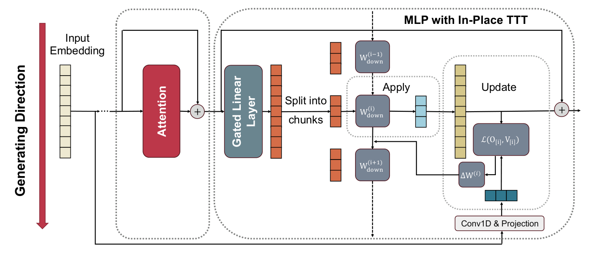
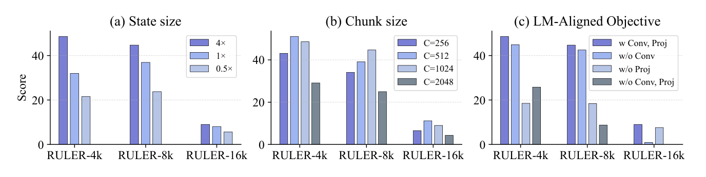

`in_place_ttt | In-Place Test-Time Training | ByteDance Seed + 北京大学（Guhao Feng, Shengjie Luo, Tianle Cai; 通讯 Di He(PKU) / Wenhao Huang(ByteDance)） | 2026-04 arXiv:2604.06169v1（7 Apr 2026） · 预印本(技术报告) | L?·test-time training / 参数级在线适应 主线·高相关（与 MTP+OPD idea 直接相关）`

> 三标注约定:【原文】=论文直述;【推断】=有据判断(附依据);【待核】=拿不准的关键事实。

══ 第一层:一眼看懂 ══

- 🟦 **TL;DR**:LLM 是"先训好再冻结部署"的静态范式,推理时权重不能动,所以处理长上下文/演化任务时无法像人一样"边读边学"。**Test-Time Training(TTT)** 的思路是:在推理时只更新一小撮参数(叫 **fast weights / 快权重**),用自监督目标把上下文信息"压"进这撮参数,当作一个在线演化的记忆状态。但 TTT 进 LLM 有三道坎:①**架构不兼容**——现有 TTT 多是要替换 attention 的专用层,得从头预训练,无法热启动现成大模型;②**算力低效**——经典 TTT 是逐 token 串行更新,卡不住现代 GPU 的并行;③**目标错位**——TTT 用的是"重建(reconstruction)"目标(记住当前 token),和 LLM 真正要的"预测下一个 token(NTP)"不对齐。本文 **In-Place TTT** 三招对应破解:① **就地(in-place)复用现成 MLP 块的最后一个投影矩阵 $W_{down}$ 当 fast weights**——不加新层、不动架构,任意预训练模型可"drop-in"挂载;② **chunk-wise(分块)更新** + 因为只改 MLP、attention 原封不动,所以能用大 chunk(512–1024)吃满并行,还能上下文并行(CP);③ **把重建目标换成 NTP-aligned 目标**——target 用 `Conv1D(token embedding)·W_target` 显式注入"未来 token"信息,并给出**定理证明**这个目标在期望上能抬高正确下一 token 的 logit、几乎不动其它 logit(重建目标做不到)。实验:Qwen3-4B-Base 挂上它经廉价 continual training 后,128k 长上下文 RULER 显著涨、还能外推到 256k;从头预训也稳压 GLA/DeltaNet/LaCT 等 TTT/高效注意力基线。代码:https://github.com/ByteDance-Seed/In-Place-TTT 。【原文 摘要+§1+§3】

- **最巧的一步**:**把 fast weights 选为现成 gated-MLP 的 $W_{down}$(就地复用),而非新增专用层**。这一步同时拆掉坎①(无需新层/无需从头训,保护预训练权重)和坎②(只动 MLP、attention 不变→脱离逐 token 串行约束→可用大 chunk 吃满并行)。抽掉它,方法就退回"另起一个 TTT 层替换 attention"的老路——高风险架构改动 + 必须从头预训 + 被小 chunk 卡住。其精髓在于一句洞察:**MLP 本就是 transformer 的 key-value memory(存预训练得来的"慢知识"),那它天然也能兼任"快记忆"存上下文瞬态信息**——一个组件两用,零架构代价。【原文 §3.1】

══ 第二层:为什么做 ══

- **研究背景**:LLM 成功建立在"train then deploy"静态范式上,部署后权重冻结→无法对流式输入做动态适应→在长程演化任务、"经验流持续学习"(Silver & Sutton "era of experience")上受限。In-context learning 能缓解但受限于上下文窗口(attention 二次复杂度)。一条线去高效扩窗(稀疏注意力/线性注意力/SSM);**另一条线是 TTT——不只让静态模型更高效,而是让模型在推理时真正更新参数、适应任意上下文**,直击"冻结"这个根。【原文 §1, §2】

- **解决的具体痛点**(三道坎,全文动机骨架):
  - **(i) 架构不兼容**:现有 TTT(Sun et al. TTT-RNN、LaCT 等)是独立 recurrent 层、设计来**替换**attention,无法从预训练 checkpoint 热启动,billion 级模型得从头预训→落地门槛极高。
  - **(ii) 算力低效**:经典 TTT 逐 token 串行更新,严重卡 GPU/TPU 并行;已有 chunk-wise 加速,但因 TTT 充当"主 token mixer",必须用**小 chunk** 保性能→又卡住并行。
  - **(iii) 目标错位**:主流 TTT 用**重建目标**(让 $f_W(k)\approx v$,而 $v$ 来自当前 token $x$ 自身)→只是记住当前 token 表征,**与 NTP(预测下一 token)的因果依赖无直接关系**,target $v$ 的选择是个被忽视却关键的设计点。【原文 §2 desiderata】

- **相关工作 & 各自不足**:
  - *TTT 线*(TTT-RNN/Titans/LaCT/Test-time regression):聚焦更复杂的 test-time 优化器和新自监督目标,但**(a)没解决怎么无缝塞进预训练大模型,(b)没为 LLM 的自回归特性定制目标,(c)作主 token mixer 被小 chunk 卡并行**——正是本文三个靶点。【原文 §5】
  - *高效长上下文架构*(SWA 稀疏注意力 / GLA 线性注意力 / SSM Mamba / DeltaNet delta rule):专注"高效处理长上下文",而 TTT 是"对上下文内信息做在线适应"——**正交互补**;In-Place TTT 也能挂到这些高效 backbone 上(都有 MLP),留作 future work。【原文 §5】
  - *记忆增强*(RAG/kNN-LM/MemoryLLM/MemAgent):分"持久外部知识库"与"瞬态上下文记忆"两类;TTT 属后者,且**用模型自己的参数(fast weights)当高容量动态记忆**,概念上是 RNN 隐状态的推广(不再压成定长激活向量,而是压进一撮参数)。【原文 §5】
  - *最近邻 LaCT(Large Chunk TTT, Zhang et al. 2505.23884)*:同走大 chunk,但 LaCT 仍是**独立 TTT 层 + 重建目标**;In-Place TTT 的 Δ=**就地复用 MLP(可热启动预训练模型)+ NTP-aligned 目标(有定理支撑)**。公平起见两者都建在 SWA backbone 上对比,In-Place TTT 在 500M/1.5B perplexity 全面更低。【原文 §4.2, Fig.2】

- **动机链**:LLM 静态冻结→长程演化任务受限→TTT 能在线改参数破之→但 TTT 进 LLM 卡在"要替换 attention(架构不兼容+从头训)/逐 token 串行(低效)/重建目标(与 NTP 错位)"三坎→**所以**:把 fast weights 就地选成 MLP 的 $W_{down}$(破坎 i,顺带因 attention 不动而破坎 ii 的小 chunk 限制)+ 用 NTP-aligned target(破坎 iii)+ 大 chunk + CP 并行实现→得到一个"drop-in、CP-native、严格因果"的可扩展 TTT。【原文 §1, §3】

- **与最近邻的关键 Δ(为什么差异有用)**:相比所有"重建目标"的 TTT,本文 target 显式含未来 token 信息。**为什么有用**——Theorem 1 证明:在 induction-head 设定下,NTP-aligned target 一步更新后**正确下一 token 的 logit 期望抬高 $\ge\lambda_{lr}c_{norm}^2 c_{align}$(正且非平凡)**,其它 token logit 变动 $\le\lambda_{lr}\epsilon c_{align}$(近似不变);而重建 target 对正确 token 的 logit 期望变动也只有 $\le\lambda_{lr}\epsilon c_{align}$(可忽略)。直觉:induction 任务里 key $k^*$ 与 value $v^*$ 是不同 token,重建 target 存的是 $k^*$ 自身的 embedding,与 $v^*$ 近正交→对预测 $v^*$ 没帮助;NTP target 存的是 $v^*$(下一 token)的 embedding→正好对齐预测目标。**这是把"该往 fast weights 里存什么"从模糊设计变成有理论保证的选择**。【原文 §3.3, Thm.1, 附录A】

══ 第三层:怎么做 + 靠不靠谱 ══

- **方法流水线(apply-then-update 分块循环,Fig.1 + Alg.1)**:
  1. **就地 fast weights**:gated MLP 输出 $O=(\phi(HW_{gate}^\top)\odot(HW_{up}^\top))W_{down}^\top$;**冻结 $W_{up},W_{gate}$ 当 slow weights,把最后投影 $W_{down}$ 当 fast weights 在推理时就地更新**。中间激活 $Z=\phi(HW_{gate}^\top)\odot(HW_{up}^\top)$ 充当 key。【原文 §3.1】
  2. **分块**:把序列切成 k 个不重叠、大小 C 的 chunk;$W_{down}^{(0)}=W_{down}$。对每个 chunk i 两步:**Apply** 用当前 $W_{down}^{(i)}$ 算输出 $O_{[i]}=Z_{[i]}(W_{down}^{(i)})^\top$;**Update** 用 $Z_{[i]}$ 作 key、$V_{[i]}$ 作 value 做一步梯度下降更新 $W_{down}^{(i+1)}=W_{down}^{(i)}-\eta\nabla_W L(\cdot)$。【原文 §3.1】
  3. **NTP-aligned target**:$\hat V=\mathrm{Conv1D}(X_0)W_{target}$,$X_0$=token embedding,Conv1D 把"未来若干 token"卷进 target(可控注入多少未来信息;退化到 identity+kernel=[下一个 token]即纯 next-token),$W_{target}$ 可学投影。损失取内积相似度 $L=-\langle\cdot,\cdot\rangle_F$,于是更新闭式化简成 $W_{down}^{(i)}=W_{down}^{(i-1)}+\eta\hat V_{[i]}^\top Z_{[i]}$(无需反传、associative)。【原文 §3.2, Eq.1】
  4. **CP-native 并行实现**:更新规则的 associative 性质 → 三阶段并行(各 chunk 并行算 $\Delta W_{[i]}=\hat V_{[i]}^\top Z_{[i]}$ → 一次 prefix-sum/cumsum 聚合 → 各 chunk 并行 apply 有效权重 $W^{(i-1)}=W^{(0)}+\eta\cdot\mathrm{cumsum}$);**因果靠对 Conv1D 加 causal padding 保证 chunk 内 delta 不含未来信息**,使并行 scan 数学等价于串行更新;**文档边界处 fast weights 重置回预训练态**防跨序列泄漏。【原文 §3.4, Alg.1】
  5. **平滑初始化(挂载预训练模型的关键工程)**:Conv1D(kernel 5, causal, 零初始化)+ $W_{target}$ 稀疏对角初始化 → 初始 $\hat V\approx0$ → 初始 $\Delta W_{down}\approx0$ → **模型从原预训练行为无缝起步**,训练中 Conv/Proj 渐学出有意义的 NTP target,TTT 能力"平滑涌现"不破坏预训练。【原文 附录C.3】

- **逐组件必要性**(消融做得很到位,Fig.3 + Fig.4):
  - *fast weights 大小(state size)*:Fig.3(a) RULER 上 4×>1×>0.5×,**state 越大性能越好**——支撑"复用 MLP 的大量 state 当 fast weights"的设计。✔有消融。
  - *chunk size*:Fig.3(b) C=512/1024 最优(优于 256 和 2048),C=1024 兼顾效率——**大 chunk 既不掉点又高效**,印证"就地设计天然适配大 chunk"。✔有消融。
  - *NTP-aligned 目标的 Conv1D + Projection*:Fig.3(c) 两者都去掉(w/o Conv,Proj,≈重建)在 RULER-16k 几乎归零;**Conv1D 对长上下文必需、$W_{target}$ 对短上下文关键**——与 Theorem 1 的理论预测一致。✔强消融,直接验证理论。
  - *效率开销*:Fig.4 Qwen3-4B 在 SWA/Full attention、8k–128k 上,**prefill 吞吐 / 峰值显存几乎无额外开销**。✔有消融。
  - *(诚实留白)*:loss 函数/优化器的选择本文用最简内积,明说"与框架正交、留作 future work"未深挖。【原文 §3.4】

- **关键机制直觉**:核心是**"fast weights 累积成一个低秩外积记忆"**:$\Delta W_{down}=\eta\sum_t \hat V_t Z_t^\top$,query 位置 n 的 logit 变化 $\Delta\ell_n[w]=e_w^\top\Delta W_{down}Z_n=\eta\sum_t(e_w^\top \hat V_t)(Z_t^\top Z_n)$。这就是一个**"按 key 相似度 $Z_t^\top Z_n$ 检索、把对应 value $\hat V_t$ 投到输出"的注意力式联想记忆**——只不过它把检索结果固化进了 $W_{down}$ 这撮参数里(参数即记忆),而非每次重算 attention。NTP target 让 $\hat V_t=e_{x_{t+1}}$(下一 token embedding),于是命中 key 时正好抬高"下一 token"的 logit。这把 TTT 的抽象更新讲成了"在 MLP 里长一块在线、因果、可并行的 KV 记忆"。【原文 §3.3, Thm.1】

- **实验与证据**:
  - 设置:三组实验。**(Q1 drop-in)** Qwen3-4B-Base(原 32k 窗)两阶段 continual training(~20B token@32k → ~15B@128k,YaRN 扩 RoPE,lr 5e-6),RULER 4k–256k;另在 LLaMA-3.1-8B、Qwen3-14B-Base 上复现。**(Q2 from-scratch)** 500M/1.5B(32k,Pile/Proof-Pile-2 sliding-window perplexity)对比 SWA/GLA/DeltaNet/LaCT;4B(120B token@8k)测 common-sense(HellaSwag/ARC/MMLU/PIQA)+ RULER。**(Q3 ablation)** 1.7B on RULER。硬件 H800,框架 lm-eval-harness + OpenCompass。【原文 §4, 附录C】
  - **支撑核心主张的关键实验**:
    ① **drop-in 长上下文(Table 1)**:Qwen3-4B-Base baseline vs +In-Place TTT,短上下文持平,**长上下文优势随长度拉大**:64k 74.3→78.7、128k 74.8→77.0、**外推 256k 41.7→43.9**(超越训练时见过的 128k,证泛化)。多模型复现(Table 2):LLaMA-3.1-8B 64k +2.1、Qwen3-14B 64k +2.7,且与 YaRN 正交。【原文 §4.1】
    ② **from-scratch(Fig.2 + Table 3)**:500M/1.5B 的 sliding-window perplexity **全程低于 SWA/GLA/DeltaNet/LaCT**;4B 上 RULER-16k 在 Full-Attn 从 6.58→**19.99**(≈3×)、SWA 的 RULER-8k 9.91→**26.80**,common-sense 多数任务也涨。【原文 §4.2】
    ③ **消融印证理论(Fig.3c)**:见上,NTP target 的两个组件缺一不可,与 Thm.1 吻合——这是把理论和实验扣在一起的关键证据。
  - *baseline 公平性*:Q1 baseline 与 +TTT 走**完全相同的 continual training 课程**(TTT 是唯一变量);Q2 中 In-Place TTT 与 LaCT 都建在 SWA backbone 上、同 32k——设置相当公平。【原文 §4.1, §4.2】
  - *"看着强但没回答核心"的隐患*:(a)**主张是"continual learning / dynamic adaptation",但实验全用 language modeling(perplexity/RULER)当"practical proxy"**,并未在真正的"长程演化 agent 任务 / 经验流持续学习"上直接验证——作者明确称 LM 任务只是 proxy(§1, §4)。所以"continual learning"是愿景性表述,证据停在长上下文 LM。(b)RULER 长上下文的绝对分仍有限(256k 仅 43.9),且 from-scratch 的 RULER-16k 绝对值低(19.99),说明长上下文仍未解决,只是相对基线变好。【推断:依据=§4 反复用"proxy"措辞 + Table 1/3 绝对数值】

- **假设与失效边界**:
  - 【原文】Theorem 1 建立在 induction-head 设定 + 两条温和假设(embedding 近正交且有非平凡模长;query 与对应 key 的中间激活对齐、与无关位置内积为 0)——脱离这些(如表征高度纠缠、检索不准)定理不保证。
  - 【原文】推理时需对 fast-weight 更新 delta 做 **Frobenius norm 裁剪**(阈值 τ=1e-5)防长序列下更新无界增长——说明**朴素累积有数值不稳定风险**,靠裁剪兜底。
  - 【原文】文档边界须重置 fast weights 防跨序列泄漏;loss/优化器只用了最简内积,更复杂选择未探。
  - 【推断】**适配只发生在 $W_{down}$ 这一撮 fast weights、且训练后 Conv/Proj 固定**——它学的是"如何把上下文压成 NTP-useful 的 KV 记忆",**不是真正持久地改预训练知识**;文档边界一重置,跨 document 的"经验"就没了。所以它更像"超长有效上下文 / 在线工作记忆",而非跨任务的终身学习。依据=边界重置机制 + fast weights 范围。
  - 【推断】每六层才插一个 TTT 模块(附录C.3),是性能/开销折中;插得太密的稳定性/收益未充分给出。依据=附录"applied to every sixth layer"。

- **祛魅总结**:
  - **真贡献(硬货)**:(a)**"就地复用 MLP $W_{down}$ 当 fast weights"这一设计**——优雅、零架构代价、可热启动任意预训练模型,是真正降低 TTT 落地门槛的关键 trick;(b)**NTP-aligned target + Theorem 1**——把"TTT 该存什么"从经验设计提升为有理论保证、且被 Fig.3c 实证印证的选择,且作者**自己点明这与 Multi-Token Prediction(DeepSeek-V3)同源**(§3.3),理论-实验-动机自洽;(c)**CP-native + 大 chunk 的可扩展实现 + 平滑零初始化**,工程扎实、效率开销可忽略(Fig.4),可复现细节充分(附录C)、**有开源代码**;(d)消融全面(state/chunk/objective/efficiency)。
  - **包装/可能高估**:(a)**"continual learning in LLMs"标题宏大,但实测只到长上下文 LM(自承 proxy)**,跨任务终身学习/经验流学习未直接验证;(b)长上下文绝对性能仍弱(256k 43.9、from-scratch RULER-16k 19.99),"superior"是相对基线而非绝对解决;(c)数值稳定靠 norm 裁剪兜底,暗示朴素方法不够稳。【推断:依据=§1/§4 proxy 措辞、Table 1/3 绝对值、附录C.2 裁剪机制】
  - **可能低估**:它与高效注意力/SSM backbone 正交可叠加(都有 MLP)这一点只一句带过,实则是很大的工程外延空间;以及"参数即在线 KV 记忆"的视角对统一 attention/TTT/SSM 有潜在理论价值。【推断:依据=§5 自述 + §3.3 机制】

══ 结构化抽取 ══

- 🎯 **机制速览 6 轴**:

| 学什么信号 | 改什么 | 何时改 | 免梯度? | 记忆-技能生命周期 | 防遗忘机制 |
|---|---|---|---|---|---|
| **自监督 NTP-aligned 信号**(target=Conv1D(下文token embedding)·W_target,即"预测未来 token";非环境 reward/非人类) | **参数(fast weights)**——gated-MLP 的最后投影 $W_{down}$ 就地更新;slow weights(W_up/W_gate/attention)冻结;不改 logits 头、不改 prompt/记忆库 | **在线 per-chunk / test-time**(推理时按 chunk(C=512–1024)边读边更新;严格因果) | **混合**:推理时的 fast-weight 更新是**一步内积闭式、免反传**($W\!+\!=\!\eta\hat V^\top Z$,等价一步 GD);但 Conv1D/$W_{target}$ 是**离线 continual-training 用梯度学**出来的 | 写入(per-chunk 把上下文压进 $W_{down}$)→检索(apply:$Z_{[i]}W_{down}^\top$,即按 key 相似度取 value)→**遗忘/重置**(文档边界重置回预训练态;norm 裁剪防无界累积)→无跨 agent 共享 | **隔离/重置式**:文档边界**重置 fast weights** 防跨序列泄漏;**零初始化保证挂载时不破坏预训练知识**(slow weights 永远冻结)→预训练能力天然受保护;但"跨 document 经验"也随重置丢失(非持久) |

- ⑦ **开源代码 + 框架/harness**:**已开源** https://github.com/ByteDance-Seed/In-Place-TTT (摘要 + §1 给出)。**无 RL 训练框架**(veRL/TRL/OpenRLHF 等不涉及)——这是**预训练/continual-pretraining 工作**:训练栈基于自研大规模预训练 pipeline(H800、AdamW)+ TogetherAI 长数据集 collection 作 from-scratch baseline 对照;**评测用 lm-evaluation-harness(常识)+ OpenCompass(长上下文 RULER)**。backbone:Qwen3-4B/14B-Base、LLaMA-3.1-8B、自研 500M/1.5B/1.7B/4B。〔代码仓未 clone 核验,以正文链接 + 附录 Alg.1/超参表为准——待核仓内训练框架(Megatron/自研)细节〕【原文 摘要, §4.1, 附录C】

- 💰 **资源/成本与可扩展性**:**大厂级算力**(H800)。drop-in continual training:Qwen3-4B 两阶段 ~35B token(20B@32k + 15B@128k),作者称"relatively cheap"(相对从头预训);LLaMA-3.1-8B / Qwen3-14B 各 ~20B token@32k。from-scratch:500M/20B、1.5B/60B、4B/120B token。**推理开销几乎可忽略**(Fig.4:prefill 吞吐/峰值显存与 baseline 基本持平,8k–128k),因更新是一步内积闭式 + CP 并行 + 大 chunk;每六层插一个模块控成本。可扩展性:CP-native、大 chunk 吃满并行,声称对现代加速器友好。〔具体 GPU 卡数/wall-clock 原文未给——待核〕【原文 §4, 附录C.2, Fig.4】

- 🎯 **对"探索-巩固(探索→巩固)"idea 对标**:**强支撑 + 直接可借的核心积木 + 与 MTP 的明确接口**(三篇里与本调研 idea 最贴的一篇)。
  - *与 MTP 的直接接口(原文亲述)*:作者**明确把 NTP-aligned target 的"localized combination of future tokens"类比 Multi-Token Prediction(引 DeepSeek-V3)**(§3.3),说"这让 In-Place TTT 捕获更丰富的预测信号"。这正是项目 idea 的核心元素(MTP as foresight probe)——**它给出了"MTP 信号如何驱动参数级在线更新"的现成机制**:把 MTP 的多步预测当 fast-weight 更新的 target。
  - *可借核心积木(高价值)*:**(a) 就地复用 $W_{down}$ 作可在线更新的 fast weights**——为 TSRD 的"巩固进参数"提供了一个**零架构代价、可热启动、CP 友好**的载体(把"探索发现"沿 $\hat V^\top Z$ 写进 $W_{down}$);**(b) 一步内积闭式更新 $W\!+\!=\!\eta\hat V^\top Z$(免反传)**——是"在线巩固"极轻量的实现;**(c) 平滑零初始化 + slow/fast 分离 + 边界重置**——天然的防遗忘/隔离模板,可直接迁移做"巩固不破坏预训练"。
  - *与"探索-巩固"的对标关系*:它本身是**"巩固"侧的强实例**(把上下文/foresight 信号在线巩固进参数),且**免梯度的闭式写入**与 reusable_techniques 的"forward 保留硬操作、backward 走平滑梯度"思路兼容。
  - *缺口(与 idea 的差异,正好是可做方向)*:它**巩固的是"上下文瞬态信息",文档边界即重置**——没有"跨 episode 持久沉淀 + 选择性写哪些关键步"的机制;TSRD 想做的"挑高熵/低置信关键步、path-recovery 单点接管、持久巩固进参数"它都没有。**把它的载体(in-place $W_{down}$ + 闭式写入)+ TSRD 的"探索定位 + 选择性持久巩固" = 一条清晰路线**;同时 OPD(蒸馏)可作为"把 fast-weight 学到的适应蒸馏回 slow weights 以持久化"的补充通道(它缺这一步)。【推断:依据=§3.3 MTP 类比 + 边界重置机制 + 项目 core idea + reusable_techniques】

- 🔭 **开放问题/未来方向**:
  - 【原文】① 探索更复杂的 test-time loss 函数与优化器(本文只用最简内积,称与框架正交);② 把 In-Place TTT 挂到高效注意力/SSM/GLA/DeltaNet 等 backbone(都有 MLP);③ 把 LM proxy 推进到真正的长程演化 / 经验流持续学习任务。
  - 【推断】① 验证"跨 document 持久化"(去掉/放宽边界重置 + 防遗忘)以逼近真正 continual learning;② 把 MTP 多步预测真正接成 target(而非只在理论里类比),量化 foresight 深度对适应的影响;③ 解决长上下文绝对性能仍低(256k)与 norm-裁剪数值稳定的根因;④ 把 fast-weight 适应**蒸馏回 slow weights** 以沉淀长期能力(与 OPD 结合点)。依据=§4 proxy 措辞 + §3.3 MTP 类比 + 附录裁剪机制 + 项目 idea。

- 🖼 **关键图 top-2**:

  
  这是**原文 Figure 1**(方法主图,裁剪自第 6 页顶部):Input Embedding 经 **Attention(原封不动)→ Gated Linear Layer 产出中间激活 Z → 按 chunk 切**;右侧"MLP with In-Place TTT"展示每个 chunk 的 **Apply**(用当前 $W_{down}^{(i)}$ 算输出)与 **Update**(用 $Z_{[i]}$ 作 key、由 **Conv1D & Projection** 生成的 NTP target 作 value 算 $\Delta W^{(i)}$,更新到 $W_{down}^{(i+1)}$)循环。选它因为一图说清三大设计:就地改 $W_{down}$(非新层)、attention 不动、Conv1D&Projection 生成 NTP-aligned target——即论文的全部核心机制。

  
  这是**原文 Figure 3**(关键消融,裁剪自第 10 页顶部,1.7B on RULER):(a) **state size** 4×>1×>0.5×(fast weights 越大越好,撑"复用 MLP 大 state"的设计);(b) **chunk size** C=512/1024 最优(大 chunk 不掉点且高效);(c) **LM-Aligned Objective** 中 Conv1D 对长上下文必需、Projection 对短上下文关键,两者全去掉(≈重建目标)在 RULER-16k 几乎归零。选它因为这是**把 Theorem 1(NTP target 优于重建)与实测扣在一起的核心证据**,也最直接证明三个设计选择各自必要——比单纯的主结果表更能说明"为什么这么设计"。

──────────
**幂等状态**:本文 analysis 首次产出。机制类型 = test-time training / 参数级在线适应(fast weights = 就地复用 MLP $W_{down}$;在线 per-chunk;推理时闭式免反传、Conv/Proj 离线梯度学;NTP-aligned 目标有定理支撑;防遗忘=slow/fast 分离 + 文档边界重置 + 零初始化)。与本调研 idea(MTP+OPD)三篇中最相关:原文明确把目标类比 MTP。证据强度:理论+消融+多模型复现扎实、有开源;但"continual learning"仅用 LM proxy 验证、长上下文绝对分仍有限。抽到 2 图:是(Figure 1 pipeline + Figure 3 ablation)。
