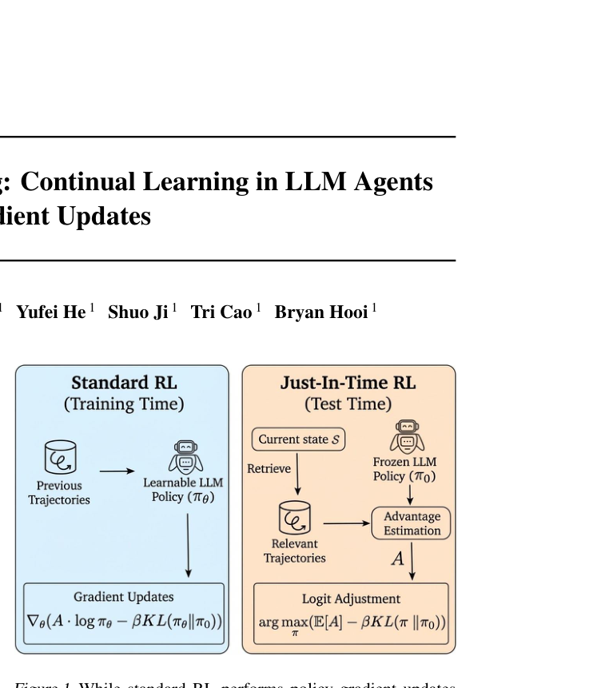
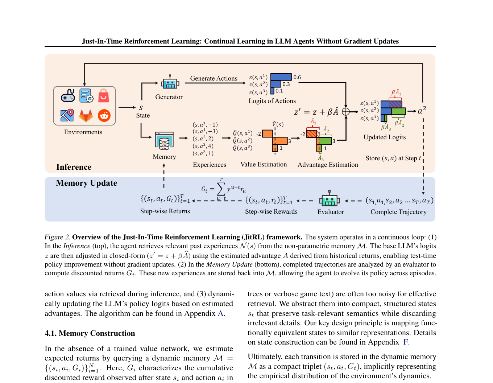

`jitrl | Just-In-Time Reinforcement Learning: Continual Learning in LLM Agents Without Gradient Updates | National University of Singapore（Bryan Hooi 组；与 EvoTest 同一谱系，含 Yufei He/Yibo Li/Tri Cao 等共同作者） | 2026-01（arXiv:2601.18510 v1，Preprint） | L1 免梯度·test-time 持续学习（也触 L2 记忆） | 相关性 High（PLAN 七大种子之一）`

> 【档位】deep 全档。基于下载的真实 PDF 正文（23 页，主体 §1–§6，附录 A–M）。三标注：【原文】直接来自论文 /【推断】我的有据判断 /【待核】拿不准的关键事实。

---

## ══ 第一层：一眼看懂 ══

- 🟦 **TL;DR**：【原文】LLM agent 部署后权重冻结、学不动；常规 RL 能学但又贵又会灾难性遗忘。JitRL 不动任何参数，而是给 agent 配一个**经验记忆库**（存 `<状态, 动作, 回报>` 三元组）。每次决策前，先**检索**和当前状态相似的历史轨迹，**当场估计**每个候选动作的"优势 A"（比平均好多少），然后把这个优势**直接加到 LLM 输出的 logits 上**（\(z' = z + β·Â\)）。论文证明这条"加法更新"恰好是"KL 约束下策略优化目标"的**精确闭式解**——所以等价于做了一步 RL，但零梯度。在 WebArena 和 Jericho 上刷到 training-free SOTA，甚至超过要花约 \$9900 训练的 WebRL，而自己只花 ~\$290（省 30× 以上）。

- **最巧的一步**：【原文+推断】把"检索来的优势估计 Â"映射到 **logit 加法** \(z'(s,a)=z(s,a)+β·Â(s,a)\)（Eq.10），并由 Theorem 4.1 证明它就是 \(argmax_π′ E[Â] − (1/β)·KL(π′‖π_θ)\) 的闭式解（即 \(π* ∝ π_θ·exp(βÂ)\)，softmax 后取对数即得加法式）。**抽掉这一步**——若改成把检索到的经验塞进 prompt（论文里的 "Prompt Update" 消融，Table 8）——性能就掉（Admin 52.31→49.46，Reddit 57.64→53.02）。【推断】因为 logit 调制是对输出分布的**确定性、O(1) 干预**，绕开了"长 context 里 LLM 注意不到/不遵循检索线索"这一 ICL 老毛病（§5.6 作者明说）。这正是"免梯度 RL"成立的命门：没有这个 RL↔logit 的等价桥，方法就退化成又一个 memory-prompt 技巧。

---

## ══ 第二层：为什么做（写透） ══

- **研究背景**：【原文】LLM agent 通才能力强，但"部署后权重冻结"使其无法在线持续适应（§1）。作者引 Hendrycks 等 2025 的 "AGI Score"：当前 AI 最欠缺的正是"持续学习新信息的能力"。把不会学的 agent 比作"没有在职培训的新员工"，反复犯同样的错。
- **解决的具体痛点**：现有两条路都不够——
  1. **常规 RL（梯度更新）**：需大量训练数据、算力贵、需频繁更新保持时效、且**灾难性遗忘**损害旧能力；He et al.(2025)（即 EvoTest）发现常规 RL 在持续适应设定下提升有限（§1）。
  2. **ICL / prompt 工程**（Reflexion、Voyager 类）：靠把过去经验写进 context，但**context 一长就崩**（agentic 任务交互序列很长，"lost in the middle"）；且 ICL 受限于"能用文字显式描述的东西"，缺 RL 那种"用 reward 优化、能掌握难以言说技能"的普适性（§1、§2）。
- **相关工作 & 各自不足**（§2）：
  - **梯度 RL（PPO/GRPO、Search-R1、ToolRL、WebRL）**：贵 + 静态模型，难抗分布漂移。
  - **训练自由的推理增强 / 外部记忆（MemGPT、Generative Agents、Voyager、Reflexion、A-mem）**：都是"检索文本→放进 context 做 ICL"。
  - **JitRL 的差异**：【原文】"不是检索文本做 ICL，而是把记忆当成一个**非参数策略分布**，直接在 logits 上做 soft update"——在不更新参数的前提下实现策略改进。
- **动机链**：现状（agent 不会在线学）→ RL 能学但贵+遗忘、ICL 便宜但弱+context 受限 → **能否用 RL 的形式（普适、reward 驱动）但避免梯度（省钱、不遗忘）?** → 把"策略改进"重写成"对冻结先验 \(π_θ\) 的后验调制"，用检索估的优势在 logit 空间做闭式更新（§1 末、§4）。【推断】"为什么不用更简单的现成做法"——更简单的就是把经验塞 prompt（ICL），但 Table 8 消融证明它更弱，逻辑链因此闭合。
- **与最近邻工作的 Δ**：
  - **vs AWM（Agent Workflow Memory，ICML'25）**：AWM 把成功轨迹抽成"可复用 workflow"存起来、再注入 prompt；JitRL 不抽 workflow，而是把回报统计直接转成 logit 偏置——**关键差异：改的是输出分布而非输入 context**。【推断】这让 JitRL 不依赖 LLM "读懂并遵守" workflow 文本。
  - **vs EvoTest（同组，作为 baseline）**：EvoTest 演化式地重写 prompt + 调超参 + 更新 memory，是"配置层面"的 test-time 学习；JitRL 是"输出分布层面"的最小、可证明干预。【推断依据：§5.1 把 EvoTest 列为 training-free baseline，JitRL 在 Table1/3/4 全面超过它】。
  - **vs Reflexion**：Reflexion 生成文字自反思塞回 prompt，易受"reflection noise"（§5.2.1 明说 Map 站点上 Reflexion 因误导反馈掉分）；JitRL 用数值优势、确定性调 logit，更稳。

---

## ══ 第三层：怎么做 + 靠不靠谱 ══

- **方法流水线**（§4，配 Figure 2，三大模块 + 一个循环）：
  1. **经验记忆构建（离线/回合末写入）**：每个 episode 结束，**LLM-Evaluator** 给整条轨迹打**反思式 step-wise reward** \(E: τ→{r_t}\)（缓解长程信用分配）；聚合成折扣回报 \(G_t=Σ_{u≥t} γ^{u−t} r_u\)（Eq.3）。原始状态（完整 HTML DOM / 冗长游戏文本）太噪，**抽象成紧凑结构化状态 s_t**（原则：功能等价的状态映射到相似表示，细节在 Appendix F）。每个转移以三元组 \((s_t, a_t, G_t)\) 存入非参数记忆 M（隐式表示环境经验分布）。
  2. **test-time 价值估计（在线 per-step）**：把当前观测抽成结构化 state s，检索 top-k 相似邻居 N(s)。状态值 \(V̂(s)=mean_{i∈N(s)} G_i\)（Eq.4）；动作值分两种：**已见动作** \(Q̂(s,a)=mean over N(s,a) G_j\)（Eq.5）；**未见动作** 走"乐观面对不确定性"——以概率 \(λ\) 给乐观值 \(Q̂=V̂(s)+α/|N(s)|\)（Eq.6，邻居越少 bonus 越大→鼓励探索，经验累积后 bonus 自然衰减转向利用），以 \(1−λ\) 给 0（防过度探索）。优势 \(Â(s,a)=Q̂(s,a)−V̂(s)\)（Eq.7）。
  3. **策略更新（在线 per-step，零梯度）**：解 \(π*=argmax E_{a∼π′}[Â] − (1/β)KL(π′‖π_θ)\)（Eq.8）→ 闭式 \(π*∝π_θ·exp(βÂ)\)（Eq.9）→ 映到 logit 空间得加法式 \(z'(s,a)=z(s,a)+β·Â(s,a)\)（Eq.10），softmax 回去即最优策略。
  4. **循环**：完成的新轨迹再回写 M，跨 episode 持续进化（Figure 2 底部）。
- **逐组件必要性**：
  - **Logit Update（核心）**：有消融（Table 8 vs Prompt Update）→ 证明增益来自"调 logit"而非仅"检索信息"。
  - **反思式 step-wise reward**：【推断】负责长程信用分配；**论文未给"去掉 reflective reward 改用稀疏终局 reward"的单独消融**——这是一个未被隔离验证的组件（标出）。
  - **乐观探索 bonus（Eq.6 的 α、λ）**：机制上负责冷启动/未见动作探索；【待核】正文未见对 α、λ、γ 的敏感性消融（可能在 Appendix H/K，正文未展开）。
  - **检索邻居数 k**：有消融（Figure 4），\(k∈[8,14]\) 稳健，过小高方差、过大引噪。
  - **状态抽象**：作者称更多消融见 Appendix K（正文未给数字）。
- **关键机制/公式（直觉）**：\(exp(βÂ)\) 把"优势大的动作"指数级放大概率、KL 项把分布拉回原模型保住语言连贯；β 是温度，控制"听经验"还是"听原模型"。直觉上等于：原模型先给个先验意见，记忆库说"按历史看动作 a 比平均好 Â"，于是按 \(\exp(βÂ)\) 重新加权——一步贝叶斯式后验修正，且**有闭式解所以零迭代、O(1)**。
- **实验与证据**（§5）：
  - **环境**：WebArena（真实网页导航，5 站点 Admin/GitLab/Map/Reddit/Shopping）+ Jericho（文字冒险游戏 Library/Zork1/Zork3）。协议：每任务连续跑 L=5（WebArena）/50（Jericho）回合，模拟"边用边学"。指标 Avg（学习效率）+ Final（收敛能力），Final−Avg 大=学习曲线陡。
  - **支撑核心主张的关键实验**：(a) **Table 1**（WebArena training-free 对比）JitRL 微平均 Avg 46.98 / Final 51.35，全面超 Static(35.63/36.30)、Memory、Reflexion、AWM、EvoTest；Shopping 较 Static +73.2%。(b) **Table 2**（vs 权重更新法，WebArena-Lite 留出集）JitRL Final **60.00** > WebRL **46.06** > SFT 23.0——**纯推理时优化反超昂贵训练法**，这是最硬的卖点。(c) **Table 3**（Jericho）三游戏全 SOTA，且超过逐游戏 GRPO 训练的 Qwen3-32B（如 Zork1 Final 69 vs GRPO 10）。(d) **Table 9**（成本）JitRL ~\$290 vs WebRL ~\$9900（H200 训练成本估算），>30× 省。(e) **泛化**：Table 4 跨 backbone（Gemini-2.5-flash / GPT-5-mini / DeepSeek-V3.2）均 SOTA；Table 5 冷启动跨任务（只检索 disjoint 任务记忆）仍超 baseline。(f) **定性**：Table 7 展示 logit 如何被纠正（如 "Catalog" 0.90→0.40、"Marketing" 0.70→1.40，纠正语义先验）。
  - **baseline 公平吗**：【推断】training-free baseline 全用同一 Gemini-2.5-flash backbone（§5.1），公平；与权重更新法比时作者在 Appendix I 额外做了"统一 base model + 训练配置"的受控对比（正文 Table 2 的 WebRL 用 Llama-3.1-70B，base 不同，作者已意识到并补附录）——这点处理得较诚实。
  - **"看着强但没答核心问题"的隐患**：【推断】所有数据集都是**轨迹高度可复用**的环境（同站点重复任务、同游戏重复跑），JitRL 增益"在 Shopping 等结构化域最明显"恰因"轨迹复用率高"（§5.2.1 作者自陈）——在轨迹复用率低、状态难抽象成"功能等价"表示的开放域，方法收益可能大打折扣（见下"失效边界"）。
- **假设与失效边界**：
  - 【原文】依赖**结构化状态抽象**"把功能等价状态映射到相似表示"（§4.1）——【推断】这是隐含强假设：状态空间需可被检索相似度有意义地组织；DOM/游戏文本能做到，自由形式长程任务未必。
  - 【原文+推断】依赖能拿到**候选动作的 logits/置信度**：黑盒模型不暴露 log-prob 时，作者退而用"verbalized logit"（让模型输出 0–100 置信分再转 logit，§5.1）——【推断】这是工程妥协，verbalized 置信的校准质量直接影响更新质量，论文未量化二者差距。
  - 【原文】动作被**离散化为 k 个候选**（token-level：让模型输出索引 token 1/2/…）——【推断】对开放式自然语言动作空间不直接适用，需先有候选生成器收口。
  - 【推断】记忆**只增不删**（正文未提遗忘/淘汰机制），长跑下 M 膨胀、检索成本与噪声上升是潜在隐患（防遗忘见 6 轴）。
- **祛魅总结**：
  - **真贡献（硬货）**：① 把"检索式优势估计 → KL 约束策略优化 → logit 加法"串成**有闭式解、带收敛性证明（Thm 4.1/4.2/4.3）的免梯度 RL**，理论干净；② Table 2/3 实打实超过昂贵的 WebRL/GRPO 且省 30×，是强结果；③ Table 8 用对照消融排除了"只是检索信息有用"的平凡解释。
  - **包装/可能高估**【推断】：(a) "outperforms fine-tuning" 成立但仅在**轨迹可复用**的两个 benchmark，泛化到低复用开放域是 open question；(b) 收敛性定理（Thm 4.2/4.3）建立在 Appendix C 的一组假设上（如邻域估计一致性），在非平稳、状态抽象有损的真实环境里"收敛到最优"更多是渐近理想而非实测保证；(c) "training-free" 仍需一个 LLM-Evaluator 在线打 step-wise reward + 多次候选评估，**API 调用量不小**（成本表 \$290 已含，但延迟/调用次数正文未细究）。

---

## ══ 结构化抽取 ══

### 🎯 机制速览 6 轴
| 维度 | 内容 |
|---|---|
| **学什么信号** | 环境/任务的**回报**（episode 末由 LLM-Evaluator 反思式打 step-wise reward → 折扣回报 G_t），存为 `<s,a,G>`；本质是"经验库的数值优势" |
| **改什么** | **输出 logits**（\(z'=z+β·Â\)）——不改参数、不改 prompt、不改记忆结构本身；同时**写记忆库**（新轨迹回灌 M） |
| **何时改** | **在线 per-step**（每步决策前检索+调 logit）+ **per-episode**（回合末写记忆、更新经验分布）——双频 |
| **免梯度?** | **是**（纯训练自由；零梯度、零参数更新；理论上等价于一步 KL 约束 RL 的闭式解） |
| **记忆-技能生命周期** | 写入：回合末把 `(s,a,G)` 存入非参数记忆 M；检索：per-step top-k 相似邻居 N(s)；遗忘/淘汰：**无显式遗忘机制（只增不删）**【原文未提淘汰】；共享：跨 episode + **跨任务**复用（Table 5/6，cross-task 占检索约 47%） |
| **防遗忘机制** | **隔离式（天然免遗忘）**：因不动权重，旧能力不被覆盖→无灾难性遗忘（作者立论卖点）；但记忆库本身无防漂移/防污染机制【推断：错误经验会被一并检索，靠 KL 项与 Â 平均部分稀释】 |

### ⑦ 开源代码 + 框架/harness
- 【原文】代码：**https://github.com/liushiliushi/JitRL** （NUS；摘要与 §1 均给出此链接）。
- 框架/harness：【推断】自研轻量推理时框架，非训练框架（无 veRL/TRL/OpenRLHF 之需，因零梯度）。运行依赖：WebArena & Jericho 两个 agent 环境 + 一个 LLM backbone（Gemini-2.5-flash / GPT-5-mini / DeepSeek-V3.2）+ LLM-Evaluator。**本次未 clone 仓库**（P4 深读子代理仅核 PDF；如需框架细节请手动 clone 该 repo，PLAN 不强制 clone）。〔待核：repo 实际依赖/星标/是否含 WebArena 适配代码——未访问仓库，未核实〕

### 💰 资源/成本与可扩展性
- 【原文】Table 9：JitRL 总成本 ~**\$290**（按 API 价计），对照 WebRL ~**\$9900**（H200 训练成本估算），**省 >30×**；与其他 training-free（Static \$200 / Memory \$230 / Reflexion \$220 / AWM \$250 / EvoTest \$220）同量级。
- 【推断】算力：无 GPU 训练需求；主要成本=API 调用（每步对 k 候选估值 + 回合末 Evaluator 反思打分）。延迟：per-step 多一次检索 + 候选评估，正文未给延迟数字〔待核〕。可扩展性瓶颈在记忆库随回合线性增长（检索成本/噪声）。

### 🎯 对"探索-巩固"idea 对标
- **强支撑 + 几乎是"在线探索期"的直接实例**：JitRL = 用户 idea 里"在线、免梯度、logit 调制做探索"的近乎教科书实现（PLAN §10 明把它列为 `explore_consolidate` 的"在线 logit 调制"邻居）。
  - **可借组件**：① \(z'=z+β·Â\) 的**闭式 logit 调制 + Thm 4.1 的 KL 约束最优性证明**——可直接作为"探索期在线干预"的理论骨架；② Eq.6 的**乐观 bonus \(α/|N(s)|\)**（不确定性驱动探索、随经验衰减）可做探索调度器；③ 反思式 step-wise reward 做长程信用分配。
  - **缺口（正是"探索-巩固"要补的）**：JitRL **只有探索期、没有巩固期**——记忆只增不删、无几何共识/参数融合/防漂移，知识永远停在"外挂经验库"层面，**从不内化进权重**。这恰好留出"巩固期"的位置：把 JitRL 在线积累的高价值 logit 调制/经验，离线蒸馏/几何共识地固化进参数（即 Agent-Dice 式离线期）。【推断】因此 JitRL 与"探索-巩固"是**互补而非竞品**：它把"探索半边"做到了可证明最优，但"巩固半边"完全空缺。

### 🔭 开放问题 / 未来方向
- 【原文】作者结论未展开 future work（§6 仅总结）；隐含开放点见正文：黑盒模型 logit 不可得时的 verbalized 近似质量、状态抽象的通用性。
- 【推断】① **记忆遗忘/淘汰与防污染**：长跑下如何剔除过时/错误经验（当前只增不删）。② **从"外挂经验"到"内化权重"的巩固桥**：何时、如何把稳定的 logit 调制固化进参数而不引发遗忘——正是与"探索-巩固"巩固期的结合点。③ **开放动作空间**：摆脱"k 个离散候选 + 索引 token"的约束。④ 收敛性定理假设（Appendix C）在强非平稳/有损状态抽象下的实际成立程度。

### 🖼 关键图 top-2

- 这是**原文 Figure 1**。左边"Standard RL"在训练时用历史轨迹做策略梯度更新（动 \(π_θ\) 参数）；右边"Just-In-Time RL"在测试时对**冻结** \(π_θ\) 检索相关轨迹估优势 \(A\)，再用 KL 正则目标**调 logit**。**选它**：一张图说清全文立意——"用 RL 的形式、却不动梯度"，把方法的定位（免梯度 test-time RL）一眼立住，是理解"探索期 logit 调制"范式的最佳缩略图。

- 这是**原文 Figure 2**（方法主图/pipeline）。上半"Inference"：当前状态 s → 从记忆 M 检索邻居 → 估 Q̂/V̂ → 优势 Â → \(z'=z+β·Â\) 更新 logits → 出动作；下半"Memory Update"：完成轨迹 → Evaluator 算 step-wise reward → 折扣回报 G_t → 三元组 `(s,a,G)` 存回 M。**选它**：完整呈现"在线 per-step 调 logit + per-episode 写记忆"的双频闭环，是抽取 6 轴（学什么信号/改什么/何时改/生命周期）的唯一依据图，信息密度最高。
