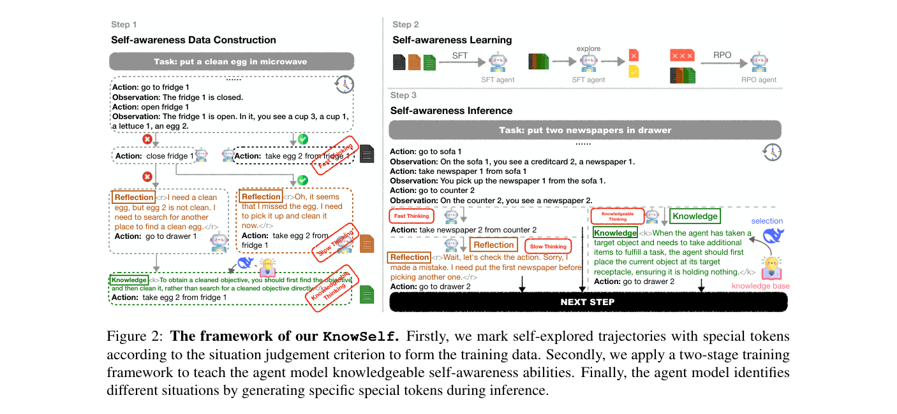
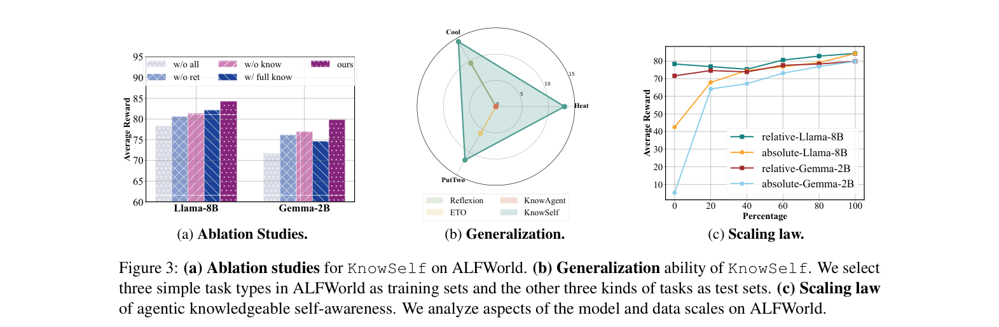

`knowself | KnowSelf: Agentic Knowledgeable Self-awareness | 浙江大学 + 阿里巴巴（Shuofei Qiao, Ningyu Zhang, Huajun Chen 等；ZJUNLP 谱系） | 2025-04 arXiv:2504.03553v2(29 May 2025) · 预印本(ACL'25 系投稿风格) | 主题线 = 元认知自感知 / 选择性反思-取知识的 self-evolving agent（训练侧·参数级）· 高相关`

> 三标注约定:【原文】=论文直述;【推断】=有据判断(附依据);【待核】=拿不准的关键事实。

══ 第一层:一眼看懂 ══

- 🟦 **TL;DR**:让 agent 学会**"看情况办事"**——遇到每一步,自己判断属于三种情形哪种:**Fast thinking**(一眼会做,直接给动作)/**Slow thinking**(得多想一下、需要自我反思才对)/**Knowledgeable thinking**(自己不会,得调外部知识)。做法是**数据驱动**:先让 agent 在环境里自探索,用一个**启发式判据**(直接预测的动作对不对、重想后对不对)把轨迹的每一步打上情形标签,并插入**特殊 token**(`Reflection<r>…</r>` 或 `Knowledge<k>…</k>`)。再**两阶段训练**(先 SFT 学会基本模式,再用 \(RPO=DPO+\)长度归一化 NLL 强化判断力)。推理时 agent **自己生成这些特殊 token** 来表态"我现在该反思 / 该取知识 / 直接做",从而**用极少的反思和知识**(知识使用率仅 15%-26%)就拿到最优规划效果,省训练/推理成本。【原文 摘要+§3+§4】

- **最巧的一步**:**把"该不该反思/该不该取知识"这个元认知决策,显式编码成 agent 自己生成的特殊 token,并用一个三分类启发式判据自动造训练数据**。抽掉这一步(就是 ablation 的 `w/o all`,只保留 fast thinking、退化成在 gold 轨迹上普通 SFT),性能明显下降(Figure 3a:Llama-8B ~78 → KnowSelf ~84;Gemma-2B 更明显)。它把"无差别灌知识(flood irrigation)"换成"按需、自感知地取用",这是全文立意与涨点的根。【原文 Figure 3a, §1】

══ 第二层:为什么做 ══

- **研究背景**:LLM agent 规划三大学法——①直接轨迹模仿 ②试错精修(Reflexion/ETO)③知识增强规划(ExpeL/KnowAgent/WKM)。但当前 agent 学习更像**"无意识的 pattern-fitting"**:把显式规划轨迹无差别喂进去,模型对推理时的意外信号很脆,容易 pattern collapse。而人类决策靠**情境自感知(situational self-awareness)**——知道何时靠自己、何时该反思、何时该查资料。当前 agent 缺这个元认知。【原文 §1, §2】

- **解决的具体痛点**(很具体):
  1. **"漫灌"策略浪费且有害**:外部反馈/知识被无差别注入,不顾 agent 真实需要;过度试错和盲目灌知识在实际中**不可行且大幅抬高推理成本**。【原文 §1】
  2. **弱模型被知识反噬**:实测 Gemma-2B 上 ExpeL(100% 灌知识)甚至**不如裸 REACT**;`w/ full know`(每步都灌知识)在 Gemma-2B 上还**不如只反思**——证明"不是所有知识都有用,过量知识对弱模型有害"。【原文 §4.2, Figure 3a】
  3. **直接训轨迹→过拟合 pattern、泛化差**:OOD 测试里 ETO 仅在 PutTwo 拿 5.88%、其余 0%,KnowAgent 三任务全 0——典型 pattern-matching 过拟合。【原文 Figure 3b】

- **相关工作 & 各自不足**:
  - *轨迹模仿线*(FireAct/AgentTuning)——纯死记硬背,脆。
  - *试错线*(Reflexion 多次重试、ETO 探索-利用)——Reflexion 本质 hit@5;不会"判断何时该反思"。
  - *知识增强线*(ExpeL 经验 insight、KnowAgent action-knowledge、WKM world-knowledge-model)——**强行灌知识,忽略 agent 自身的 awareness**;100% 知识率。
  - *LLM 自感知/知识边界线*(Berglund/Laine/Binder 等)——关注**静态事实知识**的"知道自己不知道";本文明确区分:聚焦**动态环境中的情境自感知**,而非静态事实边界。作者自称是**首个提出 agentic self-awareness 问题**的工作。【原文 §2, §6】

- **动机链**:agent 要稳健规划 → 但无差别灌轨迹/知识=漫灌,既贵又害(弱模型被知识反噬、训轨迹过拟合 pattern)→ 人类靠情境自感知按需调用反思/知识 → 所以给 agent 一个"判断当前该 fast/slow/knowledgeable"的元认知 → 用启发式判据(预测动作对错×重想对错)自动给轨迹打三类标签 + 特殊 token → SFT 教会基本模式,但正确动作空间窄、SFT 不够稳/不够强 → 再用 RPO(DPO 偏好 + 长度归一 NLL 稳训)强化判断 → 推理时 agent 自生成特殊 token 自我表态。为什么不直接 prompt 现成强模型?因为实测 **O1/DeepSeek-R1 仅靠 prompt 学不会这种 agentic self-awareness**(Figure 5 案例:O1 乱调知识致错、R1 死信自己重想仍错),必须在数据/训练层面做。【原文 §1, §3, Figure 5】

- **与最近邻 WKM / 慢思考工作的 Δ**:
  - vs **WKM(同团队 World-Knowledge-Model)**:WKM 总在每步用知识模型提供全局/局部知识(\(Know\%=100\%\));KnowSelf **只在"自己判断不会"时才取知识**(\(Know\%≈15\text{-}26\%\)),且把决策权交给 agent 自身而非外挂知识模型。结果用更少知识反超 WKM(Table 2)。
  - vs **fast/slow thinking 范式(System-1/2)**:别人只分快/慢两档;KnowSelf **第三档引入"外部知识"**进 thinking system——承认"有些步骤不是想不想得到的问题,而是根本缺知识"。为什么有用:消融显示"只反思(w/o know)在多数情形反而优于只灌知识(w/o ret)",说明很多错是 pattern 约束(反思能解)、少数才真缺知识(才需取知识),两者必须分流。【原文 §2, §4.2, Figure 3a】

══ 第三层:怎么做 + 靠不靠谱 ══

- **方法流水线**(输入 gold (历史,动作) 对 → 输出一个会"自感知分流"的 agent):
  1. **知识系统构建(轻量、离线)**:沿用并打磨 Chen et al.(2024)的简单方法,用极少轨迹离线建一个知识库 K + 一个**知识选择模块 R**(按历史 ht 检索最合适的一条知识)。"知识"可以是符号/参数化/网搜等多种形态。【原文 §3.1】
  2. **情境判据 C(核心)**:给定历史 \(h_t\)、gold 动作 \(a\)、agent 直接预测 \(a_p\)、重想后 \(a_r\)。**Fast**: \(a_p=a\)(直接对);**Slow**: \(a_p≠a\) 但 \(a_r=a\)(重想后对);**Knowledgeable**: \(a_p,a_r\) 都\(≠a\)(重想还错→缺知识)。【原文 §3.2】
  3. **数据构造**:按 C 给输出加料——Fast: \(y=a\);Slow: \(y=[a_p,\) Reflection`<r>`ret`</r>`\(, a]\)(ret=重想的 CoT);Knowledgeable: \(y=[\)Knowledge`<k>`know`</k>`\(, a]\)(\(know=R\) 选的知识)。遍历所有对得到自感知数据 \(D_{self}\)。【原文 §3.3, Table 1】
  4. **两阶段训练**:① **SFT**(自回归 loss,得参考模型 \(π_{ref}\));② 让 \(π_{ref}\) 在 \(D_{self}\) 上探索、收集错动作做负样本组成 \(D_{pair}\),用 **RPO loss = DPO + \(α·\)长度归一 NLL**(Pang et al. 2024;因正确动作空间窄,重引 SFT 项稳训)。训练时**扩词表**以容纳新特殊 token。【原文 §3.3, 式4-7】
  5. **自感知推理**:agent 第一步后若停→直接用预测动作进历史;若生成 `Reflection`→继续反思再落动作;若生成 `Knowledge`→用 R 取一条知识拼进上下文再续。【原文 §3.3】

- **逐组件必要性**(消融 Figure 3a,做得较全):
  - *反思能力 (`w/o ret` = 去掉反思只留知识)*:✔有消融,去掉变差;且"只反思 w/o know"普遍优于"只知识 w/o ret"。
  - *知识能力 (`w/o know` = 只反思)*:✔有消融,完整 KnowSelf 仍优于只反思。
  - *自感知整体 (`w/o all` = 只 fast、退化普通 SFT)*:✔最低,证明分流机制本身的价值。
  - *按需 vs 全量知识 (`w/ full know` Know%=100%)*:✔完整 KnowSelf 用 15-26% 知识就超过 100% 灌知识,Gemma 上 full-know 甚至低于只反思——按需机制被实锤。
  - *RPO 第二阶段 vs 只 SFT*:**正文未在主表单列"只SFT vs SFT+RPO"的消融**,只在 Appendix H 提到"分析不同训练策略";主结论里 RPO 的独立增益**需查附录**【待核:Appendix H 的训练策略对比具体数字未在正文给出】。
  - *知识检索器 R 的选择*:✔Appendix I 有不同 retriever 的分析(正文未展开)。

- **关键机制直觉**(这篇有少见的"机制解剖"):
  - **RPO 为何要加长度归一 NLL**:正确动作空间很窄(就那么几个对的 action),纯 DPO 偏好信号稀疏易塌,补一个按长度归一的 SFT 项把"正确输出"锚住,稳住训练。直觉="既要拉开对错偏好,又别让模型忘了正确长什么样"。【原文 式6-7】
  - **自感知"在哪一层产生"**(Figure 4,很有意思):统计每层 Transformer 上 `Knowledge`/`Reflection`/`Action` token 的平均概率——发现**"要不要调知识"的决策出现在最后几层**(Knowledge 与 Action token 都在末层才浮现),且"决定调知识"比"直接动作"出现得更晚。直觉=模型像在末层做一场"token 空间里的博弈搜索",由训练学到的隐式 reward 引导最终决策。这是把"元认知决策"定位到具体层的难得证据。【原文 §5, Figure 4】
  - **40% 是 emergent 阈值**(Figure 3c 标度律):当自感知数据**相对占比低于 40%** 时性能波动甚至下降,超过 40% 才稳定显现自感知能力——作者推测这像一种 emergent 现象。【原文 §5, Figure 3c】

- **实验与证据**:
  - 数据集/设置:**ALFWorld**(家务,reward 0/1)+ **WebShop**(网购,dense reward 0-1),统一用 **Average Reward**。gold 轨迹来自 **AgentBank**。模型:**Gemma-2-2B-it** 和 **Llama-3.1-8B-Instruct**(开源小模型);**GPT-4o** 作上界。Baselines:REACT / Reflexion / ETO / ExpeL / KnowAgent / WKM。引入 **Know%**(被知识增强的动作占比)度量"省知识"。【原文 §4.1】
  - **支撑核心主张的关键实验**:Table 2(ALFWorld)——KnowSelf 在 Llama-8B 用 **Know%=15.01%** 达 All=84.33,**超过 GPT-4o 的 ExpeL(79.85)**;Gemma-2B 用 26.41% 达 79.85,**追平 GPT-4o 的 REACT(76.12)**。Table 3(WebShop)同样领先无知识 baseline。核心说服点:**用最少知识反超 100% 灌知识的方法**。【原文 Table 2/3, §4.2】
  - **最有说服力的一组**:Figure 3a(消融)+ 3b(泛化)。3a 量化"按需知识 > 全量知识"(尤其弱模型);3b 用三训三测的 OOD 设置显示 KnowSelf 在 Heat/Cool/PutTwo 上**全面跑赢、不像 ETO/KnowAgent 那样过拟合塌成 0**——直接支撑"打破 pattern-matching、获得跨任务情境自感知"的主张。【原文 Figure 3a/3b】
  - *baseline 公平性*:prompt-based 统一 two-shot,fine-tuning baseline 统一全参训练、同 gold 数据(连 WKM 都用同训练集重训),较公平。【原文 §4.1, Appendix F】
  - *"看着强但没回答核心"的隐患*:① 仅 2 个**模拟**规划环境 + 仅 2B/7B 小模型(作者自承没测 30B/70B、没测 function-calling/code);② GPT-4o 当"上界"但其 Reflexion 是 hit@5(允许试 5 次),与 KnowSelf 单趟不完全可比,作者用这点反衬自己"Llama-8B≈GPT-4o-Reflexion"略取巧;③ Figure 4 的"末层决策"是统计平均的相关性观察,非因果干预(没做 patching/ablation 验证),解释偏 narrative。【推断:依据=Limitations + §4.2 + Figure 4 仅概率统计】

- **假设与失效边界**:
  - 【原文】判据 C **依赖 gold 动作 a 可得**(要判断 ap/ar 对不对);没有 gold 监督的开放任务里这个三分类造数据流程跑不动。
  - 【原文·Limitations】只在 **2 个模拟数据集 + 小模型(2B/7B)**验证,大模型与 function-calling/code/多模态 未测。
  - 【原文·Limitations】方法是**数据驱动**;作者明说"终极方案可能需要换训练视角(如 RL)或换模型架构"——即承认当前 SFT+RPO 范式可能不是最优。
  - 【推断】知识库 K 与选择模块 R 是离线、轻量构建,知识质量/覆盖度直接决定 Knowledgeable-thinking 档的上限;若 R 选错知识(Figure 5a 中 O1 的失败就是"调了不该调的知识致错"),自感知 token 触发了也无益。依据=§3.1 知识系统简单 + Figure 5a 反例。
  - 【推断】特殊 token + 扩词表的方案与具体 tokenizer/模型绑定,迁移到其他模型族需重训、重扩词表;泛化只在 ALFWorld 内部 OOD 验证,跨 benchmark 迁移未测。依据=式7 扩词表 + Figure 3b 仅 ALFWorld 内。

- **祛魅总结**:
  - **真贡献(硬货)**:(a)**首次把"agent 该不该反思/取知识"形式化为三档情境 + 自生成特殊 token 的元认知决策**,并给出可自动标注的启发式判据;(b)**"按需知识(15-26%)反超 100% 灌知识、且弱模型会被过量知识反噬"**是有用且反直觉的实证;(c)Figure 4"自感知决策定位到末层"+ Figure 3c"40% 数据 emergent 阈值"是少见的机制性观察。
  - **包装/可能高估**:"self-awareness/self-consciousness"措辞偏哲学化(Limitations 自己也承认学界无定义、是把双刃剑),实际就是一个**学出来的三分类门控**;"agentic self-awareness"的宏大叙事 > 技术实质(SFT+DPO 变体 + 特殊 token)。Figure 4 的"博弈搜索""隐式 reward"解释是 narrative，非因果证据。【推断:依据=Limitations + Figure 4 方法】
  - **可能低估**:RPO 第二阶段对"窄正确动作空间"的稳训处理(长度归一 NLL)是个实用小技巧,正文没充分强调其必要性消融(挪到 Appendix H),其实对复现很关键。【推断】

══ 结构化抽取 ══

- 🎯 **机制速览 6 轴**:

| 学什么信号 | 改什么 | 何时改 | 免梯度? | 记忆-技能生命周期 | 防遗忘机制 |
|---|---|---|---|---|---|
| **环境/gold 监督信号**(用 gold 动作判 ap/ar 对错来三分类情境)+ 自探索轨迹 + 自反思(Slow 档的 rethink CoT)+ **外部知识库**(Knowledgeable 档) | **参数**(全参 SFT + RPO 微调 agent,扩词表加特殊 token);推理时**额外改上下文**(注入检索到的知识)+ 改**输出结构**(自生成 `<r>`/`<k>` 控制流) | **离线批量**训练(两阶段);训练数据来自 **per-step** 情境判定;推理时 per-step 由 agent 自决 fast/slow/knowledgeable | **否(梯度训练为主)**:SFT+RPO 都是梯度法;运行时的"取知识"是免梯度上下文注入,但能力本身固化在参数 | 知识库 K **离线轻量构建** → 推理时由选择模块 R 按历史**检索** top-1 注入 → **无遗忘/无在线更新**(K 静态);自感知能力一次性蒸馏进参数;未涉及跨 agent 共享 | **无 / 不适用**(单次离线训练,非持续学习;知识库静态不淘汰。作者把"换 RL/换架构"列为未来,未处理灾难性遗忘)【原文 §3, Limitations】 |

- ⑦ **开源代码 + 框架/harness**:**已开源** https://github.com/zjunlp/KnowSelf 【原文 §1 脚注1,已 `git ls-remote` 核验 HEAD=397da47 可达】。训练 harness:**全参数微调 + DeepSpeed**(Rasley 2020)+ **AdamW**;推理用 **vLLM** 加速(Llama-8B);8×A800-80G。RPO/DPO loss 为**自实现**(RPO=Iterative RPO,Pang et al. 2024 的 DPO+NLL 变体)。**未具名 TRL / LLaMA-Factory / veRL / OpenRLHF 等框架**(正文/附录G 只点名 DeepSpeed 与 vLLM)。〔待核:仓库内是否实际基于 LLaMA-Factory 等高层框架——正文未提,需查 repo 文件级〕【原文 §4.1, Appendix G】

- 💰 **资源/成本与可扩展性**:训练成本中等——全参微调 2B/7B,8×A800,两阶段(Stage-I 3 epoch lr2e-5 bs8;Stage-II 1 epoch lr5e-7 bs3)。**核心卖点就是省推理成本**:\(Know\%≈15\text{-}26\%\)(对比 baseline 的 0% 或 100%),即只在少数步触发反思/取知识,显著降低反思与知识注入的 token 开销和延迟;且**用 2B/7B 小模型逼近 GPT-4o**,部署成本低。知识库离线轻量(极少轨迹即可建)。【原文 §4.2, Appendix G】

- 🎯 **对"探索-巩固"idea 对标**:**支撑 + 强可借组件 + 一处直接同构**。
  - **支撑**:它是"探索(自探索轨迹 + 重想)→巩固(把'何时该反思/取知识'的元认知固化进参数)"的训练侧实例;且核心思想就是**不要无差别灌、要按需在关键步介入**——与本项目"**单点接管 / 在关键步 path-recovery**"的理念高度一致。
  - **强可借组件**:① **三档情境判据 C(直接对/重想对/重想仍错)≈ 一个天然的"关键步难度分级器"**——可直接迁来给 TSRD 判定"哪一步需要 teacher 介入/path-recovery、哪一步放手"(对应"高熵/低置信关键步"的离散化版本);② **用特殊 token 把'控制流决策'交给模型自生成**——可作"path-selection/path-recovery 由模型自触发"的实现范式(而非外部规则强切);③ **RPO 的长度归一 NLL 稳训技巧**——在"正确动作空间窄"(=关键步候选少)时防偏好塌,可迁到 OPD/path-recovery 的偏好训练。
  - **直接同构(对 MTP-foresight 的旁证)**:它的"**先预测动作 ap,错了再 rethink 得 ar,仍错才取知识**"=一种**自我预测-纠偏的级联**,与 SAMULE 的 foresight、与本项目"**MTP 预测下一步、据预测可信度决定是否介入**"在"用一次前瞻预测来路由后续处理"上同构;区别是 KnowSelf 用"预测动作对不对"做离散三分类路由,本项目设想用 MTP 的连续置信度做更细的探针。
  - **缺口/区别**:KnowSelf 知识库静态、无在线巩固、无防遗忘;判据依赖 gold 动作(本项目无监督/弱监督场景需替换为 MTP 自一致性等代理信号);且它最终是 prompt+检索注入知识,**没把"取到的知识"沉淀回参数**——TSRD 若要"MTP foresight 定位关键步 + OPD 把纠偏蒸馏进参数"则需补这条巩固通道。【推断:依据=§3 方法 + Limitations + 项目 project_core_idea/TSRD/reusable_techniques】

- 🔭 **开放问题/未来方向**:
  - 【原文】扩展到 **RL 训练视角 / 新模型架构**(作者明说当前数据驱动可能非最优);扩到**大模型(30B/70B)、function-calling/code/多模态**;更完善的 self-awareness 定义与安全性(双刃剑)。
  - 【推断】把"自感知判据"从依赖 gold 动作改为**无监督代理信号**(如 MTP 自一致性/熵)以脱离标注;让知识库**在线更新/淘汰**支持持续学习;对 Figure 4 的"末层决策"做**因果干预**(activation patching)验证而非仅相关统计;把"取到的知识"巩固回参数以摆脱每步检索注入。依据=Limitations + Figure 4 仅相关性 + §3.1 静态知识库。

- 🖼 **关键图 top-2**:

  
  这是**原文 Figure 2**(方法主图,裁自 p3 顶部):左=Step1 用情境判据给自探索轨迹打 Fast/Slow/Knowledgeable 标签并插 `<r>`/`<k>`;中=Step2 两阶段学习(SFT→explore→RPO);右=Step3 推理时 agent 自生成特殊 token 触发反思或从知识库选取知识。选它因为一图贯通"怎么造数据→怎么训→推理怎么用"全闭环,是理解本文唯一必需的图。〔注:该裁图含图下方的 Figure 2 caption 文字〕

  
  这是**原文 Figure 3**(核心证据图,裁自 p6 顶部):(a)消融——完整 KnowSelf(ours,紫)显著高于 w/o all / w/o ret / w/o know / w/ full know,证明"按需 > 全量知识"且弱模型被过量知识反噬;(b)泛化雷达——KnowSelf 在 Heat/Cool/PutTwo 三个 OOD 任务上完整成三角,ETO/KnowAgent 几乎塌成原点,证明打破 pattern 过拟合;(c)标度律——性能随数据量上升、且 <40% 时波动(emergent 阈值)。选它因为这三幅一次性把"有效性+泛化+可扩展"三大主张都量化了。

──────────
**幂等状态**:本文 analysis 首次产出。机制类型 = 元认知情境自感知门控(参数级,SFT+RPO 两阶段训练;推理时 per-step 自生成特殊 token 路由 fast/slow/knowledgeable;免梯度地按需检索注入静态知识);非持续学习/无防遗忘。**已开源**(github.com/zjunlp/KnowSelf,已核验可达;harness=DeepSpeed 全参 FT + vLLM,RPO 自实现,未具名高层 RL 框架)。抽到 2 图:是(Figure 2 框架 + Figure 3 消融/泛化/标度律)。
