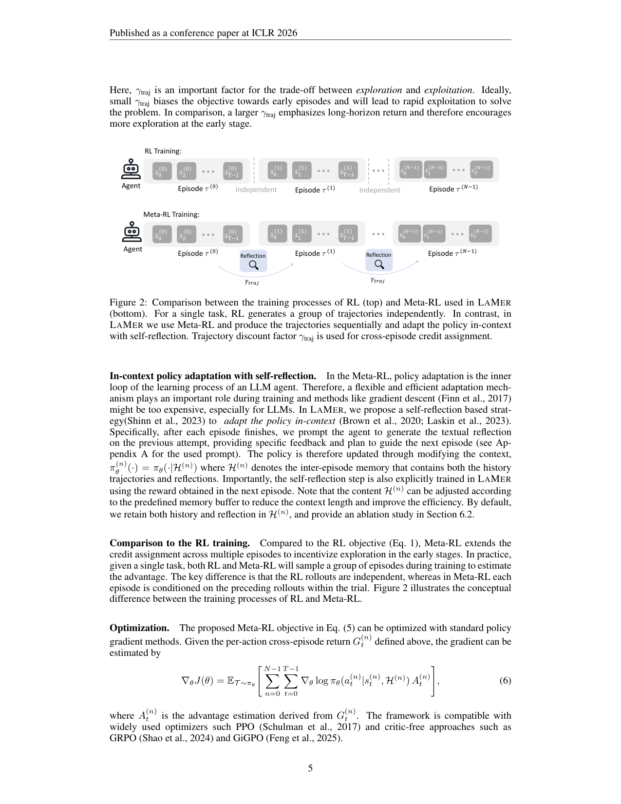
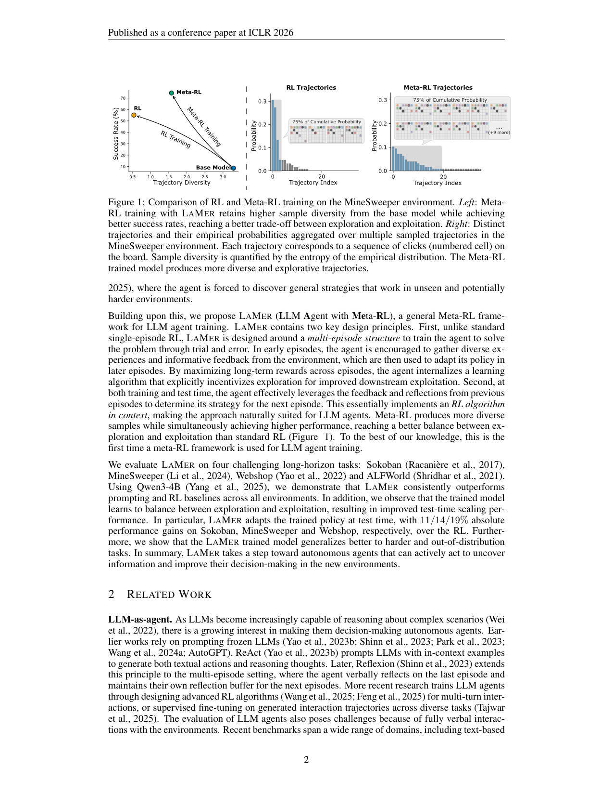

`lamer_metarl | LAMER: Meta-RL Induces Exploration in Language Agents | EPFL + ETH Zurich + Idiap(Yulun Jiang, Liangze Jiang;Maria Brbić/Michael Moor 组,mlbio-epfl) | ICLR 2026(camera-ready);arXiv:2512.16848v2 [cs.LG] 2026-03-08 | 主题线 L?(meta-RL 诱导探索 / test-time 反思适应)·相关性 High`

> deep 档笔记(由 light 升级:保留第一层/6轴/图/对标,补第二+三层)。基于已下载 PDF 正文(`resource/papers/lamer_metarl.pdf`,25 页)与渲染图。三标注:【原文】/【推断】/【待核】。

══ 第一层:一眼看懂 ══
- 🟦 **TL;DR**:RL 训出来的 LLM agent 在需要主动探索的多轮长任务里"不敢试错、过早收敛"。LAMER 用 **跨 episode 的 meta-RL** 训练:同一任务给 agent 多次 episode,**早期 episode 鼓励多样化探索、收集环境反馈,后期 episode 用前面经验(含自然语言反思)调整策略**;优化目标是跨 episode 长期回报,逼模型把"如何探索"内化成一个 in-context 学习算法。测试时同样靠**反思在 context 里调策略、不改梯度**。Qwen3-4B 上 Sokoban/MineSweeper/Webshop 相对 RL 分别 +11/14/19%,且对更难/未见任务泛化更好。【原文 Abstract/§1】
- **最巧的一步**:**多 episode 结构 + episode 间"自我反思"作为 inner-loop 适应**(in-context RL 算法)。抽掉"跨 episode 反思/历史传递",就退回单 episode RL——模型不会保留探索带来的多样性(Fig1 显示 RL 会塌缩样本多样性,meta-RL 保住),也学不到"先探后用"的策略。消融(Table 3)显示 self-reflection 贡献 Sokoban +21.6%,是关键组件。【原文 §4/§6 Table3】

══ 第二层:为什么做(写透,重点) ══
- **研究背景**:LLM 已从对话系统转向决策 agent,在多轮文本"观察-动作"环里需靠 turn 间记忆快速适应。**探索**是适应的核心(试不确定动作、获取新知、避免过早收敛到次优)。但与人类能系统探索、快速适应新环境不同,LLM agent **没有大量干预就不会稳健探索**(引 Krishnamurthy'24)。【原文 §1】
- **解决的具体痛点**:RL 训出的 LLM agent **学到固定策略,测试时不会主动探索/适应**。已有"引导测试时探索"的工作各有硬伤:Tajwar'25 离线蒸馏探索策略、Gandhi'24 从离线搜索 trace 诱导——**靠离线数据→只是模仿而非主动探索**;Setlur'25(e3)训 in-context 探索——但**聚焦单轮非 agentic 推理**。痛点=缺一个能在**多轮 agentic 环境里主动探索、从环境反馈适应**的训练框架。【原文 §1】
- **相关工作 & 各自不足**(三条线):
  · **LLM-as-agent**:早期靠 prompt 冻结 LLM(ReAct/Reflexion/Voyager/AutoGPT)——Reflexion 已把 verbal reflection 扩到多 episode 但**不训参数**;近期靠 RL(RAGEN/GiGPO)或 SFT 生成轨迹(Tajwar)——但是**单 episode RL,学固定策略**;
  · **Meta-RL**(RL²/Wang'16/MAML):"learn to RL",分 in-context inner-loop(RNN 式,RL²)和 gradient inner-loop(MAML)。**本文归 in-context 类**(用 LLM 的 ICL 能力,test 时不更新参数),区别于 MAML 的梯度 inner-loop(对 LLM 太贵);
  · **test-time compute**:Meta-RL 可看作"摊销 test-time compute"(用多 episode 训而非单 episode);Qu'25(MRT)也把 meta-RL 联系 test-time compute,但**只单轮数学推理,不用环境交互反馈**——这是 LAMER 最直接的对照(LAMER 是其多轮 agentic 版)。【原文 §2】
- **动机链**:现状=RL agent 不会探索、过早收敛 → 缺陷=单 episode RL 只优化即时回报,塌缩多样性(Fig1:RL 把 base 模型的高轨迹熵压没了);离线蒸馏只会模仿不会主动探索 → 既然多轮任务的成功信号往往一个 episode 后才稀疏出现,**就把 episode 当探索-利用单元,做跨 episode RL = meta-RL**:早 episode 鼓励多样探索收集反馈,后 episode 用经验(含反思)适应,优化跨 episode 长期回报 → inner-loop 适应不用梯度(对 LLM 太贵),**用 self-reflection 在 context 里改策略**。为什么不用 MAML 式梯度 inner-loop?太贵且不契合 LLM 的 ICL 本性。【原文 §1/§3/§4】
- **与最近邻工作的 Δ**:① 与 **Reflexion** 的 Δ:Reflexion 同样多 episode + verbal reflection,但**冻结参数、纯推理时用**;LAMER 把这个 reflection-adapt 循环**当 meta-RL 的 inner-loop 显式训练**(reflection step 本身用下个 episode 的 reward 训),让"如何探索"内化进参数(Δ=从"推理时反思"到"训练出会反思会探索的策略")。② 与 **Qu'25(MRT)** 的 Δ:MRT 把 meta-RL 用于单轮数学,无环境交互;LAMER 用于多轮 agentic 环境、每步都有环境反馈(Δ=单轮→多轮交互)。③ 与 **ORBIT(并发)** 的 Δ:二者同属"meta-RL 诱导探索";ORBIT 刻意**不加反思/记忆**(纯靠 context transcript),LAMER **显式加 self-reflection 作 inner-loop**且 Table3 证明反思贡献巨大——这是两条近邻路线的关键分歧点。【原文 §2/§4】

══ 第三层:怎么做 + 靠不靠谱 ══
- **方法流水线**(输入预训练 LLM + 任务分布 → 输出会探索-适应的策略):
  1. **跨 episode trial**:每个 trial = N=3 个顺序生成的 episode,T=(τ⁽⁰⁾,...,τ⁽ᴺ⁻¹⁾);若某 episode 成功则提前终止,否则从同一初始态开新 episode;
  2. **inner-loop 适应(self-reflection)**:每 episode 结束,prompt agent 对上一次尝试生成文本反思(具体反馈+下一步计划),策略通过改 context 更新 π⁽ⁿ⁾=πθ(·|H⁽ⁿ⁾),H⁽ⁿ⁾=inter-episode memory(历史轨迹+反思);**反思 step 本身用下个 episode 的 reward 训练**;
  3. **跨 episode 信用分配**:定义跨 episode 折扣回报 G⁽ⁿ⁾ₜ = 本 episode 内折扣回报 g⁽ⁿ⁾ₜ + Σ_{m>n} γ_traj^{m-n} g⁽ᵐ⁾₀,用 γ_traj 控探索强度;
  4. **outer-loop 优化**:meta 目标 J(θ)=E[G⁽⁰⁾₀],用标准 policy gradient,**兼容 PPO / GRPO / GiGPO**(默认 GiGPO,critic-free);
  5. **公平对比设置**:meta-RL 组大小 8、N=3;标准 RL 组大小 24(=8×3),保证每次梯度更新用相同轨迹数。【原文 §4/§5.1】
- **逐组件必要性 + 消融**:
  · **self-reflection(inner-loop)**:核心。Table3 消融三种 H⁽ⁿ⁾ 配置——"trajectory-only"(无反思)vs "reflection-only" vs "both"。反思带来 Sokoban +21.6%、MineSweeper +11.0%、Webshop +3.5%(reflection-only/both 对比 trajectory-only)。**反直觉发现**:reflection-only(56.4/80.5/92.8)竟**全面优于 both**(55.9/74.4/89.1)——作者推测纯反思更简洁聚焦、适应更有效。【原文 §6.2 Table3】
  · **多 episode 跨 episode 回报(meta-RL 本身)**:核心,对照基线就是各种单 episode RL(PPO/RLOO/GRPO/GiGPO),Table1 显示 LAMER pass@3 全面超出。
  · **γ_traj(探索强度旋钮)**:Fig5 消融——**最优值因环境而异**:Sokoban/Webshop 中间值(0.6)最好,MineSweeper 偏大(0.9)更好(需更长信用分配支持策略性探索)。证明 γ_traj 是有效旋钮但需调。【原文 §6.1 Fig5】
- **关键机制直觉**:跨 episode 折扣回报 G⁽ⁿ⁾ₜ 的精髓——把"未来 episode 的回报"也算进当前动作的回报里(用 γ_traj 折扣)。**γ_traj 小→偏重当前 episode→快速利用(少探索);γ_traj 大→偏重长期→鼓励早期多探索**(因为"现在探索-即使本局失败-换来后续 episode 高回报"也会被奖励)。这就把"何时探索 vs 利用"编码进策略:early episode 信息收集、later episode reward 最大化,这个"explore-then-exploit"切换本身就是一个 in-context RL 算法。self-reflection 是 inner-loop 的廉价实现——用语言而非梯度承载"从上次失败学到了什么"。【原文 §4】
- **实验与证据**:4 个长 horizon 环境(Sokoban 全可观测/MineSweeper、Webshop、ALFWorld 部分可观测),基模 **Qwen3-4B**(App D.1 另有 Llama3.1-8B-Instruct)。核心证据:① Table1 pass@3——Sokoban 55.9(GiGPO 44.1)、MineSweeper 74.4(+19%)、Webshop 89.1(+14%);**关键洞察**:MineSweeper/Webshop 上 LAMER 的 pass@1 略低于 GiGPO 但 pass@2/3 反超→证明"早期探索、后期适应"(test-time scaling 更强,pass@1→3 涨 13.5% vs baseline <5%);② Fig1/Fig3 轨迹多样性——base 熵最高但成功率低,RL 塌缩多样性,LAMER 保住更高多样性同时成功率高→直接支撑"更优 explore-exploit 平衡"主张;③ Fig4 harder 任务泛化——加 box/mine 难度,LAMER 全难度超 RL(最难时 Sokoban +10%、MineSweeper +5%);④ Table2 ALFWorld OOD——训 Pick/Look/Clean/Heat,测 Cool/Pick2:LAMER Cool +23%(58.1→81.0)、Pick2 +14%(36.0→50.2)。**baseline 公平性**:明确**匹配训练计算预算**(组大小 24 vs 8×3),其余超参全同——很公平。**"看着强但没回答核心问题"的风险**:无明显此类;test-time scaling 用 pass@k 衡量是恰当的。【原文 §5.2/§5.3/§5.4/Table1/2/Fig1/3/4】
- **假设与失效边界**:【原文】§7 limitation:① 需顺序采样 episode(依赖)→训练时间约 RL 的 2×(并行性差,可用 async rollout 缓解);② 只验证"从易环境泛化到同类/相似难环境",对完全异质新环境未验证。【推断】③ 核心假设="任务可组织成同源不同实例的多 episode 族 + 单 episode 有可反思的反馈信号";若任务一次性(不可重复)或反馈太稀疏导致反思无内容→inner-loop 失效;④ γ_traj 需逐环境调(无自适应),迁移到新环境需重调;⑤ 反思质量依赖基模的总结能力,弱基模可能反思噪声大(作者也假设更强推理模型会更好)。
- **祛魅总结**:【推断】**真贡献(硬货)**:**首次把 meta-RL 框架用于 LLM agent 训练**,把"跨 episode 折扣回报 + self-reflection inner-loop"做成一个可与任意 critic-free RL(GiGPO)即插即用的训练框架;Fig1/Fig3 的"多样性-成功率"诊断很硬地揭示了"RL 为何过早收敛"(多样性塌缩)且 meta-RL 如何缓解;OOD/harder 泛化证据扎实;公平对比(匹配 compute)做得到位。**包装/可质疑**:① Table3 的"reflection-only 优于 both"是个尴尬而诚实的发现——说明默认配置(both)并非最优,论文主结果若用 reflection-only 会更强,作者如实报告;② γ_traj 逐环境调最优值,削弱了"通用框架"的开箱即用性;③ 只 Qwen3-4B(+附录 Llama3.1-8B),规模偏小;④ 2× 训练时间是实打实的成本。整体诚实度高(主动暴露 reflection-only 反超、2× 耗时),未明显高估。

🎯 **机制速览 6 轴** [light]
| 维度 | 内容 |
|---|---|
| **学什么信号** | 环境 reward(跨 episode 长期回报,带 γ_traj 调探索)+ **agent 自生成的 episode 间反思**(self-reflection,存 inter-episode memory)【原文 §4/§6.2】 |
| **改什么** | **训练期改参数**(critic-free policy-gradient,兼容 GRPO/GiGPO/PPO);**测试期改的是 context 内的反思/历史**(in-context policy adaptation)【原文 §4/§5】 |
| **何时改** | 训练:跨 episode meta-train(外循环更新参数);**测试:per-episode in-context 反思适应,免梯度**【原文 §1/Abstract】 |
| **免梯度?** | **混合**——meta-训练需梯度;**测试时 in-context 适应免梯度**(显式归入 meta-RL 的 "in-context inner-loop" 类,区别于 MAML 的 gradient inner-loop)【原文 §2 Related】 |
| **记忆-技能生命周期** | inter-episode memory H(n):写入=每 episode 末存轨迹+反思;检索=拼进下个 episode 的 context;消融比较了不同 memory 配置(Table3:只轨迹 vs 轨迹+反思)【原文 §6.2 Table3】 |
| **防遗忘机制** | **不适用/隔离式**(非 CL 设定);保探索多样性靠 meta-RL 目标(Fig1 保住 base 模型轨迹熵);训练稳定靠 critic-free PG + clipping【原文/推断】 |

🖼 **关键图 top-2** [light]

这是**原文 Figure 2**:上=标准 RL 对单任务生成独立轨迹、各 episode 互不相干;下=LAMER 的 meta-RL 把同一任务的多 episode 串起来,前 episode 的反思/反馈喂给后 episode,跨 episode 优化长期回报。选它因为这是"为什么 meta-RL 能诱导探索"的方法咬合图。【原文图2】

这是**原文 Figure 1**(MineSweeper):左=LAMER 比 RL 保住更高样本多样性(轨迹熵)同时成功率更高;右=不同轨迹的经验概率分布,meta-RL 产出更分散、更具探索性的轨迹。选它因为它一图点破核心卖点——"探索-利用更优平衡",且解释了 RL 为何会因多样性塌缩而过早收敛。【原文图1】

══ 假设与失效边界(一句)══
- 【推断】核心假设是"任务可被组织成'同源但不同实例'的多 episode 族,且单 episode 有可反思的反馈信号";若任务无法多 episode 重复(一次性)、或反馈太稀疏导致反思无内容,inner-loop 适应失效——依据:§3 多 episode 设定 + Table3 反思组件的强依赖。

🎯 **对"探索-巩固"idea 对标**(一句)[light]
- **竞品/可借组件**:与 ORBIT 同属"meta-RL 诱导探索、test-time 靠 context 适应"路线,同样**不向参数巩固**(与本项目 TSRD 的"巩固进参数"互补对照);但其 **γ_traj 控探索强度 + "保住 base 模型轨迹多样性以防过早收敛"** 的诊断与旋钮,对本项目设计"探索阶段不被 RL 过度收窄、为后续巩固保留多样路径"很有借鉴价值,是可直接拿来的探索-保多样性积木。

⑦ **开源代码 + 框架**:**github.com/mlbio-epfl/LaMer**(论文明示 "Our code is publicly available at https://github.com/mlbio-epfl/LaMer")【原文 §5.2】。**框架:verl + verl-agent**(原文明示 "based on the training framework of verl (Sheng et al. 2025) and verl-agent (Feng et al. 2025)")【原文 §5】。
💰 资源/成本:基模 Qwen3-4B(附录另有 Llama3.1-8B-Instruct 实验,Table4);明确**匹配 RL 与 meta-RL 的训练计算预算**做公平对比,并以 pass@k 衡量 test-time scaling;具体 GPU 数原文正文未显著标注〔待核〕。
🔭 开放问题:【原文】"首次将 meta-RL 框架用于 LLM agent 训练",指向更广任务/更长 horizon 的探索;【推断】反思质量与 inner-loop 适应步数的关系、对一次性(不可重复)任务的适配仍未解。
