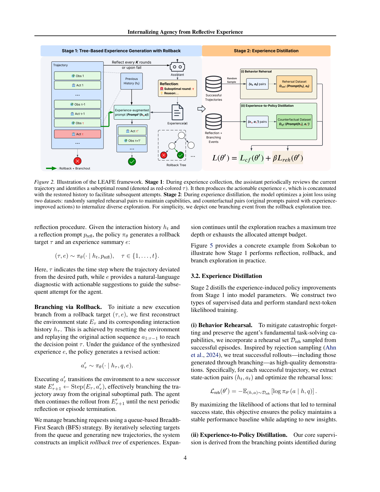
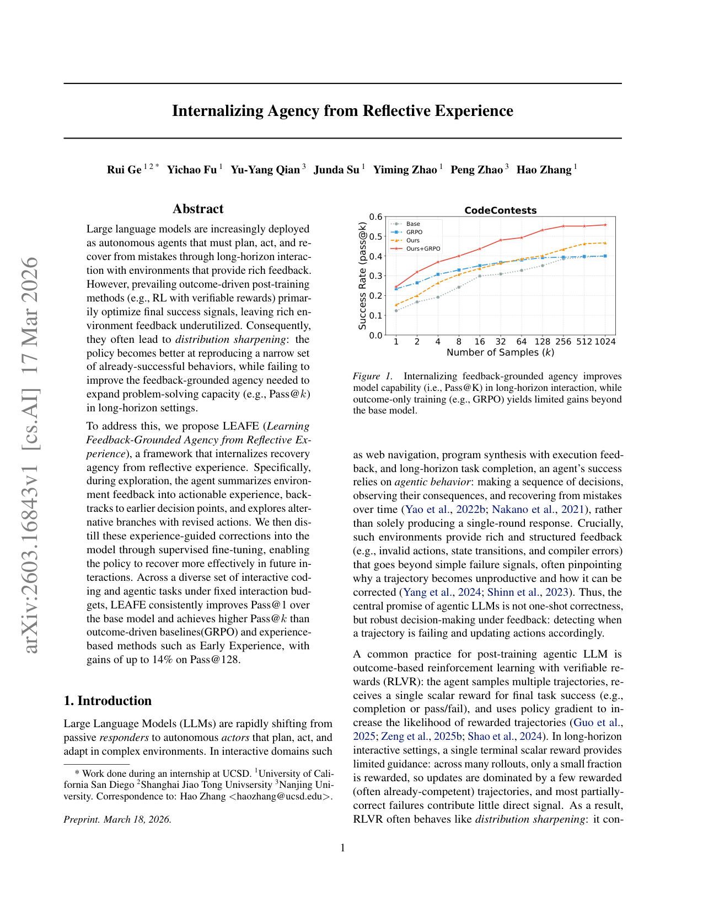

`leafe | Internalizing Agency from Reflective Experience (LEAFE) | UCSD (Hao Zhang 组) + 上海交大/南京大学 (Rui Ge, Yichao Fu, Yu-Yang Qian, Peng Zhao 等) | 2026-03 arXiv:2603.16843v1 (17 Mar 2026) · 预印本 | 主题线 L?·"探索→回溯→纠错→内化"训练线·极高相关`

> 三标注约定:【原文】=论文直述;【推断】=有据判断(附依据);【待核】=拿不准的关键事实。

══ 第一层:一眼看懂 ══

- 🟦 **TL;DR**:让 LLM agent 在交互中"边干边修",并把这套"修复本事"焊进模型权重。具体两阶段:**Stage 1** agent 跑长程任务,每隔 K 步或一失败就反思,自己说出"哪一步(τ)走错了 + 一条诊断-修复经验 e",然后**把环境重置回 τ**,带着经验 e 重做这一步、长出新分支(BFS 长成一棵"回滚树"),从而造出"失败→回滚→修复→成功"的轨迹;**Stage 2** 把这些"经验引导下的纠正动作"蒸馏进模型——关键是**训练时把"带经验 e 的纠正动作 a′"当成"不给经验、只看原始历史 hτ"的监督目标**,于是测试时模型不用再反思也能自己拐对弯。结果:Pass@k(尤其大 k,如 Pass@128/1024)显著高于 GRPO,CodeContests 上 Pass@128 比 base 高最多 +14%。【原文 摘要+§1+§3】

- **最巧的一步**:**反事实蒸馏 Lcf**——把"在 hτ 处注入经验 e 才生成出的好动作 a′τ",反向映射成"仅给 hτ(无 e)就应输出 a′τ"的训练对。抽掉它,方法退化成"拒绝采样模仿成功轨迹(Lreh)",只会保住老本事、学不会"开始失败时怎么救回来"。Table 4 实锤:只用 Lreh vs Lreh+Lcf,Pass@128 在 Qwen2.5-14B 上 67.33→72.00、7B 上 59.33→62.00,而 Pass@1 几乎不变——证明涨的全是"修复带来的覆盖度"。【原文 Table 4, §4.3】

══ 第二层:为什么做 ══

- **研究背景**:LLM 正从"单轮应答者"变成"长程交互的自主 agent"(网页/程序合成/具身任务)。这类环境给的是**结构化反馈**(非法动作、状态转移、编译错误),往往直接点出"哪里错了、怎么改",而不只是 0/1 成败。Agent 的核心价值是"在反馈下稳健决策:发现轨迹要崩了就改动作",而非一锤子对。【原文 §1】

- **解决的具体痛点**:主流做法是 **RLVR(可验证奖励 RL,如 GRPO)**——多 rollout、终局一个标量奖励、策略梯度上调成功轨迹。长程下这有硬伤:① 一个终局标量对"长程信用分配"几乎没用,说不清哪一步该改;② 大多 rollout 不得奖励,更新被少数"本来就会做"的轨迹主导 → 这是 **distribution sharpening(分布锐化)**:把概率质量堆到模型已会的一小撮行为上,Pass@1 涨、但大 k 的 Pass@1024(更能反映"能力覆盖")几乎不涨甚至倒退。于是只能靠昂贵的 test-time(多次重试/投票/树搜索)逃离早期错误。【原文 §1, §2.2】

- **相关工作 & 各自不足**(作者把自己摆在三条线旁):
  - *RLVR / 过程奖励线*(GRPO、GiGPO、PRM):仍是 reward 驱动、在已有解空间内重加权,难发现质变新解;过程奖励要额外训 verifier。【原文 §5 RLVR 段】
  - *自进化 / 外置经验线*(ReasoningBank、ACE、FLEX):把学习外化进 prompt/记忆/playbook,**不改权重**——好处轻量,但能力封顶在"prompt 能表达的策略",且测试时要一直挂长上下文。【原文 §5 Self-Evolving 段】
  - *从经验内化进权重线*(Early Experience/IWM、Agent Q、HOPE、SPA、GA-Rollback、EvolveR):最近邻。Early Experience 学"隐式世界模型"+自反思但不显式定位失败点;Agent Q 用 MCTS+DPO 学成败;GA-Rollback 触发逐步回滚防错误传播但**不把回滚经验蒸馏进单 rollout 策略**;EvolveR 把轨迹蒸成"可复用原则"(偏 prompt 级)。【原文 §5 Learning From Experience 段】

- **动机链(一条逻辑线)**:agent 要长程稳健 → 必须会"反馈条件下的定向修复" → RLVR 把反馈压成终局标量,只会锐化已有能力、大 k 不涨 → 那就**显式造"失败→回滚→修复"经验**(Stage 1),并把"修复决策"**内化进参数**(Stage 2)→ 这样测试时不靠盲目重试/外部树搜索,单 rollout 就能拐对弯,Pass@k 上限被抬高。为什么不用更简单的现成做法:纯 SFT 成功轨迹(=Lreh)学不到"怎么从坏状态救回";纯 GRPO 锐化不扩张;纯外置 playbook(ACE)不进权重且上下文膨胀。【原文 §1, §4.3】

- **与最近邻 Early Experience / GA-Rollback 的 Δ**:
  - vs **Early Experience**:EE 学"预测下一观测"的隐式世界模型 + 自反思,但**不显式定位 critical 失败步、不做"经验→无经验"的反事实回填**;LEAFE 精准回滚到 τ 并把"有经验才会的纠正"蒸成"无经验也会"。Table 6 还显示:把 EE 叠加上来能提 Pass@1,但有时**压低 Pass@128**(96.43→93.57),即 EE 偏锐化、LEAFE 偏扩张。【原文 §4.4, Table 6】
  - vs **GA-Rollback**:GA-Rollback 在推理时触发回滚防错误传播,是**test-time 机制**;LEAFE 把回滚经验**蒸进权重**成为内在能力。差异有用之处:把"修复"从"每次推理都要的外部流程"变成"模型自带的一次性能力",省 test-time 算力。【原文 §5】

══ 第三层:怎么做 + 靠不靠谱 ══

- **方法流水线**(输入 q → 输出内化了修复力的策略 πθ′):
  1. **Stage 1 — 回滚树造经验**(Algo 1):从 q 跑 rollout;**每 K 步或一失败**触发反思,策略自己产出 \((τ, e)\)(回滚目标步 + 自然语言诊断-修复指令)。【原文 §3.1】
  2. **Branching via Rollback**:`Reset(E)` + \(Replay(a1:τ−1)\) 把环境/历史恢复到 τ;在 e 引导下生成修正动作 \(a′τ ∼ πθ(·|hτ,q,e)\),执行后继续往下跑。用**队列式 BFS** 反复展开,长成"回滚探索树",直到树深上限/预算耗尽。【原文 §3.1, Algo 1】
  3. **Stage 2 — 两类监督数据 + 标准 next-token SFT**:
     - **(i) Behavior Rehearsal `Lreh`**:从成功轨迹(含分支出的成功)取 (h,a) 对,模仿成功决策(拒绝采样式),**防遗忘、保底座能力**。实现:随机取 20% 成功 rollout 入 Dreh。
     - **(ii) Experience-to-Policy Distillation `Lcf`**(核心):对每个分支事件,把 \(a′τ\) 作为"仅给 hτ、不给 e"的反事实目标,\(Lcf = −E[log πθ′(a′τ|hτ,q)]\)。每任务采 3 个反事实(分支)实例入 Dcf。
     - **联合目标 \(L(θ′) = Lcf + β·Lreh\)**;batch 128、lr 1e-6、2–3 epoch。【原文 §3.2, B.3】

- **逐组件必要性**:
  - *Lcf(反事实蒸馏)*:✔有消融(Table 4)。去掉它 = 退回 Lreh-only,Pass@128 明显掉(见上),Pass@1 基本不变 → 它专管"扩张覆盖度/修复力"。
  - *Stage 1 的树式回滚采样*:✔有消融(Table 3)。同等执行预算下,CodeContests Pass@128:独立采样 IS 48.92 < 迭代精修 IR 51.48 < 本文 Stage 1 55.52(Qwen2.5-32B),证明"结构化反馈驱动分支"比盲采/线性精修更能在固定预算内挖出成功解。
  - *Lreh*:作者定位为"稳基座/防遗忘",未单独证明"去掉 Lreh 会灾难遗忘"——属**部分未证**(只对比了 Lreh-only 与 Lreh+Lcf,没给 Lcf-only)。【推断:依据=Table 4 只有两列】
  - *β 取值*:正文/附录**未见 β 的敏感性消融**。【推断:依据=B.3 只给最终超参】

- **关键机制直觉**:`Lcf` 在干一件事——**把"有外部提示才会做对"的能力,搬成"没提示也会做对"**。这等价于一次"无梯度反思 → 有梯度内化"的转换:Stage 1 用语言反思在**上下文层**临时改策略(experience as contextual intervention),Stage 2 用 SFT 把这个临时策略移位**焊进参数**,于是模型内在动作分布里多出了这些"修复型动作",大 k 采样时更容易冒出成功解(覆盖度↑)。为什么这式子能达目的:它直接最大化"原始无提示语境下输出修正动作"的似然,正是"内化修复力"的字面定义。【原文 §3.2】

- **实验与证据**:
  - 数据集/设置:**WebShop / ALFWorld / ScienceWorld / Sokoban**(交互式)+ **CodeContests**(带编译/测试反馈的竞赛编程)。backbone:Qwen2.5-7B/72B、Llama3/3.1-8B/70B、Qwen2.5-14B/32B。指标:Pass@1(部署单试)与 Pass@128(能力上限代理)。统一框架 **verl-agent**(交互任务)+ **verl**(CodeContests,按 CTRL 评测)。【原文 §4, B.x】
  - baseline:Base / GRPO-RLVR / EarlyExp(复现其 IWM)/ ACE(playbook prompting,叠在 GRPO 模型上)。**LEAFE 也是从 GRPO 模型初始化再训**。【原文 §4 Baselines】
  - **支撑核心主张的关键实验**:Table 2 — CodeContests Qwen2.5-72B,Pass@128:Base 33.94 / GRPO 36.97 / **LEAFE 47.88**(+~14% vs base,且远超 GRPO);Llama3-70B 24.85/27.88/**33.94**。这最能体现"内化修复力 → 抬高能力上限",而 GRPO 在大 k 几乎贴着 base。
  - **最有说服力的对照**:Figure 1 / Figure 3 的 Pass@k 曲线——GRPO 曲线大 k 段几乎与 Base 重合(锐化的视觉证据),LEAFE(及 Ours+GRPO)整条上移并在大 k 拉开。
  - **OOD 证据(很关键)**:Table 5,在 CodeContests 训练、迁到 MBPP 测 Pass@128:GRPO **掉**(Llama3-70B −4.2),LEAFE **不掉甚至涨**(+1.3)→ 说明学到的是"通用反思修复力"而非数据集捷径。
  - *baseline 公平性*:同 backbone、同 verl-agent 环境/reward、且都从 GRPO 模型起步,变量较干净。但 EarlyExp/ACE 是作者复现/迁移(非官方实现),且 CodeContests 上 EE/ACE 干脆没报(说"不直接适用")→ 这两者比较的可信度略打折。【推断:依据=§4 Implementation + Table 2 脚注】
  - *"看着强但没回答核心"的点*:Pass@1 上 LEAFE 常**输给** GRPO(如 WebShop-Qwen2.5-7B:GRPO 67.45 vs LEAFE 66.50)。作者坦承并把卖点定位在大 k;但若部署只看单试,LEAFE 不一定占优 → 卖点是"覆盖度/上限"而非"单试精度"。【原文 §4.1 + Table 1】

- **假设与失效边界**:
  - 【原文】LEAFE **依赖环境能可靠 reset 到回滚点**(Reset+Replay);在非确定性/有状态的真实环境里难做。
  - 【原文】**依赖清晰、可诊断的反馈**;反馈弱/延迟/难归因时收益缩水。
  - 【推断】CodeContests horizon=4,回滚只在预算耗尽时触发(B.3),即"编程任务里 Stage 1 更像迭代重写而非真·中途回滚"——其"回滚树"在短 horizon 任务上退化。依据=B.3"CodeContests max horizon=4, rollback only when budget exhausted"。
  - 【推断】反思与 (τ,e) 的质量由**同一个 base 策略**产出;若 base 反思能力差,造出的经验/回滚点噪声大,Stage 2 会蒸进坏监督。论文未测"反思质量 vs 最终收益"的相关性。依据=方法用 πθ 自身做反思,无外部 critic。

- **祛魅总结**:
  - **真贡献(硬货)**:(a)`Lcf` 反事实蒸馏把"提示依赖的修复"内化为"自带修复",Table 4 实锤是涨 Pass@k 的根;(b)清晰区分 **distribution sharpening(GRPO)vs agency internalization(本文)**,并用 Pass@k 大 k 段 + MBPP OOD 双证据支撑,论证扎实;(c)统一在 verl-agent 上跨 5 个环境复现,工程可信度高。
  - **包装/可能高估**:"internalize agency""feedback-grounded agency"等措辞偏宏大;实际机制就是"成功轨迹模仿 + 反事实纠正动作蒸馏"。Pass@1 常不及 GRPO 这点被弱化处理。【推断:依据=Table 1 多处 Pass@1 落后】
  - **可能低估/没说透**:环境可 reset 是很强的前提,真实 web/工具环境多数做不到完美回放;这其实限制了 Stage 1 的适用面,被一句 limitation 带过。【推断】

══ 结构化抽取 ══

- 🎯 **机制速览 6 轴**:

| 学什么信号 | 改什么 | 何时改 | 免梯度? | 记忆-技能生命周期 | 防遗忘机制 |
|---|---|---|---|---|---|
| 环境结构化反馈 + 自反思(策略自产 (τ,e) 诊断-修复经验);成功/失败轨迹都用 | **参数**(SFT 内化"修复动作";经验 e 只在 Stage 1 当临时上下文,测试时不再用) | **离线批量**(两阶段:先造经验树,再 SFT;非在线 per-step 更新) | **否**(核心是有梯度的 next-token SFT 内化) | 经验 e:Stage1 生成→当上下文注入→蒸进参数后**丢弃**(不持久检索);无外置记忆库 | **Behavior Rehearsal `Lreh`(拒绝采样模仿成功轨迹)** 显式防灾难遗忘;OOD(MBPP)证据示保持力优于 GRPO【原文 §3.2+Table5】 |

- ⑦ **开源代码 + 框架/harness**:**论文未给自有代码仓**。全文唯一外链是依赖库 `github.com/mpSchrader/gym-sokoban`(Sokoban 环境,非本文代码)。〔待核:截至 PDF 无 LEAFE 官方仓;若后续放出需另查〕。**训练/评测框架明确**:交互任务用 **verl-agent**(Feng et al., GiGPO),CodeContests 用 **verl**(HybridFlow)+ 按 **CTRL** 做执行评测;EarlyExp 基线用 verl SFT 模块复现 IWM。【原文 §4 Implementation, B.3, B.4】

- 💰 **资源/成本与可扩展性**:训练侧 batch 128 / lr 1e-6 / 2–3 epoch;蒸馏样本规模约 10–12k/数据集(Table 7)。Stage 1 造经验需多次 Reset+Replay+分支 rollout(BFS 到树深/预算上限),**采样成本高于单遍 rollout**,但作者强调这是"把 test-time 多次重试的算力前移到训练一次性投入",换来测试时单 rollout 即可。模型规模从 7B→72B 均见收益(Fig 4)。延迟/具体 GPU 数原文未量化。【原文 §3.1, B, §4.5】

- 🎯 **对"探索-巩固(探索→巩固)"idea 对标**:**最强支撑 + 高度同构 + 直接可借**。LEAFE 几乎就是 TSRD 的一个已实现骨架:
  - *探索→回溯决策点*:Stage 1 的"自定位 critical 步 τ + 回滚 + 经验引导分支"= TSRD 的"path-selection / 回溯到关键步"。
  - *纠正→内化*:Stage 2 的 `Lcf`(经验→无经验反事实蒸馏)= TSRD 的"path-recovery 单点接管 + 把修复力沉淀进参数"。
  - **可借组件**:① `Lcf` 的"有提示动作→无提示语境"反事实回填,可直接做 TSRD 把"path-recovery 纠偏"蒸进权重的训练目标;② "每 K 步/失败触发反思 + BFS 回滚树"可作探索阶段的数据生成器;③ `Lreh` 作为防遗忘项与项目记忆里"防遗忘/隔离"诉求契合。
  - **缺口/与本项目的差异**:LEAFE **未用 MTP / 前瞻探针**来决定"在哪一步回滚"(它靠 base 策略事后反思自报 τ),且不是 on-policy 蒸馏(是离线两阶段 SFT)。把 **MTP foresight 作为"何处回滚/何处接管"的预测信号** + 把 `Lcf` 换成 **on-policy 蒸馏(teacher logits)** 正是 mtp_opd 可在其上做出的差异化增量。【推断:依据=方法靠事后反思选 τ + 纯 SFT;对照 project_core_idea(MTP foresight probe + OPD)】

- 🔭 **开放问题/未来方向**:
  - 【原文】弱/延迟反馈、不可 reset 环境下如何泛化(显式 limitation)。
  - 【推断】① 用更强信号(前瞻/置信度/熵)替代"事后反思选 τ",把回滚点选得更准;② 把离线两阶段改成在线/on-policy(teacher 蒸馏)以减分布漂移;③ β / 反事实条数 / 树深的系统性消融(目前缺);④ 反思质量与最终收益的因果分析。依据=方法当前用事后反思 + 固定超参 + 离线 SFT。

- 🖼 **关键图 top-2**:

  
  这是**原文 Figure 2**(方法主图):左 Stage 1 画出"轨迹→反思定位红色 τ→产经验 e→回滚 BFS 树→成功轨迹";右 Stage 2 画出两条数据流(随机成功对 Dreh 做 Behavior Rehearsal + 反事实对 Dcf 做 Experience-to-Policy Distillation),底部联合损失 \(L(θ′)=Lcf+βLreh\)。选它因为一图说清"探索造经验→蒸馏内化"全机制,正是与 TSRD 对标的核心结构。

  
  这是**原文 Figure 1**(动机/主结果图):CodeContests 上 Pass@k 曲线,**GRPO(橙)在大 k 段几乎贴着 Base(蓝)**,而 Ours/Ours+GRPO(红)整条上移并在大 k 拉开。选它因为这一张就把全文最硬的论点——"outcome-only RL 只锐化、内化修复力才扩张能力上限"——可视化坐实。

──────────
**幂等状态**:本文 analysis 首次产出。机制类型 = "探索→回溯→纠错→内化"(离线两阶段、**有梯度 SFT 内化**、改参数、`Lreh` 防遗忘)。抽到 2 图:是(Figure 2 框架 + Figure 1 Pass@k)。**代码:论文未给自有仓(仅 gym-sokoban 依赖链接);框架 verl-agent + verl(CTRL 评测)明确。**
