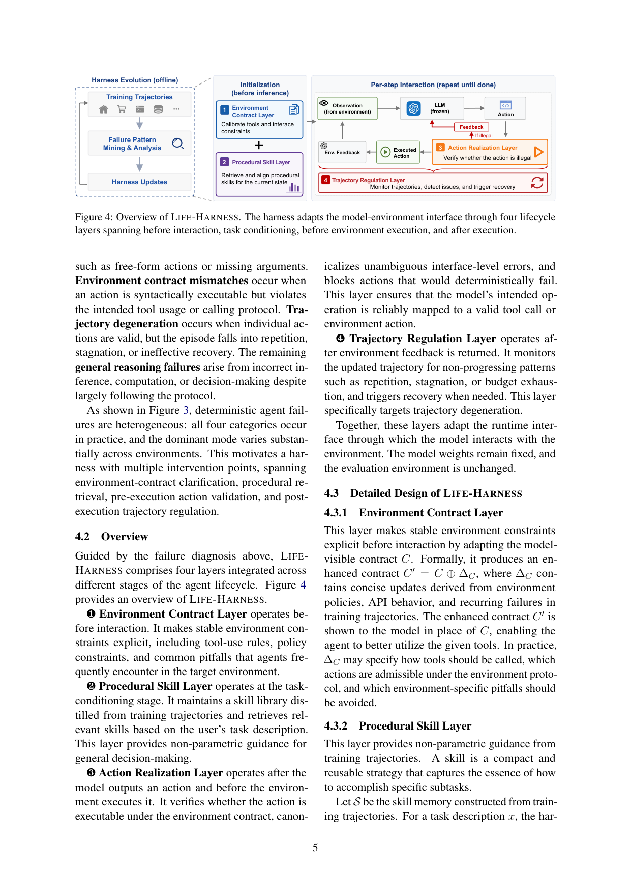
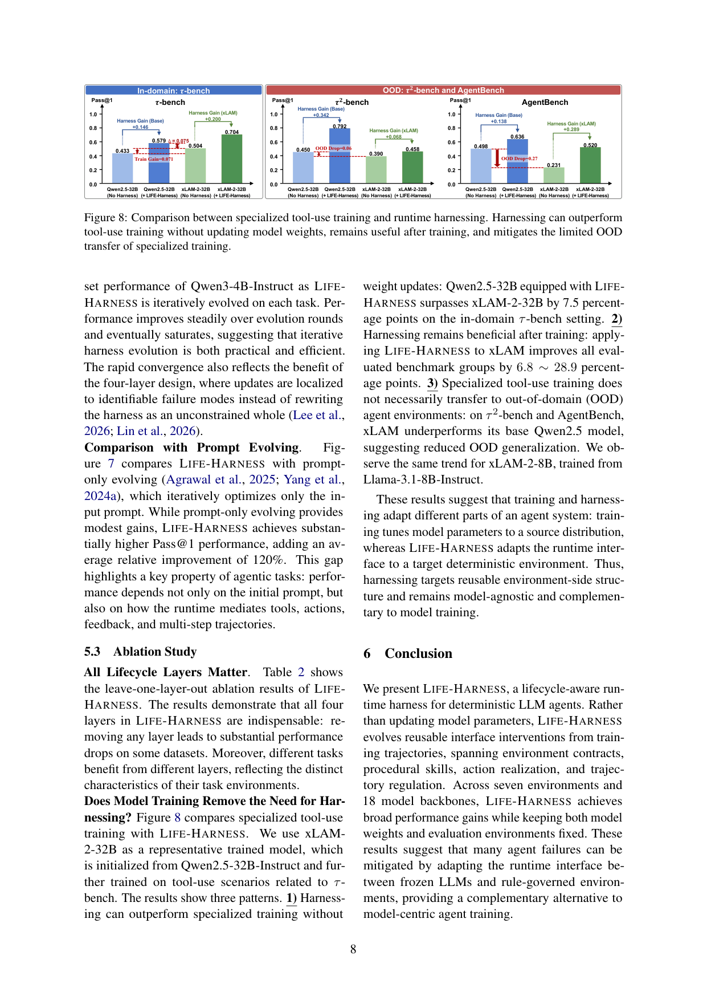

`life_harness | Adapting the Interface, Not the Model: Runtime Harness Adaptation for Deterministic LLM Agents (LIFE-HARNESS) | 北京大学(Tianshi Xu, Huifeng Wen, Meng Li) | 2026-05·arXiv:2605.22166 v2(27 May 2026)·preprint·18页 | 主题线 L6(harness 自进化)+ L1 + L4 · 相关性 High`

> 三标注:【原文】=直接来自论文;【推断】=有据判断(附依据);【待核】=拿不准的关键事实。

---

## ══ 第一层:一眼看懂 [light] ══

- 🟦 **TL;DR**:【原文】LLM agent 不只是一个模型,它外面还包着一层"运行时脚手架(runtime harness)"——负责怎么把环境观测喂给模型、模型怎么看懂工具、动作怎么落地执行、反馈怎么解读、轨迹怎么调控(§1, Fig 2a)。在确定性、有明确规则的环境里(比如订机票、网购、操作数据库、OS 控制),很多失败其实不是模型"不会想",而是卡在"模型↔环境"这层接口上(动作写成纯文本没被执行、误解工具用法、陷入死循环)。LIFE-HARNESS 的做法:**冻结模型权重不动**,只从训练轨迹里挖出"反复出现的接口失败",把它们固化成四层可复用的接口干预(环境契约层 / 程序技能层 / 动作落地层 / 轨迹调控层),进化好之后冻住,在没见过的任务上评测。在 7 个确定性环境、18 个模型骨干、126 个"模型×环境"组合上,116 个组合涨点,平均相对提升 **88.5%**(§1, 摘要, Table 1)。只用 Qwen3-4B-Instruct 的轨迹进化出的 harness,能直接迁移到另外 17 个模型——说明它学到的是"环境侧可复用结构",不是"某个模型的脾气"(§1, §5.2)。
- **最巧的一步**:【推断,依据 §4.1 Fig 3 + §4.2】把"agent 失败"按**交互生命周期阶段**拆成四类失败(动作落地 / 环境契约 / 轨迹退化 / 一般推理),再把每类失败对应到一个**固定的、可审计的干预层**,而不是像 Meta-Harness/AHE 那样把整个 harness 当成一坨自由代码去搜/去改写。抽掉这个"按生命周期定位失败→局部固定干预"的结构,方法就退化成普通的 prompt 优化或无约束 harness 搜索——而 Fig 6 显示正是这种局部化让进化几轮就快速收敛饱和(§5.2"Evolution Dynamics")。这是它区别于同期 harness 工作的硬核。

---

## ══ 第二层:为什么做 ══

- **研究背景**:【原文 §1】Agent 适配长期被默认等同于"模型适配"——scaling、SFT、RL、蒸馏,这些都把领域结构吸进权重里。但 agent 的行为是被一整个"有状态交互回路"决定的(环境出观测→harness 给工具/动作→模型出动作→执行器作用→反馈更新下一步)。这个系统级视角在 SWE 助手、web 导航、数据库操作、OS 控制、工具型业务流 agent、具身交互里越来越重要。
- **解决的具体痛点**:【原文 §1, §2】① 模型适配把领域行为绑死在特定 checkpoint 和训练分布上,换基座或换环境就得重训,**重复成本高、不可跨模型复用**。② 静态能力 ≠ 交互表现:Qwen3.5-4B 在 HMMT 数学题上 74.0%,但在 ALFWorld 具身交互上只有 43.1%——失败不是缺推理力,而是卡在"模型↔环境边界":观测结构差、误解工具契约、动作不可执行、反馈触发不了恢复、轨迹退化。③ 已有的 harness 优化工作(AutoTTS / Workspace Opt / Continual Harness / HARBOR / Meta-Harness / AHE)大多把 harness 当成"一个整体的 policy / 可变状态 / 配置空间 / 代码产物"去优化,**没有把确定性域里失败的"结构性、可定位"特点利用起来**。
- **相关工作 & 各自不足**:【原文 §2】
  - **Harness 优化线**(最近邻):AutoTTS 搜推理时算力控制器(只管数学推理的宽/深算力分配);Workspace Optimization / Continual Harness 做交互游戏里的在线 workspace 自适应(在线改 workspace 状态/prompt/技能/记忆);HARBOR 把 harness 调参当贝叶斯优化、只在**已有的 feature flag** 上搜;Meta-Harness 在**完整 harness 程序**空间上搜(用历史候选代码+分数+trace);AHE 用可观测性驱动进化 coding-agent harness(把可编辑组件暴露成文件、蒸馏 trace 证据、用 prediction manifest 验证)。**共同不足(作者立论)**:它们要么局限于 coding/游戏域,要么把 harness 当自由代码整块去搜/连续编辑,没利用"确定性域里失败可定位到生命周期某阶段"这一结构。
  - **Prompt 适配线**:OPRO(LLM-as-optimizer)、ProTeGi/TextGrad(文本梯度)、GEPA(反思式进化)。不足:**只优化"面向模型的文本"**,管不到动作校验、反馈驱动恢复、轨迹调控这些更广的运行时接口。
  - **模型侧适配线**:指令微调、工具用微调(xLAM)、RL(WebRL/ToolRL)、蒸馏。不足:适配**绑死在特定 checkpoint 和训练分布**上。
- **动机链**:【原文 §1→§3】确定性域里,大量相关结构本就活在模型之外(工具 schema、API 契约、可执行动作集、反馈规则、停止条件、恢复策略)→ 与其把这些都塞进权重(模型/任务专用、要反复重训),不如**把稳定的环境侧结构通过运行时接口暴露出来**→ 因为是确定性域,反复出现的失败可以被定位到交互生命周期的特定阶段 → 所以可以从训练轨迹里把"失败结构"转成结构化的运行时接口,评测时冻住、还能跨模型复用。中心问题(§2 结尾):训练轨迹能否揭示稳定的失败结构、转成结构化运行时接口,从而在未见任务和多样模型架构上改进 agent?
- **与最近邻 Δ**:【原文 §2】与 **Meta-Harness / AHE** 最像(都信"冻结模型也能在权重外改进 agent"),但**两个关键差异**:① **范围**:Meta-Harness/AHE 聚焦 coding-agent 的"自动 harness 工程",LIFE-HARNESS 做 coding 之外的确定性规则域(家居交互、网购、数据库、策略型业务流)。② **抽象**:Meta-Harness/AHE 把 harness 当"自由代码产物"去搜/连续编辑;LIFE-HARNESS 把它当"由 agent 交互生命周期组织的结构化运行时接口",把训练轨迹里反复出现的失败**映射到四个固定干预点**,评测时固定、跨模型复用。【推断,依据 §5.2】这个差异有用在于:局部化干预让进化快速收敛(Fig 6),且因为锚定"环境侧结构"而非"模型行为",得以跨 18 个骨干迁移。

---

## ══ 第三层:怎么做 + 靠不靠谱 ══

- **方法流水线**(§3.1, §4, Algorithm 1):
  1. **失败诊断(离线,设计前)**:在训练任务上跑冻结的 Qwen3-4B-Instruct,人工(借 Codex)逐条审失败轨迹,按"交互回路里最早的主导瓶颈"打**单一主失败类**(优先级协议:先查动作落地→再环境契约→再轨迹退化→剩下归一般推理,防止后期症状掩盖前期接口失败)(§4.1, Appendix A.1)。得到四类失败的占比(Fig 3a 整体:动作落地23.2% / 环境契约33.3% / 轨迹退化33.6% / 一般推理9.9%;Fig 3b 各环境分布差异巨大)。
  2. **❶ 环境契约层(交互前)**:把稳定的环境约束显式化,产出增强契约 C′ = C ⊕ ΔC,ΔC 含工具调用规则、策略约束、常见坑;C′ 替代 C 喂给模型(§4.3.1)。
  3. **❷ 程序技能层(任务条件化阶段)**:维护从训练轨迹蒸馏出的技能库 S,对任务描述 x 用 **BM25** 检索 Top-K 技能 Kx,插入初始 system prompt 提供非参数化指导(§4.3.2)。
  4. **❸ 动作落地层(模型出动作后、执行前)**:对模型动作 at,用确定性环境证据(工具 schema、可执行动作集、参数约束、任务策略)判定 EXEC(at) 或 BLOCK(mt)——校验可执行性、规范化无歧义的接口级错误、拦截必然失败的动作(§4.3.3)。
  5. **❹ 轨迹调控层(环境反馈返回后)**:监控轨迹是否陷入重复/停滞/预算耗尽等非进展模式,输出可空 / 软恢复消息 / 重复失败警告 / 强纠正指令(§4.3.4)。
  6. **轨迹驱动的 harness 进化(离线)**:借 coding agent **Codex**,反复在训练任务上跑冻结模型收集完整 trace,Codex 读 trace + harness 设计准则,对相应层提出更新;目标①扩大对反复失败的覆盖、②检测干预过度触发/伤害正确行为的回归(§4.4)。**测试集全程对进化过程隐藏**;最终 harness 冻住后复用到其余 17 个骨干(§5.1)。
- **逐组件必要性**(留一层消融 Table 2,Qwen3-4B,报相对掉点):【原文】四层都不可或缺,且不同环境靠不同层——
  - w/o 动作落地:Airline 掉 **-61.7%**、OS 掉 **-59.6%**(这俩环境动作落地是命门)。
  - w/o 轨迹调控:ALFWorld 掉 **-86.5%**、Telecom -36.2%、WebShop -26.4%(具身/长程靠它防退化)。
  - w/o 契约 / w/o 技能:多环境 -1%~-17% 不等。
  - 【推断,依据 Table 2 全行非零】没有哪一层在所有环境都可省;掉点的异质性正好印证 Fig 3b"失败分布因环境而异"的设计前提——消融与诊断自洽,证据较扎实。
- **关键机制**:【原文】核心是 **H′ ← A_harness(H, T_train), θ fixed**(§3.2)——"运行时接口适配":环境专用但模型无关。直觉上,把"哪些动作合法、哪些工具该先调、什么时候该恢复"这类**确定性环境证据**从模型权重里搬到接口层显式执行,模型只需专注推理,接口层兜住可机械识别的失败。BM25 检索(而非向量检索)做技能召回——【推断】确定性域任务描述用词稳定,词面匹配够用且零额外模型成本。
- **实验与证据**:【原文 §5】
  - **数据集/设置**:τ-bench(Airline/Retail)、τ²-bench(Telecom)、AgentBench(ALFWorld/WebShop/OS/DBBench)共 7 场景;源模型 Qwen3-4B-Instruct 进化 harness,迁移到另 17 个(Qwen/Llama/xLAM 家族,含指令/推理/agent 专训模型);温度 0.0;τ/τ²-bench 用 DeepSeek-V4-Flash 当 user LLM、每任务跑 3 次报 Pass@1 与 Pass^3(三次全过);AgentBench 跑 1 次。
  - **支撑核心主张的关键实验**:① **主表 Table 1**(18 模型平均):ALFWorld 41.1%→75.7%(+84%)、WebShop +40%、DBBench +34%、Airline Pass@1 +26%/Pass^3 +50%、Telecom +25%。② **跨模型泛化**:92% 的"模型×benchmark"组合涨点(只从 Qwen3-4B 进化)——支撑"学的是环境侧结构非模型行为"。③ **vs prompt-only 进化**(Fig 7):比纯 prompt 进化再高出平均相对 **+120%**——证明 agent 表现不只取决于初始 prompt,还取决于运行时怎么调度工具/动作/反馈/多步轨迹。④ **训练 vs harness**(Fig 8,核心卖点):Qwen2.5-32B + LIFE-HARNESS 在 in-domain τ-bench 上**超过其工具用微调衍生模型 xLAM-2-32B 达 7.5 个百分点**(0.579 vs 0.504);给 xLAM 再加 harness 仍涨 6.8~28.9 个百分点;且 xLAM 在 OOD(τ²-bench/AgentBench)上**反而不如基座 Qwen2.5**(专训 OOD 泛化退化),而 harness 不受此累。
  - **baseline 公平性**:【推断,依据 §5.3 Fig 8】用同源 xLAM(从 Qwen2.5-32B 工具用微调而来)对比较公平——直接比"同一基座:权重微调 vs 接口适配"。【待核】未见与 Meta-Harness/AHE 的**直接同环境 head-to-head 数字**(二者主打 coding 域,本文是非 coding 域,可能无可比设置)——仅在 §2/§5.2 文字层面区分。
- **假设与失效边界**:【原文 Limitations §】显式假设:**确定性、规则治理**的环境,工具接口/反馈规则/评测标准相对稳定(数据库/网购/策略型业务流满足),失败可复现并转成可复用干预。失效边界:**开放域 / 开放式 agent 任务**(每个任务目标、工具、外部资源、成功标准都不同)难以定义稳定运行时接口或进化出跨任意任务泛化的 harness——作者明确列为未来工作。【推断】另一隐式假设:进化期需要能**反复重跑训练任务收集 trace**(§4.4),对真实 API/有副作用环境成本高、本文靠 benchmark 可重置环境绕过。
- **祛魅总结**:【推断】① 真贡献(硬货):把"harness 自进化"从"无约束代码搜索"收敛成"按生命周期定位失败→四个固定层局部干预"的结构化范式,带来快速收敛(Fig 6)+ 跨 18 模型迁移 + 消融自洽,这是扎实的工程化贡献;"冻结模型也能超过工具用微调且 OOD 更稳"(Fig 8)是有说服力的旗舰结果。② 包装/可能高估:88.5% 是**相对提升**且基线(尤其小模型在 ALFWorld 等)起点很低,绝对值看 Table 1 部分仍不算高(如 OS 34.7%→41.2%);"平均"掩盖了 10/126 组合未涨。③ 【待核】"harness 不用 test label"是作者反复强调的约束(Appendix A.2 prompt 明令),但 harness 由 Codex 读训练 trace 进化而成,对训练分布有一定过拟合风险——跨模型迁移强但跨环境(同一 harness 用到全新环境)未测。

---

## ══ 结构化抽取 ══

### 🎯 机制速览 6 轴 [light]
| 维度 | 内容 |
|---|---|
| **学什么信号** | 【原文】环境反馈/确定性环境证据(工具 schema、可执行动作集、反馈规则)+ 经验库(从训练轨迹挖失败模式与程序技能);进化期由 coding-agent(Codex)读 trace 充当"自反思+诊断"代理 |
| **改什么** | 【**harness**】(本组重点)——运行时接口的四层:① 环境契约(改喂给模型的 contract/prompt 约束)② 程序技能库(非参数检索注入)③ 动作落地(执行前校验/规范化/拦截)④ 轨迹调控(执行后监控/恢复指令)。**绝不改模型参数**(θ fixed),也不改评测环境 |
| **何时改** | 【原文】**离线批量进化**(在训练任务上反复跑→Codex 多轮更新 harness,几轮饱和);进化完**冻结**,评测期 harness 固定(非在线 per-step 学习)。但运行时内部:契约层=交互前、技能层=任务条件化、动作层=per-step 执行前、轨迹层=per-step 执行后(per-step 干预,但用的是已冻结的规则) |
| **免梯度?** | 【原文】**是**(全程不更新任何模型权重;harness 进化靠 coding-agent 改代码/规则,无梯度) |
| **记忆-技能生命周期** | 【原文】写入=从训练轨迹蒸馏技能进 S + 挖失败转成契约/动作规则;检索=BM25 Top-K 按任务描述召回技能;淘汰/遗忘=进化期检测"过度触发/伤害正确行为"的回归并回退(§4.4),无显式时间衰减;共享=**跨 18 模型骨干复用同一 harness**(强跨模型共享) |
| **防遗忘机制** | 【原文】**不适用/隔离**——模型权重冻结,本无灾难性遗忘问题;harness 侧靠"局部最小、不覆盖模型推理、对未见任务鲁棒"的更新约束(Appendix A.2)+ 回归检测来防"新干预破坏旧正确行为",属**规则隔离 + 回归守护**,非几何/merging/KL 类 |

### ⑦ 开源代码 + 框架/harness
- 【原文】摘要与正文均称 "Code is available at GitHub";【待核】PDF 正文未直接印出完整 URL(摘要写 "Code is available at GitHub",§1 同)。候选清单(P1/V1)记为 **github.com/Tianshi-Xu/Life-Harness**(代码真伪/可达性此前标"待 P3 核",本 P4 阶段未亲自 clone 验证,**〔待核〕仓库是否可达**)。
- **框架/harness**:【原文 §4.4, §5.1】harness 进化的执行体是 **OpenAI Codex(CLI coding agent)**——读训练 trace、改 harness 代码。底层 agent 评测用各 benchmark 官方实现(τ-bench/τ²-bench/AgentBench)。**无 veRL/TRL/OpenRLHF 等 RL 训练框架**(因为完全不训模型)——这是"无训练框架/自研 harness 工程"类。

### 💰 资源/成本与可扩展性
- 【原文 §5.1】源模型仅 Qwen3-4B-Instruct;温度 0.0;τ/τ²-bench 每任务 3 次。【原文 Fig 6】进化几轮(图示到第 5 轮)即饱和,作者称"实用且高效"。
- 【原文 §4.4 + Appendix】进化成本 = 反复重跑训练任务收集 trace + Codex 多轮分析改码。【待核】**未给出具体 API token 成本 / GPU 时 / 进化总耗时数字**——"原文未说明"量化成本。【推断】相对模型 RL/SFT 显著省算力(零权重更新),主要成本转移到 Codex 调用与轨迹收集。

### 🎯 对"探索-巩固"idea 对标 [light]
- 【推断】**竞品 + 可借组件(偏正交)**。本调研中心 idea 是 Teacher-Scaffolded Reasoning Distillation(教 path-selection + path-recovery、把能力**巩固进权重**,MTP 当前瞻探针)。LIFE-HARNESS 走的是**完全相反方向**:坚决不动权重,把能力固化进"接口侧脚手架"。
  - 作为**竞品/对照基线**:它是"探索-巩固进权重"的最强反命题——主张确定性域里很多失败根本不必进权重,改接口即可,且 Fig 8 拿出"超过工具用微调"的证据。本调研若主张"巩固进参数",**必须正面回应**:为何不停在 harness 层?可借 Fig 8 的 OOD 论证反驳(harness 学的是环境侧结构,换环境就失效;权重巩固才可能泛化)。
  - 可借**组件**:① 它的"❹ 轨迹调控层"= 检测重复/停滞/退化并触发恢复,与本项目 **path-recovery 单点接管**高度同构(都是"侦测轨迹退化→单点干预拉回"),可作为"恢复信号"的轻量无梯度版对照;② "按交互生命周期定位失败的优先级协议"(Appendix A.1)是一套现成的"失败定位"诊断框架,可迁移用于决定"在哪一步该触发蒸馏/接管"。
  - **缺口**:它显式承认开放域失效、且不解决"如何把接口侧学到的修复内化进模型"——正是本项目"巩固进权重"想填的空。

### 🔭 开放问题/未来方向
- 【原文 Limitations】扩展到**开放式/开放域 agent 任务**(目标/工具/资源/成功标准各异)——如何定义稳定接口、进化可跨任意任务泛化的 harness。
- 【推断】① 把 harness 侧学到的修复**蒸馏/内化进模型权重**(harness→weight 的知识回灌),实现"接口先修、再固化"的两阶段;② 同一 harness 跨**全新环境**(非跨模型)的迁移性未测;③ 进化期对真实有副作用环境的成本与安全(本文靠可重置 benchmark 绕过);④ 与 Meta-Harness/AHE 在统一环境下的直接对比。

### 🖼 关键图 top-2 [light]

**这是原文 Figure 4**(§4.2)。表现了方法主干:左侧"Harness Evolution(offline)"用训练轨迹做失败模式挖掘→Codex 产出 harness 更新;右侧运行时回路里四层各就各位——❶环境契约层(交互前)、❷程序技能层(观测后/任务条件化)、❸动作落地层(执行前,illegal 则 BLOCK 返回反馈)、❹轨迹调控层(执行后监控+恢复)。**选它因为**:一张图同时讲清"改什么(harness 四层)、何时改(生命周期各阶段)、怎么进化(离线 trace 驱动)",是本组"harness 自进化"机制的精华缩影。

**这是原文 Figure 8**(§5.3)。三组对比:in-domain τ-bench 上 Qwen2.5-32B+harness(0.579)> 其工具用微调版 xLAM-2-32B(0.504),差 +7.5pt;给 xLAM 再加 harness 仍涨;OOD(τ²-bench/AgentBench)上 xLAM 反低于基座 Qwen2.5(专训 OOD 退化),harness 不受累。**选它因为**:这是全文最反直觉、最有冲击力的核心发现——"不动权重的接口适配能击败专门的工具用权重微调,且泛化更稳",直接支撑"运行时接口适配是模型训练的互补/替代路径"的主张,也是本调研"巩固进权重 vs 留在脚手架"辩论的关键证据。
