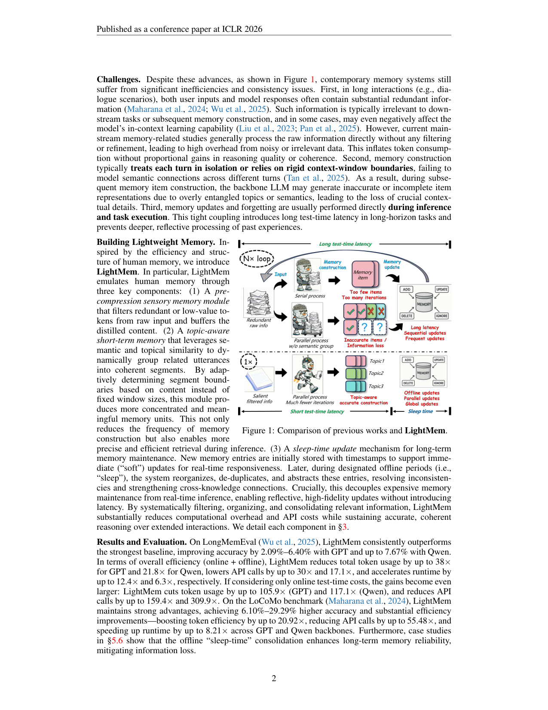
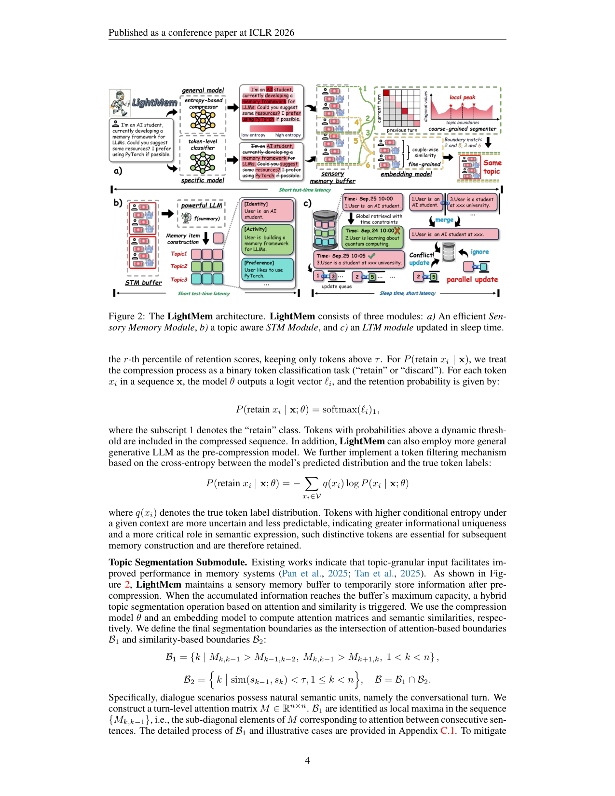

`lightmem | LightMem: Lightweight and Efficient Memory-Augmented Generation | 浙江大学(Ningyu Zhang 组) · 新加坡国立 · 南京大学 | 2025-10 首发·arXiv v4(2510.18866, 2026-02-28)·ICLR 2026 录用·cs.CL | 主题线 L?（高效 agent 记忆系统 = "类人三阶段记忆 + sleep-time 离线巩固、极致降本"线）· 相关性 High`

> 三标注约定：【原文】= 论文明说；【推断】= 我的有据判断(附依据)；【待核】= 拿不准的关键事实。

══ 第一层：一眼看懂 [light] ══

- 🟦 **TL;DR**：现有 LLM agent 记忆系统(Mem0/A-Mem/MemoryOS 等)**太贵太慢**——每一轮对话都直接喂原始文本去 LLM 做摘要/更新,既烧 token 又因冗余信息拖累效果,而且**记忆更新是在推理(test-time)时同步做的**,导致长任务延迟极高。LightMem 仿照人脑 **Atkinson–Shiffrin 三阶段记忆模型**重设计:**①感觉记忆(Light1)**用轻量压缩模型(LLMLingua-2)先把原始输入里的冗余 token 滤掉、再按主题切段;**②主题感知短期记忆(Light2)**把同主题 turn 攒到缓冲区满了才一次性调 LLM 摘要(而非每轮都调);**③带"睡眠时更新"的长期记忆(Light3)**——test-time 只做"软插入"(直接塞进 LTM、不立刻整理),把昂贵的去重/消歧/巩固挪到**离线"睡眠"期并行批处理**。结果:在 LongMemEval / LoCoMo 上 QA 准确率提升最高 7.7%/29.3%,总 token 降最高 38×/20.9×、API 调用降最高 30×/55.5×,**纯在线 test-time 成本更夸张(token 降最高 106×/117×、API 降 159×/310×)**。【原文 Abstract/§1/§5】
- **最巧的一步**:**把"记忆巩固/更新"从在线推理里彻底解耦到离线"睡眠期"并行做**(Light3 的 sleep-time update,§3.3)。关键不只是"延迟挪走",而是:① test-time 改成**软插入(soft update,直接插不整理)**→ 交互延迟骤降;② 给每条记忆条目维护**独立的 update queue**(Top-k 相似 + 仅允许"新时间戳更新旧条目"),因队列间互不依赖→**可并行**,打破现有系统"读后写/写后读"的串行更新瓶颈。抽掉"sleep-time 解耦 + 并行队列",LightMem 就退回成"又一个在线串行更新的记忆系统",所谓 100× 级 test-time 降本立刻消失。其次巧在 Light1 用 **LLMLingua-2 同时干两件事**:既算 token 保留概率做压缩,又复用其 attention 矩阵做主题切段(B1 注意力局部极大 ∩ B2 语义相似度低谷),省掉额外模型。【原文§3.1/§3.3】

══ 第二层：为什么做（写透，重点） ══

- **研究背景**：记忆是智能 agent 的根基——让 LLM 跨长上下文/多轮交互维持持久状态、吸收先前经验与上下文线索(§1)。但 LLM 受**固定上下文窗 + "lost in the middle"**(中段信息被忽略)限制，于是有了一类工作：通过"顺序摘要 + 长期存储"构建**显式外部记忆**(Mem0/A-MEM/MemoryOS/LangMem 等)，让模型长程保留并检索相关信息。本文站在"**高效 agent 记忆系统**"这条线，问题域是"记忆系统本身的时间/算力开销"。【原文§1】
- **解决的具体痛点**(§2.2 列三条，很具体)：**①冗余感觉记忆(Redundant Sensory Memory)**——长交互里用户输入和模型回答都含大量冗余(寒暄/重复)，现有系统**不过滤直接喂原始数据**去调更强的 LLM 做摘要/抽取，既烧 token 又因冗余**反而削弱 in-context learning**；**②STM 里效果与效率难平衡**——固定粒度下，粒度太细→延迟高+STM 容量利用不足，粒度太粗(无语义约束)→主题/语义混杂→记忆条目构建不准、丢细粒度细节；**③LTM 更新低效**——(i) test-time 强制实时更新→长程任务延迟大；(ii) 记忆库**因 read-after-write/write-after-read 的顺序约束被串行更新**，而非动态触发，延迟随更新次数累积。核心研究问题(§2.2 原文)："能否设计一个**既高效又轻量、受人脑记忆机制启发**的 LLM 记忆系统？"
- **相关工作 & 各自不足**(§1/§2/§6)：**①主流外部记忆系统(Mem0、A-MEM、MemoryOS、LangMem)**——靠顺序摘要 + 长期存储，但**对原始数据无过滤(痛点①)、逐 turn 或固定窗切分(痛点②)、在线串行更新(痛点③)**，维护成本高；**②Full Text / Naive RAG**——要么塞全文(token 爆)，要么纯检索(无结构化记忆构建)；**③轻量 GraphRAG 类(Guo/Zhao/Dong 2024-25)**——动机相似但**语料预定义且静态**，不处理动态多轮对话流。LightMem 的对手主要是前者(动态对话记忆系统)。【原文§2.1/§6】
- **动机链**：现状(外部记忆系统能提长程能力)→ 缺陷(三大开销：不过滤喂原始数据/固定粒度切分/在线串行更新)→ 为什么不用更简单的现成做法？**纯逐 turn 摘要**=每轮都调 LLM，API 调用与 token 随轮数线性爆炸；**纯固定窗切分**=语义混杂导致记忆条目不准；**在线实时更新**=延迟高且 LLM 做复杂更新易误判冲突误删(§5.6 自举例：把"相关但不矛盾"的两条误判为冲突而删旧条目，造成不可逆信息丢失)→ 所以必须**(a) 先压缩过滤掉冗余 token、(b) 按主题(而非固定窗)自适应切段、(c) test-time 只做软插入、把昂贵的去重/消歧/巩固解耦到离线"睡眠期"并行做**。【原文§2.2/§3/§5.6】
- **与最近邻工作的 Δ**：**最近邻是 A-MEM(本文最强 baseline，动态构建带链接的记忆笔记)**。Δ 在两个关键点：**①输入侧**——A-MEM 等**不压缩、逐 turn 处理**，LightMem 先用 LLMLingua-2 **压缩过滤冗余 token + 主题感知攒批摘要**(把摘要触发频率从"每 turn"降到"STM buffer 满才触发"，复杂度从 O(N) 降到 O(NrxT/th))；**②更新侧**——A-MEM 在线串行更新，LightMem **test-time 只软插入、离线并行 update queue 巩固**。这差异有用：直接把"记忆构建阶段"的 token/API/延迟砍 1~2 个数量级(总成本最高 38×/55.5× token/API 降，纯在线最高 117×/310×)，同时因切段更准、离线巩固更可靠，**准确率反而提升**(而非以精度换效率)。【推断，依据 Table 2/3 A-MEM 对照 + §4 复杂度 + §5.6】

══ 第三层：怎么做 + 靠不靠谱 ══

- **方法流水线**(§3，输入逐 turn 对话→输出受巩固的 LTM)：①**Light1 感觉记忆(§3.1)**——(a) **预压缩子模块**：用压缩模型 θ(LLMLingua-2)对每个 token 算"保留概率 P(retain|x;θ)=softmax(logit)的 retain 类"，保留分数 > 第 r 百分位阈值 τ 的 token(也可用通用生成 LLM 按"条件熵"筛——熵高=更不可预测=信息独特性强→保留)；(b) **主题切段子模块**：压缩后存入 sensory buffer(512 tokens)，满了触发**混合切段** B=B1∩B2(B1=turn 级注意力矩阵次对角线的局部极大点，复用 θ 的 attention；B2=相邻 turn 语义相似度低谷，用 embedding 模型)。②**Light2 主题感知 STM(§3.2)**——把同主题 turn 组成 {topic, message turns} 入 STM buffer，**token 数达阈值 th 才调 fsum 摘要**成 Entry={topic, embedding(sum), user, model}，存入 LTM。③**Light3 带睡眠时更新的 LTM(§3.3)**——(a) **test-time 软更新**：Entry 带时间戳直接插入 LTM(不立刻整理)，交互延迟骤降；(b) **离线并行更新**：为每条 Entry 算 update queue \(Q(ei)=Topk{(ej,sim(vi,vj)) | tj≥ti}\)(Top-k 相似 + **只允许新时间戳更新旧条目**)，因各队列目标独立→可**并行**执行 fupdate(去重/消歧/抽象)，打破串行瓶颈。【原文§3.1-3.3】
- **逐组件必要性**：**①主题切段子模块**——**有消融**(Fig 3c1/c2)：去掉后效率略升但准确率**GPT −6.3%、Qwen −5.4%**，证明它让模型感知语义单元、利于后续记忆条目生成，是必要的；且**混合切段(B1∩B2)有对照**(Fig 3b)：绝对准确率 **>80%，全面高于"仅注意力"和"仅语义相似"**单一方法(注意力易受 attention sink 干扰、相似度易被稀释，交集互补)；**②预压缩(LLMLingua-2)**——**有压缩率消融**(Fig 3a)：不同 r 直接喂压缩后 prompt 查 LLM，r 适中(~0.6-0.7)准确率不降反升(去噪)，过度压缩(r 太小)掉信息；**③STM 阈值 th**——**有消融**(Fig 4/§5.5)：th 越大效率越高(触发摘要越少)，但**对准确率非单调**，最优 th 随模型/r 变化，需调；**④软更新 + 睡眠时离线巩固**——**有 case study(§5.6)但无严格消融**：定性论证"软更新避免 LLM 在线误判冲突误删旧条目(不可逆丢失)"、离线巩固提升长期记忆可靠性、缓解信息丢失；**未做"有无 sleep-time"的准确率对照表**(标出：这是核心卖点却缺受控消融，只有 case + 在线/离线两行成本对比)。【原文§5.3-5.6 / Fig 3-4】
- **关键机制/公式**：**①保留概率/条件熵筛 token**——直觉：把压缩当二分类(retain/discard)，保留模型认为"该留"或"条件熵高(难预测→信息密度大)"的 token，扔掉可预测的冗余，既缩短输入又**去噪反促 ICL**。**②混合切段 B=B1∩B2**——直觉：单看注意力会被"attention sink/稀释"误导，单看语义相似会漏掉句法边界；**取交集**=只在"注意力也断、语义也断"处切，边界更稳更准(>80%)。**③update queue + 时间戳单向约束(tj≥ti)**——直觉：只让"更新的信息"覆盖"更旧的"，符合现实时间动态，避免旧信息回写新信息；**且队列间独立 → 可并行**，这是把串行 O(N) 更新变成可并行的关键(复杂度降到 O(NrxT/th))。**④软更新**——直觉：在线不做"删/改"这类 LLM 易出错的复杂操作，只做"加"，把易错的整理推迟到离线、可反复斟酌。【原文§3.1/§3.3/§5.6】
- **实验与证据**(§5，两 benchmark × 三 backbone)：**数据集**=LongMemEval-S + LoCoMo(长程多轮对话记忆 QA)；**backbone**=GPT-4o-mini / Qwen3-30B-A3B-Instruct-2507 / GLM-4.6；**baseline**=Full Text / Naive RAG / LangMem / A-MEM / MemoryOS / Mem0；**判分**=GPT-4o-mini 当 judge 算 ACC；**设置**=Incremental Dialogue Turn Feeding(逐 turn 喂)，效率只统计**记忆库构建阶段(Summary+Update)的 LLM 开销**(检索/usage 阶段对所有方法统一、被有意排除以求公平)。**支撑核心主张的关键实验**(Table 2/3)：**LongMemEval**——ACC 超最强 baseline A-MEM(GPT **+2.09~6.40%**、Qwen **+7.67%**)，总(在线+离线)token 降 GPT 10~38×/Qwen 6.9~21.8×、API 降 3.6~30×/3.3~17.1×、runtime 2.9~12.4×/1.6~6.3×；**纯在线 test-time** token 降 GPT 31.4~105.9×/Qwen 30.1~117.1×、API 降 17.1~159.4×/24.8~309.9×；**LoCoMo**——ACC +6.10~29.29%，token 效率最高 20.92×、API 最高 55.48×、runtime 最高 8.21×。**Baseline 公平性**：刻意只比记忆构建阶段、检索/usage 统一，对照干净；六个代表性 baseline + 三 backbone 覆盖较广，公平性较好。**"看着强但没回答核心问题"的点**：①**最亮的"100×+ 降本"是"纯在线 test-time"口径**——因为本方法把更新挪到离线，在线自然几乎没更新成本，这部分是"换了计时口径"的结果(公平的总成本口径降幅小得多：10~38×)，宣传时易混淆；②**sleep-time update 缺受控消融**(只有 case study §5.6)，"离线巩固提升可靠性"主要靠定性举例而非"有无巩固"的 ACC 对照；③ LoCoMo 上 ACC 大涨 29.29% 是相对某弱 baseline(如 Qwen 上 A-MEM 仅 56.10%)，**与 Full Text(74.87%)比优势没那么大**——增益部分来自 baseline 弱。【原文§5.2-5.6 / Table 2/3 / Fig 3-4】
- **假设与失效边界**：**①【原文 Reproducibility/Conclusion】**——论文称"plan to release source code in the future"且"plan to accelerate via offline pre-computed KV caches"，即**部分组件(KV cache 加速)是未来工作、当前未实现**；离线巩固假设"有可用的离线/睡眠时段"(若 agent 7×24 高频在线、无空闲窗，离线巩固时机受限)；**②【推断】压缩模型 LLMLingua-2 的保留判断质量决定上限**——若它误删关键 token，下游记忆条目即缺信息(原文未讨论压缩误删的下游代价，只给了 r 的整体消融)；**③【推断】主题切段依赖"对话有自然主题边界"**——LongMemEval 用 session 当 ground-truth 边界(>80% 准)，但**无明显主题结构的连续独白/任务流**上切段是否仍准未验证；**④【推断】软更新→只增不删的潜在膨胀**——test-time 软插入只加不删，离线巩固才去重，若离线频率低，LTM 短期内会含重复/过时条目影响检索；**⑤适用边界**——全在**外部向量库层**操作，backbone 与压缩模型全冻结，**不改任何模型参数**，对"模型已内化的能力/知识"无影响(纯记忆增强)。
- **祛魅总结**：**真贡献(硬货)**——【推断】① **把"记忆巩固/更新"从在线推理彻底解耦到离线睡眠期并行做**(软更新 + 独立 update queue + 时间戳单向约束)，干净地打破现有系统的串行更新瓶颈，是实打实的系统设计创新，且开源(github.com/zjunlp/LightMem)；② **LLMLingua-2 一物两用**(既算 token 保留做压缩、又复用 attention 做主题切段)省掉额外模型，工程上漂亮；③ 主题切段(Fig 3b >80%)与去掉切段的消融(−6.3%/−5.4%)是有说服力的组件证据；④ 在三种 backbone + 两 benchmark 上一致的"提精度 + 大幅降本"是扎实结果。**包装/营销成分**——【推断】① 摘要把**"纯在线 test-time 106×/117× token、159×/310× API"**放在最显眼位置，但这是"把更新挪离线"后的在线口径，**公平的总成本降幅(10~38×)被相对淡化**，数字呈现偏乐观；② "**up to 29.3% 准确率提升**"是相对个别弱 baseline 的极值，与强对照(Full Text/A-MEM 较好配置)差距小得多；③ **sleep-time update 这一核心卖点缺受控消融**(靠 §5.6 case study 论证)，"提升可靠性/缓解信息丢失"的因果证据偏弱；④ "类人 Atkinson-Shiffrin 三阶段"是合理的设计隐喻，但**实质是"压缩+攒批摘要+离线去重"的高效工程组合**，神经科学包装高于机制本身。作者对"系统降本与解耦"估计准确，对"在线降本倍数"的呈现口径有轻微营销倾向。整体是一篇**机制扎实、消融较全(切段/压缩/阈值都有，唯独 sleep-time 缺)、开源可复现**的高效记忆系统工作。【推断，依据摘要 vs Table 2/3 口径 + §5.6 缺消融】

══ 结构化抽取 ══

- 🎯 **机制速览 6 轴** [light]：

| 学什么信号 | 改什么 | 何时改 | 免梯度? | 记忆-技能生命周期 | 防遗忘机制 |
|---|---|---|---|---|---|
| **历史交互文本/经验库**(用户-模型多轮对话;无 reward、无人类标注、无梯度——靠压缩模型 token 保留概率 + 语义相似度等启发式信号驱动) | **外部记忆**(三层:sensory buffer → STM buffer → LTM 向量库;backbone LLM 与压缩模型 LLMLingua-2 全部**参数冻结**) | **混合**:在线 per-turn(增量喂入、压缩、入 STM buffer)+ **离线批量("sleep-time"巩固:去重/消歧/抽象/更新)**;test-time 只做软插入,重活离线并行 | **是**(纯免梯度;无 RL、无 SFT;全是 prompt/检索/压缩/聚类式操作) | 写入=压缩过滤→主题切段→STM 攒满才摘要成 Entry{topic, embedding, user, model}→LTM 软插入;检索=按 query 余弦相似 Top-k(读取/usage 阶段对所有 baseline 统一、非本文重点);**遗忘/淘汰=睡眠期离线 fupdate**(Top-k 相似 + 仅新→旧时间戳约束去重消歧);共享=无(单用户对话记忆) | **记忆层面**=sleep-time 离线巩固解决"上下文冲突/过时信息"(消歧+去重)、并显式缓解信息丢失(§5.6 case study);**无参数学习→无灾难性遗忘问题**;无几何共识/merging/KL 投影(不适用) |

- ⑦ **开源代码 + 框架/harness**：**已开源**——【原文 Abstract 明写】`https://github.com/zjunlp/LightMem`。框架/harness:**无训练框架**(纯推理式记忆系统,无微调);关键组件 = **LLMLingua-2**(预压缩模型 θ + 提供 attention 做主题切段,全程统一用它)+ 一个 embedding 模型(算语义相似度/切段/检索)+ 向量库存 LTM;backbone LLM = **GPT-4o-mini / Qwen3-30B-A3B-Instruct-2507 / GLM-4.6**(三种,皆冻结)。〔本子代理仅深读抽取,未 clone 核验仓库可达性——代码链接已记,clone 留主控〕【原文§5.1 + Abstract】

- 🎯 **对"探索-巩固"idea 对标** [light]：**强支撑 + 可借组件(尤其"巩固")**。最直接对标:LightMem 的 **"sleep-time 离线巩固"把'探索/交互(在线软插入)'与'巩固(离线整理/去重/消歧/抽象)'显式两阶段解耦**——这正是"探索-巩固"思想在记忆侧的一个成熟工程实例,为"巩固应离线/异步、不阻塞在线探索"提供强证据与可复用范式。可借积木:① **软更新(先插不整理)+ 离线并行 update queue(Top-k 相似 + 时间戳单向约束)**——可迁移到本项目"前瞻探测(MTP)产生的候选/经验先快速落库、再离线巩固进策略";② **LLMLingua-2 用 token 保留概率/条件熵筛"高信息量 token"**——与本项目"高熵/低置信关键步切分"思路同源,可作探测点选择的轻量信号;③ **attention∩语义相似度的混合主题切段**(B=B1∩B2)。缺口:它**纯记忆侧、不改参数、不做 RL/蒸馏**,无"把巩固结果内化进策略权重"这一步——正是本项目要补的(LightMem 巩固进外部记忆,本项目目标是巩固进模型)。

- 🖼 **关键图 top-2** [light]：

· 这是**原文 Figure 1**(动机/对比图)。并排对比"previous works vs LightMem":既有系统对原始输入**不过滤直接处理**、**每轮都触发摘要/在线串行更新**(高 token、高延迟);LightMem 则**先压缩过滤→主题切段→缓冲攒批摘要→睡眠期离线更新**。选它因为它一图点明本文要打的三个痛点(冗余感觉记忆、固定窗口 STM、在线串行更新)与对应解法,是理解 motivation 的钥匙。

· 这是**原文 Figure 2**(架构主图/pipeline)。三个模块咬合:**a) Sensory Memory**——预压缩(LLMLingua-2 算 token 保留概率)+ 注意力∩相似度主题切段,存 sensory buffer;**b) Topic-aware STM**——同主题 turn 入 STM buffer,满阈值才调 fsum 摘要成带 embedding 的 Entry;**c) LTM with sleep-time update**——test-time 软插入,离线对每条 Entry 的 update queue 并行去重/消歧/巩固。选它因为它把"压缩→切段→攒批摘要→软插入→离线并行巩固"的完整流水线与三阶段类人记忆映射讲透,是全文方法精华所在。
