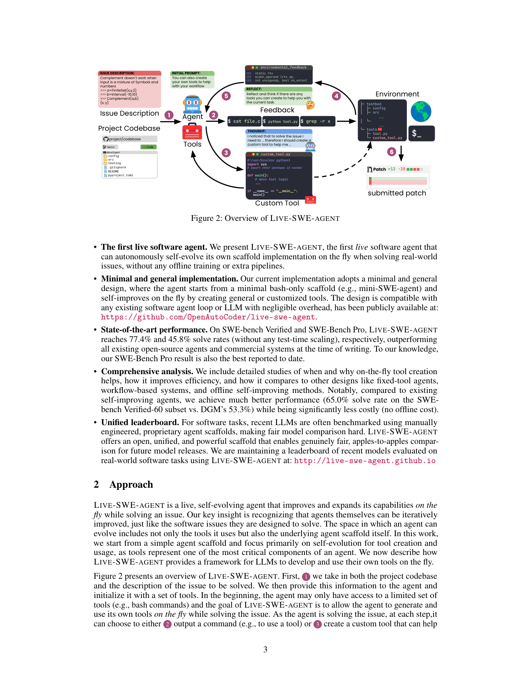
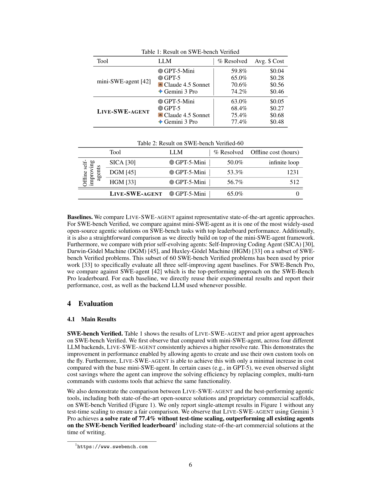

`live_swe_agent | LIVE-SWE-AGENT: Can Software Engineering Agents Self-Evolve on the Fly? | UIUC（Chunqiu Steven Xia, Zhe Wang, Yan Yang, Yuxiang Wei, Lingming Zhang；OpenAutoCoder 团队，Agentless/ChatRepair 同谱系）| arXiv:2511.13646v3 [cs.SE], 2025-11-24 | 主题线：自进化 SWE Agent / 在线 harness 进化（L? = harness-自进化线）· 相关性 高（"运行时自进化 scaffold" 的代表作，且与 DGM 离线进化形成正面对照）`

══ 第一层：一眼看懂 [light] ══

- 🟦 **TL;DR**：【原文 §1-§2】要解决的问题:现有 SWE Agent 的 scaffold(工具集、工作流)都是**人工预设、静态固定**的,设计最优 scaffold 成本极高;而已有的自进化 Agent(如 DGM)靠**离线训练**——在某 benchmark 上反复改自己代码再用离线评测验证,单次 DGM 跑 SWE-bench 约 **\$22,000**,且进化出的 Agent 会**过拟合到特定 benchmark/LLM**、泛化差。核心做法:**LIVE-SWE-AGENT——第一个"在解题过程中、运行时实时自进化"的 SWE Agent**。它从最简的只有 bash 的 scaffold(mini-SWE-agent,100 行)起步,**在解 issue 的常规循环里,让 Agent 把"要不要造个工具"当成和"跑测试"一样的一等决策**:每步环境反馈后追加一句轻量"反思 prompt"问它"造/改个工具会不会加速?",Agent 据此即时合成、修改、执行自定义工具(编辑器、代码搜索、领域分析器…)。**不改 agentic loop、不做离线训练、不挑 LLM**。结果:SWE-bench Verified 无 test-time scaling 达 **77.4%**(Gemini 3 Pro),超所有开源与商业 Agent;SWE-Bench Pro 达 **45.8%**(已知最佳)。
- **最巧的一步**:【原文 §2.1 + 消融 Table 4】**把"工具创建"从一次性预处理提升为"贯穿解题、由每步反思触发的迭代决策"**——抽掉这一步(尤其那句反思 prompt)方法就垮:消融显示 `w/o tool creation` 62.0% → `w/o reflection`(只在初始 prompt 提一句能造工具)64.0% → **完整(带每步反思)76.0%**。为什么是它:工具创建和人解 bug 一样是**迭代过程**——必须先理解问题、在解的过程中暴露失败模式,才知道该造什么工具(论文用 MARC 文件分析器举例:开局根本想不到要造它)。一开始就把所有工具造好=固定工具集,既丧失为独特情境定制的机会,又会用过多工具淹没/误导 Agent。

══ 第二层：为什么做（写透） ══

- **研究背景**(§1)：LLM 从代码补全进化到能浏览仓库、跑测试、提 PR 的交互式 Agent(SWE-agent、OpenHands)。同时有"更 agentless"路线(Agentless、Moatless)主张用专门 prompt/workflow 替代复杂 scaffold。
- **解决的具体痛点**(§1)：① 多数 Agent **设计固定、动作空间静态**,即便某任务能从定制中获益也用不上;② 人工设计最优 scaffold 因**设计空间无限**而极难;③ 自进化 Agent(SICA/DGM/HGM)虽能自改 scaffold,但**离线进化成本巨大**(DGM 单次约 \$22k,离线训练 >500 小时)且**烘焙成静态 Agent**,过拟合 benchmark/LLM、泛化差。
- **相关工作 & 各自不足**(§1, §5)：
  - 固定 scaffold(mini-SWE-agent/SWE-agent/OpenHands):动作空间静态,不能为单题定制。
  - workflow/agentless(Agentless/Moatless):用 prompt 工程替代 scaffold 复杂度,但仍是预设流程。
  - **离线自进化(SICA[30]/DGM[45]/HGM[33])**:迭代自改实现 + 离线评测验证 → **昂贵 + 静态 + 过拟合**。这是 LIVE 的直接对标对象。
- **动机链**(§1-§2)：现状(SWE Agent 强但 scaffold 固定)→ 缺陷(人工设计贵、离线自进化更贵且过拟合)→ 关键洞见:**"软件 Agent 本身就是软件,现代 LLM Agent 本就有在运行时扩展/修改自身实现的内在能力"**→ 所以无需离线训练,只要在常规循环里**显式地把工具创建提升为一等迭代决策点,就能解锁这种"隐藏的"在线自改能力**。为什么不用更简单的现成做法(开局造全套工具)?因为工具需求只在解题中随对失败模式的理解而浮现,且固定全集会淹没 Agent(§2.2)。
- **与最近邻(DGM)的 Δ**：【原文 §1, Table 2】和最像的 DGM 差在**"在线 per-task" vs "离线 per-benchmark"**这一个关键点。DGM 离线进化出一个**对所有题通用的静态 Agent**;LIVE **为每道题在线现造定制工具**,任务完即弃(当前版本不跨任务保留)。差异有用:(a) 离线成本归零(0 小时 vs DGM 1231h / HGM 512h);(b) 不过拟合——同一套机制随 LLM 升级越强越受益(Table 5: Claude 4.5 +22.6%);(c) 实测在公平子集 Verified-60 上 **65.0% 碾压 DGM 53.3%**。

══ 第三层：怎么做 + 靠不靠谱 ══

- **方法流水线**(§2, 图2)：
  1. **输入**:项目代码库 + issue 描述 → 初始化 Agent,初始只给 bash(mini-SWE-agent)。
  2. **每步两种动作**:Agent 选择 ② 输出命令(用工具/跑测试) 或 ③ **创建一个自定义工具**(= 环境里可执行的脚本)。工具接口极简:写一个脚本文件即"造",`python tool.py args` 即"用"。
  3. **关键改动:反思注入**——不同于常规框架 ④ 直接把环境反馈给 Agent,LIVE ⑤ 在反馈消息里**追加一句反思 prompt**,让 Agent 复盘过去步骤、判断此刻是否该造/改工具。
  4. **迭代**:循环直到 ⑥ 提交 patch。工具创建**与解题交织**,Agent 可随对失败模式理解的深入持续 refine 工具。
  - 仅靠两处极简改动:初始 prompt(给造工具的指令+示例,并说明"工具目标是帮你解题、可任意专用、无需通用") + 每步反思消息(附录 D)。**不动 agentic loop、不强加 workflow、无离线训练**。
- **逐组件必要性**(消融 Table 4)：
  - **工具创建能力**:去掉→退化为 base mini-SWE-agent，62.0%（最低）。✅有消融。
  - **每步反思**:只在初始 prompt 提"能造工具"(w/o reflection) 64.0%；加每步反思跳到 76.0%。**反思是最大增量(+12pt)**,且能促使造更多、更对题的工具(2.92 → 3.28 个/题)。✅有消融。论文坦言**工具数量与解题率不必然正相关**——重点是"对题",不是"多"。
- **关键机制/直觉**：
  - **为何造工具比直接用 bash 强**(§2.2, 图3/图5)：① bash 命令参数/flag 繁杂,Agent 常需多步链式调用才完成一次搜索→拉长上下文、增时延、易错(老版 grep 不支持 `--exclude-dir`);② 自造工具**目的单一、易用、自带有意义反馈**(如编辑工具会报"替换成功/未找到",而 `sed` 即便没替换成功也返回 success code 误导 Agent);③ 自造搜索工具可**内建"忽略 .git/__pycache__/node_modules + 只显示前 20 条 + 带上下文"**,直接压上下文、减步数;④ 可造 bash 难以企及的工具(MARC 二进制解析器、Go 静态分析器),且脚本可**反复复用**。
  - **t-SNE 工具分析**(图4)：自造工具既有通用簇(edit/view/search)又有**问题/仓库/语言专属簇**(openlibrary 的专用数据解析工具),证明"一套工具打天下"次优。
- **实验与证据**：
  - 设置:基于 mini-SWE-agent;默认 Claude 4.5 Sonnet;每题 1 patch,max 250 步 / max \$3。
  - 数据集:**SWE-bench Verified**(500 题,人工验证)、**SWE-Bench Pro**(731 题,11 仓库 4 语言,企业级更难)、SWE-bench Multilingual(50 题子集,9 语言)。
  - **支撑核心主张的关键实验**:① **Table 2(对标离线自进化)**——Verified-60 子集 LIVE 65.0% @ **0 离线小时** vs SICA 50.0%(死循环)/ DGM 53.3% @ 1231h / HGM 56.7% @ 512h;**+8.3pt 且零离线成本**,这是全文最硬的差异化证据。② **Table 1**:四种 backend LIVE 一致超 base mini-SWE-agent(70.6%→75.4% @ Claude4.5,74.2%→77.4% @ Gemini3Pro),**成本几乎不增**(有时 GPT-5 反而省钱,因复杂多步命令被工具替代)。③ **Table 3**:SWE-Bench Pro 45.8% > SWE-agent(近 7000 行手工 scaffold)43.6%。
  - **baseline 公平性**:【推断,依据 §3-§4】较公平——直接 build on mini-SWE-agent 做同条件对比;对标离线自进化用了 prior work[33] 选定的同一 Verified-60 子集 + 复用其报告数;图1 只报单次无 test-time scaling 以求 apples-to-apples。
  - **"看着强但没回答核心问题"的隐忧**【推断】:主结果(图1)的 77.4% 用 **Gemini 3 Pro**,而消融/对标用 Claude 4.5 或 GPT-5-Mini,backend 不统一,读者易混"是 LIVE 的功劳还是更强模型"。论文 Table 5 部分回应了这点(同模型对比有相对增益),但 SOTA 数字与机制贡献的归因仍需读者自己分离。
- **假设与失效边界**：
  - 【原文 §4.3, Table 5】**强依赖底座 LLM 的高层推理能力**:**弱模型反而变差**——GPT-5-Nano 用 LIVE 后 **-68.2%**(从 44%→14%,因为它理解不了"造工具"的目标、卡在循环里);GPT-5-Mini 也 -3.3%。**越强的模型增益越大**(Claude 4.5 +22.6%)。这是明确的失效边界:LIVE 是"为强模型解锁隐藏能力",不是给弱模型补能力。
  - 【原文 §4.4】**当前不跨任务**:每题进化出的工具任务完即弃,未保留复用(作者列为 future:可用 Skills[5] 概念序列化保存跨任务复用)。
  - 【推断】绑定可执行沙箱环境(工具=可跑脚本),对无代码执行环境的任务不直接适用;且 250 步/\$3 预算下,造工具占的步数预算与解题预算竞争(论文未深入量化此 trade-off)。
- **祛魅总结**：
  - **真贡献(硬货)**:(a) 一个**极简(两处 prompt 改动)、通用(任意 scaffold/LLM)、零离线成本**的运行时自进化机制,且**SOTA 数字硬**(Verified 77.4% / Pro 45.8%);(b) **最有说服力的是把"在线 per-task 进化"与"离线 per-benchmark 进化"做正面成本-效果对照**(Table 2),证明"on-the-fly 现造工具" 既更便宜又更强;(c) 诚实的失效边界(弱模型变差)和工具 t-SNE 分析。
  - **包装/营销成分**【推断】:(1) "first live self-evolving agent" 的"first"是营销话术——其"自进化"**当前仅限工具创建**(§2.1 自承),并非进化整个 scaffold/系统 prompt/workflow(那些都列在 future work);所谓"修改自身 scaffold"实际是"在固定 loop 内生成可执行脚本",scaffold 本体(loop)反而**没动**(§2.1 明说 leaves underlying scaffold unchanged)。措辞上"self-evolve scaffold"与"unchanged scaffold"略有张力。(2) 主结果用最强 backend 取 SOTA,有 cherry-pick 嫌疑(见上)。(3) 把它定位为"unified leaderboard / 公平评测 scaffold" 是合理但顺带的副产品主张。

══ 结构化抽取 ══

- 🎯 **机制速览 6 轴** [light]：

| 维度 | 取值 |
|---|---|
| **学什么信号** | 环境 reward（测试/执行反馈）+ **自反思**（每步反思 prompt 判断是否造工具）；**无人类标注、无离线 benchmark 信号** |
| **改什么** | **harness（工具/动作空间）** —— 运行时合成/修改可执行脚本工具；**不改参数、不改 agentic loop、不改 system prompt**（后两者列为 future） |
| **何时改** | **在线 per-step**（解题循环内每步反思后即时造/改工具，与解题交织） |
| **免梯度?** | **是**（纯推理时、零训练；§4.4 提到"自进化也可扩到 LLM 训练"但本文未做） |
| **记忆-技能生命周期** | 写入=造脚本工具 → 检索/使用=同会话内 `python tool.py` 复用 → 遗忘=**任务结束即弃**（不跨任务持久化；future 拟用 Skills 序列化保存）→ 共享=无 |
| **防遗忘机制** | **不适用**（无参数更新，故无参数遗忘问题；工具是外化于环境的脚本，天然隔离）。跨任务无积累 → 也无"旧能力被新进化覆盖"之虞 |

- ⑦ **开源代码 + 框架/harness**：**已开源**。代码 https://github.com/OpenAutoCoder/live-swe-agent ；leaderboard http://live-swe-agent.github.io 。**框架/harness**:基于 **mini-SWE-agent**(100 行 bash-only scaffold)构建,保留其默认超参(max 250 步 / max \$3/题);非 veRL/TRL 等训练框架(本工作无训练,纯 agent scaffold 层)。〔仓库未 clone——本子代理仅负责 PDF 深读;代码链接已记录供手动获取。〕
- 💰 **资源/成本与可扩展性**：【原文】**离线成本 = 0 小时**(对比 DGM 1231h / HGM 512h / DGM 单次约 \$22k);在线推理成本**≈ base mini-SWE-agent**(Table 1:Claude4.5 \$0.56→\$0.68,Gemini3Pro \$0.46→\$0.48,GPT-5 甚至略省到 \$0.27);每题预算 max \$3 / 250 步。**可扩展性强**:与任意 scaffold/LLM 兼容,随底座 LLM 增强而增益放大(但弱模型反受损)。
- 🎯 **对「探索-巩固」idea 对标** [light]：**可借组件 + 竞品对照**。
  - **可借组件/支撑**:(a) **"反思 prompt 把'巩固动作'提升为一等迭代决策点"** 这一机制可迁移——本项目 TSRD 的"path-recovery 单点接管 / 关键步巩固"也可设计成"由高熵/低置信触发的显式决策点",与 LIVE 的"每步反思触发造工具"同构;(b) "造工具=在线扩展动作空间"是**免梯度、test-time 的能力增长**,与本项目"探索阶段"的精神一致;(c) 它的 t-SNE 工具分析方法可借来分析"巩固产物"的通用 vs 专用分布。
  - **竞品对照(重要)**:LIVE 给出了一个**强论据反对"巩固进权重"**——它证明"零参数更新、纯运行时外化(造工具)" 就能在 SWE 任务上超过离线进化与商业 Agent。【推断】这对本项目"MTP+OPD 把推理巩固进参数"是反方证据:既然外化工具如此便宜有效,为何要训参数?**本项目的差异化回应应是**:LIVE 明确**不跨任务保留**、且**弱模型用不了**(需强底座推理),而 MTP+OPD 的目标恰是把推理能力**沉淀进参数以跨任务持久、并提升弱模型本身**——这正是 LIVE 的两个失效边界,可作为本项目的立足点。
  - **缺口**:LIVE 完全不碰"推理过程的巩固"(它巩固的是工具/动作空间,不是 CoT 路径选择/恢复能力);也无防遗忘/跨任务积累机制。这些都是本项目可补的空白。
- 🔭 **开放问题/未来方向**：
  - 【原文 §4.4】① **更一般的在线自进化**:从造工具扩到改 system prompt、环境交互方式、乃至整个 workflow/agentic loop(因"Agent 本身就是软件");② **跨任务自进化**:用 Skills 概念序列化保存有用工具与洞见,下次加载复用 → 持续跨任务进化(不再用完即弃);③ **训练期自进化**:把"在线造工具/改 scaffold"作为额外学习信号融入 LLM 训练,使模型学会动态造工具、适配多种 scaffold;④ 扩到测试生成、漏洞检测与修补、从零合成软件(需更专用工具如反编译器/profiler);⑤ 作为统一公平评测 scaffold(同时考核 LLM 的工具创建 + issue 解决能力)。
  - 【推断】最值得本调研串联的:**②跨任务保留 + ③训练期内化** 正是从"纯外化(LIVE 当前)"走向"外化+参数巩固(本项目)"的桥梁——LIVE 自己也把"内化进训练"列为方向,印证本项目方向的合理性。
- 🖼 **关键图 top-2** [light]：

· 这是**原文 Figure 2**(整页 p.3 渲染)。展示完整 pipeline:①取代码库+issue → Agent 初始仅 bash → 每步② 出命令 或 ③ 造自定义脚本工具 → ⑤ 反思 prompt 注入环境反馈("Reflect and think if there are any tools you can create") → ⑥ 提交 patch。**选它因为一图说清本文唯一核心机制**(把工具创建提升为反思驱动的一等在线决策),是方法主图。

· 这是**原文 Table 1 + Table 2**(整页 p.6 渲染)。Table 1:四 backend 上 LIVE > mini-SWE-agent 且 avg cost 几乎不变;**Table 2 是全文最硬证据**——Verified-60 上 LIVE 65.0% @ **0 离线小时** vs SICA 50.0%(死循环)/DGM 53.3%@1231h/HGM 56.7%@512h。**选它因为它同时量化了"在线 vs 离线自进化"的成本-效果对照**(本文核心卖点)与跨 backend 一致增益。

---
〔元数据核验〕arXiv:2511.13646v3，cs.SE，标题/作者(Chunqiu Steven Xia 等,UIUC)/日期(2025-11-24)/GitHub 链接(OpenAutoCoder/live-swe-agent)均来自下载 PDF 正文首页与正文,非 WebFetch。关键数字(77.4% / 45.8% / Table2 的 65.0%/53.3%/56.7%/50.0% 与 1231h/512h / DGM \$22k / 消融 62.0%→64.0%→76.0% / 弱模型 GPT-5-Nano -68.2%)均直引正文 Table 1-5 与 §1/§4。图号(Figure 2 / Table 1-2)直引。
