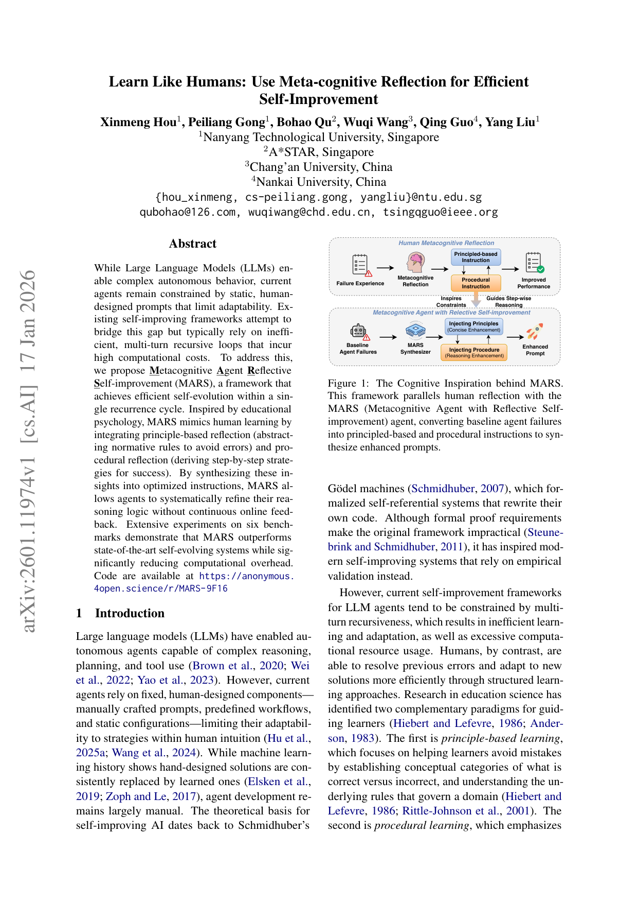
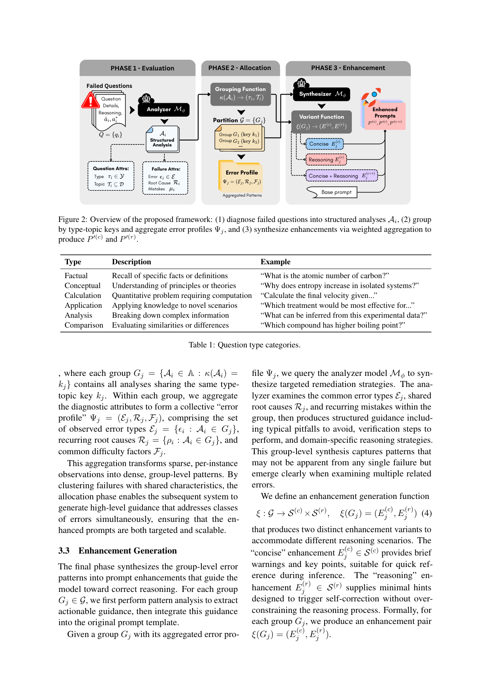

`mars | MARS: Learn Like Humans — Use Meta-cognitive Reflection for Efficient Self-Improvement | NTU 新加坡 + A*STAR + 长安大学 + 南开 | 2026-01(arXiv:2601.11974v1) | L? 自进化 agent/prompt 优化（免训练、单轮反思）· 相关性 High`

> 档位：**deep**（全字段三层 + 结构化抽取）。所有内容基于已下载 PDF 正文（_txt_mars.txt，全文 + 附录 A-F）。

══ 第一层：一眼看懂 [light] ══

- 🟦 **TL;DR**：现有自进化 agent(Reflexion/ADAS/Gödel Agent 等)大多靠**多轮递归循环**反复改，又慢又费算力。MARS 借**教育心理学的元认知学习**——人学得快是因为同时用"**原则学习**(归纳什么对/错的规范规则去避坑)"和"**程序学习**(从成功经验提炼一步步策略)"——让 agent **在单个改进周期内一次性自进化**。流水线三段：**①Evaluation**：分析器 Mφ 把每道做错的题诊断成结构化分析 Aᵢ=(题型 τ、主题 T、错误类型 ε、根因 ρ、具体错点 µ)；**②Failure Allocation**：按"题型×主题"键 κ 把同类失败聚成组 Gⱼ，得到组级错误画像 Ψⱼ；**③Enhancement Generation**：为每组合成两类增强——**原则型 E^(c)**(简洁警示，避坑)+**程序型 E^(r)**(推理步骤指引)，加权融合进基础 prompt P → 得增强 prompt P'^(c)、P'^(r)。**全程不更新参数，只优化 prompt**。六个 benchmark 上超过 SOTA 自进化系统、且迭代次数/算力更省。

- **最巧的一步**：**"把零散的 per-instance 失败按(题型×主题)聚合成 group-level 错误画像，再针对'类'而非'单例'生成增强"** 这一 Allocation 步。抽掉它(退回逐题反思)，就回到 Reflexion 式低效逐例修补、且增强无法规模化。它把"稀疏散点观测→稠密群体模式"，是"单周期就够"的效率来源。次关键是**双路反思(原则 vs 程序)分离**——对应人类元认知两支，缺一则只会避坑或只会复制成功、不能兼得。

══ 第二层：为什么做（写透，重点） ══

- **研究背景**：LLM 已能驱动复杂推理/规划/工具调用的自主 agent，但**当前 agent 受制于静态、人手设计的 prompt/工作流/配置**，适应性被框死在人类直觉之内。ML 史一再表明"手工方案终被学习方案取代"(NAS 等)，但 **agent 开发仍主要靠人手**。自改进 AI 的理论源头是 Schmidhuber 的 Gödel machine(自指改写代码),其形式化证明要求不实际,催生了靠经验验证的现代自改进系统。【原文 §1】

- **解决的具体痛点**：**现有自改进框架受"多轮递归"拖累——学习/适应低效、算力开销过大**。反思类(Reflexion/RISE)靠推理时递归或记忆检索;代码进化类(ADAS/Gödel Agent/DGM)需要复杂验证环境且要 25-30 轮迭代。**反观人类:通过结构化学习能更高效地纠错并适应新解法**——教育学早就指出两条互补范式:**原则学习**(建立"什么对/错"的概念类别、理解领域底层规则去避错)与**程序学习**(用先验经验+逐步推理提高成功率),且**人最受益于通过系统反思把两者整合**。元认知研究表明"显式分析什么有效/什么失败/为什么"显著提升学习效率与迁移;productive failure 研究表明在恰当引导下从自己的错误中学比直接灌输更深。【原文 §1】

- **相关工作 & 各自不足**(§2 两类)：
  1. **verbal reflection 派**(Reflexion/RISE/Agent-Pro)：Reflexion 生成自然语言批评存进 episodic memory;RISE 训练模型多轮检测纠错(微调内化)。但**主要靠推理时递归或记忆检索,而非永久的参数/prompt 优化**。
  2. **结构化自修改派**(ADAS/AgentSquare/Gödel Agent/DGM/SICA)：用 meta-agent 迭代生成评估新 agent 设计(代码);全自指方法让 agent 改自己源码。但**反思类依赖昂贵的多轮递归循环,改代码类需要复杂验证环境**。
  共同瓶颈:**效率**。MARS 的差异化定位:**从人类元认知理论出发,单周期内完成高效自改进**。【原文 §2 末】

- **动机链**：现状(自进化 agent 兴起) → 缺陷(多轮递归→低效+高算力,且常常还跑不过精心设计的人工 prompt) → **人类启示:原则+程序双路 + 系统反思 = 单次就能高效学** → **所以把失败聚合成群体模式、双路合成增强、单周期注入 prompt** → 为什么不用多轮递归?因为它有"迭代次数的乘性成本"+"上下文随轮次增长"两个硬伤(附录F:ADAS 25 轮~\$300、Gödel Agent 30 轮~\$15 且历史记忆持续膨胀)。为什么不训参数?因为要免训练、低成本、即插即用(prompt 层)。【原文 §1+§2+附录F】

- **与最近邻工作的 Δ**：
  - **vs Reflexion**：Reflexion 逐 episode 生成 verbal 反思存记忆、推理时递归检索;MARS 的关键 Δ 是**(a)把失败按类聚合做群体级诊断而非逐例、(b)单周期一次性合成增强而非多轮递归、(c)双路(原则/程序)分离**。
  - **vs Gödel Agent / ADAS**：它们改 agent 架构/代码、需 25-30 轮递归+验证环境;MARS 只改 prompt、单周期、无验证环境,成本数量级更低(附录F)。原文还强调一个反直觉发现:**精心设计的人工 prompt(Self-Refine 36.4%)本就超过 instruction-free 递归优化(Gödel 34.9%/ADAS 34.6%)on GPQA**——质疑"全自动递归"的必要性。
  - **vs RISE**：RISE 把自纠错微调进权重;MARS **完全不动权重**,把"学到的纠错知识"固化进 prompt 增强。

══ 第三层：怎么做 + 靠不靠谱 ══

- **方法流水线**(图2 + Alg.1)：输入失败题集 Q={qᵢ}、真值 a*、预测 â、基础 prompt P、分析器 Mφ、错误分类法 E →
  ① **Phase1 Evaluation(§3.1)**：对每道错题独立诊断,产出结构化分析 Aᵢ=(τᵢ 题型, Tᵢ 主题, εᵢ 错误类型, ρᵢ 根因, µᵢ 具体错点)。题型 τ∈{factual/conceptual/calculation/application/...}(表1 六类),错误类型 ε∈E(表2 六类:概念误解/计算错/误读/分析不全/错误排除/知识缺口)。**强制唯一性规则**:每个失败只归一类,多模式共现时归到推理链最早发散点。
  ② **Phase2 Failure Allocation(§3.2)**：用分组函数 κ(Aᵢ)=(τᵢ,Tᵢ) 把分析按"题型×主题键"切成组 Gⱼ;每组聚合诊断属性成**错误画像 Ψⱼ=(Eⱼ 错误类型集, Rⱼ 复现根因, Fⱼ 难度因子)**。这步**纯计算无 API 调用**,把稀疏散点→稠密群体模式。
  ③ **Phase3 Enhancement Generation(§3.3)**：对每组查 Mφ 合成增强函数 ξ(Gⱼ)=(E^(c)ⱼ, E^(r)ⱼ)——**concise 原则型**(简短警示+要点,快速参考)+**reasoning 程序型**(最小提示触发自纠错、不过度约束)。按组规模加权 wⱼ∝|Gⱼ| 融合进 P:P'^(c)=P⊕ΣwⱼE^(c)ⱼ, P'^(r)=P⊕ΣwⱼE^(r)ⱼ(式5)。
  ④ **Hybrid 策略(§3.3 末,式6)**：数据集按 8:1:1 切 train/val/test;train 集生成增强,**val 集为每个类别 c 选最优增强类型** E*_c=argmax Acc(E,Vc),应用到 test 集对应类别。
  输出:增强后的 prompt(P'^(c)/P'^(r)/Hybrid)。

- **逐组件必要性**(消融见表4/5,Concise/Reasoning/Concise+Reasoning 三种作为消融基线)：
  - **群体聚合(Allocation)**：是"单周期就够"的核心,但**无直接"去掉聚合"消融**(它是方法定义性步骤);其价值通过"单周期 vs 多轮递归成本对比"(附录F)与主结果(超 Gödel)间接论证。
  - **双路增强(Concise vs Reasoning)**：**有消融**(表4/5)。Reasoning 在推理密集任务上一般优于 Concise;但 **Concise+Reasoning 朴素组合常不如单独用**(GPQA+Self-Refine:32.7% vs Reasoning 40.9%),作者解释为"朴素组合产生干扰"——**这恰恰反证了双路需要 Hybrid 智能选择而非简单相加**。
  - **Hybrid(按类选最优)**：**有消融**,且**一致取得最大增益**(DROP +6.4~7.1、MMLU+Self-Refine +15.8、GPQA+Self-Refine +12.7),验证 category-aware 选择的价值。
  - **强制唯一错误归类**：保证分组一致性的设计选择,无单独消融。
  - **加权融合(wⱼ∝|Gⱼ|)**:优先大组的纠正知识,无单独消融。

- **关键机制/公式直觉**：
  - **type-topic 分组键 κ(式2)**：直觉是"热力学计算题的错因 ≠ 分子生物概念题的错因,要分开治"。把失败按"题型×主题"切,使同组共享纠正策略,从而生成的增强**既精准又可规模化**(对一类错而非一个错)。
  - **错误画像 Ψⱼ(式3) + 群体合成**：直觉是"单个失败看不出的模式,一堆相关失败放一起就显现了"。把组级 (错误类型集/根因/难度) 喂给合成器,产出"典型陷阱/验证步骤/领域推理策略"。
  - **双路对应人类元认知**：原则型=避坑(约束),程序型=复制成功(引导逐步推理)——直接映射教育学的 principle-based vs procedural learning。
  - **Hybrid argmax(式6)**：用 val 集实测"哪种增强对这个类别最有效"再迁到 test,直觉是不同类型问题适配不同增强(避免一刀切)。

- **实验与证据**：
  - **数据集/设置**：六 benchmark——推理类 DROP(F1)/MGSM(250 题多语数学)/Omni-MATH(4428 奥数);知识类 MMLU(57 科)/GPQA(研究生级 Google-proof)/HLE(2500 专家级,逼近 floor)。DROP/MGSM/MMLU/GPQA 用 **gpt-3.5-turbo**(与基线对齐),Omni-MATH/HLE 用 **gpt-4o**(更强);分析/合成默认模型见附录 Table 9(默认 GPT-4o、评估 o3-mini、max 2000 token)、正文成本估算用 gpt-3.5-turbo。T=0,Self-Consistency n=5 @T=0.7。【原文 §4 + 附录C/F】
  - **核心主张证据**：(1) 表4 **Hybrid 一致取得最大增益**且**Self-Consistency+Hybrid 在三个 benchmark 超 Gödel Agent**(DROP 86.2 vs 80.9、MGSM 74.3 vs 64.2、MMLU 72.5 vs 70.9);(2) Self-Refine+Hybrid 在 GPQA 达 49.1%(远超 Gödel 34.9%);(3) 表5 在最难的 Omni-MATH/HLE 上仍有提升(HLE Self-Refine+Hybrid 7.10%,相对 +54.3%)。
  - **成本证据**(附录F)：MARS 单周期、固定输入、用 GPT-3.5 分析合成——~200 次诊断调用+~40-60 次合成调用;vs ADAS 25 轮~\$300、Gödel 30 轮~\$15(且历史记忆膨胀)。**省算力是硬证据。**
  - **增益机理分析**(§5+表6)：基线性能与增益呈**显著负相关**(Spearman ρ=−0.654,p<0.001);但**category-dependent**:知识类强负相关(ρ=−0.795)、推理类无显著相关(ρ=0.264)——说明知识任务在低基线处获益最大、推理增益跨难度均匀。还发现 **SC+单轮MARS 在推理任务上放大增益**(7.31% vs 2.66%,p=0.050)。
  - **baseline 公平性**：与 Gödel/ADAS 比(†标注引自原论文),且把 Concise/Reasoning/C+R 作为消融基线隔离各增强贡献。**相对公平,但 Gödel/ADAS 数字直接引用而非自跑复现**。
  - **"看着强但需警惕"的点**：(1) 主结果是 **prompt 增强叠加在已有 prompting 方法(Zero-shot/CoT/Self-Refine/SC)之上**的增量,绝对增益在难任务上很小(HLE 才 3-7%、Omni-MATH 23-35%);(2) 超 Gödel 主要靠 **Self-Consistency/Self-Refine 这些本身就强的底座 + Hybrid**,纯 Zero-shot+Hybrid 在 GPQA 才 20%;(3) **Hybrid 需要 val 集调参**(8:1:1 切分),不是纯 zero-shot 改进——这削弱了"免训练即插即用"的纯度;(4) Concise+Reasoning 朴素组合常掉点,说明双路整合并不平凡。

- **假设与失效边界**：
  - 【原文 Limitations 1】**预定义错误分类法(6 类)只对"有明确正确答案的结构化 benchmark"有效**——开放/创意任务里错误更主观、不可分类,需更灵活的分类方案。
  - 【原文 Limitations 2】**单周期用深度换效率**——一次 pass 能改进的幅度有限;追求极致性能需迭代应用 MARS(用增强 prompt 产新失败集再提炼)。
  - 【推断,依据 §3.1 强制唯一归类】**强依赖分析器 LLM 能可靠诊断错误类型/根因并归到唯一类别**——分析器弱或错误模式跨类共现时,群体画像会失真。
  - 【推断,依据 prompt 注入本质】增强**不进权重**,能力提升受 prompt 长度/上下文窗口与基模理解力上限约束;最优增强类型 task-dependent(附录D),无通用最优。

- **祛魅总结**：
  - **真贡献(硬货)**：(1) **"群体聚合失败→双路合成增强→单周期注入"** 是相对 Reflexion 逐例递归的实质效率升级,附录F 的成本对比(数量级低于 ADAS/Gödel)是硬证据;(2) **双路反思(原则/程序)** 对应人类元认知,且实测发现"朴素组合会干扰、需 Hybrid 智能选"是有价值的负面发现;(3) §5 的增益机理分析(知识 vs 推理任务增强机制不同、SC 放大效应)是细致的实证洞察。【推断】
  - **包装/营销成分**：(1) "Learn Like Humans/元认知"的包装很重,本质是**结构化的失败聚类 + 按类生成 prompt 增强**——一个相当工程化的 prompt 优化 pipeline;(2) **绝对增益在难任务上很小**(HLE 3→7%),"超 SOTA"主要靠叠在 Self-Consistency/Self-Refine 强底座上 + Hybrid 选择,而 Hybrid **需要 val 集**(8:1:1),并非纯免训练即插即用;(3) 与 Gödel/ADAS 的对比用了对方报告的数字而非统一复现,且对比的"成本"是估算;(4) 它**不进权重**,所以拿不到泛化/容量上的参数收益,本质是 prompt 层的一次性优化。【推断】
  - 作者**较诚实**：Limitations 点到了分类法不通用、单周期换深度两个要害,并自己提示"追求极致性能可迭代应用"。【推断】

══ 结构化抽取（供全景汇总，必填） ══

- 🎯 **机制速览 6 轴** [light]：

| 维度 | 内容 |
|---|---|
| **学什么信号** | **自反思(对 baseline 失败轨迹的结构化诊断)**：分析器从错题中抽错误类型/根因/错点，再聚类成群体错误模式；**无环境数值 reward、无人标**(靠对/错答案触发分析；Hybrid 用 val 集 accuracy 选增强类型) |
| **改什么** | **prompt**(把原则型+程序型增强加权注入基础 prompt)；**不改参数、不写持久记忆库** |
| **何时改** | **离线批量、单轮(single recurrence cycle)**——一次性聚合全部失败→生成增强，刻意避开多轮递归 |
| **免梯度?** | **是**(纯 prompt 工程；用 GPT-4o/gpt-3.5-turbo 做 agent、o3-mini 做评估、Qwen2.5-72B 也可，全程无梯度) |
| **记忆-技能生命周期** | 弱：群体错误画像 Ψⱼ + 增强模板算一种"经验固化进 prompt"，但**一次性合成、非可检索/可遗忘的动态库**；无共享机制 |
| **防遗忘机制** | **不适用**(无参数更新)；单轮设计本身规避了多轮递归的漂移/累积错误 |

- ⑦ **开源代码 + 框架/harness**：开源(匿名)，https://anonymous.4open.science/r/MARS-9F16 。**无训练框架**——纯 prompt 优化 harness(分析器 Mφ→分组函数 κ→合成器 ξ→加权融合);所有 prompt 用 XML 风格 `<reasoning>/<answer>` 标签。默认 agent 模型 GPT-4o、评估模型 o3-mini、max 2000 token、超时 30s(附录 Table 9);成本估算用 gpt-3.5-turbo;增强生成可换 Qwen2.5-72B-Instruct-Turbo(附录D 验证泛化)。**判定：免训练 / 自研 prompt 框架。**【原文 §4 + 附录C/D】
- 💰 **资源/成本与可扩展性**：核心卖点即**省算力**——单周期 vs 多轮递归。附录F:典型 benchmark ~200 失败题→~200 次诊断 API + ~15-20 组→~40-60 次合成 API,用 GPT-3.5(\$0.0005/1K in、\$0.0015/1K out);vs ADAS 25 轮~\$300、Gödel 30 轮~\$15(历史记忆膨胀)。三大省成本设计:单周期(无迭代乘性成本)、无增长上下文(固定输入)、用 GPT-3.5 做分析/合成。【原文 附录F】

- 🎯 **对"探索-巩固"idea 对标** [light]：**竞品(prompt 侧) + 可借组件**。MARS 把"巩固"做在 **prompt 层而非权重层**——与你"参数化巩固(MTP+OPD)"是不同路线的竞品(它免训练、也就拿不到泛化/容量上的参数收益)。但其**"原则型(避坑) + 程序型(复制成功路径)"双路反思**与你"path-selection(选对路) + path-recovery(从错路恢复)"高度可类比,**结构化失败诊断(错误类型 ε/根因 ρ/具体错点 µ)** 可直接借为构造 path-recovery 训练数据的标注 schema;**按(题型×主题)聚类失败再批量生成纠正策略**可迁移为"按错误模式分桶、对每桶单点接管"的数据组织法;**"朴素组合双路会干扰、需 Hybrid 选择"** 是对"path-selection+path-recovery 如何融合"的一个警示。

- 🔭 **开放问题/未来方向**：
  - 【原文 Limitations】把错误分类法扩到开放/创意任务(更灵活的分类);**迭代应用 MARS**(用增强 prompt 产新失败集再提炼)以换更高性能。
  - 【推断】把"按类选增强(Hybrid)"从 val 集调参做成在线自适应;把 prompt 层增强固化为可检索/可遗忘的动态经验库;用前瞻信号(MTP)替代"事后失败诊断"来更早识别错误模式。

- 🖼 **关键图 top-2** [light]：
  
  这是**原文图1**：动机/灵感图，把"人类元认知双路学习"与 MARS 把 baseline 失败转成原则型+程序型增强并列。选它因为它点出了本文最核心的"像人一样学"直觉。
  
  这是**原文图2**：方法主图，三阶段(Evaluation→Allocation→Enhancement)流水线全貌 + 下方题型分类表。选它因为它完整呈现"失败→结构化→分组→增强"的工程链路。
