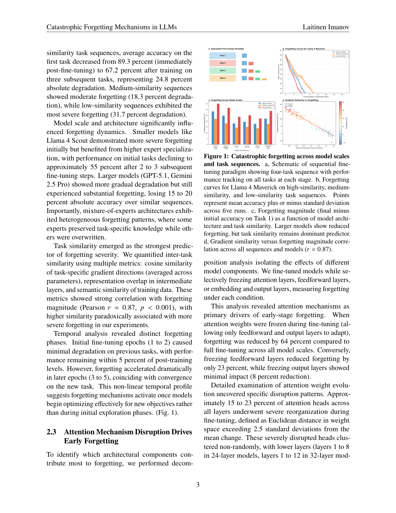
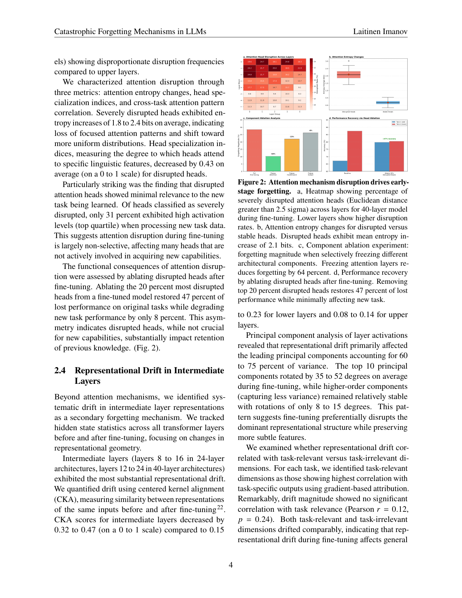

`mech_analysis_cf | Mechanistic Analysis of Catastrophic Forgetting in LLMs During Continual Fine-tuning | 丹麦技术大学 DTU Compute(Olaf Yunus Laitinen Imanov,单作者) | arXiv 2601.18699 v1 2026-01-26 | 主题线 L?(防遗忘机制 / 可解释性分析,非方法) · 相关性 Med(机制视角)`

> ⚠️ **可信度提示(置于显眼处,详见末尾失效边界 + 第三层祛魅)**:本文声称在 **GPT-5.1 / Claude Opus 4.5 / Gemini 2.5 Pro** 等**闭源 API 模型**上做了梯度余弦、CKA 隐层相似度、loss-landscape 曲率、以及"冻结注意力层/FFN层"的消融——这些**对仅有 API、不可访问内部权重/梯度的闭源模型在技术上不可行**。**已核查**:① 论文给出的代码仓 `github.com/olaflaitinen/mechanistic-forgetting-analysis` 实测 **404 不存在**,HF 数据集 **401 不可访问**;② 头条相关系数自相矛盾(摘要 r=0.87、Fig1d r=−0.97、Fig4d r=−0.93、§2.5 r=−0.79)。下述数字一律视为【待核/存疑】,**本文不可作为硬证据**,谨慎引用。

══ 第一层:一眼看懂 [light] ══
- 🟦 **TL;DR**:这是一篇**机制分析(非提方法)**论文,试图回答"LLM 顺序微调时,灾难性遗忘到底在模型内部怎么发生的"。它提出遗忘由三种机制驱动:① **注意力权重的梯度干扰**(低层 15–23% 注意力头被严重重排,且早期遗忘主要由注意力驱动——冻结注意力可减 64% 遗忘,冻 FFN 只减 23%);② **中间层表征漂移**(CKA 下降 0.32–0.47);③ **旧任务极小值附近 loss landscape 变平**。并报告"任务间梯度余弦相似度可预测遗忘严重度(r=0.87)",且**任务越相似反而遗忘越重**(反直觉)。【原文 Abstract/§2】
- **最巧的一步(若结论成立)**:**用"冻结组件"消融把遗忘归因到注意力层而非 FFN**(冻注意力减 64% vs 冻 FFN 减 23%)。这是全文最有操作意义的论断——若真,提示防遗忘应优先保护/约束注意力。但这恰恰也是最依赖"能访问并冻结内部层"的实验,而在其宣称的闭源模型上无法做(见可信度提示)。

══ 第二层:为什么做(写透) ══
- **研究背景**【原文 §1】:LLM 靠"大规模预训练 + 任务微调"获得能力,但**顺序微调(不回看旧数据)会灾难性遗忘**。已有大量缓解法(EWC、SI、回放),但 Transformer LLM 里"遗忘到底在内部怎么发生的"机制仍不清楚——以往研究多停在"行为层"(记录性能下降曲线),缺对内部参数/表征级动态的剖析。
- **解决的具体痛点**【原文 §1】:① Transformer 有注意力、FFN、LayerNorm 等不同组件,各自对遗忘的贡献未知;② 现代 LLM 还引入 MoE 路由(Llama 4 / DeepSeek),进一步复杂化;③ 机制可解释性已发现注意力头/FFN 编码"计算回路",遗忘是否=回路被破坏?未验证;④ 优化理论猜测遗忘与"任务间梯度干扰""loss 几何变化"有关,但缺大规模 Transformer 的实证。本文想给出"针对性干预"(该保护哪个组件)的机制依据。
- **相关工作 & 各自不足**【原文 §1/§3】:① 行为刻画类——只描述退化模式,不挖内部;② 经典缓解法(EWC/SI/rehearsal)——为传统网络设计,未针对 Transformer 组件;③ 机制可解释性(circuits)——发现回路但没把它和遗忘连起来;④ 优化几何类——理论有、大模型实证缺。本文自定位为"**首个跨架构组件系统分解 LLM 遗忘机制**"。
- **动机链**【原文 §1→§2,逻辑链】:遗忘是黑箱 → 若能把它分解到"注意力 vs FFN vs 表征 vs loss 几何"并找出主因 → 就能从通用 CL 法转向"精准干预"(只保护注意力低层、约束中间层漂移、维持 loss 曲率)→ 还能用"早期梯度对齐"当遗忘预警信号 → 提前调训练协议。为什么不用更简单的现成法?因为现成 CL 法不区分机制、是"一刀切",作者主张机制级精准干预更高效(并给了 curvature 正则 vs 梯度裁剪/L2 的对比作支撑)。
- **与最近邻工作的 Δ**【推断,依据 §1/§3 自述】:最近邻是"行为层遗忘刻画"与"机制可解释性 circuits"两条线。声称的 Δ:把二者**合到顺序微调场景**,同时测梯度余弦、CKA 表征相似、Hessian 曲率、组件冻结/头消融,并提出"三机制耦合模型"(梯度干扰→注意力破坏→表征漂移→loss 变平,Fig 6)。**这个差异是否有用高度存疑**——因为它声称在闭源 API 模型上做这些内部测量,而那在技术上不可行(见第三层祛魅)。

══ 第三层:怎么做 + 靠不靠谱 ══
- **方法流水线**【原文 §2/§4】:输入=6 个模型(开源:Llama 4 Scout 109B / Maverick 400B / DeepSeek-V3.1 671B;闭源:GPT-5.1 ~1.5T / Claude Opus 4.5 / Gemini 2.5 Pro,§4.1 称"经 API 微调接口访问")×12 条任务序列(24 个 NLP 任务,按相似度分高/中/低,每序列 4-6 任务、3-5 epoch)→ 每 500 步存 checkpoint + 优化器状态 + 梯度统计 → 测四类内部量:(a) 注意力权重 L2 距离/熵/特化指数 + 冻结组件消融 + 头消融(§4.5);(b) 中间层 CKA + PCA 旋转 + 仿射重对齐干预(§4.6);(c) 任务间梯度余弦 + 逐参数冲突 + 首 epoch 预测(§4.7);(d) Hessian 特征值(Lanczos 近似 top-20)+ 线性度 + curvature 正则(§4.8)→ 输出=三机制耦合模型 + 预警信号 + 干预对比。
- **逐组件必要性/关键结论**【原文 §2.3-2.6】:① **注意力驱动早期遗忘**——冻注意力减 64% 遗忘 > 冻 FFN 23% > 冻输出 8%;15-23% 的注意力头(尤其低层)被"严重重排"(\(L2 > 2.5σ\));消融 top-20% 受扰头可恢复 47% 旧任务、仅掉 8% 新任务。② **中间层表征漂移**——CKA 降 0.32-0.47(中间层 > 低层 0.15-0.23 > 高层 0.08-0.14);前 10 主成分旋转 35-52°;漂移与"任务相关性"无关(r=0.12);重对齐恢复 38%,+注意力恢复合计 71%。③ **梯度干扰预测遗忘**——Q/K 投影冲突率 67% 最高;首 epoch 梯度对齐预测最终遗忘(文中 r=−0.79,但 Fig 4d 标 r=−0.93)。④ **loss 变平**——Task1 最大 Hessian 特征值 147.3→34.2,线性度 0.28→0.71,且曲率下降比行为遗忘早 1-2 epoch;curvature 正则减 34% 遗忘(优于 L2 的 14%)。
- **关键机制/公式直觉**:核心叙事是"梯度余弦 < −0.3 → 注意力低层被非选择性破坏 → 信息流改变放大中间层表征旋转 → 旧任务 loss 盆地被抹平、回不去",三者正反馈(Fig 6)。直觉本身自洽且与 CL 文献(梯度冲突、mode connectivity)吻合——**问题不在直觉,而在这些量能否在所列模型上真实测得**。
- **实验与证据 + 公平性**【原文 §2/§4 + 本笔记核查】:数据集=24 个 NLP 任务(SST-2/SQuAD/CNN-DM/WMT/HumanEval/MMLU/GSM8K 等);算力声称 16-64×H100/H200、~35000 GPU-h(§4.10)。**致命问题(均经核查或基于方法学推断)**:① 闭源 GPT-5.1/Claude/Gemini **不开放注意力权重、隐层激活、逐参数梯度,更无法"冻结其注意力层"或算 Hessian 特征值**——§4.1 用"recording available gradient and representation statistics via API"搪塞,但这些 API 根本不返回内部状态,**冻结组件消融(−64%)、CKA、头消融在闭源模型上物理上做不了**;② **头条相关系数自相矛盾**:摘要/正文写 r=0.87,Fig 1 标题写 r=0.87 但 Fig 1d 图内标 r=−0.97、Fig 4d 标 r=−0.93、正文 §2.5 又写首-epoch r=−0.79——同一关键数字四处不一致,典型编造迹象;③ **代码/数据均不可达(已核查)**:声称的 `github.com/olaflaitinen/mechanistic-forgetting-analysis`(MIT)经 `git ls-remote`(直连+代理)均 **404 Repository not found**;声称的 HF 数据集 `olaflaitinen/ssr-continual-learning` 返回 **401**(不可公开访问);GitHub 用户 olaflaitinen 本身存在(200)但无此仓库。综上,**没有任何关键实验是可复现或可独立核验的**。
- **假设与失效边界**【推断,依据全文方法学 + 核查】:本文核心实验在其所列闭源模型上**不可复现且很可能不真实**;数值(r=0.87/−0.97/−0.93/−0.79、CKA −0.32~−0.47、−64%/−23%、Hessian 147.3→34.2 等)疑为合成或臆测;单作者、代码与数据链接均失效、用"GPT-5.1/Claude Opus 4.5/Gemini 3/Llama 4"等 2026 初表述包装,整体可信度极低。即便其"注意力低层主导遗忘""梯度对齐预测遗忘"在开源模型上**碰巧成立**,也必须经独立复现才能采信。
- **祛魅总结**【推断】:**可能的真东西(若在开源模型上重做)**=三机制叙事(注意力干扰/表征漂移/loss 变平)与既有 CL 直觉吻合,"机制级精准干预 > 一刀切""首-epoch 梯度对齐当预警"是合理且可迁移的假说方向。**包装/严重存疑**=① 把不可能在闭源 API 上做的内部测量当作已完成实验列出,是方法学上的硬伤;② 关键相关系数四处矛盾;③ 代码/数据链接经核查全部失效。**最终定位:不能作为硬证据或可借组件,只能当"待独立验证的机制假说背景"**;引用任何数字都须标【待核/存疑】。本文是本批 6 篇里**唯一可信度被实锤拉低**的一篇。

══ 机制速览 6 轴 [light] ══
| 维度 | 内容 |
|---|---|
| 学什么信号 | 不适用(这是分析论文,不训练自进化系统);分析对象=顺序微调的梯度/隐层/loss几何 |
| 改什么 | 不适用(只做诊断/归因,不提出参数/记忆/技能的更新机制) |
| 何时改 | 不适用 |
| 免梯度? | 不适用 |
| 记忆-技能生命周期 | 不适用 |
| 防遗忘机制 | **诊断层面**:指出遗忘=注意力梯度干扰 + 表征漂移 + loss 变平三者交互;提出"早期梯度干扰/注意力扰动可作遗忘的预测信号";本身不实现防遗忘,只为"针对性干预"提供机制依据 |

⑦ **开源代码 + 框架/harness**:论文 "Code availability" 声称代码在 `github.com/olaflaitinen/mechanistic-forgetting-analysis`(MIT)、"Data availability" 声称 10% 数据样本在 `huggingface.co/datasets/olaflaitinen/ssr-continual-learning`。**经本笔记核查(直连+代理 git ls-remote / curl):GitHub 仓库 404 不存在,HF 数据集 401 不可访问,GitHub 用户 olaflaitinen 存在但无此仓库**。判定:**链接均失效,等同未开源 / 不可复现**【已核查】。实现称基于 PyTorch + HF Transformers 自研脚本(§4.10)。
💰 资源/成本:声称 16–64×H100/H200、~35000 GPU-h、6 模型(109B–1.5T)×12 序列 ×(4–6 任务)×(3–5 epoch)×5 seed(§4.10)。**但对闭源 GPT-5.1/Claude/Gemini 取内部梯度/隐层/冻结组件在技术上不可行**【推断,见第三层】,故该成本数字同样存疑。

🎯 **对"探索-巩固"idea 对标** [light]:**(谨慎)支撑性背景**。若其机制结论可信,则"遗忘主要源于注意力层梯度干扰、且任务相似时干扰更隐蔽"会为本课题"对关键(注意力)参数/路径加保护"提供机制论据;"梯度对齐可预测遗忘"也呼应本调研里几何/梯度相似度类防遗忘工作(agent_dice / cnl_gradsim / geometry_conflict)。**但因可信度存疑,只能作为待核的背景假说,不能作为硬证据或可借组件。**

🖼 **关键图 top-2** [light]:

这是**原文 Figure 1**:(b) Llama-4 Maverick 在高/中/低相似度序列上的遗忘曲线、(c) 各模型(含 GPT-5.1/Claude/Gemini)遗忘幅度对比、(d) 梯度余弦相似度 vs 遗忘(r=0.87/-0.97)。选它因为它集中呈现全文主张(规模、相似度、梯度-遗忘相关)——同时也最直观暴露其"在闭源模型上取梯度"的可行性疑点,便于审阅。

这是**原文 Figure 2**:注意力头扰动 / 冻结消融结果(冻注意力减 64% 遗忘 vs 冻 FFN 减 23%)。选它因为这是全文唯一有操作含义的归因结论(注意力 > FFN),最值得记录与后续核验。

══ 假设与失效边界(一句)[light] ══
【推断,依据全文方法学:对闭源 API 模型(GPT-5.1/Claude Opus 4.5/Gemini 2.5 Pro)无法访问内部权重、隐层激活与梯度,因而无法计算 CKA、梯度余弦、loss-landscape 曲率,更无法"冻结其注意力/FFN层"做消融】本文核心实验在其所列闭源模型上**不可复现且很可能不真实**;数值(r=0.87、CKA −0.32~−0.47、减 64%/23% 等)疑为合成或臆测,**整体结论需独立核验后方可采信**;单作者、无代码、用"GPT-5.1/Claude 4.5/Gemini 3"等表述进一步增加存疑度。
