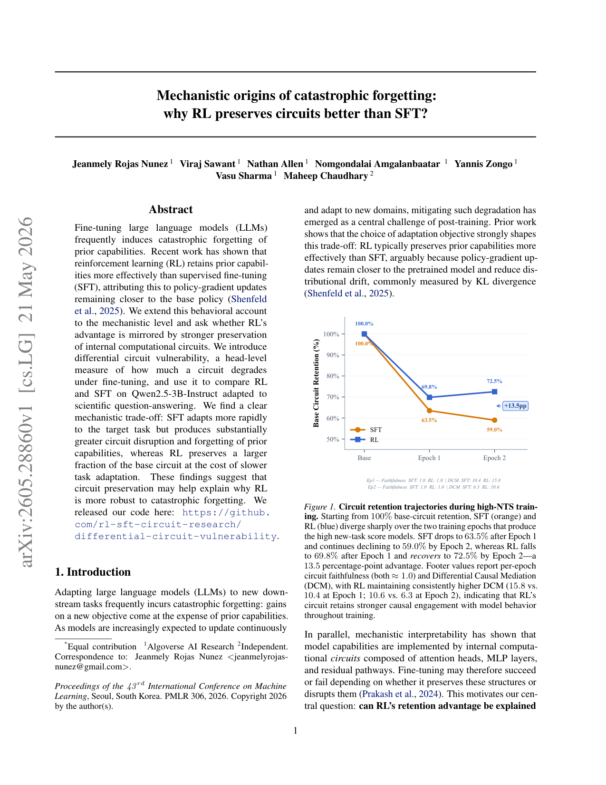
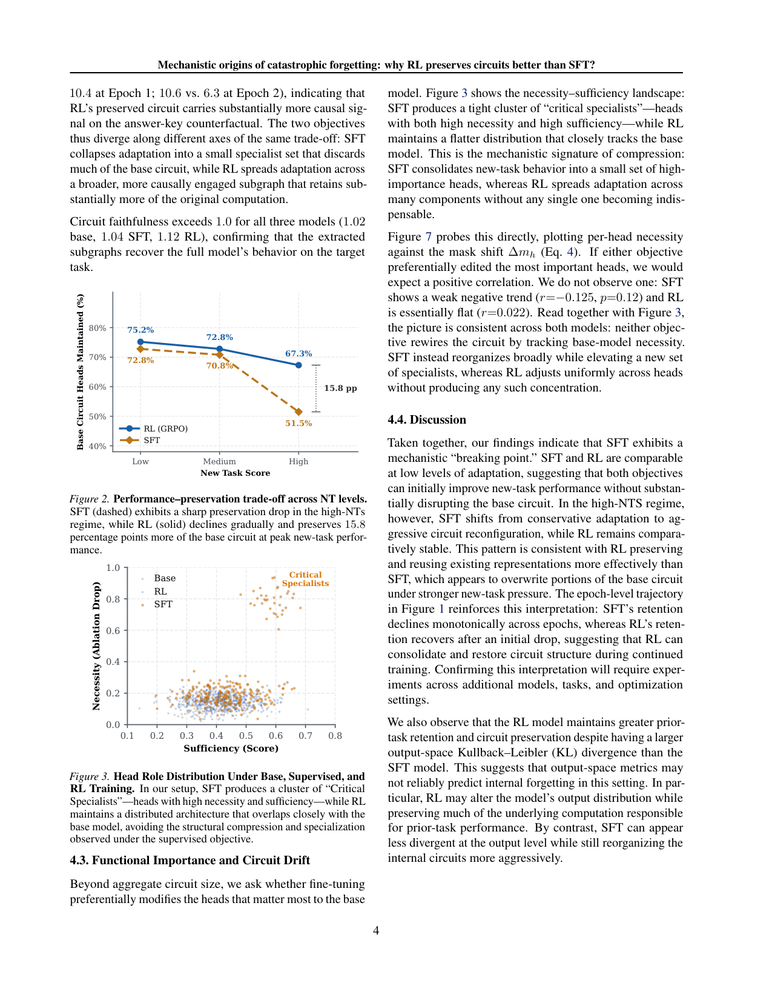

`mech_origins_rl_sft | Mechanistic Origins of Catastrophic Forgetting: Why RL Preserves Circuits Better than SFT? | Algoverse AI Research（Jeanmely Rojas Nunez 等,通讯）+ Independent（Maheep Chaudhary） | 2026-05 arXiv:2605.28860v1 · ICML 2026(PMLR 306) | 防遗忘机理/可解释性 主线 · 高相关（机理层解释 OPD/RL 为何少遗忘）`

> 三标注约定：【原文】=论文直述；【推断】=有据判断(附依据)；【待核】=拿不准的关键事实。

══ 第一层：一眼看懂 ══

- 🟦 **TL;DR**:已知"RL 微调比 SFT 忘得少",但**为什么**?本文从**机制可解释性(circuit)** 角度回答:大模型的能力由内部"电路"(一组注意力头 + MLP + 残差通路)实现。作者提出**differential circuit vulnerability(差异电路脆弱度)**——用 head 级"掩码"(Differential Binary Masking, DBM)量化每个注意力头在微调后被破坏多少。在 Qwen2.5-3B-Instruct 上(任务 A=科学问答 SciKnowEval,任务 B=一堆保持力 benchmark)对比发现:**SFT 像"压缩器"**——把新任务塞进一小撮"关键专家头"、抛弃大量基础电路(基础电路保留 52%);**RL(Dr.GRPO)像"分布式适配器"**——把适配摊薄到很多头、几乎不破坏基础电路(保留 68%);**RL 还在第 2 epoch"回收/修复"被打乱的电路**(保留率 69.8%→72.5%,而 SFT 单调下滑 63.5%→59.0%,差 13.5pp)。代价是 RL 学新任务更慢。【原文 摘要+图1+§4.2】

- **最巧的一步**:用 **DBM 在 base/SFT/RL 三个模型上各自独立发现电路,再做"跨模型电路对比"(faithfulness + mask shift Δm_h + necessity/sufficiency)**。抽掉"跨模型电路比对"这步,就只剩"RL benchmark 掉分少"的行为观察(=已有工作 Shenfeld 2025);正是这步把"少遗忘"从**行为层**落到了**计算结构层**,并能区分"SFT 是压缩成专家、RL 是均摊"这种机制差异(图3)。【原文 §3.2-§3.3, 图3】

══ 第二层:为什么做 ══

- **研究背景**:LLM 后训练适配新任务常引发灾难性遗忘。已知"适配目标(SFT vs RL)强烈影响这个 trade-off",Shenfeld et al.(2025,"RL's Razor")等行为层工作把 RL 少遗忘归因于"policy-gradient 更新离 base 更近、分布漂移(输出 KL)更小"。与此并行,机制可解释性证明模型能力由具体 circuit(注意力头/MLP/残差)实现,微调成败取决于是否保住这些结构(Prakash et al. 2024 显示微调常"改造"而非"替换"已有机制)。【原文 §1, §2】

- **解决的具体痛点**:两套文献(后训练优化 vs 可解释性)**脱节**——优化研究只报 benchmark 结果、不解释遗忘的内部成因;可解释性研究很少比较学习目标。本文要补的洞:**RL 的保持优势,是否对应"对任务相关电路更强的保护"?** 即把"为什么 RL 少遗忘"从行为解释推进到机制解释。【原文 §1 末, §2 Research Gap】

- **相关工作 & 各自不足**:
  - *SFT/RL 与遗忘(行为层)*:Shenfeld 2025、Hu 2025(Open-Reasoner-Zero)——观察到 RL 保持更好,用"距 base 的输出 KL 更小"解释。**不足**:只到输出分布层,没看内部计算;本文恰恰发现该解释在此设置下**被推翻**(见祛魅)。【原文 §2】
  - *机制可解释性/电路*:activation/path patching、masking 把行为定位到稀疏因果子网;Prakash 2024(实体追踪)、Davies 2023(变量绑定)显示微调多为"改造已有机制"。**不足**:几乎不比较不同学习目标(SFT vs RL)。【原文 §2】
  - *保持力评测*:强调要在 MMLU/HellaSwag/WinoGrande(推理)+TruthfulQA/IFEval/HumanEval(事实/指令/代码)等多样 benchmark 上测,因为遗忘是 capability-specific 的。【原文 §2】

- **动机链**:RL 行为上少遗忘(已知)→ 能力由电路实现(已知)→ 那"少遗忘"是否=保住电路?→ 造 differential circuit vulnerability + DBM 量化 head 级破坏 → 三阶段:复现行为差(Phase I)→ 各模型发现电路(Phase II)→ 跨模型比对电路保留/破坏(Phase III)→ 得到"SFT 压缩 vs RL 均摊"的机制图景,并意外发现"输出 KL 与内部遗忘不一致"。【原文 §3 流水线】

- **与最近邻(Shenfeld 2025 "RL's Razor")的 Δ**:最像的就是 Shenfeld——同样说"RL 少遗忘 + 离 base 近"。**关键差异 / 反转**:Shenfeld 用**输出空间 KL**度量"离 base 近";本文实测发现 **RL 的输出 KL 反而比 SFT 大,却保住更多内部电路**(§4.4)。也就是说"离 base 近"在**输出层成立与否**和**内部电路保不保得住**在本设置下**解耦**——输出 KL 不可靠地预测内部遗忘。**为什么有用**:它提示"防遗忘的正确度量也许是内部电路保留,而非输出 KL",对后续设计防遗忘目标有方向性意义。【原文 §4.4, 摘要】

══ 第三层:怎么做 + 靠不靠谱 ══

- **方法流水线(三阶段)**:
  1. **Phase I — 复现行为差**:从 π_base 出发,先 completion-only 交叉熵得 π_SFT,再用 **Dr.GRPO**(group size 64、µ=2 两步 refine、**无显式 KL 惩罚**)在 π_SFT 基础上继续训得 π_RL(故对比"在 SFT 之后再用 RL 继续"的净效应)。任务 A=SciKnowEval 科学问答;任务 B=保持力套件。度量:下游准确率 + 输出 KL(Eq.1,越低漂移越小)。
  2. **Phase II — 电路发现(DBM)**:在 head 级学一个掩码 m_h∈[0,1],在 base 激活与 counterfactual(source)激活间插值 ã_h=(1−m_h)a_base+m_h·a_source;退火把掩码逼成二值 → 得稀疏因果电路。化学 QA 构造 triplet(answer-key swap / molecule swap / task-type swap)。目标=提高 target 答案概率 + L1 稀疏惩罚(λΣm_h)。对 base/SFT/RL **各自独立**跑发现。
  3. **Phase III — 跨模型电路比对**:① **circuit faithfulness**(Eq.3,电路恢复整模型行为的程度,≈1 为好);② **mask shift** Δm_h=m_h^M−m_h^base(Eq.4,哪些头被保留/放大/削弱);③ **necessity**(破坏某头时 log-prob 掉多少)与 **sufficiency**(只留该头能恢复多少行为);④ 定义 **vulnerable heads** = SFT 比 RL 退化更多的头(m_h^SFT < m_h^RL − δ)。

- **逐组件必要性**:
  - *DBM(差异二值掩码)*:整套分析的基石,提供 head 级因果电路。【推断:无掩码就无法做 head 级"保留/破坏"量化,但本文未做"换别的电路发现法"的消融】依据=§3.2 唯一方法。
  - *necessity/sufficiency 双指标*:用来区分"分布式贡献者 vs 关键瓶颈"——正是图3 区分 SFT"critical specialists" vs RL"分布式"的依据。✔有图证(图3)。
  - *Δm_h vs necessity 相关性检验(图7)*:用来反驳"是否两种目标都在专挑重要头改"——结果两者都无正相关(SFT r=−0.125 弱负,RL r=0.022 近平),说明**不是按 base 重要性来重写电路**。✔有定量(图7)。
  - *epoch 级轨迹(图1)*:必要性在于揭示"RL 会回收电路"这一非单调现象(否则只看终点会漏掉)。✔有图证。

- **关键机制直觉**:核心不是公式而是**"压缩 vs 均摊"的几何**。SFT 在强新任务压力(high New-Task-Score 区)下,把新行为**坍缩进一小撮高 necessity+高 sufficiency 的"关键专家头"**,等于覆写掉大块 base 电路 → 旧能力随之塌;RL 把适配**摊薄到很多头、没有任何单头变得不可或缺**,base 电路整体留存 → 旧能力保住。"RL 在 epoch2 保留率回升"则暗示 RL 能**巩固/修复**而非单调破坏。Faithfulness 三模型都>1(base 1.02 / SFT 1.04 / RL 1.12),说明抽出的子图都能复现整模型在 target 上的行为(分析可信)。【原文 §4.2-§4.4, 图3/图1】

- **实验与证据**:
  - 数据集/设置(表1):**唯一模型 Qwen2.5-3B-Instruct**;Task A=SciKnowEval;Task B=HellaSwag/TruthfulQA/MMLU/IFEval/WinoGrande/HumanEval;baseline=base / 标准 SFT / RL(Dr.GRPO)。
  - **支撑核心主张的关键实验/数字**:① 电路规模——base 297 头(占全部注意力头 51.6%),SFT 压缩到 ~265 头(46.0%),RL 保留 ~296 头(51.4%);base 电路 overlap:RL 保 ~68% vs SFT ~52%(图4/图8)。② 轨迹(图1):SFT 63.5%→59.0%(单调降),RL 69.8%→72.5%(回升),终点差 **13.5pp**;DCM(差异因果中介)RL 持续更高(15.8 vs 10.4 @ep1;10.6 vs 6.3 @ep2)。③ 性能-保持权衡(图2):low-NTS 区 SFT/RL 相当,**high-NTS 区 SFT 保留率骤降、RL 缓降**,峰值新任务性能处 RL 多保 15.8pp。
  - **最有说服力的一张**:图3 necessity-sufficiency landscape——直接给出"SFT=critical specialists 紧簇 / RL=贴合 base 的分布式"这一机制签名,把"压缩 vs 均摊"可视化。
  - *baseline 公平性 / 设计特点*:RL 是**在 SFT 之上继续训**(非独立从 base 训 RL),所以结论是"SFT 后再上 RL 的增量保护",不是"RL vs SFT 从零的对照"。【推断:依据=§3 "refine πSFT with Dr.GRPO" → 比较口径需注意】
  - *"看着强但没回答核心"的隐患*:① **只 1 个模型(Qwen2.5-3B)、1 个任务族**,泛化性弱(作者 §6 自承);② 电路分析**只到注意力头**,未含 MLP/残差;③ DCM、faithfulness>1 等指标解读依赖该套 DBM 框架,换框架是否一致未验。【推断:依据=§6 limitations + §3.2 单一方法】

- **假设与失效边界**:
  - 【原文】§6:只测 Qwen2.5-3B-Instruct,未跨 Gemma/Mistral/Llama/Pythia 及不同规模;电路分析限于注意力头与窄任务集,未扩 MLP/残差流/多语言/安全/工具使用。
  - 【原文 §4.4】输出 KL 与内部遗忘不一致——意味着**任何"用输出 KL 当防遗忘度量"的方法在此设置下可能误判**(对 KL 正则类方法是警示)。
  - 【推断】"SFT 压缩/RL 均摊"是在 **high-NTS(强适配)区**才显著,low-NTS 区两者相当;若任务很简单/适配很浅,机制差异可能消失。依据=图2 low vs high 区对比。
  - 【推断】RL 是"接在 SFT 后"训的,"RL 保护电路"的结论是否在"从 base 直接 RL"也成立,未测。依据=§3 训练协议。

- **祛魅总结**:
  - **真贡献(硬货)**:(a)把"RL 少遗忘"**首次落到 head 级电路保留**,提出可操作的 differential circuit vulnerability + 跨模型 DBM 比对范式;(b)**"SFT=压缩器 / RL=分布式适配器"**这一机制图景有图3/图4 的清晰证据;(c)**"输出 KL ≠ 内部遗忘"** 是个反直觉且有价值的发现,直接对 Shenfeld 的 KL 解释提出限定。
  - **包装/可能高估**:样本极小(单模型单任务族),却用了相当强的因果措辞("preserves circuits""recovers");"RL 在 epoch2 回收电路"目前只有**一条 3B 上的曲线**支撑,作者也说"确认需更多模型/任务"(§4.4)。结论应视为**有趣的机制假说**而非确立事实。【推断:依据=§6 + §4.4 自承】
  - **可能低估**:DBM faithfulness>1、DCM 等指标的细节(如为何>1)正文交代偏简,方法严谨性的呈现弱于发现本身。【推断:依据=§4.2 仅一句带过 faithfulness>1】

══ 结构化抽取 ══

- 🎯 **机制速览 6 轴**:

| 学什么信号 | 改什么 | 何时改 | 免梯度? | 记忆-技能生命周期 | 防遗忘机制 |
|---|---|---|---|---|---|
| 环境/可验证 reward(RL,binary→group-relative advantage,Dr.GRPO)对比 监督标签(SFT 交叉熵) | **参数**(全参后训练;分析对象=注意力头电路) | **离线批量**(两阶段:SFT→RL,各若干 epoch) | **否**(都是基于梯度;本文是"分析",不提出免梯度法) | 不适用(研究参数级电路的保留/破坏,无记忆库/技能库) | **机制级"分布式适配 vs 压缩"**:RL 把更新摊薄到多头、不覆写关键 base 电路(保留 ~68%),并能跨 epoch 回收电路;SFT 压缩成少数专家头、覆写 base(保留 ~52%)。**反例**:输出 KL 不可靠地反映内部遗忘(RL 输出 KL 更大却电路保留更多)。【原文 §4.2-§4.4】 |

- ⑦ **开源代码 + 框架/harness**:**已开源** https://github.com/rl-sft-circuit-research/differential-circuit-vulnerability 【原文 摘要+§1】。RL 算法=**Dr.GRPO**(group 64、µ=2、无 KL 惩罚);电路工具=**Differential Binary Masking(DBM)**(Chaudhary & Geiger 2024)。**具体训练框架(veRL/TRL 等)正文未点名**——〔待核:需查仓库确认 Dr.GRPO 与 DBM 的实现依赖〕(本子代理按指令未 clone)。【原文 §3.1-§3.2】

- 💰 **资源/成本与可扩展性**:模型仅 3B、单任务,算力门槛低(适合学术 / Algoverse 这类小团队)。**成本敏感点**:DBM 电路发现需对每个模型独立做掩码优化 + necessity/sufficiency 的逐头干预,**分析开销随头数(此处 576 头)与 triplet 数线性增长**;扩到更大模型/含 MLP 时成本上升。绝对 GPU 时数/美元原文未给。【原文 §3.2, §6】

- 🎯 **对"探索-巩固(探索→巩固)"idea 对标**:**强支撑(机制证据)+ 警示 + 缺口**。
  - *支撑*:为 OPD/on-policy 蒸馏"少遗忘"提供**机制层证据**——RL 式更新是"分布式、不覆写关键 base 电路"的"温和巩固",而 SFT 式模仿会"压缩覆写"。这与 retaining_by_doing(on-policy→mode-seeking→旧峰不动)的分布层解释**互为表里**:一个在分布几何、一个在电路几何,指向同一结论。
  - *警示(对 idea 直接有用)*:**别用输出 KL 当 TSRD 巩固阶段的"防遗忘安全度量"**——本文显示输出 KL 可能与内部能力保留脱节;若 TSRD 用 KL 约束控制"巩固不伤旧能力",需补内部度量校验。
  - *可借组件*:**differential circuit vulnerability / DBM 跨模型比对** 可作为评估 TSRD(MTP foresight + OPD)是否"巩固而不覆写技能电路"的**诊断工具**;necessity/sufficiency 双图可用来检验"path-recovery 是否把纠偏能力均摊而非塞进脆弱专家头"。
  - *缺口/区别*:本文是**纯分析、不提方法**;只到 3B、注意力头、两阶段静态训练,**未碰记忆/技能库、未碰多轮持续学习、未碰 MTP**;且"RL 回收电路"证据单薄。TSRD 要把它当工具用,需先验证该套电路度量在自己模型/任务上的稳健性。【推断:依据=§4.4 + 项目 OPD/TSRD 主线】

- 🔭 **开放问题/未来方向**:
  - 【原文 §6】跨架构(Gemma/Mistral/Llama/Pythia)与多尺度验证;把电路分析从注意力头扩到 MLP 层、残差流特征;扩到多语言推理/事实召回/安全/工具使用等更广能力域。
  - 【原文 §5/§4.4】"结合高效学习 + 选择性电路保留"设计新的适配方法;确认"RL 跨 epoch 回收电路"是否普遍。
  - 【推断】把"内部电路保留"显式做成**训练目标/正则**(替代不可靠的输出 KL),指导"学新不忘旧";在持续学习多轮场景追踪电路漂移的累积。依据=§4.4 输出KL不可靠 + §5 结论。

- 🖼 **关键图 top-2**:

  
  这是**原文 Figure 1**(中心发现图,位于首页右栏):从 100% base 电路保留出发,SFT(橙)单调降到 63.5%→59.0%,RL(蓝)69.8%→**回升到 72.5%**,终点差 13.5pp;脚注还给出 DCM(RL 持续更高,因果参与更强)。选它因为一图同时表达"RL 保留更多 + RL 能跨 epoch 回收电路"两个核心论点,是全文最浓缩的证据。

  
  这是**原文 Figure 3**(机制签名图,同页含 Figure 2 性能-保持权衡):横轴 sufficiency、纵轴 necessity,SFT(蓝点)形成"Critical Specialists"高 necessity+高 sufficiency 紧簇,RL(橙)保持贴合 base 的扁平分布式形态。选它因为这是"SFT 压缩成专家 / RL 均摊"这一机制差异最直观的可视化——正是论文区别于纯行为层工作的核心。

──────────
**幂等状态**:本文 analysis 首次产出。机制类型 = **防遗忘机理分析(参数级·基于梯度·circuit/可解释性视角;SFT=压缩器 vs RL=分布式适配器;非记忆/非技能库)**。抽到 2 图:是(Figure 1 电路保留轨迹 + Figure 3 头角色分布机制签名)。
