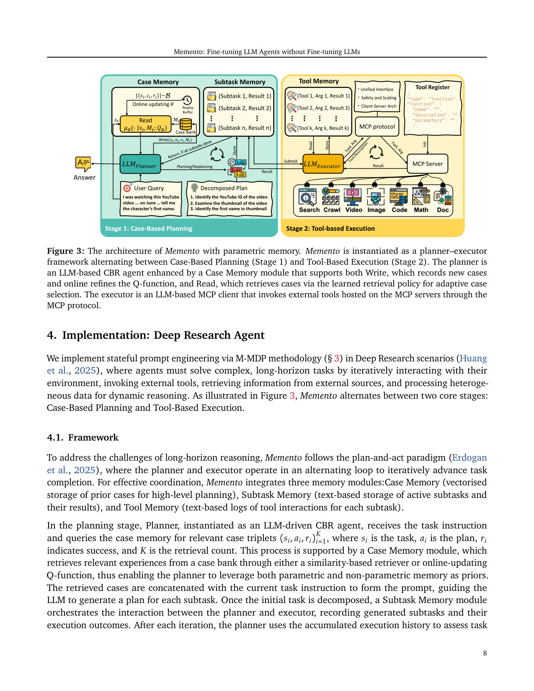
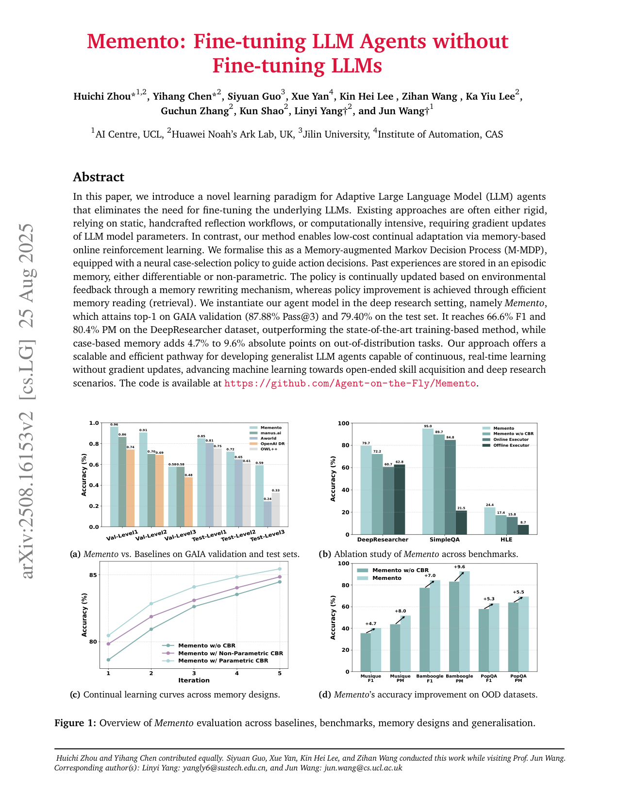

`memento | Memento: Fine-tuning LLM Agents without Fine-tuning LLMs | UCL AI Centre · Huawei Noah's Ark Lab (UK) · Jilin Univ. · CAS（通讯 Linyi Yang / Jun Wang，谱系含 DS-Agent/CBR 系） | 2025-08（arXiv v2, 2508.16153, cs.LG, 预印本/技术报告） | 主题线 L2 记忆驱动 + L1 经验复用·相关性 High`

> 三标注：【原文】=论文直述；【推断】=本人有据判断（附依据）；【待核】=拿不准关键事实。
> 核验：基于真实下载 PDF 正文（pdftotext -layout 全文 28 页通读，含正文+附录引用）；非 WebFetch 摘要。

══ 第一层：一眼看懂 [light] ══

- 🟦 **TL;DR**：要让 LLM Agent「越用越聪明」，通常要么靠人写死的反思流程（不灵活），要么微调模型权重（贵、会灾难遗忘）。本文 **Memento** 提出第三条路——**不动模型一根权重**，而是把每次做任务的经历（任务 state、所用 plan action、成功/失败 reward）存进一个不断长大的「**案例库 Case Bank**」，下次遇到相似任务时**检索过去的成功/失败案例**塞进 prompt 来指导规划。它把这个过程形式化成「带记忆的马尔可夫决策过程 M-MDP」，并用 **soft Q-learning 学一个轻量"案例检索策略"**（只训一个小 MLP/核网络，不碰 LLM）。在深度研究（Deep Research）场景做成 planner–executor 双阶段系统，GAIA 验证集拿到 top-1（87.88% Pass@3）。【原文 Abstract/§1/§7】

- **最巧的一步**：把"持续学习"从"改参数"**整个搬到了"改外部记忆 + 学一个检索器"**这一层——核心是 **Definition 3.2 把 CBR Agent 的整体策略拆成 \(π(a|s,M)=Σ_c μ(c|s,M)·p_LLM(a|s,c)\)**（式1）：LLM 部分 `p_LLM` **冻结**，只优化案例检索策略 \(μ\)。抽掉这一步（即不学检索、退化成纯相似度 RAG 或纯 prompt），整个"可微持续学习"框架就垮了——它正是用一个**可学习的 Q 函数**把"哪些过去案例对当前任务真有用"变成可优化对象，而又**完全免去 LLM 梯度**。【原文 §3 式(1)(7)】 为什么是它：这是"免微调"承诺与"仍能学习/适应"承诺**唯一的结合点**。【推断：式(1)是全文 4 处下游公式(7/9/14/16)的共同根，移除即无可优化量】

══ 第二层：为什么做（写透） ══

- **研究背景**：LLM Agent（带工具/记忆/环境的自主系统）正大量部署于 deep research、工具执行、代码生成。但"部署后还能不能继续学"是通往 generalist agent 的核心障碍。【原文 §1】
- **解决的具体痛点**：现有两条范式各有硬伤——
  1. **固定工作流 + 硬编码推理**（specialised frameworks）：窄任务好用，但部署后**静态**，不吸收在线信息、不适应新情形。【原文 §1】
  2. **微调 LLM 本体**（SFT/RL，如 START、Search-R1、DeepResearcher）：更灵活，但**算力/数据成本高**、长程任务要花大量时间 rollout 收训练数据、依赖大量人工标注问题，且有**灾难遗忘**风险，不适合开放场景的连续在线学习。【原文 §1/§2.1】
  - 中心问题（原文加粗）：「如何让 LLM Agent 在变化的环境中持续学习，**而不付出微调底层 LLM 的高昂代价**？」【原文 §1】
- **相关工作 & 不足**（论文摆的三条线）：
  - **持续学习两阵营**：参数式（改权重，贵+遗忘）vs 非参数式（冻结 LLM + 外部记忆改 prompt）。本文站非参数式。【原文 §2.1】
  - **工具增强/Agentic RL**：Toolformer/API-Bench/GRPO 系教模型何时调 API，但**要昂贵重训、且常假设固定小工具集**；无显式规划时"何时调哪个工具"是长程瓶颈。【原文 §2.2】
  - **Agent 记忆机制**：MemoryBank/SAGE（Ebbinghaus 遗忘）、Mem0（ADD/UPDATE/DELETE/NOOP 结构化操作）、A-MEM（类型网络）、ExpeL/AutoGuide/AWM（从轨迹蒸规则/技能）。**通病**：大多只"加不删"，导致经典 **swamping problem**（检索成本超过收益）；且多缺"可学习的选择策略"。【原文 §2.3】
- **动机链**：要持续学习 → 改参数太贵且遗忘 → 那就冻结 LLM、把经历存外部记忆（episodic memory + CBR）→ 但纯 RAG/纯相似度检索是**静态、不会学**的 → 所以必须把"检索哪条案例"本身**变成一个可学习的 RL 策略**（M-MDP + soft Q-learning）→ 又因为 deep research 的 reward 是回合末二值信号，可把多步 TD **塌缩成单步监督式分类**，进一步省掉 bootstrap 不稳定。【原文 §1/§3/§4.2】 为什么不用更简单的现成做法：纯 prompt few-shot"案例越多越好"，但本文实测 **CBR 在 K=4 达峰、再多反而引入噪声下滑**（Table 3），说明持续学习需要的是"小而精的检索"，而非"堆样例"——这正当化了"学一个检索器"而非"无脑塞 top-K"。【原文 §5.5.1】
- **与最近邻工作的 Δ**：
  - vs **ExpeL/AutoGuide/AWM**（同样冻结 LLM、从轨迹提经验）：它们提取的是**自然语言规则/技能**，检索靠启发式；Memento 把 planning 形式化成 **M-MDP** 并**学一个神经案例检索策略 μ（soft Q-learning over episodic case bank）**——差在"检索是可学习的最优策略，且存的是原始 (s,a,r) 三元组而非抽象规则"。【原文 §2.3 末句】
  - vs **DeepResearcher（训练式 SOTA）**：在 DeepResearcher 7 数据集上 Memento 免训练却以 66.6 F1 / 80.4 PM **超过** 训练式 60.5 PM。差异关键点：用在线工具 + 案例记忆替代权重微调。【原文 Table 1】
  - vs 训练式 CBR 前身 **DS-Agent/Agent-K**（同团队谱系）：那些挖 Kaggle 解法做可执行 pipeline；本文把 CBR 推广为**带可微 Q 检索的通用 M-MDP**，落在 deep research。【原文 §2.3】

══ 第三层：怎么做 + 靠不靠谱 ══

- **方法流水线（planner–executor 双阶段循环，5 个 M-MDP 算子）**：
  1. **(1) Retrieve / Read**：planner（CBR agent）收到任务 instruction，从 Case Memory 检索 K 个相关案例三元组 \((s_i, a_i, r_i)\)（\(s\)=任务，\(a\)=plan，\(r\)=成功与否）。两种检索：**非参数**=对 state 编码后取 cosine TopK（式13，SimCSE 编码）；**参数**=用学到的 Q 函数取 Q 值 TopK（式16）。【原文 §4.1/§4.2 式13/16】
  2. **(2) Reuse & Revise**：检索到的案例拼到当前任务 prompt，**冻结的 LLM**（GPT-4.1 planner）据此生成/重规划 subtask 分解。【原文 §4.1 式中 p_LLM】
  3. 执行阶段 **Tool-Based Execution**：executor（o3 for GAIA / o4-mini）作为 **MCP client**，逐个 subtask 调外部工具（searxng 元搜索 + Crawl4AI 爬虫 + 多模态文档处理 + 沙箱 Code/Math），结果写 Subtask Memory / Tool Memory。【原文 §4.1/§4.3】
  4. **(3) Evaluation + (4) Retain / Write**：拿到 reward 后，**仅在任务完成时**把 (s,a,r) 写入 Case Bank（式12）；state 用冻结文本编码器向量化、a 与 r 原样保存。参数版同时**在线更新 Q 函数**。【原文 §4.2 式12】
  5. **(5) Transition**：进入下一状态/下一任务，案例库持续增长 → 形成 continual learning 闭环。【原文 §3 式2 的 5 段对应】
- **逐组件必要性（消融见 Table 4/5）**：
  - **Planning（plan-and-act 分解）**：从 Online Executor 加到 Memento w/o CBR，三 benchmark 全涨（DeepResearcher +29.1 F1 / +11.5 PM）。**没它**则长程任务无法可靠分解。【原文 §5.5.2 Table 5，有消融】
  - **Case-Based Reasoning（案例记忆）**：在 w/o CBR 上再加 CBR，**额外一致增益**（HLE +4.5/+7.0，SimpleQA +3.7/+5.3，DeepResearcher +6.7/+8.2）；OOD 上 +4.7~9.6 绝对点。**没它**则失去持续学习与 OOD 迁移。【原文 §5.5.2/§5.5.4 Table 5 + Fig 1d，有消融】
  - **参数 vs 非参数 CBR**：两者都比 w/o CBR 强，**参数版略优**（5 轮迭代 80.46→85.44 vs 非参数 79.84→84.85 vs w/o 78.65→84.47，Table 4）。【原文 §5.5.3 Table 4，有消融】
  - **检索数量 K**：K=4 最佳，过大下滑——证明"小而精记忆"。【原文 §5.5.1 Table 3，有消融】
- **关键机制/公式（直觉解释，不复述符号）**：
  - **式(1) 整体策略分解**：把"选哪条 plan"拆成"先以 μ 选一条历史案例、再让冻结 LLM 据案例产出动作"——这让**唯一可训的东西就是检索器 μ**，LLM 当黑盒先验。【原文 §3】
  - **式(7) 最优检索策略 = Q 值 softmax**：在最大熵 RL 下，最优 μ 是 \(exp(Q/α)\) 归一化——直觉=**Q 越高（这条案例对当前 state 越"有用/会带来成功"）越该被检索**，熵项 α 保证检索多样、不塌缩到单一案例。【原文 §3 式7】
  - **式(9) 核估计 Q**：直接对自然语言 state 学 Q 很难，于是用**核网络 \(k(s,s')\)** 把"相似 state 的历史 Q"加权平均（episodic control 思路），只训核参数 θ。【原文 §3 式9】
  - **式(14→15) 单步塌缩 + CE 损失**：因 deep research 的 **planning 只需单步、reward 二值 \(r∈\{0,1\}\)**，多步 TD 目标塌缩成"立即 reward 的监督回归"，且把 MSE 换成 **交叉熵**（理由：MSE 在 0/1 附近梯度消失，CE 数值更稳）——\(Q(s,c)\) 直接被解读为"案例 c 对 state s 是好参考的概率 \(p(r=1|s,c)\)"。这是把 RL 偷偷变成**二分类训练**的关键工程化简，使免梯度框架里那一点点要训的东西极轻。【原文 §4.2 式14/15】
- **实验与证据**：
  - 4 基准：**GAIA**（长程工具用，450 题，三难度）、**DeepResearcher**（7 个开放域 QA，实时网检）、**SimpleQA**（4330 事实题）、**HLE**（2500 题前沿学科推理）。指标：GAIA 用 EM/Pass@3；其余 macro-F1 + GPT-4o-mini 判的 PM。【原文 §5.1/§5.2】
  - **支撑核心主张的关键实验**：① **Table 1** Memento(GPT-4.1+o4-mini) 在 DeepResearcher 7 数据集均值 **66.6 F1 / 80.4 PM**，**超过训练式 SOTA DeepResearcher（51.8/60.5）**——直接证明"免微调也能赢训练式"。② **Table 2** GAIA 验证集 **87.88% Pass@1/3 top-1**（开源框架内），测试集 79.40%（第 3/4）。③ **Table 4/Fig 1c** 5 轮迭代准确率单调上升=持续学习曲线。④ **Fig 1d** OOD +4.7~9.6。【原文 Table1/2/4 + Fig1】
  - **baseline 公平性**【推断】：prompt/训练式 baseline 用 **Qwen2.5-7B**，而 Memento 用 **GPT-4.1 + o3/o4-mini** 这种强闭源后端——**后端能力差距巨大**，Table 1 的"赢过训练式"很大程度可能来自更强 backbone 而非方法本身（论文自己也在 Table 5 显示纯 Online Executor 已不弱）。这是"看着强但未完全隔离变量"的点。【推断：Table1 脚注明确 baseline 为 Qwen2.5-7B，依据=后端不对等】 另外论文**坦承 DeepResearcher 七基准存在数据污染**（offline→online 反而掉分），削弱该数据集结论的说服力。【原文 §5.5.2】
  - **有意思的负/反直觉结果**：fast 非深思 planner（GPT-4.1）**反而优于** slow 深思 planner（o3）——因为 o3 常跳过规划直接答或产出冗长 plan 误导 executor（Table 6 / §6.3）。【原文 §6.3】
- **假设与失效边界**：
  - 【原文】**单步 planning 假设**：参数 CBR 把 M-MDP 塌缩成单步监督，只在"planning 仅需单步 + reward 二值"时成立（§4.2）；多步/连续 reward 场景需回到完整 TD（§3 式8 仍保留）。
  - 【原文】**Case Bank 快速饱和**：约 3k 训练数据下案例库很快饱和、几轮后边际收益递减、找不到明显性能跌点（§5.5.3）——意味着"持续学习"在有限环境里其实**很快到顶**。
  - 【推断】**强依赖强后端 LLM**：Table 6 显示换 Qwen3-32B 后 GAIA 掉到 40~54%，说明方法增益在弱后端上大幅缩水；失效边界=后端能力不足时 CBR 也救不回长程任务。【依据=Table 6 跨后端对比】
  - 【推断】**reward 可得性假设**：整个 Q 学习依赖每条轨迹拿到 0/1 成功标签；在无可验证 reward 的开放任务上该信号难获取。【依据=式12/14 需 r】
- **祛魅总结**：
  - **真贡献（硬货）**：① 把 LLM Agent 持续学习**干净地形式化为 M-MDP + 可学检索策略**，并给出"免 LLM 梯度、只训轻量检索器/核网络"的闭式最优解（式7）与单步监督化简（式15）——这是**可迁移的理论积木**。② 工程上把 CBR + MCP 工具 + planner-executor 拼成了 GAIA top-1 的真实系统，**开源**。③ "小记忆胜过大记忆"(K=4) 与"快 planner 胜慢 planner"两个实证 insight 有价值。
  - **包装/营销成分**【推断】：(a) "outperforming training-based SOTA" 的对比 backbone 不对等（Qwen2.5-7B vs GPT-4.1/o3），标题"without Fine-tuning LLMs"的震撼性部分建立在借助顶级闭源模型之上；(b) "continual/lifelong learning"在论文自承的 3k 数据快速饱和下，更像"几轮 in-context 案例积累"而非真正开放式终身学习。作者对参数 CBR 增益（vs 非参数仅 ~0.6 点 @iter5，Table 4）可能**略有高估**——参数 Q 学习带来的额外复杂度与其边际收益不太成比例。【依据=Table 4 参数 vs 非参数差距很小】

══ 结构化抽取 ══

- 🎯 **机制速览 6 轴** [light]：

| 学什么信号 | 改什么 | 何时改 | 免梯度? | 记忆-技能生命周期 | 防遗忘机制 |
|---|---|---|---|---|---|
| 环境 reward（任务成功/失败二值 \(r∈\{0,1\}\)）→ 经验库（episodic case bank）;无人类/无自反思文本规则 | **记忆（Case Bank 内容）+ 一个轻量检索器参数 θ（Q 函数/核网络的 MLP）**;**LLM 权重完全不动**、prompt 经检索案例间接被改 | 在线 per-episode（每条轨迹完成后 Write 入库 + 在线更新 Q）;参数版为单步监督更新 | **混合**：LLM 免梯度;检索器 μ 有梯度（但极小，两层 MLP / 核网络）→ 整体相对"免 LLM 梯度" | 写入(Write 式12,仅任务完成时)→检索(Read 非参数 cosine TopK / 参数 Q-TopK,式13/16)→**淘汰/遗忘 = 无显式机制**（只增不删,论文自指 swamping 风险但未实现 decay）→ 共享(案例库可跨任务/OOD 迁移,Fig1d) | **隔离式**为主：知识存外部库、LLM 不更新故**底层不遗忘**;但记忆层无 Ebbinghaus/淘汰，长期有膨胀风险【原文未实现遗忘】 |

- ⑦ **开源代码 + 框架/harness**：**已开源**，`https://github.com/Agent-on-the-Fly/Memento`【原文 Abstract】。框架/harness = **自研 planner–executor 系统 + MCP（Model Context Protocol）作工具接口**；检索器为自写小型神经网（SimCSE 句编码 + 两层 MLP Q 函数 / 核网络）；**未使用 veRL/TRL/OpenRLHF 等 RL 训练框架**（因不训 LLM，只训轻量检索器）。工具栈：searxng + Crawl4AI + VLM/ASR 等多模态处理 + 沙箱 Code/Math。【原文 §4.1/§4.3】 〔本次未 clone 仓库验证，框架判断基于正文描述；代码可达性待 P3 仓库核查环节确认〕【待核：仓库实际文件/框架】

- 💰 **资源/成本与可扩展性**【原文 §6.1/§6.2】：免 LLM 训练→无 GPU 训练成本，主成本是**推理 API**。GAIA 每任务 token：Level1 ≈26k 输入/4.7k 输出，Level2 ≈48k/6.9k，Level3 峰值 **121k 输入/9.8k 输出**；成本随难度上升（图6 给出 avg cost 曲线，L3 最高）。关键观察：**输出 token 稳定、输入 token 随难度暴涨**（瓶颈在整合多步工具输出，而非生成长文）。可扩展性受限于：案例库膨胀 + 长程任务输入上下文爆炸 + 强后端 API 费用。

- 🎯 **对"探索-巩固"idea 对标** [light]：**可借组件 + 部分竞品**。
  - **可借**：① 「探索产出的轨迹（含失败）→ 存 episodic case bank → 学一个检索器决定何时复用」可直接映射到 TSRD 的"巩固"侧——用**可学检索/选择策略**而非启发式来决定"哪条历史推理路径值得在新题上接管"。② **式(14→15) 把多步 RL 塌缩为单步二分类、并用 CE 替 MSE 防 0/1 梯度消失**——与项目记忆中"forward-hard/backward-soft、给 0/1 硬信号配平滑梯度"同源，可迁移到 MTP/OPD 的轨迹打分头。③ "小而精记忆 K=4 胜过堆样例"对"巩固时只保留关键路径/关键步"是实证支撑。
  - **竞品/对照**：Memento 主张**完全不动权重**也能持续学习；而 TSRD/OPD 走的是"教师脚手架 + 蒸馏进权重"路线——Memento 是"纯外部记忆"极端，可作为**消融对照基线**（"不蒸馏只靠记忆能走多远"）。
  - **缺口**：Memento 无防遗忘/淘汰、无 MTP 式 foresight 探测，记忆层快速饱和——正是探索-巩固 idea 想补的"主动探索 + 选择性巩固 + 几何/KL 防遗忘"空白。【推断：基于其 §5.5.3 饱和自述 + 无 decay 实现】

- 🔭 **开放问题/未来方向**：
  - 【原文】把 reward 函数与记忆更新做成**概率式**（当前是确定性 indicator，§3 式2 下方明确留作 future work）；在更大/更开放环境验证 memory-based MDP（§5.5.3 末、§7）。
  - 【推断】① 给 Case Bank 加**选择性淘汰/遗忘**以解 swamping（论文点了问题没解）；② 把检索器从单步监督扩回**真正多步 TD** 以处理多步 planning；③ 降低对顶级闭源后端的依赖（弱后端上方法增益验证）。【依据=§2.3 swamping、§4.2 单步假设、Table6 后端敏感】

- 🖼 **关键图 top-2** [light]：

  
  · 这是**原文 Figure 3**：Memento 的核心 pipeline——**Stage 1 Case-Based Planning**（Case Memory 的 Read/Write + 在线更新 Q 函数 + Subtask Memory）与 **Stage 2 Tool-Based Execution**（Tool Memory + MCP 协议 + searxng/crawl/image/video/code/math 工具套件）。选它因为它一图说清"冻结 LLM + 外部三类记忆 + 可学检索 + MCP 工具"如何咬合，是全文方法精华。【原文 Figure 3】

  
  · 这是**原文 Figure 1**：四联面板（a GAIA 各 baseline 对比 / b 多基准消融 / c 跨记忆设计的持续学习曲线 / d OOD 数据集准确率提升 +4.7~9.6）。选它因为它一张图同时呈现"超越基线、消融必要性、持续学习上升曲线、OOD 泛化"四大主张，是核心发现的浓缩。【原文 Figure 1】
