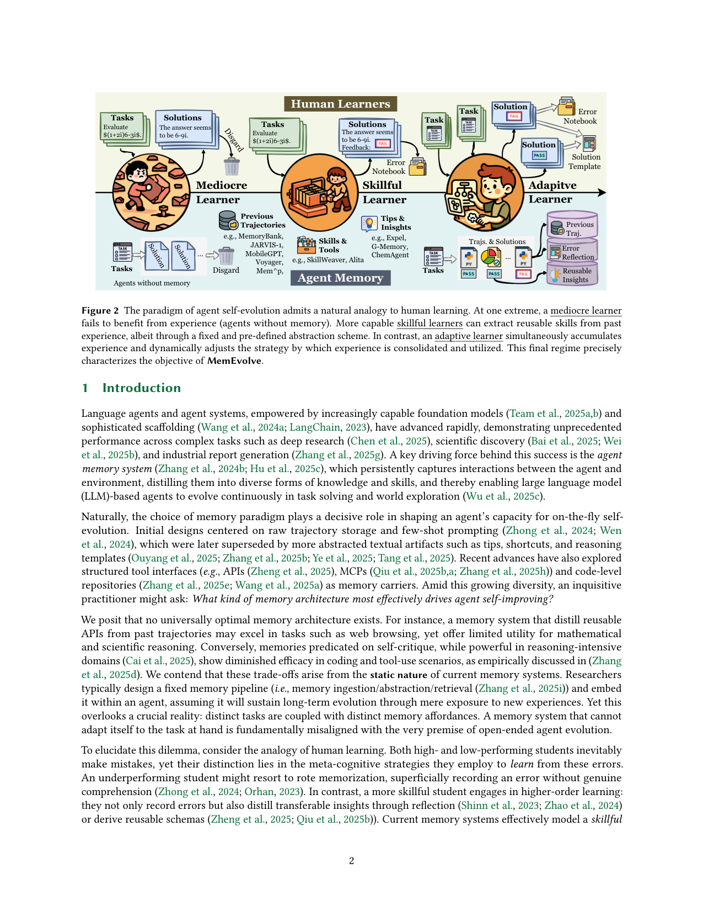
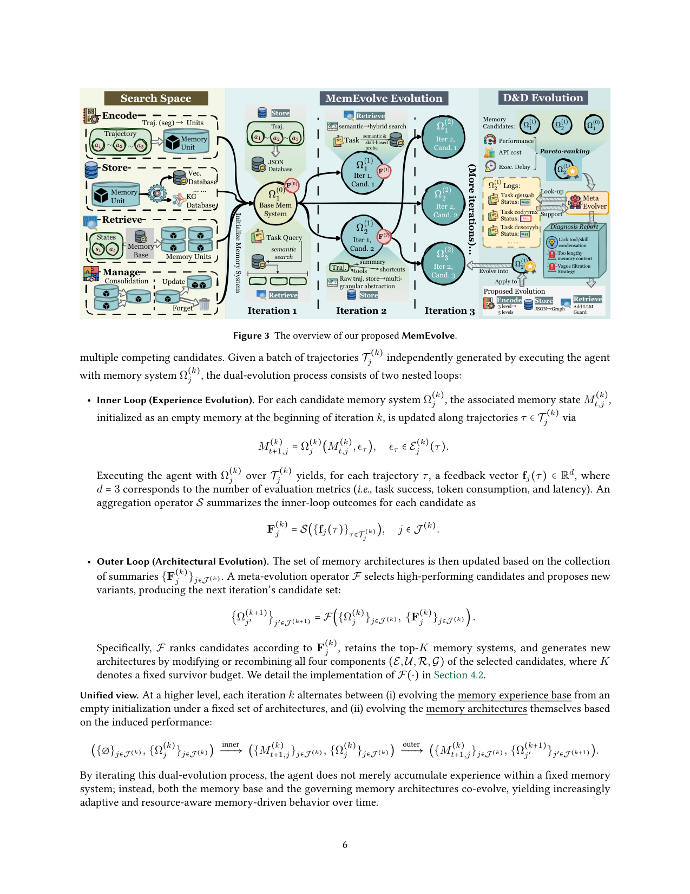

`memevolve | MemEvolve: Meta-Evolution of Agent Memory Systems | OPPO AI Agent Team + LV-NUS lab (核心:Guibin Zhang, Haotian Ren;通讯:Wangchunshu Zhou, Shuicheng Yan) | 2025-12(arXiv v1 2025-12-21)·ICML 2026·v1 | 主题线 L?(记忆架构元演进 · self-evolving memory)·相关性 High`

> 一句定位:不再人手设计"一个固定记忆架构"指望它包打天下,而是把**记忆架构本身**当成可优化对象——内层让 agent 在固定架构下攒经验(一阶演进),外层用"诊断-重设计(Diagnose-and-Design)"算子按性能/成本/延迟的 Pareto 反馈**元演进出更好的记忆架构**(二阶演进),并配套开源 **EvolveLab**(把 12 个代表性记忆系统统一拆进 Encode/Store/Retrieve/Manage 四件套设计空间)。

---

## ══ 第一层:一眼看懂 ══

- 🟦 **TL;DR**:现有自进化记忆系统的架构是**写死的**(固定的"编码/存储/检索"管线),换个任务域就水土不服(蒸 API 的擅长网页、自我批判的擅长推理,互相不通)。MemEvolve 主张"没有万能记忆架构",于是做**双层(bilevel)演进**:**内层**——给定某个候选记忆架构 Ω,agent 跑一批任务、把经验灌进记忆库,得到该架构的性能反馈(任务成功率、token 消耗、延迟,d=3 维);**外层**——一个**元演进算子 F** 对一组候选架构按 (Perf, -Cost, -Delay) 做**Pareto 非支配排序**选 Top-K 当"父代",再对每个父代做**Diagnose-and-Design**:先用 replay 回放它的轨迹诊断出"检索失败/抽象无效/存储低效"等缺陷画像,再在 (E,U,R,G) 四件套接口内**受约束地重设计**出 S 个子代架构。迭代 Kmax=3 轮(K=1 存活、S=3 子代、每候选 60 条轨迹)。结果:把 SmolAgent / Flash-Searcher 提升最高 17.06%,且演进出的架构跨任务/跨 LLM/跨框架可迁移。附带开源 **EvolveLab**——12 个记忆系统(Voyager/ExpeL/AWM/DILU/Cheatsheet/SkillWeaver/G-Memory/Agent-KB/Memp/EvolveR/Generative/Mobile-E)统一重实现成 Encode/Store/Retrieve/Manage 模块化基类。

- **最巧的一步**:**"把任意记忆系统抽象成 (Encode, Store, Retrieve, Manage) 四件套 = 一个可变异/重组的'基因型(genotype)'"** 这一步抽掉就垮。正因为有了这个统一、可执行、可受约束修改的设计空间,LLM 才能"诊断哪个组件烂→只改允许的实现点→产出仍可运行的新架构",让"架构演进"从空想变成可控搜索。没有这层模块化,"演进记忆架构"无从落地(改了就跑不起来)。

---

## ══ 第二层:为什么做 ══

- **研究背景**:agent memory 是 LLM agent 持续自进化的关键引擎(存交互、蒸经验/技能)。记忆载体一路演进:原始轨迹 few-shot → 抽象文本(tips/shortcuts/推理模板)→ 结构化工具接口(API/MCP)/代码仓。
- **解决的具体痛点**:**当前记忆系统是静态的**——研究者设计一条固定管线(摄入/抽象/检索)塞进 agent,假设"只要喂新经验就能长期进化"。但**不同任务耦合不同的记忆需求**(memory affordances):蒸 API 的记忆擅长网页浏览却对数学/科学推理用处不大;靠自我批判的记忆擅长推理却在编码/工具场景失效。一个不能**自适应任务**的记忆系统,与"开放式 agent 进化"的前提根本矛盾。
- **核心论点**:**不存在普适最优记忆架构**——这些 trade-off 源于记忆系统的静态本质。
- **动机链(人类学习类比,Fig.2)**:① 无记忆 agent=平庸学习者(犯错不长进);② 现有记忆系统=熟练学习者(会从经验抽可复用技能,但用**固定预定义**的抽象方案);③ **最强的人类学习者是"自适应学习者"**——会**根据科目动态切换学习策略**(文学靠记忆、数学靠抽象解题模板)。MemEvolve 就是要让记忆系统从"熟练"跃迁到"自适应"。为什么不用更简单法?固定架构(哪怕很精巧)被证明跨域不稳(Table 3:DILU/Cheatsheet/ExpeL 在 GAIA/xBench 上时好时崩)→ 必须让架构本身可演进。
- **与最近邻的 Δ**:
  - vs **ExpeL / AWM / Dynamic Cheatsheet / G-Memory / Agent-KB 等**(固定架构自改进记忆):它们只演进**记忆内容**(经验库),架构 Ω 不可变;MemEvolve **同时演进内容 + 架构**(dual evolution),且把这些方法全收进 EvolveLab 当可演进的"起点基因"。
  - vs **MemGen / MemSkill / Skill-Pro**(同期自进化记忆):那几篇仍在**一个给定的记忆/技能机制**内学(latent 记忆 / 技能选择 / 技能池);MemEvolve 上升一层,**元演进"用哪种记忆机制"本身**——是"系统设计的自动化",层级最高。
  - vs **ADAS / AlphaEvolve**(自动 agent/算法设计):理念相近(LLM 驱动演化设计),但 MemEvolve 专注**记忆架构**且给出受约束的 E/U/R/G 模块设计空间 + Pareto 多目标(性能/成本/延迟)。

---

## ══ 第三层:怎么做 + 靠不靠谱 ══

- **方法流水线**(§3–4,Fig.3):
  1. **形式化 + 模块化设计空间**(§3):agentic 系统 M=⟨I,S,A,Ψ,Ω⟩,记忆 Ω 维护演进态 M_t;任意记忆系统拆成 **Ω=(E,U,R,G)**——**Encode**(原始经验→结构化表示)、**Store**(写入持久记忆;向量库/知识图/JSON…)、**Retrieve**(任务相关召回)、**Manage**(离线异步:巩固/抽象/遗忘)。这就是可变异的"基因型"。
  2. **EvolveLab**(§3.3):12 个记忆系统全部继承统一抽象基类 `BaseMemoryProvider`(强制四件套接口),开箱支持 GAIA/xBench/DeepResearchBench,支持 online(边跑边更新)/offline(先攒后评)两种模式 + 字符串匹配/LLM-as-judge。
  3. **双层演进**(§4.1):每轮 k 维护一组候选架构 {Ω_j}(初始单例=手设计 baseline)。
     - **内层(经验演进,一阶)**:每个候选 Ω_j 从空记忆起,沿轨迹 τ 更新 M_{t+1,j}=Ω_j(M_{t,j},ϵ_τ);跑 agent 得每轨迹反馈向量 f_j(τ)∈R³(成功/token/延迟),聚合成 F_j。
     - **外层(架构演进,二阶)**:元算子 F 收 {F_j} → 选高性能候选 + 提新变体 → 下一轮候选集。F 保留 Top-K、对四组件 (E,U,R,G) 修改/重组生成新架构。
  4. **Diagnose-and-Design(D&D)算子 F**(§4.2,关键):
     - **架构选择**:汇总向量 F_j=(Perf, -Cost, -Delay),**非支配排序**得 Pareto rank,同 rank 内按主性能排序,选 Top-K 父代(K=1)。→ 兼顾"任务有效性 vs 资源效率"。
     - **诊断(Diagnosis)**:对父代用其执行批次 T_p 的**轨迹级证据 + replay 接口**回放,定向检查记忆行为(检索失败/无效抽象/存储低效),产出跨四组件的**结构化缺陷画像 D(Ω_p)**。
     - **设计(Design)**:以 D 为条件,**只在模块接口的允许实现点**改(保证仍可运行),产出 S 个有效变体 Ω_{p,s}=Design(Ω_p, D, s)。变体在编码策略/存储规则/检索约束/管理策略上不同但都符合统一接口。
     - **良性循环**:好架构→agent 学得更快→更高质轨迹→更精准 fitness→驱动下一轮架构演进。
- **逐组件必要性**:
  - **EvolveLab 模块化** = 演进可控的前提(无消融,但属设计前提,Fig.6 展示了演进路径合法性)。
  - **Pareto 多目标选择**:若只按性能选会忽略成本/延迟暴涨——Table 3 显示 MemEvolve API 成本与 No-Memory 持平(GAIA \$0.085 vs \$0.086),佐证多目标约束有效。**无显式"去掉 Pareto"消融**【推断:这是潜在缺口,作者未做架构选择策略的消融】。
  - **Diagnose 阶段**:用 replay 把"为什么这架构差"落到具体组件,是 Design 不瞎改的依据。**无"诊断 vs 随机变异"对照消融**【推断:同上缺口】。
- **关键机制直觉**:把 AutoML/进化算法搬到"记忆系统设计"——基因=四件套实现,适应度=多目标(性能/成本/延迟),变异=LLM 按缺陷画像受约束改写,选择=Pareto+精英留存。妙在"内层提供适应度信号、外层改基因",二阶优化让"学习方式本身"进化。
- **实验与证据**(§5):
  - 基准:**GAIA / WebWalkerQA / xBench-DeepSearch / TaskCraft**(均 deep-research/agentic 难任务)。框架:集成进 **SmolAgent**(轻量双 agent)和 **Flash-Searcher**(高性能单 agent deep research);held-out 迁移到 **Tencent CK-Pro**(三 agent)和 **OWL**(分层多 agent)。LLM:**GPT-5-mini**(主,兼跑元演进 F),迁移评 DeepSeek V3.2、Kimi K2。
  - **支撑核心主张的关键实验**:① **主表 Table 2**——Flash-Searcher+GPT-5-mini 在 xBench 69%→74%(pass@1),pass@3 达 80.61%(GAIA),超 OWL-Workforce/CK-Pro;SmolAgent 也涨。② **跨任务/跨模型/跨框架泛化**(核心卖点)——在 TaskCraft 上演进出的记忆架构**直接固定迁到 WebWalkerQA/xBench 不再元演进**仍涨(WebWalkerQA 58.82→61.18);跨 LLM:GPT-5-mini 演进的架构迁 Kimi K2 在 WebWalkerQA **+17.06%**;跨框架(Fig.4)迁到异构 agent 框架仍涨。③ **效率**(Table 3)——MemEvolve 性能最高(GAIA 73.33)且 **API 成本≈No-Memory**、延迟与其他记忆法同量级 → 增益非靠堆成本。④ **演进动态可解释**(Fig.6)——从 AgentKB(编码/存储冻结)起步,逐轮演进出 Riva、Cerebra 等;发现的设计原则:**更 agentic(编解码靠 agent 决策)、层级化、多级抽象**。
  - **baseline 公平性**:EvolveLab 统一重实现 + 同框架同 LLM,公平;但**承认 ExpeL 等是为简单环境(ALFWorld/HotpotQA)设计**,在 deep research 上吃亏(Table 3 旁注)——这点诚实。
  - **"看着强但没答核心问题"风险**【推断】:(a) 元演进的诊断/设计/迁移目标 LLM 推荐用 **Claude-Sonnet-4.5/GPT-5** 这类强模型(README),即"用一个超强 LLM 当架构设计师"——增益部分来自设计器 LLM 的能力,而非纯框架;(b) 跨任务泛化与开篇"无普适架构"动机表面矛盾,作者自辩"同一任务族(deep research)内可发现广泛适用架构,跨根本不同任务族(如具身)仍需重演进"——但**未给具身等跨族失败的实验**,泛化边界靠论述非数据。依据:README 模型建议 + §5.3 自辩段落无反例实验。
- **假设与失效边界**:
  - 【原文】§5.3:TaskCraft 演进的架构**不太可能迁到根本不同的任务族**(环境/动作空间/工具集差异大);K=1/S=3/Kmax=3 为本文配置。
  - 【推断】强依赖**强 LLM 当元演进器**(诊断+设计)——弱 LLM 下缺陷画像与重设计质量难保;每轮要跑 60 条轨迹 × 多候选 × 多轮,**元演进本身算力/时间成本不低**(虽部署后架构固定、成本摊销)。依据:README 推荐 GPT-5/Claude-4.5 + Kmax×candidates×60 轨迹。
  - 【推断】设计空间被**限制在已有 12 系统的 E/U/R/G 组合**——能"重组+局部改"但难发明全新范式(如 latent 记忆/参数侧),搜索空间天花板由 EvolveLab 的算子库决定。依据:Design "只在允许实现点改" + 基因来自 12 个 provider。
- **祛魅总结**:
  - 真贡献(硬货):① **把"记忆架构"提升为一阶优化对象 + 双层(经验/架构)co-evolution** 的范式确实新,层级比 MemGen/MemSkill/Skill-Pro 都高;② **EvolveLab(12 系统统一进 E/U/R/G)**是扎实的社区基建——既是本文搜索基底,也是公平 benchmark(独立价值大);③ **Pareto 多目标 + Diagnose-and-Design** 让"LLM 改架构"可控可解释、且兼顾成本/延迟(Table 3 硬数据支撑)。
  - 包装/营销成分【推断】:"meta-evolution/自演进"的实质是**用强 LLM 做 LLM 驱动的进化式架构搜索**,设计器本身不学习(无梯度);"自适应学习者"叙事很漂亮但跨任务族的自适应性缺实验支撑;部分增益与"用 GPT-5/Claude-4.5 当架构师"耦合。依据:F 全靠 LLM prompting、§5.3 无跨族反例。

---

## ══ 结构化抽取 ══

- 🎯 **机制速览 6 轴**:

| 学什么信号 | 改什么 | 何时改 | 免梯度? | 记忆-技能生命周期 | 防遗忘机制 |
|---|---|---|---|---|---|
| **环境 reward/多目标 fitness**(任务成功率 + token 成本 + 延迟,d=3,Pareto 聚合);**自反思/replay 诊断**(回放轨迹定位组件缺陷) | **改记忆架构本身(Encode/Store/Retrieve/Manage 四组件的程序实现)+ 记忆内容(经验库)**;**base LLM、agent 框架主干不改** | **离线批量、分轮(Kmax=3)**:内层每候选跑 60 轨迹攒经验;外层每轮做架构选择+诊断+重设计;部署后架构固定 | **是**(纯 LLM 驱动的进化式架构搜索,无任何梯度/权重更新;诊断与设计=强 LLM prompting) | 写入=Encode→Store;检索=Retrieve(语义/图/混合/工具匹配等,随架构而变);遗忘/淘汰=**Manage 组件**(巩固/抽象/选择性遗忘)+ **架构层 Pareto 选择淘汰差架构(K=1 精英留存)**;共享=演进出的架构跨任务/跨LLM/跨框架可迁移复用 | **架构层 Pareto 精英留存(防演进退化)+ Manage 组件的选择性遗忘 + 受约束重设计(保证可运行)**;base LLM 冻结天然不遗忘;非 merging/KL |

- ⑦ **开源代码 + 框架/harness**:**已开源** https://github.com/bingreeky/MemEvolve (README 标 **ICML 2026**,Apache 2.0)。**框架 = 无 RL 框架(确认无 veRL/TRL/OpenRLHF/GRPO/PPO);自研 LLM 驱动元演进**——`MemEvolve/core/auto_evolver.py` + `memory_evolver.py` 实现诊断-设计;**EvolveLab**(`EvolveLab/base_memory.py` + `providers/*` 12 个记忆系统 provider)为统一设计空间。**底座是 agent 框架 Flash-Searcher**(repo 内 `Flash-Searcher-main/`),依赖 anthropic SDK / OpenAI、crawl4ai、e2b code-interpreter、duckduckgo/serpapi 搜索、datasets 等。元演进的 ANALYSIS_MODEL(诊断)/GENERATION_MODEL(设计)推荐 Claude-Sonnet-4.5 或 GPT-5。【原文 + 仓库 README/树确认】

- 💰 **资源/成本与可扩展性**:**推理成本**(Table 3,Flash-Searcher):MemEvolve 演进架构的 per-task API 成本≈No-Memory(GAIA \$0.085 vs \$0.086;xBench \$0.136 vs \$0.141),延迟与其他记忆法同量级(GAIA 693s) → **运行时不显著加成本**。**演进成本**(原文未给总额,本处【推断】):Kmax=3 轮 × 候选数 × 每候选 60 轨迹 × 强 LLM 诊断/设计调用,一次性较贵但部署后架构固定可摊销。依据:§5.1 配置 + Table 3 成本列。

- 🎯 **对"探索-巩固(TSRD/MTP+OPD)"idea 对标**:**互补的"上层方法论" + 可借组件**。可借:① **Diagnose-and-Design 闭环**(replay 诊断→定位缺陷→受约束重设计)可迁到 TSRD 的"巩固策略元优化"——不只学 path-recovery,还能**元演进"用哪种 recovery/巩固机制"**;② **Pareto 多目标(性能/成本/延迟)选择**给"巩固阶段权衡(质量 vs 效率)"现成准则;③ **把方法拆成可变异的模块化基因型**思路,可用于自动搜索"MTP 前瞻探针 + OPD 蒸馏"的组合配置。竞品/层级关系:MemEvolve 是**比 TSRD 高一层的"自动设计"框架**——它不提出具体记忆/蒸馏机制,而是搜索机制组合;TSRD 是具体机制(MTP 前瞻 + OPD 参数蒸馏 + 路径选择/恢复)。缺口:MemEvolve **完全免参数(LLM 驱动搜索,不内化进权重)**、设计空间受限于已有 provider、无 MTP 式前瞻、无参数侧蒸馏——你的 TSRD 正是它设计空间里"尚未涵盖的新基因"。反向价值:MemEvolve/EvolveLab 可作为**评测/对照基建**,把 TSRD 当作一个新 memory provider 投进去做公平对比。

- 🔭 **开放问题/未来方向**:
  - 【原文】§6:走向更自动、更有原则、元演进式的持续自进化 agent;发现的设计原则(更 agentic、层级化、多级抽象)可指导未来设计;承认跨根本不同任务族需重演进。
  - 【推断】(a) 元演进器本身可学习化(当前冻结强 LLM)→ 真自演进;(b) 扩大设计空间以发明全新记忆范式(如把 latent 记忆/参数侧蒸馏纳入基因);(c) 元演进算力成本的削减(代理 fitness、早停);(d) 跨任务族自适应的实验验证(目前仅同族内验证)。依据:F 靠 LLM prompting、基因来自 12 provider、§5.3 无跨族实验。

- 🖼 **关键图 top-2**:

  
  这是**原文 Figure 2**:用人类学习者类比立论——Mediocre Learner(无记忆 agent,犯错不长进)→ Skillful Learner(现有记忆系统:用**固定预定义**方案抽技能/洞见,如 MemoryBank/Voyager/ExpeL/G-Memory)→ **Adaptive Learner**(MemEvolve 目标:边攒经验边**动态调整"如何巩固和利用经验"的策略**)。选它因为它一图说清全文的核心立论与定位(为什么要演进架构本身、MemEvolve 站在哪一格)。

  
  这是**原文 Figure 3**:左 **Search Space**(Encode/Store/Retrieve/Manage 四组件的可选实现)→ 中 **MemEvolve Evolution**(从 Base Mem System 出发,每轮生成多个候选 Iter k,Cand j)→ 右 **D&D Evolution**(按 Performance/API cost/Exec Delay 做 **Pareto-ranking**,查 Logs/Status 生成 **Diagnosis Report**(缺工具/技能、记忆过长、过滤模糊),据此 **Proposed Evolution** 改 Encode(3 级→5 级)/Store(→Graph/JSON)/Retrieve(加 LLM Guard))。选它因为它是方法主图,完整呈现"内层攒经验出 fitness→外层 Pareto 选+诊断+重设计"的双层元演进闭环。
