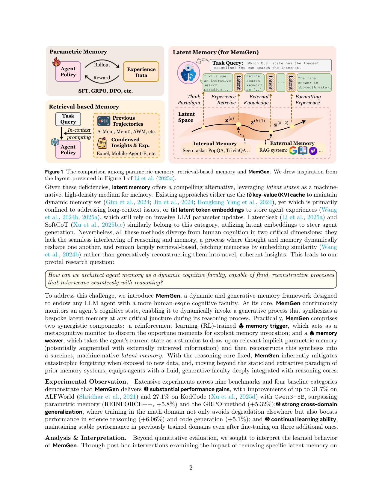
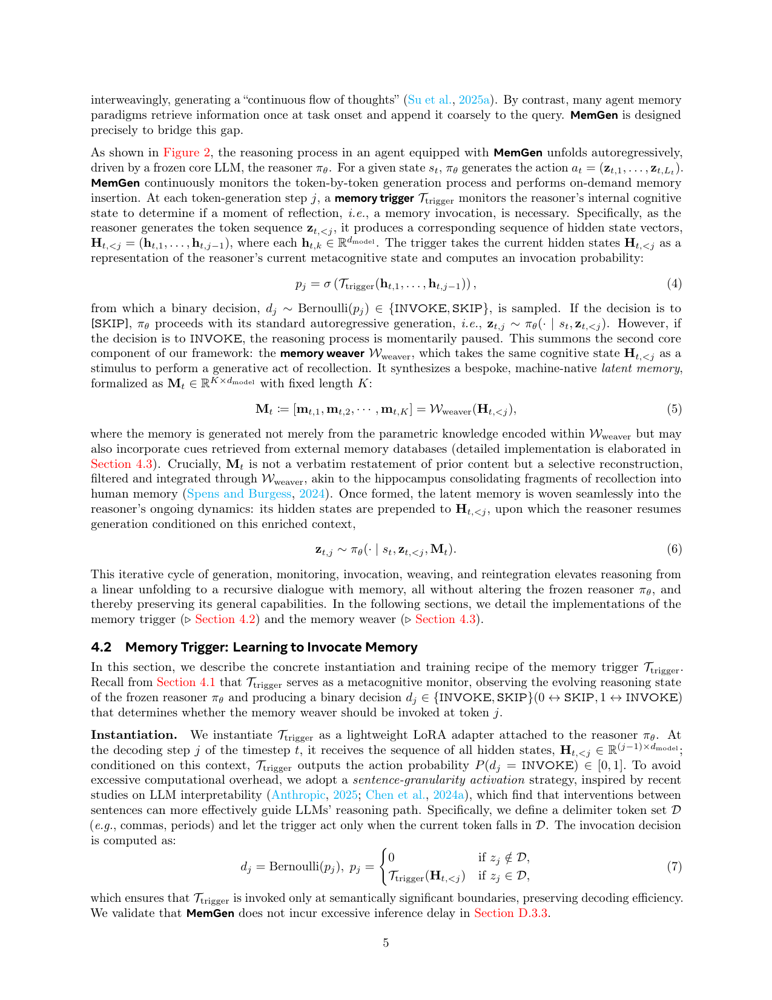

`memgen | MemGen: Weaving Generative Latent Memory for Self-Evolving Agents | NUS (Guibin Zhang, Muxin Fu, Shuicheng Yan) | 2025-09(arXiv v2 2025-10-12)·ICLR 2026·v2 | 主题线 L?(latent/参数侧记忆 · self-evolving agent)·相关性 High`

> 一句定位:把"记忆"做成在推理流里**按需即时生成的潜在 token 序列**(machine-native latent memory),冻结主模型、只训两个 LoRA(trigger 决定何时插、weaver 生成插什么),从而既避免参数记忆的灾难性遗忘,又超越检索记忆"任务开始时一次性拼接"的僵硬。

---

## ══ 第一层:一眼看懂 ══

- 🟦 **TL;DR**:现有 agent 记忆要么改参数(会忘旧知识),要么外挂检索库(只能在任务开头把检索到的文本粗暴拼到 prompt 上,和推理"两张皮")。MemGen 让一个**冻结**的主模型(reasoner)正常逐 token 生成,旁边挂两个小 LoRA:① **memory trigger**——边生成边看主模型的隐藏状态,判断"此刻要不要回忆一下";② **memory weaver**——一旦触发,就以当前隐藏状态为"刺激",生成一小段(K 个,K∈{2,4,8,…32})**潜在记忆 token**(不是文字,是隐向量),prepend 进隐藏状态,主模型接着往下写。新经验只灌进 weaver 的参数,主模型一字不改 → 不遗忘。八/九个 benchmark 上比外部记忆(ExpeL/AWM)高最多 38.22%,比 GRPO 高最多 13.44%。

- **最巧的一步**:**"冻结 reasoner + 把所有经验内化进 weaver 这个独立 LoRA"** 这一步抽掉就垮。它是整篇的承重墙——正因为主干不动,(a) 不灾难性遗忘、(b) 与任意 backbone / 任意优化算法(SFT/GRPO/DAPO)解耦、(c) 记忆以隐向量形式"织入"而非文本"拼接"才同时成立。若改成直接更新主模型,就退化成普通 agent tuning,失去全部卖点。

---

## ══ 第二层:为什么做 ══

- **研究背景**:agent memory 被视为"自进化引擎"——让 LLM agent 从环境交互中渐进自我提升(区别于对话 agent 的个性化记忆,后者只为多轮一致性)。作者把现有自进化记忆归三类(§1、§2):
  - (I) **参数记忆**:把经验直接写进 agent 参数(FireAct/AgentLumos/Agent-FLAN…)。增益大,但**灾难性遗忘**、侵蚀通用知识。
  - (II) **检索记忆**:把经验外化成结构化库——原始轨迹 / 高层经验(ExpeL)/ 浓缩技能(可复用 API、MCP box)。不遗忘,但**死板地依赖 context engineering**,任务开头检索一次粗拼到 query,做不到"内化记忆"那种无缝融合。
  - (III) **潜在记忆**:用隐状态当记忆载体。已有 KV-cache 类(只解长上下文)、latent embedding 类(仍需侵入式改 LLM 参数)、LatentSeek/SoftCoT(用 latent 引导生成)。
- **解决的具体痛点**:现有 latent/检索方法两大缺陷——① **缺乏推理与记忆的无缝交织**(思与忆不能互相重塑);② **本质仍是检索式**(按 embedding 相似度取,而非"生成式地重构成新的连贯洞见")。
- **动机链**:参数记忆会忘 → 检索记忆死板且两张皮 → 想要"像人脑那样推理与记忆连续互织、且是重构生成而非检索" → 所以把记忆做成**冻结主干旁、按需生成的潜在 token 流**:用 RL 训 trigger 学"何时回忆"、用独立 LoRA 当 weaver 学"生成什么记忆"。为什么不用更简单的现成法?因为 SFT/GRPO 改主干会忘;RAG 拼 prompt 不内化;二者都给不出"token 级、推理中途动态再生成记忆"的粒度。
- **与最近邻的 Δ**:
  - vs **LatentSeek / SoftCoT / Co-processor**(同属 latent computation):它们用 latent 引导生成但**仍偏检索式 / 或需改主干**;MemGen 是**生成式重构** + **完全冻结主干** + **trigger 自决 token 级时机**(fM 的粒度做到 token 级,Eq.3),这是关键差异点。
  - vs **MemAgent / MEM1**(RL+记忆):那俩处理长上下文输入,**不演进记忆机制**;MemGen 的 trigger 用规则 RL 专门学"何时插记忆"。
  - 与最像的 Memp/AgentKB(procedural/任务级记忆)相比,后者是文本级外部库;MemGen 是潜在、token 级、生成式。

---

## ══ 第三层:怎么做 + 靠不靠谱 ══

- **方法流水线**(§4,Eq.4–6):
  1. 输入状态 s_t,冻结 reasoner π_θ 逐 token 自回归生成 action,产出隐藏状态序列 H_{t,<j}。
  2. **trigger**(LoRA)在**句界**(逗号/句号等 delimiter 集 D,"sentence-granularity"激活,省算力)读 H 算 invoke 概率 p_j = σ(T(H)),采样 d_j∈{INVOKE,SKIP}(Eq.7)。
  3. 若 SKIP → 正常生成;若 INVOKE → 暂停,**weaver**(另一 LoRA)以同一 H 为刺激生成定长 K 的潜在记忆矩阵 M_t∈R^{K×d}(Eq.5)。
  4. M_t **prepend** 到当前隐藏状态,π_θ 在"被记忆增强"的上下文上恢复生成(Eq.6)。
  5. 输出 → 执行 → 环境转移 → reward R(τ)。这一"生成-监控-触发-编织-重整"循环把线性生成升级成"与记忆的递归对话",全程不改 π_θ。
- **逐组件必要性**:
  - **trigger**:做了消融(Table 5),证明"专门训练的 trigger"对有效插记忆是必要的(随机/总插都更差)。训练用 **规则 RL** + **reward-adaptive penalty**(Eq.8–9):对高奖励轨迹算平均激活率 p̄,惩罚超过 p̄ 的多余激活 → 学"稀疏但关键"地插记忆。
  - **weaver**:经验**只**灌进它的 LoRA 参数(Eq.10 梯度仅传到 θ′),保证 π_θ 通用能力不动。与优化算法解耦 → 两变体 MemGen_SFT / MemGen_GRPO(Table 6 比较不同训练范式)。
  - **K(潜在记忆长度)**:敏感性分析(Fig.6 左),K 从 2→32 性能单调上升(记忆容量变大)。
  - **检索融合**(§4.3 + Appx E):触发时任意检索系统(MemoryBank/ExpeL)给文本记忆,与 H 合并喂进 weaver → latent,可融合内外知识。
- **关键机制直觉**:weaver 像海马体"把回忆碎片巩固成记忆"——M_t 不是逐字复述旧内容,是**经 weaver 过滤整合的选择性重构**;prepend 隐向量 = 在不改主干权重的前提下,临时给主模型"递一张小抄",小抄内容由学到的经验决定。
- **实验与证据**(§5):
  - 数据集:9 数据集 / 5 域——web搜索 TriviaQA、PopQA;具身 ALFWorld;数学 AQuA、GSM8K、MATH;科学 GPQA;代码 KodCode、BigCodeBench。Backbone:Qwen2.5-1.5B、SmolLM3-3B、Qwen3-8B。12 个 baseline(prompt / 参数 / 检索 / latent 四类)。
  - **支撑核心主张的关键实验**:Table 1(主表)。ALFWorld+SmolLM3-3B:vanilla 18.96 → MemGen_GRPO **63.60**(+44.64),且超 GRPO 55.35;Qwen3-8B 上 KodCode +27.06、PopQA +28.17(原文摘要数字)。**跨域泛化**(RQ2,Fig.3/9/10):KodCode 训练后 MATH 36.6→54.2;科学+6.06、代码+5.1。**持续学习/抗遗忘**(RQ3,Table 4):顺序训 4 数据集后,SFT 只提升最近任务(KodCode 54.10 但 GPQA 仅 2.53),MemGen 更均衡且保留旧任务(KodCode 训练后 AQuA 仍 40.34 vs ExpeL 27.14 / SFT 28.61)。
  - **baseline 公平性**:同 backbone、同数据;检索类(AWM 等)在部分推理任务上没跑全(Table 1 有"-"),作者标注;trigger 用规则 RL,与 GRPO 对照公平。
  - **"看着强但没答核心问题"风险**【推断】:K 越大越好(Fig.6 左)说明增益部分来自"额外计算/容量",而非纯"记忆质量"——但作者用 efficiency 分析(§D.3.3,延迟仅为 vanilla 的 24%–94%)部分回应了"是不是靠堆算力"。依据:K 单调性 + 延迟数据并列出现。
- **假设与失效边界**:
  - 【原文】trigger 只在 delimiter 句界激活(牺牲 token 级最细粒度换效率);weaver 默认靠自身参数知识(外检索为可选)。
  - 【推断】潜在记忆**人不可读**(§5.3,t-SNE + 强制解码出 "[…]SOC"/"_pick" 之类非自然串)→ **可解释性/可审计性弱**,跨 backbone 迁移这套 latent 是否成立未验(weaver 绑特定 π_θ 的隐空间)。依据:Fig.5 解码结果 + weaver instantiation 绑 π_θ 隐维 d_model。
  - 【推断】"自发涌现 planning/procedural/working 三类记忆"是**事后干预归因**(post-hoc,移除某 cluster 看 failure mode 变化,Fig.6 右),属相关性证据,非因果训练目标。依据:§5.3 明说 "without external guidance" + 用 failure-mode taxonomy 事后映射。
- **祛魅总结**:
  - 真贡献(硬货):① 冻结主干 + 双 LoRA(trigger/weaver)的**解耦记忆架构**,工程上干净、抗遗忘有数据支撑;② **token/句界级、生成式**的记忆插入机制 + reward-adaptive penalty 学稀疏触发;③ 与优化算法/backbone 解耦,SFT/GRPO 两条都验。
  - 包装/营销成分【推断】:"human-like memory hierarchy(planning/procedural/working)自发涌现"叙事偏脑科学包装,实为事后干预的功能归因;"machine-native 高密度记忆"听着玄,本质是 prepend 的可学习软 prompt/latent token。依据:§5.3 方法是 post-hoc intervention,且潜在 token 不可读。

---

## ══ 结构化抽取 ══

- 🎯 **机制速览 6 轴**:

| 学什么信号 | 改什么 | 何时改 | 免梯度? | 记忆-技能生命周期 | 防遗忘机制 |
|---|---|---|---|---|---|
| 环境 reward(规则 RL,RLVR/GRPO 式);trigger 用 reward-adaptive penalty | **改 latent 记忆(隐向量序列)+ 两个 LoRA 参数**(trigger 决策、weaver 生成);**不改主模型主干** | **训练期**离线批量更新 LoRA;**推理期**在线 per-token/句界动态生成并插入潜在记忆 | **否**(核心靠 RL/SFT 梯度训 trigger+weaver);推理时插记忆这一步免梯度 | 写入=经验内化进 weaver 参数;检索=trigger 触发时 weaver 由当前隐状态"再生成"(非相似度检索)、可选融合外部 RAG;遗忘/淘汰=不显式淘汰(主干冻结天然抗遗忘);共享=未涉及 | **隔离**(冻结 reasoner,经验只进独立 LoRA weaver)→ 抗灾难性遗忘;非 merging/非 KL 投影 |

- ⑦ **开源代码 + 框架/harness**:**已开源**,官方实现 https://github.com/KANABOON1/MemGen (README 标注 ICLR 2026)。**框架 = HuggingFace TRL 0.21.0 + PEFT 0.17.1(LoRA)+ accelerate 1.10 + DeepSpeed ZeRO-2(`configs/zero2.yaml`)**;transformers 4.55.4、torch 2.7.1+cu128;环境含 ALFWorld 0.3.5 + ai2thor(具身)。**注意**(README FAQ):支持 DDP 不支持 FSDP;**MemGen-GRPO 的多轮训练/eval 脚本与 checkpoint 计划在 SFT 版之后才发布**(截至该 README 多轮 GRPO 代码尚未释出)。【原文/仓库 README】

- 💰 **资源/成本与可扩展性**:trigger+weaver 均为轻量 LoRA,主干冻结 → 训练开销远小于全参 tuning。**推理延迟**(§D.3.3):每 query 延迟为 vanilla LLM 的 **24%–94%**(因句界稀疏触发,不显著增延);性能最高 +57.66%。【原文】具体显存/GPU 时未在正文给出(原文未说明,细节在 Appx C)。

- 🎯 **对"探索-巩固(TSRD/MTP+OPD)"idea 对标**:**可借组件 + 部分竞品**。可借:① **trigger=元认知监控器**——读隐状态在"句界/关键步"决定是否介入,与你"高熵/低置信关键步单点接管(path-recovery)"高度同构,且它给出了**用 reward-adaptive penalty 学"稀疏但关键"触发**的可迁移配方;② "冻结主干 + 旁挂可训模块只灌经验"的**隔离式抗遗忘**思路,可直接迁到 OPD(教师信号只进 adapter)。竞品面:它用**潜在 latent token**承载记忆(不可读),而 TSRD 走"显式路径选择/恢复"——两者在"何时介入"上竞争、在"介入插什么"上互补(latent vs 显式 scaffold)。缺口:MemGen 不做"foresight 探测"(无 MTP 式前瞻),记忆不可解释 → 你的 MTP-as-foresight-probe 正好补这一格。

- 🔭 **开放问题/未来方向**:
  - 【原文】§6:迈向能"流动、重构式智能"的自进化 agent;FAQ 暗示后续释出 GRPO 多轮训练栈。
  - 【推断】(a) 潜在记忆可解释/可审计化(当前不可读);(b) weaver 与特定 π_θ 隐空间解绑、做到跨 backbone 复用;(c) 把"何时触发"从句界粒度推到真·token 级而不爆算力;(d) 显式淘汰/遗忘机制(目前只靠冻结被动抗遗忘,记忆库无界增长问题未解)。依据:正文 K 单调性、latent 不可读、weaver instantiation 绑 d_model。

- 🖼 **关键图 top-2**:

  
  这是**原文 Figure 1**:左列对比参数记忆(SFT/GRPO/DPO 改 policy)与检索记忆(A-Mem/Mem0/AWM 把轨迹/浓缩经验拼进 prompt),右侧画出 MemGen 的 latent 范式——在"I will use … search keyword … final answer"推理流中途反复织入 Latent 块,并可同时拉内部/外部记忆。选它因为一图说清本文的"立靶子+给方案"动机,是理解全文定位的钥匙。

  
  这是**原文 Figure 2**:展示 reasoner 逐 token 生成时,**Trigger** 在每个上下文点判 No-Invocation/Invocation,**Weaver**(LoRA)以隐状态为 hook 生成 Latent memory tokens 后 Memory-Insert 回序列,并可接 External Mem DB(原始轨迹/高层摘要)。选它因为它是方法主图,精确呈现"监控→触发→编织→插入"的核心闭环与两个可训模块的位置。
