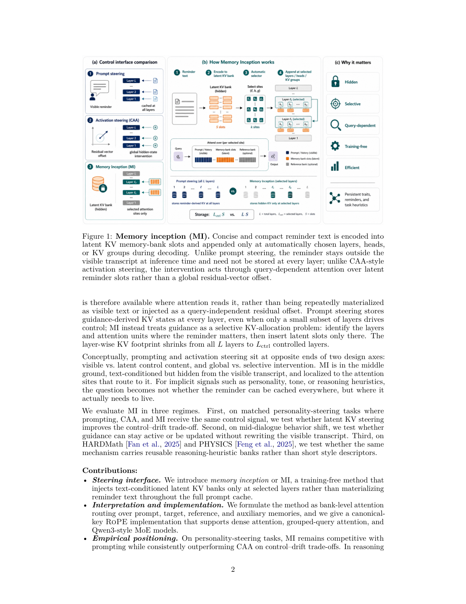
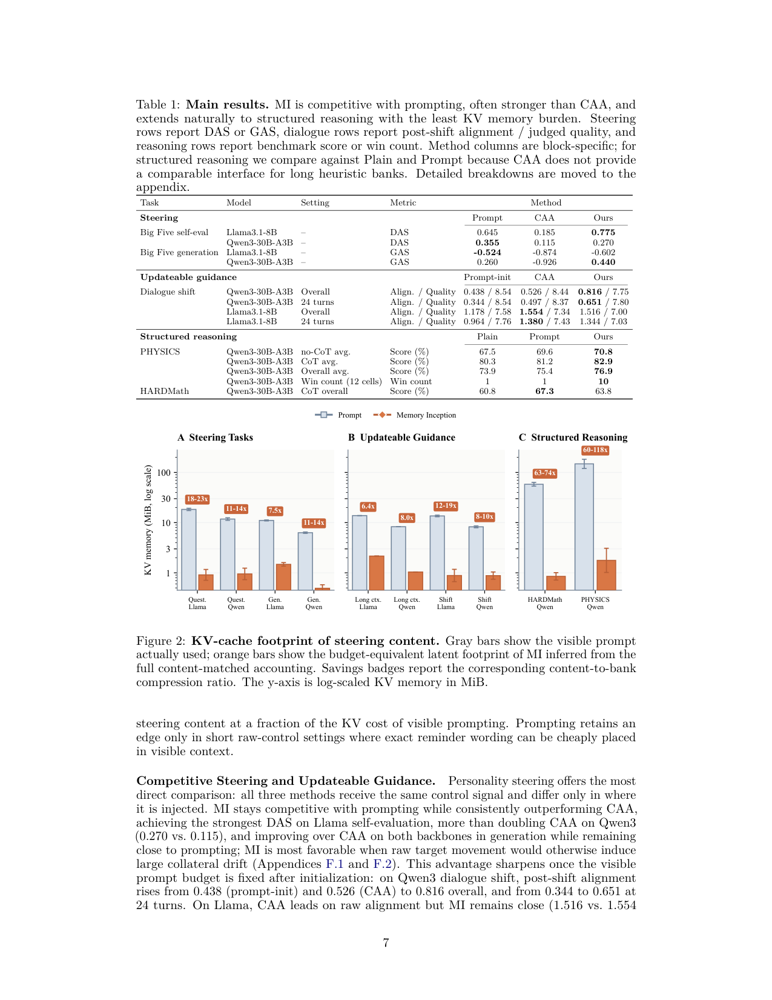

`memory_inception | Memory Inception: Latent-Space KV Cache Manipulation for Steering LLMs | Yale University · Princeton · Jump Trading | 2026-05·arXiv v2(2605.06225, cs.LG)·Preprint | 主题线 L?（test-time 免训练操纵激活/KV缓存做行为引导 = "改 logits/激活而非参数/文本"线）· 相关性 High（与"改激活/KV"路线 + 探测-注入直接相关）`

> 三标注约定：【原文】= 论文明说；【推断】= 我的有据判断(附依据)；【待核】= 拿不准的关键事实。

══ 第一层：一眼看懂 [light] ══

- 🟦 **TL;DR**：要让 LLM"持续保持某种行为"(人格特质/语气/长上下文事实/一份推理启发式清单),通常两条路:**① prompting**——把提醒文本塞进可见上下文,控制力强但**每一层都缓存这些 token、长对话里越堆越乱、还暴露在 transcript 里**;**② activation steering(如 CAA)**——直接给隐藏态加一个残差方向,紧凑但偏弱、不忠于文本、难中途更新、放不下大段结构化提醒。本文提出**第三条路 Memory Inception(MI)**:一种**完全免训练**的方法,把提醒文本编码成一组**潜在 KV 槽(latent key-value bank)**,**只在自动挑选出的少数层/注意力头/KV组**把这些槽拼接进 KV 缓存,让模型在解码时**像注意普通 prompt token 一样去注意这些潜在槽**。关键:提醒**不进可见 transcript、不必存在每一层**,只活在"真正用到它的注意力位点"。在人格引导(Big Five)上 MI 取得最佳 control–drift 权衡(媲美 prompting、稳超 CAA);在中途行为切换上不改写可见 transcript 就能切换(Qwen3 上 post-shift 对齐最高);在结构化推理(HARDMath / PHYSICS)上 MI **超过可见 prompting(12 个 subject×mode 格里赢 10 个)**,同时**把内容等价的 KV 存储砍掉最高 118×**。【原文 Abstract/§1/§4】
- **最巧的一步**:**把"行为引导"重构成"选择性 KV 分配(selective KV allocation)"问题——先用一个校准期的自动选择器找出"提醒该住在哪些层/头"(查询与目标 bank 的对齐分 减去 与参考 bank 的对齐分,Eq.3,取每层 top-k 单元、再选 top-m 层),只在这些位点插入潜在槽**(§3.1)。这一步同时解决两件事:① 控制力(只在真正路由到提醒的位点干预,比全局残差精准)+ ② 省存储(KV 足迹从全部 L 层缩到 Lctrl 层,Eq.10 给出比率 L·Tprompt/(Lctrl·Sbank))。抽掉"自动层/头选择 + 只在选中位点插槽",MI 就退回成"在所有层插 bank"——既无存储优势、也失去"按需路由"的精准性;正是 selectivity 让 MI 站在 prompting 与 CAA 的中间地带(文本条件但隐藏、局部化干预)。次巧:**潜在槽用模型自己的 K/V 投影从冻结模型的隐藏态投出来(Eq.6)+ canonical pre-RoPE 存 key**,使其天然兼容 dense / GQA / Qwen3-MoE。【原文§3.1/§3.2】

══ 第二层：为什么做（写透，重点） ══

- **研究背景**：LLM 越来越需要的不是"一次性指令"，而是"**持续性引导**"——让助手在一整份问卷里维持某种人格特质、在多轮对话里保持语气、在后续回答时还记着一条长上下文事实、或对一个领域 benchmark 始终套用一份推理启发式清单(§1 开篇四个例子)。这把问题放进"**如何在推理期(inference-time)给冻结模型施加可持续、可更新的行为控制**"这条线。【原文§1】
- **解决的具体痛点**：现有两条主流引导接口各有硬伤(§1)。**① Prompting(提示)**——把提醒文本塞进可见上下文，控制力强、忠于文本，但**(a) 提醒 token 在每一层都被缓存(LTprompt 级 KV 占用)，(b) 长交互里越堆越乱(clutter)、(c) 暴露在可见 transcript 里**(隐私/审计问题)、(d) 想中途换引导得改写整段可见历史；**② Activation steering(激活引导，如 CAA)**——给隐藏态加一个对比/学习出来的残差方向，紧凑，但**(a) 偏弱、(b) 不"忠于文本"(把一段话压成一个全局方向，丢结构)、(c) 难中途更新、(d) 放不下"大段结构化提醒"(如三段式推理 checklist)**。核心痛点一句话：**对人格/语气/推理启发式这类"隐式信号"，真正的问题不是"提醒能不能在每层都缓存"，而是"它到底该住在哪几层"**(§1 原文："the question becomes not whether the reminder can be cached everywhere, but where it actually needs to live")。
- **相关工作 & 各自不足**(§2)：**①Prompting / soft-prompt(prefix-tuning, prompt-tuning)**——soft prompt 学连续前缀注入、不改基座权重，但**需要训练优化前缀参数**(MI 是 training-free 且直接从用户文本/任务启发式现构 bank，不靠优化参数)；**②Activation/representation 工程(ActAdd、CAA、function vector、RepE)**——证明可复用的潜在方向能编码高层行为，但**把引导压成单个残差方向**，放不下多块结构化指导；**③注意力级引导(AutoPASTA、Spotlight)**——靠把注意力重分配到指令 token 上，但**仍偏置在可见 prompt token 上**；**④KV Cache Steering(Belitsky 2025)**——操纵已缓存的 prompt 表示诱导推理行为，是最近邻。MI 的差别：**追加全新的、由文本投影出来的 KV 内容(而非压成残差/偏置可见 token)，让模型能 attend 到可复用的整块指导**。【原文§2】
- **动机链**：现状(要持续引导只能 prompting 或 activation steering)→ 缺陷(prompting 每层缓存+暴露+难更新；steering 弱+无结构+难更新)→ 两者其实站在**两条设计轴的两端**：**可见↔潜在 控制内容** × **全局↔选择性 干预**(§1)→ 为什么不用更简单的现成做法？纯 prompting 在"持久/结构化/长"指导下 KV 成本爆炸且暴露；纯 CAA 放不下结构化 checklist 又偏弱；soft-prompt 要训练→ 所以需要**第三条路：文本条件(像 prompt 一样忠于文本)但藏在可见 transcript 之外(像 steering 一样潜在)、且只在真正路由到它的注意力位点做局部干预(selective)**——这就是 MI 的"中间地带"定位。【原文§1】
- **与最近邻工作的 Δ**：**最近邻是 KV Cache Steering(操纵已有 prompt 的缓存表示)与 CAA(残差方向)**。Δ 在一个关键点：MI **不改/不偏置原有缓存，而是用模型自身的 K/V 投影把一段提醒文本投成一组全新的潜在 KV 槽(latent bank)，并只在自动选出的少数层/头插入**，解码时让这些位点的 query 像 attend 普通 token 一样 query-dependent 地 attend 这些槽(Eq.1-2/Eq.6)。这差异有用：**(a)** 相比 CAA 单残差方向，bank 能承载"多块、结构化、可复用"的指导(target/reference/auxiliary 多 bank)且按 query 自适应路由(Eq.4-5)，控制更强更精准；**(b)** 相比 prompting 在每层缓存，bank 只住 Lctrl 层 → KV 占用从 LTprompt 降到 LctrlSbank(Eq.10，最高 118× 压缩)且不进可见 transcript(可中途换 bank、不暴露)。【推断，依据§2 对 KV Cache Steering/CAA 的定位 + §3.1/§3.3】

══ 第三层：怎么做 + 靠不靠谱 ══

- **方法流水线**(§3，输入提醒文本→输出受控解码)：①**构 bank(§3.2)**：把源文本(人格描述符/对话摘要/检索事实/安全注记/任务启发式)套进模板(直述/内在原则包裹/隐藏引导注记包裹)→ 过**冻结基座**前向、记录每 token 隐藏态 → 只保留对齐到描述符内容的位置 → 对每个选中层 ℓ 和选中 KV 单元 u，把隐藏态归一化后**经模型自己的 K/V 投影 W_K/W_V 投成潜在槽**(Eq.6)，并用 **canonical pre-RoPE 坐标存 key**(Eq.7，δ=0 → 位置无关，可跨对话复用)。②**选位点(§3.1 自动选择器，校准期一次性)**：对每个候选层/单元算"query 与 target bank 的对齐分 减去 与 reference bank 的对齐分"(Eq.3)→ 每层取 top-k 单元、聚合后取 top-m 层 → 冻结成 selector artifact(选中层/单元 + 层增益 ρℓ)。③**插入并路由(§3.1 解码期)**：在选中位点把 bank 的 K/V **拼接进该位点可见的 KV**(Eq.2)→ 解码每步，prompt bank(b=0) 与各 memory bank(target/reference/auxiliary) 用 **size-normalized evidence(Eq.5)做 bank 级 softmax 竞争**(Eq.4)，决定该位点输出。④**对比增强(Eq.8-9，可选)**：算 target−reference 证据差 Δ，经 query 自适应门 g±=σ(±γΔ) 把差转成 bank 增益，正 bank 加分、负 bank 扣分。⑤**实现细节**：实际不改原生 paged KV cache，而是在选中层挂一条"side-bank 注意力路径"(Appx B.1)，兼容 dense head(Llama)/GQA KV 组(Qwen3)。【原文§3.1-3.3】
- **逐组件必要性**：**①自动层/头选择(selectivity)**——核心，**有消融**(Fig 3 层数消融)：固定 bank 内容、变选中层数，易特质(宜人性)1 层就够、~10 层稳定，难特质(神经质，逆 Qwen3 默认倾向)需 >10 层才转正——证明"覆盖宽度按难度自适应"是必要的，且**即便最宽设置 KV 仍低于 prompt**(Panel C)；**②size-normalized evidence(Eq.5)**——直觉上防"大 bank 因槽多而无脑赢路由"，**未单独消融**(标出：无"去归一化"对照)；**③canonical pre-RoPE 存 key(Eq.7)**——使 bank 位置无关、可复用，是工程必要性(否则 bank 绑死构造位置)，**无消融但属正确性前提**；**④target/reference/auxiliary 多 bank + 对比门(Eq.8-9)**——承载结构化指导，**未做"单 bank vs 多 bank"消融**；**⑤long-context persistence(Fig 4)**虽非组件但验证了"潜在 bank 不被后续竞争上下文冲淡"这一设计后果。**关键缺失**：除层数消融与长上下文持久性两项外，**bank 构造配方(模板选择/保留哪些位置/token 槽 vs 上下文化变体)无消融**，selector 的 top-k/top-m 也无敏感性分析。【原文§6 / Fig 3-4】
- **关键机制/公式**：**①选择器对齐分(Eq.3)** \(a_{ℓ,u}=max_j ⟨q,k+⟩/√d − max_j ⟨q,k−⟩/√d\)——直觉：一个注意力单元的 query 若"更像在找 target bank、而不像在找 reference bank"，说明这里是引导该住的地方；用 target 减 reference 而非只看 target，是为了挑出"判别性"位点。**②bank 级混合(Eq.4-5)** \(o⋆=Σ_b π_b·o_b，π=softmax(β_b)，β_b=log((1/M_b)Σ exp(s_{b,m}))\)——直觉：每个 bank 先内部 softmax 聚合出一个"读到的内容 o_b"和一个"证据强度 β_b"(log-sum-exp 形式=软最大相似度)，再在 bank 之间按证据 softmax 竞争；**除以 M_b(等价减 log M_b)**让证据是"平均"而非"总和"，大 bank 不占便宜。**③KV 比率(Eq.10)** `LTprompt/(LctrlSbank)`——直觉：prompt 指导要在全部 L 层各缓存 Tprompt 个 token，MI 只在 Lctrl 层各放 Sbank 个槽，比值即省存储倍数(Qwen3 L=48、Lctrl=5，等 token/槽时 9.6×)。【原文§3.1/§3.3】
- **实验与证据**(§4-5，4 类设置 + 2 个 backbone)：**模型**=Meta-Llama-3.1-8B-Instruct + Qwen3-30B-A3B；统一对比集=plain / prompt(同指导放可见上下文)/ CAA / MI。**支撑核心主张的关键实验**：**(1) 人格引导(Big Five，IPIP-50，GPT-4o-mini 判)**——最公平对比(三法收同一控制信号、只差注入位置)：MI 媲美 prompting、稳超 CAA(Qwen3 self-eval DAS **0.270 vs CAA 0.115**，翻倍多；Llama DAS **0.775** 居首；generation 上 Qwen3 GAS **0.440 vs prompt 0.260 vs CAA −0.926**)；**(2) 中途行为切换(dialogue shift，204 分支例)**——固定可见预算下，Qwen3 post-shift 对齐从 prompt-init 0.438 / CAA 0.526 升到 **MI 0.816**(24 turns 0.344→0.651)，是清晰的"潜在更新"胜利；**(3) 结构化推理(PHYSICS/HARDMath)**——把推理启发式当 bank：PHYSICS **MI 76.9% > prompt 75.4% > plain 73.9%，赢 12 格中的 10 格**；HARDMath 较混(prompt 67.3% 领先，MI 63.8% > plain 60.8%)；**(4) KV 省存储(Fig 2)**——内容等价下 MI 比可见 prompting 省 **6.4×(长上下文 Llama)~60-118×(PHYSICS)**。**Baseline 公平性**：人格引导三法同信号、最干净；结构化推理只对比 plain/prompt(原文明说 CAA 无法承载长 heuristic bank 的可比接口，合理)。**"看着强但没回答核心问题"的点**：①**跨任务无统一聚合分**(原文 Limitations 自承：人格用 LLM-Likert、推理用 rubric 部分给分，judge/协议不同)，所以"全面更好"是分项拼出来的；②HARDMath 上 prompt 仍赢——说明"**当确切措辞重要时可见 prompting 仍占优**"(MI 强在"持久/结构化/长/省存储"而非"逐字忠实")；③Fig 2 报的是"KV 等价存储足迹"**而非实测延迟/分配器级 VRAM**(原文明说)，省存储是理论账面而非端到端实测。【原文§5 Table 1 / Fig 2 / §7 Limitations】
- **假设与失效边界**：**①【原文 Limitations】bank 质量任务依赖**——"噪声/过专/过宽"的槽在新场景会失效，且 selector **需任务特定校准样例**(MI 不是零设计接口)；**②【原文 Limitations】backbone 依赖**——Qwen3 上"持久引导"收益最明显、Llama 呈更尖锐的"可控性-质量"权衡(Llama dialogue 上 CAA 原始对齐反超 MI)；**③【原文】成本口径**——省存储仅按 KV 等价足迹算，未测真实延迟/显存；**④【推断】selector 用对齐分挑层，隐含"目标行为在少数层有可判别的注意力签名"假设**——对"弥散在全网的能力/无明显路由的信号"可能挑不出有效位点(难特质需 >10 层即苗头)；**⑤【推断】bank 静态不进化**——构好即冻结，不随交互更新内容(只能切换/叠加 bank)，非"在线学习"。**安全边界**：原文§7 主动警示——同一潜在引导机制可被滥用做**隐蔽行为塑造/隐藏策略注入**，故只放匿名研究代码、并要求部署时披露+审计+敏感 bank 人审。
- **祛魅总结**：**真贡献(硬货)**——【推断】① 把"行为引导"干净地重构成"**选择性 KV 分配**"问题，并给出**用模型自身 K/V 投影 + canonical pre-RoPE + 自动层/头选择**的 training-free 实现，兼容 dense/GQA/MoE，是扎实的机制创新；② "**指导不必住在每一层**"这一系统洞察 + Eq.10 的 KV 账(最高 118×)是实打实的省存储卖点，对长/结构化指导尤甚；③ 层数消融(Fig 3)与长上下文持久性(Fig 4)是有说服力的机制证据(难特质需更宽覆盖、潜在 bank 抗上下文冲淡)。**包装/营销成分**——【推断】① 摘要"**outperforms visible prompting on HARDMath and PHYSICS**"措辞偏强：实际**只在 PHYSICS 全面赢、HARDMath 仍输给 prompt**(只赢了 plain)，"10/12 格"是 PHYSICS 单项；② "省 118×"是**KV 等价账面值、非实测延迟/显存**(原文自承)，读者易当成真实资源节省；③ 跨任务无统一指标，"最佳整体权衡"是分项拼装的定性论断；④ 收益**强 backbone 依赖**(Qwen3 好、Llama 弱)，普适性有保留。作者对"机制创新 + 省存储"估计准确，对"全面超越 prompting"有轻微措辞高估(HARDMath 反例就在自己表里)。整体是一篇**机制扎实、定位清晰、但实证口径偏乐观**的 training-free steering 工作。【推断，依据 Table 1 HARDMath 行 + §7 Limitations 自承】

══ 结构化抽取 ══

- 🎯 **机制速览 6 轴** [light]：

| 学什么信号 | 改什么 | 何时改 | 免梯度? | 记忆-技能生命周期 | 防遗忘机制 |
|---|---|---|---|---|---|
| **用户给的文本/任务启发式**(人格描述符 / 对话摘要 / 检索事实 / 安全注记 / 推理启发式;无 reward、无梯度——bank 由冻结模型前向跑文本取隐藏态投影得到) | **激活/KV 缓存**(latent KV bank,插入选定层的注意力侧路;**模型权重完全冻结**,prompt 也不变——干预发生在 latent attention 空间) | **test-time 在线 per-step 解码**(每个生成步,选定位点的 query 对 prompt token + 各 bank 做 query-dependent 路由);bank 的"层/头选择"在**校准期一次性**冻结成 selector artifact | **是**(明确"training-free";无 RL/无 SFT/无 soft-prompt 优化;靠注意力路由 + 投影,不反传) | 写入=文本→模板包裹→冻结模型前向取隐藏态→经模型自身 K/V 投影成潜在槽(可复用 bank)→"检索"=解码时按 bank-level evidence(size-normalized,Eq.5,大 bank 不因槽多而占便宜)与 prompt/target/reference/auxiliary 多 bank 竞争路由→淘汰=无显式遗忘(bank 是静态可复用工件);共享=bank 可跨对话/任务复用(persistent guidance) | **不适用**(免训练→无灾难性遗忘);反而是"对抗 prompt 在长对话里被冲淡/遗忘"的手段(Fig4 长上下文持久性);无几何共识/merging/KL 投影 |

- ⑦ **开源代码 + 框架/harness**：**作者声明放出"匿名研究代码"，但本 PDF 提取不到该链接**——【原文§7 Responsible release / Appx D】明说"we release only **anonymous research code, evaluation scripts, and benchmark assets**"，且"**the anonymous repository linked in the abstract** points to the exact evaluation assets"。但本 PDF 全文(31 页)PyMuPDF 全量正则扫描**未提取到任何 GitHub/anonymous.4open/HF/gitlab/zenodo URL**(正文 URL 全为参考文献 aclanthology/arxiv/openreview/doi；PDF 超链注解仅含 arXiv 自链 `arxiv.org/abs/2605.06225v2`)——【推断】匿名链接很可能以**超链文本**形式嵌在摘要里、未被文本层抽出，或匿名化处理时被隐去。**结论：声称有匿名代码(出于安全考虑只放研究/评测脚本、不放部署服务)，但本次无法获取可达链接，未 clone 核验**；需手动查原文摘要超链或后续 deanonymized 版本。框架/harness:**无训练框架**;推理用 **vLLM**(Qwen3 高吞吐批量确定性生成;plain/prompt 走标准 vLLM 路径,干预运行加载 method-specific artifacts);MI 实现为"选定层的侧 bank 注意力路径",**非直接改原生 paged KV cache**(Appendix B.1)。模型=**Meta-Llama-3.1-8B-Instruct**(选 dense head)+ **Qwen3-30B-A3B**(选 GQA KV 组,L=48、Lctrl=5)。〔本子代理仅深读抽取;因无可达代码链接,无可 clone 项,报告须显式标注"代码未在论文中给出链接"〕【原文§4 + 全文扫描】

- 🎯 **对"探索-巩固"idea 对标** [light]：**强支撑 + 高价值可借组件(对 MTP/激活探测路线尤其契合)**。MI 是"**改激活/KV 而非改参数/文本**"路线里最贴近本项目的一篇:① 它证明**用模型自身 K/V 投影把"一段指导"编码成潜在 KV 槽、只在选中层注入、靠 query-dependent 注意力被按需读取**是可行且优于全局残差(CAA)的——这为本项目"把前瞻探测(MTP)得到的'该走哪条路'信号,作为潜在槽注入到关键层/关键步、让模型在解码时按需 attend"提供了几乎现成的机制蓝图;② **自动选择器(query 对齐分挑层/头)**直接回答"path-recovery 信号该注入在哪一层哪个头"——与本项目"单点接管/关键步注入"高度同构;③ **bank-level 多 bank 竞争路由(target/reference/auxiliary)+ size-normalized evidence**——可用于"多个候选续写方向同时挂载、由当前 query 自适应选用"。竞品/缺口:它是**纯 steering、不学习、bank 静态不进化、不写参数**,与本项目"巩固进策略"互补而非替代——可作为"巩固成果以 KV-bank 形式低成本即插即用、暂不动权重"的轻量替代/过渡方案,或"探索阶段临时注入前瞻信号"的载体。【推断,依据 §3.1 选择器 + §3.2 bank 构造 + §1 三种 regime】

- 🖼 **关键图 top-2** [light]：

· 这是**原文 Figure 1**(方法/概念主图)。三栏:**(a) Control-interface 对比**——prompting(可见、全局缓存)vs activation steering(潜在、全局残差)vs MI(潜在、选择性);**(b) MI 如何工作**——简洁提醒文本→编码成 latent KV memory-bank 槽→只在自动选中的层/头/KV组解码时拼接,提醒留在可见 transcript 之外、不必存每层;**(c) 为什么有用**——persistent / structured / 昂贵的指导。选它因为它一图讲清 MI 在"可见↔潜在 × 全局↔选择性"两轴上的中间地带定位与完整机制,是理解全文的钥匙。

· 这是**原文 Figure 2**(核心系统性发现图)。对比可见 prompting 与 MI 的 KV-cache 足迹:灰柱=可见 prompt 在所有 L 层的缓存占用;MI 只在 Lctrl 个受控层插 Sbank 个槽,理想比率 L·Tprompt/(Lctrl·Sbank)(Qwen3 L=48、Lctrl=5 → 等 token/槽时 9.6×,实测内容等价最高 **118×**)。选它因为它把 MI"指导不必住在每一层"的省存储核心卖点直观量化,正是 MI 相对 prompting 的关键系统优势(也支撑"持久/结构化指导"的适用场景论断)。
