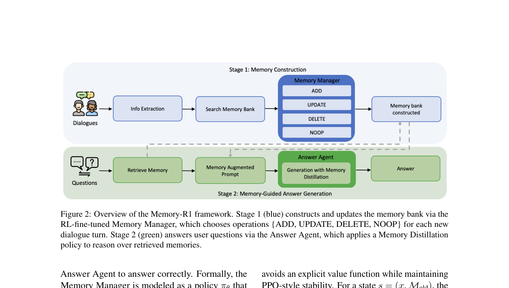
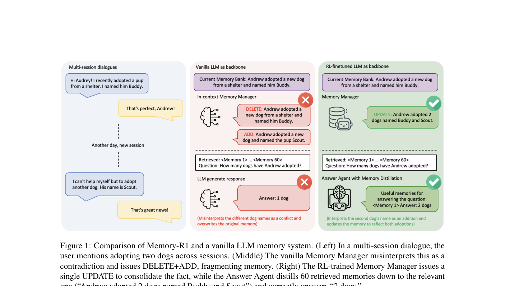

`memory_r1 | Memory-R1: Enhancing LLM Agents to Manage and Utilize Memories via Reinforcement Learning | LMU Munich · MCML · TU Munich · Cambridge · HKU · TU Darmstadt · Edinburgh（Yunpu Ma / Volker Tresp / Hinrich Schütze 组）| 2025-08 首发·arXiv v5(2026-01-14 更新)·cs.CL | 主题线 L?（RL 学记忆操作 = "用 RL 训练 agent 管理/利用外部记忆"线）· 相关性 High`

> 三标注约定：【原文】= 论文明说；【推断】= 我的有据判断(附依据)；【待核】= 拿不准的关键事实。

══ 第一层：一眼看懂 [light] ══

- 🟦 **TL;DR**：LLM 本质"无状态"——上下文窗口外的信息就忘了。现有外部记忆库(Mem0/MemGPT 等)靠 in-context 指令让原始 LLM 决定增删改，**没有任何与"答得对不对"挂钩的学习信号**，所以连简单情形都会错(把"又领养了一只狗 Scout"误判成与"领养了 Buddy"矛盾→DELETE+ADD 把记忆撕碎)。Memory-R1 用 **RL 训练两个专门 agent**：① **Memory Manager** 学结构化操作 {ADD, UPDATE, DELETE, NOOP}；② **Answer Agent** 用"记忆蒸馏(Memory Distillation)"先从 60 条检索记忆里挑出真正相关的几条再推理作答。两者都用 **PPO 或 GRPO**、**只用 152 条 QA**、奖励就是下游答案的 Exact-Match 对错(无需标注每步操作)。在 LoCoMo 上相对最强 baseline F1+28%、BLEU-1+34%、LLM-Judge+30%；且只在 LoCoMo 训练就能 zero-shot 迁移到 MSC/LongMemEval，3B–14B 都有效。【原文 Abstract/§1/§4】
- **最巧的一步**：**用"下游 QA 正确性"当唯一奖励信号去训练记忆操作**(§3.1 Reward Design, Eq.4)。抽掉它(即不给记忆操作任何 outcome 奖励、退回 in-context 启发式),整个方法就垮——因为标注"每条信息该 ADD 还是 UPDATE"既不可行又主观；正是"用最终答对与否反推该怎么操作记忆"这一步绕开了标注难题。消融"去掉 RL 的 Memory Manager"F1 41.0→34.5 证明它是核心(Fig 5a)。

══ 第二层：为什么做（写透） ══

- **研究背景**：LLM 是强通用推理器但受限于固定上下文窗口,长对话/演化任务里窗外信息即丢失。主流补救是给 agent 加外部记忆模块,多数走 RAG 范式(把检索到的记忆条目拼进 prompt)。【原文§1/§2.1】
- **解决的具体痛点**(两个,很具体):
  1. **检索挑战**：启发式检索"要么太少漏关键、要么太多塞噪声",且检索到的记忆**不加过滤/排序**直接喂给 LLM,模型被迫在相关+无关内容上推理,易被噪声带偏。人类则是"广撒网再过滤"。【原文§Abstract/§1】
  2. **记忆管理挑战**：决定"记什么/更新什么/丢什么"。现有系统(MemGPT/Mem0)用 CRUD 风格操作但**靠 vanilla LLM 从 in-context 指令里选操作,没有任何与正确性挂钩的学习信号**——连"两只狗"这种简单 case 都会因把第二次领养误判成矛盾而 DELETE 掉旧记忆。【原文§1, Fig 1, 附录 A.1 真实对话】
- **相关工作 & 各自不足**：
  - **记忆增强 agent**(LoCoMo/ReadAgent/MemoryBank/MemGPT/A-Mem/Mem0)：多为**静态记忆设计**,记忆操作靠启发式,缺自适应与长期优化。
  - **LLM+RL**(RLHF、Toolformer/ReAct、Search-R1、R1-Searcher、Trial-and-Error)：证明 RL 能改进工具使用/web 导航/搜索等复杂行为序列,但**记忆管理与利用在 RL 设定下基本没人做**。
  - Memory-R1 自称是**首个**把"记忆操作选择 + 相关记忆利用"框成 RL 问题的工作。【原文§2.1/§2.2】
- **动机链**：LLM 无状态→加外部记忆→但靠 in-context 启发式选 CRUD 无学习信号→简单 case 都会撕碎记忆(DELETE+ADD)+ 检索噪声淹没答案→SFT 不行(无法标注每个记忆操作/检索决策)→RL 能用 outcome 奖励对齐高层目标→所以用 PPO/GRPO + EM 奖励,让模型自己学"何时 add/update/delete/retain"以及"如何用检索记忆推理"。【原文§1】
- **与最近邻工作的 Δ**：与 Mem0(同样用 {ADD,UPDATE,DELETE,NOOP} 操作集)最像,**关键差异 = Mem0 用 vanilla LLM 从 in-context 指令选操作(零学习信号),Memory-R1 用 RL 把这套操作"训"进模型**。这差异有用是因为:Fig 1 的 Buddy/Scout 案例显示——同样的操作集,未训练模型误判矛盾撕碎记忆,RL 训练后会用单个 UPDATE 合并(consolidation over fragmentation)。【原文§1/§2.1, Fig 1】

══ 第三层：怎么做 + 靠不靠谱 ══

- **方法流水线（两阶段,对应 Fig 2）**：
  1. **Stage 1 记忆构建(蓝)**：每个对话 turn,LLM 抽取&摘要值得记的信息 → 从记忆库检索相关条目 → **Memory Manager** 把(抽取信息 x, 当前记忆库 M_old)映射到一个操作 o∈{ADD,UPDATE,DELETE,NOOP} + 更新内容 m(Eq.1),应用到记忆库。
  2. **Stage 2 答案生成(绿)**：对每个问题,用相似度 RAG 检索 **60 条**候选记忆 → **Answer Agent** 用"Memory Distillation 策略"先从 60 条里挑出最相关的几条(过滤噪声)→ 再推理作答(Eq.5)。
  3. **训练**：两个 agent **分开训练**(为在稀疏奖励下保稳定),都用 PPO 或 GRPO,奖励是下游答案 EM(Eq.4)。
- **关键机制/公式直觉**：
  - **PPO**(Eq.2)：Memory Manager 采样操作→应用→喂给**冻结的** Answer Agent→答案对错给标量 reward→clipped PPO 更新。直觉:用"答得对吗"反向告诉 Manager"刚才那个 DELETE 是好是坏"。
  - **GRPO**(Eq.3)：每状态采 G 个候选操作/答案,用**组内标准化优势** A_i=(r_i−mean)/std,免 critic、加 KL 正则防漂移。直觉:同一道题里多个候选互相比,谁让答案更对谁优势高,省掉单独训 value 网络。
  - **EM 奖励**(Eq.4)：`R = EM(y_pred, y_gold)`,无需人工标操作标签、可扩展。
  - **记忆蒸馏**：Answer Agent 不是无脑吃 60 条,而是**先选后推理**——附录 A.2 案例:问"John 住海边还是山里",原始模型被"mountaineering"干扰答"mountains",蒸馏后只挑 beach 相关记忆答对"beach"。
- **逐组件必要性（消融 Fig 5,LLaMA-3.1-8B,F1/B1/J）**：
  - **(a) 去掉 RL Memory Manager**：PPO 41.0/32.9/57.5 → 34.5/28.1/49.0;GRPO 同样掉到 37.5/30.6/52.9 → outcome RL 比脚本控制更有效。
  - **(b) 去掉 RL Answer Agent**：PPO 仅 32.5/24.6/59.4,full 升到 41.0/32.9/57.5;GRPO 33.0/24.9/59.9→45.0/37.5/62.7。
  - **(c) 去掉 Memory Distillation**：GRPO 41.0/34.4/60.1→45.0/37.5/62.7,PPO 也升 → 过滤无关记忆降噪有效。
  - **额外洞察(都做了对照)**：① **Answer Agent 越好搭配越强的 Manager 增益越大**(Fig 6:配 GPT-4o-mini Manager 时 F1 增益 +19.72 vs 配 8B 的 +10.10)——"复利效应";② **奖励设计**(Table 2):用 LLM-Judge 当奖励 J 最高(63.58)但 F1/B1 差(输出冗长),用 EM 奖励三指标均衡 → 选 EM;③ **PPO vs GRPO**(Fig 7):GRPO 初期收敛更快(组内归一化早期引导强),最终二者 reward 相近;④ **蒸馏 vs reranker**(Fig 8):蒸馏比 reranker 精度更高且中位/尾延迟更低。**消融非常全面扎实**。
- **实验与证据**：
  - **数据集**：训练&主测 **LoCoMo**(约 600 turns/26k tokens,单跳/多跳/开放域/时序;**排除 adversarial 子集**;1:1:8 划分=152/81/1307 题);零样本泛化测 **MSC**(多会话开放域)与 **LongMemEval**(事实召回/时序/实体追踪)。【原文§4.1, 附录 B】
  - **backbone**:LLaMA-3.1-8B-Instruct + Qwen-2.5(3B/7B/14B)。
  - **支撑核心主张的关键实验 = Table 1**(LoCoMo 主表):LLaMA-3.1-8B 上 Memory-R1-GRPO overall F1 45.02/B1 37.51/J 62.74,相对最强 baseline MemoryOS 提升 28.5%/34.0%/30.2%;**且超过 Memory-SFT**(后者用 GPT-5 教师做行为克隆),证明 outcome RL > 纯模仿。
  - **泛化(Fig 4)**:只在 LoCoMo 训,zero-shot 到 MSC/LongMemEval 仍全面提升。**可扩展(Fig 3)**:3B/7B/14B 都稳超 base。
  - **baseline 公平吗**:【原文】所有 baseline 用同样 LLaMA-3.1-8B / Qwen-2.5-7B 重新实现,temp=0、max 2048 token,较公平。
  - **"看着强但没回答核心问题"的隐患**【推断】:主结果只在**去掉 adversarial 子集**后报(§4.1 明说 follow Mem0 排除对抗集)——所以对"换名/对抗"鲁棒性这一最难维度**没有正面证据**;依据:§4.1"exclude the adversarial subset"。
- **假设与失效边界**：
  - 【原文 Limitations】① 评测**只在对话型数据集**,扩到多模态有未知挑战;② Memory Manager 与 Answer Agent **分开训练**(为稀疏奖励下的稳定),"necessary but makes the process less straightforward"——端到端多 agent RL 是未来方向。
  - 【原文】操作集固定为 {ADD,UPDATE,DELETE,NOOP}(沿用 Mem0),检索固定 60 条候选——这些是设计选择而非学出来的。
  - 【推断】奖励是 EM,对"语义对但措辞不同"的答案会误罚(Table 2 已揭示),长答案场景下 EM 奖励会扭曲行为;依据:§4.4 reward 分析里 EM vs J 的权衡讨论。
- **祛魅总结**：
  - **真贡献(硬货)**：① **首个把记忆操作+利用框成 RL 问题**并系统验证(PPO+GRPO、多尺度、跨 benchmark),消融极全;② **152 条 QA + outcome 奖励**就 SOTA,且**超过 GPT-5 蒸馏的 SFT**,数据效率论点有说服力;③ "记忆蒸馏 > reranker(精度↑延迟↓)"是实用发现。
  - **包装/营销成分**【推断】:标题"Manage and Utilize"听着很全能,但**操作集和检索数都是写死的**,模型学的只是"在固定动作空间里选哪个 + 选哪几条记忆",并非端到端自定义记忆结构;且"SOTA"建立在排除 adversarial 子集之上。依据:§4.1 排除对抗集 + 固定操作集/60 条检索。
  - 作者**可能高估**了泛化主张的强度【推断】:zero-shot 迁移的三个 benchmark 都是对话型长期记忆,同质性高,谈不上"broad generalization";依据:Limitations 自承只测 dialogue-centric。

══ 结构化抽取 ══

- 🎯 **机制速览 6 轴** [light]：

| 学什么信号 | 改什么 | 何时改 | 免梯度? | 记忆-技能生命周期 | 防遗忘机制 |
|---|---|---|---|---|---|
| **环境 reward**(下游 QA 的 Exact-Match 对错,outcome-driven,无操作标签) | **模型参数**(用 RL 微调两个 LLM agent 的权重:Memory Manager + Answer Agent) | **离线批量训练**(用 152 训练 QA 做 PPO/GRPO);**推理时**记忆操作是 per-turn/per-episode 在线执行,但参数不再变 | **否**(纯梯度 RL:PPO/GRPO 更新策略参数) | 写入=Memory Manager 选 ADD/UPDATE/DELETE/NOOP→检索=相似度 RAG 取 60 条→蒸馏=Answer Agent 选相关子集→淘汰=学到的 DELETE;无显式遗忘曲线 | **学习层面**=GRPO/PPO 的 **KL 正则**防策略漂移参考模型;**记忆层面**=训练出的 UPDATE/合并倾向("consolidation over fragmentation")减少误删,但**无几何共识/merging/参数隔离**类防遗忘 |

- ⑦ **开源代码 + 框架/harness**：**框架=veRL/VERL(HybridFlow, Sheng et al. 2025)**——【原文 附录 D 明写】"Reinforcement learning fine-tuning is performed using PPO and GRPO **within the VERL framework**"。**代码仓库:本 PDF 正文/参考文献中未给出任何 GitHub/项目链接**(全文唯一 URL 是 AIOS docs 参考)〔待核:Memory-R1 业内有公开实现,但严格按"不靠印象、PDF 没写就不编"原则,代码 URL 待 P3 用 WebSearch 快照核验后补〕。
- 💰 **资源/成本与可扩展性**：【原文 附录 D】主实验 **4× NVIDIA H100(80GB)**;Qwen-2.5-14B 需 **8 GPU**;total batch 128 / micro-batch 2 per GPU;max prompt/response = 4096/2048 token。PPO:actor lr 1e-6、critic lr 1e-5、constant warmup;GRPO 只更新 actor(grouped return normalization)。训练 temp τ=1.0(鼓励探索),评测 greedy τ=0。**数据极省:仅 152 训练 QA**。Fig 8 显示蒸馏比 reranker 延迟更低(推理成本优势)。
- 🎯 **对"探索-巩固"idea 对标** [light]：**支撑 + 可借组件**。支撑:它直接证明"**用下游 outcome 奖励就能学会何时巩固(UPDATE/合并) vs 何时丢弃(DELETE)**"——这正是"巩固"机制的一个可训练实例,且 GRPO 是本项目熟悉的算法族。可借组件:① **outcome-driven EM 奖励训练"记忆操作/路径选择"**的范式,可迁移到"训练 agent 决定何时该接管/改写推理路径";② **两阶段分训(Manager 冻结训 Answer / 反之)以稳住稀疏奖励**——对本项目 path-recovery 单点接管的稀疏信号训练有借鉴;③ Answer Agent 的"先蒸馏后推理"= 一种"巩固时先筛信号再用"的结构。缺口:它**不碰"探索"(无主动探索新路径)**、不做 test-time 自进化(训练后参数冻结),也未与 MTP/前瞻探测结合。
- 🔭 **开放问题/未来方向**：【原文 Limitations】① 扩到**多模态**记忆;② 把 Manager+Answer 的分训改成**端到端多 agent RL**(简化训练 + 更丰富协调)。【推断】③ 让记忆**操作集/检索数本身可学**(目前写死);④ 把 EM 奖励换成更鲁棒的语义奖励以支持长答案场景(Table 2 已暴露 EM 局限);⑤ 在含 adversarial 子集上验证鲁棒性。

- 🖼 **关键图 top-2** [light]：

· 这是**原文 Figure 2**(框架主图/pipeline)。表现了"咬合"全貌:**Stage 1(蓝)记忆构建**——Dialogues→Info Extraction→Search Memory Bank→**Memory Manager 选 {ADD/UPDATE/DELETE/NOOP}**→记忆库;**Stage 2(绿)答案生成**——Questions→Retrieve→Memory-Augmented Prompt→**Answer Agent(带 Memory Distillation)**→Answer。选它因为它一张图讲清"两个被 RL 训练的 agent 各管一段、靠下游答案对错联动"的核心架构。

· 这是**原文 Figure 1**(动机/对比图)。左:多会话里用户跨 session 提到领养两只狗;中:vanilla Memory Manager 误判为矛盾→发 DELETE+ADD 把记忆撕碎;右:RL 训练后的 Manager 发**单个 UPDATE 合并**为"Andrew adopted 2 dogs named Buddy and Scout",Answer Agent 从 60 条蒸馏出相关那条、答对"2 dogs"。选它因为它用一个最直观的失败案例点明全文动机——"无学习信号的记忆操作连简单 case 都撕碎,RL 教会模型合并而非碎片化"。
