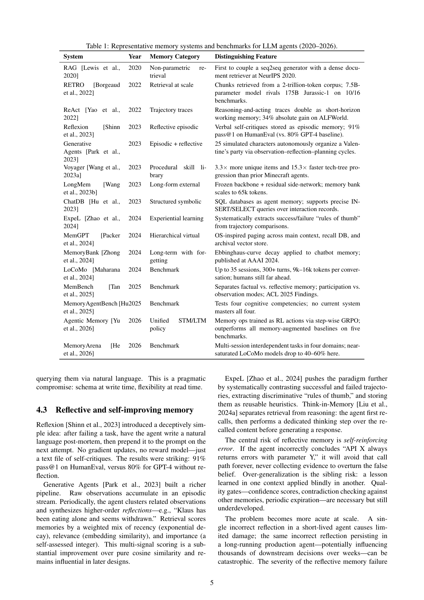
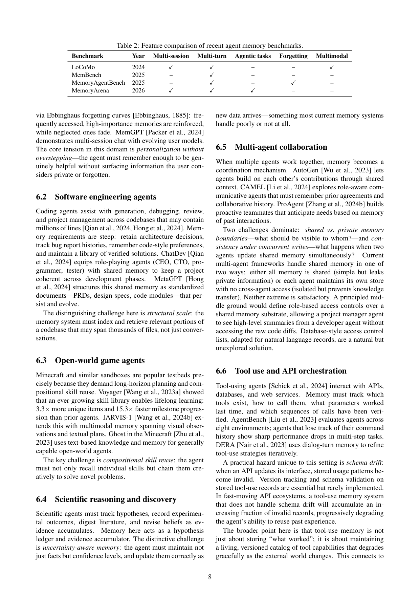

`memory_survey_mech | Memory for Autonomous LLM Agents: Mechanisms, Evaluation, and Emerging Frontiers | Pengfei Du(单作者,Hong Kong Research Institute of Technology) | 2026-03 v1 · arXiv 2603.07670 · 综述 | 主题线 L?(综述·横切记忆全线) · 相关性 High(A 栏记忆操作分类来源)`

══ 第一层:一眼看懂 [light] ══
- 🟦 TL;DR:一篇聚焦"LLM agent 记忆"的综述(覆盖 2022–2026 初)。核心做法:把 agent 记忆**形式化成一个 write–manage–read(写–管理–读)闭环**,套进 POMDP(记忆 Mt = 信念状态);再用**三维 taxonomy**(时间尺度 / 表示载体 / 控制策略)统一一堆零散设计;深挖**五大机制家族**;最后梳理评测从"静态召回"转向"多会话 agentic 测试"的趋势与开放难题(持续巩固、可学习遗忘等)。
- 最巧的一步:**把"manage(U)"从"简单 append"中独立出来**。作者反复强调 U 不是追加,而是"摘要+去重+打分+解矛盾+(必要时)删除",且 R 与 U 构成反馈环——"一次坏写会污染下游很多步"。抽掉这个"管理"维度,记忆就退化成只读检索库,综述的分类骨架(尤其控制策略轴、可学习遗忘等开放问题)就立不住。

══ 第二层:为什么需要这篇综述 + 它如何分类(综述适配) ══
- **领域在关心什么(背景)**:LLM agent 已从无状态聊天机器人走向"能感知环境、推理目标、用工具、长时程行动"的自主软件系统;区分它们与普通 chatbot 的不是更大的模型,而是**能否从经验学习**(coding 助手记住某 API 不稳、游戏 agent 记住已掌握的配方、日程助手不重复问生日)——这一切都要记忆。作者用"调试助手跨一周会话"的例子点破:无记忆则每周一重新发现目录结构、重读 README、甚至**重试周五崩过的修复**;有记忆则是质变(§1.1)。
- **为什么"又一篇"记忆综述(作者的自我定位 §1.3, §8)**:已有 Xi 2023/Wang 2024 的宽 agent 综述(记忆只是一模块),Zhang 2024 有专门记忆综述(围绕 write-manage-read 三粗操作组织)。**但 2025-2026 出现了一波新工作**——Agentic Memory(RL 学记忆控制)、MemBench、MemoryAgentBench、MemoryArena(把记忆与决策紧耦合的 agentic 基准)——landscape 已大变。本文相对 Zhang 2024 的增量:① 补 2025-2026 新系统;② 加 **POMDP-grounded 形式化**(把 Mt 当信念状态);③ 把讨论扩到应用、工程模式(write/read path、observability)、治理(隐私/删除/合规)。三个驱动问题:RQ1 记忆如何分解形式化?RQ2 有哪些机制、各自 trade-off?RQ3 当终极考核是下游 agent 表现时该如何评测?
- **它如何分类(核心组织逻辑)**:把 agent 记忆形式化成 **write–manage–read 闭环**嵌入 POMDP 式 agent 循环——\(a_t=\pi_\theta(x_t, R(M_t,x_t), g_t)\),\(M_{t+1}=U(M_t,x_t,a_t,o_t,r_t)\)。两个强调点:① **U 不是 append**(摘要/去重/打分/解矛盾/删);② \(\pi_\theta\) 与 \((R,U)\) 构成反馈环,"一次坏写污染下游很多步"——这是"记忆既强大又脆弱"的根。在此之上提**三维正交 taxonomy**(时间尺度 / 表示载体 / 控制策略,详见下文 A 栏)+ **五大机制家族**(§4)+ **五大设计张力**(Utility/Efficiency/Adaptivity/Faithfulness/Governance,§2.3)。作者用 ablation 数字论证"记忆是差异化因子":Generative Agents 去 reflection 48 模拟小时内退化、Voyager 去技能库 −15.3× 里程碑速度、MemoryArena 换长上下文基线 80%→~45%——**"有无记忆"的差距常大于换 backbone 的差距**(§2.4)。

══ 第三层:分类框架细节 + 局限(综述适配) ══
- **三维 taxonomy 细节(§3)**:① **时间尺度**=Working(当前上下文窗,Baddeley 中央执行+buffer)/ Episodic(具体经历:工具调用、对话轮、观测,带时间戳+重要性+embedding)/ Semantic(去情境化抽象知识,如多次纠正日期格式→"用户偏好 DD/MM/YYYY")/ Procedural(可执行技能,如 Voyager 把验证过的 Minecraft 例程存成可跑 JS)。**关键洞察**:多数 agent 只把两层做好,**episodic→semantic 的 consolidation 步最被忽视、最脆弱**("particularly underserved",靠开发者硬规则或周期 LLM 摘要,fragile)。② **表示载体**=Context-resident text / Vector-indexed(可扩百万但丢关系,只能问"最像什么"不能问"什么导致什么")/ Structured(SQL/KV/KG,保关系但需预设 schema)/ Executable repo / Hybrid(生产常态,如 MemGPT 三层)。③ **控制策略**=Heuristic(硬规则 top-k、每 n 轮摘要、d 天过期)/ Prompted self-control(把记忆操作暴露为工具让 LLM 调,如 MemGPT 的 core_memory_append/archival_memory_search)/ Learned(端到端 RL 优化,如 Agentic Memory 用 step-wise GRPO 学 store/retrieve/update/summarize/discard 五工具,会发现"上下文满前预先摘要"等非显然策略,但训练贵)。
- **五大机制家族的"必要性/失效"分析(§4,综述的硬货)**:4.1 Context-resident 压缩(滑窗/rolling/hierarchical/task-conditioned)——病症 **summarization drift**(多次压缩后只剩"消毒过的泛化版历史",罕见高重要细节如"never call production DB"第三次压缩就蒸发)+ **attentional dilution**(lost-in-the-middle);4.2 Retrieval-augmented(索引粒度、query 构造、DPR+BM25+元数据)——瓶颈从存储转向**相关性**(返回最有用而非最相似);4.3 Reflective self-improving(Reflexion 存口头自评、Generative Agents 三信号 recency×relevance×importance 打分、ExpeL 抽 rules of thumb)——核心风险 **self-reinforcing error**(错信"API X 总报错"则永不重试),且**风险随 agent 寿命放大**,缓解=reflection grounding(每条反思须引 3 个具体证据);4.4 Hierarchical/virtual context(MemGPT OS 式分页)——阿喀琉斯之踵是 **orchestration**,且失败**静默**(逐错错记录只是回答略差,无异常无日志);4.5 Policy-learned(RL 学记忆控制)——开销大、可能删安全关键信息、跨分布迁移难、可解释性滞后。**外加 4.6 参数记忆**(MemLLM 微调耦合读写模块)——无缝但难审计/难删/更新贵,故多数部署用非参数可检视存储。
- **评测论述(§5,与 evaluating_memory 互文)**:经典 IR 指标(P@k/nDCG)只说"取对没",不说"用对没/值不值延迟"。四基准互补:**LoCoMo**(35 会话长对话,人类仍远超)、**MemBench**(分 factual/reflective × participation/observation)、**MemoryAgentBench**(认知科学四能力 AR/TTL/LRU/SF,无系统全能、多数栽 SF)、**MemoryArena**(把记忆嵌进完整 agentic 任务,LoCoMo 近满分模型在此跌到 40-60%)。提出**四层 metric stack**(任务有效性/记忆质量/效率/治理)。横切教训:long context ≠ memory、RAG 有帮助但离人类远、没人好好评遗忘、跨会话一致性欠探索、参数-非参数 gap 真实、**评测必须含成本**。
- **开放挑战(§9,与"探索-巩固"idea 最相关)**:① **Principled consolidation**——现状在"囤积 vs 失忆"间摆荡,作者点名借鉴睡眠巩固,提**dual-buffer consolidation**(新记忆先入 hot buffer 试用期,过 re-verification/去重/打分后才晋升 LTM,镜像海马→新皮层转移)——这与本调研主线高度同构;② Causally grounded retrieval(语义相似答不了"什么导致");③ Trustworthy reflection(外部验证/不确定性衰减/对抗探针/过期);④ **Learning to forget**(把遗忘当 feature,学选择性遗忘策略,连接 machine unlearning);⑤ 多模态具身记忆;⑥ 多 agent 记忆治理(访问控制/并发写共识/跨 agent 知识转移);⑦ 记忆高效架构;⑧ 更深神经科学整合(spreading activation/reconsolidation/Ebbinghaus+spaced repetition);⑨ **记忆管理基础模型**(task-agnostic 记忆控制器,AgeMem 是第一步);⑩ 标准化评测(缺 GLUE 式共享 leaderboard)。
- **局限与祛魅**【推断,除标注外】:① **综述本身无原创实验**——所有数字均转引他文(Voyager −15.3×、MemoryArena 80%→45% 等均引用),taxonomy 完备性与"POMDP=信念状态"映射属一家之言;② **单作者(Pengfei Du, Hong Kong Research Institute of Technology)、2026-03 v1 新预印本未经会议评审**,引用准确性与覆盖完整性需交叉核验(本笔记已对照 evaluating_memory/sleepgate/agemem 等独立深读,结论一致,可信度尚可);③ 对**参数化记忆、多模态具身记忆覆盖较浅**(作者自列为未来方向);④ 部分"工程现实"章节(observability/regression testing)虽实用但偏经验之谈、无实证支撑【原文均为论述性】。**真贡献(硬货)**:write-manage-read + 三维 taxonomy + 控制策略三分法构成清晰的"记忆设计语言",且把 consolidation/learned-forgetting 明确摆成头号开放难题——对本调研是**最直接的术语供给 + 缺口确认**(A 栏分类即来源于此)。

🎯 **机制速览 6 轴** [light]\(综述论文;此处填它**归纳的整个设计空间**,即 A 栏记忆操作分类的真值)
| 维度 | 内容(均为本文归纳) |
|---|---|
| 学什么信号 | 环境 reward / 自反思(verbal self-critique)/ 用户更正 / 经验记录;形式化为 (xt, at, ot, rt) 喂给 U |
| 改什么 | **记忆**为主(文本/向量/结构/可执行库 4 种载体);控制策略可"提示自控"改 prompt-级操作,或"学习控制"微调策略 |
| 何时改 | 在线 per-step 读 + per-turn/per-session 写管理;含"周期性 rolling/hierarchical summary"离线批量巩固 |
| 免梯度? | **混合**:Heuristic / Prompted self-control = 免梯度;Learned control = 用 RL(step-wise GRPO,三阶段)训练 store/retrieve/update/summarize/discard 五个工具 |
| 记忆-技能生命周期 | **完整 write→manage(摘要/去重/打分/解矛盾/删)→read** 闭环;时间轴含 working→episodic→**semantic(巩固)**→procedural 四层流转 |
| 防遗忘机制 | 综述视角:把"learned forgetting(可学习遗忘)/ 持续巩固 / 矛盾处理"列为**尚未解决的开放难题**,而非已有银弹 |

**A 栏 · 记忆操作分类(本文权威 taxonomy,供全景汇总抽取)**:
- **三正交维度**:① 时间尺度 = Working / Episodic / Semantic / Procedural;② 表示载体 = Context-resident text / Vector-indexed / Structured(SQL·KV·KG)/ Executable repo / Hybrid;③ 控制策略 = Heuristic(硬规则 top-k、每 n 轮摘要、d 天过期)/ Prompted self-control(把记忆操作暴露为工具让 LLM 调,如 MemGPT 的 core_memory_append、archival_memory_search)/ Learned(端到端 RL 优化 store/retrieve/update/summarize/discard)。
- **五大机制家族(§4)**:4.1 Context-resident 压缩(滑窗/rolling/hierarchical/任务条件摘要)、4.2 Retrieval-augmented stores(索引粒度·查询构造·DPR+BM25+元数据)、4.3 Reflective self-improving(Reflexion 存口头自评、ExpeL 抽"rules of thumb")、4.4 Hierarchical/virtual context(MemGPT OS 式分层)、4.5 Policy-learned management(RL 学记忆控制)。
- **五大设计张力(§2.3)**:Utility / Efficiency / Adaptivity / Faithfulness / Governance(隐私·删除·合规)——彼此拉扯,"右"平衡点随应用而变。

- 🎯 **对"探索-巩固"idea 对标** [light]:**框架/术语供给 + 缺口确认**。直接给"巩固"定了位——episodic→semantic 的 consolidation 被本文点名为"最被忽视、最脆弱"的一步("most current systems only do 2 layers well, consolidation is particularly underserved");并把"continual consolidation""learned forgetting"列为头号开放难题。可借:write–manage–read 闭环 + 控制策略三分法,可作我们 idea 的设计语言;其引用 Agentic Memory(Yu 2026,step-wise GRPO 学 5 个记忆工具)是最近邻可借组件。

- 假设与失效边界(一句)【推断】:核心假设"记忆≈POMDP 信念状态、可沿三正交维度无损拆分";失效边界——综述本身**无实验**(数字均转引他文,如 Voyager 去技能库 −15.3× 里程碑速度、MemoryArena 换长上下文基线 80%→45%),且为**单作者、2026-03 新预印本未经会议评审**,taxonomy 完备性与引用准确性属一家之言,需交叉核验;对参数化/多模态具身记忆覆盖较浅(自列为未来方向)。

🖼 **关键图 top-2** [light]
> 说明【原文】:本综述**正文无插图**(经 PyMuPDF 逐页检查:0 张嵌入图、无显著矢量图),仅有 Table 1 / Table 2 两张表。按 prompt"关键表也可"取两表为 top-2。

· 这是**原文 Table 1**:按年份列出 RAG→RETRO→ReAct→Reflexion→Generative Agents→Voyager→MemGPT→Mem0→ExpeL→…→Agentic Memory(2026,STM/LTM 策略,RL 学记忆控制,超长上下文基线)→MemoryArena(2026)等系统的"记忆特征 + 标志性发现"。选它因为这是全文谱系骨架,一表看清记忆机制演化脉络与最近邻工作。

· 这是**原文 Table 2**:对比 LoCoMo / MemBench / MemoryAgentBench / MemoryArena 在 Multi-session、Multi-turn、Agentic tasks、Forgetting、Multimodal 五项维度的覆盖。选它因为它精炼了"评测从静态召回→多会话 agentic"的转向,正好对接我们关心的"巩固/遗忘能力如何被量化"。

⑦ 开源代码 + 框架/harness:**未提供**(综述,无配套代码/数据仓;原文未给 GitHub 链接)。
