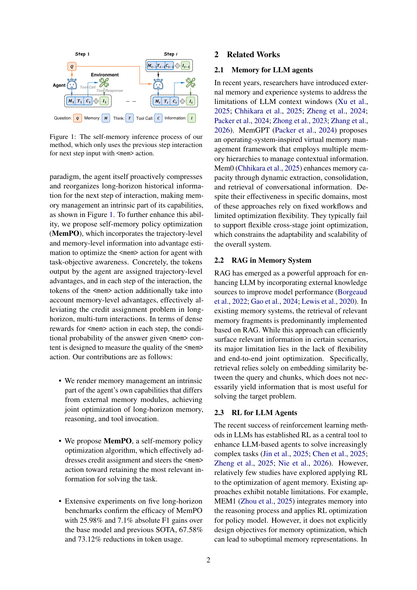
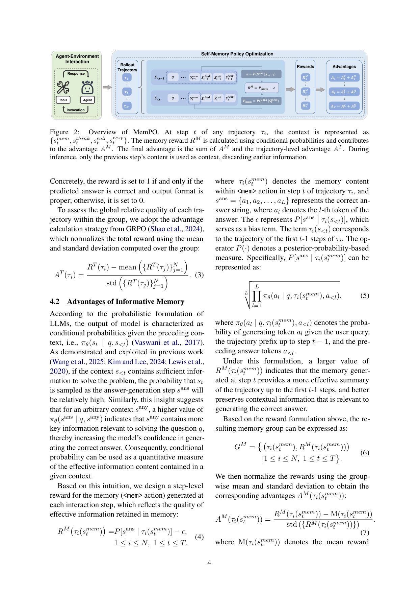

`mempo_self_memory | MemPO: Self-Memory Policy Optimization for Long-Horizon Agents | Tsinghua University + Tongyi Lab (Alibaba) (Yongbin Li / Jinli Suo 组) | 2026-03(v1)→2026-04-09 v3 arXiv preprint (cs.AI) | L? 记忆线（自管理记忆 + RL，credit assignment）·相关性 High`

══ 第一层：一眼看懂 [light] ══
- 🟦 **TL;DR**：长程智能体的 context 随每轮交互线性膨胀→token 贵 + "lost in the middle" 掉点。现有做法靠**外部 RAG 记忆模块**检索，模型自己不能主动管记忆、且检索只看 embedding 相似度未必对解题最有用。MemPO 让**策略模型自己**在每步交互里用 `<mem>` 动作主动压缩/重组历史（与 `<think>`/\(<tool_call>\) 并列），推理时只喂上一步的 `<mem>` 而非全历史；再用一个**改进的 GRPO**——给 `<mem>` token 在轨迹级 advantage 之外额外加一个**记忆级 advantage**。在 5 个长程基准上比 base +25.98 F1、比上一 SOTA +7.1 F1，且 token 降 67.58%/73.12%。
- **最巧的一步**：**`<mem>` 的稠密记忆奖励 RM = P(正确答案 | 当前步 `<mem>` 内容) − P(正确答案 | 前 t-1 步完整前缀)**——一个**免梯度的条件概率代理**，直接量化"这段压缩记忆保留了多少对解题有用的信息"。抽掉它就退化成 vanilla GRPO（只有稀疏的轨迹级 reward，无法告诉模型每步 `<mem>` 压得好不好），消融证实加了它 F1 全面提升、且条件概率分布更偏高值。

══ 第二层:为什么做(写透) ══
- **研究背景**:长程决策是 agent 解复杂问题的核心能力。主流交互范式 ReAct 把环境反馈不断拼进历史当 prompt,导致 **context 随每轮交互线性膨胀**。【原文 §1】
- **解决的具体痛点**:context 膨胀带来三个具体问题——① LLM 上下文窗口有限,**给交互轮数设了硬上限**;② 长 context **token 成本过高**,阻碍 agent 系统实际落地;③ 过长 context 触发 **"lost in the middle"**,模型能力下降、整体表现退化。【原文 §1】
- **相关工作 & 各自不足**:① 外部记忆模块(MemGPT 类 OS 式分层、Mem0 动态抽取/巩固/检索、A-MEM、RAG)——把历史存外部库按需检索注入,但**离线记忆压缩缺乏面向任务执行的联合优化,难对齐 agent 总目标**,检索是被动的(只看 embedding 相似度,未必对解题最有用);② MEM1(RL-based 记忆 baseline)——同向但 credit assignment 较粗。共同缺口=**模型自己不能主动管记忆、记忆管理与任务目标不联合优化**。【原文 §1, §2, §5.2】
- **动机链**:现状=长程 agent context 线性膨胀(贵+lost-in-middle)→ 缺陷=外部 RAG 记忆是被动检索、不与任务联合优化、模型无法主动 curate → 关键转念:**把记忆管理变成 agent 自身的内生能力**——让策略模型用 `<mem>` 动作(与 `<think>`/\(<tool_call>\) 并列)主动压缩/重组历史,推理时只喂上一步的 `<mem>` 而非全历史;但光这样训不好,因为轨迹级稀疏 reward 无法告诉每步 `<mem>` 压得好不好 → 所以必须**给 `<mem>` 加一个记忆级稠密奖励 + credit assignment**。为什么不用外部记忆模块?因为外部模块无法与任务目标联合优化、检索被动。【原文 §1】
- **与最近邻的 Δ**:相比 **MEM1**(同为长程多目标任务上的 RL 记忆方法、同 base、同测试协议),关键差异=**MemPO 给 `<mem>` token 设计了"记忆级 advantage"(用条件概率代理度量记忆有用性),做了 per-step 的记忆 credit assignment**,而非只有轨迹级稀疏信号。这个差异有用,因为它直接量化"这步压缩保留了多少对解题有用的信息",引导模型只留强相关内容。【原文 §1, §4】

══ 第三层:怎么做 + 靠不靠谱 ══
- **方法流水线**:① **范式重构**——把每步状态拆成 {`<mem>` 记忆动作, `<think>` 推理, \(<tool_call>\) 调用, `<information>` 工具返回};推理时**只用上一步交互**(上一步的 `<mem>` + 信息)作下一步输入,而非线性累积全 context(Fig.1);② **BC 冷启动**——先用 GPT-4.1 在 Tang et al. 数据上推理得 ~10k 含 `<mem>` 的轨迹,SFT 一轮让模型学会生成 `<mem>` 格式;③ **MemPO(改进 GRPO)**——N 条 rollout,每条算轨迹级 reward RT(答案正确且格式对=1 否则 0)→ 组归一化得轨迹级 advantage \(A^T\);每步 `<mem>` 额外算记忆级 reward RM → 组归一化得记忆级 advantage \(A^M\);**`<mem>` token 的最终 advantage = \(A^T + A^M\),其余 token 只用 \(A^T\)**;④ KL 锚 \(\pi_{ref}\)。【原文 §1, §3-4, Fig.1-2】
- **逐组件必要性**:① `<mem>` 动作内生化——没它退回外部 RAG(被动、不联合优化);② BC 冷启动——没它模型不会生成合规 `<mem>`;③ 记忆级 reward RM + 双 advantage——**这是最巧的一步**,没它退化成 vanilla GRPO(只有稀疏轨迹 reward,无法告诉模型每步压得好不好),消融证实加 RM 后 F1 全面提升、条件概率分布更偏高值。论文有针对 RM 的消融。【原文 §3-4】
- **关键机制 RM(直觉)**:**RM = P(正确答案 | 当前步 `<mem>` 内容) − P(正确答案 | 前 t-1 步完整前缀)**。直觉:用策略模型自己的 forward 条件概率当探针——"只看这步压缩后的记忆,模型答对的概率,相比看完整前缀,差多少"——差得越小说明 `<mem>` 保留的有用信息越足。这是一个**免梯度的信息量代理**(用 \(\pi_\theta\) 的 forward 概率算,不需外部标注),与 forward-hard/backward-soft 解耦同源:用 forward 条件概率构造有界平滑信号去引导一个原本稀疏/硬的目标。【原文 §3】
- **实验与证据(支撑核心主张的关键数字)**:
  · 数据集:仿 MEM1 用**多目标任务**(交互轮数远多于单目标,更逼长 context)——HotpotQA+NQ 合成的 2-objective,及 HotpotQA 合成的 4/6/8/10-objective;在 **local wiki search 与 web search** 两种引擎下测;指标 F1(词级)/EM(精确)/TT(总 token)/PT(单步峰值 token)。【原文 §5.1】
  · **核心结果**:比 base 模型 **+25.98 F1**、比上一 SOTA **+7.1 F1**,同时 **token 降 67.58% / 73.12%**;Qwen2.5(ReAct)随目标数增加 F1 从 33.73(2-obj)崩到 2.63(10-obj),MemPO 在长程上保持。【Abstract, Table 1】
  · 省成本卖点:10-objective 任务 token 仅 ReSearch 的 ~1/3、峰值 ~1/5。
- **baseline 公平性**:对比 prompt(ReAct)、agentic RL(DeepResearcher/ReSearch)、memory(RL-based MEM1 / RAG-based A-MEM)、以及**同环境下不带记忆的 GRPO**,**全部统一用 Qwen2.5-7B**,公平;尤其"同环境 GRPO without memory"这个 baseline 隔离了记忆机制的贡献。**看着强但没回答核心问题**:无明显此类问题,token 降幅+F1 增益同时给出,论文核心主张(省 token 不掉分)被正面验证。
- **假设与失效边界**:【原文 Limitations】不同步工具调用使各步信息含量不等、状态跨步不完全等价,会给组内 advantage 引偏(已用 ε bias 项缓解,复杂环境需更细方案)。【推断】RM 用"答案的条件概率"做代理,**强依赖任务有明确可验证答案(QA/搜索类)**,对开放生成/无单一答案任务该信号可能失效;记忆是 transient working memory(只保留上一步),**非跨任务持久库**,本质是"主动遗忘/压缩"而非长期巩固;BC 冷启动依赖 GPT-4.1 造数据,质量上限受其封顶。
- **祛魅总结**:真贡献(硬货)=**把记忆管理内生化为 `<mem>` 动作 + 记忆级稠密奖励 RM(条件概率代理)+ 双 advantage credit assignment**,实现"省 67-73% token 还涨 25.98 F1"的硬指标,RM 这个免梯度信息量探针是可迁移的积木。【推断】"自记忆"相对外部 RAG 的优势主要在"与任务联合优化",但代价是每步重新生成 `<mem>` 的推理开销(只是 token 总量降了);RM 的有效性高度绑定"有可验证答案"这一前提,普适性被略微高估;且它解决的是 working-memory 压缩,不直接处理跨任务经验巩固/防遗忘。

══ 机制速览 6 轴 [light] ══
| 维度 | 内容 |
|---|---|
| **学什么信号** | ① 轨迹级 reward RT（答案正确且格式对=1 否则 0）② **记忆级稠密 reward RM = P(ans\|`<mem>`_t) − P(ans\|前缀_<t)**（条件概率代理，模型自评，无需外部标注） |
| **改什么** | **参数**（GRPO 更新策略 \(\pi_\theta\)），尤其优化 `<mem>` 动作的生成；记忆是模型**内生能力**而非外部模块 |
| **何时改** | 训练：在线 per-step（GRPO，但记忆奖励是 per-step/per-`<mem>` 稠密信号）；推理时记忆管理 per-step 在线发生（每步生成 `<mem>` 喂下一步） |
| **免梯度?** | **混合**：策略更新走梯度；但**记忆质量信号 RM 本身免梯度**（用 \(\pi_\theta\) 的 forward 条件概率算，类似 forward-hard/backward-soft 的 reward 侧免梯度代理） |
| **记忆-技能生命周期** | 写入(每步 `<mem>` 主动摘要 \(s_{<t}\))→使用(下一步只读 \(s^{mem}_{t-1}\) 替代全前缀)→**隐式遗忘(截断:只保留上一步,丢弃更早)**；记忆是 transient working memory，非跨任务持久库 |
| **防遗忘机制** | KL 投影（GRPO 锚定 \(\pi_{ref}\)）；BC 冷启动(GPT-4.1 生成 ~10K 含 `<mem>` 轨迹 SFT 一轮)保格式能力；**核心非防遗忘而是"主动遗忘/压缩"**——靠 RM 引导只留强相关信息 |

🖼 **关键图 top-2** [light]：

图1（动机/范式图）：每步状态拆成 {`<mem>` 记忆, `<think>` 推理, \(<tool_call>\) 调用, `<information>` 工具返回}；推理时**只用上一步交互**作下一步输入（`<mem>` 动作压缩历史），而非线性累积全 context。选它因为一图说清"自记忆"区别于外部 RAG 的本质——记忆是 inline 动作、context 不膨胀。

图2（方法主图）：N 条 rollout→每条算轨迹级奖励 RT 与每步记忆奖励 RM(用条件概率 \(P_{mem}-\varepsilon\))→组归一化得 \(A^T\) 与 \(A^M\)→**`<mem>` token 的最终 advantage = \(A^T + A^M\)，其余 token 只用 \(A^T\)**；推理时只喂上一步内容。选它因为它精确呈现了全文最核心的创新——记忆级 credit assignment 的计算与注入方式。

══ 假设与失效边界（一句）[推断] ══
【原文 Limitations】不同步工具调用使各步信息含量不等、状态跨步不完全等价，会给组内 advantage 引偏（已用 ε bias 项缓解，复杂环境需更细方案）；【推断】RM 用"答案的条件概率"做代理，强依赖任务有明确可验证答案(QA/搜索类)，对开放生成/无单一答案任务该信号可能失效。

══ 对"探索-巩固"idea 对标（一句）[light] ══
**强可借组件（信号设计层）**：与"探索-巩固"的"巩固=压缩并保留关键信息"高度互补——**记忆级稠密奖励 RM=条件概率差** 是一个可直接迁移到 MTP/OPD 的**免梯度信息量探针**（"这步保留的信息能多大程度提升后续正确率"，与 MEMORY 里记的 forward-hard/backward-soft 解耦思路同源：用 forward 条件概率构造有界平滑信号去引导一个原本稀疏/硬的目标）；其 per-step `<mem>` credit assignment 可作 path-recovery 单点接管处的"该步是否保住了解题路径"的度量。竞品定位：相对外部记忆模块(Mem0/A-MEM)主张"记忆内生化 + 任务对齐联合优化"。

══ 结构化补充 ══
- ⑦ **开源代码 + 框架/harness**：有，https://github.com/TheNewBeeKing/MemPO（摘要明确）。RL=GRPO 变体(N=16,bs=128,lr 1e-6,最多 16 轮交互)，base=Qwen2.5-7B 系列，BC 冷启动用 GPT-4.1 造 ~10K 轨迹。**底层 RL 框架未在文中标注**〔待核：需 clone 看〕。
- 💰 资源/成本：原文未给 GPU 数；成本含 GPT-4.1 造 BC 数据 + GRPO 训练。**核心卖点即省成本**：10-objective 任务 token 仅 ReSearch 的 ~1/3、峰值 ~1/5。
- 🔭 开放问题：优化记忆奖励设计、扩展自记忆方法到更多应用、减小组优势偏差。
