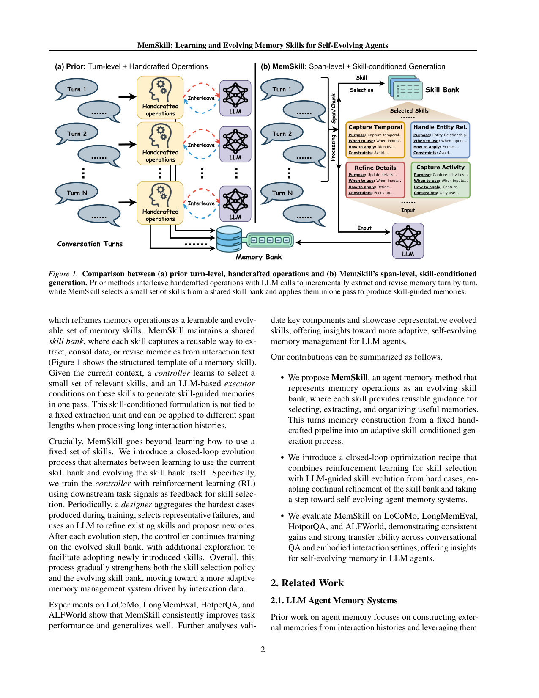
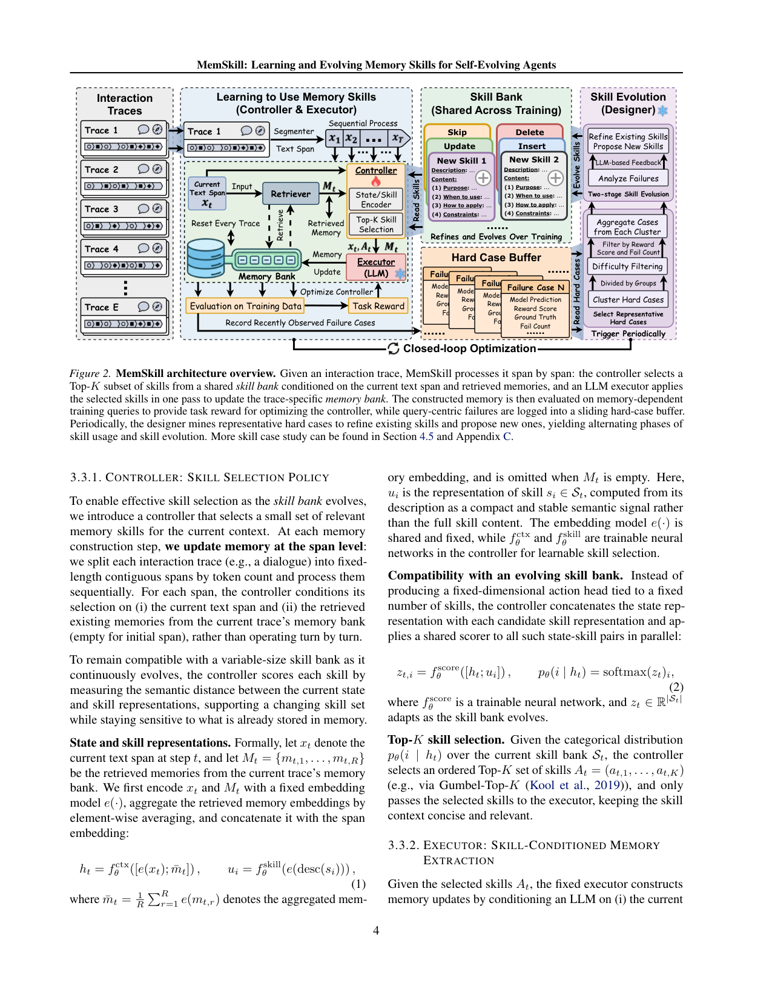

`memskill | MemSkill: Learning and Evolving Memory Skills for Self-Evolving Agents | NTU + UIUC + UIC + Tsinghua (Haozhen Zhang, Wenya Wang 等) | 2026-02(arXiv v2 2026-05-24)·Preprint·v2 | 主题线 L?(记忆操作/技能演进 · self-evolving memory)·相关性 High`

> 一句定位:把传统 agent 记忆里"加/改/删/跳"这些**人手写死的固定操作**,改写成一组**可学、可演进的"记忆技能"(memory skills)**——controller(小 MLP)用 RL 学"该选哪几个技能",LLM executor 一次性按选中技能抽记忆,designer 周期性地从"难例"里**改写旧技能 + 新增技能**,形成"用技能↔进化技能"的闭环。

---

## ══ 第一层:一眼看懂 ══

- 🟦 **TL;DR**:大多数 agent 记忆系统靠少数静态、人手设计的操作(insert/update/delete/skip)来抽取/修订记忆——这把"该记什么、怎么改"的人类先验写死了,换个交互场景就僵、历史一长就低效。MemSkill 把这些操作升级成**技能库(skill bank)**:每个"技能"是一段结构化模板(Purpose / When to use / How to apply / Constraints)。流程:① **controller**(轻量 MLP)看当前文本 span + 已检索记忆,从技能库里选 Top-K 个相关技能;② **executor**(冻结的 LLM,API 调用)一次性按这 K 个技能把这段 span 抽成记忆,写进 trace 的 memory bank;③ 用记忆去答训练 query 拿 task reward,**PPO 训 controller**;④ **designer**(LLM)每隔 100 步从难例缓冲区聚类挑代表性失败,**改写旧技能 / 提出新技能**进化技能库。LoCoMo / LongMemEval / HotpotQA / ALFWorld 上稳定超 Mem0、A-MEM、MemoryOS 等强基线。

- **最巧的一步**:**"把记忆操作重写成带 When/How/Constraints 的结构化技能 + 让 designer 从难例自动改写/新增技能"** 这一步抽掉就垮。若退回"固定 insert/update/delete/skip 原语",controller 再会选也只是在死操作里挑,整套"自演进"就名存实亡——消融 Table 2 正好证明:去掉 designer(固定 4 原语)掉得最狠(Qwen 上 54.14→36.15),比去掉 controller(→42.84)还狠。

---

## ══ 第二层:为什么做 ══

- **研究背景**:LLM agent 走向更长、开放式交互,历史越积越大、既宝贵又难用,催生 agent memory(摘要/检索过去交互、管理外部记忆库)。
- **解决的具体痛点**:现有方法(MemoryBank/A-MEM/Mem0/MemoryOS,乃至学习型的 Memory-R1/Mem-α)仍**用固定、人手设计的记忆机制**——固定操作原语 + 启发式模块定"存什么/怎么改/何时删"。三大毛病:① 把强人类先验写死;② 多数绑死固定抽取单元(per-turn 处理),长 span 上变弱;③ 历史一长扩展性差。
- **作者主张的"理想记忆系统"三性质**(§1):(i) **最小依赖人类先验**——记忆行为该由交互数据塑造、随任务演进;(ii) **支持更大抽取粒度**——能按需在更长 span 上工作(非死绑 per-turn);(iii) **技能条件化、组合式构造**——选一小撮相关技能、一次生成步里组合应用(而非拆成一堆专用模块)。
- **动机链**:固定操作 → 写死先验 + per-turn 低效 + 分布漂移脆弱 → 把"记忆抽取"抬升为**可学抽象**(技能) → 但只学"用固定技能"还不够 → 加 designer 让技能库本身**从难例演进** → 闭环交替"学用↔进化"。为什么不用更简单的现成法?固定原语(Mem0/MemoryOS)无法适配新场景;纯 RL 优化记忆管理(Memory-R1/Mem-α)仍在**静态操作集**上优化,不改"操作本身"。
- **与最近邻的 Δ**(§2.1 作者亲自摆位):
  - vs **Memory-R1 / Mem-α**(RL 优化记忆管理):它们用下游 reward 优化记忆管理,但**操作集是固定手写的**;MemSkill 的 RL 同时驱动 **技能选择策略 + 技能集本身的演进**。这是最关键差异。
  - vs **MemGen**(latent memory):MemGen 做"推理用的潜在记忆";MemSkill 做**显式、可读的记忆技能**演进。两者都自称 self-evolving 但层面不同。
  - vs **MemEvolve**(Zhang 2025b):MemEvolve "优化预定义记忆架构";MemSkill 演进的是**记忆技能(操作知识)**,不是架构。(同批被分析的姊妹工作)
  - vs **ReasoningBank**(Ouyang 2025):后者从经验蒸馏"推理策略";MemSkill 演进"记忆构造行为"。
  - vs **SkillWeaver**(Zheng 2025,web 技能发现):MemSkill 聚焦"治理记忆如何构造/修订"的技能,而非任务执行技能。

---

## ══ 第三层:怎么做 + 靠不靠谱 ══

- **方法流水线**(§3,Fig.2):
  1. **两个存储分离**(关键设计):**memory bank**(trace-specific,每条轨迹一份,每条 trace 重置)存具体记忆;**skill bank**(跨 trace 共享)存可复用记忆技能。把"轨迹专属记忆"和"可复用的记忆管理知识"解耦。
  2. **Span-level 处理**:把一条交互轨迹(如长对话)按 token 数切成**定长连续 span**(默认 512),顺序处理——不再 per-turn。
  3. **controller(技能选择策略)**:对每个 span,编码 span + 检索到的记忆(固定 embedding \(e(\cdot)\)=Qwen3-Embedding-0.6B,逐元素平均),与每个技能的"描述向量"拼接后过共享打分器 \(f_\theta^{score}\),得分布 \(p_\theta(i|h_t)\)(Eq.1–2);**Gumbel-Top-K** 无放回选有序 K 个技能(Eq.3 给联合 log-prob,供策略梯度)。**兼容可变规模技能库**——打分器对"状态-技能对"并行打分,不绑死固定动作头维度(技能库增删都行)。
  4. **executor(技能条件化抽取)**:冻结 LLM 以 (span + 检索记忆 + 选中 K 技能) 为条件,**一次 LLM call** 产出结构化记忆更新,解析后写回 memory bank。组合多技能 + 单次调用 → 省掉重复 per-turn 处理,长历史更省。
  5. **controller 优化**:用记忆去答 trace 的 memory-dependent 训练 query,task reward(F1 / 成功率)作信号,**PPO**(重要性加权 + clipping)训 controller。
  6. **designer(技能演进)**:① **难例缓冲区**(滑窗,query-centric,记 query+GT+检索记忆+预测+失败次数;按"太旧/超容量"两条过期规则);② **选代表难例**——KMeans 聚类按 query/error 类型分组,组内按难度分(性能低 + 反复失败 → 难度高)挑;③ **两阶段演进**——LLM 先分析"缺/错配了哪些记忆行为",再据此**改写旧技能 + 新增技能**;④ **快照回滚**——存最佳技能库快照,更新若掉点则回滚,反复无改善则早停;⑤ 演进后**临时增大探索**(偏向选新技能),帮 controller 学新技能效用。
  7. **闭环**(§3.5):交替"在当前技能库上训 controller(累积难例)"↔"designer 用难例进化技能库"。初始化:4 个基础技能 INSERT/UPDATE/DELETE/SKIP,由 designer 渐进精化+扩展。

- **逐组件必要性**(消融 Table 2,LoCoMo L-J):
  - **w/o Ctrl**(随机选技能):LLaMA 53.82→48.43,Qwen 54.14→**42.84** → 学会"选对技能"很重要。
  - **w/o Des**(锁死 4 初始原语):LLaMA→46.50,Qwen→**36.15**(掉最多)→ **演进技能库是核心**。
  - **Ref.-only**(只许改写、不许新增):LLaMA→47.45,Qwen→48.88——好于静态但低于完整 → 新增技能有额外增益。三者都做了消融,证据链完整。

- **关键机制直觉**:技能=可复用的"记忆配方"(何时用、怎么用、约束),controller 像"调度员"按上下文挑配方,designer 像"工艺改进师"看哪批料(难例)做砸了就改配方/加新配方。把"记什么/怎么记"从写死的代码变成数据驱动、可生长的技能集。

- **实验与证据**(§4):
  - 数据集:**LoCoMo / LongMemEval**(长对话记忆,报 F1 + LLM-judge L-J)、**HotpotQA**(§4.3 测分布漂移迁移)、**ALFWorld**(具身,ALF-Seen/Unseen,报成功率 SR + 交互步数 #Stps)。Base LLM:**LLaMA-3.3-70B-Instruct、Qwen3-Next-80B-A3B-Instruct(均经 API 访问)**;默认只在 LLaMA 上训,Qwen 仅做迁移。
  - **支撑核心主张的关键实验**:① **主表 Table 1**——LoCoMo L-J 53.82(超 MemoryOS 48.64、A-MEM 49.71);LongMemEval 是**纯迁移**(直接用 LoCoMo 学的技能)仍拿最佳 L-J 60.89;ALFWorld SR 也最高(LLaMA ALF-Unseen 83.58)。② **跨 base model 迁移**——LLaMA 学的技能直接迁 Qwen 不重训仍超基线 → 技能不绑特定 LLM。③ **分布漂移迁移**(Fig.3 HotpotQA 50/100/200 文档):LoCoMo→HotpotQA 全程超 MemoryOS/A-MEM,长上下文增益更明显;K=7 最佳。④ **成本-质量**(Table 3):span size=512 最优平衡——L-J 53.82,但 input 仅 249K tokens、215 次 LLM call,**远低于 MemoryOS(1013K/1288 calls)、A-MEM(2850K/1548 calls)、LightMem(789K/685 calls)** → span-level 大幅省调用。
  - **baseline 公平性**:所有方法统一检索 top-20 记忆;难例/judge 用同一套。**潜在不公**【推断】:base LLM 经 API 访问且未微调(executor 冻结),controller 只是小 MLP——MemSkill 的"训练"成本极低,但与全参微调类记忆法不可直接比"参数学习强度"。依据:§4.1 明说 API 访问 + executor 固定。
  - **"看着强但没答核心问题"风险**【推断】:主增益来自 LLM-judge(L-J)而非 F1(F1 提升较温和,如 LongMemEval F1 31.12 vs 基线 30.78);L-J 由 LLM 打分,可能偏好 MemSkill 风格的记忆表述。依据:Table 1 中 L-J 涨幅普遍大于 F1。

- **假设与失效边界**:
  - 【原文】span size 是效率旋钮:太大(1024/2048)掉点(Table 3,SS=1024 → 48.11),因单次更新覆盖太长 span;designer 每 100 步触发、每轮至多 3 处编辑(超参写死)。
  - 【推断】依赖一个**强冻结 LLM 当 executor**(70B/80B 级)——技能是"自然语言指令",弱 LLM 可能执行不动;controller 是 MLP,不学语言、只学"在 embedding 空间挑技能",其能力上限受 embedding 模型(0.6B)与技能描述质量限制。依据:executor 用 70B+、e(·) 固定为 0.6B、controller 仅 MLP。
  - 【推断】技能库无界增长 vs designer 只改/增不显式"删技能"——长期演进下技能膨胀如何控制,正文未给硬约束(只有"至多 3 编辑/轮 + 回滚")。依据:§3.4 只述 refine/propose,未述技能淘汰。

- **祛魅总结**:
  - 真贡献(硬货):① **把记忆操作"技能化"并让其从难例自演进**——这是相对 Memory-R1/Mem-α "在固定操作集上 RL" 的实质前进;② **span-level + 一次多技能组合**带来真实的 token/调用成本下降(Table 3 硬数据);③ **controller 设计兼容可变技能库**(state-skill 对并行打分,不绑固定动作维度)——工程上漂亮、是支持"技能集动态增长"的关键技巧。
  - 包装/营销成分【推断】:"self-evolving" 的演进由一个**冻结的 LLM designer** 驱动(本身不学习),严格说是"LLM 辅助的离线技能编辑 + controller 的 RL",并非端到端自演进;"涌现领域专长技能"(Fig.4 时间上下文/动作约束)更多是 designer 按难例归纳的结果。依据:designer 标注 "(fixed)" + 两阶段用 LLM 分析-提议。

---

## ══ 结构化抽取 ══

- 🎯 **机制速览 6 轴**:

| 学什么信号 | 改什么 | 何时改 | 免梯度? | 记忆-技能生命周期 | 防遗忘机制 |
|---|---|---|---|---|---|
| 下游 **task reward**(F1/成功率,驱动 controller 的 PPO);**LLM-based feedback**(designer 分析难例,驱动技能演进) | **改技能选择策略(controller MLP 参数,PPO 梯度)+ 技能库(skill bank,LLM 文本编辑,免梯度)+ trace 记忆(executor 生成,免梯度)**;**base LLM 主干不改** | controller:训练期 PPO 离线更新;技能演进:**周期性**(每 100 训练步)批量;记忆构造:在线 per-span(test-time 同样 span-level) | **混合**——controller 选择=梯度(PPO);executor 抽记忆 + designer 编辑技能 = **免梯度**(冻结 LLM prompting) | 写入=executor 按技能抽记忆进 memory bank(每 trace 重置);检索=embedding top-20;遗忘=memory bank 每 trace 清空 + 难例缓冲区"太旧/超容量"过期;**技能**:designer 改写/新增(几乎不删)+ 快照回滚;共享=skill bank 跨 trace/跨 base-model 共享迁移 | **隔离 + 快照回滚**:可复用技能知识与 trace 记忆分两库隔离;技能更新掉点则回滚到最佳快照(防"演进退化");base LLM 冻结天然不遗忘 |

- ⑦ **开源代码 + 框架/harness**:**已开源** https://github.com/ViktorAxelsen/MemSkill (有项目页 + HF paper/collection + DeepWiki)。**框架 = 无外部 RL 框架(无 veRL/TRL/OpenRLHF)**;为**自研 PPO**(repo 内 `src/controller.py` + `src/trainer.py`)。依赖栈:transformers、**sentence-transformers**(embedding 检索)、**openai**(base LLM 经 API 调用,executor/designer 均为冻结 LLM)、**scikit-learn**(KMeans 聚类难例)、faiss-cpu、textworld/alfworld/gymnasium(具身环境)。embedding=Qwen3-Embedding-0.6B;controller=轻量 MLP。【原文 §4.1 + 仓库 requirements/树确认】

- 💰 **资源/成本与可扩展性**:**训练成本极低**——只训 MLP controller + 离线 LLM 编辑技能,base LLM 不微调(API)。**推理成本**(Table 3,LoCoMo,SS=512):input 249K / output 18K tokens / **215 次 LLM call**,显著低于 MemoryOS(1288 calls)、A-MEM(1548)、LightMem(685);span-level 是省调用的关键。技能库准备成本"部署前一次性、可摊销"。GPU/显存数未在正文给(API 模式)。【原文】

- 🎯 **对"探索-巩固(TSRD/MTP+OPD)"idea 对标**:**可借组件 + 部分竞品**。可借:① **难例驱动的"技能演进"闭环**(难例缓冲区→KMeans 聚类→挑代表→改写/新增技能→快照回滚)是一套成熟的"从失败中巩固可复用知识"配方,可直接迁到 TSRD 的"path-recovery 技能库"——把"恢复路径"做成可演进技能;② **快照回滚 + 早停**防演进退化,对你"巩固阶段不能把已学坏掉"是现成机制;③ **controller 兼容可变技能库的 state-skill 并行打分**技巧,可迁到"动态增长的 recovery 策略集"。竞品面:它与 TSRD 都做"自演进 + 技能",但 MemSkill 是**显式自然语言技能 + 冻结 LLM 执行**、走记忆构造层;TSRD 走推理路径层 + 参数侧蒸馏。缺口:MemSkill 完全**免参数学习主干(executor 冻结)**,不触及"模型能力本身演进",也无 MTP 式前瞻——你的 MTP-foresight + OPD 参数蒸馏正补此格;反过来其"技能化记忆"可作为 TSRD 的外部巩固层。

- 🔭 **开放问题/未来方向**:
  - 【原文】§5:鼓励后续做"不仅学用记忆、还持续改进记忆如何构造"的自改进记忆系统;span size 作为效率旋钮的进一步自适应。
  - 【推断】(a) designer 本身可学习化(当前冻结 LLM)→ 真端到端自演进;(b) 技能淘汰/去冗机制(防技能库膨胀);(c) 弱/小 executor 下技能可执行性;(d) controller 从 MLP+固定 embedding 升级为可联合学习的表示,突破 0.6B embedding 上限。依据:designer 标 fixed、技能只增不删、executor 用 70B+、e(·) 固定。

- 🖼 **关键图 top-2**:

  
  这是**原文 Figure 1**:左 (a) 现有方法 per-turn 把"手写操作"与 LLM 调用交错、逐轮抽改记忆;右 (b) MemSkill 把轨迹切成 span,从**共享技能库**选一小撮技能(每个技能含 Purpose/When to use/How to apply/Constraints),一次生成产出技能引导的记忆。选它因为一图说清本文最核心的范式转变(写死操作→可选可演进技能)与处理粒度变化(turn→span)。

  
  这是**原文 Figure 2**:四大块——交互轨迹 → "学用技能"(Controller 选 Top-K + Executor 抽记忆写 memory bank,task reward 优化 controller)→ 共享 Skill Bank → "技能演进"(Designer 聚合难例缓冲区、聚类、改写/新增技能),整体为 Closed-loop。选它因为它是方法主图,完整呈现"用技能↔进化技能"双过程与难例缓冲、PPO 信号、designer 反馈的咬合关系。
