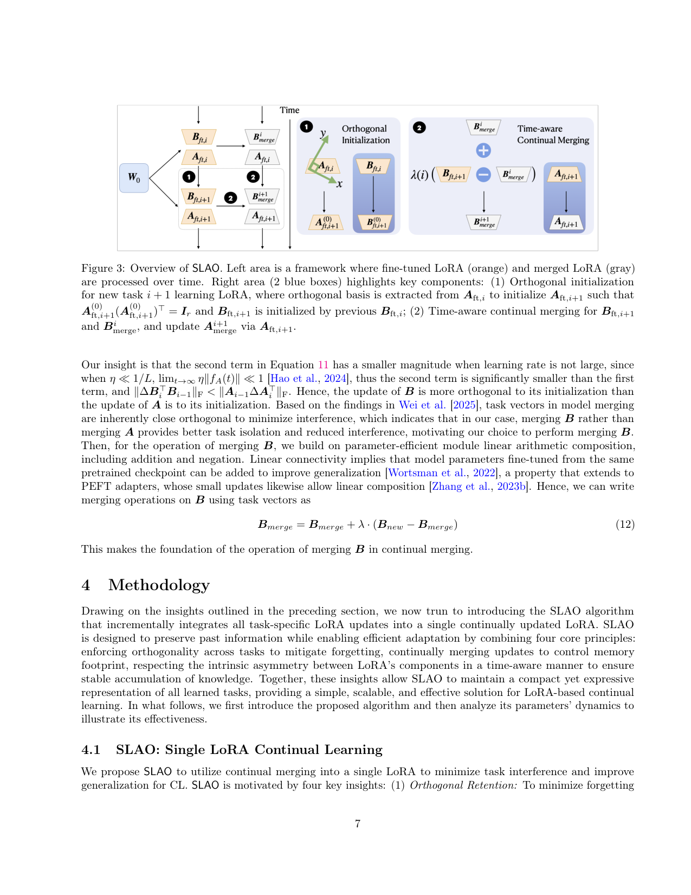
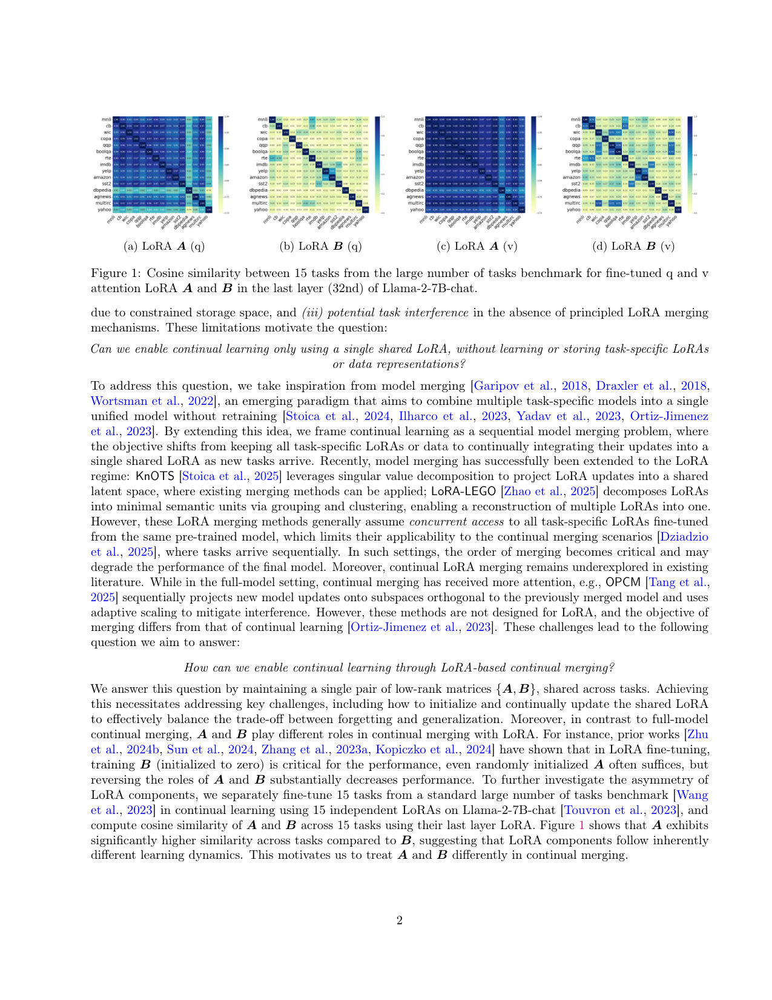

`merge_before_forget | Merge before Forget: A Single LoRA Continual Learning via Continual Merging (SLAO) | The Pennsylvania State University（Fuli Qiao, Mehrdad Mahdavi） | 2025-12 arXiv:2512.23017v1(28 Dec 2025) · 预印本 | 防遗忘方法/模型合并(merging)持续学习 主线 · 高相关（"continual merging→单一LoRA"巩固范式，6轴 merging 防遗忘代表作）`

> 三标注约定：【原文】=论文直述；【推断】=有据判断(附依据)；【待核】=拿不准的关键事实。

══ 第一层：一眼看懂 ══

- 🟦 **TL;DR**:LLM 一个接一个学新任务时,主流 LoRA 持续学习方法(O-LoRA/InfLoRA/SAPT)要么**把每个任务的旧 LoRA 都冻结存下来**(参数随任务线性膨胀 \([B_1A_1,\dots,B_tA_t]\),存不下),要么**生成旧任务伪数据**(不现实)。本文换思路:把持续学习当成**"连续模型合并(continual merging)"问题**——**始终只维护一对共享的低秩矩阵 {A,B}**,新任务训完就把它的 LoRA 增量**合并进这唯一的一对**里,**内存恒定、与任务数 T 无关**。方法叫 **SLAO**,两个关键招:① **正交初始化**——新任务的 A 用上一任务 A 的正交基(QR 分解)来初始化,减少任务间干扰;② **非对称时间感知合并**——利用"LoRA 里 A 和 B 角色不对称"(实测 A 在任务间很相似、B 更正交,图1),所以**只合并 B、A 直接用新任务的**,且合并 B 时用随时间衰减的系数 \(\lambda(i)=1/\sqrt{i}\) 平衡新旧。还配了 NTK 视角的理论分析。【原文 摘要+§1+§4】

- **最巧的一步**:**"只合并 B、不合并 A"这个非对称设计**(由图1 的实测 + §3.3 的 NTK/动力学分析共同支撑)。抽掉它,SLAO 就退回"把 A、B 同等对待"的普通 LoRA 合并(论文里 FTBA-MBA / 直接套 OPCM 就是这样,性能更差)。为什么是它:① 实测 A 跨任务**余弦相似度高**(图1)、B 更正交;② 理论上(Eq.10-11)B 的更新比 A 的更新**更正交于自身初始化**,而"任务向量越正交→合并干扰越小"(Wei et al. 2025)→ **合并 B 比合并 A 提供更好的任务隔离**。这是 SLAO 区别于 full-model continual merging(OPCM)的命门。【原文 §3.3, 图1, 表3】

══ 第二层:为什么做 ══

- **研究背景**:LLM 灾难性遗忘 + 全量微调太贵 → 参数高效持续学习(LoRA-based CL)兴起。同时,**模型合并(model merging)** 作为"不重训就把多个任务模型融成一个"的范式崛起(task arithmetic、model soups),并已扩展到 LoRA(KnOTS 用 SVD 投到共享潜空间、LoRA-LEGO 拆成语义单元再重组)。【原文 §1, §2】

- **解决的具体痛点**:① 冻结式 LoRA-CL(O-LoRA/InfLoRA/SD-LoRA)**参数随任务线性增长 O(T(m+n)r)**、存储受限、且缺乏有原则的 LoRA 合并机制→任务干扰;② 数据生成式(SAPT)需造旧任务伪样本,**LLM 场景多不现实**;③ 现有 LoRA 合并法(KnOTS/LoRA-LEGO)**假设同时拿到所有任务 LoRA**,不适用"任务顺序到达"的 continual merging;④ 全模型 continual merging(OPCM)**不是为 LoRA 设计**,且合并的目标(只求保持)与持续学习的目标(保持+泛化)不同。【原文 §1, §2, §3.1】

- **相关工作 & 各自不足**:
  - *冻结式 LoRA-CL*:O-LoRA(冻旧 LoRA、新任务在其正交子空间学)、InfLoRA(任务相关输入矩阵定义正交子空间)、SAPT-LoRA(留旧 LoRA + 生成伪数据对齐)、SD-LoRA(解耦幅度/方向、保留旧方向)——**共性硬伤:参数线性膨胀 或 需伪数据**。【原文 §1, §2】
  - *LoRA 合并*:KnOTS(SVD 投共享潜空间)、LoRA-LEGO(rank-wise 聚类重组)——**需并发拿到所有 LoRA**,非顺序场景。【原文 §2】
  - *Continual merging*:OPCM(全模型,把新更新投到已合并模型的正交补 + 自适应缩放)——**非 LoRA、目标错位**。SLAO 把 OPCM 的"顺序投影正交 + 自适应缩放"思想**迁到 LoRA 并改造成非对称版**。【原文 §1, §2, §4.1】

- **动机链**:LLM-CL 要省内存又少遗忘 → 冻结式膨胀、伪数据不现实 → 改成"持续合并进单一 LoRA"(内存恒定 \(O((m+n)r)\))→ 但 LoRA 的 A、B 角色不对称(图1:A 跨任务相似、B 正交;且已知冻 A 训 B 更优)→ 故 **A 走正交初始化(QR)保几何一致、B 走时间感知合并(\(\lambda=1/\sqrt{i}\))** → NTK 视角证明这样能同时压低 forgetting 与 intransigence 误差(§3.2-3.3)→ 得 SLAO(§4)。【原文 §3-§4 逻辑链】

- **与最近邻(OPCM / O-LoRA)的 Δ**:
  - vs **OPCM**(最像的 continual merging):OPCM 面向全模型、**A/B 同等对待**;SLAO 针对 LoRA、**利用 A/B 非对称只合并 B**,且把 CL 的"保持+泛化"双目标纳入设计。实测直接把 OPCM 套到 LoRA 性能最差(表1,avg 60.2/50.5/12.0)。
  - vs **O-LoRA**(最像的冻结式):O-LoRA 冻所有旧 LoRA + 训练时强加正交约束(内存线性增长、训练贵);SLAO **只在训练前用上一个 LoRA 的正交基初始化**(内存恒定、训练无额外开销),图2 直观展示内存差异。**为什么有用**:在"数据无关 + 内存恒定"约束下仍逼近甚至超过这些更重的方法。【原文 §3.1, 表1, 图2】

══ 第三层:怎么做 + 靠不靠谱 ══

- **方法流水线(SLAO,Algorithm 1,4 条原则)**:四原则=正交保持(减遗忘)+ 连续合并(控内存)+ LoRA 非对称(A/B 分治)+ 时间感知缩放(稳累积)。流程:
  1. **任务1**:标准 LoRA 微调得 \(B_{ft,1} A_{ft,1}\),直接作为初始 merged LoRA(\(B^1_{merge}=B_{ft,1}\), \(A^1_{merge}=A_{ft,1}\)),\(\lambda(1)=1\)。
  2. **任务 \(i\geq 2\) — 正交初始化**:对上一任务微调好的 \(A_{ft,i-1}\) 做 **QR 分解**取正交矩阵 \(Q_i\)(并用 \(\text{sign}(\text{diag}(R_i))\) 修正符号),令 \(A_{ft,i}\) 的初始化 \(= Q_i^\top\)(使 \(A_{ft,i}^{(0)}(A_{ft,i}^{(0)})^\top=I_r\),行正交);**B 的初始化 = 上一任务微调好的 \(B_{ft,i-1}\)**(注意:B 初始化非零,区别于标准 LoRA 的 B=0,也是其理论比 Hao et al. 复杂之处)。
  3. **微调**:在新任务上微调 \(B_{ft,i} A_{ft,i}\)。
  4. **非对称合并**:**A 直接替换** \(A^i_{merge} = A_{ft,i}\);**B 时间感知合并** \(B^i_{merge} = B^{i-1}_{merge} + \lambda(i)\cdot(B_{ft,i} - B^{i-1}_{merge})\),其中 **\(\lambda(i)=1/\sqrt{i}\)**(因 B 的任务向量近似正交,\(1/\sqrt{i}\) 能维持合并步间参数变化幅度一致,沿用 OPCM/Tang 2025)。
  5. **推理**:用 merged LoRA \(B^i_{merge} A^i_{merge}\),直到下一任务到来。最终返回 \(B^T_{merge} A^T_{merge}\)。

- **逐组件必要性(消融充分)**:
  - *初始化策略(表2)*:Last-FT(用上一微调点,ours)80.4/74.8/37.2 > Last-Merge 80.3/74.2/34.0 > Random(zero) 65.7/59.6/31.1。✔证明"从上一微调点初始化"最优(随机初始化让 A 远离最优 A*,intransigence 变差;从合并点初始化会固化时间系数、限制灵活性)。
  - *非对称合并策略(表3)*:对比 FREB-MA/FREA-MB/FTBA-MA/FTBA-MBA/FTBA-MB——只有 **FTBA-MB(微调BA、只合并B)** 与 ours 一致地最优;FTBA-MA(只合并A)最差;冻结时 FREA-MB > FREB-MA(印证"冻A训B优于反之")。✔**直接消融证明"合并B不合并A"是对的**。
  - *时间感知系数(图4)*:对比固定 {0.1,0.5,0.9}——自适应 \(\lambda=1/\sqrt{i}\) 在三 benchmark 上**准确率最高、跨任务序列方差最低**;固定值里简单任务偏好 0.9、复杂/长任务偏好小值,0.5 稳但总次优。✔有消融。
  - *正交初始化*:理论(§3.2 NTK)+ 表2 的 Random vs Last-FT 间接支撑;但**"去掉 QR 正交化、只用 Last-FT 直接初始化"的独立消融未单列**——属"理论+间接证据强,缺单点剥离"项。【推断:依据=表2 比的是初始化来源,未隔离 QR 这一步本身】

- **关键机制直觉**:两个核心。① **正交初始化**:用 QR 把新任务的 A 初始化成"与旧任务 A 几何一致(正交行)",使 \(E[A_j A_i^\top]\approx I_r\),从而同时压低 \(\|A_t-A_i\|\)(防遗忘)和 \(\|A_i-A_i^*\|\)(防 intransigence)——这是 §3.2 NTK 界 Eq.5-6 推出的:遗忘\(\propto\|B_tA_t-B_iA_i\|_F\),要小就得让 A 跨任务对齐。② **只合并 B**:Eq.10-11 算出 B 的更新比 A 更正交于自身初始化,而正交任务向量合并干扰小,故合并 B 隔离性更好;Theorem 1 进一步说在 A 正交初始化下 **B 会跨不同初始化子空间更新→等效提升 B 的秩→助泛化**。一句话:**A 管"对齐保旧"、B 管"合并纳新并扩容量"**。【原文 §3.2-3.3, Theorem 1】

- **实验与证据**:
  - 数据集/设置:**Llama-2-7B/13B-chat、Llama-3-2-3B、Qwen2.5-3B/7B**;A100 + **DeepSpeed**;三 benchmark——Standard CL(AG News/Amazon/Yelp/DBpedia/Yahoo 等)、Large Number of Tasks(15 任务:5 标准+4 GLUE+5 SuperGLUE+IMDB)、SuperNI(多样 NLP 指令任务);每任务 1000 训练样本,3 个任务顺序、跑 3 次。指标:AA(平均准确率/Rouge-L)、BWT、MOPD/AOPD(顺序鲁棒性)。Baseline 极全:SeqLoRA/IncLoRA/O-LoRA/InfLoRA/SAPT-LoRA/MTL/LoRM/CorDA/MagMax(CL)+ KnOTS/LoRA-LEGO(合并)+ OPCM(continual merging)。【原文 §5.1】
  - **支撑核心主张的关键数字(表1,Llama-2-7B)**:SLAO **avg 80.4 / 74.8 / 37.2**(三 benchmark),**一致超过所有 data-free baseline**;接近 MTL 上界(80.9/78.1/45.2)。对比:O-LoRA 77.2/73.5/25.9、InfLoRA 79.6/69.8/19.3、MagMax 80.3/73.4/11.2、OPCM(套LoRA)60.2/50.5/12.0。
  - **诚实点**:**SAPT-LoRA 平均更高**(81.1/81.9/50.9)但**依赖生成旧任务伪样本(不现实)且比 SLAO 更顺序敏感**——作者明确承认并把它排除在"data-free 公平比较"之外。
  - **规模效应(表4)**:同代 Llama 越大越好(13B 81.0/76.1/42.3 > 7B > 3B 75.1/73.6/33.7),大模型对任务顺序也更鲁棒。
  - **最有说服力的证据组合**:图1(A/B 非对称的实测动机)+ 表3(非对称合并消融,只合并B最优)——二者一前一后把"为什么只合并B"钉死;图2(内存恒定 vs O-LoRA 线性增长)则坐实"省内存"卖点。
  - *baseline 公平性*:把全模型合并法(OPCM 等)统一扩到 LoRA 并顺序执行来公平比,baseline 覆盖三大类(CL/合并/continual merging),相当充分。【推断:依据=§5.1 baseline 说明】
  - *"看着强但没回答核心"的隐患*:① 全是**分类/NLU/指令任务(GLUE/SuperGLUE/SuperNI)**,**未测生成式数学/代码推理**;② NTK regime 假设是"prompt-based 微调停留在 NTK 区"的经验前提(Malladi 2023),**LoRA 全微调是否真在 NTK 区有争议**,理论界因此是"近似/有假设"的;③ SuperNI 上 SLAO 37.2 远低于 MTL 45.2 与 SAPT 50.9,**复杂多样任务上单一 LoRA 的容量瓶颈仍明显**。【推断:依据=§5.1 任务域 + §3.2 NTK 假设来源 + 表1 SuperNI 数值】

- **假设与失效边界**:
  - 【原文 §3.2】NTK regime 假设(微调停留在神经正切核区)是理论分析的前提;前提不成立时界失效。
  - 【原文 §3.3】"η≪1/L 时 B 的更新更正交"依赖**小学习率**;大学习率下 A/B 正交性差异可能缩小,合并B的优势减弱。
  - 【原文 §4.1 隐含】B 初始化非零使理论比标准 LoRA(B=0)复杂,Theorem 1 的"B 扩秩助泛化"是该设置下的结论。
  - 【推断】单一共享 LoRA 的**容量固定**——任务极多/极异质时(SuperNI 已显疲态),纳新必然挤压旧,远期遗忘不可避免;论文最多测到 15-类任务序列。依据=表1 SuperNI 与 MTL 的大差距 + 单 LoRA 设计。
  - 【推断】结论限于 NLU/指令分类;生成式长推理任务上 Rouge-L 指标与合并对生成连贯性的影响未验。依据=§5.1 任务域。

- **祛魅总结**:
  - **真贡献(硬货)**:(a)**把 LoRA 持续学习重构为"连续合并进单一 LoRA"**,实现**内存恒定 O((m+n)r)、数据无关、训练无额外约束开销**——这是相对冻结式(线性膨胀)和伪数据式(不现实)的实质范式改进;(b)**LoRA 非对称"只合并B"** 有图1 实测 + NTK/动力学理论 + 表3 消融三重支撑,是干净且新颖的洞见;(c)**消融极充分**(初始化来源、合并策略、时间系数、模型尺寸全做了),诚实承认 SAPT 更高但不现实。
  - **包装/可能高估**:"theoretical analysis"建立在 **NTK regime 假设**上(LoRA 是否真在 NTK 区有争议),属"有假设的解释性理论"而非无条件保证;"improves generalization"在 SuperNI 这类复杂 benchmark 上与上界仍有显著差距。【推断:依据=§3.2 NTK 前提 + 表1 SuperNI】
  - **可能低估 / 注意**:**未提供任何开源代码链接**(全文 grep 无 github/anonymous repo),复现需自行实现 QR 正交初始化 + 时间感知合并 + NTK 分析;单 LoRA 容量瓶颈在长/异质任务上是其范式的根本约束,作者讨论偏少。【推断:依据=全文无代码声明 + 表1 SuperNI 容量疲态】

══ 结构化抽取 ══

- 🎯 **机制速览 6 轴**:

| 学什么信号 | 改什么 | 何时改 | 免梯度? | 记忆-技能生命周期 | 防遗忘机制 |
|---|---|---|---|---|---|
| 监督标签(分类/NLU/指令 持续学习多任务序列;交叉熵/Rouge) | **参数**(单一共享 LoRA {A,B};新任务微调后合并进这唯一一对) | **离线批量**(任务顺序到达;每任务:正交初始化→微调→合并) | **混合**:任务内微调用梯度;**任务间的"合并"本身是免梯度的闭式线性算术**(\(B_{merge} \mathrel{+}= \lambda(B_{new}-B_{merge})\),A 直接替换) | 不适用(无外部记忆库/技能库;"技能"以参数合并形式累积进单一 LoRA) | **模型合并(continual merging)+ 正交初始化**:QR 正交基初始化 A 减干扰;时间感知缩放 \(\lambda=1/\sqrt{i}\) 非对称合并 B;内存恒定。属 6 轴的"**merging**"族(+几何正交)。【原文 §4】 |

- ⑦ **开源代码 + 框架/harness**:**未开源 / 未找到**(全文及附录 grep 无 github/anonymous/code 声明)。实现栈(从正文,非代码核验):标准 **LoRA**(Hu 2022)+ **QR 分解**正交初始化 + 闭式 **task-vector 线性合并**;训练基础设施 **DeepSpeed** + NVIDIA A100;骨干 Llama-2-7B/13B-chat、Llama-3-2-3B、Qwen2.5-3B/7B。**无 RL 框架**(纯监督持续学习)。理论借 NTK(Jang 2024)与 FLoRA 动力学(Hao 2024)。【原文 §5.1;代码缺失=本子代理 grep 全文确认】

- 💰 **资源/成本与可扩展性**:**省内存是核心卖点**——内存复杂度 **O((m+n)r) 恒定、与任务数 T 无关**(图2),对比冻结式 O(T(m+n)r) 线性增长。**训练效率**:合并只用"单个上一 LoRA"初始化,**训练时无额外正交约束计算**(优于 O-LoRA 训练时对所有旧 LoRA 加约束)。算力:A100 + DeepSpeed,最大 13B。瓶颈:**单 LoRA 容量固定**,任务极多时性能受限。绝对 GPU 时长/显存数值原文未给。【原文 §3.1, 图2, §5.1】

- 🎯 **对"探索-巩固(探索→巩固)"idea 对标**:**强相关——一个"巩固"的纯 merging 范式 + 可借组件 + 警示**。
  - *支撑/可借组件*:SLAO 整体就是一个**"巩固(consolidation)"的代表实现**——把每轮新学到的能力**合并进单一参数载体**而非堆叠。对 TSRD 巩固阶段直接可借:① **"continual merging into a single carrier"** 思路可替代"无限堆叠 adapter/记忆",保持内存恒定;② **LoRA 非对称"只合并B、A正交初始化"** 是个精巧的"哪部分该融、哪部分该重置"的分治原则,可类比到"MTP foresight 头 vs OPD 主干"哪部分跨轮合并;③ **时间感知缩放 \(\lambda=1/\sqrt{i}\)** 是个现成的"新旧知识配比"调度器;④ 合并是**免梯度闭式操作**——与"巩固阶段尽量轻量"诉求契合。
  - *机理同盟*:与本批 gorp(梯度子空间投影)、subspace_geometry_lora(夹角律)、retaining_by_doing/mech_origins(on-policy/电路)同属防遗忘线;SLAO 代表的是 6 轴里**"merging"防遗忘**这一格(与 GORP 的"梯度投影/隔离"格互补)。
  - *缺口/区别 + 警示*:① 面向 **NLU/指令分类**,非生成式推理/on-policy 蒸馏/agent,**未涉 RL/reward/MTP/记忆库**;② **单 LoRA 容量瓶颈**——SuperNI 上明显疲态,提示"把所有技能融进一个低秩载体"在异质长任务上有上限,TSRD 若走 merging 巩固需正视容量;③ 理论靠 NTK 假设;④ **未开源**,迁移成本高。【推断:依据=§5.1 任务域 + 表1 SuperNI + §3.2 NTK + 项目 TSRD/OPD 主线】

- 🔭 **开放问题/未来方向**:
  - 【原文 隐含/Limitations 散见】单一 LoRA 在更复杂/更长/更异质任务序列上的容量与顺序鲁棒性;NTK 假设外的理论刻画。
  - 【推断】扩到生成式推理/代码任务与更大模型;研究"合并 B、正交初始化 A"在大学习率/非 NTK 区是否仍成立;把"continual merging"与"记忆/技能库"结合(融不进单 LoRA 的能力外置);自适应决定"何时该扩容(加秩/加 LoRA)而非继续合并"。依据=表1 SuperNI 容量疲态 + §3.2-3.3 假设。

- 🖼 **关键图 top-2**:

  
  这是**原文 Figure 3**(方法主图):左侧时间轴上微调 LoRA(橙)与 merged LoRA(灰)的处理流;右侧两个蓝框点明两大组件——(1)为新任务 i+1 做**正交初始化**(从 \(A_{ft,i}\) 抽正交基初始化 \(A_{ft,i+1}\) 使其行正交,B 用上一任务 \(B_{ft,i}\) 初始化);(2)对 B 做**时间感知连续合并**、A 直接更新。选它因为一图说清 SLAO"初始化(正交)+ 合并(非对称、时间感知)"的完整闭环。

  
  这是**原文 Figure 1**(核心动机图):Llama-2-7B-chat 第32层 q/v 注意力的 LoRA A、B 在 15 个任务间的余弦相似度热图——**(a)(c) A 跨任务相似度明显偏高**(暖色),**(b)(d) B 更接近正交**(冷色)。选它因为这张图是"为什么只合并B不合并A"这一最巧设计的**实测依据**——A 已天然对齐(适合直接替换/对齐),B 更正交(适合合并以隔离干扰)。

──────────
**幂等状态**:本文 analysis 首次产出。机制类型 = **防遗忘方法(参数级·任务内梯度+任务间免梯度闭式合并·model continual merging into single LoRA;正交初始化+非对称时间感知合并;内存恒定;非记忆/非技能库;纯监督)**。注意点:理论基于 NTK 假设、单 LoRA 容量瓶颈(SuperNI 疲态)、**未开源**。抽到 2 图:是(Figure 3 方法总览 + Figure 1 A/B 非对称动机)。
