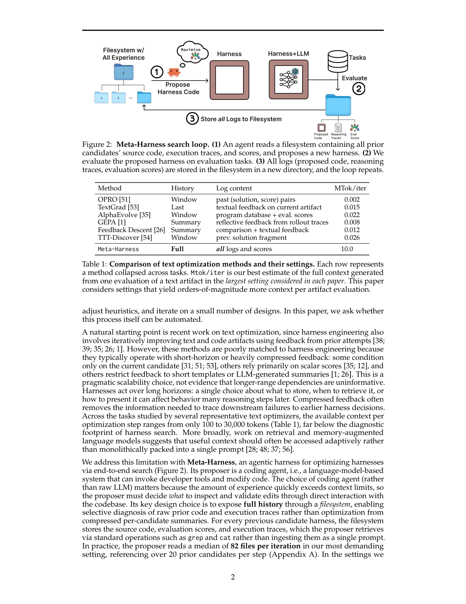
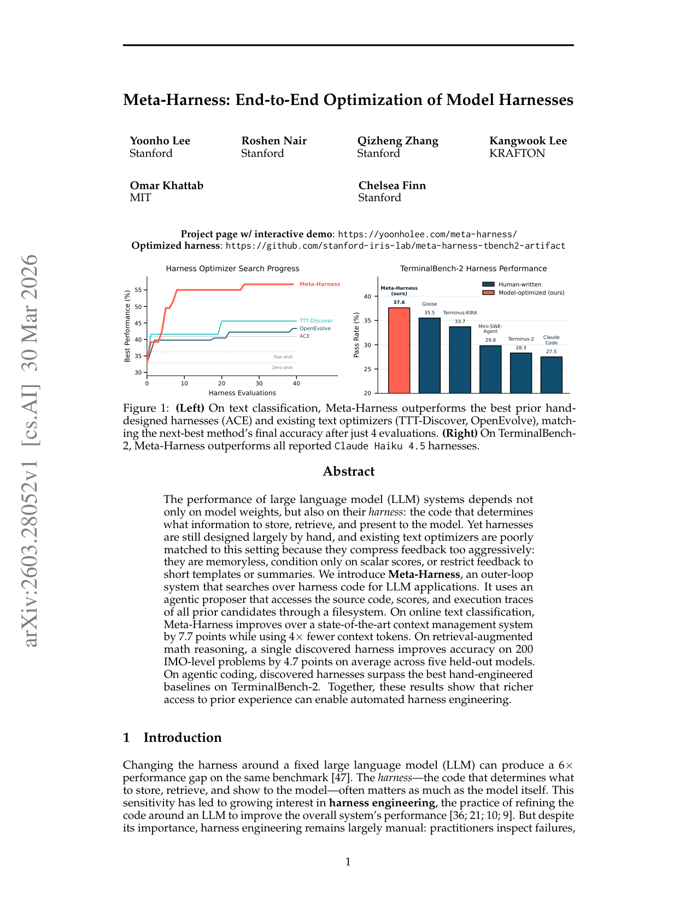

`meta_harness | Meta-Harness: End-to-End Optimization of Model Harnesses | Stanford(Yoonho Lee, Roshen Nair, Qizheng Zhang, Chelsea Finn)/ KRAFTON(Kangwook Lee)/ MIT(Omar Khattab) | 2026-03·arXiv:2603.28052 v1(30 Mar 2026)·preprint·26页 | 主题线 L6(harness 自进化,程序搜索)· 相关性 High`

> 三标注:【原文】=直接来自论文;【推断】=有据判断(附依据);【待核】=拿不准的关键事实。
> 项目页 https://yoonholee.com/meta-harness/ ;优化产物 https://github.com/stanford-iris-lab/meta-harness-tbench2-artifact

---

## ══ 第一层:一眼看懂 [light] ══

- 🟦 **TL;DR**:【原文 摘要, §1】LLM 系统的表现不只取决于模型权重,也取决于它的"harness"——决定"存什么、检索什么、给模型看什么"的那段代码。但 harness 至今基本靠手工设计(人肉看失败→调启发式→在少数设计上迭代)。已有的"文本优化器"(OPRO/TextGrad/GEPA/AlphaEvolve 等)不适合这个场景,因为它们**把反馈压缩得太狠**:无记忆、只看标量分数、或只给简短模板/摘要。Meta-Harness 是一个**外循环系统,直接在 harness 代码空间里搜索**:它的提议者(proposer)是一个 coding agent(能调开发工具、改代码),通过**文件系统**访问**所有历史候选**的源码、分数、执行 trace(用 grep/cat 选择性查看,而非塞进一个 prompt)。一次评测可产生高达 **10,000,000 token** 的诊断信息(比已有文本优化器的反馈预算高约 3 个数量级)。结果:在线文本分类上比 SOTA 上下文管理系统(ACE)高 7.7 点且省 4× 上下文 token;检索增强数学推理上,单个发现的 harness 在 200 道 IMO 级题、5 个 held-out 模型上平均涨 4.7 点;agentic coding 上,发现的 harness 在 TerminalBench-2 上超过最好的手工基线(Opus 4.6 上 76.4% 排第 2、Haiku 4.5 上 37.6% 排第 1)。
- **最巧的一步**:【推断,依据 §3 + Table 3 消融】**"用文件系统把全量历史(源码+分数+原始执行 trace)暴露给一个 coding-agent proposer,让它自己 grep/cat 选择性诊断"**。抽掉"原始 trace 访问"这一步,方法就垮——Table 3 消融直接证明:只给分数(best 41.3)、给分数+LLM 摘要(best 38.7)都远不如给原始 trace(best 56.7),且"摘要甚至有害,因为它压掉了诊断有用的细节"。这正是它区别于所有压缩式文本优化器的命门:**让优化器像人类工程师一样翻原始日志做因果归因**,而不是对着标量分数/摘要瞎调。

---

## ══ 第二层:为什么做 ══

- **研究背景**:【原文 §1】围绕固定 LLM 改 harness 能在同一 benchmark 上造成 **6× 的性能差距**[47]。harness(决定存/检索/展示什么的代码)常和模型本身一样重要,催生了"harness engineering"这一实践方向。但它至今基本靠手工。本文问:这个过程本身能否自动化?
- **解决的具体痛点**:【原文 §1, Table 1】自然起点是已有文本优化(也在迭代改文本/代码 artifact),但它们**不匹配 harness 工程**,因为反馈被压缩得太狠:① 只看当前候选(OPRO/Self-Refine/TextGrad);② 主要靠标量分数(AlphaEvolve/AdaEvolve);③ 反馈限于短模板/LLM 摘要(GEPA/Feedback Descent)。**痛点本质**:harness 在长程上起作用——"存什么/何时检索/怎么呈现"的一个选择可能在很多推理步之后才影响行为;压缩反馈会抹掉"把下游失败追溯到早期 harness 决策"所需的信息。已有文本优化器每步可用上下文仅 100~30,000 token(Table 1),远低于 harness 搜索所需的"诊断足迹"。
- **相关工作 & 各自不足**:【原文 §2】三条最近邻线:
  - **外部记忆 / 自适应访问**:RAG、交错检索+推理、记忆型 agent(MemGPT)、递归 LM。共同思想=把大知识源当外部资源自适应访问,而非一次性吞。Meta-Harness 用相似访问模式,但用在更苛刻的 harness 工程(选择性查看海量历史代码/分数/trace 以改进"上下文管理过程本身")。
  - **可执行代码搜索**:LLM 当变异/交叉算子的进化程序搜索(ELM)、固定脚手架内进化指定函数(FunSearch)、meta-agent 编程新 agent(ADAS)、工作流图搜索、持续学习 agent 的记忆设计搜索。**不足/差异**:Meta-Harness 搜的是**域专用、任务间会重置的 harness**(prompt 构造/检索/状态更新),且**外循环刻意极简**——不靠固定脚手架/历史档案/持久记忆机制,而是给 proposer **无限制文件系统访问**,让 agent 自己决定看什么、并在完整 harness 实现(而非预定义的上下文管理过程空间)上搜索。
  - **文本优化**:ProTeGi/TextGrad/OPRO/GEPA/AlphaEvolve(OpenEvolve)/Feedback Descent。**不足**:优化目标是完整可执行过程、相关环境反馈散布在代码/分数/trace 里难以事先总结;它们只对聚合分数/摘要反应,Meta-Harness 的 proposer 能在失败样本及其 trace 上推理、提出靶向编辑。
  - **谱系**:【原文 §2】高层属 credit assignment / meta-learning 的新范式(在 coding agent 进步后才可行)——不更新权重,而在 **harness 层做 credit assignment**:用历史 rollout 经验刻意推理"哪些步骤/组件该为失败负责",再改写治理未来行为的外部代码。
- **动机链**:【原文 §1】harness 重要却靠手工 → 想自动化 → 文本优化器是自然起点但反馈压缩太狠、上下文预算太小(100~30k token)→ 而 harness 长程依赖需要大得多的诊断足迹(单次评测可达 10M token)→ 所以必须让一个**能自己导航海量历史的 coding agent** 通过文件系统选择性诊断原始 trace → 这样才能把下游失败追溯到早期 harness 决策、做靶向编辑。
- **与最近邻 Δ**:【原文 §2, §3】与 **AlphaEvolve/OpenEvolve/TTT-Discover/GEPA** 最像(都用 LLM 在代码/文本空间搜)。**关键差异**:别人外循环有"固定脚手架 + 父代选择规则 + 压缩反馈";Meta-Harness **不设父代选择规则、不设固定脚手架、不设持久记忆**,只给 proposer 完整文件系统 + 全量原始 trace,把"诊断与编辑决策"全权交给 coding agent。【推断,依据 Fig 1, Table 4】这差异有用在于:在文本分类上 Meta-Harness 用 **0.1× 的评测次数**就追平最好的文本优化器、最终准确率再高 10+ 点——把结构交给"更强的通用 agent"而非手工搜索启发式,符合 Bitter Lesson(§5 明引[45])。与同期 **AHE / life_harness** 的 Δ:三者都"冻结模型、进化 harness 代码";AHE 强调"七组件文件化 + 可证伪契约归因"、life_harness 强调"按生命周期四层固定干预",而 Meta-Harness 强调**"全量原始 trace 的文件系统访问 + 零结构外循环"**,且唯一横跨分类/数学/coding 三域并测了"跨模型迁移单个 harness"。

---

## ══ 第三层:怎么做 + 靠不靠谱 ══

- **方法流水线**(§3, Algorithm 1, Fig 2):外循环"提议→评测→记日志"反复:
  1. **目标**:harness H 是包裹固定模型 M 的有状态程序,决定每步给 M 看什么上下文;找 H* = argmax_H E_{x~X, τ~p_M(H,x)} r(τ,x)。多目标(如准确率 vs 上下文成本)用 Pareto 支配评估、报前沿。
  2. **种子**:从该域主基线 harness 初始化 population H(如 zero-shot / few-shot / ACE / MCE)。
  3. **提议(核心)**:单个 **coding-agent proposer**(实现=**Claude Code + Opus-4.6**,max reasoning)读不断增长的文件系统 D(存所有历史候选的源码/分数/执行 trace),用终端工具 grep/cat **选择性查看**(文件系统远大于上下文窗,不能整吞);先查先验代码/分数/trace、推理可能失败模式,再生成新 harness。**无父代选择规则**——可查任意历史 harness 及其 trace。在最苛刻设置下 proposer 每轮中位读 **82 个文件**、引用 **20+ 个先验候选**(Appendix A)。
  4. **评测 + 记日志**:新 harness 过接口校验后在评测任务上跑,所有日志(代码/推理 trace/分数)存进文件系统新目录,循环。固定迭代数后对 Pareto 前沿做最终 test-set 评测。**proposer 全程看不到 test-set 结果**,反馈只来自 search set + 搜索时记录的执行 trace。
  - **实现细节**:每个 harness 是单文件 Python 程序(改任务专用的 prompting/检索/记忆/编排);proposer 由一个极简 domain skill 引导(在哪写新 harness、怎么查历史、哪些文件可改/不可改);base model M 随域变且**始终冻结**;典型一次 run 在 20 轮里评 ~60 个 harness。
- **逐组件必要性 / 关键消融**(§4.1, Table 3,文本分类,隔离 proposer 接口的哪部分最重要):【原文】**这是全文最硬的因果证据**——
  - Scores Only(只给分数+代码):median 34.6 / best 41.3 / 超 ZS 的 run 数 26。
  - Scores + Summary(给 LLM 摘要、无原始 trace):median 34.9 / best 38.7 / 23。
  - **Meta-Harness full(给原始 trace)**:median **50.0** / best **56.7** / **39**——**其中位候选都超过两个消融的最佳候选**。
  - 结论:【原文】**"访问原始执行 trace 是使 harness 搜索可行的最关键成分;摘要找不回缺失信号,甚至因压掉诊断细节而有害"**。
  - 【推断】这条消融比主结果更有价值——它把"为什么不能用更简单的压缩式优化器"钉死了。
- **关键机制**:【原文 §3"Advantages of code-space search"】harness 优化在**代码空间**进行,小改动(检索/记忆/prompt 构造逻辑)会在很多步之后影响行为,所以局部搜索启发式不匹配;靠查执行 trace,proposer 能推断"为何失败 + 哪个早期设计选择导致"(不止"它失败了")。代码表示提供**天然正则化偏置**:coding 模型倾向提连贯算法而非脆弱硬编码,把搜索偏向可复用的上下文管理过程。动作空间(读-写-执行)与前沿 coding 助手的训练高度对齐。
- **实验与证据**(§4,三域):
  - **① 在线文本分类**(GPT-OSS-120B 当分类器;LawBench/Symptom2Disease/USPTO-50k;20 轮 ×2 候选=40 个):**vs 手工 harness**(Table 2)——Meta-Harness 48.6% 准确率,超 ACE **7.7 点**、超 MCE 8.6 点,且只用 **11.4K 上下文 token**(ACE 50.8K、MCE 28.5K,**省 4×**)。**vs 文本优化器**(Table 4)——median 50.0/best 56.7,远超 OpenEvolve(39.1/43.3)、TTT-Discover(34.1/45.6)、GEPA(32.6/40.2)、Best-of-N(34.0/44.2),且用 **0.1× 评测次数**追平最好的文本优化器(Fig 1 左:4 次评测 ≈ 别人 60 次)。**Pareto**(Fig 3):比所有对比方法更强的"准确率-上下文"前沿。**OOD**(Table 5,9 个未见数据集):平均 73.1% 最高(ACE 70.2),6/9 数据集最佳——发现的 harness 抓到通用策略而非过拟合。
  - **② 检索增强数学推理**(Table 6):检索语料 ≥500,000 解题(8 数据集,去重去污染);Meta-Harness 在 BM25 词法检索栈上**纯代码空间**优化(不引额外 dense encoder),40 轮 ×250 题搜出 109 个候选检索 harness;在 **200 道 IMO 级题**(IMO-AnswerBench/ProofBench/ArXivMath)、**5 个 held-out 模型**(GPT-OSS-20B + GPT-5.4-nano/mini + Gemini-3.1-FL/3-F)上,比"无检索"平均涨 **4.7 点**、比 BM25 高 1.3 点,且避免了 dense 检索/random few-shot 在多个模型上的回归。
  - **③ Agentic coding / TerminalBench-2**(Table 7,89 任务;从 Terminus-2 + Terminus-KIRA 初始化;**search 与最终评测在同一 89 任务上**,当 discovery problem 用,辅以人工+regex 审计防字符串泄漏过拟合):Opus 4.6 上 **76.4%**(超手工 Terminus-KIRA 74.7,排第 2;仅 ForgeCode 81.8 更高但作者称无法从公开代码复现);Haiku 4.5 上 **37.6%**(超次优 Goose 35.5 达 2.1 点,排第 1)。**定性**(§4.3, Appendix A):早期 proposer 把结构修复和 prompt 模板编辑混在一起、两个候选都回归 → 它显式假设"回归被共享 prompt 干预混淆"→ 隔离结构改动与 prompt 改写 → 转向更安全的加法式修改成为最佳候选——证明文件系统访问让 proposer 能做因果假设并据此修订。
  - **baseline 公平性**:【推断,依据 §4.1】vs 文本优化器用同一 proposer 配置(Opus-4.6 max reasoning)、同样只按 search-set 选、同样 held-out test、同样评测预算 → 较公平。【待核】**proposer 用 Opus-4.6 这一强 coding agent 本身贡献多少**未充分拆解——作者在 §5 自承"跨 proposer agent 的更广研究留作未来"(即结果可能依赖"恰好有一个特别强的 proposer")。
- **假设与失效边界**:【原文 §3 脚注1, §5】① **显式时间假设**:作者认为这套工作流"只是最近(2026 初 coding-agent 能力大跃进后)才变得实用"——**强依赖一个足够强的 coding agent proposer**。② TerminalBench-2 上 search 与评测同集(当 discovery problem),虽有审计但**该 harness 专门特化于 TerminalBench-2 regime**(作者明说)。③ 【推断】每次评测产生 ~10M token 诊断信息 + proposer 每轮读 82 文件,**评测是主计算瓶颈**(§4.1),对评测昂贵的域成本高。④ 跨 proposer agent 的鲁棒性未测。
- **祛魅总结**:【推断】① 真贡献(硬货):把"harness 自进化"提纯为一个极简却强力的范式——"全量原始 trace 的文件系统访问 + 零结构外循环 + coding-agent proposer",并用 **Table 3 消融钉死"原始 trace 是命门、摘要有害"**(这是比三个主结果更重要的方法论洞察);跨三域 + 跨模型迁移单个 harness + Pareto 可控 + 代码空间过拟合可检视,证据面宽。② 包装/可能高估:主结果部分依赖"恰好有 Opus-4.6 这个强 proposer"(作者自承);TerminalBench-2 同集 search 弱化了泛化主张(虽有审计);ForgeCode 更高分被作者以"无法复现"轻轻带过。③ 与本调研最相关的诚实点:§5 Discussion 明确把"**co-evolve harness 和模型权重**(让策略塑造模型学什么、反之亦然)"列为自然的下一步——等于承认"只进化 harness"不是终点。

---

## ══ 结构化抽取 ══

### 🎯 机制速览 6 轴 [light]
| 维度 | 内容 |
|---|---|
| **学什么信号** | 【原文】任务级 reward r(τ,x)(标量分数)+ **原始执行 trace**(prompts/工具调用/模型输出/状态更新)+ 历史代码 + 失败样本;proposer(coding agent)对这些做自反思式因果归因。无人类标注 |
| **改什么** | 【**harness**】(本组重点)——任务专用 harness 代码(单文件 Python):**prompt 构造 / 检索策略 / 记忆-状态更新 / 编排逻辑**。可做从"局部编辑"到"整程序重写"的任意算法结构改动。**base 模型 M 始终冻结**。注:与 AHE 的"七固定组件"不同,这里是**完整自由代码空间**(无预定义组件类) |
| **何时改** | 【原文】**离线批量进化**(外循环固定迭代数,典型 20 轮评 ~60 harness、数小时墙钟),进化完取 Pareto 前沿做最终评测并**冻结迁移**(数学域单个 harness 迁移到 5 个模型)。非在线学习。harness 内部状态**任务间重置**(非持久记忆) |
| **免梯度?** | 【原文】**是**(纯免梯度;模型权重全程冻结,优化全在代码空间由 coding agent 做) |
| **记忆-技能生命周期** | 【原文】① 被优化的 harness 自身的状态"任务间重置"(非持久,区别于持续学习记忆搜索 ADAS/Xiong 等);② 搜索过程的"经验"= 文件系统 D 累积**所有历史候选**的代码/trace/分数,proposer 选择性检索(grep/cat,每轮读 ~82 文件、引 20+ 候选)→ 维护 population + Pareto 前沿,但**无父代选择/淘汰规则**(全交 proposer 判断);共享=发现的 harness 跨模型/跨数据集复用 |
| **防遗忘机制** | 【原文/推断】**不适用**——模型冻结无权重遗忘;harness 内状态任务间重置故无跨任务遗忘问题。代码空间过拟合靠"可检视性"(脆弱 if-链/硬编码映射肉眼可见,§5)+ Pareto 前沿 + 人工/regex 审计(TerminalBench)缓解,非几何/merging/KL 类。【推断,依据 §4.1 文本优化器对比】"全量历史不压缩"本身可视作对"无记忆优化器忘掉早期诊断"的对治 |

### ⑦ 开源代码 + 框架/harness
- 【原文 首页】项目页 **https://yoonholee.com/meta-harness/**(带交互 demo);优化产物仓 **https://github.com/stanford-iris-lab/meta-harness-tbench2-artifact**(TerminalBench-2 优化出的 harness artifact)。【待核】本 P4 阶段未亲自 clone 验证;V1 记代码 github.com/stanford-iris-lab/meta-harness(+ tbench2-artifact)。**注意**:公开的是"优化产物(artifact)"仓,是否含完整 Meta-Harness 外循环搜索框架代码**〔待核〕**。
- **框架/harness**:【原文 §3】proposer = **Claude Code + Opus-4.6**(max reasoning);被优化 harness = 单文件 Python(自研,改 prompting/检索/记忆/编排)。base 模型按域:GPT-OSS-120B(分类)、GPT-OSS-20B + GPT-5.4-nano/mini + Gemini(数学)、Claude Opus 4.6 / Haiku 4.5(coding)。**无 RL/SFT 训练框架**——完全不训模型,属"自研外循环 + Claude Code 当 proposer"类。

### 💰 资源/成本与可扩展性
- 【原文 §3, §4.1】一次 search run 数小时墙钟、典型评 ~60 harness;**评测是主计算瓶颈**。单次评测可产生高达 **10M token** 诊断信息(比已有文本优化器反馈预算高 ~3 个数量级,Table 1);proposer 每轮中位读 82 文件。
- 【原文】产物省成本:文本分类省 4× 上下文 token(11.4K vs ACE 50.8K)。【原文 致谢】KRAFTON 提供 API credit、OpenAI/KFAS/Schmidt Sciences 支持。【待核】**未给出 search 的总 API 美元成本/token 总量**("原文未量化")。【推断】用 Opus-4.6 当 proposer + 海量 trace 读取,绝对 API 成本应较高,但比模型 RL/SFT 省 GPU。

### 🎯 对"探索-巩固"idea 对标 [light]
- 【推断】**竞品 + 直接呼应 + 可借组件**。与 life_harness/AHE 同属"冻结权重、进化 harness"阵营,是本项目"巩固进权重"的反命题之一。**但本文最独特**:它在 §5 Discussion **明确把"co-evolve harness 和模型权重"列为下一步**——这与本项目 TSRD(把能力巩固进权重 + MTP 前瞻)的方向高度呼应,可作为"为什么需要 harness×weight 协同进化"的权威背书/引用锚点。
  - 作为**竞品/对照**:它证明"纯代码空间搜索 + 强 proposer"能在三域超手工 harness 且单个 harness 跨 5 模型迁移(Table 6)——本项目若主张"巩固进参数",需回应"为何不止步于可迁移的 harness 代码"。可借的反驳:harness 状态任务间重置、且 TerminalBench harness 特化于该 regime,泛化仍受限。
  - **可借组件(强)**:① **Table 3 的"原始 trace vs 摘要/分数"消融范式**——本项目设计"从 rollout 提取 path-selection/recovery 信号"时,这是一记警示:别过度压缩 trace,原始细节才载有"把下游失败追溯到早期决策"的信息(与"MTP 当前瞻探针"直觉相通——前瞻信号也不该被聚合压掉)。② **代码空间的天然正则化偏置**(coding agent 倾向连贯算法而非脆弱硬编码)——可类比到"用结构化/程序化方式表达被蒸馏的策略"。③ proposer 做因果归因隔离混淆变量(§4.3 定性)= 一套"如何把回归归因到具体改动"的方法论,可迁移到本项目判断"某次接管/蒸馏是否真有效"。
  - **缺口**:本文不解决"把 harness 策略内化进权重"(仅在 §5 点名为未来工作),正是 TSRD 想填的空。

### 🔭 开放问题/未来方向
- 【原文 §5】① **co-evolve harness 与模型权重**(策略塑造模型学什么、反之亦然)——作者明列为自然下一步(**对本项目最相关**)。② **跨 proposer agent 的鲁棒性研究**(目前只验证了 Claude Code 这一个特别强的 proposer)。
- 【推断】③ 把"全量 trace 文件系统访问"用到评测更昂贵/有副作用的域(当前 10M token/评测 + 数小时墙钟成本可观);④ 持久记忆型 harness(当前任务间重置)与持续学习的结合;⑤ TerminalBench 同集 search 之外的严格泛化评估。

### 🖼 关键图 top-2 [light]

**这是原文 Figure 2 + Table 1**(§3)。表现了方法主干:(1) agent 读一个含**所有历史候选**源码/执行 trace/分数的文件系统,提议新 harness;(2) 在任务上评测;(3) 所有日志存回文件系统新目录,循环。下方 Table 1 对比各文本优化器的"历史/日志内容/每轮 MTok"——Meta-Harness 用 "Full(全量日志+分数)" 的 **10.0 MTok/iter**,而 OPRO/TextGrad/GEPA 等仅 0.002~0.026。**选它因为**:一图讲清"改什么(harness 代码)+ 靠什么(全量原始 trace 的文件系统访问,而非压缩反馈)",并量化出与已有优化器 3 个数量级的反馈带宽差距——这是本文的核心机制与立论。

**这是原文 Figure 1**(§1/§4)。左:在线文本分类的优化器搜索进度——Meta-Harness 仅 ~4 次评测即达到/超过 ACE、OpenEvolve、TTT-Discover 在 60 次评测后的水平;右:TerminalBench-2 上 Claude Haiku 4.5 的各 harness pass rate 柱状图,Meta-Harness(model-optimized)37.6% 超过所有 human-written harness(Goose 35.5、Terminus-KIRA 33.7、Mini-SWE 29.8、Terminus-2 28.3、Claude Code 27.5)。**选它因为**:用一张图同时给出两个域的头条证据——"自动搜索比强文本优化器快一个数量级"+"自动发现的 harness 超过人类精心手写的 harness",最直观地支撑"自动 harness 工程可行"的主张。
