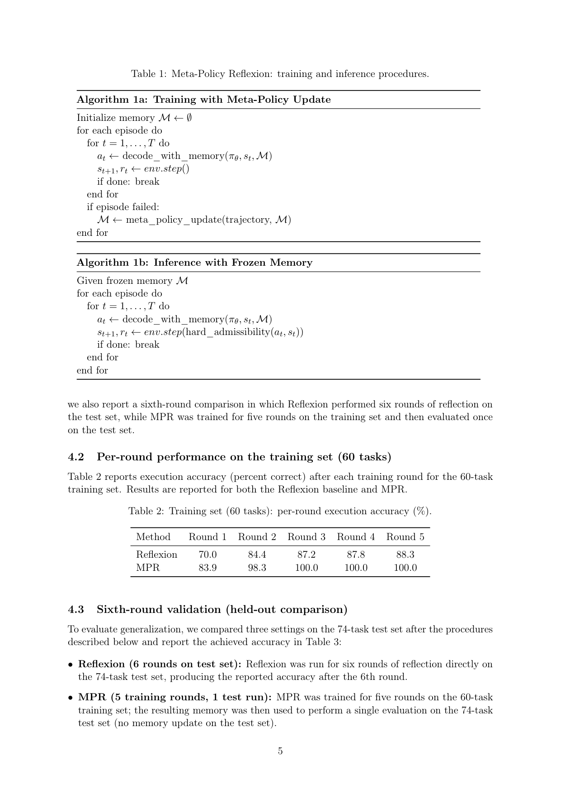
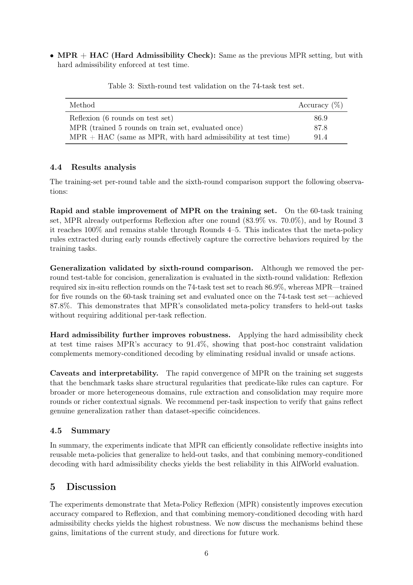

`meta_policy_reflexion | Meta-Policy Reflexion (MPR): Reusable Reflective Memory and Rule Admissibility for Resource-Efficient LLM Agents | 同济大学；Chunlong Wu 等 | arXiv 2509.03990 v2 (2025-09-08)，cs.AI | L?·免梯度反思记忆线·高相关（训练-free 自改进、记忆外化+规则约束）`

> 档位：**deep**（全字段三层 + 结构化抽取）。所有内容基于已下载 PDF 正文（_txt_meta_policy_reflexion.txt，全文 9 页）。

══ 第一层：一眼看懂 [light] ══

- 🟦 **TL;DR**：把 Reflexion 那种"用完即弃的一次性反思文本"**升级成可跨任务复用的结构化记忆**,且**完全不动模型权重**。做法：①把失败轨迹的 LLM 反思蒸馏成**谓词式(predicate-like)规则**(带置信权重)存进 **Meta-Policy Memory(MPM)**;②推理时两条互补机制用这记忆——**软引导**(把相关规则塞进 prompt,偏置 LLM 解码,纯 prompt 级、不碰 logits)+ **硬可行性检查 HAC**(动作生成后查是否违反约束集 C(s),违规就重采样或回退安全动作)。训练阶段攒记忆、推理阶段冻结记忆+开 HAC,两阶段解耦。

- **最巧的一步**：抽掉**"把反思蒸馏成结构化谓词规则并跨任务复用"**就退化回 Reflexion——核心 Δ 是把 episodic、任务专属的反思"externalize"成紧凑可迁移工件,使在训练集学到的纠错能 0-shot 迁到 held-out 测试集(训练 5 轮→测试集单次 87.8% > Reflexion 在测试集自反思 6 轮的 86.9%);HAC 再补一刀把残余非法动作清掉(→91.4%)。

══ 第二层：为什么做（写透，重点） ══

- **研究背景**：LLM 已成为与外部环境(API/仿真世界/GUI)交互的自主 agent 的推理+行动核心。**ReAct**(交错推理与行动)和 **Reflexion**(文本自反思)显著提升单 episode 性能——让 agent 在实验循环内分析失败、调整行为。【原文 §1】

- **解决的具体痛点**：现有反思方法**产出的是 episodic、常无结构、只为当前失败实例优化的输出,没被蒸馏成广泛可复用的知识**。后果:**在共享潜在结构的任务间重复犯同样的错、低效反复试错**。而 RL 替代方案能产可复用策略,但**需大量算力与参数更新,部署受限**。核心设计问题:**能否(a)保留文本反思的轻量灵活、(b)把反思观察蒸馏成紧凑可复用工件、(c)用这些工件产生更安全更泛化的行为,且不微调 base LLM?**【原文 §1】

- **相关工作 & 各自不足**(§2 三维)：
  1. **LLM agent 记忆机制**(Memory-R1/A-Mem/G-Memory)：Memory-R1 用 RL 学增删改记忆;A-Mem 用 Zettelkasten 笔记式自主检索;G-Memory 用层级图结构助多 agent。但**多数依赖非结构化/启发式表征,限制了可泛化的规则形成**。
  2. **反思/自改进框架**(Reflexion/ReAct/RR-MP)：Reflexion 用 verbal RL 不微调改行为;ReAct 交错 CoT+行动。但**缺系统性跨任务迁移反思洞察的机制**——立即纠错有效,但洞察用完即弃。
  3. **agentic/多 agent 记忆**(SAGE/G-Memory)：SAGE 自进化+记忆增强累积知识;但 Wang et al. 也指出 agent 存敏感信息的**安全隐私风险**(医疗场景)。
  本文定位(§2.4):**混合方法——谓词式记忆存储 + 软解码引导 + 硬可行性检查**,补"只反思"与"只记忆"两类方法的短板,做到可解释、高效、可泛化。【原文 §2.4】

- **动机链**：现状(Reflexion/ReAct 提升单 episode,RL 出可复用策略) → 缺陷(反思 episodic 用完即弃→跨任务重复犯错;RL 要大算力+改参数) → **所以要把反思蒸馏成紧凑可复用工件,且不动权重** → 但非结构化反思难复用/难约束 → **所以(a)蒸成谓词式带置信规则(MPM)、(b)软引导偏置解码、(c)硬 HAC 清非法动作** → 训练攒记忆、推理冻结记忆,知识获取与部署解耦。为什么不用 RL?因为它要参数更新+大算力(本文核心反驳点:免梯度也能自改进)。【原文 §1+§2.4】

- **与最近邻工作的 Δ**：
  - **vs Reflexion(最近邻)**：Reflexion 产 episodic 任务专属反思、用完即弃;MPR 的关键 Δ 是**把反思 externalize 成谓词式可复用规则(MPM) + 跨任务迁移**——训练集学的纠错能 0-shot 迁到 held-out 测试集(表3:MPR 训 5 轮→测试单跑 87.8% vs Reflexion 测试集自反思 6 轮 86.9%)。
  - **vs Memory-R1(用 RL 学记忆管理)**：Memory-R1 用 RL 学增删改;MPR Δ 是**完全免梯度**(LLM 当冻结策略生成器),反思函数 f(·) 直接抽规则。
  - **vs G-Memory(图记忆)**：G-Memory 用层级图;MPR Δ 是**谓词式规则(更可解释)+ 软/硬双层应用(软 prompt 偏置 + 硬动作过滤)**。

══ 第三层：怎么做 + 靠不靠谱 ══

- **方法流水线**(§3 + Alg.1a/1b)：把任务建模为 MDP M=(S,A,P,r,γ),base agent 是冻结 LLM 策略 a_t=πθ(s_t)(确定性解码) →
  ① **软引导(§3.2,记忆条件解码)**：维护 MPM 记忆 M(从过去轨迹的 hindsight 反思抽的规则);每步检索与当前状态相关的子集 M_t⊆M,LLM 条件于 (s_t, M_t) 产动作 a_t=πθ(s_t, M_t)。**纯 prompt 级,不改 logits/模型内部**。
  ② **硬可行性 HAC(§3.3,事后验证)**：动作 a_t 生成后查约束集 C(s_t)(环境/用户指定);若 a_t∉C(s_t),则(i)调整记忆/上下文重采样 或(ii)回退安全动作。保证安全可靠。
  ③ **免梯度自改进(§3.4)**：每条失败轨迹 τ 后,反思函数 f(·)(LLM-based)抽出谓词式纠正规则,更新 M←M∪f(τ)。随时间累积更丰富的 meta-policy。
  ④ **两阶段解耦(§3.5,Alg.1)**：**训练阶段(1a)** 失败 episode 后更新 M;**推理阶段(1b)** 冻结 M + 开 HAC,不再更新记忆。
  输出:一个外挂可复用规则记忆 + 硬约束过滤的 agent。

- **逐组件必要性**(表2/3 对比 Reflexion + MPR + MPR+HAC)：
  - **MPM(谓词式可复用记忆) vs Reflexion**：**有对比**。训练集(表2)MPR 第1轮 83.9% 即超 Reflexion 70.0%,第3轮 100%(Reflexion 第5轮才 88.3%);测试集(表3)MPR 单跑 87.8% > Reflexion 6 轮 86.9%。**证明记忆可跨任务迁移**(去掉 MPM 就是 Reflexion)。
  - **HAC(硬可行性检查)**：**有对比**。测试集 MPR 87.8% → MPR+HAC 91.4%。证明事后约束验证补掉残余非法动作。
  - **遗忘/淘汰机制**：**未实现**(列为 future work:置信加权/冗余检测/规则抽象)。
  - **注意**：本文**无传统消融表**(无 w/o soft / w/o memory retrieval 等),组件价值靠"MPR vs Reflexion vs +HAC"三档对比论证。

- **关键机制/公式直觉**：
  - **谓词式记忆(MPM)**：直觉是"把'这次错在哪、以后别这样'写成一条带置信权重的紧凑规则",比一大段自然语言反思更可复用、可检索、可约束。它是"反思的结构化压缩"。
  - **软引导 a_t=πθ(s_t, M_t)**：直觉是"把相关规则塞进 prompt,让冻结 LLM 自然偏向记忆支持的动作"——不碰 logits、纯 prompt 级,所以训练-free。
  - **硬 HAC a_t∈C(s_t)**：直觉是"软引导只是偏置、不保证合法,所以再加一道硬闸:动作生成后查约束,违规就重采样/回退"。软偏置 + 硬过滤互补。
  - **训练/推理解耦**:训练攒记忆(可能犯错探索)、推理冻结+开 HAC(强调安全可靠),清晰分离知识获取与部署。

- **实验与证据**：
  - **数据集/设置**：**AlfWorld**(文本具身),base LLM **Qwen3-32B**,确定性解码,固定随机种子。训练集 60 任务、测试集 74 任务。报告每轮(Round 1-5)准确率 + 第六轮 held-out 对比。【原文 §4.1】
  - **核心主张证据**：(1) **训练集快速稳定收敛**(表2):MPR 第1轮 83.9% > Reflexion 70.0%,第3轮 100% 并稳到第5轮;(2) **泛化**(表3,核心主结果):Reflexion 在测试集自反思 6 轮才 86.9%,MPR 训 5 轮→测试单跑 87.8%(无测试集记忆更新)→证明 meta-policy 可迁移;(3) **HAC 提鲁棒**:MPR+HAC 91.4%。
  - **baseline 公平性**：与 Reflexion 同环境同种子比;但**只比 Reflexion 一个基线**,无与其他记忆方法(G-Memory/A-Mem)或 RL 方法的直接对比。
  - **"看着强但需警惕"的点**：(1) **训练集 3 轮冲到 100%** 强烈暗示 **AlfWorld 任务共享强结构规律**,谓词规则恰好能捕捉——作者自己 caveat 这可能是"数据集特定巧合"而非真泛化,建议 per-task 检查;(2) **只单 agent 文本环境 + 单基线(Reflexion)**;(3) **泛化优势其实很小**(87.8% vs 86.9%,仅 +0.9 点),真正的明显增益来自 HAC(+3.6 点)而非记忆迁移本身;(4) **实验描述提及"provided implementation/uploaded spreadsheet"**,部分结果来自所提供材料,完整性待核。

- **假设与失效边界**：
  - 【原文 §4.4 caveat + §5.2】**AlfWorld 训练集快速冲 100% 说明任务共享强结构规律**,谓词规则能捕捉;**异质/开放域里规则抽取需更多轮或更丰富表征**。
  - 【原文 §5.2】**规则由 LLM 生成,可能含冗余/矛盾**(predicate 格式改善可解释性,但无系统 verify/prune/compose);**HAC 约束集 C(s) 需环境/用户提供**。
  - 【原文 §5.2】**仅单 agent 文本环境**(Qwen3-32B/AlfWorld),多模态/多 agent/真实 API 未验,需额外的规则 grounding 与冲突解决设计。
  - 【推断,依据无 prune/conflict resolution】记忆**只增不淘汰**,长期可能膨胀/规则冲突(作者列为 future)。

- **祛魅总结**：
  - **真贡献(硬货)**：(1) **把 Reflexion 的 episodic 反思 externalize 成谓词式可复用记忆(MPM)**,这一"反思持久化+结构化"的概念是清晰的;(2) **软引导(prompt 偏置)+ 硬 HAC(动作过滤)双机制**互补,且 HAC 的 +3.6 点增益(表3)是实打实的鲁棒性提升;(3) **完全免梯度**,代表"不训练也能自改进"一极,部署轻量。【推断】
  - **包装/营销成分**：(1) **核心泛化优势其实微弱**(87.8% vs Reflexion 86.9%,仅 +0.9 点)——"记忆可跨任务迁移"的实证支撑较弱,真正明显的增益来自 HAC 这个相对工程化的事后过滤;(2) **训练集 3 轮就 100%** 很可能是 AlfWorld 强结构规律所致(作者自己 caveat 是"数据集特定巧合"风险),不能直接外推;(3) **只比 Reflexion 一个基线、单环境、单模型**,且部分结果依赖"provided implementation/spreadsheet";(4) 记忆**无遗忘/冲突解决**(都列为 future),离真正可部署的持久记忆还有距离。【推断】
  - 作者**相当诚实**：§4.4 主动 caveat "rapid convergence 可能是 dataset-specific coincidence,建议 per-task inspection",Limitations 列了域规律/规则质量/评测范围三条。【推断】

══ 结构化抽取（供全景汇总，必填） ══

- 🎯 **机制速览 6 轴** [light]：

| 轴 | 内容 |
|---|---|
| 学什么信号 | **环境失败信号 + LLM 对失败的自反思**(蒸馏成谓词规则);约束集 C(s) 来自环境/用户指定 |
| 改什么 | **记忆 + harness**(外部 MPM 谓词规则库 + 推理时软 prompt 注入 + 硬动作过滤器 HAC);**绝不改 LLM 权重**(LLM 当冻结策略生成器) |
| 何时改 | **在线 per-episode**(每条失败轨迹后 M←M∪f(τ) 更新记忆);推理时记忆冻结 |
| 免梯度? | **是**——全程 training-free,无任何梯度更新 |
| 记忆-技能生命周期 | 反思**写入**谓词规则(带置信权重)→按当前状态**检索**相关子集 M_t→软引导+HAC 应用;**遗忘/淘汰**机制原文未实现(列为 future:置信加权/冗余检测/规则抽象) |
| 防遗忘机制 | **隔离**(知识在外部记忆层,base LLM 不变⇒不存在权重遗忘);跨任务不冲突,但规则冲突解决也列为 future work |

- ⑦ **开源代码 + 框架/harness**：**原文未给 GitHub 链接**(称"following the provided implementation",基于 AlfWorld)。**无训练框架**——免梯度 harness(反思函数 f 抽谓词规则 + 记忆条件解码 + HAC 过滤);base LLM Qwen3-32B(API/推理)。**判定:训练-free,自研 prompt/memory harness,公开代码待核。**【原文 §4.1】
- 💰 **资源/成本与可扩展性**：**免梯度=无训练算力**,成本主要是 Qwen3-32B 的推理调用;训练阶段攒记忆(失败 episode 反思),推理冻结记忆;轻量、易部署是核心卖点。规模化瓶颈在记忆膨胀(无 prune)与规则冲突(无 resolution)。【原文 §1+§5.2】

- 🎯 **对"探索-巩固"idea 对标** [light]：**可借组件(免梯度一极的竞品基线)**。其"软引导(prompt 偏置)+硬可行性检查(HAC)"两机制可类比"path-selection 引导 + path-recovery 兜底",且"**把反思巩固成可复用谓词规则**"=巩固阶段的**外化(非参数)范式**;可迁移积木是"谓词式结构化反思记忆 + 软/硬双层应用(软偏置+硬过滤)"。但它是**免梯度记忆外化(不碰参数)、与本项目 MTP+OPD 的参数级蒸馏正交**——可作竞品基线代表"不训练也能自改进"一极。其弱点(泛化增益微弱、依赖 AlfWorld 强结构、记忆无淘汰)恰好凸显**参数级巩固(把纠错内化进权重)** 相对"prompt/记忆层巩固"的潜在优势。

- 🔭 **开放问题/未来方向**：
  - 【原文 §5.3】多模态记忆(视觉/结构化输入);多 agent(图/分布式记忆共享协商规则);**自动规则管理(置信加权/冗余检测/规则抽象)**;HAC 校准;高影响规则的 human-in-the-loop 验证。
  - 【推断】把"事后失败反思"前置为前瞻信号;在异质域上验证泛化(避免 AlfWorld 强结构带来的乐观偏差)。

- 🖼 **关键图 top-2** [light]：
  
  这是**原文第 4-5 页(Table 1 算法 1a/1b + Table 2)**：左展示两阶段算法(训练攒记忆 / 推理冻结+硬检查),右是训练集逐轮准确率——MPR 第 1 轮 83.9% 已超 Reflexion 70.0%,第 3 轮到 100%。选它因为它同时给出"机制 pipeline"和"快速收敛证据"。
  
  这是**原文第 5 页 Table 3**(核心主结果):74 任务测试集上 Reflexion(测试集 6 轮)86.9% vs MPR(训练 5 轮、测试单跑)87.8% vs MPR+HAC 91.4%。选它因为这是支撑"记忆可跨任务迁移、HAC 提鲁棒"核心主张的关键数字。
