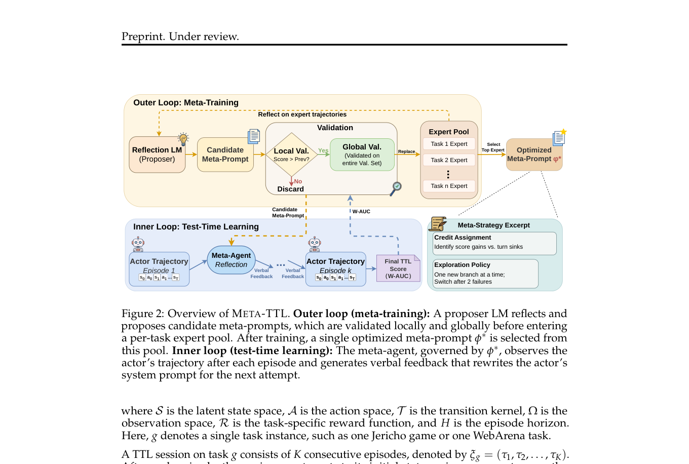
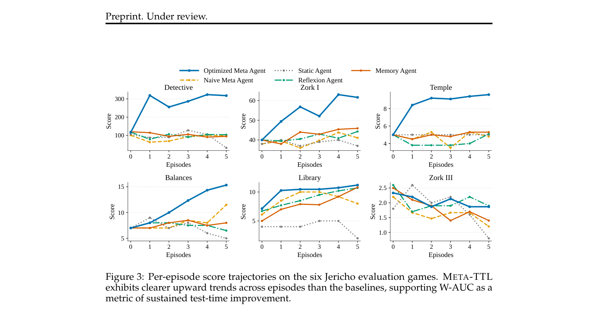

`meta_ttl | Learning to Learn-at-Test-Time: Language Agents with Learnable Adaptation Policies (META-TTL) | 新加坡国立大学 NUS(Bryan Hooi 组;Zhanzhi Lou 一作) | 2026-04 首发·arXiv v2(2026-04-02)·Preprint under review·cs.LG | 主题线 L?("把测试时适应策略本身做成可学习对象"线;jitrl 式在线更新规则的上位/meta 视角)· 相关性 High`

> 三标注约定：【原文】= 论文明说；【推断】= 我的有据判断(附依据)；【待核】= 拿不准的关键事实。

══ 第一层：一眼看懂 [light] ══

- 🟦 **TL;DR**：测试时学习(Test-Time Learning, TTL)= agent 在推理期通过反复与环境交互来迭代变强。它的核心是一个**适应策略(adaptation policy)f**——它**不决定单回合内怎么行动(那是 actor policy),而决定"跨回合之间 actor 该怎么更新"**(\(π_{k+1}=f(π_k, H_k)\))。现有方法(Reflexion 等)的 f 都是**人手写死的固定规则**(一句反思 prompt),没人去优化它。本文的主张是:**"怎么从经验中适应"本身就是一种可学习的能力,应该从任务环境里学出来,而不是靠人的直觉去工程化**。于是提出 **META-TTL**:把"发现好的适应策略"建成一个**双层优化(bi-level)**——**内层**跑标准 TTL(衡量某候选适应策略 ϕ 帮 agent 跨回合纠错的效果,用 W-AUC 打分);**外层**在一堆训练任务分布上用**进化搜索(evolutionary search)** 不断进化适应策略 ϕ。关键是:**整个优化在 prompt 空间、免梯度**——产出的 ϕ* 是一段**可移植的自然语言"meta-prompt"**(本质是"用自然语言写的学习算法"),测试时冻结、zero-shot 套到新任务/新 backbone 上。在 Jericho(交互小说)和 WebArena-Lite(网页)上,ID/OOD 都稳超手工 baseline(Jericho ID 平均分 50.4→110.8,~120%;WebArena-Lite ID 0.55→0.63,~15%),且**学到的策略能泛化到训练分布外**。代码:https://github.com/zzzlou/meta-ttl 。【原文 Abstract/§1/§3】
- **最巧的一步**：**W-AUC(Weighted Area Under the Learning Curve)这个内层评分函数 + GEPA 式 per-task 专家池**(Eq.1 + §3.3)。抽掉"给后期回合更大权重的 W-AUC",外层进化就只会优化"最后一回合分数",学到的可能是"运气好的一次成功"而非"持续变强的适应能力";正是 **W-AUC 显式奖励"学习曲线持续上升"**,才把"适应策略=一个好的学习算法(越学越好)"这件事变成可被进化搜索优化的目标。配套的 **per-task 专家池(像 GEPA)** 则解决"一个 prompt 难同时擅长所有任务"——它**强迫适应策略分解成"任务无关的通用适应招式 + 仅在确认环境时才激活的条件知识库"**,这个 factorization 是泛化的来源。

══ 第二层：为什么做（写透） ══

- **研究背景**：LLM agent zero-shot 能力强,但**进了新环境常不会"边做边学"**——没有参数更新/无 ground truth 时,它们把每个 episode 当独立的 zero-shot trial,**给再多次机会也重复同样的错**。人类玩陌生游戏会"失败→诊断→调策略→再试",这种 TTL 能力是 agent 缺的。【原文§1】
- **解决的具体痛点**：TTL 的核心 = 适应策略 f(把过去经验映射到未来行为改进)。**f 本质是一个"学习算法"**,而"学习算法"需要专门优化(meta-learning),**通用语言建模并不提供这种能力**。现有方法(Reflexion/Self-Refine)却**纯靠底层 LLM 的预训练能力做适应**——把 f 当成现成的、不优化。痛点就是:**没人把"适应机制本身"当作优化对象**。
- **相关工作 & 各自不足**(§2)：
  - **TTL 两大类**:**梯度型**(测试时微调权重 / 测试时 RL:Akyürek TTT、Acikgoz、Zweiger、Zuo 等)/ **权重冻结型**(verbal RL:Reflexion/Self-Refine;记忆持久化:Dynamic Cheatsheet/Mem0 等;学环境规则:Grounded TTA;**EvoTest[本调研 evotest] 进化整个 agent 配置**)。这些**要么改权重、要么把适应规则写死**。
  - **LLM as Optimizer & Prompt 进化**(APE/OPRO;PromptBreeder/EvoPrompt/ReEvo;**GEPA[Pareto 选择,本篇专家池借鉴]**;AlphaEvolve;TextGrad/ACE):证明"训练分布上的经验可蒸馏进更好的 prompt",但**优化的是 actor 的 prompt/pipeline,不是跨回合的适应规则**。
  - **Meta-learning**:STaR/SCoRe 优化自我改进但**不学序贯环境的跨回合适应策略**。**最近邻(并发工作)= LAMER[本调研 lamer_metarl,meta-train 探索策略]、MR-Search[学跨回合自反思]、LSE[学 prompt 编辑策略,单步目标]** —— **三者都要用 policy gradient 微调模型权重**。
  - **与最近邻的 Δ(关键)**：与 LAMER/MR-Search/LSE 都"学自我改进/适应",**关键差异 = META-TTL 完全在 prompt 空间、免梯度搜索**,产出**可移植文本工件**(跨 backbone 无需重训);而那三者需要微调权重(绑特定模型、成本高、不可移植)。这差异有用,因为:① 免梯度→轻量、可解释(适应策略是看得懂的自然语言);② 文本工件→同一个 ϕ* 能套到 Gemini/GLM/GPT 不同 meta-agent backbone。【原文§2 Meta-Learning 末段】

══ 第三层：怎么做 + 靠不靠谱 ══

- **方法流水线(双层,对应 Fig 2)**：
  1. **TTL 形式化(§3.1)**：每个任务实例 g 是有限步 POMDP；一次 **TTL session = K 个连续 episode** \(ξ_g=(τ_1,…,τ_K)\),**每 episode 后环境重置**(所以跨回合的进步只能来自 agent 内部的适应,而非环境状态延续)。打分用 **W-AUC**(Eq.1):\(Σ_k w_k·J(τ_k) / Σ_k w_k·J_max(g)\),**权重 w_k=k**(后期 episode 权重更大,奖励"持续改进")。
  2. **两个策略(§3.2)**:**actor policy π**(单 episode 内选动作,**LLM 权重 θ 冻结**)+ **adaptation policy f**(每 episode 后看历史 H_k 产出更新后的 actor)。**只走 prompt 轴**:\(π_{k+1}=f(π_k,H_k)\) 通过**重写 actor 的 system prompt ρ** 实现(θ 全程冻结,改 ρ 是唯一行为改变机制)→ 免测试时梯度,且把问题变成"可被 meta-training 优化的自然语言生成任务"。
  3. **Meta-Agent = 可学习的适应策略(§3.2)**:把 f 实例化成**另一个由 meta-prompt ϕ 支配的 LLM**:\(ρ_{k+1} ∼ f_ϕ(·|ρ_k, H_k)\)(Eq.3)。**ϕ 完全决定适应策略**——meta-agent 关注过去经验的哪些方面、怎么诊断失败、产出什么形式的指导。**可学习的就是 ϕ 本身**。
  4. **内层 RUNTTL(Algorithm 1)**:给定 ϕ 和任务 g,跑 K 个 episode:每 episode 用当前 actor prompt ρ_k 执行 → 若未到 K,meta-agent ADAPT(ϕ, 历史) 重写出 ρ_{k+1} → 返回 session ξ。
  5. **外层进化 meta-training(§3.3, Algorithm 2)**:目标 \(ϕ* = argmax_ϕ E_{g∼D_train}[W-AUC(ξ_g^ϕ)]\)(Eq.4)。流程:从**专家池**采父代 ϕ_parent + 采训练任务 g → 跑 TTL → **proposer LLM 读 session 反思、提候选 ϕ_candidate** → **本地验证**(同任务上 W-AUC 是否更优,不优则丢)→ **全局验证**(在所有验证任务上跑,对每个它刷新最佳分的任务,替换该任务的专家)→ 预算耗尽后 **SELECTEXPERT**(选平均验证分最高的专家;跨任务 reward 尺度差异大时用 per-task z-score 归一,防易任务主导)。
  6. **测试(§3.3)**:ϕ* 冻结,zero-shot 部署到 held-out 任务,meta-agent 照常 episode 间重写 actor prompt,但 ϕ* 不再变。
- **逐组件必要性**：
  - **Naive baseline(同 actor-meta-agent 架构但 ϕ 未 meta-train)** 是关键对照——它隔离了"meta-training 这一步"的贡献。Tables 1-4 显示 META-TTL 在所有 backbone 上稳超 Naive(Jericho ID GPT-5:Naive 50.4 → META-TTL 110.8)。
  - **W-AUC 权重 w_k=k**:必要(否则不奖励持续改进);Fig 3 的"学习曲线持续上升"正是 W-AUC 设计意图的可视化。
  - **专家池(per-task tracking)**:必要——§4.4/Appendix D 显示**早期迭代会把环境特定知识硬编进 meta-prompt**(单任务强、跨任务差);随着跨任务验证压力,适应策略**自发 factor 成"任务无关招式 + 条件激活的事实库"** → 这个分解是泛化的机制根源。
  - 【推断:正文未对"进化搜索 vs 其他外层优化器(如 RL/贝叶斯)"做对照消融,故"进化是否最优"未验;依据:正文只与手工/Naive baseline 比,外层固定为进化搜索。】
- **关键机制直觉**：核心直觉是"**与其让一个通用 LLM 临场即兴反思,不如先离线把'怎么反思才有效'这套学习算法用自然语言写好、调好,再套上去**"。meta-prompt ϕ* 就像一本"如何从失败中学习的方法论手册",由进化搜索从任务表现中自动写成;因为是自然语言,它**可读、可移植**,且**自动分解出"通用方法论 + 按需激活的领域知识"**(避免把领域知识写死导致不泛化)。
- **实验与证据**：
  - **数据集/环境**:**Jericho**(交互小说;ID=Detective/Zork1/Temple,OOD=Balances/Library/Zork3,每 session 6 episode)、**WebArena-Lite**(网页导航,二元奖励;ID=Shopping/GitLab/Map,OOD=Reddit/Shopping-Admin,每 session 5 episode)。
  - **模型**:actor 全程 = frozen **Gemini-3-Flash**;meta-agent backbone 三选一各自独立 meta-train:**Gemini-3-Flash / GLM-5 / GPT-5**。baseline:Static(无适应)、Reflexion、Memory Agent(EvoTest 的)、**Naive**(架构同但 ϕ 未训)。
  - **支撑核心主张的关键实验 = Tables 1-4 + Fig 3**:**(RQ1)** Jericho ID 大幅提升(GPT-5 W-AUC 0.18→0.41;平均分 50.4→110.8,~120%);WebArena-Lite ID 提升较小但全 backbone 正向(GLM-5 +0.09 W-AUC)。**(RQ2 OOD)** Jericho 三个 held-out 全 backbone 正向(GPT-5 avg 0.23→0.28),含最难的 Zork3;WebArena OOD 增益集中在 Shopping-Admin(与 ID Shopping 结构相似),Reddit(结构迥异)迁移有限。**(RQ3)** Fig 3:META-TTL 在六个 Jericho 游戏上**学习曲线明显更稳更上扬**(Detective 上 Naive 首次反馈把分从 114→89 弄砸,META-TTL 同一步 117→319,2.7×)。
  - **诚实的负面/边界**:【原文】**WebArena 增益远小于 Jericho**,作者归因于**奖励粒度**——Jericho 稠密 per-action reward 给进化搜索细粒度信号;WebArena 二元完成信号使 session 轨迹几乎全 0 或全 1,外层搜索 landscape 粗糙。Zork3 上所有方法都退步(TTL 本身难),但 META-TTL 仍比 Naive 高。
  - **baseline 公平吗**【推断】:【原文】actor 统一 frozen Gemini-3-Flash,Naive 用同架构,**较公平地隔离了 meta-training 的贡献**。隐患:① **proposer/meta-agent 都用强模型(GPT-5 等)**,部分增益可能来自强 meta-agent 的即兴能力而非 ϕ* 本身——但 Naive(同强模型、未训 ϕ)对照已大体控住此点;② benchmark 仅 2 个、任务数有限(每 benchmark 3 ID 域),进化搜索的 generalization 强度样本量偏小。
- **假设与失效边界**：
  - 【原文】**外层进化搜索强烈依赖内层评分信号的粒度**:稠密 reward(Jericho)下有效,**稀疏/二元 reward(WebArena)下搜索 landscape 粗糙、增益骤减** —— 这是显式的失效边界。
  - 【原文 §3.1】**每 episode 后环境重置**,故方法只适用于"同任务可反复重试、跨回合靠 agent 内部适应"的设定;不适用于"环境状态延续/不可重置"的真实在线场景。
  - 【原文】适应只走 **prompt 轴(θ 冻结)** → 行为改变受限于"system prompt 重写能表达的范围";需要参数级能力变化的适应不在范围内。
  - 【推断】ϕ* 的可移植性虽跨 Gemini/GLM/GPT 验证,但**都是强 frontier 模型**;弱模型当 meta-agent 能否执行这套"自然语言学习算法"未验。依据:三 backbone 均为 frontier 级。
  - 【推断】**与"探索-巩固"的隐忧**:meta-prompt 把"领域知识"做成"条件激活事实库",但**没有防遗忘/防巩固坏经验的机制**——若某次 session 学到错误启发式并被进化保留,可能复现 misevolution 式问题(本文未测安全)。依据:§4.4 factorization 描述 + 无安全实验。
- **祛魅总结**：
  - **真贡献(硬货)**：① **把 TTL 显式形式化为"在适应策略上的 meta-learning"**,并清晰区分 actor policy(回合内) vs adaptation policy(回合间)——概念干净且有启发;② **bi-level(内 TTL + 外进化)+ W-AUC + GEPA 式专家池** 的具体可操作框架;③ **完全免梯度、prompt 空间**——产出**可读、可移植的"自然语言学习算法"**(ϕ*),跨 backbone 无需重训,这是相对 LAMER/MR-Search/LSE(都要微调权重)的实在差异;④ **RQ3 的涌现发现**:meta-training 自发把适应策略 factor 成"任务无关招式(显式信用分配 / 知识抽取巩固 / 探索-利用平衡)+ 条件事实库",且这些招式跨 benchmark 一致出现 → 说明"有效适应"确是可学习的通用过程。
  - **包装/营销成分**【推断】:① "learnable adaptation policy"听起来很重,**实际落地就是"进化优化一段 meta-prompt"**——本质是 prompt 进化(PromptBreeder/GEPA 家族)在"跨回合适应规则"这个特定对象上的应用;② **WebArena 增益小**(~15% 且 OOD 主要靠结构相似的 Shopping-Admin)暴露方法对稠密 reward 的依赖,"consistently outperforms"在稀疏 reward 下偏弱;③ 缺"进化 vs 其他外层优化器"的消融,"进化搜索"的必要性未单独验证。
  - 作者**较诚实**:明确讨论 Jericho/WebArena 增益差异的奖励粒度成因、报告 Zork3 上 TTL 本身的困难、Reddit OOD 迁移失败(可信度加分)【推断】。

══ 结构化抽取 ══

- 🎯 **机制速览 6 轴** [light]：

| 学什么信号 | 改什么 | 何时改 | 免梯度? | 记忆-技能生命周期 | 防遗忘机制 |
|---|---|---|---|---|---|
| **环境 reward(内层 W-AUC = 加权学习曲线下面积,后期 episode 权重更大,奖励持续改进);外层用其引导进化** | **两层:外层改"适应策略"= meta-prompt ϕ(进化搜索);内层 meta-agent 每 episode 改 actor 的 system prompt ρ(θ 全程冻结)** | **外层=离线/批量(meta-training 跨任务进化);内层=在线 per-episode(测试时回合间重写 prompt)** | **是(纯免梯度)**:外层进化搜索 + 内层 prompt 重写,无任何梯度;产出可移植文本工件 | **以 prompt/文本为载体:经验 H_k→meta-agent 反思→写入更新后的 ρ;"技能/知识"被 factor 进 ϕ*(任务无关招式 + 条件激活事实库),按 episode 日志确认环境才激活相应知识** | **几乎无显式防遗忘**:ϕ* 训练后冻结(不会在测试时漂移,算一种被动稳定);但**无机制防止"进化阶段把坏适应策略保留"或"测试时 prompt 重写丢旧能力"**;无几何/merging/KL/隔离。**与"探索-巩固"相关的是:emergent 招式里含"知识抽取与巩固""探索-利用平衡",但未做成防遗忘保证** |

- ⑦ **开源代码 + 框架/harness**：**有开源**——【原文 Abstract 明写】**Code is available at https://github.com/zzzlou/meta-ttl**。**框架/harness**:**无标准 RL 训练框架(veRL/TRL 等)——因全程免梯度**;实现是**自研的双层进化搜索 harness**(内层 RUNTTL + 外层 Algorithm 2 进化 meta-training + GEPA 式专家池),底层调用 frontier LLM API(Gemini-3-Flash/GLM-5/GPT-5)作 actor/meta-agent/proposer,环境用 Jericho + WebArena-Lite 官方接口。〔待核:仓库具体内容以实际 clone 为准;按 PDF,代码链接确凿、属"有代码"。〕
- 💰 **资源/成本与可扩展性**：【原文未给精确 GPU/API 成本】**无梯度训练 → 无 GPU 显存压力**,但**外层进化搜索要反复跑完整 TTL session(每 session 5-6 episode × 多任务 × 多迭代)→ 大量 frontier-LLM API 调用**,这是主要成本(尤其 proposer/meta-agent 用 GPT-5)。可扩展性:产出 ϕ* 是**一段可移植 prompt**,**部署成本极低**(只多一个 meta-agent 调用);跨 backbone 复用省再训。瓶颈:稀疏 reward 环境下搜索效率低(WebArena 教训)。
- 🎯 **对"探索-巩固"idea 对标** [light]：**上位视角支撑 + 可借框架(对标 jitrl 的 meta 层)**。① **它是"在线更新规则(jitrl 式)"的上位/元视角**:jitrl 等做"测试时怎么更新"的**具体规则**,META-TTL 则**把'更新规则本身'当成可学习对象去优化**——本项目若想做"可学习的 path-recovery/巩固规则",META-TTL 提供了**"bi-level:内层跑探索-巩固、外层优化巩固策略"** 的现成范式。② **核心可借组件**:**(a) W-AUC**——"加权学习曲线下面积、后期权重更大"是衡量"持续改进/巩固有效性"的好指标,可直接用作本项目"巩固是否真的让 agent 越来越强"的训练/评估信号;**(b) actor vs adaptation policy 的二分**——清晰对应本项目"探索者(actor)vs 巩固器(adaptation policy)",支持把两者解耦优化;**(c) GEPA 式专家池 + factorization**——"通用招式 + 条件激活知识库"的自发分解,启发本项目把"通用巩固策略"与"任务特定经验"分层管理(避免把特定经验固化成通用规则,呼应 CPE 防侵蚀)。③ **emergent 招式直接命中本项目主题**:meta-training 自发学出 **"信用分配 / 知识抽取与巩固 / 探索-利用(exploration-exploitation)平衡"** —— 这正是"探索-巩固"的核心三件事,且本文证明它们可被**从任务表现中自动学出来**(而非人手设计),为本项目"让巩固策略可学"提供强有力的存在性证据。④ **竞品/差异点**:META-TTL **免梯度、只改 prompt、不动参数**(本项目 OPD 是参数侧蒸馏);它**适应策略冻结后不在线更新**(本项目可探在线/持续巩固);它**依赖稠密 reward**(本项目用 MTP 前瞻或可缓解稀疏信号问题——这是潜在差异化点);它**无防遗忘/安全机制**(本项目可补)。
- 🔭 **开放问题/未来方向**：【原文 Conclusion + 散见】① 把方法推广到**稀疏/二元 reward** 环境(当前对稠密 reward 依赖强);② 更多 benchmark / 更强 OOD(Reddit 式结构迥异迁移弱);③ 把适应轴从 prompt 扩到参数(当前 θ 冻结)。【推断】④ 把外层从进化搜索换/比其他优化器(RL/贝叶斯)并消融;⑤ 给可学习适应策略加**防遗忘/安全约束**(防进化保留坏策略,呼应 misevolution/CPE);⑥ 与 MTP 前瞻结合,用前瞻信号缓解稀疏 reward 下外层搜索 landscape 粗糙的问题;⑦ 在线持续 meta-update(当前 ϕ* 测试时冻结)。

- 🖼 **关键图 top-2** [light]：

· 这是**原文 Figure 2**(方法主图,已裁剪上半)。**外层(meta-training)**:proposer LM 反思并提候选 meta-prompt → Local Val(同任务 W-AUC 是否更优)→ Global Val(全验证集)→ 进 per-task **Expert Pool**(Task1/2/n Expert)→ 训练后选出 **Optimized Meta-Prompt ϕ\***;**内层(test-time learning)**:meta-agent(由 ϕ* 支配)观察 actor 每个 episode 的轨迹 → 产 verbal feedback → **重写 actor 下一回合的 system prompt**;右下角"Meta-Strategy Excerpt"举例学到的招式("一次只开一个新分支;失败 2 次就换")。选它因为它**完整呈现"把适应策略本身做成可学习对象"的双层机制**——正是本项目"内层探索-巩固、外层优化巩固策略"的现成范式图。

· 这是**原文 Figure 3**(核心证据图)。六个游戏(Detective/Zork1/Temple/Balances/Library/Zork3)的逐 episode 得分曲线:**Optimized Meta Agent(蓝)在多数游戏上明显持续上扬**(Detective、Temple、Balances 尤其陡),而 Static/Reflexion/Memory/Naive 基本走平或下滑;即便最难的 Zork3 蓝线也更稳。选它因为它**直接、可视化地证明本文核心主张——学到的适应策略带来"持续的测试时改进(sustained TTL)"**,这正是 W-AUC 想捕捉的、也是"探索-巩固"追求的"越学越好"曲线形态。
