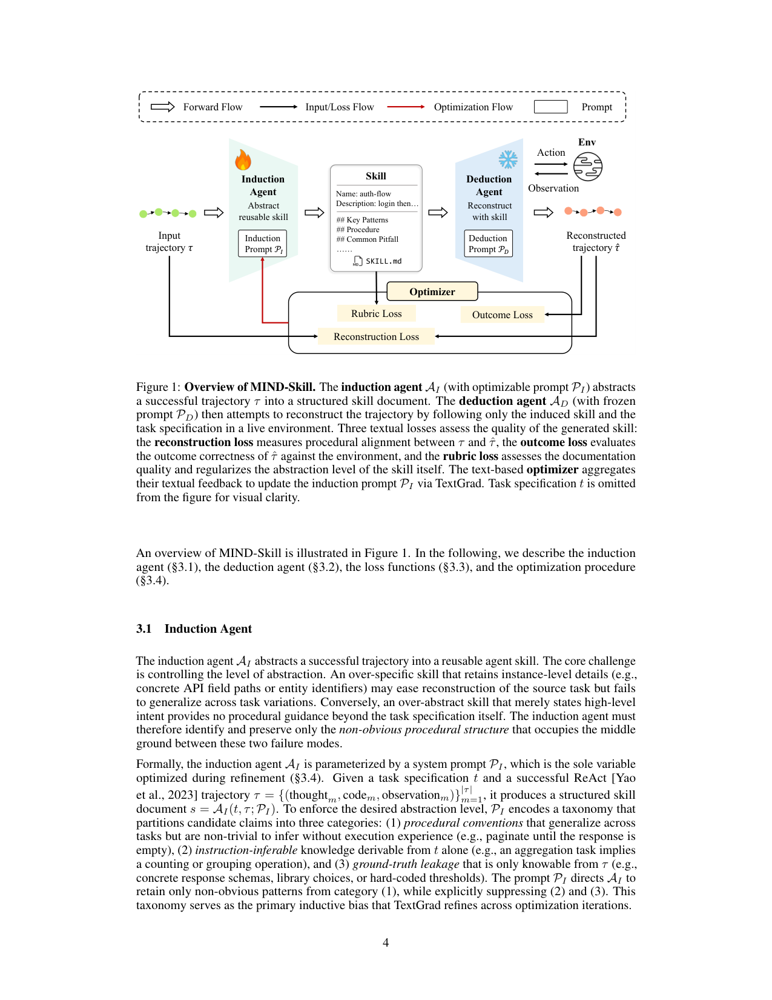
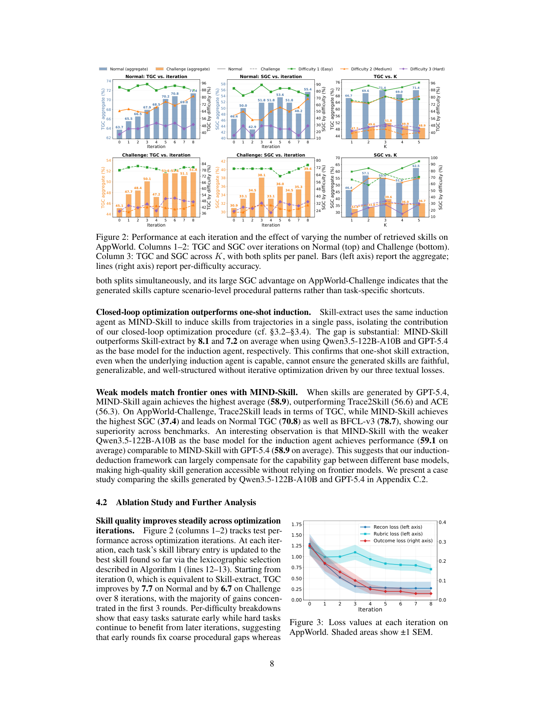

`mind_skill | MIND-Skill: Quality-Guaranteed Skill Generation via Multi-Agent Induction and Deduction | 南洋理工(NTU)+ 早稻田 + 浙大 + 东南大学 | arXiv:2605.08670v1, 2026-05-09, cs.AI, Preprint | 主题线 L?(技能生成质量保证,免梯度 prompt 优化)·相关性 High`

> 三标注:【原文】=论文直述;【推断】=有据判断(附依据);【待核】=拿不准关键事实。本篇基于下载 PDF 全文(19 页,68K 字符)精读。

══ 第一层:一眼看懂 [light] ══
- 🟦 **TL;DR**:agent 要靠"技能(skill)"——把成功经验写成可复用的 Markdown 流程文档——来解复杂多步任务。但**自动生成的技能质量没保证**:可能丢关键步、过度泛化、文档写得烂。本文 **MIND-Skill** 用"归纳-演绎"双 agent 解决:**归纳 agent** 从一条成功轨迹里抽出技能文档;**演绎 agent(冻结)** 只拿这份技能去**重建(reconstruct)原轨迹**。如果技能写得好,演绎 agent 就能重现原来的解题逻辑;重建得越像、越对、文档越规范,说明技能质量越高。三个"文本损失"(重建损失/结果损失/评分损失)用 **TextGrad** 联合优化**归纳 agent 的提示词**(不动模型权重)。在 AppWorld 与 BFCL-v3 上一致超过同期技能生成方法。【原文 Abstract/§1/§3】
- **最巧的一步**:**"冻结的演绎 agent 做受控重建"**。抽掉它(回到"直接从失败轨迹诊断错误来改技能"的常规做法)整个质量信号就垮——因为常规做法里**任务成败被 agent 自身推理能力污染**:强 agent 哪怕技能很烂也能靠自己推理蒙对(掩盖技能缺陷),弱 agent 哪怕技能够好也可能失败(给出误导性负信号)。冻结演绎 agent + 只喂技能,使得"重建轨迹与原轨迹的偏差"**唯一归因于技能本身的缺陷**,从而把"技能质量"从"agent 能力"中干净剥离出来作为唯一优化目标。【原文 §3.3/§2.2 末】

══ 第二层:为什么做(写透) ══
- **研究背景**:LLM 有大量声明性知识,但 agent 仍在需要**领域程序性知识**(用 API、多步工具调用、按反馈调整)的长程任务上挣扎。Agent skills(Anthropic 提出的概念:把成功策略/SOP 打包成 Markdown 文档+脚本)是优雅解法,但**高质量技能的策划长期靠人工**。【原文 §1】
- **解决的具体痛点**:现有自动技能生成有三类(zero-shot 从任务描述直接生 / trajectory-distillation 从轨迹蒸馏 / lifelong 持续进化),共同的关键缺陷是**缺质量保证**:① 多数方法不带"显式验证-纠正-精炼"的闭环,没有按执行结果校验技能;② **文档质量被忽视**(技能本应是可跨 agent/模型/人共享的可移植产物,却很少检查是否符合技术写作标准——逻辑流、排错指引);③ 对 trajectory-distillation,**抽象过程的忠实度从未被验证**(蒸馏是有损压缩,易过度泛化,丢边界情况/前置检查)。佐证痛点真实存在:SkillsBench 显示 zero-shot 技能平均无益,SWE-Skills-Bench 显示低质技能反而显著降性能。【原文 §1/§2.1】
- **相关工作 & 各自不足**:① zero-shot(Anthropic skill-creator)——无执行经验,抓不到只在交互中浮现的程序知识;② trajectory-distillation(WebXSkill/Trace2Skill/SkillX/D2Skill)——抽象忠实度不验证、文档质量不控;③ lifelong evolving(SAGE/SkillRL 用 RL,但技能与特定 policy 强耦合;EvoSkill 从失败提技能 Pareto 保留;CoEvoSkills 生成器+代理验证器共进化;ACE 累积成单块 playbook)——用了环境反馈,但**信号被 agent 自身推理能力混淆**。MIND-Skill 通过**受控重建**剥离这一混淆,把技能质量孤立为唯一目标,用 TextGrad 做有原则的优化。【原文 §2.2】
- **动机链**:agent 缺程序知识 → 技能是解法但需高质量 → 自动生成缺质量保证(无闭环/文档差/忠实度不验) → 关键:用"成败"当技能质量代理不可靠(被 agent 能力污染) → 所以引入"冻结演绎 agent 重建轨迹"作为干净的技能质量探针 + 三个文本损失约束忠实度/正确性/文档与抽象度 → TextGrad 优化归纳提示词。为什么不用更简单做法:Skill-extract(同样的归纳 agent 但单次抽取无优化)平均落后 MIND-Skill 8.1 分(消融证明单次抽取不够)。【原文 §1/§4.2】
- **与最近邻工作的 Δ**:最近邻 = Trace2Skill / SkillX / D2Skill 等 trajectory-distillation,以及 ACE。Δ:它们**只从轨迹合成技能、不验证忠实度、不控文档**;MIND-Skill 要求**冻结演绎 agent 仅凭技能重建源轨迹**(提供显式忠实度信号)+ **rubric loss 强制文档标准并正则化抽象度**。相对用环境反馈的 lifelong 方法,Δ 是**用受控重建剥离 agent 能力混淆**。这个差异有用是因为它把"技能好不好"变成可单独、可微(文本梯度)优化的清晰目标。【原文 §2.2/§3.3】

══ 第三层:怎么做 + 靠不靠谱 ══
- **方法流水线**(输入→输出,见 Fig 1;§3):
  1. **输入**:任务规格 t + 一条成功的 ReAct 轨迹 τ(thought/code/observation 序列)。
  2. **归纳 agent A_I**(可优化提示词 P_I)→ 抽出结构化技能文档 s = A_I(t,τ;P_I)。P_I 内编码一个**三类分类法**控制抽象度:(1) 可跨任务泛化但需执行经验才知的"程序惯例"(如"分页直到响应为空")→**保留**;(2) 仅凭 t 就能推出的"指令可推知识"→**抑制**;(3) 仅从 τ 知的"ground-truth 泄漏"(具体响应 schema/库选择/硬编码阈值)→**抑制**。
  3. **演绎 agent A_D**(提示词 P_D **全程冻结**,看不到 τ)→ 仅凭 s 与 t 在**真实环境**跑多步 ReAct,产出重建轨迹 τ̂ = A_D(t,s;P_D)。
  4. **三个文本损失**(§3.3):**重建损失 L_recon**(LLM judge 比 τ vs τ̂,**判战术级等价而非步级相似**,∈[0,10]);**结果损失 L_outcome**(把 τ̂ 真在环境跑,唯一 ground-truth 信号,∈[0,1]);**评分损失 L_rubric**(查文档质量+抽象度,五维:ground-truth 独立性/可执行性/可迁移性/完整性/简洁性,∈[0,10])。
  5. **闭环优化**(§3.4,Algorithm 1):**词法序最小化**(lexicographic:outcome 为首要,recon、rubric 依次 tiebreak)。GradientLLM 消化(当前 P_I、t、s、τ̂、三损失的文本反馈)合成自然语言"梯度"g;OptimizerLLM 据 g 更新 P_I。**关键设计**:梯度 LLM **只看 τ̂ 不看 τ**(τ 信息仅经 recon 反馈间接到达)——防优化器把 τ 的实现细节抄进提示词,与 rubric loss 构成**双重防 ground-truth 泄漏**。迭代 Q=8 轮,按词法序留最佳技能 s*(anytime 性质)。**输出**:优化后的技能 s*。测试时每任务检索 K=3 个技能注入 ReAct context。
- **逐组件必要性**:
  · 闭环优化(整套) vs Skill-extract(单次归纳无优化)→ 平均 +8.1(Qwen3.5)/+7.2(GPT-5.4),**有消融**(Table 1 + iteration 曲线 Fig 2)。
  · 三损失各自 → **Table 2 完整消融**:去 reconstruction 致 Challenge TGC 最大跌(51.8→45.8,几乎抹平相对 Skill-extract 的增益);去 rubric 致 Normal TGC 最大跌(71.4→64.3,因实例细节泄漏伤泛化);去 outcome 影响最小(但仍 catch 运行时/静默 API 错误)。三者都比 Skill-extract 强 → **每个损失都必要,有消融**。
  · 冻结演绎 agent → 是核心设计前提,文中以"任何重建改善都唯一归因技能"论证,**未单独做"解冻 vs 冻结"消融**【推断:此点缺直接消融,属设计假设】。
  · K(检索技能数)→ Fig 2 column3 消融:K=1 最差,K=3 大幅提升,K=5 进一步推 Normal SGC 到 62.5;默认 K=3。
- **关键机制直觉**:"重建"= 把技能当成"考试":好技能应让一个不许偷看答案(τ)的考生(冻结 A_D)也能重走对的解题路。**战术级等价判定**(而非步级)= 允许用不同 API/循环/变量,只要程序逻辑一致(同样的"检索-聚合"模式)就算对齐——避免惩罚无关的表面差异。**词法序**(outcome 优先)= 先保证"能跑对",再在能跑对的技能里挑"重建最像、文档最好"的。rubric loss 作为抽象度正则 = 没它优化器会往技能里塞实例细节来虚高重建/执行分,牺牲泛化。【原文 §3.3-3.4,直觉表述为【推断】】
- **实验与证据**:数据集 = **AppWorld**(9 app/457 API;从 90 训练任务抽技能,在 168 normal + 417 challenge 上评;指标 TGC/SGC)+ **BFCL-v3**(多轮函数调用,200 实例,50 训/150 测,指标 ACC)。推理基模型 = **Qwen3.5-122B-A10B**(及 GPT-5.4 对照)。**支撑核心主张的关键实验**=Table 1:Qwen3.5 生成技能时 MIND-Skill 平均 **59.1**,超 ACE(56.1)、Trace2Skill(55.1);AppWorld-Challenge SGC **39.6** 显著超 ACE(34.5)/Trace2Skill(33.1)——SGC 大幅领先说明捕到了场景级程序模式而非任务捷径。**第二关键发现**:**弱模型(Qwen3.5,59.1)≈ 前沿模型(GPT-5.4,58.9)**,说明框架能补齐基模型能力差(高质量技能生成不必依赖前沿模型)。**第三**:Fig 4 token 效率——MIND-Skill 注入 token 比 ACE 单块 playbook / Trace2Skill 目录小 3–6×(rubric 罚冗余 boilerplate + progressive-disclosure)。**baseline 公平性**:ACE/Trace2Skill 用官方代码、同 Qwen-122B 三角色复现,设定较对齐;但 ACE 用"离线适应模式 + 训练时可见 ground-truth"——【推断:配置选择可能对 MIND-Skill 有利,但作者公开了实现细节(Appendix B)】。**"看着强但没回答核心问题"风险**:低——iteration 曲线 + loss 曲线 + held-out 评估直接回应"质量是否真提升 + 是否泛化"。【原文 §4】
- **假设与失效边界**:【原文】outcome loss 是唯一 ground-truth 信号且需真实环境可执行;需要"成功轨迹"作输入(roll out by frontier model)。【推断】(a) 强依赖**可执行、可验证终局**的环境(AppWorld/BFCL 都能跑代码判对错);开放无 verifier 域难用;(b) 依赖一条**已有的成功轨迹**——若任务连一次成功 rollout 都拿不到,归纳无米下锅;(c) 大量 LLM judge 调用(recon/rubric judge + gradient/optimizer LLM × Q=8 轮),**生成期 API 成本高**(但一次性,推理期反而省 token);(d) "冻结演绎 agent 剥离能力混淆"假设其本身能力足以重建——若 A_D 太弱,信号可能仍噪。
- **祛魅总结**:**硬货**=(i) "归纳-演绎受控重建"是一个**真正新颖且原理清晰**的技能质量信号设计,把"技能质量 vs agent 能力"这一长期混淆干净剥离,且有完整消融(Table 2)与动态曲线(Fig 2/3)支撑;(ii) 三损失+词法序+双重防泄漏(梯度不看 τ + rubric)工程上严谨;(iii) "弱模型追平前沿模型"与"token 省 3–6×"是有说服力的实用卖点。**包装/需谨慎**=(i) 标题"Quality-Guaranteed"措辞偏强——实为"质量显著提升 + 有验证信号",并非形式化"保证"【推断:无理论保证,是经验性闭环】;(ii) 整套是**纯免梯度 prompt 优化**(TextGrad),不动模型,本质是"用 LLM 反馈迭代改一个生成技能的提示词";(iii) outcome loss 贡献最小(去掉仍超基线),说明主要功劳在 recon+rubric 的文本判定,而非环境执行——这与"以执行为锚"的直觉略有张力(作者诚实指出此点)。整体作者**对各损失贡献、对成本未深究处较诚实**,未明显高估。【推断,依据 §4.2/§5】

══ 结构化抽取(供全景汇总) ══
- 🎯 **机制速览 6 轴** [light]:
  | 维度 | 内容 |
  |---|---|
  | 学什么信号 | **自反思/LLM judge 文本反馈**(recon、rubric)+ **环境执行结果**(outcome,唯一 ground-truth)→ 经 TextGrad 转成自然语言"梯度"【原文 §3.3-3.4】 |
  | 改什么 | **归纳 agent 的提示词 P_I**(prompt)→ 间接改产出的**技能文档**;**不改模型参数**,演绎 agent prompt 冻结 |
  | 何时改 | **离线批量**:对每个(t,τ)对迭代 Q=8 轮优化提示词,生成期完成;部署/测试期技能库固定、只检索 K=3 注入【原文 §3.4/§4】 |
  | 免梯度? | **是**(纯 TextGrad 文本梯度优化提示词,无数值反传、无权重更新) |
  | 记忆-技能生命周期 | 写入(归纳抽取技能)→ 验证(冻结演绎重建 + 三损失评分)→ 精炼(TextGrad 迭代,词法序留最佳 s*)→ 检索(测试期 prompt LLM 选 K=3)→ **无显式遗忘/淘汰**(每任务独立优化出一条技能,无跨技能竞争淘汰机制) |
  | 防遗忘机制 | **不适用/隔离**:每个源任务独立产一条技能,技能间不互相覆盖;靠 rubric loss 防"实例细节泄漏"间接保泛化;无 KL/merging/几何共识(非参数,无灾难性遗忘问题)【推断】 |
- ⑦ **开源代码 + 框架/harness**:**未开源/未找到**(全文无 MIND-Skill 自身代码链接;出现的 github 仅为引用依赖 anthropics/skills、openclaw)。所用**优化框架=TextGrad**(文本梯度优化);agent harness=ReAct(AppWorld 官方实现 / BFCL 原生 function-calling)。【原文 §3.4/§4;code 检索无自身仓库】
- 💰 **资源/成本与可扩展性**:**生成期**:每个训练任务用前沿模型 roll out 一条成功轨迹作输入;归纳/梯度/优化器三角色用同一基模型;迭代 Q=8。多次 LLM-judge + gradient/optimizer 调用 → **生成期 API 成本较高**(原文未量化美元成本)。**推理期反而省**:注入 token 比 ACE/Trace2Skill 小 3–6×(AppWorld 1.89k vs 11.6k/5.54k;BFCL 1.72k vs 6.32k/6.43k,Fig 4)。基模型 Qwen3.5-122B-A10B(MoE,激活 ~10B)或 GPT-5.4。【原文 §4.2/Fig 4】
- 🎯 **对"探索-巩固"idea 对标** [light]:**可借组件 + 支撑**。(可借,最有价值)**"受控重建剥离能力混淆"** 这个评估范式高度可迁移:在"探索→巩固"中,要判断"巩固进去的知识/路径本身好不好",可用一个**冻结的 student** 仅凭该知识去重走/重解,把"知识质量"从"模型当下能力"中剥离——这对评估 MTP 前瞻探针抽出的"路径选择/恢复经验"是否真有用极有启发;**rubric loss 正则抽象度防实例泄漏**也可借来防巩固阶段的过拟合。(支撑)正面论证"把经验巩固成可复用技能"的价值且强调质量门控。(竞品弱)它是免梯度 prompt 优化,与参数侧巩固非直接竞争。
- 🔭 **开放问题/未来方向**:【原文未明确列 Future Work 专节,Conclusion 仅总结】。【推断】(a) 扩到无 verifier / 无可执行环境的开放域(当前强依赖 outcome 执行);(b) 从失败轨迹(而非仅成功轨迹)归纳技能;(c) 技能库的跨技能去重/淘汰/组合治理(当前每任务独立产技能,无库级生命周期);(d) 量化生成期 API 成本与"质量提升"的性价比;(e) "冻结 vs 解冻演绎 agent"的直接消融与演绎 agent 能力下限分析。

- 🖼 **关键图 top-2** [light]:
  
  · 这是**原文 Figure 1**(方法主图/pipeline)。完整呈现"归纳-演绎"双 agent 闭环:左侧归纳 agent(P_I 可优化)把成功轨迹 τ 抽成 SKILL.md;右侧冻结演绎 agent(P_D)仅凭技能在 Env 重建 τ̂;三损失(Reconstruction/Rubric/Outcome)汇入 Optimizer,经 TextGrad 反传更新 P_I。选它因为一张图讲清全文最巧的"受控重建 + 三损失 + 文本梯度"机制,是绝对精华。【原文 Figure 1】

  
  · 这是**原文 Figure 2**(核心发现/证据图)。左两列:TGC/SGC 随 8 轮迭代单调上升(iter 0 即 Skill-extract,Normal TGC +7.7、Challenge +6.7,增益集中在前 3 轮;易任务早饱和、难任务后期仍获益);第三列:K 从 1→3 大幅提升。选它因为它**直接量化"闭环优化确实在逐轮提升技能质量"**这一核心主张,且揭示"早轮修粗粒度缺口、晚轮解边界情况"的动态,是支撑论点最关键的证据图。【原文 Figure 2/§4.1-4.2】
