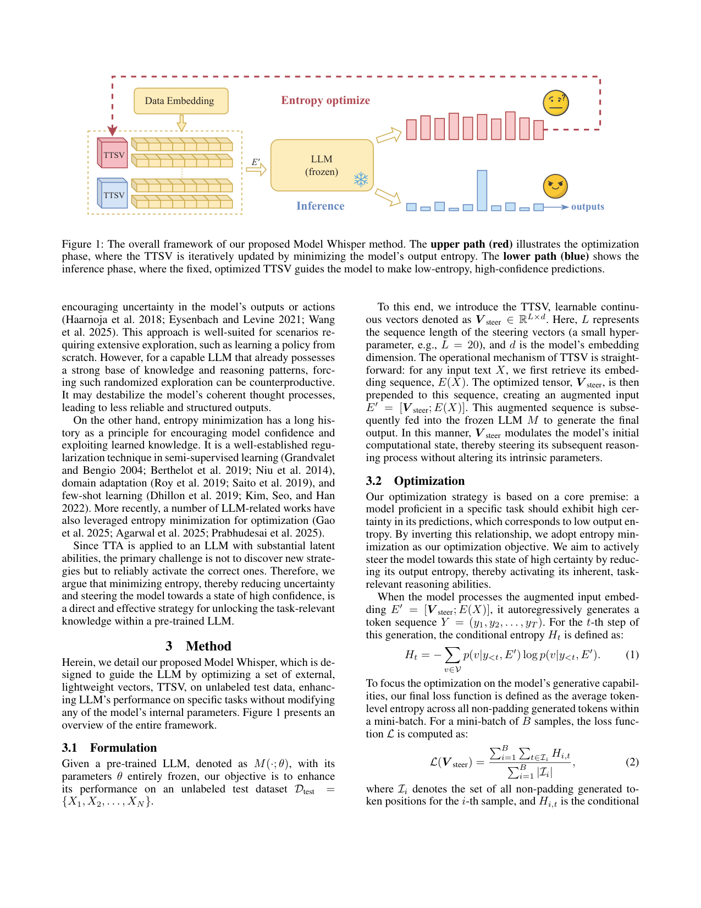
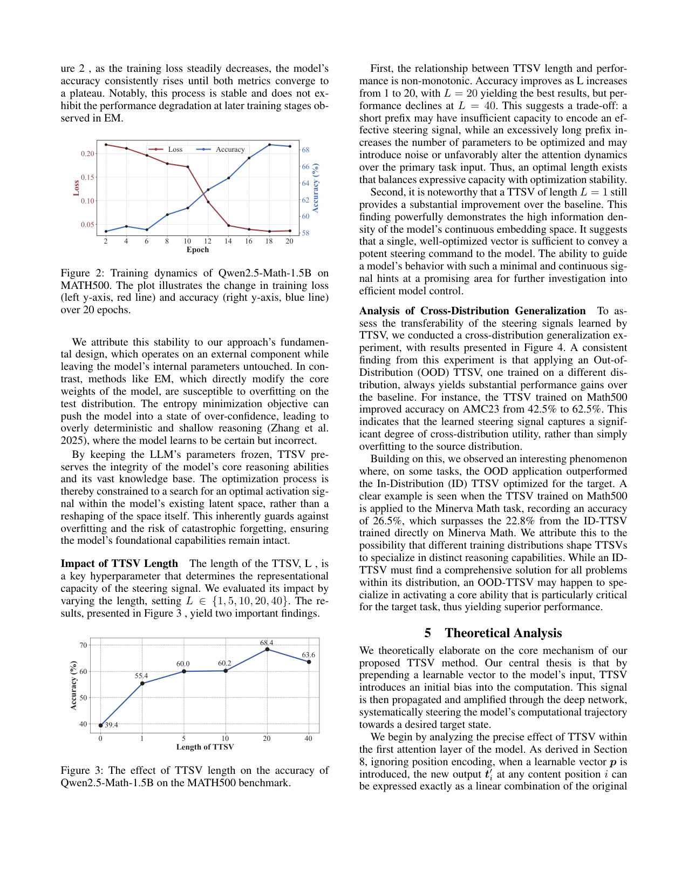

`model_whisper | Model Whisper: Steering Vectors Unlock Large Language Models' Potential in Test-time (TTSV) | 清华深圳国际研究生院 + 清华深圳研究院（Xinyue Kang, Diwei Shi, Li Chen[通讯]） | AAAI 2026〔待核：PDF 自身未标 venue；据同行论文 tf_ttcl 引用为 AAAI 2026, pp.31392–31400〕（arXiv:2512.04748v1, 2025-12-04） | 主题线 L?（test-time 适应 / steering 向量 / 推理增强）·相关性 High（单模型推理，非多步 agent）`

> 三标注：【原文】直述；【推断】有据判断（附依据）；【待核】拿不准的关键事实。

══ 第一层：一眼看懂 [light] ══

- 🟦 **TL;DR**：想让一个冻结的 LLM 在某个任务/新分布上发挥出它"本来就有但没用出来"的推理潜力，常见 test-time 做法（如 TTRL、熵最小 EM）要改全部参数，既贵又可能把预训练能力改坏。本文提出 **TTSV（Test-Time Steering Vectors）**：在输入 embedding 序列**最前面**拼接一小段可学习向量（如长度 L=20），**模型参数全程冻结**，只用"**最小化输出熵**"这一无标签目标，对这段向量做几步梯度更新。因为向量在最前面、会参与每一层 attention，所以能从**计算一开始**就引导整个多层推理过程（区别于只在最后一层调输出的 SLOT）。学好的向量"optimize-once, apply-to-all"地用于整个测试集，几乎不增推理延迟。【原文 Abstract/§1/§3】
- **最巧的一步**：**位置选择——把向量 prepend 到输入最前端**（而非加在最后隐层）。论文用理论推导证明：第一层 attention 里，每个内容位置的新输出 `t'_i = (1−α_i)t_i + α_i·b`（b=W_V·p 是向量决定的偏置方向，α_i 是该位置对向量的注意力权重），即在第一层注入一个线性引导信号，再被深层网络逐层放大（"bias amplification"，t-SNE 实测层越深偏移越大）。抽掉"前置"这一点（退化成 SLOT 的最后层调整），就只能做"输出滤波"而引导不了上游推理——这正是它强于 SLOT 的根因。【原文 §1/§5/§8/Table 2】
- 代码：**https://github.com/kkkkxy/TTSV**（摘要末直接给出）。【原文 Abstract】

══ 第二层：为什么做（写透） ══

- **研究背景**：LLM 蕴含大量世界知识与推理模式，但面对具体任务/新分布时这种潜力常"latent"、不会自动最优地调用，造成"潜力 vs 实际表现"的鸿沟。如何高效解锁、又不动核心参数，是关键挑战。【原文 §1】
- **解决的具体痛点**：依赖参数修改的 TTA（TTRL 全参数、EM 全参数）有两大问题——① 梯度/反传的算力开销大；② 灾难性遗忘风险（适配新域可能擦掉预训练通用能力）。参数高效的 SLOT 只在**最后隐层加一个向量**做输出级校准，影响的是最后一步，**上游多层推理仍无引导**，限制了效果。【原文 §1/§2.1】
- **相关工作 & 各自不足**：
  - **TTA（TENT 熵最小 / TTT 自监督）**：CV 起家，迁到 LLM 有 TTRL（多数投票伪标签 + 全参数 RL）、SLOT（对输入 prompt 做 next-token 优化、调最后隐层向量）；但都改参数或只调输出。【原文 §2.1】
  - **PEFT（Adapter/LoRA/Prompt-Tuning/Prefix-Tuning）**：是**训练阶段**注入新任务知识；Δ：TTSV 是**test-time 在无标签数据上激活已有能力**，目标相反（解锁已知 vs 注入新知）。【原文 §2.2】
  - **熵优化**：熵最大用于 RL 探索（但对已有强能力的 LLM 可能适得其反、破坏连贯推理）；熵最小用于半监督/域适应/few-shot 提信心。本文选熵最小，因为对 capable LLM 关键是"可靠激活正确策略"而非探索新策略。【原文 §2.3】
- **动机链**：LLM 有潜力调不出来 → 全参 TTA 贵且毁能力、SLOT 只调输出引导不了推理 → 需要"从计算源头引导整条推理链、又不动参数"的范式 → 所以在输入最前端 prepend 可学习向量、用熵最小驱动。为什么不用 prompt engineering？离散词表表达力受限，是"对模型喊话"；连续 embedding 空间信息密度高，可"耳语"更细粒度指令。【原文 §1】
- **与最近邻工作的 Δ**：最像 **SLOT**（同为参数高效、冻结核心参数、调一个小向量）。唯一关键差异=**干预点**：SLOT 在最后隐层做"后计算调整"（输出滤波），TTSV 在输入前端做"前计算引导"（导整条推理）。实验（Table 2）两个 Qwen2.5-Math 规模上 TTSV 均超 SLOT。【原文 §4.2/Table 2】

══ 第三层：怎么做 + 靠不靠谱 ══

- **方法流水线（§3）**：
  1. 冻结 LLM `M(·;θ)`；引入可学习向量 `V_steer ∈ R^{L×d}`（L≈20，d=embedding 维）；
  2. 对任意输入 X，取 embedding `E(X)`，前置拼接得 `E' = [V_steer; E(X)]`；
  3. **优化**：模型自回归生成 Y，对每个生成步算 token 级条件熵 `H_t`，loss = mini-batch 内所有非 padding 生成 token 的**平均熵**（式2）；只对 `V_steer` 反传，θ 冻结；
  4. **推理**：得到固定 `V*_steer`，对测试集**所有样本**前置同一向量再生成（"optimize-once, apply-to-all"）。延迟仅多处理 L 个向量，几乎可忽略。【原文 §3.1/3.2/3.3】
- **逐组件必要性 / 消融**：
  - **前置位置**：理论(§8)+ t-SNE(Fig 6, 层0/10/20/27 偏移递增) + 与 SLOT 对比(Table 2) 共同支撑"前置引导优于输出调整"。【原文 §5/§8/§4.2】
  - **向量长度 L**：消融(Fig 3)显示**非单调**——L 从 1→20 涨、L=40 降；L=20 最佳；但 **L=1 也已大幅超基线**（说明连续 embedding 信息密度极高）。【原文 §4.3】
  - **熵最小目标**：训练动态(Fig 2)显示 loss 降、acc 升并收敛到 plateau，且**不像 EM 那样后期退化**——作者归因于"只动外部向量、不改参数"避免了对测试分布过拟合/过自信。【原文 §4.3】
  - **初始化（附录 §7.1）**：Qwen 用 N(0,1) 随机初始化即可；Llama 更敏感，需用训练集 token embedding 的均值/方差做数据驱动初始化 + 更小 LR(5e-6)，否则熵会过早塌缩。【原文 §7.1/§7.3】
- **关键机制直觉**：在输入最前面塞一个向量，相当于给第一层 attention 输出注入一个"固定方向 b 的线性偏置"，这个小偏置经过深层非线性逐层放大，把模型的激活轨迹整体推到"任务专用、高置信"的区域（Fig 5 t-SNE：基线点被系统性推向任务专属簇）。熵最小则是"逼模型对自己的输出更确定"，从而激活而非重塑其已有能力。【原文 §5/§8】
- **实验与证据（§4）**：
  - 模型：Qwen2.5-Math（1.5B/7B）、LLaMA-3.1-8B-Instruct（base 类）+ **Qwen3-4B（thinking 模式，reasoning 增强类）**。【原文 §4.1】
  - 基准：MATH500、Minerva Math、OlympiadBench、AMC23、AIME24、GPQA-Diamond。【原文 §4.1】
  - 基线：**EM（全参数熵最小）** 与 **SLOT（参数高效、最后层向量、sample-specific）**。【原文 §4.1】
  - **支撑核心主张的关键数字**：
    - vs EM（Table 1）：Qwen2.5-Math-7B 上 TTSV 平均 +17.22（相对 +55.95%），**超过 EM 的 +14.08**；MATH500 51.00→74.40。
    - vs SLOT（Table 2）：Qwen2.5-Math-7B AIME24 +10.00（↑75%）、MATH500 +23.40（↑45.88%），均 > SLOT 的 +6.67/+1.20。
    - reasoning 模型（Table 3）：Qwen3-4B 平均 +5.62（↑14.62%），OlympiadBench 18.10→30.70（↑69.61%）——证明对已强的推理模型也有效。
    - 泛化（Fig 4 / §4.3）：MATH500 上学的 TTSV 迁到 **AMC23 42.5%→62.5%**（OOD 仍大涨）；甚至某些 OOD 应用**超过 ID**（如 MATH500→Minerva 26.5% > ID 22.8%），作者解释为不同分布塑造的向量擅长不同能力、可能命中目标任务的核心能力。【原文 §4.2/§4.3】
  - **公平性 / 留疑**：
    - 【原文】LLaMA-3.1-8B 上两法增益都很小（TTSV 平均仅 +0.42，MATH500 甚至 −1.20），说明**对非数学专精的通用 base 模型，熵最小式激活几乎无效**。这是个诚实但削弱普适性的结果。【原文 Table 1】
    - 【推断】主战场集中在 **Qwen2.5-Math** 系（已数学专精，"潜力待激活"假设最成立），故大增益有"挑了最契合的模型/任务"的成分。依据：Qwen-Math vs LLaMA 的巨大反差。
- **假设与失效边界**：
  - 【原文/推断】核心假设="模型已具备 task-relevant 能力，只需激活而非学习新能力"；对**缺乏该能力**的模型（如 LLaMA 在数学上）失效。依据：§2.3 论述 + Table 1 LLaMA 结果。
  - 【原文】需**白盒**（要对输入 embedding 求梯度），无法用于纯黑盒 API。【推断：方法定义即需 embedding 级梯度】
  - 【推断】熵最小有"自信地错"的风险——作者承认 EM 会过自信浅推理，TTSV 靠"冻结参数"缓解，但若任务本身模型方向错，最小熵只会更确定地错。依据：§4.3 对 EM 过自信的讨论 + Zhang 2025 "No Free Lunch" 引用。
- **祛魅总结**：
  - 真贡献（硬货）：① 一个极简、即插即用、**不动参数**的 test-time 推理增强原语（前置 steering 向量 + 熵最小）；② 干净的理论（第一层线性偏置 + 深层放大）解释为什么"前置"优于"末层"；③ 强 OOD 可迁移性这一有价值的经验发现（L=1 亦有效更显信息密度论点）。
  - 包装/可能高估：【推断】标题"Unlock LLMs' Potential"+ 数学上 +45~76% 的相对增益很抢眼，但 ① 几乎全靠 Qwen-Math 这类已专精模型，LLaMA 上近乎无效；② "relative gain" 放大了观感（如 AIME24 6.67→6.67 是 0%，却被平均掩盖）。当作"通用解锁"会高估。依据：Table 1/2 的逐项数字。
  - 与 agent 相关性：本文是**单模型、单轮推理**的 test-time 激活，**不涉及多步 agent / 环境交互 / 记忆**；在"自进化 agent"调研里属"参数高效 test-time 适应"这条支线的轻量代表，而非 agent 主线。【推断：全文无 agent/工具/环境设定】

══ 结构化抽取 ══

- 🎯 **机制速览 6 轴** [light]：
  | 学什么信号 | 改什么 | 何时改 | 免梯度? | 记忆-技能生命周期 | 防遗忘机制 |
  |---|---|---|---|---|---|
  | 模型自身输出的**熵**（无标签自监督，最小化输出不确定性）【原文 §3.2】 | **参数**（一小段前置 steering 向量 V_steer∈R^{L×d}，θ 冻结）—— logits/激活级的输入偏置【原文 §3.1】 | **离线批量 / test-time**：optimize-once（在测试分布上跑几十 epoch 学一次）→ apply-to-all（全测试集复用同一向量）；亦有 sample-specific 变体【原文 §3.3/Table 4】 | **否**（需对 embedding 求梯度、反传更新向量；只是不更新 θ）【原文 §3.2】 | 写入：学到 V*_steer；检索：全测试集统一前置（非按样本检索）；遗忘/淘汰：无显式淘汰（一次性向量）；共享：OOD 迁移=向量跨任务"共享/复用"（Fig4）【原文 §3.3/§4.3】 | **隔离式**：冻结全部参数、只动外部向量 → 天然防灾难性遗忘 + 防对测试分布过拟合（作者明确以此解释训练稳定性）【原文 §4.3】 |
- ⑦ **开源代码 + 框架/harness**：**已开源 https://github.com/kkkkxy/TTSV**【原文 Abstract】。框架：**无标准 RL/对齐框架**，自研轻量实现（AdamW 优化前置向量；A800 GPU；vLLM/HF 类生成，论文未点名具体推理库）。【原文 §4.1/§7】
- 💰 **资源/成本与可扩展性**：【原文】训练超参：L=20、20 epoch、AdamW、LR 1e-3→1e-5 线性衰减、batch 16；推理 batch 64、max gen 3072（Qwen3 AIME24 设到 20480）；全程 NVIDIA A800。推理延迟"几乎无影响"（仅多 L 个向量）。相对全参 EM 大幅省算力。【原文 §4.1/§7】
- 🎯 **对"探索-巩固"idea 对标** [light]：**可借组件 / 弱相关竞品**。它给出一个"**不动参数、从输入源头引导整条推理**"的极廉价控制原语——可作为 MTP/OPD"巩固"的对照基线：如果纯前置向量+熵最小就能逼出潜力，那参数级蒸馏/RL 的额外收益需被论证。其"第一层线性偏置→深层放大"的理论也可启发"在序列前端注入 foresight 信号"。但它无探索、无记忆、无 episode 概念，与"探索-巩固"循环关联弱。【推断：依据是方法为单轮静态向量、无交互/无经验累积】
- 🔭 **开放问题/未来方向**：
  - 【原文】熵最小之外的替代/组合目标函数；把 TTSV 这类外部引导与 RL 等训练法结合；扩展到多模态 MLLM。【原文 §6】
  - 【推断】对"缺乏目标能力"的模型如何避免"自信地错"（需可靠性/正确性约束而非纯熵）；sample-specific 与 optimize-once 的自适应切换。依据：LLaMA 失效 + §4.2 对两种适配策略的讨论。
- 🖼 **关键图 top-2** [light]：
  · 
    这是**原文 Figure 1**（渲染自 p2）。上路(红)=优化阶段：前置 TTSV 经冻结 LLM 生成，用输出熵最小迭代更新 TTSV；下路(蓝)=推理阶段：固定优化后的 TTSV 引导模型做低熵高置信预测。选它因为它一图说清"前置向量 + 熵最小 + 参数冻结 + optimize-once/apply-to-all"全部要素。
  · 
    这是**原文 Figure 2**（渲染自 p5，与正文密排同页）。展示 Qwen2.5-Math-1.5B 在 MATH500 上 20 个 epoch 内训练熵 loss 稳降、准确率同步上升并收敛到 plateau，**不出现 EM 那种后期性能退化**。选它因为它是支撑"冻结参数→稳定、不过拟合"这一核心卖点的关键经验证据。
