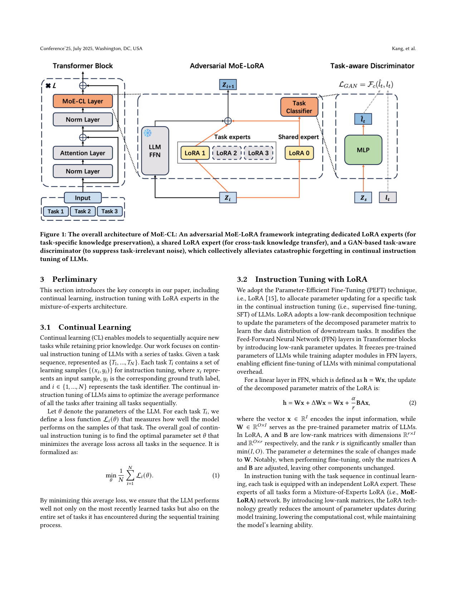
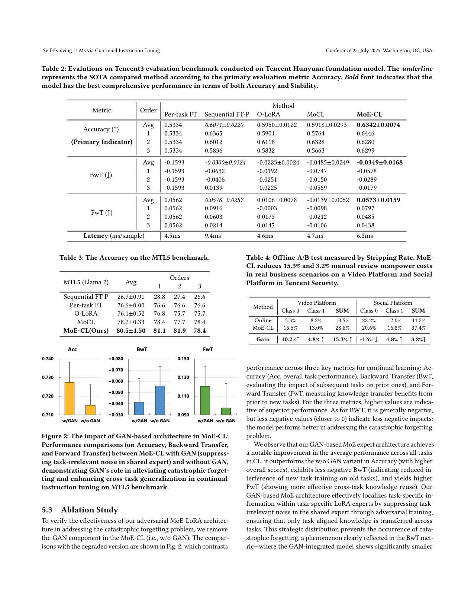

`moe_cl_selfevolve | MoE-CL: Self-Evolving LLMs via Continual Instruction Tuning | 北京邮电大学 BUPT (Jiazheng Kang, Le Huang;通讯 Ting Bai) + 腾讯 AI Lab (Cheng Hou, Zhe Zhao, ZhenXiang Yan) | 2025 arXiv:2509.18133v4(标注 15 Oct 2025)· 会议投稿(ACM 模板,Conference'25) | L?·"架构隔离(MoE-LoRA)+ 对抗训练防遗忘 / 工业级持续指令微调"主线·中-高相关`

> 三标注:【原文】=论文直述;【推断】=有据判断(附依据);【待核】=拿不准的关键事实。
> 注:9 页(无附录,正文+参考文献)。以下基于已下载真实 PDF 正文。arXiv id=2509.18133(2025-10),时间窗内。本文"self-evolution"是营销性命名(见祛魅),实质是**架构隔离 + 对抗训练的持续指令微调**。

══ 第一层:一眼看懂 ══

- 🟦 **TL;DR**:工业场景(如腾讯内容合规审核,日处理 20 万+ 文本)需要 LLM 持续学一串新任务而不忘旧任务(灾难性遗忘)。已有方法各有短板:回放(存旧数据/伪样本,有噪声+成本)、正则(约束更新→新任务学不专)、参数隔离(每任务独立参数→防忘但**任务间不能共享知识、迁移弱**)。本文 **MoE-CL** 是一个**对抗式的 Mixture-of-LoRA-Experts 双专家架构**:① **每个任务一个专属 LoRA 专家**(参数独立→训新任务不覆盖旧任务参数,保住旧知识);② **一个共享 LoRA 专家**(跨任务桥梁,学通用知识做迁移)。关键创新:在共享专家上挂一个 **GAN 的 task-aware 判别器(任务分类器)**——共享专家(生成器)要产生"让判别器认不出是哪个任务"的表示,**对抗训练**逼共享专家只保留**任务无关的通用知识、抑制任务相关噪声**(否则共享通道会把某任务的特异信息泄给别的任务、造成干扰)。推理时用门控网络 G 算权重 \(\beta_s/\beta_t\),把共享表示 \(z_s\) 与任务专属表示 \(z_t\) 线性组合。总损失 \(L = L_{SFT} - \alpha\cdot L_{GAN}\)(负号=对抗:让判别器分不出任务)。在公开 MTL5(Llama2)和工业 Tencent3(腾讯混元 Hunyuan)上 Avg.ACC 最高且方差小;真实 A/B 测试在腾讯视频平台把人工审核成本降了 15.3%(stripping rate 提升)。【原文 摘要+§4+§5】

- **最巧的一步**:**把 GAN 对抗判别器接到"共享专家"上做"任务无关化"**——抽掉 GAN(消融 w/o GAN,Fig 2),共享专家会把任务特异噪声也混进来,BwT(对旧任务的负影响)明显变差、Acc/FwT 都降。这是 MoE-CL 区别于普通"专属+共享专家"MoE 的根:**用对抗强制"共享通道只传通用知识、特异知识锁在专属专家里"**,从而同时拿到"防遗忘(专属隔离)"和"正向迁移(纯净共享)"。【原文 §4.2, §5.3, Fig 2】

══ 第二层:为什么做 ══

- **研究背景**:工业 AI 部署需要 LLM "self-evolution"——自主精炼知识整合、适应动态任务、保留旧能力而无需大量人工干预。内容合规等场景任务持续演化、领域语言模式各异,必须靠持续学习(CL)自主适应。但 CL 的核心障碍是灾难性遗忘:训新任务的参数更新会破坏/覆盖旧任务的神经表示。【原文 §1】

- **解决的具体痛点**:现有 CL 在"知识保持 vs 新任务适应"间有硬 trade-off——
  - **回放**(LAMOL 等):重用历史数据/伪样本,但**数据污染**(合成数据带噪声扭曲任务表示)+ 存储/计算成本大,**工业大规模不实用**。
  - **正则**(EWC/MAS/ARPER):约束更新保护重要权重,但**过度限制新任务专精**,适应性差。
  - **参数隔离/动态架构**(Progressive NN/TPEM/adapter):每任务专属参数防干扰,但**隔离设计阻断跨任务知识迁移**,无法利用共享语义、积累微调收益 → 多任务序列下可扩展性差。
  - **SOTA 是 MoCL**:每任务配专属 PEFT 模块,用"输入与任务向量相似度"当权重融合输出。但**在"任务特异性 vs 跨域泛化"间仍受限**(靠相似度融合,无主动的噪声抑制)。【原文 §1, §2.3】

- **相关工作 & 各自不足**:
  - *Self-Evolution of LLMs*:三类——自主学习机制(自生成监督/内部反馈/奖励信号)、动态架构适应(模块搜索/工作流生成/微调架构设计)、知识整合框架(记忆管理/工具演化)。**缺一个平衡"自主保持 vs 自适应迁移"的方案**。
  - *持续指令微调*:LAMOL(生成回放,有噪声)、ARPER(自适应正则,过约束)、TPEM(动态剪枝/扩展,隔离限迁移)、**MoCL(最近邻 SOTA,任务向量相似度融合)**。
  - *对抗 + MoE*:GAN 擅长分离"共享 vs 任务特异"特征(推荐系统去偏已验证);MoE 能动态组合专精与共享知识(传统 MTL 的 MMoE/PLE)。**但 MoE 用于 CL 防遗忘仍未充分探索**。
  - **与最近邻 MoCL 的 Δ**:MoCL 靠"任务向量相似度"被动融合专属模块;MoE-CL **多了一个共享专家 + GAN 主动把共享表示"任务无关化"**。为什么有用——主动抑制任务噪声让跨任务迁移更纯净,Table 2/3 显示 MoE-CL 在 Acc 与稳定性(跨任务序列顺序)上都超 MoCL,且 MoCL 的 FwT 甚至为负(−0.0139,迁移有害),MoE-CL FwT 为正(+0.0573)。【原文 §2.3-2.4, Table 2】

- **动机链**:工业 CL 要 self-evolve → 灾难性遗忘是障碍 → 回放贵+噪声、正则过约束、隔离断迁移 → 想要"既隔离防忘、又共享迁移" → 双专家(专属隔离 + 共享桥梁)→ 但共享通道会泄任务特异噪声 → 用 GAN 判别器对抗,逼共享专家只留通用知识 → 门控自适应组合 → 在工业数据上验证降本。为什么不用更简单:纯隔离(Per-task FT)无迁移;纯共享(Sequential FT-P)灾难遗忘(MTL5 上 Avg.ACC 仅 26.7%,最差);MoCL 无主动噪声抑制。【原文 §1, §2, §5.2】

══ 第三层:怎么做 + 靠不靠谱 ══

- **方法流水线(MoE-CL,对应 Figure 1,3 大组件)**:
  1. **双专家 LoRA(MoE-LoRA)**:在 Transformer FFN 层,对冻结的预训练权重 W 加 LoRA。每个任务 t 一个**专属 LoRA 专家** \(\theta_t\)(学任务特异知识,参数独立→不覆盖旧任务);一个**共享 LoRA 专家** \(\theta_s\)(跨所有任务,学通用知识)。对输入 \(z_i\):\(z_s = F_{LoRA}(z_i, \theta_s)\)、\(z_t = F_{LoRA}(z_i, \theta_t)\)(Eq.3-4)。**训新任务只更新当前任务专属 LoRA + 共享 LoRA,冻结其他任务的 LoRA**(Eq.省成本)。【原文 §4.1-4.2】
  2. **GAN task-aware 判别器(核心)**:把共享专家当**生成器**(输出 \(z_s\));**判别器**是个任务分类器,从 \(z_s\) 预测任务标签 \(\hat{l}_t = F(z_s, \varphi)\)(softmax,Eq.5);\(L_{GAN} = \) 交叉熵\((\hat{l}_t, l_t)\)(Eq.6)。**对抗**:总损失 \(L = L_{SFT} - \alpha\cdot L_{GAN}\)(Eq.10,\(\alpha\in(0,1]=0.1\))——**减号**意味着优化共享专家时要**最大化判别器的分类误差**(让它认不出任务),从而共享表示变得"任务无关、只含通用知识";理想情况判别器无法从 \(z_s\) 区分任务。【原文 §4.2.2 Eq.5-6, §4.3 Eq.10】
  3. **门控自适应组合**:门控网络 \(G(z_i)\) 输出权重 \(\beta_s, \beta_t\)(Eq.8);层输出 \(z_{i+1} = \beta_s\cdot z_s + \beta_t\cdot z_t\)(Eq.7),再过 MLP 得预测,\(L_{SFT} = \) 交叉熵\((\hat{y}_t, y_t)\)(Eq.9)。【原文 §4.3 Eq.7-9】

- **逐组件必要性(消融 Fig 2,MTL5,w/o GAN)**:
  - **去 GAN**:Acc 降、BwT 更负(对旧任务负影响更大)、FwT 更低 → 证明 **GAN 对抗的"共享专家任务无关化"是防遗忘 + 促迁移的关键**(把任务特异噪声从共享通道剔除,锁进专属专家)。✔核心组件有消融。
  - *专属专家 vs 共享专家、门控网络的单独消融*:**原文未单独给**(只消融 GAN)。专属/共享的必要性靠"与 Per-task FT(纯专属)/Sequential FT-P(纯共享)"的基线对比间接论证,非干净消融。【推断:依据=§5.3 仅做 w/o GAN】
  - *α(0.1)、LoRA rank(8)、门控设计的敏感性*:**未消融**(用 grid search 选定值,无扫描曲线)。【推断:依据=§5.1.4 只报最优值】

- **关键机制直觉**:把"知识"显式分两路存——**任务特异知识锁在专属 LoRA(物理隔离→不被新任务覆盖→防遗忘)**,**通用知识走共享 LoRA(跨任务复用→正向迁移)**。GAN 的作用是"净化共享通道":如果共享专家偷偷编码了某任务的特异信息,判别器就能从 z_s 认出任务;对抗训练让它认不出,等价于强制 z_s 只保留所有任务共有的、任务无关的特征。门控让模型按输入自适应决定"这次多用通用还是多用专属"。【原文 §4, §2.4】

- **实验与证据**:
  - 数据集 & 设置:**MTL5**(公开 far-domain,4 个文本分类任务:AGNews/Amazon/DBPedia/Yahoo,领域差异大→CL 难)+ **Tencent3**(真实工业,229,442 条内容合规审核样本,3 个业务场景的二分类)。骨干:MTL5 用 **Llama2**、Tencent3 用 **腾讯混元 Hunyuan**。**3 种任务顺序**各跑(测序列敏感性)。8×H20 GPU,PyTorch;grid search(lr 1e-4~1e-3、LoRA rank∈{2,4,8,16,32});最终 lr=2e-4、rank=8、α=0.1、H=4096。【原文 §5.1】
  - 指标:**Acc(主)、BwT(后向迁移,越接近 0/正越好=越不忘旧任务)、FwT(前向迁移,越大=旧→新知识复用越好)**。
  - Baseline:**Per-task FT**(每任务独立 PEFT,无迁移)、**Sequential FT-P**(共享 PEFT,顺序训,易遗忘)、**O-LoRA**(正交低秩子空间)、**MoCL**(SOTA,任务向量相似度融合)。
  - **关键发现①(MTL5,Table 3,Llama2)**:MoE-CL Avg.ACC **80.5%**(最高)> MoCL 78.2 > Per-task FT 76.6 > O-LoRA 76.1 >> Sequential FT-P 26.7(纯共享灾难遗忘)。
  - **关键发现②(Tencent3,Table 2,Hunyuan)**:MoE-CL Avg.ACC **0.6342**(最高,方差最小 ±0.0074)> Sequential FT-P 0.6071 > O-LoRA 0.5950 > MoCL 0.5918;FwT MoE-CL +0.0573(正,有效迁移)vs MoCL −0.0139(迁移有害);BwT 上 **O-LoRA 最好(−0.0223)**(正交隔离最防忘),MoE-CL −0.0349 次优但综合(Acc+稳定性)最佳。
  - **关键发现③(GAN 消融,Fig 2)**:有 GAN 在 Acc/BwT/FwT 三指标全面优于无 GAN。
  - **关键发现④(工业 A/B,Table 4)**:腾讯视频平台 stripping rate(高置信自动分类、免人工审核的比例)从 13.5%→28.8%,**降人工审核成本 15.3%**;社交平台 +3.2%。真实业务价值。
  - **baseline 公平性**:同骨干、grid search 调参、3 顺序平均、指标体系完整(Acc/BwT/FwT),工业 A/B 真实。较严谨。
  - **看着强但需警惕**:① **绝对增益看场景**——Tencent3(同质任务)上 MoE-CL Acc 0.6342 vs 第二名 0.6071 仅 +2.7pp,且 BwT 输给 O-LoRA;MTL5(异质)上优势大(+2.3pp over MoCL);② **延迟较高**(6.3ms/样本 vs O-LoRA 4.6ms,因双专家+门控+对抗结构复杂),作者承认架构复杂度;③ **"self-evolution"名不副实**——无任何自主信号生成/自我反思,纯监督持续微调 + 架构设计;④ **专家数随任务线性增长**(每任务一个专属 LoRA),长序列下存储/推理成本上升,论文只测到 3-4 任务。【原文 §5.2(5), Table 2-4, §6】

- **假设与失效边界**:
  - 【原文·Conclusion/Limitations】承认**架构复杂度**(双专家+GAN+门控),但称推理速度可比、收敛更易;未深入讨论复杂度对超大规模的影响。
  - 【推断·关键】**每任务一个专属 LoRA → 专家数随任务数线性增长**,长任务序列下参数/存储/推理开销线性上升;实验只到 3-4 任务,**百任务级可扩展性未验证**。依据=§4.1 每任务专属专家 + 实验仅 MTL5(4)/Tencent3(3)。
  - 【推断】**需要任务标识(task ID)**——专属专家按任务分配、判别器按任务标签训练;**任务边界清晰、ID 已知**是前提;task-free / 任务边界模糊场景不适用。依据=§3.1 任务序列含 task identifier i + §4.2 判别器用任务标签。
  - 【推断】**GAN 对抗训练本身不稳/难调**(α 平衡、判别器强度),论文用固定 α=0.1 且未给敏感性曲线,稳定性靠工程经验。依据=§5.1.4 固定 α、无扫描。
  - 【推断】任务高度同质时(Tencent3)共享专家增益有限、优势收窄(+2.7pp 且 BwT 输 O-LoRA);方法更适合**异质任务**。依据=§5.2(2) + Table 2。

- **祛魅总结**:
  - **真贡献(硬货)**:(a)**把 GAN 对抗判别器引入 MoE-LoRA 的共享专家做"任务无关化"**,是 MoE 用于 LLM 持续指令微调防遗忘的一个新颖、清晰的机制(共享净化 + 专属隔离);(b)**真实工业落地**(腾讯混元 + 视频/社交平台 A/B,降本 15.3%),工程可行性硬;(c)指标体系完整(Acc/BwT/FwT × 3 顺序)、对最近邻 MoCL/O-LoRA 有公平对照且 GAN 有消融;(d)显式分离"通用 vs 特异"知识的设计干净。
  - **包装/可能高估**:① **"Self-Evolving"是营销命名**——全文无自主信号生成/自反思/奖励驱动,实质是**架构隔离 + 对抗训练的有监督持续指令微调**,与"自进化"语义有显著距离(作者把"自主整合知识"宽泛地等同于 self-evolution);② **增益与场景强相关**(同质工业任务上优势仅 +2.7pp 且 BwT 不如 O-LoRA);③ **CCS Concepts 段残留模板占位符**("Do Not Use This Code → Generate the Correct Terms...")、DOI 为 XXXXXXX、会议名 Conference'25 占位——**投稿草稿痕迹明显,正式发表状态待核**。【推断:依据=§1 self-evolution 定义宽泛 + 首页 CCS/DOI 占位符 + Table 2 数值】
  - **可能低估/空白**:专属/共享/门控未单独消融;α/rank 无敏感性;长序列专家膨胀未测;GAN 训练稳定性未讨论。【推断】

══ 结构化抽取 ══

- 🎯 **机制速览 6 轴**:

| 学什么信号 | 改什么 | 何时改 | 免梯度? | 记忆-技能生命周期 | 防遗忘机制 |
|---|---|---|---|---|---|
| **监督标签信号 + 对抗信号**——L_SFT(任务标签交叉熵)+ L_GAN(任务判别器交叉熵,共享专家对抗最大化判别误差);**无环境 reward/自反思/经验库**,纯有监督 + GAN | **backbone 参数中的 LoRA 专家(参数高效)**——每任务专属 LoRA \(\theta_t\) + 共享 LoRA \(\theta_s\) + 判别器 φ + 门控 G;**冻结预训练权重 W 与其他任务的 LoRA**;不改 logits 计算方式、不改 prompt/记忆 | **离线/序列批量训练**(持续指令微调:任务一个个来,每任务训其专属 LoRA + 共享 LoRA;**非在线 per-step**);推理时门控自适应组合,参数冻结 | **否(核心是梯度训练)**——LoRA + 判别器 + 门控均梯度训练,含 GAN 对抗反传 | "知识"分两路存:**任务特异→专属 LoRA(隔离保留,不淘汰)**;**通用→共享 LoRA(GAN 净化)**;门控按输入检索式组合两路;无外部记忆库/无显式遗忘淘汰(旧任务专属 LoRA 永久保留)；无跨 agent 共享 | **架构隔离 + 对抗正则(参数隔离族)**:① **每任务专属 LoRA 物理隔离**(训新任务不覆盖旧任务参数→直接防遗忘,对应 BwT);② **GAN 对抗把共享专家"任务无关化"**(抑制任务噪声→共享通道只传通用知识→促正向迁移、减干扰)。**无回放/无 KL 投影/无 merging/无几何共识**;是"专家隔离 + 对抗净化共享" |

- ⑦ **开源代码 + 框架/harness**:**已开源** https://github.com/BAI-LAB/MoE-CL(摘要明确:"Implementation code is publicly available at...")〔本次未 `git ls-remote`/clone 核验,完整度待核〕。框架:**PyTorch**,8×H20;PEFT = **LoRA**(自实现 MoE-LoRA 双专家 + GAN 判别器 + 门控)。**不使用 veRL/TRL/OpenRLHF 等 RLHF 框架**(无 RL;GAN 是对抗判别器,非策略梯度 RLHF)。【原文 摘要, §5.1.4】

- 💰 **资源/成本与可扩展性**:训练 8×H20 GPU;LoRA rank=8(参数高效)。**推理延迟 6.3ms/样本**(300 token,vs O-LoRA 4.6ms / Per-task FT 4.5ms / Sequential FT-P 9.4ms)——略高但"人不可感知、工业可接受"。可扩展性隐患:**专属专家数随任务线性增长**(每任务一个 LoRA + 永久保留),长序列下参数/存储/推理线性膨胀;GAN 对抗训练增加训练复杂度。工业价值:A/B 降人工审核成本 15.3%。【原文 §5.2(5), Table 2, §6】

- 🎯 **对"探索-巩固"idea 对标**:**可借组件(对抗净化/专家隔离) + 部分支撑;但与项目主线关联较弱**。
  - *可借组件 1(中价值)*:**GAN 对抗判别器做"任务无关化/共享净化"** —— 若 TSRD 想把"多条任务/轨迹的通用 path-selection 策略"提炼成共享能力、同时把任务特异恢复策略隔离,可借鉴"用对抗判别器逼共享通道只留通用信号"的思路,避免共享巩固时混入任务噪声(一种"巩固时的去噪正则")。
  - *可借组件 2*:**专属 LoRA 隔离 + 门控自适应组合** —— "通用能力走共享、特异能力走专属、门控按输入混合"的结构,对"MTP foresight 通用探针 + 任务特异 recovery 模块"的组织方式有借鉴。
  - *支撑面(弱)*:它佐证"架构隔离能直接防遗忘(BwT)、共享通道能促迁移(FwT)"这一 CL 常识,与 agent_dice/GCWM/cnl_gradsim 同属"防遗忘机制"全景,但 MoE-CL 走的是**架构隔离 + 对抗**路线(对比 merging/几何/逐参数符号),为全景补一个"对抗式架构隔离"样本。
  - *竞品/区别*:与 mtp_opd 主线**关联弱**——它是**有监督持续指令微调 + 架构隔离**,**无 on-policy 蒸馏、无 MTP 前瞻、无自主探索信号**,"self-evolution"仅是命名;且需 task ID、专家随任务膨胀。对"把探索策略在线蒸馏进参数"这条主线,它几乎不相关(它是离线、任务边界清晰、纯监督)。
  - *缺口*:无在线/自主成分;专家膨胀;依赖任务边界——与"持续自进化 agent"的真实诉求(task-free、自主、在线)有距离。【推断:依据=方法依赖 task ID + 纯监督 + 项目 project_core_idea】

- 🔭 **开放问题/未来方向**:
  - 【原文·Conclusion】优化架构复杂度、提升可扩展性以支撑持续 self-evolution;拓宽适用性。
  - 【推断】① 控制专属专家随任务膨胀(专家合并/共享更多);② task-free / 任务边界模糊场景;③ GAN 对抗训练稳定性与 α 自适应;④ 引入真正的自主信号(自反思/奖励)以名副其实地 self-evolve;⑤ 扩到生成式任务(当前主要是分类)与更长任务序列。依据=方法局限 + self-evolution 命名落差。

- 🖼 **关键图 top-2**:

  
  这是**原文 Figure 1**(方法主图):左"Transformer Block"展示 MoE-CL Layer 嵌入位置;中"**Adversarial MoE-LoRA**"展示一组 **Task experts(专属 LoRA,Task1/2/.../t 各一)** + 一个 **Shared expert(共享 LoRA)**,经门控组合;右"**Task-aware Discriminator**"展示共享表示 z_s 被送入判别器预测任务标签、与真值算 L_GAN 做对抗。选它因为一图说清"专属隔离 + 共享桥梁 + GAN 净化"三件核心事,是理解 MoE-CL 的钥匙。

  
  这是**原文第 7 页**(核心证据集中页):**Figure 2** GAN 消融——MoE-CL(有 GAN)在 Acc、BwT(更接近 0)、FwT 三指标全面优于 w/o GAN,直接证明对抗净化的作用;同页 **Table 2**(Tencent3:MoE-CL Acc 0.6342 最高、FwT +0.0573 vs MoCL −0.0139)、**Table 3**(MTL5:MoE-CL 80.5% > MoCL 78.2%)、**Table 4**(工业 A/B:视频平台降本 15.3%)。选它因为它同时支撑"GAN 必要""综合最优(Acc+稳定性)""真实工业降本"三个核心主张,是全文最密集的定量依据。

──────────
**幂等状态**:本文 analysis 首次产出。机制类型 = **架构隔离(每任务专属 LoRA)+ 对抗训练(GAN 判别器净化共享 LoRA)的持续指令微调**——专属专家物理隔离防遗忘(BwT)、共享专家经对抗"任务无关化"促迁移(FwT)、门控自适应组合;有监督 + GAN,梯度训练(非免梯度)。属"参数隔离 + 对抗正则"防遗忘家族,与 agent_dice/GCWM(merging)、cnl_gradsim(逐参数符号)路线不同。**"self-evolution"为营销命名,无自主信号**;首页 CCS/DOI 残留模板占位符,正式发表状态待核。抽到 2 图:是(Figure 1 架构 + 第 7 页 Fig2 消融/Table2-4 证据页)。代码 https://github.com/BAI-LAB/MoE-CL(未 clone 核验,完整度待核)。
