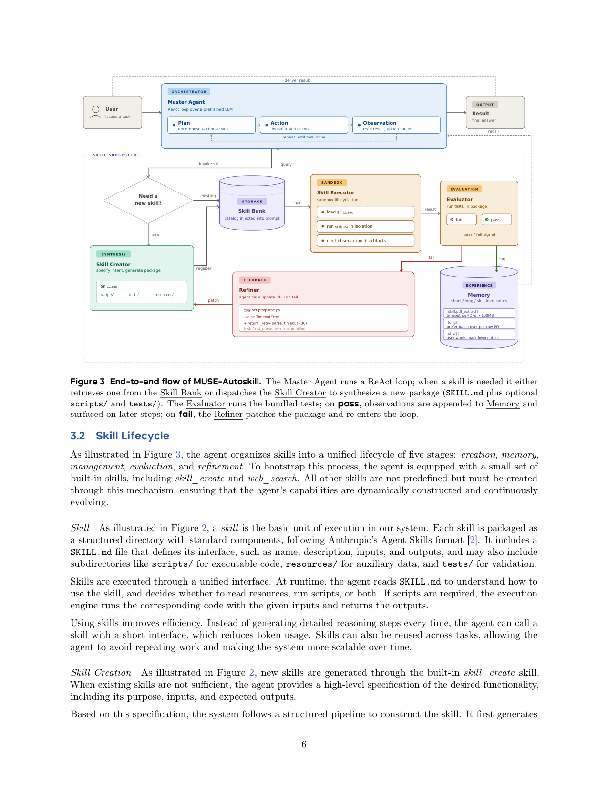
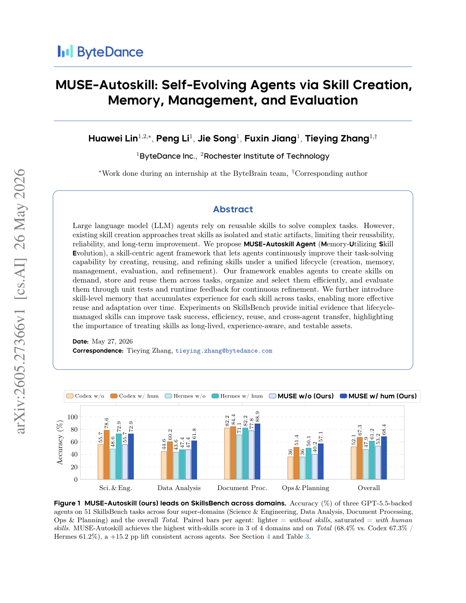

`muse_autoskill | MUSE-Autoskill: Self-Evolving Agents via Skill Creation, Memory, Management, and Evaluation | 字节跳动 ByteBrain(Huawei Lin 实习@ByteBrain/RIT, Peng Li, Jie Song, Fuxin Jiang, Tieying Zhang 通讯) | 2026-05(arXiv v1 2026-05-26)·Preprint·v1 | 主题线 L3(技能全生命周期/技能自进化)·相关性 High`

> 一句定位:把"技能"从一次性生成的死 artifact,升级成贯穿**五阶段统一生命周期(创建 Creation → 记忆 Memory → 管理 Management → 评测 Evaluation → 精炼 Refinement)的长寿、可测、可迁移资产**;关键三件套——① 在 ReAct loop 内嵌 `skill_create` 工具(创建即对齐运行时上下文,消除"创建-使用错配");② **per-skill 的"技能级记忆"(每个技能一份 `.memory.md`)** 跨任务累积该技能的经验/坑/用法(本文最独特);③ **单测驱动评测**:新技能必须跑通自带 `tests/` 才入库,失败自动触发 `update_skill` 打补丁重测。**全程训练-free**,在 SkillsBench(51 任务,Docker 自动评分)上,同用 GPT-5.5 的三 agent 中 MUSE 带技能最高(68.40%,+15.21pp);更关键——它**从自己成功轨迹蒸馏的技能**在能生成的 35 任务上达 **87.94%(超人类技能天花板)**,且把这些技能**原样注入另一个 agent(Hermes)仍 +10.51pp、补上 79% 差距**,证明产出的是"外化知识资产"而非绑定自身的行为。

---

## ══ 第一层:一眼看懂 ══

- 🟦 **TL;DR**:现状痛点——现有自动造技能的方法(Voyager/AutoSkill/EvoSkill/SkillGen/Skill1/SkillOS)只覆盖技能生命周期的一部分,留下四个实操缺口:(i) **创建-使用错配**(造技能时拿不到 agent 的运行时上下文)、(ii) **没有结构化的 per-skill 记忆**(无法跨任务为单个技能累积自由经验)、(iii) **静态、未验证的技能**(无单测驱动的评测/精炼)、(iv) **上下文处理差**(扁平对话历史在长程任务上溢出/截断)。MUSE 把这四点一次性补齐:Master Agent 跑 ReAct(Plan/Action/Observation)loop;需要技能时→先查 Skill Bank,没有就调 `skill_create` 合成一个**完整技能包**(`SKILL.md` 接口 + 可选 `scripts/` 代码 + `tests/` 单测 + `resources/`)→**Evaluator 在沙箱跑 tests/,全过才注册入库**,不过则 Refiner 看错误 trace 调 `update_skill` 打补丁重测(create→evaluate→register 闭环);执行在隔离沙箱(每技能一个容器);跑完把观察写进**三级记忆**(短期=当前任务上下文、长期=跨会话结论、**技能级=每技能 `.memory.md`**);管理层做 retrieval/merge/prune;还配一个 **DAG 式上下文管理器 + 两级自适应压缩**(L1 单节点摘要、L2 跨节点合并,首尾各 KEEP 若干 turn 钉住)防长程爆窗。

- **最巧的一步**:**"create→evaluate(单测)→register 这道门 + 失败自动 refine"**。抽掉它,技能就退回 AutoSkill/Voyager 那种"生成即用、不验证"的静态 artifact——可靠性无保证。**为什么是它**:① 单测把"技能可靠"变成**系统级可强制的属性**(by construction)而非作者自觉(Fig.6:MUSE 是唯一 ship `tests/` 的;人类技能 0% 带 tests);② 失败自动打补丁让技能"边用边修";③ 正是这道门让"自动生成的技能能超人类技能"(87.94% > 68.40%)成立——因为它从**真实跑通的成功轨迹**蒸馏并验证。次巧=**技能级记忆**(每技能独立 `.memory.md`),但消融上单测门是更不可抽掉的承重墙。⚠️【推断】"最巧"是逻辑+anatomy 证据,本文**无逐组件消融表**(见第三层),故此判断部分靠论证。

---

## ══ 第二层:为什么做 ══

- **研究背景**:LLM agent 越来越多解决跨工具/数据/代码、多步、跨域的真实问题;纯模型推理不够,需要**可复用的能力单元=技能**(封装过程/可执行代码/领域指令,可组合)。技能正成为可扩展 agent 的自然抽象,因为它**把能力从单体模型权重里解耦出来**,支持模块化执行 + 结构化领域知识累积。核心 open question:**怎么让 agent 自主获取/组织/精炼技能而不靠人每步手写?**
- **解决的具体痛点**(§1,四缺口,见上 TL;DR):创建-使用错配 / 无 per-skill 记忆 / 静态未验证 / 长上下文处理差。
- **相关工作 & 各自不足**(§2 + Table 1,按"覆盖哪些生命周期阶段"和"是否需训练"两轴组织):
  - **训练-free 一族**:Voyager(Minecraft 可执行代码库 + 自验证,但无 memory)、AutoSkill(对话轨迹抽技能的 plugin,memory/management 仅 partial、无 evaluation)、EvoSkill(分析失败提新技能、Pareto 选,无 memory)、SkillGen(对比成败迭代精炼、把技能当干预验净效应,无 memory/management)、Anthropic Skills(标准化 SKILL.md 文件夹 + progressive disclosure,但 evaluation/refinement 留给人)。**共性短板:各只覆盖部分生命周期,没有一个同时支持"结构化 per-skill 记忆 + 单测驱动评测 + 测试失败自动精炼"。**
  - **训练-based(RL)一族**:SkillMaster(单策略既行动又编辑技能库,编辑按反事实下游效用 credit)、Skill1(把技能演进当统一 RL 问题,共优选择/使用/蒸馏)、SkillOS(冻结 executor + 可训 curator 更新外部库,curator 跨 executor 泛化)、Youtu-Agent(工具+配置的混合策略优化)。**共性短板:技能行为耦合到训练好的策略/curator,换 backbone 要重训,一个策略产的技能不能直接给别的 agent 用。**
  - **Benchmark**:SkillsBench(端到端带/不带技能的任务准确率,本文采用)、SkillRet(隔离 management 阶段,~18000 社区技能的检索)、SkillLearnBench/LifelongAgentBench(持续/终身技能获取,且报告"单一强方法不一致占优"→ 呼唤系统级设计如本文)。
- **动机链**:技能是可扩展 agent 的自然抽象 → 但现有法只覆盖部分生命周期、留四缺口 → 应把技能当**长寿、可测、可迁移的基础设施** → 故提出统一五阶段生命周期 + 全部 training-free 实现 → 才能跨 LLM/agent 架构可移植。为什么不用更简单法?Anthropic Skills 最接近但把评测/精炼丢给人;RL 法强但绑策略、换 backbone 重训、不可跨 agent 迁移。
- **与最近邻的 Δ**(Table 1 自评):MUSE 是表里**唯一五阶段全 ✓ + Cross-agent ✓(真做了跨 agent 迁移实验)+ Training-free ✓** 的;尤其相对 ① **Anthropic Skills**(最近的外化技能格式同源)——MUSE 补上"自动评测 + 自动精炼";② **SkillOS**(也覆盖大部分生命周期且 training-free 列 ✗——它要训 curator)——MUSE **不训练任何东西**,且**迁移单元是技能本身而非 curator**(SkillOS 迁的是 curator,正交互补)。关键差异=**"全生命周期 + 训练-free + 技能级记忆 + 单测门 + 真·跨 agent 迁移实证"** 的组合。

---

## ══ 第三层:怎么做 + 靠不靠谱 ══

- **方法流水线**(§3,Fig.2/Fig.3):
  1. **Agent loop**:Master Agent 跑 ReAct(Planning 分解+选技能 / Action 调技能或工具 / Observation 读结果更新信念),循环到完成。只内置极少技能(`skill_create`、`web_search`),其余全靠生命周期动态创建。
  2. **技能=结构化目录包**(遵循 Anthropic Agent Skills 格式):`SKILL.md`(name/description/inputs/outputs 接口)+ `scripts/`(可执行代码)+ `resources/`(辅助数据)+ `tests/`(验证)。运行时读 SKILL.md 决定读 resources/跑 scripts/两者都做。
  3. **Creation**:现有技能不够时,agent 给高层 spec(目的/输入/期望输出)→ 系统结构化生成 SKILL.md→规划内部结构→生成文件→**Evaluation 门控**:沙箱跑 `tests/`,全过才注册;不过则查错误 trace 调 `update_skill` 打补丁重测(create→evaluate→register loop)。
  4. **Evaluation**:主要靠 `tests/` 单测(预定义输入比对期望输出),过滤错误/不稳定技能,失败触发更新/重生(self-evolution loop)。
  5. **Execution**:在 ReAct loop 内用内置工具执行;沙箱生命周期工具(create_sandbox / sandbox_run / sandbox_upload-download / close_sandbox),**每次调用一个隔离进程/容器**(失败/副作用/资源按调用隔离);复用 agent 通用工具而非另起执行引擎。
  6. **Memory(三级)**:**短期**=当前任务上下文(超长则自适应压缩);**长期**=跨会话持久笔记(可复用结论/环境怪癖/通用教训,**不压缩**);**技能级**(独特)=每技能一份 `.memory.md`,append 该技能的失败模式/输入格式坑/性能注意,**下次加载该技能时连同 SKILL.md 一起 surface**,免重新推导。
  7. **Management**:每技能按 SKILL.md 元数据(name/desc/inputs/outputs)索引;任务开始把技能目录注入 system prompt(progressive disclosure);三机制维护——**refinement**(失败/输出错则改/重生)、**merging**(新技能与旧重叠则合并成更通用的)、**pruning**(长期失败/不用则剪除)。
  8. **Context Management(§3.4,Fig.4)**:对话历史存成 **DAG**(每 turn 一节点,记 response/tool calls/observation/token);每节点有 mutable `parent_id`(当前发给 LLM 的活动链)+ immutable `history_prev/next`(完整原始历史)。超预算时**两级压缩**:L1=单节点(超阈值的大输出)就地摘要替换(破坏性小,保留 turn 边界);L1 不够才 L2=合并一段连续中间节点为一个合成节点;**首 KEEP_FIRST + 尾 KEEP_LAST 永远钉住**(锚定系统/早期规划 + 最近状态);原节点留在完整历史 → 活动链永远可恢复、可跨会话续跑(每会话存快照)。

- **逐组件必要性**:⚠️【推断·重要祛魅】**本文没有传统的"逐组件消融表"**(没有 w/o skill-level-memory、w/o evaluation-gate、w/o context-compression 各掉多少分的对照)。证据形态是:① **整体效果对照**(带技能 vs 不带技能,Table 2/4);② **anatomy 对照**(Fig.6:MUSE 技能 vs 人类技能的结构差异——MUSE 中位 326 行 vs 人类 146 行、唯一 ship tests/);③ **成本-质量 Pareto**(Fig.5/7);④ **case study**(4 个技能含 1 个回归)。所以"技能级记忆""单测门""两级压缩"各自的边际贡献**未被单独量化消融**,其必要性靠设计论证 + 整体/anatomy 证据支撑。须明确标出。

- **关键机制直觉**:把 agent 的能力库当成一个**带自测的开源软件仓库**——需要新功能就写一个带单测的小包(`skill_create`),CI(Evaluator)不过不许合入,挂了自动发 patch(Refiner);每个包还附一个"踩坑日志"(技能级 `.memory.md`)下次自动带出来;主程序(ReAct)调包而非每次重写逻辑,所以更快更省 turn。上下文管理像 git——活动分支(发给 LLM 的链)可裁剪压缩,但完整历史(immutable 指针)永远在,随时回放。

- **实验与证据**(§4,**评测异常扎实诚实**):
  - **数据集/设置**:**SkillsBench**(选 51/94 任务,4 超域:Sci&Eng 14、Data Analysis 15、Doc Proc 9、Ops&Planning 13;每任务 Docker 隔离 + 自动 verifier 只看最终输出文件给 [0,1] reward;选的是所有 agent 都无环境故障的任务以便公平横比)。**三 agent 全用 GPT-5.5 backbone**:MUSE / Codex / Hermes——**同模型 → 性能差异只反映 agent 系统设计**(工具策略/上下文管理/规划/技能用法),控变量干净。每 agent-任务-配置跑 5 次取均值,再对 51 任务 macro 平均;无输出记 0,环境故障排除。
  - **支撑核心主张的关键实验 + 数字**:
    ① **技能机制有效 + MUSE 最会用技能**(Table 2):带人类技能三 agent 都涨 13–15pp;MUSE 带技能 **68.40%**(Codex 67.28、Hermes 61.21),带/不带都最高 → MUSE 在 reasoning loop 里**读懂/解释/应用技能内容**的能力更强。
    ② **自动生成技能超人类天花板**(Table 4):两阶段协议——P1 不带技能解题(取成功轨迹)→ `skill_create` 蒸馏→P2 注回重测。51 任务整体 **60.35%**(+7.16pp vs 53.19% baseline);但**在能生成技能的 35 任务上 P2 达 87.94% > 人类技能 68.40%**。整体只 60.35% 是因为 16 个 P1 全败的任务记 0 进分母——**瓶颈是覆盖率(能不能不靠技能先解出来),不是技能质量**(作者明确点出)。
    ③ **跨 agent 迁移**(Table 5):把 MUSE 生成的技能**原样**注入 Hermes,47.89%→**58.40%(+10.51pp)**,补上 79% 的"到人类技能"差距;且 Hermes(58.40)逼近 MUSE(60.35)仅差 1.95pp → **技能内容不绑 MUSE 自身行为,是真·可迁移知识资产**。
    ④ **成本-质量 Pareto**(Table 6 + Fig.5/7):生成技能一次性 ~383K tokens/164s(约 2/3 个无技能 run);**用生成技能反而更便宜**——MUSE 615K→493K tokens(−20%)、656→411s(−37%);Hermes 186K→97K(−48%)。生成成本 ≈3 次复用回本,延迟收益首次复用就超生成成本。Fig.5 显示"带生成技能"是唯一 **Pareto 最优**点(更高 reward + 更低延迟 + 更少 token)。诚实:MUSE 技能比人类长 2.2×(Fig.6 中位 326 vs 146 行),但**多出的是过程细节不是冗余**,用更紧的过程替掉更长的噪声推理 → 反而更少 turn。
  - **诚实的负面/边界**:① **Sci&Eng 域 MUSE 带技能落后 Codex 5.7pp**(3 个 boundary 任务 verifier 罚了 spec 没钉死的方法学选择);② **回归案例 hvac-control 80%→20%**(源轨迹用了对该模拟器噪声特定的标定/增益估计,换 run 时方差使增益偶尔出稳定裕度——**技能编码了"碰巧成功一次但不如试错鲁棒"的过程**);③ **技能质量审计**:人工查 35 个生成技能**无 benchmark 泄漏**(不硬编 verifier 输出/不按 task id 分支/不读 GT 文件),但**部分技能含源轨迹特定假设**(固定文件名/路径/数值范围)限制 OOD 泛化。
  - **baseline 公平性**:三 agent 同 GPT-5.5、同任务、同 5-run 协议、人类技能由 SkillsBench 设计者写并统一注入 → **非常公平**;且对自己的弱项(Sci&Eng 落后、回归、源轨迹假设)主动披露 → 可信度高。
  - **"看着强但没答核心问题"风险**【推断】:头条 "+15.21pp" 其实是**人类技能**的提升;**自生成技能整体只 +7.16pp**(被覆盖率拖累),"超人类 87.94%" 是**子集(35/51)**结论——三个数字层次需分清,作者表述清楚但易被二手引用混淆。另外**无逐组件消融**,无法判断技能级记忆/两级压缩各值多少。

- **假设与失效边界**:
  - 【原文·Limitations】① 只评 51/94 任务(排除的 Docker 更复杂、可能更难 → 报告数可能**高估**全系统性能);② 技能生成只在 **68.6%(35/51)** 任务成功,且每技能仅从**单条源轨迹**蒸馏(未必最通用解);③ 跨 agent 迁移**只验了 MUSE→Hermes 一个方向**;④ 5-run 下单任务置信区间宽(尤其二值 reward)。
  - 【原文·Analysis】部分生成技能含源轨迹特定假设(固定路径/数值范围)→ OOD 泛化受限;hvac 回归即此类。
  - 【推断】重度依赖**强 backbone(GPT-5.5)**——它要能"读懂并应用"长技能文档、写出能跑通单测的代码;弱模型可能既写不出过单测的技能、也用不好长技能。依据:全实验仅 GPT-5.5,且 MUSE 优势归因于"更会读用技能"。
  - 【推断】**瓶颈在 P1 覆盖率**(不靠技能先解出来的能力)——对 agent 本身解不出的难任务,该框架无能为力(无技能可蒸)。作者也建议未来从**部分/失败轨迹抽诊断技能**。依据:§4.6 bottleneck analysis。

- **祛魅总结**:
  - 真贡献(硬货):① **把技能生命周期五阶段系统化 + 全 training-free 一体实现**,且 Table 1 清楚定位为唯一"全覆盖 + 跨 agent + 免训练"者——这是踏实的系统综合贡献;② **技能级记忆(per-skill `.memory.md`)** 是相对所有先前工作的真新增量;③ **单测驱动评测门 + 失败自动精炼**把"技能可靠"变成系统级可强制属性(Fig.6 证明 MUSE 是唯一 ship tests 的),并由此撑起"自生成技能超人类天花板";④ **真·跨 agent 迁移实证(MUSE→Hermes +10.51pp、内容不绑自身)**——这是多数 portability 声称都没做的硬实验;⑤ **极其诚实的成本/审计/回归分析**(Pareto、泄漏审计、回归 case),可信度远超平均水平。
  - 包装/营销成分【推断】:(a) "self-evolving" 下**不训练任何模型**(纯 prompt + 沙箱 + 文本技能 CRUD),"evolution" 指技能库的迭代而非模型演进;(b) 头条 +15.21pp 是**人类技能**收益,**自生成整体 +7.16pp**、超人类是**35 任务子集**——三层数字易被混引放大;(c) §5 "已在 SkillMarket/ArkClaw/SkillHub 生产部署"是**叙事性宣称、无开源/无第三方可验**;(d) **无逐组件消融**,"技能级记忆"等卖点的独立贡献未量化。**定位:工程扎实、评测诚实的"全生命周期技能 agent 系统"论文(system + 实证),其跨 agent 迁移与成本分析是真亮点,但'方法各部件的因果贡献'与'开源'两块缺位。**

---

## ══ 结构化抽取 ══

- 🎯 **机制速览 6 轴**:

| 学什么信号 | 改什么 | 何时改 | 免梯度? | 记忆-技能生命周期 | 防遗忘机制 |
|---|---|---|---|---|---|
| **单元测试 pass/fail + 运行时执行反馈**(主信号,触发 refine);**任务成功轨迹**(蒸馏成技能);自由经验笔记(写进三级记忆);**无 RL reward 回传、无人工标注、无环境标量 reward 训练**(verifier 只用于评测不回传梯度) | **改技能库(SKILL.md/scripts/tests 文本+代码)+ 三级记忆(短/长/技能级 .memory.md)+ 活动上下文链**;**backbone(GPT-5.5)参数完全不改**(训练-free) | **在线 per-step/per-task**:ReAct loop 内按需创建技能;创建即评测即精炼(失败立即 patch);记忆 per-step 累积;上下文压缩按预算触发;**跨会话快照续跑**。无离线批量训练 | **是(全免梯度)**——prompt 驱动 + 沙箱执行 + 单测 + 文本/代码 CRUD;无任何参数优化 | 写入=`skill_create` 合成包→**单测门控注册**;检索=按 SKILL.md 元数据,目录注入 prompt(progressive disclosure);**精炼**=失败自动 `update_skill` 打补丁;**合并**=重叠技能 merge 成更通用;**遗忘/淘汰**=长期失败/不用的技能 **prune**;**共享**=技能=可读文档+脚本,**跨 agent 原样迁移**(MUSE→Hermes 实证);技能级记忆随技能一起 surface | **单测门 + prune + 隔离 + 上下文 DAG 不丢史**:单测拒不可靠技能入库(防错误知识累积);长期失败技能剪除;长期记忆/技能库**不压缩**单独存(跨会话不丢经验);上下文压缩只动活动链、完整历史 immutable 可恢复;backbone 冻结天然不遗忘。**无几何共识/merging-into-weights/KL**(不碰参数) |

- ⑦ **开源代码 + 框架/harness**:**未开源 / 未找到公开代码**(已 WebSearch 交叉验证:arXiv/HuggingFace papers/alphaXiv 页面均在,但**无官方 GitHub/HF 代码仓**;搜到的 `Samurai412/autoskill` 是无关个人仓,非本文官方实现)。论文正文唯一 GitHub 链接是引用 Anthropic Skills(`github.com/anthropics/skills`),**非本框架代码**。§5 提到的 **SkillMarket / ArkClaw / SkillHub 是字节内部生产系统,非公开开源**。**框架/harness = 自研 agent 框架**(ReAct loop + 内置 `skill_create`/`web_search`/沙箱生命周期工具 `create_sandbox`/`sandbox_run` 等 + DAG 上下文管理器);技能格式遵循 **Anthropic Agent Skills(SKILL.md 包)**;**无 RL/训练框架**(training-free,无 veRL/TRL/OpenRLHF 等)。【原文 §3 + WebSearch 核实"无公开代码"】
- 💰 **资源/成本与可扩展性**(本文成本分析罕见地详尽,Table 6 + Fig.5/7/8):**无训练成本**(training-free)。**技能生成**:一次性 ~**383K tokens / 164s / 7 turns**(≈2/3 个无技能 run)。**使用生成技能反而更省**:MUSE 615K→493K tokens(−20%)/656→411s(−37%)/19→15 turns;Hermes 186K→97K(−48%)/370→257s(−30%)。生成成本 ≈**3 次复用回本**,延迟收益首次即超。技能用时比不带略增 token(技能文本进 prompt,MUSE ~+12% token 换 ~15pp reward),但 **prompt caching 吸收约一半边际输入成本**(Table 9),美元成本远低于裸 token delta。各 agent turn 数:MUSE 18–19(最深)> Hermes 13–14 > Codex 11–12。【原文】
- 🎯 **对"探索-巩固(TSRD/MTP+OPD)"idea 对标**:**强可借组件 + 部分竞品 + 关键缺口**。强可借:① **单测驱动评测门(create→evaluate→register,失败自动 refine)** 是一套现成的"巩固质量闸"——把"path-recovery 技能/可复用模式"必须通过可执行验证才入库,直接迁来防止把"碰巧成功一次但不鲁棒的恢复路径"(本文 hvac 回归正是反例!)沉淀进 TSRD 巩固层,**这是对你 idea 极有价值的负面教训 + 防御机制**;② **技能级记忆(per-skill `.memory.md`,加载时连同接口一起 surface)** 可迁到"每个 recovery 策略附一份失败模式/适用边界日志",巩固时带出来;③ **DAG 上下文 + 两级压缩 + 首尾钉住** 对长程 reasoning trajectory 的管理是工程现成件;④ **从成功轨迹蒸馏可执行技能 + 跨 agent 原样迁移 +10.51pp** 是 OPD"教师外化能力、学生低成本吸收"的强 prompt 层证据(且做了真迁移实验,比多数工作硬)。竞品/缺口面(对你最关键):MUSE **(a) training-free、不碰参数**——能力只进技能包不进权重,**学生模型本身不演进**(瓶颈卡在"P1 不靠技能先解出来的能力",外挂技能补不了 base 能力);**(b) 无 MTP 式前瞻探测**;**(c) 部分技能带源轨迹特定假设、OOD 脆**(单条轨迹蒸馏的通病)。你的 **MTP-foresight + OPD 参数蒸馏**恰补"把能力内化进权重突破覆盖率瓶颈 + 前瞻探测关键步";而 MUSE 的**单测门 + 跨 agent 迁移 + 成本分析**可作为你的强 baseline/上界对照(证明"参数内化 > 技能注入"且你也应做成本-质量 Pareto)。
- 🔭 **开放问题/未来方向**:
  - 【原文】① 从**部分/失败轨迹抽诊断技能**(突破"必须先成功才能蒸"的覆盖率瓶颈);② 增强 P1 探索;③ **清洗技能里的源轨迹特定假设**(提 OOD 鲁棒,尤其跨 benchmark 部署时);④ 更广的跨 agent 迁移验证(当前仅单向);⑤ 多源轨迹蒸馏更通用技能(当前单轨迹)。
  - 【推断】(a) 加**逐组件消融**量化技能级记忆/单测门/压缩各自贡献;(b) 弱 backbone 下的可行性(当前仅 GPT-5.5);(c) 技能级记忆长期膨胀/冲突的治理;(d) 把"外挂技能"与"参数内化"结合突破覆盖率天花板。依据:§Limitations + §4.6 + 全实验单模型 + 无消融。

- 🖼 **关键图 top-2**:

  
  这是**原文 Figure 3**(端到端流程主图,p6)。完整呈现:Master Agent 跑 ReAct(Plan/Action/Observation)→需技能时查 Skill Bank 或派 Skill Creator 合成包(SKILL.md + scripts/ + tests/)→**Evaluator 跑 tests/,pass 则观察写 Memory、fail 则 Refiner 打补丁重入循环**;并用具体例子点睛(技能级记忆 `[skill:pdf_extract] timeout on PDFs>100MB`、Refiner 的 diff patch)。选它因为一张图说清本文最核心的机制咬合——**create→evaluate(单测)→register/refine 闭环 + 三级记忆 + 沙箱执行**,是理解 MUSE 的唯一必读图。

  
  这是**原文 Figure 1**(头条结果图,p1)。三个同用 GPT-5.5 的 agent(Codex/Hermes/MUSE)在四超域 + 总分上、带/不带人类技能的准确率对比;MUSE 带技能在 3/4 域及总分(68.4% vs Codex 67.3 / Hermes 61.2)最高,+15.2pp 一致提升。选它因为它一图坐实本文的核心定位实证——**同 backbone 下技能机制有效且 MUSE 系统设计最会用技能**(控变量干净),也直观呈现 Sci&Eng 域 MUSE 落后 Codex 这个被作者诚实披露的弱点。
