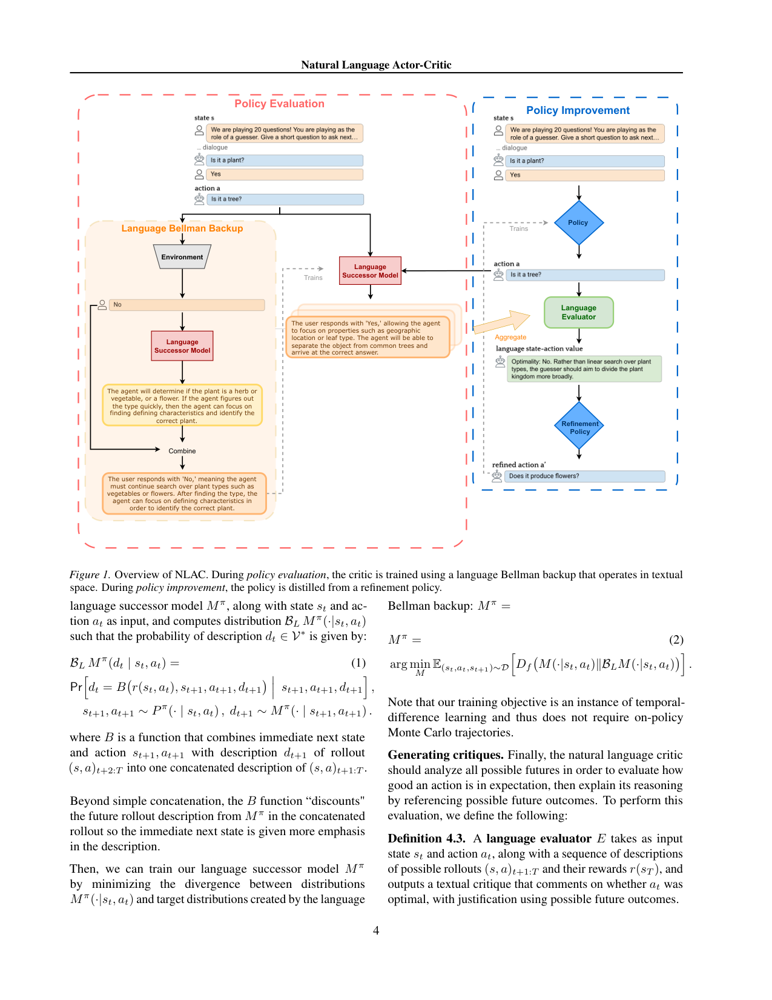
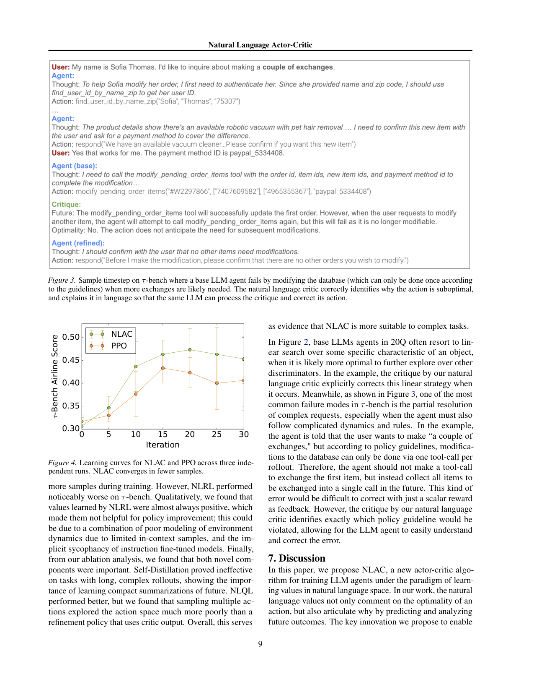

`natural_lang_ac | NLAC: Natural Language Actor-Critic — Scalable Off-Policy Learning in Language Space | UC Berkeley + ByteDance Seed(Joey Hong, Kang Liu, Zhan Ling, Jiecao Chen, Sergey Levine) | Preprint;arXiv:2512.04601v2 [cs.LG] 2026-02-02 | 主题线 L?(off-policy RL 微调 / 语言空间 critic)·相关性 High`

> deep 档笔记(由 light 升级:保留第一层/6轴/图/对标,补第二+三层)。基于已下载 PDF 正文(`resource/papers/natural_lang_ac.pdf`,21 页)与渲染图。三标注:【原文】/【推断】/【待核】。

══ 第一层:一眼看懂 ══
- 🟦 **TL;DR**:训长任务 LLM agent,policy gradient(PPO/GRPO)在稀疏奖励、长 horizon 下信用分配差、不稳;传统 actor-critic 的 scalar critic 又"把丰富的失败原因压成一个数,没法告诉语言策略该怎么改"。NLAC 让 critic **用自然语言输出评价**(不仅说好坏、还解释"为什么 + 未来会怎样")。关键创新:训一个 **语言后继模型(language successor model)**,用**语言版 Bellman backup** 从单步转移 bootstrap(TD 学习)预测"未来 rollout 的紧凑文字摘要"——**完全绕开"在 context 里聚合大量 on-policy rollout"**(这正是前作 NLRL 的不可扩展瓶颈),从而能**off-policy、不用 policy gradient** 地学价值;策略改进则通过**从一个"自我精修策略(refinement policy)"蒸馏**得到。在推理(MATH500-Hard)、对话猜词(20Q)、客服(τ-bench)上优于现有微调法,更稳更省样本。【原文 Abstract/§4】
- **最巧的一步**:**语言 Bellman backup + language successor model(预测未来摘要,可 off-policy、TD bootstrap)**。抽掉它,就退回 NLRL 那种"重复采 on-policy 轨迹再 in-context 聚合"——随 horizon 变长立刻不可扩展(只能在 gridworld 验证)。把"未来"压成可 TD 回填的语言摘要,是让语言空间 critic 第一次"scalable + off-policy"的命门;且 critic 与 policy 是**同一个 LLM 用不同 prompt** 实例化。【原文 §4.1 Def4.1/4.2】

══ 第二层:为什么做(写透,重点) ══
- **研究背景**:LLM agent 任务(工具调用、网页浏览、与人对话)需多轮交互、追求时序延展目标,基模不微调做不好。长 horizon + 稀疏奖励下,标准 policy gradient(PPO/GRPO)信用分配差、训练不稳、样本效率低。actor-critic 本可用 critic 提供更密信号、支持 off-policy/offline,但**强依赖 critic 保真度**,且过往 LLM 上的 scalar-critic actor-critic 没能比标准微调有说服力的提升。【原文 §1/Abstract】
- **解决的具体痛点**:① **scalar critic 不适配语言动作空间**——把丰富的失败原因压成一个数,无法告诉语言策略"该怎么改动作";② **NLRL(最近邻,把 critic 做成语言)的不可扩展瓶颈**——NLRL 的语言 value 靠"重复采很多 on-policy 轨迹 + in-context 聚合"得到,且策略改进靠"枚举多个候选动作 + 蒸馏 value 最高那个";随 horizon 变长、动态变复杂、动作空间变大,这种**in-context 聚合与枚举都 intractable**,所以 NLRL 至今只在 gridworld 这类简单环境验证。【原文 §1/§2】
- **相关工作 & 各自不足**(三条线):
  · **self-correction prompting**(Reflexion/Self-Refine):靠"回溯/撤销"前面动作;而 NLAC 测的是 agent **一次机会**解题(无回溯);
  · **process reward models(PRM)**:用人标(Lightman'23)或估计 value(Wang'24)给 action 级反馈——但都是 **scalar 反馈**;NLAC 的语言 critic 可看作"语言空间 PRM",反馈是文字(why+未来),对能用语言理解决策的 LLM 策略更有用;
  · **RL for LLM agent**(PPO/GRPO on-policy):长 horizon 放大 RL 不稳;**最近邻 NLRL** 同样语言 value 但靠 on-policy 重复采样 + in-context 聚合 + 动作枚举,不可扩展。自我定位:**首个在语言空间做 general+scalable value learning 而不依赖 on-policy in-context 聚合** 的工作。【原文 §2】
- **动机链**:现状=scalar critic 压缩信息、on-policy PG 不稳、NLRL 不可扩展 → 缺陷根源=NLRL 要"在 context 里聚合大量 on-policy rollout"和"枚举动作" → 既然 critic 要解释"为何好/坏"靠的是**对未来结果的预测分析**,而完整轨迹太复杂,**那就训一个 language successor model 只预测"未来的紧凑文字摘要"**,用**语言版 Bellman backup 从单步转移 bootstrap(TD)** 学它——这样**绕开 on-policy MC 轨迹,可 off-policy、不用 policy gradient**;策略改进则不枚举动作,而是**从一个"自我精修策略 refinement policy"蒸馏**(refinement 读 critic 的文字评价、把次优动作改好)。为什么不用更简单的"采一批动作重打分选最优"(Q-probe 式)?作者实证:可行样本量下这种 reweighting **探索动作空间不充分**(§4.2),refinement policy 用 critic 输出能更有效地"知道往哪改"。【原文 §1/§4.1/§4.2】
- **与最近邻工作的 Δ**:① 与 **NLRL(Feng'25)** 的 Δ(最关键):NLRL value=on-policy 轨迹 in-context 聚合 + 动作枚举蒸馏;NLAC value=**TD-bootstrap 的 language successor model(单步转移即可,off-policy)** + **refinement-policy 蒸馏**(不枚举)。Δ=把"未来"从"反复采的完整 on-policy 轨迹"换成"可 TD 回填的紧凑语言摘要",这一步让语言 critic 第一次 scalable+off-policy(Table1:NLRL 在 τ-bench 明显更差,且 NLRL 实际多看 4× 样本)。② 与 **scalar actor-critic / SAC** 的 Δ:NLAC 的 policy improvement 形式上类比 SAC 的"把 target policy 投影回 base"(Eq.5),但 target 不是用 value 参数化(需枚举动作,intractable),而是**直接用 refinement policy 当 target**。③ 与 **distributional RL(C51)** 的 Δ:借了"distributional Bellman backup 用单步样本可 off-policy"的思想,但把"return 分布"换成"未来 rollout 的文字描述分布"。【原文 §2/§4.1/§4.2】

══ 第三层:怎么做 + 靠不靠谱 ══
- **方法流水线**(Alg.1,一个 LLM \(M_θ\) 用不同 prompt 同时当 policy/successor/evaluator/refinement;输入 replay buffer 转移 → 输出改进后的 policy):
  1. **采样存 buffer**:用 \(πθ\) 采 \((s_t,a_t,r_t,s_{t+1})\) 存 replay D(off-policy 来源);
  2. **policy evaluation — 训 language successor model \(M^π\)**:\(M^π(·|s,a)\) 概率生成"未来 rollout \((s,a)_{t+1:T}\) + 终态 reward 的紧凑文字摘要";用 **language Bellman backup B_L** 做 target——B_L 把"立即下一状态 \(s_{t+1}\)"与"bootstrap 出的未来摘要 \(d_{t+1}\)"组合成一条新摘要,且**对未来摘要"折扣"**(更强调立即下一步);训练目标 \(L_1 = \) 反向 \(\text{KL}(B_L M_{\bar θ} ‖ M_θ)\),\(\bar θ\) 是参数的 **EMA**(防 generative collapse),选反向 KL 是为捕捉未来的多样性;
  3. **生成 critique**:language evaluator E 把 k 条未来摘要 \(d⁽¹⁾..d⁽ᵏ⁾\) 塞 in-context,聚合成"该动作多好+为什么"的文字 \(Q^π_L(s,a)\)(这步 LLM 零样本就会,无需训);
  4. **policy improvement — 从 refinement policy 蒸馏**:refinement policy \(π_r\) 读 \((s,a, Q^π_L(s,a))\) 生成更好的 \(a^r\);训练目标 \(L_2 = −\log πθ(a^r|s_t)\)(把 \(π_r\) 当教师做蒸馏);
  5. **默认 \(k=1, m=1\)**(单条未来摘要、单轮精修)即够,\(m→∞\) 趋近贪心最优。【原文 §4/§5/Alg.1】
- **逐组件必要性 + 消融**:
  · **language successor model(TD 学未来摘要)**:核心。消融 = **Self-Distillation**(去掉 successor model,refinement 直接 condition 在 4 条 on-policy rollout 上,Reflexion 式)。Table1:Self-Distillation 在长复杂 rollout 任务上很差(20Q QwQ 26.8、τ-retail 0.35,远低于 NLAC 32.1/0.56)→证明"学紧凑未来摘要"不可或缺。【原文 §6.2 Table1】
  · **refinement-policy 蒸馏(不枚举动作)**:核心。消融 = **NLQL**(去掉 refinement,改 Q-learning:采 4 个动作蒸馏 value 最高那个)。Table1:NLQL 比 Self-Distillation 好但仍逊于 NLAC→证明"采样多动作探索动作空间不如 refinement policy 用 critic 输出定向改"。【原文 §6.2 Table1】
  · **反向 KL + EMA 参考参数(\(\bar θ\))**:防 generative collapse(模型自蒸馏式训练崩塌);属稳定性组件,无单独消融但有机理说明(引 Shumailov'24)。【原文 §5.2】
  · **k(未来摘要数)/m(精修轮数)**:默认 \(k=m=1\);作者称更随机环境可能要更大 k(未做系统 sweep)。【原文 §6.2】
- **关键机制直觉**:language Bellman backup 的精髓——传统 scalar Bellman 是 \(Q(s,a)←r+γQ(s',a')\);NLAC 把它**搬进文字空间**:"对 (s,a) 的未来文字摘要" ← 组合("立即下一状态 s' 的文字" + "对 s' 的 bootstrap 未来摘要,打折扣")。因为只用了**单步转移 \((s,a,s')\)** 来回填(下一摘要由 \(M_θ\) 自己生成,不需真实采到 episode 末),所以是 **TD 而非 MC、可 off-policy**——这正是绕开 NLRL"反复采 on-policy 轨迹"的命门。successor model 与 successor features(Barreto'17)同构:都预测未来分布、都能 TD 训;差别是 successor features 线性内积出 Q,这里是 LLM 解码出文字 Q。Theorem 4.5 证明:收敛时存在单调映射 g 使 \(Q^π(s,a)=g(Q^π_L(s,a))\),即文字 critic 能恢复真 scalar Q-function(理论兜底)。【原文 §4.1/§4.3/App A】
- **实验与证据**:三类任务——**MATH500-Hard**(单步,12k 训/500 测)、**20Q**(THINGS 1823 物体,GPT5 当 oracle,1000 训/500 测)、**τ-bench**(对话+工具,retail 2500 训、retail+airline 各 500 测,**airline 完全 OOD 不训**)。基模 **Qwen2.5-7B-Instruct 与 QwQ-32B**。**公平性**:每个微调法都训 **30,720 梯度步**、3 次独立运行取均值。核心证据:① Table1——QwQ-32B 上 NLAC 在长 horizon 任务**超过 GPT5 ReAct**(20Q 32.1 vs 30.2、τ-retail 0.56 vs 0.44、τ-airline 0.43 vs 0.32),相对标准 RL 微调在 20Q/τ-retail **+30%**;② Fig4——NLAC 比 PPO **更少梯度步收敛**(τ-airline 学习曲线,3 次独立运行)→支撑"off-policy 语言 critic 更省样本"主张;③ Fig2/Fig3 定性——20Q 里 critic 纠正"线性搜索单一特征"的次优策略;τ-bench 里 critic 精确指出"违反哪条 policy(一次只能改一次数据库)"——scalar reward 无法传达这种信息。**对照中的诚实点**:作者明说 NLRL 实际**多看 4× 样本**(因要拼 4 条 rollout),即便如此 NLRL 在 τ-bench 仍差(qualitatively NLRL 的 value 几乎总是正的→对策略改进无用,疑因 in-context 样本有限的动态建模差 + 指令模型的 sycophancy)。MATH(单步)上 NLAC 退化为"用生成式 reward model 自蒸馏",与基线持平——作者主动指出这不是它擅长的设定。**"看着强但没回答核心问题"风险**:与 GPT5 比是不同模型不同条件,更像"小模型经 NLAC 能超 frontier prompting"的展示。【原文 §6/Table1/Fig2/3/4】
- **假设与失效边界**:【原文】① **Assumption 4.4(全序假设)**:对任一状态,各动作的语言评价 \(\{Q^π_L(s,a)\}\) 可映射成标量、构成全序(靠 critique 的情感正负排序);作者称"非强假设"。② §7 limitation:依赖基模"能生成可信未来 + 能靠精调 prompt 精修自身动作"的能力,**任务过复杂时会崩**;future=层次化分解复杂任务。③ App B.6 **比正文更坦白**:"我们在所有训练 run 里最终都观察到 catastrophic forgetting"(指令跟随能力退化),实验里靠**低数据量训练**规避之。【原文 §4.3/§5.2/§7/App B.6】【推断】④ 当不同动作的文字评价情感接近/不可比、或 critic 的"未来摘要"在复杂动态下失真时,贪婪/精修方向会错,off-policy 价值学习随之失效——critic 保真度被反复强调为成败关键。
- **祛魅总结**:【推断】**真贡献(硬货)**:**language Bellman backup + language successor model** 是真正的算法创新——第一次让"语言空间 value learning"摆脱 on-policy in-context 聚合,做到 **off-policy、TD-bootstrap、不用 policy gradient**,并有 successor-features 联系 + 收敛性定理(Theorem 4.5)兜底;Fig3 τ-bench 的"critic 精确指出违反哪条规则"是 scalar critic 根本给不出的信号,有说服力。refinement-policy 蒸馏替代动作枚举也确实更有效(NLQL 消融为证)。**包装/可质疑**:① "超过 GPT5"是不同条件展示,非公平对比;② 全序假设(4.4)在评价情感纠缠时鲁棒性存疑,作者一句"not strong"略轻描淡写;③ **catastrophic forgetting 在所有 run 都出现、只能靠低数据量规避**(App B.6)——这其实是个不小的实用性限制,正文只一句带过,放进附录显得淡化;④ MATH 单步上无优势(诚实承认);⑤ **无开源代码**(只给伪码 Alg.1),且训练成本不低(64 GPU、<48h、30720 步)。整体算法贡献扎实,但"scalable/stable"的标语下,forgetting 与全序假设两处是被低调处理的真实软肋。

🎯 **机制速览 6 轴** [light]
| 维度 | 内容 |
|---|---|
| **学什么信号** | 环境 reward(稀疏)经 **自然语言 critic** 转成富文本评价(why+未来后果);可视为语言空间的 process reward model【原文 §2/§4】 |
| **改什么** | **参数**——联合训练 policy 与 language successor model(critic);policy 通过从 refinement policy **蒸馏** 更新【原文 §4.2】 |
| **何时改** | **离线/off-policy 批量训练**(TD backup 用单步转移,无需 on-policy MC 轨迹);训练在 8×H20 上跑【原文 §4.1/§5】 |
| **免梯度?** | **否(含梯度)**——actor 与 critic 均梯度训练;卖点恰是"off-policy **不用 policy gradient**"(用 TD 回归 + 蒸馏,而非 PG)【原文 Abstract】 |
| **记忆-技能生命周期** | 无外部记忆库;"记忆"体现为 critic 学到的"未来摘要"表征(类比 successor features);off-policy 数据来自 replay 式转移集 D【原文 §4.1】 |
| **防遗忘机制** | **不适用**(非持续学习设定);稳定性来自 TD/语言 Bellman backup 替代高方差 PG(Fig4 显示比 PPO 更少样本收敛)【原文/推断】 |

🖼 **关键图 top-2** [light]

这是**原文 Figure 1**:左半 Policy Evaluation——critic(language successor model)用 language Bellman backup 在文字空间被训练、聚合多条未来摘要给出评价;右半 Policy Improvement——policy 从 refinement policy 蒸馏。选它因为这是整套 off-policy 语言 actor-critic 的咬合主图,最巧那一步(语言 Bellman backup)就在其中。【原文图1】

这是**原文 Figure 4**:NLAC 与 PPO 三次独立运行的学习曲线,NLAC 用更少样本收敛。选它因为它直接支撑"off-policy 语言 critic 比 on-policy PG 更稳、更省样本"这一核心主张。【原文图4】

══ 假设与失效边界(一句)══
- 【原文+推断】显式假设(Assumption 4.4):对任一状态,各动作的语言评价 \(\{Q^π_L(s,a)\}\) 可映射成标量、构成全序(靠 critique 的"情感正负"排序)——【原文】作者称"非强假设";【推断】但当不同动作的文字评价情感接近/不可比、或 critic 的"未来摘要"在复杂动态下失真时,贪婪/精修方向会错,off-policy 价值学习随之失效——依据:§4.2 全序假设 + critic 保真度被反复强调为 actor-critic 成败关键。

🎯 **对"探索-巩固"idea 对标**(一句)[light]
- **可借组件 / 竞品**:NLAC 把"语言空间的丰富反馈(why + 未来后果)"做成可 TD-bootstrap、off-policy 的训练信号,并用 **refinement-policy → base-policy 的蒸馏** 完成策略改进——这与本项目"教师脚手架推理蒸馏(TSRD)"在"用语言级指导改进策略 + 蒸馏沉淀"上同构,其 **language successor model(把未来压成可回填摘要)** 可作"MTP 前瞻探针"的语言版替代积木;同时它代表"off-policy 价值学习"路线,与本项目若走 on-policy 蒸馏可形成对照/互补。

⑦ **开源代码 + 框架**:**论文正文未给出公开代码仓链接**——【原文未提供代码链接,标"未找到开源代码链接"】(ByteDance Seed + Berkeley 出品,可能后续放出;全文唯一 github 链接是 SWE-bench/QwQ 引用,非本方法仓)〔待核〕。**框架:verl(Volcano Engine Reinforcement Learning,Sheng et al. 2024)**(原文 App B.4 明示 "using the Volcano Engine Reinforcement Learning (verl) library")。
💰 资源/成本:基模 **Qwen2.5-7B-Instruct 与 QwQ-32B**;训练 **8 个 H20 节点 = 共 64 GPU**,每次 < 48 小时,**30,720 梯度步**(deep 档修正:light 档曾写"8×H20",实为 8 节点共 64 卡)【原文 App B.4】;各微调法控制为同等 30,720 步做公平对比(Table1);off-policy/TD 设计意在比 on-policy PG 更省样本(Fig4)。【原文 §6.2/App B.4】
🔭 开放问题:【原文】把语言 critic 推广到更复杂动态/更大动作空间、与 successor features 的理论联系(附录证明收敛到最优策略);【推断】全序假设在评价情感纠缠时的鲁棒性、critic 文字摘要在超长 horizon 下的保真度仍是未解风险。
