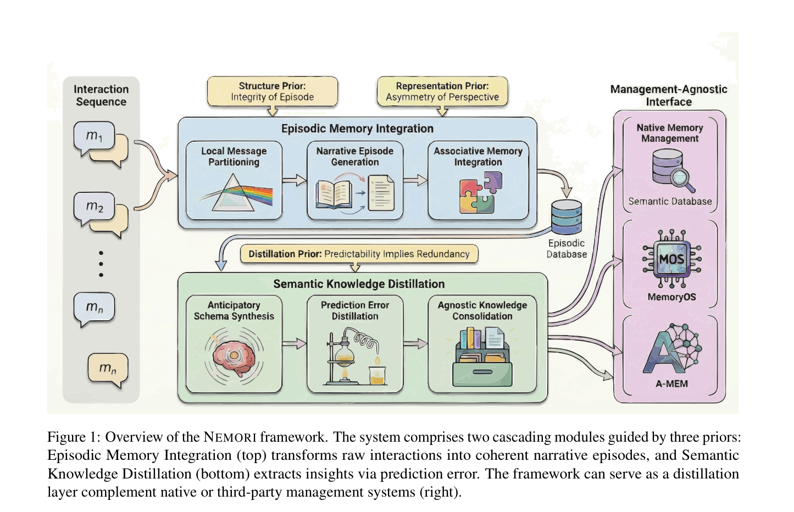
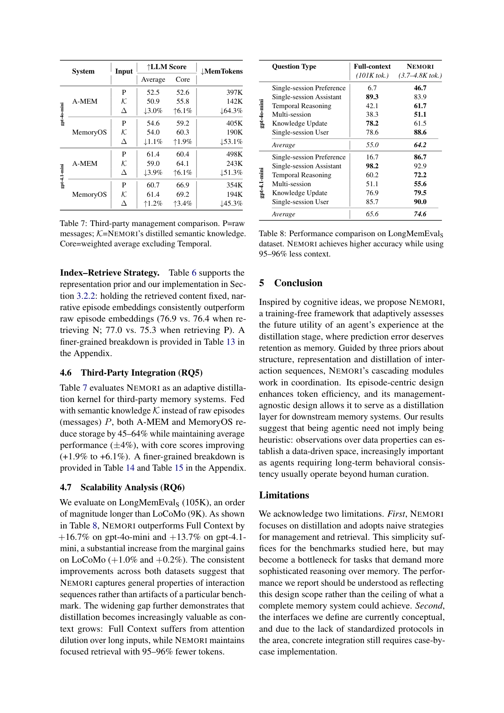

`nemori | What Deserves Memory: Adaptive Memory Distillation for LLM Agents (NEMORI) | 复旦 + 盛大集团(Shanda) + 北航 + 上财（Wenquan Ma, Jiayan Nan 等，复旦/盛大主导） | 2025-08 arXiv:2508.03341v4（16 Apr 2026 修订）· 预印本(疑投 ACL/EMNLP，含 anonymous reviewers 致谢) | L?·经验记忆/agent memory distillation 主线·高相关`

> 三标注约定:【原文】=论文直述;【推断】=有据判断(附依据);【待核】=拿不准的关键事实。

══ 第一层:一眼看懂 ══

- 🟦 **TL;DR**:LLM agent 要长期记住用户/任务历史,但全塞进上下文会爆 + lost-in-the-middle。现有 memory 系统的核心难题是"**什么信息值得存**"——主流做法靠人工启发式(重要性打分 importance score、情绪标签 emotion tag、事实模板 fact template),本质是把"设计者的直觉"编码进去,带来两个毛病:①主观偏差在蒸馏阶段是致命的(信息一旦被扭曲不可逆),②为避免扭曲又倾向"过度存储"→系统膨胀→检索噪声。NEMORI 受**预测编码理论**(predictive coding:大脑只上传"预测误差")启发,提出一个**training-free**框架:把"这段经验未来有没有用"重新定义为"**可不可预测**"——**能被现有知识预测出来的就是冗余、不值得存;预测不出来的(prediction error)才值得蒸馏成记忆**。两个级联模块:①**Episodic Memory Integration**(把原始对话切成"有完整语境的 episode"→改写成第三人称叙事 narrative→把被窗口截断的同事件 episode 关联合并);②**Semantic Knowledge Distillation**(对每个新 episode,先用现有知识"猜"它会讲什么=anticipatory schema,再把"实际内容 vs 预测"的差异蒸馏成语义 insight,最后 new/merge/conflict 三选一并入库)。框架**对下游 management 不可知(management-agnostic)**,可当一个"蒸馏层"插到 A-MEM / MemoryOS 等第三方记忆系统前面,帮它们减 45–64% 存储还不掉点。代码:https://github.com/nemori-ai/nemori 。【原文 摘要+§1+§3】

- **最巧的一步**:**把"该不该存"判据从"启发式打分"换成"预测误差"**(Distillation Prior: Predictability Implies Redundancy)。抽掉这一步(消融 NEMORI-s = 直接对每个原始 episode 蒸馏、不做"先预测再取差"),性能 gpt-4o-mini 65.0→52.0(−25%)、gpt-4.1-mini 74.9→65.5(−14.4%),Temporal Reasoning 子类更是 33.3→57.9(+73.9%)。为什么是它——预测误差天然是"数据自己说的、与现有知识正交的新信息"的无监督信号,**绕开了所有人工 importance/emotion 标准**,且只存"增量"故存得少、噪声小。它是整个"data-driven 而非 heuristic"主张的承重墙。【原文 §4.4, Table 5/10】

══ 第二层:为什么做 ══

- **研究背景**:无状态 LLM 维持长期行为一致性,本质矛盾="交互轨迹线性增长 vs 有限上下文窗口 + lost-in-the-middle"。个人助理、自治 agent、个性化推荐都要求**持久交互**,于是"实时调控上下文"的记忆系统成为主流方案。作者把记忆系统拆成三阶段:**distillation(存什么)→ management(怎么组织)→ retrieval(怎么取)**。【原文 §1, §2.1, Table 1】

- **解决的具体痛点**:记忆系统在"何时评估一条经验的效用"上分三派(Table 1 是本文的分类利器):
  - *retrieval-time*(纯 RAG):把判断全推迟到查询时,蒸馏/管理都空着;
  - *management-time*(MemoryBank/MemGPT/MemoryOS/A-MEM):把 entry 当**不透明容器**,靠访问频率/时间衰减/关系链接等**结构元数据**事后过滤,**不看内容本身**;
  - *distillation-time*(Generative Agents importance score、Emotional RAG emotion tag、Mem0 fact extraction):在**入库时**就用人工启发式塑形 entry。
  痛点正出在 distillation-time 派:**人工启发式=编码设计者直觉**,①蒸馏阶段的主观偏差导致**不可逆信息扭曲**,②为防扭曲而过度存储→**系统膨胀→检索噪声放大**。所以需要一个"判据来自交互经验本身"的方法。【原文 §1, Table 1】

- **相关工作 & 各自不足**(见 Table 1 + §2):management-time 派回避了"内容检视"故无法判断"这条内容是否真有信息量";distillation-time 派的 importance/emotion/fact 三类启发式都是**主观先验**,且各自只抓一个维度(重要性/情绪/事实)。NEMORI 的位置:**distillation-time 派,但判据=prediction error(数据驱动)+ management 不可知**——既在入库时塑形(灵活),又不靠人工直觉(无偏)。【原文 Table 1, §2】

- **动机链**:agent 要长期一致 → 必须有记忆系统挑"值得存的" → 现有判据要么不看内容(management-time)、要么靠人工直觉(distillation-time)→ 人工直觉在蒸馏阶段不可逆地扭曲信息 / 逼出过度存储 → 所以判据必须**内生于交互数据本身** → 预测编码理论给出现成的 data-driven 信号:**预测不出来的=值得记的**(可预测的=冗余)→ 落成"先合成预测 schema、再取预测误差蒸馏"的 NEMORI;又因为 episode 才是有完整语境的最小单位(structure prior)、叙事重构才贴近"回忆=推理"(representation prior),故前置一个 Episodic Memory Integration 模块。【原文 §1, §3.1】

- **与最近邻的 Δ**:
  - *vs Mem0(fact extraction)*:Mem0 抽"事实",NEMORI 抽"**预测误差**"——后者过滤掉"现有知识已能推出的事实"(冗余),故存得更少、检索更准。【原文 Table 1, §4.1】
  - *vs A-MEM(structured notes + evolving links)/MemoryOS(分层 OS 存储)*:它们是 **management-time**(组织已有 entry),NEMORI 是 **distillation-time**(决定 entry 内容本身)→**正交可叠加**:NEMORI 当蒸馏层喂给它们 distilled K 而非 raw 消息,A-MEM/MemoryOS 减 45–64% 存储、core 分还涨 1.9–6.1%(RQ5, Table 7/14/15)。这是"最近邻其实可被我增强"的巧妙定位。【原文 §4.6】
  - *最关键差异点*:**判据是"可预测性"而非任何人工标准**——这是它与所有 distillation-time baseline 的唯一本质分歧,也是消融证明的涨点来源。【原文 §4.4】

══ 第三层:怎么做 + 靠不靠谱 ══

- **方法流水线(两级联模块 + 三先验,Alg.1)**:
  1. **(模块A.1)Local Message Partitioning**:消息进缓冲区 B,攒满观察窗口 w(默认 20 条)就让 LLM(prompt \(P_{par}\),高敏感度检测话题/意图/时间/结构/相关性切换)把这 w 条切成不重叠、覆盖全集的若干 raw episode;然后清空 B。【原文 §3.2.1, D.1.1】
  2. **(模块A.2)Narrative Episode Generation**:每个 raw episode $P_j$ 经 LLM(\(P_{nar}\))转成**第三人称叙事 $N_j$ + episodic cue $c_j$**(标题摘要),并**把相对时间("昨天")显式换算成绝对日期写进叙事**;算 embedding \(v_j=f_{emb}(c_j\|N_j)\);存为 \(M_j=(c_j,N_j,P_j,v_j)\)。支持双模检索(返 N 求效率 / 返 raw P 求精度)。【原文 §3.2.2, D.1.2】
  3. **(模块A.3)Associative Memory Integration**:新 episode 对已有 episodic 库检索 top-$K_e$ 候选,让 LLM(\(P_{sel}\))判断是否有"episodic 连续性";有则合并(supersede 旧项)、无则插入——**修复被窗口切断的同一事件**。【原文 §3.2.3】
  4. **(模块B.1)Anticipatory Schema Synthesis**:把下游 management M 当抽象 context provider,用通用接口 Evoke 取与新 episode 相关的已知上下文 \(S_{in}\)(原生实现=阈值过滤的相似检索);**只给 cue \(c_{in}\) + 已知上下文 \(S_{in}\)**(不给原文),让 LLM(\(P_{ant}\))**预测这个 episode 实际讲了什么**(\(\hat P_{in}\))——明确指示"预测 SUBSTANCE 不是 STYLE"。【原文 §3.3.1, D.1.5】
  5. **(模块B.2)Prediction Error Distillation**:让 LLM(\(P_{dis}\))对比"实际 \(P_{in}\) vs 预测 \(\hat P_{in}\)",**只抽取实际里有、预测里缺/错的事实性知识** \(K_{in}\)(过滤情绪/寒暄/已被预测中的)。【原文 §3.3.2, D.1.6】
  6. **(模块B.3)Agnostic Knowledge Consolidation**:每条 insight 检索语义库 top-$K_m$,让 LLM(\(P_{con}\),"保守维护者、默认 NEW")判 \(\delta\in\{new,merge,conflict\}\)——new 插入 / merge 合成统一表述并 supersede / conflict 删旧换新(失效旧知识)。【原文 §3.3.3, D.1.7】
  7. **(推理)Response Generation**:query 并行检索 top-k episodic($N$,top-2 额外带 raw $P$)+ top-m 语义(m=2k),拼接喂 LLM(\(P_{ans}\))生成答案。【原文 §3.4】

- **逐组件必要性**(消融 Table 5/10,做得相当扎实):
  - *预测误差蒸馏(核心)*:NEMORI-s(直接蒸馏)对比 → 全面落后,Temporal 子类暴跌(见"最巧一步")。✔强消融。
  - *episodic 检索 w/o e*:73.0→65.0(gpt-4o-mini,−11%);*语义检索 w/o s*:73.0→54.7(−25.1%)——两类记忆**互补不可去**(去语义伤得更狠)。✔有消融。
  - *自适应切分 w/o p*(换成固定 20 条 chunk):73.0→68.0、80.8→75.7。证明"按语义完整性切"优于"固定切"。✔有消融。
  - *native management 开关*:几乎无影响(64.6 vs 65.0)——作者诚实解释:**LoCoMo 几乎不涉及知识更新,所以 consolidation 的 new/merge/conflict 用不上**,但为真实部署(常有更新)保留。✔诚实标注边界。
  - *观察窗口 w(5–40)*:性能稳定(±1%),对该超参鲁棒(Fig.2/Table 11)。✔有消融。
  - *检索策略 index/retrieve(N vs P)*:叙事 embedding 一致优于 raw embedding(76.9 vs 76.4),支撑 representation prior(Table 6/13)。✔有消融。

- **关键机制直觉**:核心不是公式而是**"预测误差=信息增益的代理"**这一认知。\(\hat P_{in}=f_{LLM}(\text{cue},\text{已知})\) 是"系统拿现有知识能猜到的部分";\(P_{in}\ominus\hat P_{in}\)(让 LLM 取差)就是**Shannon 意义上的 surprise / 新信息**——可预测=熵低=冗余,该丢;不可预测=高 surprise=该记。这把"重要性"从主观标准变成"相对现有知识库的条件信息量",且**只存增量**故天然抗膨胀。叙事改写则把"回忆=对事件的 allocentric 重构(推理)"前置到记忆形成阶段,**把推理负担从答题时挪到建库时**(作者称 reasoning during memory formation),这解释了为何 Temporal Reasoning 涨得最多(日期在建库时已被换算成绝对时间)。【原文 §3.1, §3.3, B.1】

- **实验与证据**:
  - 数据集:**LoCoMo**(10 段对话、均 24K token、1540 题、4 类推理)+ **LongMemEvalS**(500 会话、均 105K token,更长更真实,测 scalability)。Backbone/judge:gpt-4o-mini、gpt-4.1-mini(NEMORI 内部模型+答题模型都用它们,embedding 用 text-embedding-3-small)。Baseline 7 个:Full Context / RAG-4096 / LangMem / Zep / Mem0 / A-MEM / MemoryOS。指标:LLM-judge 分(主)+ F1 + BLEU-1,归一到 0–100。超参:\(\tau=0.70\),\(K_e=K_m=5\),\(K_s=10\),\(k=10\)(\(m=20\)),\(r=2\)(top-2 episode 带原文)。【原文 §4.1】
  - **支撑核心主张的关键实验**(Table 2):NEMORI 平均 LLM 分 gpt-4.1-mini 80.8(超最强 baseline LangMem 73.4 的 +10.1%)、gpt-4o-mini 73.0(超 Mem0 61.3 的 +19.1%),且**两个模型上都略超 Full Context**(80.8 vs 80.6 / 73.0 vs 72.3)——说明它确实挑出了有用经验、还顺手降噪;**Temporal Reasoning 最突出**(77.3,+15.9% over A-MEM)。【原文 §4.2】
  - **最有说服力的两组**(也是真正的硬货):
    ① **成本**(Table 3/4):建库阶段 LLM 调用 −59.5%、总 token −38.7%(比 Mem0/A-MEM 等省一半);答题阶段平均 **2745 token(比 Full Context 23653 省 88%)、端到端延迟 −47%(3053ms vs 5806ms)**,而分还更高——"复杂 pipeline 反而更省"的反直觉结果,作者归因于**以 episode 而非 message 为处理单元**(避免 message-wise 处理的成本陷阱)。【原文 §4.3, Table 9】
    ② **scalability**(Table 8,RQ6,见图):在 105K 的 LongMemEvalS 上,NEMORI 用 **3.7–4.8K token(比 101K 全上下文省 95–96%)** 反而比 Full Context 高 **+16.7%(gpt-4o-mini 64.2 vs 55.0)/ +13.7%(gpt-4.1-mini 74.6 vs 65.6)**——上下文越长、蒸馏价值越大(Full Context 受 attention dilution 之害)。这是"长上下文优势"主张的最强证据。【原文 §4.7, Table 8】
  - *baseline 公平性*:同 backbone、同答题模型,Mem0/Zep 用其商业 API 取 context(作者明示);建库成本 baseline 数取自 Fang et al.(2025)同口径。基本公平,但**Mem0/Zep 走闭源 API 这一项不完全可控**。【推断:依据=§4.1 implementation details】
  - *"看着强但没回答核心"的隐患*:① Open Domain 子类 NEMORI 略输最强 baseline(56.3 vs 60.4)——作者诚实解释该子类**依赖 backbone 先验知识而非记忆**(如答案"UNO"对话里从没出现,记忆无能为力),故不是纯记忆评测(B.2)。② 主实验在 LoCoMo 上相对 Full Context 仅 +0.2/+1.0%,**真正拉开是在长上下文(RQ6)**——若只看 LoCoMo 会低估;反过来,LoCoMo 上"记忆系统几乎打不过直接全塞"也说明短上下文场景记忆蒸馏收益有限。【原文 §4.2, §4.7, B.2】

- **假设与失效边界**:
  - 【原文】管理/检索用的是 naive 策略——"对本文 benchmark 够用,但对需要复杂记忆推理的任务可能成瓶颈;报告性能反映的是该设计 scope、非完整记忆系统的上限"(作者亲述 Limitation 1)。
  - 【原文】接口目前是概念性的,缺标准协议,接第三方仍需 case-by-case 实现(Limitation 2)。
  - 【原文/数据】native consolidation(new/merge/conflict)在 LoCoMo 上几乎不起作用(无知识更新),其价值未在主 benchmark 被验证。
  - 【推断】**强依赖 anticipatory schema 的质量**——若 backbone 预测能力弱(更小模型)或领域知识缺失,"预测误差"会失真(把模型本就不会的都当成"新信息"全存,反而膨胀)。依据=方法本质是"用模型自己当预测器",未在弱 backbone 上测(只用了 gpt-4o/4.1-mini 两个较强模型)。
  - 【推断】Open Domain 的短板暴露:**它只学"对话里有但不可预测的"信息,学不到"对话里没明说、需外部世界知识补全的"**——这是 distillation 范式的固有边界。依据=B.2 的 UNO 案例。

- **祛魅总结**:
  - **真贡献(硬货)**:(a)**Table 1 的三阶段(distillation/management/retrieval)× 评估时机分类**本身是一个清晰、有用的 taxonomy 贡献,把零散记忆工作摆进一张表;(b)**"prediction error = 该存的信息"这个判据**优雅、data-driven、有认知理论背书,且消融实锤是涨点主因;(c)**成本与 scalability 数据扎实且反直觉**(更复杂却更省 token、长上下文优势明显),这是最可信的部分;(d)**management-agnostic 定位聪明**——把竞品(A-MEM/MemoryOS)变成"可被我增强的下游",RQ5 数据支持。
  - **包装/可能高估**:(a)大量 prompt 工程(7+ 种专用 prompt,附录 D 占近半篇幅)——"框架"很大程度是**prompt orchestration + 向量库**,training-free 是优点也意味着**没有任何可学习参数、效果上限受 backbone 牵制**;(b)"cognitive ideas / predictive coding / Complementary Learning Systems"的认知科学包装偏重,实际机制就是"让 LLM 先猜再取差";(c)在 LoCoMo 上几乎打平 Full Context,标题"What Deserves Memory"的宏大叙事主要靠 RQ6 长上下文撑;(d)native management 在主 benchmark 没被真正考验。【推断:依据=附录 D prompt 体量、§4.2 vs Full Context 微弱差距、§4.4 management 消融】
  - **可能低估**:作者把"naive management/retrieval"列为局限,但其"蒸馏层可插拔到任意 management"的设计**恰恰是工程上最有复用价值的点**(RQ5 已示范),这块被谦虚带过。【推断】

══ 结构化抽取 ══

- 🎯 **机制速览 6 轴**:

| 学什么信号 | 改什么 | 何时改 | 免梯度? | 记忆-技能生命周期 | 防遗忘机制 |
|---|---|---|---|---|---|
| **预测误差**(经验库:用现有知识合成 anticipatory schema,取"实际 vs 预测"之差;判据=可预测即冗余)+ 时间/语义结构信号 | **记忆**(两类:episodic 叙事库 $D_e$ + semantic insight 库 $D_s$;注入答题 prompt;**不改参数、不改 logits**) | **在线 per-episode**(消息攒满窗口 w 即触发切分→叙事→蒸馏→并库;流式) | **是**(training-free,纯 LLM prompt + 向量检索,零梯度) | 写入(切分→叙事→预测误差蒸馏)→**整合**(associative integration 合并被切断的同事件 episode)→检索(top-k 双库)→**淘汰/更新**(consolidation 的 conflict 删旧、merge 合并)→未涉及跨 agent 共享 | **有(轻量)**:语义 consolidation 的 **conflict 分支删除被新知识 invalidate 的旧 entry、merge 去重**(但 prompt 设"默认 NEW、保守删除");episodic 层做合并而非遗忘;**注意:这是"记忆库去冗余/纠错",非神经网络防遗忘** |

- ⑦ **开源代码 + 框架/harness**:**已开源** https://github.com/nemori-ai/nemori (摘要 + §3 两处给出,称 production-grade implementation)。**无训练框架**(veRL/TRL/OpenRLHF 等均不涉及)——training-free,实现栈 = LLM API(gpt-4o-mini / gpt-4.1-mini 作内部+答题模型)+ text-embedding-3-small + 向量相似检索 + 大量结构化 prompt(附录 D 给全 7+ 种 prompt 模板);可作"蒸馏层"对接 A-MEM / MemoryOS 等第三方记忆系统。〔代码仓未 clone 核验,以正文链接 + 附录完整 prompt 为准——待核仓内具体实现细节〕【原文 摘要, §3, 附录 D】

- 💰 **资源/成本与可扩展性**:**training-free、无训练成本**,仅 API + embedding 调用。建库成本:相对 baseline **LLM 调用 −59.5%、token −38.7%**(以 episode 为单位省下 message-wise 开销);成本分布 narration 38.3% + distillation 30.3% 为大头(Table 9)。答题成本:平均 **2745 token(省 Full Context 88%)、延迟 −47%**(Table 4)。可扩展性:**长上下文(105K)上优势放大**——3.7–4.8K token 击败 101K 全上下文(省 95–96%,Table 8)。作第三方蒸馏层可帮 A-MEM/MemoryOS 减 45–64% 存储(Table 15)。【原文 §4.3, §4.7】

- 🎯 **对"探索-巩固(探索→巩固)"idea 对标**:**强支撑 + 高价值可借组件 + 一处直接缺口**。
  - *可借组件(高价值)*:**"预测误差 = 值得巩固的信号"** 与项目 idea **天然同构**——MTP(multi-token prediction)正是一个现成的 **foresight/预测器**,可把"模型对续写/下一步的预测 vs 实际轨迹"的偏差当作"该巩固什么"的筛子:**高 prediction error 的关键步 = 该沉淀进参数/技能的探索发现**;低误差(可预测)的步=冗余、不必巩固。这把 NEMORI 的"可预测即冗余"判据迁移到 TSRD 的"巩固阶段该挑哪些 token/step"。
  - *与"探索"对标*:它的 anticipatory schema(先用现有知识猜)≈"用当前 policy 做一次 foresight 探测",取差≈定位"现有能力覆盖不到的地方"——与"高熵/低置信关键步"定位探索点的思路呼应。
  - *直接缺口(竞品式启发)*:NEMORI 把误差**巩固进外部记忆库(prompt 级、免梯度)**,而 TSRD 要把发现**巩固进参数(OPD 蒸馏)**——它没有"误差→参数"的通道。**借它的判据(predictability)+ 换它的载体(记忆库→参数蒸馏)= 一个清晰的可做方向**。
  - *支撑*:它的"reasoning during memory formation(把推理前置到建库)"佐证了"巩固阶段值得做重计算"。【推断:依据=方法的预测误差判据 + 项目 core idea(MTP foresight + OPD)+ reusable_techniques】

- 🔭 **开放问题/未来方向**:
  - 【原文】① 当前 management/retrieval 是 naive 策略,需更复杂的记忆推理(分层/图/多跳检索)以突破当前 scope 上限;② 接口尚概念化、缺标准协议,第三方集成需 case-by-case → 呼唤标准化记忆协议。
  - 【推断】① 在**弱/小 backbone** 上验证(预测器变弱时 prediction-error 判据是否仍稳、会不会反而过度存储);② consolidation 的 conflict/merge 在**高频知识更新**场景(LongMemEvalS 的 Knowledge Update 子类 NEMORI 反而略弱:61.5 vs 78.2 @gpt-4o-mini)需加强——这是它当前明显短板;③ 把"预测误差蒸馏"从文本记忆迁移到**参数/技能层**(与本调研 idea 的结合点)。依据=Limitation + Table 8 Knowledge Update 行 + core idea。

- 🖼 **关键图 top-2**:

  
  这是**原文 Figure 1**(方法主图,裁剪自第 3 页顶部):左侧 Interaction Sequence 进入**上半 Episodic Memory Integration**(Local Message Partitioning→Narrative Episode Generation→Associative Memory Integration,受 Structure/Representation 先验引导)→**下半 Semantic Knowledge Distillation**(Anticipatory Schema Synthesis→Prediction Error Distillation→Agnostic Knowledge Consolidation,受 Distillation 先验"可预测即冗余"引导)→右侧 **Management-Agnostic Interface** 可接 Native / MemoryOS / A-MEM。选它因为一图说清"两级联模块 + 三先验 + 可插拔到第三方"的全部架构,尤其点出核心的"先合成预测 schema 再取误差蒸馏"链路。

  
  这是**原文 Table 7 + Table 8**(渲染自第 9 页;Table 8 是 RQ6 核心结果):在 105K 的 LongMemEvalS 上,NEMORI 仅用 **3.7–4.8K token** 就把平均分做到 **64.2 / 74.6**,反超 101K 全上下文的 **55.0 / 65.6**(+16.7% / +13.7%),且逐子类几乎全胜(Single-session Preference 6.7→46.7、16.7→86.7 提升最猛)。选它因为这是论文"长上下文越长、蒸馏越值钱"主张的**最强、最可信的定量证据**——也是相对"直接全塞上下文"真正拉开差距的地方(同页 Table 7 还展示作第三方蒸馏层减 45–64% 存储而 core 分升)。

──────────
**幂等状态**:本文 analysis 首次产出。机制类型 = 经验记忆 / adaptive memory distillation(training-free、免梯度、在线 per-episode、记忆改外部库不改参数;判据=预测误差;含 conflict/merge 去冗余但非神经防遗忘)。证据强度:消融扎实、长上下文+成本数据可信;LoCoMo 上 vs Full Context 差距微弱、依赖较强 backbone。已开源(nemori-ai/nemori,training-free,无 RL 框架)。抽到 2 图:是(Figure 1 框架 + Table 8 scalability)。
