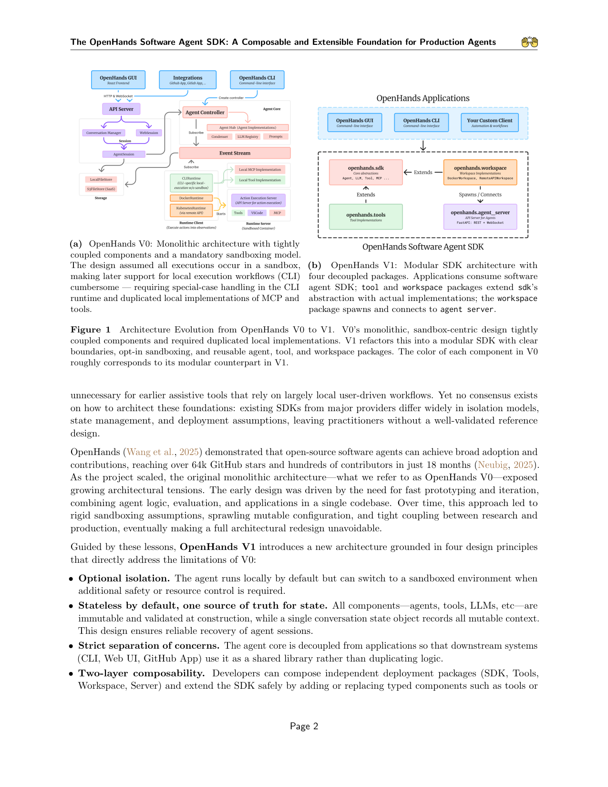
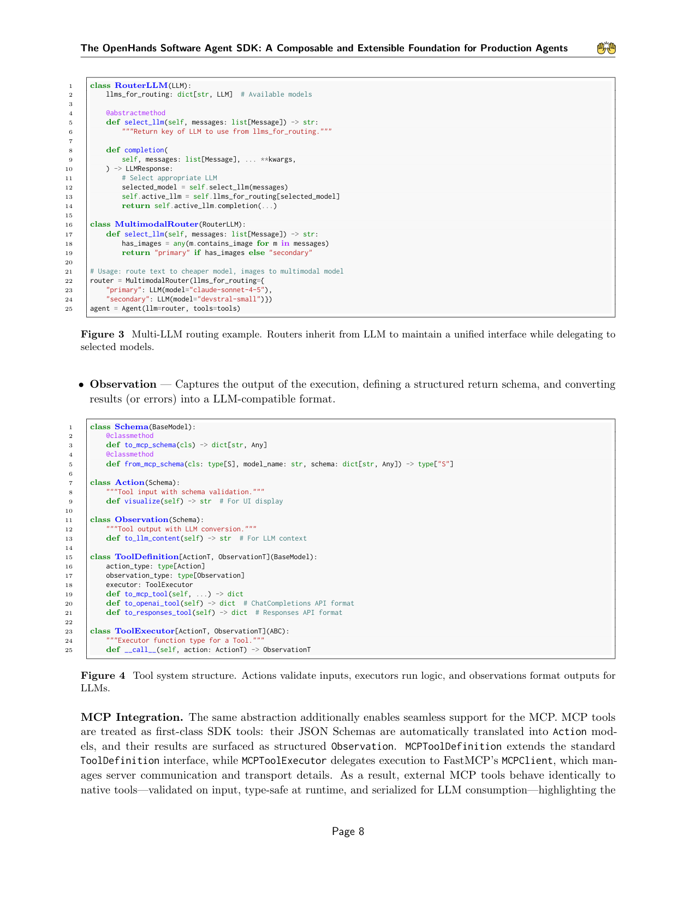

`openhands_sdk | The OpenHands Software Agent SDK: A Composable and Extensible Foundation for Production Agents | All Hands AI / OpenHands(Xingyao Wang, Graham Neubig 等) | MLSys 2026 录用, arXiv 2511.03690v2, 2026-04-22 | 主题线 L?(Agent harness / 生产级 SDK 基础设施)· 相关性 中(基础设施侧,非学习方法)`

> light 档笔记。基于真实 PDF 正文。三标注:【原文】【推断】【待核】。

══ 第一层:一眼看懂 [light] ══
- 🟦 **TL;DR**:【原文】造一个能上生产的软件工程 agent 很难——既要实现灵活、又要执行安全可靠、还要有人机交互界面。本文给出 **OpenHands Software Agent SDK**(对流行 OpenHands 框架 agent 组件的**彻底架构重构**,V0→V1),把 18 个月开源 + 生产部署的经验固化成一套**经验证的参考架构**:① 默认几行代码即可起一个 agent,又可扩展到带自定义工具/记忆管理的复杂 agent;② **事件溯源(event-sourcing)状态模型 + 确定性重放** + 不可变配置 + 带 MCP 集成的类型化工具系统;③ **workspace 抽象**让同一个 agent 在本地原型(无沙箱 CLIRuntime)与远程容器化安全环境(Docker/Kubernetes)间几乎零改代码切换;④ 自带 REST/WebSocket 服务器、可连 VS Code/VNC/浏览器/CLI/API 多种界面。相比 OpenAI/Claude/Google 的纯库式 SDK,它独有"原生沙箱执行 + 生产服务器 + 跨 100+ provider 的多 LLM 路由 + 动作安全分析器 + 内建 QA 探针 + 原生支持非 function-calling 模型 + Agent Skills"组合。
- **最巧的一步**:【推断,依据 §4.1/§4.2 + Fig1】把单体、强制沙箱的 V0 拆成**四个解耦 Python 包**(`openhands.sdk` 核心抽象 / `openhands.tools` 工具实现 / `openhands.workspace` 执行环境 / `openhands.agent_server` API 服务)+ 事件溯源核。抽掉模块化解耦,本地与远程、核心与工具又耦合回去,QA 瓶颈与"沙箱假设拖累 CLI"的老问题复发——这是从 V0 痛点反推出的关键设计。

══ 第二层:为什么做 ══
- **研究背景**:【原文 §1】软件工程里 AI agent 从辅助工具(Copilot/Cursor)进化到能自主跑数小时复杂任务的系统(Devin/Claude Code/OpenHands)。生产级部署需要**持久状态管理 + 沙箱安全执行 + 跨环境(本地↔容器云)一致行为**这些系统底座,而早期辅助工具(本地用户驱动)不需要这些。
- **解决的具体痛点**:【原文 §1/§4】造能上生产的 SWE agent 同时要满足三组互相拉扯的诉求:① **实现灵活**(便于实验/扩展自定义工具/记忆);② **执行可靠且安全**(沙箱、可恢复);③ **人机交互界面**(VS Code/VNC/浏览器/CLI/API)。OpenHands V0 是单体、**强制沙箱**架构:假设所有执行都在沙箱里,导致后续支持本地 CLI 执行很别扭——要在 CLI runtime 特判、并重复实现一套本地 MCP 与工具,组件紧耦合、QA 成本高。
- **相关工作 & 各自不足**:【原文 Table(SDK 对比)】OpenAI Agents SDK / Claude Agent SDK / Google Agent Dev Kit / LangChain-LangGraph:都是**纯库式 standalone SDK**,普遍支持 MCP/自定义工具,但**缺**原生沙箱执行、生产级 REST/WebSocket 服务器、跨 100+ provider 的多 LLM 路由、动作安全分析器、非 function-calling 模型原生支持等"生产侧"能力。差距在于它们面向"嵌入应用的库",而非"可独立部署、可恢复、可远程的生产平台"。
- **动机链**:【原文 §4】现状=V0 单体+强制沙箱 → 缺陷=本地/远程耦合、QA 瓶颈、组件复用差、归因失败多 → 所以必须**彻底重构(V0→V1)**为四包解耦 + 事件溯源 + 可选沙箱。为什么不用更简单做法(打补丁修 V0):作者明确说 V0 的耦合与沙箱假设是结构性的,使"完整架构重构不可避免"。
- **与最近邻的 Δ**:【推断,依据 Table 对比】最近邻是 Claude/OpenAI Agent SDK。关键 Δ=**把"原生沙箱执行 + 生产服务器 + 事件溯源可恢复 + 多 LLM 路由 + 安全分析器"做进 SDK 本体**,而非留给用户自己拼。这差异有用,因为生产可靠性与本地↔远程零改部署正是纯库式 SDK 的痛点。

══ 第三层:怎么做 + 靠不靠谱 ══
- **方法流水线**:【原文 §4】这是工程架构而非算法管线——四个解耦包咬合:① `openhands.sdk`(核心抽象:Agent/LLM/Tool/MCP + 事件流 + Condenser 上下文压缩 + LLM Registry);② `openhands.tools`(工具实现,extends sdk 抽象);③ `openhands.workspace`(DockerWorkspace/RemoteAPIWorkspace/CLIRuntime,负责本地↔远程执行,spawn/connect 到 agent server);④ `openhands.agent_server`(FastAPI REST+WebSocket 暴露 agent)。运行期:所有交互作为**不可变事件追加进 event stream**,单一 conversation state 对象记录全部可变上下文,支持确定性重放与暂停/恢复;Router 继承 LLM 维持统一接口做多 LLM 路由;NonNativeToolCallingMixin 让无原生 function-calling 的模型也能用工具。
- **逐组件必要性 + 四大设计原则**(原则即"为什么每件必要"的论证,【原文 §4】):① **Optional isolation**(默认本地、按需沙箱)——治 V0"强制沙箱拖累 CLI";② **Stateless by default, one source of truth**(组件构造时不可变并校验、单一 conversation state)——保证会话可靠恢复;③ **Strict separation of concerns**(agent core 与应用解耦)——CLI/WebUI/GitHub App 当共享库用、不重复逻辑;④ **Two-layer composability**(四包可独立组合 + 按类型安全替换工具/agent)。注:这是 SDK 论文,**无算法消融**;必要性靠"V0 痛点→V1 原则"的对照论证 + 生产数据支撑【推断】。
- **关键机制/直觉**:【原文 §4】**event-sourcing(事件溯源)**的直觉=把 agent 的全部交互记成一串不可变事件,任意时刻的状态都能由"重放事件序列"确定性重建——这同时给到"可恢复/可暂停续跑/可审计/可复现"四件事,且开销可忽略。这正是生产可靠性的核心机制(而非任何学习机制)。
- **实验与证据**:【原文 摘要/§5】两层实证:**系统层**——15 天生产对比,V1 比 V0 降低**系统归因失败 61%**,事件溯源开销可忽略;**能力层**——跨 **14 个 LLM** + 5 类基准(SWE-Bench Verified / GAIA / SWE-Bench Multimodal / SWT-Bench / Commit0)验证重构后 agent 性能不掉;模型分工:Claude 系主导 issue 解决与测试,**GPT-5.4 在长程 greenfield 开发领先 62.5%(+12.5pts)**。证据扎实(真实生产数据),但属"系统可靠性 + agent 能力"评测,非学习信号。代码与评测 harness 均 **MIT 开源**。
- **假设与失效边界**:【原文 Limitations】① 当前实现**聚焦单 agent 对话**——事件溯源天然支持多 agent 事件交织,但**多 agent 协调机制仍是 future work**;② 不可变配置为多租户访问控制提供基础,但**完整多租户安全审计待做**。【推断】它假设场景是"生产可靠 + 灵活部署的 SWE agent";不提供任何模型自进化/持续学习能力,若诉求是"让模型本身变强",该 SDK 只能当承载平台。
- **祛魅总结**:【推断】真贡献(硬货)=① 一套**经 18 个月生产 + 开源验证的参考架构**(四包解耦 + 事件溯源 + 可选沙箱 + 本地↔远程零改),并用 61% 失败下降这一硬指标背书;② 完整开源(SDK + 评测 harness,MIT)。包装/边界:它**不是研究方法论文**,无任何学习/进化贡献,"empirical validation" 指系统可靠性与能力评测;论文价值在工程参考与可复现实验底座,而非新算法。对自进化研究而言它是"地基"而非"楼"。

══ 机制速览 6 轴 [light] ══
| 维度 | 内容 |
|---|---|
| 学什么信号 | 【原文】不适用——本文是 **SDK/基础设施**论文,不训练/不学习模型;模型被当黑盒接入(model-agnostic)。"empirical validation" 指系统可靠性与 agent 能力评测,非学习信号。 |
| 改什么 | 【原文】改 **harness/系统架构**(事件流、工具系统、workspace、服务器);不改参数、不改 prompt 作为方法。 |
| 何时改 | 【原文】不适用(无在线/离线学习);运行期靠事件溯源记录交互、可确定性重放与暂停/恢复。 |
| 免梯度? | 【原文】不适用(无梯度,无训练)。 |
| 记忆-技能生命周期 | 【原文】"记忆"=事件溯源日志(所有交互作为不可变事件追加,可重放/恢复历史)+ Condenser 上下文压缩;技能=原生支持 **Agent Skills** 与 Context Files(repo.md/AGENTS.md)。无参数化记忆、无遗忘/淘汰学习机制。 |
| 防遗忘机制 | 【原文】不适用(非持续学习);可靠性靠事件溯源 + 确定性重放保证状态可恢复。 |

⑦ **开源代码 + 框架/harness**:【原文】Software Agent SDK: https://github.com/OpenHands/software-agent-sdk;Benchmarks: https://github.com/OpenHands/benchmarks(p0 明示)。框架=**它本身就是一个 agent harness/SDK**(自研,基于 Pydantic 类型化事件、FastAPI REST/WebSocket、Docker/K8s workspace);非训练框架。〔按 B 层只记录链接,未 clone。〕

💰 资源/成本与可扩展性:【原文】系统层:15 天生产对比 V1 比 V0 降低系统归因失败 **61%**,事件溯源开销可忽略;能力层:跨 **14 个 LLM** + 5 类 benchmark(SWE-Bench Verified/GAIA/SWE-Bench Multimodal/SWT-Bench/Commit0)验证重构后 agent 性能不掉(GPT-5.4 在 greenfield 开发领先 62.5%,+12.5pts)。可扩展性是其核心卖点(本地↔远程零改、多 LLM 路由 100+ provider)。

🎯 **对"探索-巩固"idea 对标** [light]:【推断】**基础设施底座 / 缺口对照**——与本项目"用 MTP 探针 + on-policy 蒸馏改模型参数"基本正交:它完全不触及学习,是承载 agent 运行的工程平台。可借价值在于:若要把"探索-巩固"做成可复现的 agent 实验,其**事件溯源 + 确定性重放 + workspace 本地↔远程一致**能为"训练轨迹采集 / on-policy rollout 复现 / 部署语义对齐"(正好呼应 agents_learn_runtime 的训练-推理对齐关切)提供干净的工程脚手架。无直接方法竞争。

🖼 **关键图 top-2** [light]:

这是**原文 Figure 1(Architecture Evolution V0→V1)**:一眼对比"旧单体 vs 新模块化四包"——选它因为这就是论文的核心贡献(重构),最能表现"可组合、可扩展的生产 agent 基础"。

这是**原文 Figure 3 与 Figure 4(同页)**:展示 SDK 类型化工具系统(Action/Executor/Observation 三件套)与多 LLM 路由的最小代码——选它因为它把"几行代码即可、又可扩展"的抽象落到实处。

【假设与失效边界一句】[light]:【推断,依据 §4 通篇 + Tab6 对比】假设目标是"生产可靠性 + 灵活部署"的软件工程 agent 场景;它不提供任何模型自进化/持续学习能力,若研究诉求是"让模型本身变强"(参数/技能层面的学习),该 SDK 只能当承载平台而非方法,本身不解决学习问题。
