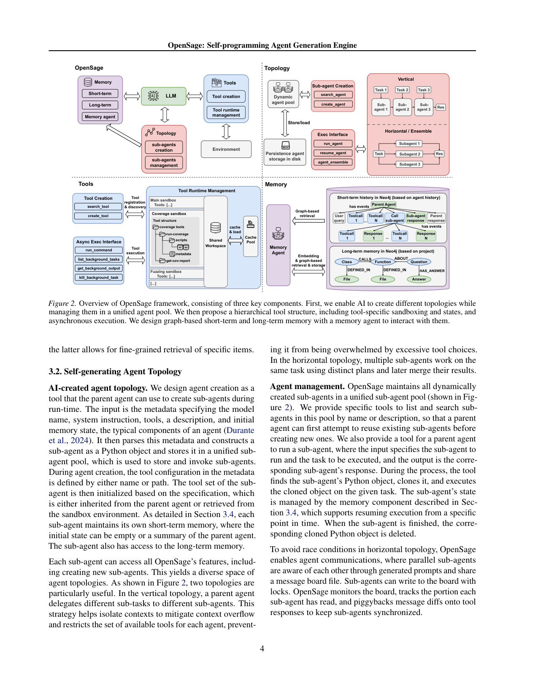
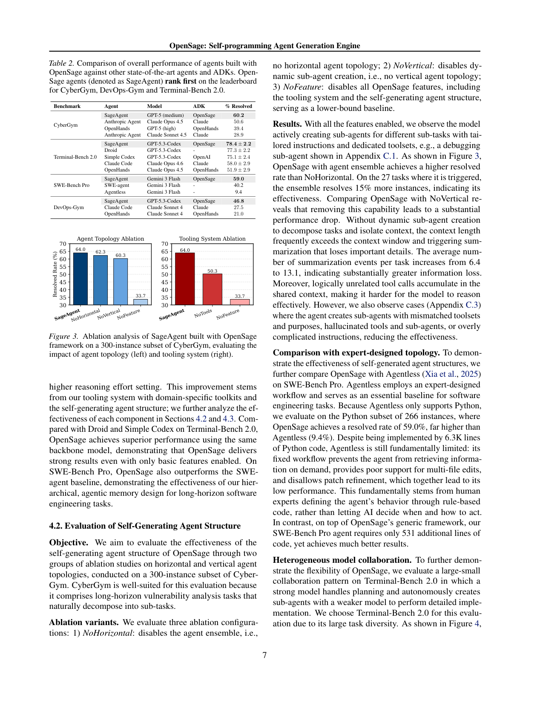

`opensage | OpenSage: Self-programming Agent Generation Engine | UC Berkeley（Dawn Song lab）+ UCSB（Wenbo Guo）+ UC Boulder + Columbia + Duke + Google DeepMind + UCLA（Hongwei Li, Zhun Wang 等共一）| arXiv:2602.16891v2 [cs.AI], 2026-03-12（preprint, March 16 2026）| 主题线：自进化 Agent 基础设施 / ADK（L? = harness-自构建线）· 相关性 高（"AI 自造拓扑/工具/记忆" 的 harness 级代表，与 live_swe_agent 互补）`

══ 第一层：一眼看懂 [light] ══

- 🟦 **TL;DR**：【原文 Abstract+§1】要解决的问题:现有 Agent 开发套件(ADK——如 Google ADK / OpenAI ADK / Claude ADK / OpenHands SDK / LangChain)的三大核心组件——**agent 拓扑(多 agent 结构)、工具系统、记忆系统**——**全靠人工设计**,既耗人力/领域知识、又因结构静态而泛化差。核心做法:**OpenSage——第一个让 AI 自己构建 Agent 的 ADK**(作者称"AI-centered" 范式,对标"human-centered")。它提供一个"最小但够用的脚手架",让 LLM 在运行时**①自生成 agent 拓扑**(父 agent 动态创建/管理/终止子 agent,支持垂直串行分解 + 水平并行 + ensemble 集成)、**②自写工具**(meta-tool 让 agent 现写新工具,分层文件系统组织 + 每工具独立 Docker 沙箱 + 异步执行 + SWE 专用静/动态分析工具包)、**③自管记忆**(基于 Neo4j 图的短期+长期分层记忆 + 一个专门的 memory agent 决定存什么/检索什么)。用 OpenSage 造出的 agent 叫 **SageAgent**,在 CyberGym(漏洞 PoC)、Terminal-Bench 2.0、SWE-Bench Pro、DevOps-Gym 四个 benchmark 上均登顶 leaderboard。
- **最巧的一步**：【推断,依据 §3.1+§4.2 消融】**把"agent 拓扑/工具/记忆"三者统一抽象成"agent 可调用的 tool / meta-tool"**(创建子 agent 是 tool、写新工具是 meta-tool、读写记忆是 memory agent 的 tool)——抽掉这层"自编程接口"统一抽象,OpenSage 就退化回普通 ADK。为什么是它:正是因为创建/管理子 agent、合成工具、操作图记忆**都用同一套 tool-calling 范式暴露给 LLM**,LLM 才能"自编程"地组合出任意拓扑与工具链(消融 NoFeature 全关时分数从 64.0 暴跌到 33.7,腰斩)。

══ 第二层：为什么做（写透） ══

- **研究背景**(§1)：AI agent 爆发式增长,需要高效的构建框架。ADK 提供构建 agent 的基础设施,其设计质量直接决定所造 agent 的效用与性能,核心由三组件决定:拓扑、工具、记忆。
- **解决的具体痛点**(§1, §2, Table 1)：现有 ADK 要么功能不足、要么靠人工设计三组件 → ① **拓扑**:无一支持 AI 自创拓扑,静态结构下父 agent 只能调预定义子 agent,子 agent 状态执行完即弃;② **工具**:Claude ADK 号称支持 AI 写工具但**未开源**且依赖感知弱、无分层组织难扩展;原生沙箱(仅 OpenHands/Claude)假设**单一共享执行环境**,无法容纳依赖冲突/异构运行时的工具;③ **记忆**:无一支持 AI 自创记忆,多为线性列表 + 纯 embedding 相似度检索。
- **相关工作 & 各自不足**(§2, Table 1 逐特征对比)：横轴 6 个 ADK(Google/OpenAI/Claude/OpenHands/LangChain) × 纵轴 8 特征(AI 创建拓扑/agent 管理/agent ensemble / AI 写工具/工具管理 / AI 创建记忆/图结构/AI 驱动管理)——**OpenSage 是唯一全支持者**;现有 ADK 在"AI 创建拓扑""AI 创建记忆"两列**全部不支持**。
- **动机链(类比 ML 史,很核心)**(§1, §3.1)：现状(ADK 三组件人工设计)→ 缺陷(耗人力、静态、泛化差)→ **类比**:"human-centered ADK ≈ 早期 ML 靠手工特征工程;现代 ML 只需基础架构 + 从经验/反馈学";所以应转向 **"AI-centered" 范式——给 AI 一个最小脚手架 + 自由,让它自己探索构建 agent**。为什么不用更简单做法(继续人工设计)?因为人工设计不可扩展、且静态结构无法跨任务动态适配。即便当前模型还不够聪明,OpenSage 也可作为**未来更强 AI 的训练环境/脚手架**(§3.1,呼应其 future work 接 verl/AReaL 训练)。
- **与最近邻的 Δ**：
  - vs **Claude ADK(最像,也号称 AI 写工具)**:【原文 §2】Claude ADK 实现未开源、依赖感知弱、无分层组织、假设单一执行环境;OpenSage 有完整工具管理 + 每工具 Docker 沙箱 + 异步 + 分层发现,支持异构依赖工具共存。
  - vs **Mem0g(SOTA 图记忆)**:【原文 §4.4, 图5】Mem0g 节点关系**硬编码**、节点类型全靠模型瞎编无法 list/约束 → 在 SWE-Bench Pro 几乎不比 NoMem 强(56.4 vs 56.2);OpenSage 给 coding 任务**预定义节点/边类型**(Class/Function/File 的 CALLS/DEFINED_IN 等)又允许 AI 新建类型且可枚举 → 真正"AI 创建 + AI 驱动"记忆,达 59.0。
  - vs **Agentless(专家设计 workflow)**:【原文 §4.2】Agentless 6.3K 行 Python 固定 workflow,不能按需检索、不支持多文件编辑、不许 patch 精修 → SWE-Bench Pro Python 子集仅 9.4%;SageAgent 在 OpenSage 通用框架上**只加 531 行**就达 59.0%。差异关键:**让 AI 决定何时如何行动,而非专家用规则码死行为**。

══ 第三层：怎么做 + 靠不靠谱 ══

- **方法流水线**(§3, 图2)：输入任务 → 父 agent 在最小脚手架上 → ① **拓扑**:调 `create_agent`(输入 metadata:模型名/系统指令/工具集/描述/初始记忆)→ 解析为 Python 对象存入统一 **sub-agent pool**(可 search/register/run/resume);两种拓扑——**垂直**(分解串行子任务、隔离上下文防溢出)、**水平**(多子 agent 不同 plan 并行同一任务,经 `agent_ensemble` 集成;用带锁的 message board 防 race) → ② **工具**:meta-tool(`create_tool`/`search_tool`)让 agent 现写新工具(Python/Bash),分层文件系统组织(初始化只载顶层模块信息省上下文)+ 每工具集声明环境依赖 → OpenSage 自动配 **隔离 Docker 容器**(允许依赖冲突工具共存,commit 容器快照为 image 层缓存以省启动)+ **异步执行**(长任务后台跑、返回 handle 轮询) → ③ **记忆**:短期=Neo4j 图(AgentRun 节点 + Event 节点记 tool call/response,长输出摘要、上下文涨太大时压成 summary event)、长期=独立 Neo4j 图(实体节点 Class/Function/Question + 关系边,跨任务共享)、**memory agent** 作桥(收自然语言指令→判短/长期→检索/增删改,长期支持图检索+embedding 双机制)→ 输出解。
- **逐组件必要性(消融充分,亮点)**：
  - **垂直拓扑(动态创建子 agent)**(图3左)：去掉(NoVertical)64.0→60.3,且**每任务摘要事件从 6.4 涨到 13.1**(上下文频繁超窗、触发摘要丢信息)。✅有消融且有机制度量。
  - **水平拓扑/ensemble**(图3左)：去掉(NoHorizontal)64.0→62.3;在被触发的 27 个任务上 ensemble 多解 **15%**。✅有消融。
  - **工具系统**(图3右)：去掉(NoTools→裸终端)64.0→50.3;在 300 题子集上 OpenSage 自造了 **39 个 Python/C++ 工具**(语法感知 fuzzer、种子生成/变异、文件格式专用输入生成器)。✅有消融且有实证产物。
  - **全特征(NoFeature)**:全关 →33.7(腰斩),作下界。
  - **记忆**(图5)：OpenSage 分层记忆 59.0 > Mem0g 56.4 ≈ NoMem 56.2 → 证明**AI-driven 记忆管理才是增益来源,单纯换图结构(Mem0g)几乎无用**。✅有消融且对照 SOTA。
- **关键机制/直觉**：
  - **图记忆为何强**:短期图天然映射"动态子 agent 的层级执行结构"(每建子 agent 加一个 AgentRun 节点 = 隔离记忆实例),简化动态 agent 的状态管理;长期图用预定义+可扩展的类型化节点/边,使结构化代码知识(类-函数-文件调用关系)可被精确检索,补 embedding 相似度之短。
  - **沙箱为何关键**:异构工具(需不同编译/运行时、有依赖冲突、长跑如 fuzzing/编译)无法共享单一环境 → 每工具独立 Docker + 快照缓存 + 异步,这是现有 ADK 做不到 AI 自造工具的根因(§4.3 明说"tight coupling between tool creation/management/execution 解释了为何现有 ADK 撑不起异构动态工具集")。
- **实验与证据**：
  - 数据集:**CyberGym**(1507 真实 C/C++ 漏洞,造 PoC;测拓扑+工具)、**Terminal-Bench 2.0**(89 专家终端任务,测跨域泛化,5 trials)、**SWE-Bench Pro**(266 Python 任务,测长程记忆)、**DevOps-Gym**(705 任务 + 17 端到端流水线,测完整 DevOps)、LOCOMO(长对话记忆,附录 D)。
  - **支撑核心主张的关键实验**:① **Table 2 主结果**——SageAgent 在 CyberGym(60.2 GPT-5)/Terminal-Bench 2.0(78.4 GPT-5.3-Codex)/DevOps-Gym/SWE-Bench Pro 多 backbone 下**均登顶**;尤其 **DevOps-Gym 端到端流水线 SageAgent 17.7% 而所有 baseline 全 0%**(唯一能解端到端的)——这是最有冲击力的差异化证据。② vs OpenHands(同 backbone 更高推理预算)CyberGym 高 20%+。③ **大-小模型协作**(图4):Gemini3Pro 规划 + GPT-5Mini 执行,**精度逼近 GPT-5 而成本低于单用 Gemini3Pro**——展示拓扑灵活性的实用价值。
  - **baseline 公平性**【推断,依据 §4.1】基本公平:对标用 leaderboard top agent + 同 backbone(如 OpenHands 用同模型甚至更高推理预算),Agentless 对照用其唯一支持的 Python 子集。Terminal-Bench 2.0 跑 5 trials 报均值±std,较严谨。
  - **"看着强但没回答核心问题"的隐忧**【推断】:(1) 不同 benchmark 用不同 backbone(CyberGym 用 GPT-5、Terminal-Bench 用 GPT-5.3-Codex、SWE-Bench Pro 用 Gemini3Flash/GPT-5.3),**SageAgent 的增益与 backbone 强弱混杂**,难干净归因到 OpenSage 框架本身;Table 2 同 backbone 对照(如 Gemini3Flash 上 SageAgent 59.0 vs SWE-agent 40.2)部分缓解。(2) 主结果各 benchmark 的 SOTA 数字用了不同(且各自最优)backbone,有 cherry-pick 嫌疑。(3) Terminal-Bench 2.0 上**主动关掉了自生成拓扑**(因任务简单+资源约束下并行反而亏),说明核心卖点"自生成拓扑"**并非处处有用**——这点论文诚实披露了。
- **假设与失效边界**：
  - 【原文 §1 结尾, §4.2 附录 C.3】**强依赖底座模型能力**:SOTA 模型"尚不能一致地利用或会误用"这些高级特征——观察到 agent **造出工具集与用途不匹配、幻觉工具/子 agent、指令过度复杂**等失效,降低效果。作者直言"需要更强的 AI 才能完全释放潜力"。这是明确的失效边界。
  - 【原文 §4.1】**自生成拓扑非普适**:任务简单或资源严格约束(如密码暴破的 CPU 限制)下,并行探索反而增开销 → Terminal-Bench 2.0 上主动禁用拓扑。
  - 【推断】重度依赖 Docker/Neo4j 等重型基础设施(每工具一容器、记忆全在 Neo4j),部署门槛与运维成本不低;对无法容器化的环境不适用。
- **祛魅总结**：
  - **真贡献(硬货)**:(a) **第一个把 agent 三大组件全部"AI 化"的 ADK**,且工程扎实(每工具 Docker 沙箱 + 快照缓存 + 异步 + 图记忆 + memory agent),解决了现有 ADK 撑不起异构动态工具集的真实痛点;(b) **消融非常充分**(拓扑/工具/记忆各自独立消融 + 对照 Mem0g/Agentless + 给出机制度量如摘要事件 6.4→13.1、自造 39 工具),证据链强;(c) DevOps-Gym 端到端 17.7% vs 全员 0% 是硬差异化结果;(d) 诚实披露失效(模型误用特征、拓扑非普适)。
  - **包装/营销成分**【推断】:(1) "self-programming / self-evolving agent" 名号偏大——OpenSage 当前是**单任务内的自构建(self-construction)**,**不跨任务进化、不更新参数**;真正的"自进化"(跨任务保留改进、训练内化)全在 future work(接 verl/AReaL 训练)。"self-evolving" 更多是愿景而非已实现。(2) "AI-centered 取代 human-centered" 的 ML 史类比修辞动听,但 OpenSage 本身仍是**人工设计的脚手架/接口**——只是把"组件实例化"交给 AI,框架骨架仍是人写的。(3) 主结果跨 benchmark 换最优 backbone 取 SOTA,需读者注意归因。

══ 结构化抽取 ══

- 🎯 **机制速览 6 轴** [light]：

| 维度 | 取值 |
|---|---|
| **学什么信号** | 环境 reward（测试/执行/PoC 成功反馈）+ 自反思（造工具/建子 agent 的决策）；**无人类标注、无离线训练信号**（当前推理时；future 拟接 RL/SFT 训练） |
| **改什么** | **harness 全栈** —— 拓扑（子 agent 结构）/ 工具（自写脚本工具）/ 记忆（图节点边）；**不改模型参数** |
| **何时改** | **在线 per-step / per-task**（解题过程中动态创建子 agent、现写工具、读写图记忆） |
| **免梯度?** | **是**（纯 test-time 自构建，零训练；future work 才接 verl/AReaL/LlamaFactory 做训练） |
| **记忆-技能生命周期** | 写入=memory agent 存图节点 / 造工具存文件系统 / 建子 agent 入 pool → 检索=图检索+embedding 双机制 / 工具分层发现 / sub-agent pool search → 遗忘=短期自动摘要压缩、memory agent 删冗余节点；子 agent 完成即删克隆对象 → 共享=**长期记忆跨同一 target 任务共享**、子 agent 间 message board 通信 |
| **防遗忘机制** | **隔离 + 摘要**为主：每子 agent 隔离记忆实例（图加节点）防上下文互污；上下文涨太大时摘要压缩（NoVertical 时摘要事件 6.4→13.1 即信息丢失加剧）；长期记忆 memory agent 只持久"非冗余、相关"知识。**无参数级防遗忘**（无参数更新） |

- ⑦ **开源代码 + 框架/harness**：**论文内未找到自身代码发布链接**(正文/脚注/参考文献中所有 github 链接均指向 baseline/工具依赖如 OpenHands/Agentless/AFL++/Joern,**未见 OpenSage 自身仓库 URL**)。【原文未提供 code 链接——〔待核〕是否有匿名/后续发布】。**框架/harness**:OpenSage **本身就是一个 ADK(自研框架)**,底层依赖 **Docker**(工具沙箱)+ **Neo4j**(图记忆)+ text-embedding-3-small(embedding);**当前无训练**,future work 明确计划接入 **AReaL / verl / LlamaFactory** 做 post-training rollout + Kubernetes 沙箱并行采数训练。〔无仓库可 clone——本子代理仅 PDF 深读;代码可达性待核。〕
- 💰 **资源/成本与可扩展性**：【原文 §3.3+§4】重型基础设施:每工具一 Docker 容器(用 image 层快照缓存省启动)、记忆全在 Neo4j、长任务异步后台跑。成本数据:图4 给出 Terminal-Bench 2.0 上**大-小协作(Gemini3Pro+GPT-5Mini)成本约 \$0.39 < 单 Gemini3Pro \$0.42**,且精度匹配 GPT-5 —— 拓扑灵活性可降本。**可扩展性**:分层工具发现 + 异步执行为"很多工具/长跑工具"设计;future 用 K8s 并行跑大量环境采数。整体部署门槛高于 live_swe_agent(后者仅 100 行 bash scaffold)。
- 🎯 **对「探索-巩固」idea 对标** [light]：**可借组件 + 竞品对照**。
  - **可借组件/支撑**:(a) **"长期记忆跨同一 target 任务共享 + memory agent 决定存什么"** 是一个清晰的"巩固"载体——本项目可借鉴"先派子 agent 探索 codebase 填充长期记忆,再解题时读写"的**显式探索→巩固→复用两阶段**(§4.1 SWE-Bench Pro 设置);(b) 图结构记忆(类型化节点/边 + 双检索)可作"巩固成结构化知识"的具体实现参考;(c) 大-小模型协作(强模型规划/弱模型执行)与本项目"教师脚手架 + 学生执行"有呼应。
  - **竞品对照**:与 live_swe_agent 一样,OpenSage 是**纯外化、免梯度**路线的强证据——证明"AI 自构建拓扑/工具/记忆"无需训练即可登顶多 benchmark。【推断】这再次构成对本项目"巩固进参数(MTP+OPD)"的反方论据。但 OpenSage 的两个失效边界恰是本项目立足点:① **强依赖底座模型(弱模型会误用特征/幻觉工具)**——本项目目标是提升模型本身的推理能力;② **当前不跨任务进化、不内化进参数**(全在 future work)——本项目正是要做参数内化。
  - **缺口**:OpenSage 完全不碰"推理过程/CoT 路径"的巩固(它构建的是 agent 系统结构,不是推理能力);防遗忘仅靠隔离/摘要,无参数级机制。这些是本项目差异化空间。
- 🔭 **开放问题/未来方向**：
  - 【原文 §5】① **AI 生成 workflow**:让 LLM 自定 agent 间依赖与通信协议、构建并行 workflow;② **接入模型训练**:提供 rollout 接口对接 **AReaL/verl/LlamaFactory** 等 post-training 框架 + K8s 沙箱并行跑环境,**大规模真实任务采数训练**——即从"自构建脚手架"走向"自进化(训练内化)"。
  - 【推断】②正是本调研最关注的桥梁:OpenSage 自承当前只是"训练环境/脚手架",真正的自进化需把外化经验**内化进参数**——这与本项目方向一致,且 OpenSage 可能成为这类"用 agent 自构建轨迹训模型"工作的基础设施。
- 🖼 **关键图 top-2** [light]：

· 这是**原文 Figure 2**(整页 p.4 渲染)。左上=OpenSage 核心(LLM + Memory/Tools/Topology 三模块);右上=拓扑(create_agent/run_agent/agent_ensemble,垂直串行 vs 水平并行);左下=工具运行时(主沙箱/coverage 沙箱/fuzzing 沙箱 + 异步接口);右下=记忆(短期 Neo4j 按 agent 历史建图 + 长期按 project 建实体关系图 + memory agent 双检索)。**选它因为一图说清本文唯一核心**(三组件全部 AI 化的自编程架构),是方法主图。

· 这是**原文 Table 2 + Figure 3**(整页 p.7 渲染)。Table 2:SageAgent 在 CyberGym/Terminal-Bench 2.0/SWE-Bench Pro/DevOps-Gym 多 backbone 下均居榜首(Terminal-Bench 2.0 达 78.4±2.2);Figure 3 双消融柱状图——拓扑与工具任一组件去掉都显著掉分,全关(NoFeature)腰斩到 33.7。**选它因为它同时给出"登顶 SOTA"与"每组件必要性消融"两条最硬证据**,支撑全文核心主张(AI-centered 三组件各自有效且缺一不可)。

---
〔元数据核验〕arXiv:2602.16891v2，cs.AI，标题/作者(Hongwei Li, Zhun Wang 等共一；机构 UCSB/UC Berkeley/UC Boulder/Columbia/Duke/Google DeepMind/UCLA)/日期(2026-03-12 v2, preprint March 16 2026)均来自下载 PDF 正文首页,非 WebFetch。关键数字(CyberGym 60.2 / Terminal-Bench 78.4±2.2 / DevOps-Gym 端到端 17.7% vs 0% / SWE-Bench Pro Python 59.0 vs Agentless 9.4 / 消融 64.0→60.3/50.3→33.7 / 自造 39 工具 / 摘要事件 6.4→13.1 / Mem0g 56.4≈NoMem 56.2)均直引正文 Table 2 与 §4。图号(Figure 2/3, Table 1/2)直引。代码链接经全文 regex 检索未见 OpenSage 自身仓库 → 标注"未找到"。
