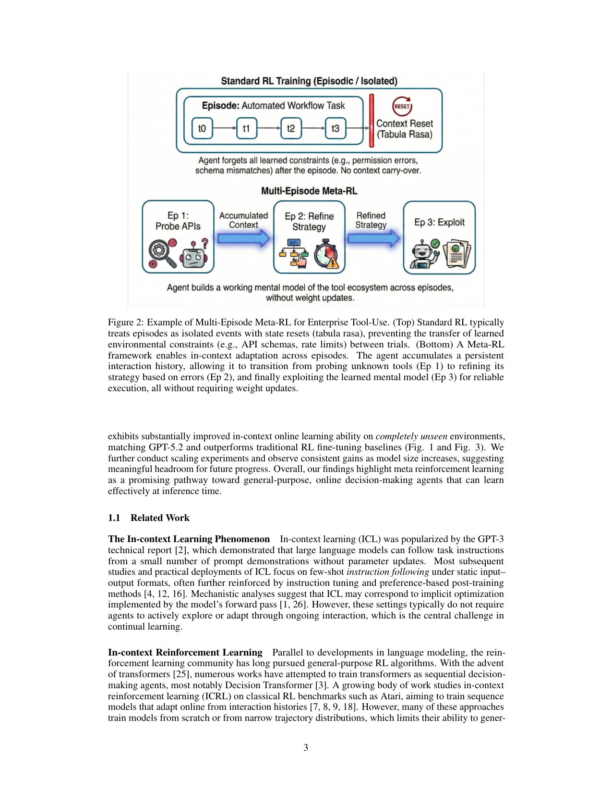
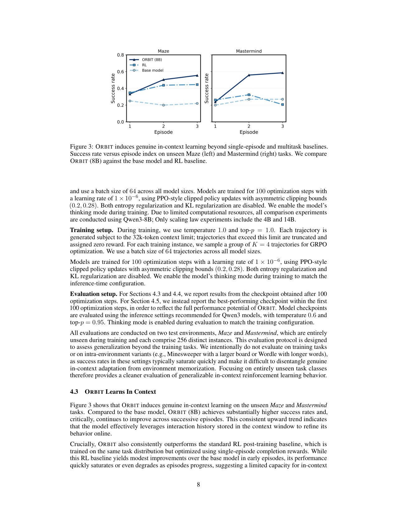

`orbit_metarl | ORBIT: Scaling In-Context Online Learning Capability of LLMs via Cross-Episode Meta-RL | Boston University + LinkedIn(Xiaofeng Lin, Sirou Zhu;Aldo Pacchiano/Xuezhou Zhang 组) | Preprint(under review);arXiv:2602.04089v1 [cs.AI] 2026-02-03 | 主题线 L?(in-context 在线学习 / 免梯度 test-time 适应)·相关性 High`

> deep 档笔记(由 light 升级:保留第一层/6轴/图/对标,补第二+三层)。基于已下载 PDF 正文(`resource/papers/orbit_metarl.pdf`,18 页)与渲染图。三标注:【原文】/【推断】/【待核】。
> 〔light 档勘误〕主实验基模实为 **Qwen3-8B**(§4.2),"Qwen3-14B 追平 GPT-5.2"是 scaling 研究的最大规模 + 摘要 headline;比较实验全用 8B(算力受限)。下文已修正。

══ 第一层:一眼看懂 ══
- 🟦 **TL;DR**:人类玩新游戏几轮试错就上手,但 LLM"出厂即静态"——部署后很难靠继续交互变强。ORBIT 用 **跨 episode 的多任务 meta-RL** 来训模型"学会在上下文里学习":同一个任务给 agent 多次机会(每次环境重置但规则不变),把**前几轮的完整交互历史都留在 context 里**,用长期累计 reward 当目标训练。训完后,小开源模型 **Qwen3-14B 在完全没见过的新环境(Maze、Mastermind)上**的 in-context 在线学习能力大涨,追平 GPT-5.2、远超普通 RL 微调,且**测试时不改一个权重**。【原文 Abstract/Fig1】
- **最巧的一步**:**跨 episode 拼接 history + 多 episode 的长期 reward 目标**(而非单 episode tabula-rasa)。抽掉"把前几轮轨迹留在 context 并对跨 episode 累计回报优化"这一点,训练信号就退化成普通单局 RL,模型只会"解这一局"而非"学会跨局探索-利用",in-context 在线学习能力就不会涌现。作者刻意**不加外部记忆/不加复杂反思 prompt**,就是为了隔离证明"光靠 multi-episode meta-RL 就够"。【原文 §1/§2】

══ 第二层:为什么做(写透,重点) ══
- **研究背景**:LLM 在"信息一次给全"的静态任务(预测/指令跟随)上很强,但真实决策任务多是**在线**的——关键信息要靠交互获取、反馈延迟、需在"收集信息"和"利用信息"间权衡。ICL(GPT-3 起)虽能不更新权重就适应,但**现有 LLM 在这种序贯交互在线学习上很不可靠**(Fig1:连前沿模型都难稳定利用 context 内经验)。模型"出厂即静态"(static-after-shipping)是通用 agent 的大障碍。【原文 §1】
- **解决的具体痛点**:聚焦一个实际常见的在线学习设定——agent 被部署去解一个不熟悉任务(新界面/未知环境/规则没说全),**第一次尝试常因隐藏约束而失败,但任务不变、可多次重试**(每次重置初始态、动态不变)。一个合格学习者应把早期尝试当"信息收集机会",用观察改进后续。作者称之为 **multi-episode in-context online learning**:跨同一任务的多次 trial 适应,只靠 context 里的交互历史、不更新参数。痛点=**当前 LLM(含前沿模型)做不到这个**(实证 Fig1)。【原文 §1】
- **相关工作 & 各自不足**(四条线):
  · **ICL 现象学**(GPT-3 起 + 机理分析说 ICL≈forward pass 隐式优化):但都是静态输入-输出,不需主动探索/序贯适应;
  · **In-context RL(ICRL)**(Decision Transformer、Algorithm Distillation 等):多从零训或窄轨迹分布训→难泛化到未见任务;而从预训练 LLM 起步有强语义/推理先验;
  · **LLM 作 in-context 在线学习者**(多臂老虎机研究):发现 frontier 模型探索行为脆弱/不一致;
  · **靠 self-gen 数据后训提升 ICRL**:Iterative RMFT(Park,regret 选轨迹+迭代 SFT,只在 bandit 验证)、PAPRIKA(从采样轨迹构偏好做多轮后训,但 Mastermind 只有 2% 成功率)。**最近邻是 Yan et al.(PaceEvolve)的并发 meta-RL**——目标可视为 ORBIT 的"折扣版变体",但其评测**只在训练时见过的同环境**做,无法分离"真 ICL"vs"记住环境"。【原文 §1.1】
- **动机链**:现状=LLM 静态后即不再变强、纯 ICL 在序贯在线任务上脆弱 → 缺陷=要么从零训 ICRL(丢失语义先验、难泛化)、要么单 episode RL(只学会解一局、不学会"学") → 既然人类靠"几轮试错+记忆+推理"快速上手,**就把多任务多 episode meta-RL 直接套在预训练 LLM 上**:同一任务给多次机会、把前几 episode 全留 context、优化跨 episode 长期回报(等价最小化 in-context regret),逼模型把"如何探索-利用"内化成一个**由 forward pass 实现的 RL 算法**。为什么不用更简单的"加外部记忆/加 reflection prompt"?作者**刻意不加**(MemGPT 式记忆、RAG、summarization/reflection prompt 都不用),为的是干净隔离"光 multi-episode meta-RL 就足以涌现 ICRL"这一主张——这是与 Reflexion/MemGPT 路线的方法论分野。【原文 §1/§5】
- **与最近邻工作的 Δ**:① 与 **Yan et al.(PaceEvolve)** 的 Δ:目标几乎同(他们是折扣版),但 ORBIT 在**完全未见的任务类**(训 RPS/Minesweeper/Hangman/Wordle/Blackjack → 测 Maze/Mastermind)评测,故能证明是"真 ICL 泛化"而非记环境——这是关键差异,直接回应"是否只是记忆"。② 与 **PAPRIKA** 的 Δ:PAPRIKA 用偏好信号做后训,Mastermind 仅 2%;ORBIT 用 GRPO trajectory-level 完成度奖励,Mastermind Ep3 达 0.59。③ 与 **Algorithm Distillation 等 ICRL** 的 Δ:不从零训、起点是有语义先验的预训练 LLM,故能泛化到异构未见任务。【原文 §1.1/§4】

══ 第三层:怎么做 + 靠不靠谱 ══
- **方法流水线**(输入预训练 LLM + 多环境任务分布 → 输出会 in-context 在线学习的 meta-policy Π):
  1. **建模**:每任务=有限步 episodic MDP,部分可观测(环境参数如迷宫地图初始未知);agent 用参数 θ,只靠 context 内 transcript h_{e,t} 选动作(Alg.1 跨 episode 拼接);
  2. **多 episode 交互协议**:对固定 MDP 跑 T=3 episode,每 episode 重置初始态但保持 (P,r) 不变,**全程 transcript 留在 context**;
  3. **奖励设计**:**忽略环境的 process reward,统一用 0-1 完成度奖励**,轨迹级 reward = 该 trajectory 内成功完成次数 R(M;τ)=Σ I_t——避免不同任务奖励尺度不均导致梯度被某任务主导;
  4. **meta 目标**:max_Π E[R(M;τ)],等价于最小化 in-context regret(早 episode 牺牲即时回报换信息、后 episode 利用);
  5. **优化**:用 **GRPO**(组内 K=4 轨迹算相对优势,无 value function),PPO 式非对称 clip (ε_low=0.2, ε_high=0.28),**关掉 entropy 和 KL 正则**,开 thinking mode。【原文 §2/§3/§4.2】
- **逐组件必要性 + 消融**:
  · **跨 episode history(多 episode 结构)**:核心,无替代消融但有**对照基线**——"single-episode RL baseline"(同任务分布、单 episode 完成度奖励训)在 Fig3/Table2 早期略升、随 episode 推进**饱和甚至退化**(Mastermind Δ=−0.06),证明"必须多 episode 才学到 ICL"。【原文 §4.3 Table2】
  · **统一 0-1 完成度奖励(弃 process reward)**:论证性必要——作者论证若用各任务原生 process reward,尺度不均会让大尺度任务主导梯度;且引 Kimi K1.5 佐证"去 step-wise 信用分配反而鼓励多样推理路径、从最终结果学试错"。**无直接 A/B 消融**(标出:未做该消融)。【原文 §3.1/§3.2】
  · **GRPO 而非 PPO/actor-critic**:与稀疏 outcome 奖励匹配(GRPO 天然 trajectory-level、无 value function);属设计选择。
  · **关 entropy/KL 正则**:训练设置选择,无单独消融。【原文 §4.2】
- **关键机制直觉**:in-context regret RegT = T·J*−E[ΣG(e)] 这个目标"逼"出探索——要让总回报接近 T 倍单局最优,模型**不能**每局都贪心(否则前几局踩同样的坑),必须在早 episode 主动试新动作降低不确定性,把信息存进 context 供后续利用。Table4 量化验证了这点:**条件于前面失败**,ORBIT 在 Ep2 探索 4.69 个新状态、Ep3 探索 1.48 个,均高于 RL baseline(4.11/1.27)和 base(1.64/0.94)——即"失败后真的去试不一样的"。这种"reflect-and-adapt"是涌现的,**不靠显式 reflect 指令**(Table3 定性 trace 显示模型自发在 <think> 里总结前两局失败再换路线)。【原文 §2/§4.4 Table3/4】
- **实验与证据**:7 个游戏(训 5:RPS/Minesweeper/Hangman/Wordle/Blackjack;测 2:Maze/Mastermind,**完全未见**),训练 512 实例/任务、测试 256 实例。核心证据:① Fig3/Table2——ORBIT(8B)在两个未见任务上 Ep3 成功率 Maze 0.55(+0.33 vs base)、Mastermind 0.59(+0.32),且**随 episode 单调上升**;RL baseline Mastermind 反降(−0.06)→证明是真 in-context 适应而非更强静态策略;② Fig1——Qwen3-14B 追平 GPT-5.2、远超 RL 微调;③ Fig5——4B→8B→14B scaling,增益主要落在后期 episode(Ep3 涨最多、Ep1 几乎不涨,14B 的 Ep1 甚至略降)→佐证"大模型把早期 episode 更多用于探索"。**baseline 公平性**:RL baseline 用相同任务分布、相同 GRPO,只差"单 episode 完成度奖励 vs 多 episode"——这是最干净的对照,直接隔离 multi-episode 的贡献。**"看着强但没回答核心问题"的风险**:Fig1 与 GPT-5.2 比的是绝对成功率,但 GPT-5.2 未经 ORBIT 训练,这更像"小模型经训能追平大模型"的展示,非同条件对比(作者用意也确实是 headroom 展示)。【原文 §4.3/§4.5/Fig1/3/5/Table2/4】
- **假设与失效边界**:【原文】§5 明说受 **32k context** 限制只能短 horizon(每任务 3 episode);只训了 **5 个环境**。【推断】① 测试任务若有效信息塞不进 context window(长 horizon)→ in-context 适应失效(作者也指此为 future,需大 context 或 memory-augmented 模型);② 测试任务与训练分布差异过大(非"同类未见")→ 涌现的探索策略可能不迁移(Fig1 强调 unseen 但同类才有迁移);③ 任务必须"可多 episode 重复"(一次性任务无法用此协议);④ 统一 0-1 奖励在 process reward 确实有用的场景可能丢信号(作者承认是 trade-off)。
- **祛魅总结**:【推断】**真贡献(硬货)**:用最朴素的"多任务多 episode meta-RL + GRPO + 统一完成度奖励",**不加任何记忆/reflection 模块**,就让 8B 开源模型在**完全未见任务**上涌现出 genuine in-context online learning(Table4 的 ΔStates 是很硬的行为证据),并展示了 scaling headroom——干净、可复现(开源)、隔离实验做得好。**包装/可质疑**:① "追平 GPT-5.2"是 headline 营销味,非同条件对比;② 只 5 个训练环境、2 个测试环境、3 episode、32k context,**规模很小**,能否扩到真实长 horizon agent 任务完全未验证(作者诚实地全列为 limitation);③ "弃 process reward"的论证主要靠引用(Kimi K1.5)而非自身消融,稍弱。整体作者对局限的披露相当诚实,未明显高估。

🎯 **机制速览 6 轴** [light]
| 维度 | 内容 |
|---|---|
| **学什么信号** | 环境 reward(跨 episode 累计长期回报);适应所需的"信息"来自 **context 里的交互历史本身**(非外部记忆库、非显式反思)【原文 §1】 |
| **改什么** | **训练期改参数**(GRPO/policy-gradient,asymmetric clipping);**测试期不改参数**,只靠 context(forward pass 实现一个隐式 RL 算法)【原文 §2/Abstract】 |
| **何时改** | 训练:离线批量 meta-train 于多任务多 episode;**部署/测试:per-step in-context,免权重更新**【原文 §1】 |
| **免梯度?** | **混合**——meta-训练阶段需梯度(GRPO);**推理/适应阶段完全免梯度**(纯 in-context)【原文】 |
| **记忆-技能生命周期** | "记忆"=context window 内的跨 episode transcript;写入=每步追加(s,a,r);检索=注意力隐式读取;**无外部存储、无淘汰**(随 context 长度受限)【原文 §2 Alg.1】 |
| **防遗忘机制** | **不适用/隔离式**——非持续学习设定;适应靠 context 不动参数,故无灾难性遗忘问题;训练侧用 PPO 式 clipping 稳定【原文/推断】 |

🖼 **关键图 top-2** [light]

这是**原文 Figure 2**:上半=标准 RL 把各 episode 当孤立事件(state reset,tabula rasa),学到的环境约束(API schema、rate limit)无法跨 episode 传递;下半=meta-RL 让 agent 累积持久交互历史,从 Ep1 探查未知工具→Ep2 据错误修正→Ep3 利用已建心智模型可靠执行,**全程不改权重**。选它因为最直观地讲清"为什么要跨 episode"这一核心动机/机制差异。【原文图2】

这是**原文 Figure 3**:成功率 vs episode index,ORBIT 曲线随 episode 上升(真正"越试越会"),压过单 episode 和 multitask 基线。选它因为这是支撑"涌现出 genuine in-context online learning"核心主张的关键证据图。【原文图3】

══ 假设与失效边界(一句)══
- 【推断】核心假设是"训练任务分布足够多样,逼出通用探索-利用策略,且测试任务与之同构(可被 context 历史刻画)";若测试环境的有效信息无法塞进 context window(超长 horizon)或与训练分布差异过大,in-context 适应会失效——依据:§2 适应完全依赖 context transcript、Fig1 强调"unseen 但同类"才有迁移。

🎯 **对"探索-巩固"idea 对标**(一句)[light]
- **竞品 / 缺口对照**:ORBIT 代表"纯探索-在 context 内适应、**不做参数巩固**"的对立路线(刻意去掉外部记忆与权重更新)——与本项目"探索后巩固进参数(TSRD)"形成鲜明对照,可作为消融对标(证明"巩固进参数 vs 只留 context"的取舍);其"多 episode 累计回报逼出探索策略"的训练目标本身是可借的课程设计积木。

⑦ **开源代码 + 框架**:**github.com/XiaofengLin7/ORBIT**(论文 Abstract 明示 "Code reproducing the results... https://github.com/XiaofengLin7/ORBIT")【原文 p1】。**框架:RLLM(rLLM,Tan et al. 2025,Agentica/Berkeley 的 "A Framework for Post-Training Language Agents")**——原文 §4.2 明示 "All experiments are implemented using the RLLM training framework [23]"【原文 §4.2/ref23】(deep 档修正:light 档曾标"未点名",实已点名 rLLM)。算法=GRPO + PPO 式非对称 clip。
💰 资源/成本:主实验基模 **Qwen3-8B**(scaling 研究另含 4B/14B);**单节点 8× NVIDIA H100**(App E)【原文 App E】;训练 100 步、lr 1e-6、batch 64、组大小 K=4、温度 1.0;32k context 限制故每任务仅 3 episode;训练 512 实例/任务、测试 256 实例。【原文 §4.2/App E】
🔭 开放问题:【原文】随模型规模一致增益→"learn-at-inference-time"仍有大 headroom;真正的 continual learning(权重更新)仍是 open。【推断】context 长度天花板限制了可吸收的交互量,长 horizon/多任务混合下的稳定性与上下文成本未解。
