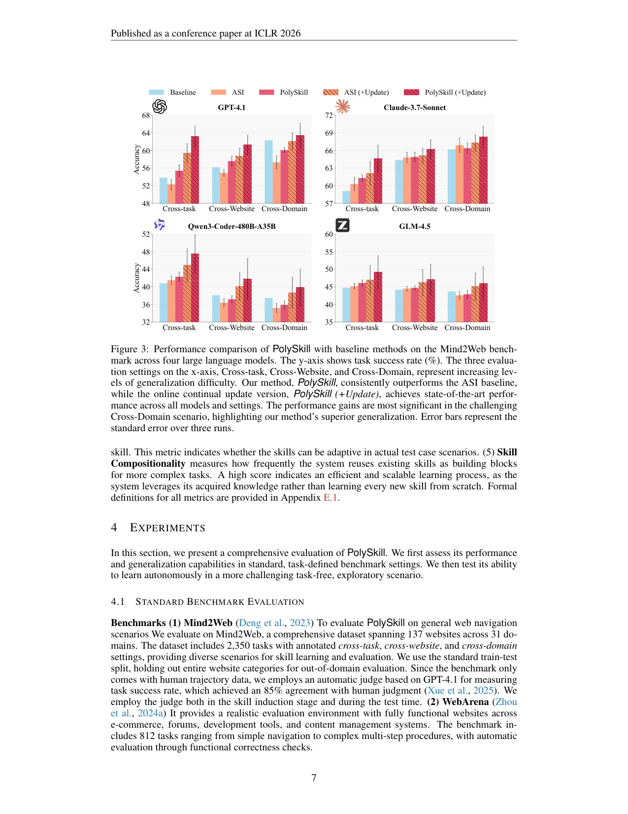
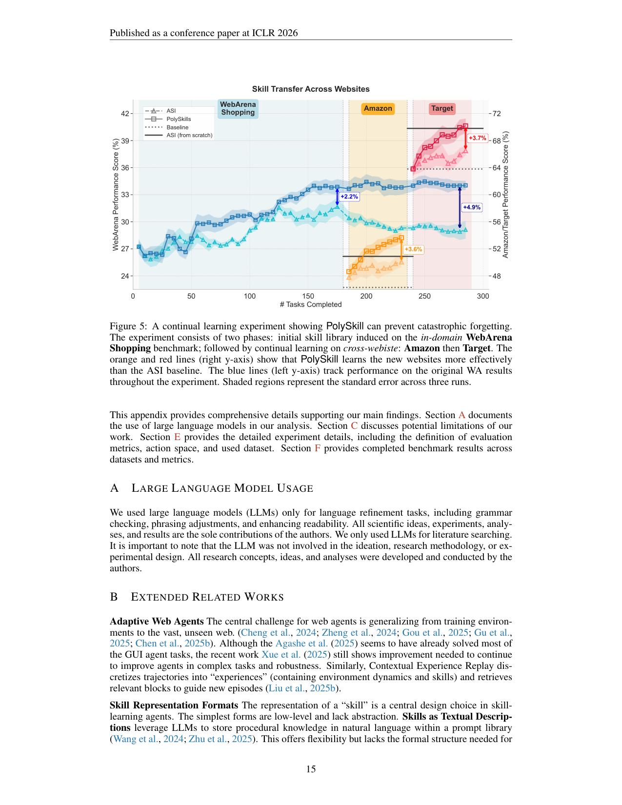

`polyskill | PolySkill: Learning Generalizable Skills through Polymorphic Abstraction for Continual Learning | Northeastern Univ. + Uniphore(Orby)(Simon Yu, Gang Li, Weiyan Shi†, Peng Qi†) | 2025-10(arXiv v2, 2510.15863, 2 Mar 2026)·ICLR 2026 (conference paper)·v2 | 主题线 L?(技能归纳/可组合技能 · web agent 持续学习,免梯度 prompting)·相关性 High`

> 一句定位:web agent 学到的"可复用技能"通常**过度特化到单个网站**(代码里写死了某站的 UI 选择器),换站就废、几乎不可迁移。PolySkill 借**软件工程的多态(polymorphism)**:把技能拆成**抽象目标(做什么)**与**具体实现(怎么做)**两层——定义一个域级**抽象类**(如 `AbstractShoppingSite.search(query)`),各网站是**具体子类**(`AmazonSite`/`TargetSite`)提供各自实现。这样 agent 在抽象层操作、组合技能(`find_and_add_to_cart`→`purchase_item`)**一次定义跨站复用**,新站只需"填空"实现抽象接口;并提出 **Skill Reusability / Task Coverage / Compositionality** 三个新指标直诊"技能到底有没有被复用"。在 Mind2Web/WebArena、4 个 LLM 上跨站成功率 +13.9%、复用率 18%→31%、步数 −20%,且**持续学习时不灾难遗忘**(比 ASI +4.9%)。

---

## ══ 第一层:一眼看懂 ══

- 🟦 **TL;DR**:让 web agent 从经验里归纳可复用技能(skill induction)是通向持续学习的路,但现有法(Agent Workflow Memory 用自然语言、ASI/SkillWeaver 用代码)都聚焦**同站跨任务**,学出的技能**过度特化**——代码里硬编码了某网站找元素的方式,换个布局就断。PolySkill 的核心:**把技能的"抽象目标"和"具体实现"解耦**(照搬 OOP 多态)。① 为一个域(如购物)先归纳一个**抽象类** `AbstractShoppingSite`,声明高层方法签名 `search_product(query)`/`add_to_cart`/`checkout` 以及**组合技能** `find_and_add_to_cart`/`purchase_item`(只依赖其它抽象方法,**不绑任何网站**);② 各网站(Amazon/Target/Walmart)作为**具体子类**继承抽象类,只填各自的具体实现;③ 到新站时,agent **检索抽象蓝图**当探索目标("我得弄清在这站怎么实现 search_product"),而非乱试,组合技能**无需重写**。整个归纳建在 **ASI 的"成功轨迹→归纳程序技能→重跑验证通过才入库"**管线上,只是把归纳重构成"先建抽象签名、再写具体实现"。结果:Mind2Web 跨域 +9.4%、未见网站 +13.9%、步数 −20%;复用率从 <18% 提到 31%(结语称 73% 技能可迁移);持续学习不遗忘。

- **最巧的一步**:**"先归纳域级抽象类(目标),再为每站填具体实现"这一步重构**。抽掉它(退回 ASI 直接归纳具体程序技能),技能就和单站 UI 绑死、跨站复用率 <9%(ASI)/<3%(SkillWeaver)(Fig.2)。它精妙在:**抽象接口稳定、实现可互换**——组合技能写在父类、只依赖抽象方法,所以"搜索→加购→结账"这套逻辑**一次写好跨所有购物站通用**,新站只需补三个原子方法的实现;同时抽象蓝图给新站探索一个**强先验/schema**(知道"该学哪几个技能"),把无指导探索变成结构化探索。这也是它在 task-free 自探索设定能赢的根因。

---

## ══ 第二层:为什么做 ══

- **研究背景**(§1):LLM 驱动的 web agent 导航复杂 GUI 完成用户目标;核心挑战是**泛化**——既要同站跨任务稳,又要把技能迁到同功能域的不同网站(如不同航司订票界面)。这要求 agent 从经验学习、面对新任务/新站能适应(呼应 Silver&Sutton "经验时代")。skill induction 是有希望的方向:Voyager 开端(开放环境)、Agent Workflow Memory 首证 web agent 可行(自然语言技能)、ASI/SkillWeaver 把技能结构化为**代码**更鲁棒。
- **解决的具体痛点**(§1–3.2,Fig.2 实证):现有 skill induction **只优化熟悉网站的性能 → 生成过度特化技能 → 跨站泛化几乎不存在**。两个具体毛病(Fig.2,在 WebArena Shopping 上测 ASI/SkillWeaver):① **学习不稳定**——SkillWeaver+Claude-3.7 随训练自提任务越来越复杂特殊、技能越来越 intricate、性能反而退化;② **泛化差**——未见网站上 Skill Reusability ASI<9%、SkillWeaver<3%。根因:这些技能**缺少把"语义意图"从"具体实现"抽离的机制**。
- **评估方法的缺口**(§1,§3.5):先前工作只看**最终任务成功率**——只告诉你 agent 成功了,**没告诉你"怎么成功的"**:分不清"高效复用学到的技能"还是"从零硬解"。所以无法度量 skill induction 的价值。PolySkill 补了 3 个新指标:**Skill Reusability**(技能在新任务被复用的次数)、**Task Coverage**(用了≥1 个技能的任务比例)、**Skill Compositionality**(复用已有技能作为更复杂任务积木的频率)。
- **动机链**:web agent 要泛化 → skill induction 是路 → 但代码技能绑死单站 UI、过度特化、换站废(Fig.2)→ 缺"目标 vs 实现"的解耦机制 → 借多态:抽象类定义稳定接口、子类提供可互换实现 → 抽象层组合技能跨站复用 + 抽象蓝图引导新站结构化探索 → 持续学习不遗忘(refine 抽象定义而非盲目堆技能)。为什么不用更简单法:自然语言技能(AWM)不鲁棒;具体代码技能(ASI/SkillWeaver)鲁棒但不可迁移;**只有"抽象+多态"同时拿到代码的形式严谨 + 泛化的灵活**。
- **与最近邻的 Δ**:
  - vs **ASI**(Wang 2025,**直接母体**,即本批 asi_progskill):ASI 归纳**具体程序技能**(同站跨任务),PolySkill **沿用 ASI 的归纳-验证管线**,但把归纳重构为"先抽象类签名、再具体实现",并加在线持续更新(+Update)。增益(Fig.3 跨域 +、Table 2 更少技能更高准确)纯隔离出"多态抽象"的贡献。
  - vs **SkillWeaver**(Zheng 2025,task-free 自探索 + 代码技能 honing):同走自探索,但 SkillWeaver 技能仍单站特化、自提任务发散致退化;PolySkill 的抽象蓝图把自探索变**结构化**、更稳。
  - vs **AWM**(Wang 2024,自然语言技能)/ Voyager(开放环境技能):表示更鲁棒(代码)且**可组合可继承**,弥补"代码片段/动作 trace 无法被原则性修改组合"的缺陷(§2 Continual Learning)。

---

## ══ 第三层:怎么做 + 靠不靠谱 ══

- **方法流水线**(§3,Algorithm 1):
  1. **问题设定**(§3.1):web 交互建模为 POMDP ⟨S,A_p,T,Ω,O⟩;LM 策略 π_L(a_t|o_t,M_t,K_t),工作记忆 M(任务指令 + 观测/动作历史)+ **动态技能库 K_t**;动作空间 A_t=A_p(原子动作 click/type)∪K_t(学到的技能);每个技能 k(args)=a_1⊕…⊕a_n 是参数化动作序列(可含其它技能 → 可组合)。目标:max E_q[g(τ,q)−γ|τ|],**效率惩罚 γ|τ| 鼓励紧凑可复用技能**——但**不当 loss 优化,只用来指导 prompting**(关键:全程免梯度)。
  2. **抽象类归纳(多态核心,§3.3)**:agent 首次进某域(购物)第一个网站时,**必须先归纳高层抽象类** `AbstractShoppingSite`(共同方法签名 + 组合技能);之后在具体站(amazon.com)归纳新技能时,**先在抽象类注册函数签名,再在站点子类 `AmazonWebsite` 写具体实现**。归纳 prompt 被重构成"先建通用抽象技能、再实现该站的具体 search 方法"。组合技能(`find_and_add_to_cart`/`purchase_item`)写在父类、只依赖抽象方法,**跨站无需重定义**(Table 1)。
  3. **归纳-验证管线(继承 ASI)**:Algorithm 1——对任务序列 Q,执行任务得轨迹 τ → **LM Judge V_L 验证 τ 正确**(g=1)→ 才 InduceSkill 归纳新分层技能入库 K_t=K_{t-1}∪K_new;失败则库不变。即"成功才学、且新技能需重跑验证通过"。
  4. **新站学习(§3.3)**:到同域新站(walmart.com),agent **检索抽象蓝图**当探索目标(知道要实现 search_product/add_to_cart),聚焦学这几个本质技能 → 成功后建 `WalmartWebsite` 子类填实现。**结构化探索**加速学习。
  5. **两种评估设定**(§3.4):(1) **Task-Defined**(Mind2Web/WebArena,预定义任务课程,严格测泛化);(2) **Task-Free 持续学习**(agent 自探索网站、自提目标、从成功归纳技能,抽象类作 schema 提供强先验)。
  6. **在线持续更新(+Update)**:测试期继续 induct/refine,技能库随新环境自然增长,但靠 refine 抽象定义而非堆冗余。

- **逐组件必要性**:
  - **多态抽象**:vs ASI,**Table 2** 静态设定 PolySkill 准确更高(55.4 vs 52.3)且技能库更小(43 vs 50);+Update 跨任务 SOTA 63.2% 仅 47 技能 << ASI+Update 66 技能 → 证"refine 抽象 > 盲目堆技能"。
  - **抽象蓝图引导探索**:**Table 3** task-free,自探索(Self-guided)在 held-out WA Shopping 拿最高 43.1%,超单域专家(过度特化、跨站复用<4%)与顺序课程(对顺序敏感)。
  - **防遗忘**:**Fig.5/Case Study** 持续学习——ASI 专精新站后**原 WebArena 性能显著退化**(干扰);PolySkill 原任务性能**稳定**(蓝线),最终 **+4.9% over ASI**。
  - **复用率↔步数**:**Fig.4** 三方法均呈复用率↑则步数↓(6.1→3.3–4.4),PolySkill 复用率最高(180 任务时 20.4%)——证技能复用直接转化为效率。
  - **未做的消融**【推断】:抽象类**首次归纳的质量**对全程影响、γ 取值敏感性,正文未系统消融;Reusability 等新指标的稳健性(LM judge 打分)依赖 GPT-4.1 judge(85% human agreement)。依据:§3.4 judge + 无 γ 消融。

- **关键机制直觉**:把"技能"从一次性脚本升级为**带稳定接口的类层级**。抽象类 = 一个域的"操作 schema/蓝图"(所有购物站都有 search/加购/结账这套语义);具体子类 = 各站的"驱动实现"。好处三连:① **组合技能写一次跨站通用**(只依赖抽象方法);② **新站迁移 = 填空实现**(不重学逻辑);③ **探索有先验**(知道该学哪几个方法)。多态(Milner 1978)本就是"管理实现间差异、维持稳定接口"的成熟范式,迁到 agent 技能恰好治"过度特化"。γ|τ| 效率项的直觉:逼 agent 造紧凑可复用的高层技能而非冗长动作链——但这里只用于 prompt 引导,非梯度优化。

- **实验与证据**(§4):
  - 数据集/设置:**Mind2Web**(137 站/31 域,2350 任务,标注 cross-task/website/domain,留出整个网站类别做 OOD,GPT-4.1 自动 judge 85% 一致)、**WebArena**(812 任务,功能正确性自动判)。4 个模型:**GPT-4.1、Claude-3.7-Sonnet(闭源)+ Qwen3-Coder-480B-A35B、GLM-4.5(开源 agentic)**。基线:Base(无归纳)/ ASI / SkillWeaver。环境 = **BrowserGym**;OSS 模型跑 8×H100,闭源走 API。
  - **支撑核心主张的关键实验**:① **泛化主图 Fig.3**——4 模型 × 3 难度(cross-task<website<domain),PolySkill 一致超 ASI,**+Update 全设定 SOTA**,**Cross-Domain 增益最大**(GPT-4.1 PolySkill+Update 63–64% vs ASI+Update 62%;Qwen3-Coder cross-task 41.5%→47.5%、cross-domain 35.2%→39.9%)→ 直接证"多态抽象提升最难的跨域泛化"。② **效率 Table 2**——更高准确 + 更小技能库(SOTA 63.2% 仅 47 技能)→ 证"不堆冗余、refine 抽象"。③ **防遗忘 Fig.5**——持续学习 +4.9% over ASI,原任务不退化 → 证多态天然抗灾难遗忘。④ **task-free 自探索 Table 3/9**——自探索 > 人工课程(Shopping held-out 43.1%;Coding GitLab 66.2%/GitHub 84.0%),且发现 WA OneStopShop 技能更富、迁移更好 → 证"agent 自己探索能学出比人工课程更泛化的技能"。⑤ **开源模型稳健**(Qwen3-Coder/GLM-4.5 同样有效)→ 不限于专有模型。
  - **baseline 公平性**:相对 ASI 是最干净对照(同归纳-验证管线,只改"是否多态")。**潜在不公/需注意**【推断】:(a) SkillWeaver 仅在 WebArena 子集评(Mind2Web 未评),对比不全面;(b) **成功率本身用 GPT-4.1 judge**(Mind2Web 无功能检查),judge 偏差可能影响绝对数;(c) 新指标(Reusability/Coverage/Compositionality)是作者自定义,跨方法可比性依赖统计口径。依据:§4.1 judge + §3.4 SkillWeaver 仅 WebArena。
  - **"看着强但没答核心问题"风险**【推断】:摘要/结语称"**73% 技能迁移**"(<31% prior),但正文实测 unseen websites Reusability 多在 **31%**(§1)与 20.4%(Fig.4)区间——"73%"可能是某特定设定/口径(Task Coverage 类),与"31% reuse"不是同一指标,**结语数字偏乐观、口径需对齐**。依据:§1 vs §5 数字不一致。

- **假设与失效边界**:
  - 【原文 §5.1 Future Work】**任务类别边界"模糊"的域**是软肋——当前抽象类靠**预定义标签/手动定义域**;边界不清时多态分组失效。提出未来用"执行 trace 软聚类"让抽象接口自发涌现。
  - 【原文】依赖**同功能域有共享结构模式**(购物站都有 search/加购/结账)——这是多态生效的前提;无共享结构的异质任务难套。
  - 【推断】**全程免梯度、靠 prompting**(γ 只指导 prompt)——能力住在"技能库 + LLM 上下文",**不进模型参数**;强依赖 backbone LLM 的代码归纳/遵循能力(故 4 个都是强模型/coding 模型)。弱小模型可能归纳不出干净抽象类。依据:§3.1 "use efficiency principle to guide prompting"、base 全强模型、§5.1 "envision enabling smaller models via RL"(说明现在做不到)。
  - 【推断】抽象类**首次归纳质量**是单点依赖——第一站若归纳出坏 schema,会污染整个域的后续学习;正文未给"抽象类纠错/重构"机制。依据:§3.3 "first website must first induce abstract class",无纠错描述。

- **祛魅总结**:
  - 真贡献(硬货):① **把 OOP 多态(抽象/实现解耦 + 继承 + 组合)系统地引入 agent 技能表示**——这是个干净、可迁移的"积木",直击"过度特化"且天然带防遗忘(refine 抽象 ≠ 改其它实现);② **三个诊断指标(Reusability/Coverage/Compositionality)** 填补"只看成功率看不出技能价值"的评估缺口,本身是社区可复用工具;③ **task-free 自探索 > 人工课程**(Table 3/9)是有意思的实证——抽象蓝图把无指导探索变结构化,指向自改进 agent。开源(github.com/simonucl/PolySkill)+ 4 模型 + BrowserGym,可复现性好。
  - 包装/营销成分【推断】:(a) "**73% 技能迁移**"(结语)与正文"31% reuse"(§1)口径不一,偏乐观;(b) "polymorphic abstraction" 名头大,**实质 = 重构归纳 prompt 让 LLM 先写抽象类再写实现** + 检索蓝图引导,**无梯度学习、无新算法**,更像一个**强 prompting/结构化工程范式**;(c) 增益虽一致但**绝对幅度温和**(多数 +3~9%),"major improvement in generalization" 措辞略强于数据;(d) 灾难遗忘"避免"也是**因为根本不改参数**(库级隔离),并非解决了参数级遗忘——对纯 in-context 系统而言遗忘本就轻。依据:§1/§5 数字、§3.1 prompting、Fig.3 幅度。

---

## ══ 结构化抽取 ══

- 🎯 **机制速览 6 轴**:

| 学什么信号 | 改什么 | 何时改 | 免梯度? | 记忆-技能生命周期 | 防遗忘机制 |
|---|---|---|---|---|---|
| **环境/任务成功 g(τ,q)**(LM Judge 验证)+ **效率原则 γ|τ|**(只指导 prompt,非梯度);**自提目标**(task-free 自探索)；**无人类标注/无 RL reward/无 teacher** | **改技能库 K_t**(归纳新的分层程序技能:抽象类签名 + 站点子类实现 + 组合技能);**LLM 参数完全不改** | **在线 per-task**(成功验证后归纳入库)+ **test-time 持续更新**(+Update,边测边 induct/refine);task-free 时 per-exploration-episode | **是(纯免梯度)**——全靠 LLM prompting 归纳/组合技能 + 检索,无任何梯度更新 | **写入**=成功轨迹经 Judge 验证 → 归纳抽象+具体技能入库;**检索**=动作空间 A_t=A_p∪K_t,新站检索抽象蓝图作探索先验;**遗忘/淘汰**=几乎不删(+Update 时库增长,但靠 refine 抽象定义压冗余,Table 2 技能数更少);**共享**=抽象类跨站/跨同域复用,组合技能跨站通用 | **多态隔离(库级)**:抽象接口稳定 + 各站实现互换,学新站只填新子类**不动其它实现** → 天然抗灾难遗忘(Fig.5 +4.9% over ASI,原任务稳定);**无参数级机制**(因不训参数,遗忘本就轻)|

- ⑦ **开源代码 + 框架/harness**:**已开源** https://github.com/simonucl/PolySkill(abstract line 34–35 明示;ICLR 2026 录用 + 复现声明)。**框架/harness = BrowserGym**(de Chezelles 2025,web agent 研究环境 API,§复现声明明示)。**无 RL/训练框架**——纯 prompting 范式(无 veRL/TRL 等);归纳建在 **ASI 的验证管线**之上;OSS 模型推理用 8×H100,闭源走官方 API。【原文 abstract + 复现声明】

- 💰 **资源/成本与可扩展性**:OSS 模型(Qwen3-Coder-480B/GLM-4.5)推理跑 **8×H100 集群**,闭源(GPT-4.1/Claude-3.7)走 API(Modal Lab/Thinking Machines Lab 赞助算力);**无训练成本**(免梯度)。主要成本 = LLM API/推理调用(每任务执行 + 归纳 + 验证重跑)+ LM Judge 调用。可扩展性优势:技能库**紧凑**(Table 2 比 ASI 少 20–30% 技能),步数 −20% 降推理成本;但每域需先归纳抽象类、依赖强 backbone。【原文】

- 🎯 **对"探索-巩固(TSRD/MTP+OPD)"idea 对标**:**可借组件 + 互补(非直接竞品)**。
  - **可借组件**:① **"抽象目标 vs 具体实现"解耦** 可迁到 TSRD 的 **path-recovery 技能库**——把"恢复策略的高层意图(如'回退到上个高置信分叉点重试')"做成**抽象 recovery 接口**,各任务/各错误类型作具体实现,使恢复技能**跨任务复用、组合**而非任务特化。② **三诊断指标(Reusability/Coverage/Compositionality)** 可直接量化 TSRD 学到的 recovery/path-selection 技能"是否真被复用",补足"只看最终准确率"的盲区。③ **抽象蓝图引导结构化探索**(知道该学哪几个技能)对应你"探索阶段不该盲目、要有 schema 引导"——可作探索先验。④ **task-free 自探索 > 人工课程**的发现支持 TSRD"让模型自提子目标形成更好课程"。
  - **互补/缺口**:PolySkill **纯免梯度、库级**,能力不进参数、**无 OPD 蒸馏、无 MTP 前瞻、无参数级巩固**;你的 TSRD 核心恰是把能力**蒸馏进参数**(OPD)+ MTP 前瞻探针。所以 PolySkill 可作 TSRD 的**外部技能组织层/探索 schema**,而"巩固进权重"由你的 OPD 完成。它的"多态防遗忘"对你**不直接适用**(你训参数,需真正的参数级防遗忘如 KL/merge/隔离),但"refine 抽象而非堆新"的思路可类比"巩固时复用/精化已有能力而非全新学"。

- 🔭 **开放问题/未来方向**:
  - 【原文 §5.1】(a) **自主技能聚类**——从手动定义抽象类转向 agent 按功能相似度软聚类执行 trace,让抽象接口自发涌现(治"模糊域边界");(b) **小模型经 RL 自主获取多态技能**——把 γ 从固定启发式变成 reward shaping 机制,学探索-复用最优权衡;(c) 高动态网站、agent 间技能共享、引入人类反馈。
  - 【推断】(d) 抽象类的**纠错/重构机制**(防首站坏 schema 污染);(e) 把多态从 web 推广到机器人/工具使用(作者明列,共享结构域);(f) 与参数级学习结合——当前能力不进参数,可探索"多态技能蒸馏进权重"以脱离对强 backbone 的依赖。依据:§5/§5.1 + §3.1 prompting-only。

- 🖼 **关键图 top-2**:

  
  这是**原文 Figure 3**(第 7 页):4 个子图(GPT-4.1 / Claude-3.7-Sonnet / Qwen3-Coder-480B / GLM-4.5),x 轴为递增泛化难度 Cross-task→Cross-Website→Cross-Domain,柱为 Baseline / ASI / PolySkill / ASI(+Update) / PolySkill(+Update)。PolySkill 一致超 ASI,**+Update 全设定 SOTA**,且**Cross-Domain(最难)增益最大**。选它因为它是核心证据图,跨闭源/开源 4 模型同时验证"多态抽象提升泛化、且越难越有用",直接支撑全文主张。

  
  这是**原文 Figure 5**(第 15 页):持续学习实验——技能库先在 WebArena Shopping 初始化,再在线更新到 Amazon→Target。橙/红曲线 = 新站(Amazon/Target)性能上升(强正迁移);蓝线 = 原 WebArena Shopping 性能,PolySkill **保持稳定**而 ASI 在专精新站后**显著退化**,最终 **+4.9% over ASI**。选它因为这是 PolySkill 区别于 ASI 的关键差异化证据:多态抽象(填新子类不动旧实现)天然抵抗灾难遗忘——与"探索-巩固"中"学新不忘旧"的诉求直接相关。
