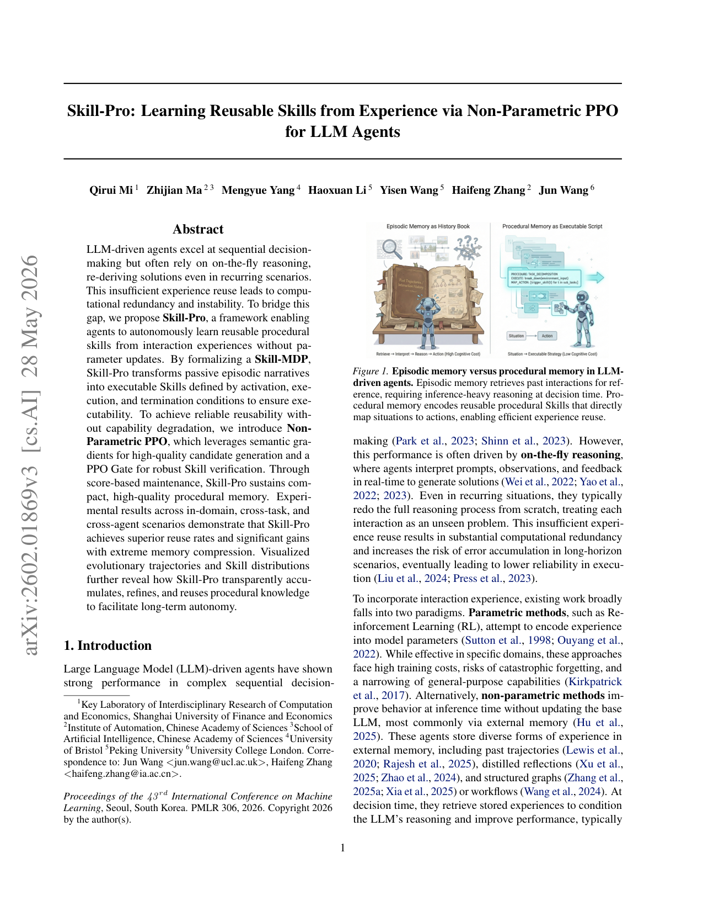
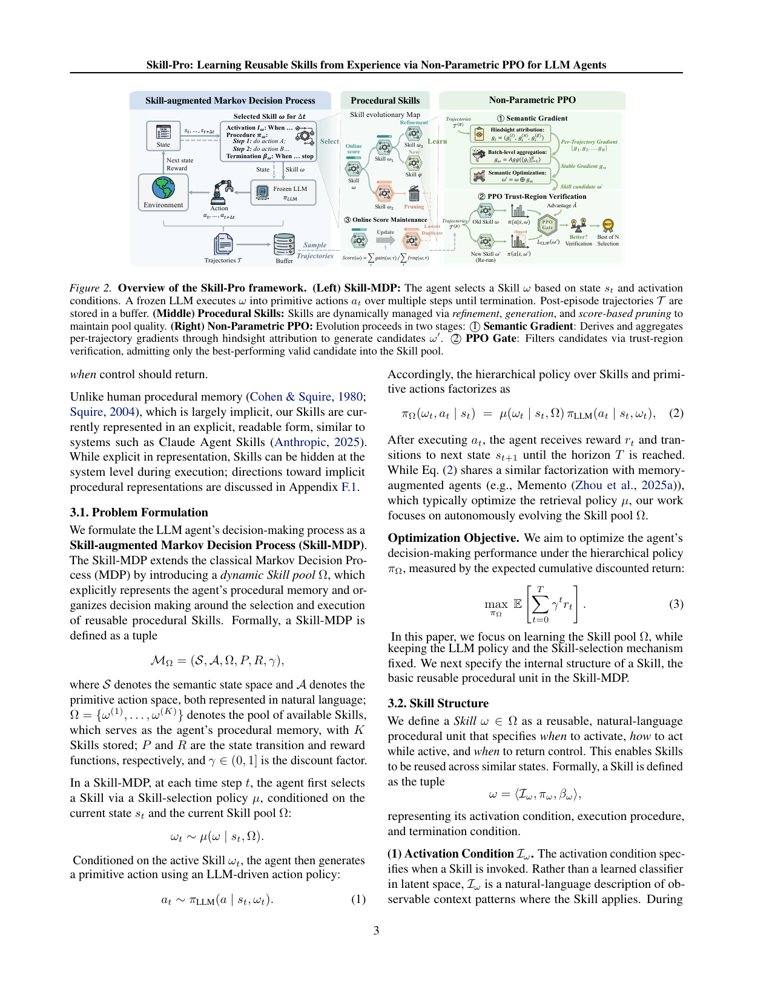

`procmem | Skill-Pro: Learning Reusable Skills from Experience via Non-Parametric PPO for LLM Agents | SUFE + CAS自动化所 + Bristol + 北大 + UCL (Qirui Mi, Jun Wang, Haifeng Zhang 等) | 2026-02(arXiv v3 2026-05-28)·ICML 2026 Spotlight·v3 | 主题线 L?(procedural memory/技能演进 · 免参数自进化)·相关性 High`

> 一句定位:把"过去交互"从被动的"history book"(情景记忆)升级成可直接执行的**程序性技能**(每个技能 = 何时激活 / 怎么做 / 何时结束),并提出**Non-Parametric PPO**——用"语义梯度(自然语言 hindsight 反馈)"提候选 + "PPO Gate(信任域验证,基于冻结 LLM 的 token 似然比)"把关 + 在线打分维护,**一切不更新任何 LLM 参数**地演进一个紧凑高质技能池。

---

## ══ 第一层:一眼看懂 ══

- 🟦 **TL;DR**:LLM agent 很会"临场推理",但遇到重复场景也每次从头重推一遍——浪费算力、长程易累积错误。已有记忆法多是**情景记忆**(存轨迹/反思/图,决策时检索出来再让 LLM 啃一遍),仍回到"重推理"循环。Skill-Pro 学**程序性记忆**:把经验提炼成**技能**(Skill = ⟨激活条件 I_ω,执行过程 π_ω,终止条件 β_ω⟩,全用自然语言写,类似经典 Options 框架)。决策时 agent 按当前状态选一个技能注入 prompt,冻结 LLM 据此出动作。技能池怎么变好?**Non-Parametric PPO** 三件套:① **Semantic Gradient**——对每条轨迹做 hindsight 归因(到底是激活/执行/终止哪部分导致结果),产出自然语言"修改方向",批量用 LLM 聚合成稳定梯度 ḡ_ω,再 ω′ = ω ⊕ ḡ_ω(LLM 改写,相当于"梯度上升一步");② **PPO Gate**——把候选当成"换技能"的反事实,用冻结 LLM 在历史轨迹上算重要性比 ρ_t = π(a|s,ω′)/π(a|s,ω) + clipped surrogate,只放过信任域内、advantage 为正的最佳候选(Best-of-Nc);③ **score-based maintenance**——在线算每个技能的 advantage 式增益分,删负分/冗余/超容量的。结果:**极致压缩**——总存储仅 816 tokens(基线 11.6万–39万),复用率 0.83–0.93(基线多 <0.5),ALFWorld 成功率 0.90。

- **最巧的一步**:**"PPO Gate(信任域验证)"** 抽掉就垮。语义梯度由 LLM 从 hindsight 编出来,极易**幻觉/外推出不稳定技能**;PPO Gate 用冻结 LLM 的真实 token 似然比在历史轨迹上做反事实验证,**只让"在过去数据上确实会提升 advantage 且不大幅偏离行为策略"的候选入池**——它是"把 LLM 的自由发挥钉死在可验证证据上"的闸门。消融 Table 3:w/o PPO Gate 时 Pass Rate 飙到 100%(什么都放进去),复用率反而 -76.0%、训练曲线失稳。

---

## ══ 第二层:为什么做 ══

- **研究背景**:LLM agent 在序贯决策强,但靠"on-the-fly reasoning",重复场景也从头推。吸收经验的两条路:**参数法**(RL 微调,把经验写进权重——成本高、灾难性遗忘、窄化通用能力)和**非参数法**(推理时用外部记忆,不改 base LLM)。
- **解决的具体痛点**:非参数记忆法多停留在**情景记忆**(episodic)——把过去当"史书"存检索,即便记忆很大,agent 仍要花有限上下文窗口去解读检索案例、重推解法,本质回到重推理。人类的**程序性记忆**(procedural)是隐式的"情境→动作"直映射,一旦习得就自动执行、无需重推。
- **三大障碍**(C1–C3):**C1 可执行性**——经验多存成"被动情景叙事",不是能运行时实例化的决策程序;**C2 可复用性**——存的程序能否在未来任务可靠调用并稳定带来增益;**C3 非参数优化**——如何在**不改 base LLM**的前提下学到可复用技能、又不退化通用能力。
- **动机链**:参数法会忘且贵 → 转向非参数记忆 → 但现有非参数=情景记忆,仍重推理 → 受人类程序性记忆启发,做"情境→动作"的可执行技能(解 C1) → 但 LLM 编技能会幻觉 → 用 PPO 式信任域把关 + 在线打分淘汰(解 C2/C3)。为什么不用更简单法?① 纯参数 RL 会遗忘;② 纯检索情景记忆不省推理且存储膨胀;③ 像 Claude Agent Skills 那样**人手写技能**不具自主性——本文要 agent **自主从经验学技能**。
- **与最近邻的 Δ**:
  - vs **Memento / 检索型记忆 agent**:它们的层级策略 π_Ω = µ(检索)·π_LLM 同样可因式分解,但**优化检索策略 µ**;Skill-Pro 固定 µ 和 π_LLM,**专门演进技能池 Ω 本身**(Eq.2 旁注亲自点名 Memento)。
  - vs **TextGrad**:TextGrad 用自动微分优化静态变量求"即时响应质量";Skill-Pro 的语义梯度面向**序贯决策**,用 hindsight 归因给"激活/执行/终止"三件套的自然语言改写方向。
  - vs **ExpeL/AWM/G-Memory 等**(情景轨迹/洞见/工作流):它们存的是"部分轨迹/洞见/工作流"(单元几百~几千 token),复用率低;Skill-Pro 存"程序性技能"(单元 ~102 token),复用率高一个量级。
  - vs **参数 RL(PPO/DPO/GRPO)**:同样叫 PPO,但 Skill-Pro 是 **non-parametric**——梯度=自然语言、"参数"=技能文本、信任域验证用冻结 LLM 似然比,**零权重更新**。

---

## ══ 第三层:怎么做 + 靠不靠谱 ══

- **方法流水线**(§3–4,Fig.2):
  1. **Skill-MDP**(§3.1):经典 MDP 加一个动态**技能池 Ω={ω⁽¹⁾…ω⁽ᴷ⁾}**(固定容量 K)当程序性记忆。状态/动作空间均自然语言。层级策略 π_Ω(ω_t,a_t|s_t)=µ(ω_t|s_t,Ω)·π_LLM(a_t|s_t,ω_t)(Eq.2)。目标=最大化折扣回报(Eq.3),但**只学 Ω**(µ、π_LLM 冻结)→ 优化退化为优化"技能池演进算子 E"(Eq.5,Ω*=E⁽ᴺ⁾(Ω₀))。
  2. **技能结构**(§3.2):ω=⟨I_ω 激活条件 / π_ω 执行过程(有序自然语言动作步)/ β_ω 终止条件⟩,全自然语言、可读(对比人脑隐式,本文显式;README 称类 Options 的 Initiation/Policy/Termination)。例:StrategicPlanning。
  3. **技能选择 µ**(§3.3,两种简单实现,均冻结):(i) **按相似度** ω_t=argmax Sim(s_t,I_ω)(cosine 或 LLM-as-judge);(ii) **按价值** 先 Top-k 相似再选 Q 值最高。作者强调 µ 可换更强(含 RL),不是本文重点。
  4. **技能池演进 E**(§3.4):用当前策略收集的批轨迹 T⁽ᴮ⁾ → Ω_new=E(Ω_old,T⁽ᴮ⁾)(Eq.4),合成新技能 / 精化旧技能 / 剪掉差的。
  5. **Non-Parametric PPO**(§4)= ① **语义梯度**(§4.1):对每条调用了 ω 的轨迹做 hindsight 归因,得 g_i=(g_i^I,g_i^π,g_i^β) 三分量自然语言建议;批量 LLM 聚合 ḡ_ω(抽共性失败模式、滤掉冲突/轨迹专属信号);ω′=ω⊕ḡ_ω(LLM 改写=梯度上升步)。② **PPO Gate**(§4.2):把冻结 LLM 当随机策略,用旧技能 ω 收集的轨迹算 ρ_t(ω′)=π(a_t|s_t,ω′)/π(a_t|s_t,ω);无 value 函数,用 return-to-go 减 running baseline 估 advantage Â_t;算 clipped surrogate L_CLIP(ω′),Best-of-Nc 选 J(ω′) 最大且 >0 者入池。③ **score-based maintenance**(§4.3):技能增益 G(ω;τ)=ω 激活步上的平均 advantage(Eq.7);在线累积 Score(ω)=ΣG/max(1,N);剪掉 Score≤0、冗余、超容量(按升序剪)——baseline 随时间上升 → 形成演化压力淘汰过时技能。
- **逐组件必要性**(消融 Table 3,Mastermind-v0,相对 Full 的变化):
  - **w/o Skill**(只用状态决策):性能 0.606→0.388(-36%)→ 技能是复杂决策的基本构件。
  - **w/o NP-PPO**(只用固定种子技能不演进):复用 -39.1%、性能 -20.5% → 演进把通用种子炼成任务专长是关键。
  - **w/o SG**(语义梯度换成轨迹摘要):Pass Rate -30.2%、复用 -66.9% → 语义梯度显著提候选质量。
  - **w/o PPO Gate**(全放行):Pass Rate +68.1%(=100%,啥都进)但复用 -76.0%、训练失稳 → Gate 是稳定性命门。
  - **w/o Score(FIFO)**:最严重——复用 -85.8%,Online Score 变负(-115.8%)→ FIFO 用未验证新技能挤掉好技能,池子崩。四个组件全做了消融,证据链非常完整。
- **关键机制直觉**:把 PPO 的"参数空间梯度+信任域"整套搬到**文本空间**——梯度=自然语言改写方向,策略=技能文本,信任域=用 LLM 真实 token 似然比限制"新技能别把行为改太猛"。妙在 advantage、importance ratio、clip 都用冻结 LLM 的 logprob 算(vllm 给),全程零反向传播。
- **实验与证据**(§5):
  - 数据集/环境:**ALFWorld**(具身,train vs OOD)、**TextArena 的 Mastermind-v0**(三难度 Base/Hard/Extreme)、附录加 **BFCL v4**(函数调用)。Backbone:TextArena 用 Gemma-2-9B 学技能、跨 agent 评(Gemma-3-4B/Qwen3-32B/LLaMA-3.3-70B);ALFWorld 用 Qwen3-32B。所有方法同一冻结 LLM,公平无微调。50 episodes/设置。
  - **支撑核心主张的关键实验**:① **Table 1(复用率+效率)**——Skill-Pro 复用率 in-domain 0.925 / cross-task 0.825–0.900 / cross-agent 0.850–0.875,全面碾压基线(多 <0.5,A-MEM 仅 ~0.02);**总存储仅 816 tokens**(RAG 116K、Expel 294K、AWM 392K),∆Prompt Tokens/Step 仅 273(基线 434–5210)。② **Table 2(性能)**——ALFWorld 0.90(Train)/0.909(OOD)、Mastermind 各难度多数最优、跨 3 backbone 也最优。③ **演进可视化**(Fig.4 技能谱系:refine/prune 事件;Fig.5 技能分布:跨难度选择模式不变 → 蒸馏出任务本质逻辑)。
  - **baseline 公平性**:同冻结 LLM、同环境、同 episodes,且把 RAG/ExpeL/A-MEM/AWM/G-Memory + ReAct/CoT/State 都纳入,覆盖面广、公平。
  - **"看着强但没答核心问题"风险**【推断】:复用率定义为"每 episode 检索/调用记忆的概率",Skill-Pro 因技能"时间延展"天然 Retrieval Ratio 更低但单次覆盖多步,与逐步检索基线的"复用率"口径不完全可比;Mastermind-Extreme 上 Skill-Pro 0.333 略低于 G-Memory 0.356(并非全胜)。依据:Table 1 指标定义 + Table 2 Extreme 列。
- **假设与失效边界**:
  - 【原文】当前技能为**显式可读**形式(非隐式),隐式化方向留待 Appx F.1;µ 和 π_LLM 固定,只演进 Ω;固定池容量 K。
  - 【推断】强依赖**冻结 LLM 足够强**到能"读懂自然语言技能并执行 + 给出可信 logprob 做 Gate"——弱 LLM 下语义梯度质量与 Gate 验证都会退化(w/o SG 在弱 Gemma-2-9B 上甚至会触发上下文溢出,原文已提)。依据:§5.3 w/o SG 备注 + Gate 依赖 token 似然比。
  - 【推断】PPO Gate 的反事实验证在**旧技能 ω 收集的轨迹**上做,若新技能改变了"何时激活"(I_ω 变化大),历史轨迹的状态分布未必覆盖新激活区 → off-policy 偏差;长期可能偏保守(只认历史能验证的小改)。依据:Eq.6 ρ_t 用历史 a_t、且信任域 clip 限制大偏离。
- **祛魅总结**:
  - 真贡献(硬货):① **把"PPO 信任域优化"完整迁移到文本/技能空间且零参数更新**——semantic gradient ⊕ + importance-ratio clipped Gate + advantage score 三者自洽,是方法论上的实打实创新(非简单 prompt 工程);② **极致存储压缩(816 vs 数十万 token)同时高复用高性能**,硬数据漂亮;③ Skill=⟨I,π,β⟩ 的 Options 式形式化 + Skill-MDP,给"程序性记忆"一个干净的 RL 框架。
  - 包装/营销成分【推断】:"PPO"之名易让人以为有梯度训练,实为 PPO-*style* 文本验证(无 autodiff);"自进化"的候选生成/聚合/改写全靠一个**冻结 LLM** 当 designer,严格说是"LLM 驱动的可验证技能编辑",与端到端学习不同。依据:§4 全程"frozen LLM"+ LLM-driven ⊕/Aggregate。

---

## ══ 结构化抽取 ══

- 🎯 **机制速览 6 轴**:

| 学什么信号 | 改什么 | 何时改 | 免梯度? | 记忆-技能生命周期 | 防遗忘机制 |
|---|---|---|---|---|---|
| 环境 **reward**(经 hindsight 归因 → 自然语言"语义梯度";advantage/return-to-go 驱动 PPO Gate 与在线分);**自反思**(LLM 对轨迹做归因/聚合) | **改技能池 Ω(自然语言技能文本:激活/执行/终止三件套)**;**base LLM、技能选择策略 µ 全冻结、零参数更新** | **离线批量**:按批轨迹 T⁽ᴮ⁾ 周期性应用演进算子 E(合成/精化/剪枝);推理期 per-episode 选用技能 | **是**(纯 non-parametric;"梯度"=文本,验证用冻结 LLM 的 token 似然比,无任何反向传播) | 写入=语义梯度生成候选→PPO Gate 验证→入池;检索=µ 按 I_ω 相似度/价值选 Top-k;遗忘/淘汰=在线分 Score≤0/冗余/超容量剪枝(FIFO 被证明会崩,必须按分剪);共享=同技能池跨 task/跨 agent 直接复用 | **隔离 + 信任域 + 打分淘汰**:base LLM 冻结天然不遗忘;PPO Gate 信任域防"演进把行为改坏";score-based pruning 淘汰过时技能、保住正增益技能(防 FIFO 式遗忘好技能) |

- ⑦ **开源代码 + 框架/harness**:**已开源** https://github.com/Miracle1207/Skill-Pro (README 标 **ICML 2026 Spotlight**,MIT)。**框架 = 无外部 RL 框架(无 veRL/TRL/OpenRLHF/GRPO 库);Non-Parametric PPO 完全自研**(语义梯度 + PPO Gate + 在线打分,均文本/似然比层面,零权重更新)。依赖:**vllm**(冻结 LLM 推理 + logprob)、transformers、**sentence-transformers**(相似度选技能)、textarena、alfworld、swanlab(日志)。支持 \(--MDP_type {SMDP,MDP}\) 开关技能、`llm_model`/`llm_topk_lcb` 等选择策略;内置通用种子技能(StructuredCoT/ReActDecision/HypothesisElimination 等)。【原文 + 仓库 README/requirements 确认】

- 💰 **资源/成本与可扩展性**:**极低存储**——技能池总计 816 tokens(基线 11.6万–39.2万),单技能 ~102 token。**低推理开销**——∆Prompt Tokens/Step 273(基线 434–5210),Retrieval Ratio 0.591(技能时间延展 → 不必每步检索)。无参数更新 → 无训练显存/微调成本,演进仅需冻结 LLM 的若干次推理(语义梯度+Gate 各需 batch 轨迹上的 LLM 调用)。【原文 Table 1】

- 🎯 **对"探索-巩固(TSRD/MTP+OPD)"idea 对标**:**强可借组件 + 方法论直接对标**。可借:① **PPO Gate(文本信任域验证)**——这正是"巩固阶段如何在不破坏已学的前提下吸收新经验"的可验证机制,可直接迁到 TSRD:把"新的 path-recovery 策略"当候选,用冻结/教师模型在历史轨迹上算似然比+advantage 验证后才纳入,**防止巩固引入幻觉/退化**;② **语义梯度三分量归因**(激活/执行/终止)与你"path-selection + path-recovery"的拆分高度同构——可把恢复失败归因到"何时该接管/怎么接管/何时交还";③ **score-based pruning + 演化压力** 给"技能/恢复策略库"的长期维护提供现成淘汰准则。竞品面:Skill-Pro 与 TSRD 都做"程序性技能自进化",但 Skill-Pro **完全免参数(冻结 LLM)**、走显式自然语言技能;TSRD 走参数侧 OPD 蒸馏 + 显式路径,且有 MTP 前瞻——这是关键差异与互补点。缺口:Skill-Pro 不把能力内化进权重(纯外挂技能),也无前瞻探测;你的 MTP-as-foresight + OPD 正好补"何时激活技能"的前瞻判断与"把技能内化进模型"的巩固。可视作 TSRD 的"免参数对照基线/外部巩固层"。

- 🔭 **开放问题/未来方向**:
  - 【原文】§6 + Appx F.1:集成**隐式执行模块**(让技能在 system 级隐藏、向人脑隐式程序性记忆靠拢);更强的技能选择策略 µ(含 RL);把自主程序性专长积累推向"真正自进化 AI"。
  - 【推断】(a) PPO Gate 的 off-policy 偏差(新激活条件下历史轨迹覆盖不足)→ 需 on-policy 重采样验证;(b) 技能池容量 K 固定 → 自适应容量 / 技能合并;(c) 弱/小 LLM 下语义梯度与 Gate 的可靠性;(d) µ 与 Ω 联合优化(当前 µ 固定)。依据:Eq.6 历史似然比 + 固定 K + §5.3 弱 LLM 备注 + µ 冻结设定。

- 🖼 **关键图 top-2**:

  
  这是**原文 Figure 1**(位于首页右上):左"Episodic memory"检索过去交互供参考、决策时仍需重推理;右"Procedural memory"把经验编码成可复用技能、直接"情境→动作"高效复用。选它因为它一图立住全文动机——为什么要从"史书式情景记忆"转向"可执行程序性技能"。(注:为避免直取嵌入图碎块,渲染了含该图的整页,页内同时含摘要文字;图与 caption 清晰可读。)

  
  这是**原文 Figure 2**:三栏——(左)**Skill-MDP** 冻结 LLM 按状态选技能 ω、执行成原子动作直到终止、轨迹入 buffer;(中)**Procedural Skills** 经 refinement/generation/score-based pruning 动态维护技能谱系;(右)**Non-Parametric PPO** 两阶段:①Semantic Gradient(hindsight 归因→批聚合→候选 ω′)②PPO Gate(信任域验证,Best-of-N 入池)+③Online Score Maintenance。选它因为它是方法主图,完整呈现"选用技能→演进技能→验证淘汰"的免参数闭环。
